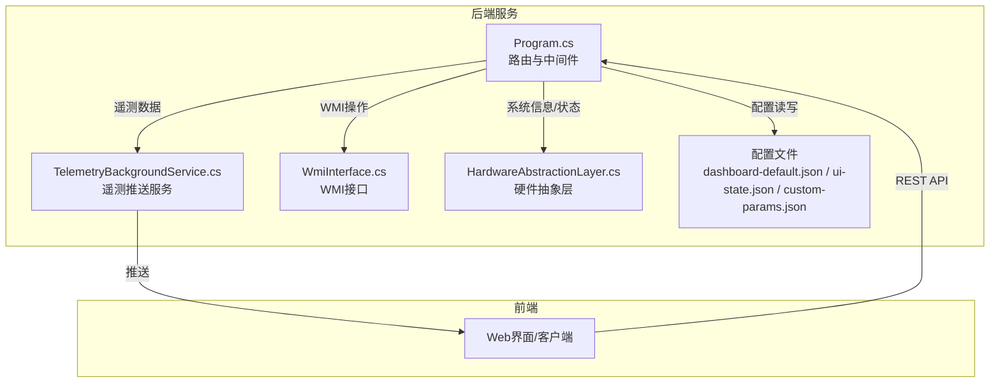
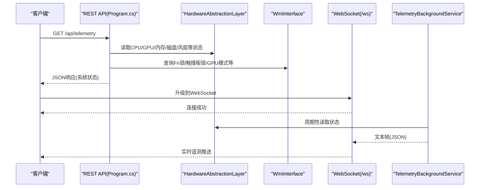
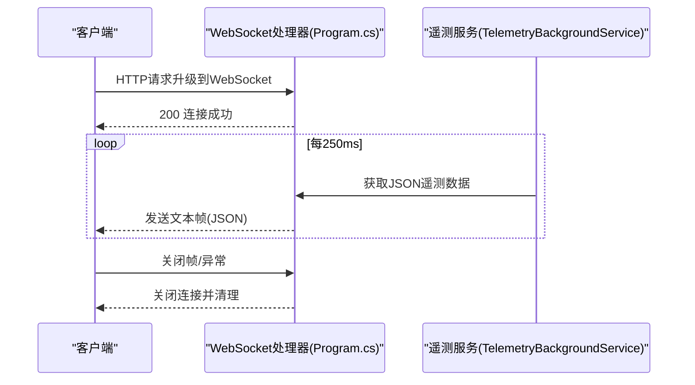
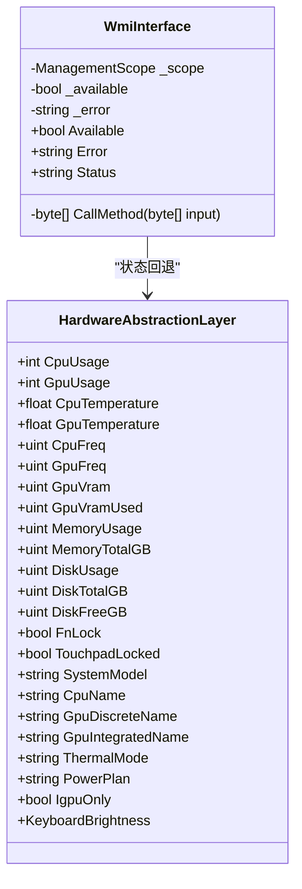
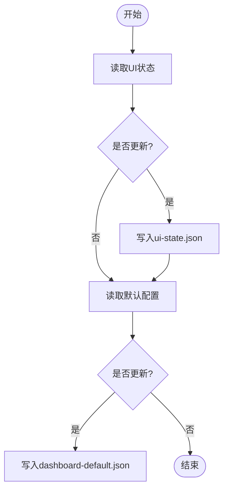
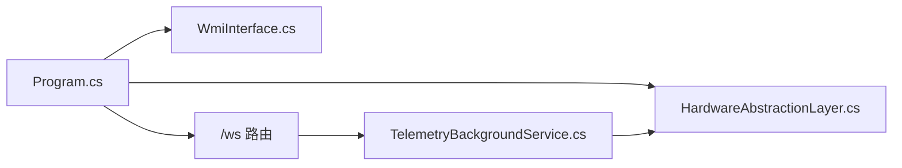

# API参考文档

<cite>
**本文档引用的文件**
- [Program.cs](file://server/api/Program.cs)
- [TelemetryBackgroundService.cs](file://server/api/TelemetryBackgroundService.cs)
- [WmiInterface.cs](file://server/api/WmiInterface.cs)
- [HardwareAbstractionLayer.cs](file://server/hal/HardwareAbstractionLayer.cs)
- [Douzhanzhe.API.http](file://server/api/Douzhanzhe.API.http)
- [appsettings.json](file://server/api/appsettings.json)
- [package.json](file://server/package.json)
- [package-lock.json](file://server/package.json)
- [dashboard-default.json](file://server/config/dashboard-default.json)
- [ui-state.json](file://server/api/config/ui-state.json)
- [custom-params.json](file://server/api/config/custom-params.json)
</cite>

## 目录
1. [简介](#简介)
2. [项目结构](#项目结构)
3. [核心组件](#核心组件)
4. [架构总览](#架构总览)
5. [详细组件分析](#详细组件分析)
6. [依赖关系分析](#依赖关系分析)
7. [性能考虑](#性能考虑)
8. [故障排除指南](#故障排除指南)
9. [结论](#结论)
10. [附录](#附录)

## 简介
本参考文档面向DOUZHANZHE-Control后端API，涵盖以下内容：
- RESTful API端点：HTTP方法、URL模式、请求参数、响应格式
- WebSocket API：连接建立、消息格式、事件类型与实时交互模式
- WMI接口：系统查询、状态获取与配置修改能力
- 使用示例：请求构造、响应解析与错误处理
- 安全机制、认证与访问控制
- 版本管理、向后兼容性与废弃策略

## 项目结构
后端采用.NET 8 Minimal API架构，核心入口在Program.cs中定义路由与中间件；遥测通过后台服务推送至WebSocket客户端；硬件抽象层提供系统状态读取；WMI接口用于特定厂商功能。

图表来源
- [Program.cs:1-200](file://server/api/Program.cs#L1-L200)
- [TelemetryBackgroundService.cs:43-142](file://server/api/TelemetryBackgroundService.cs#L43-L142)
- [WmiInterface.cs:1-51](file://server/api/WmiInterface.cs#L1-L51)
- [HardwareAbstractionLayer.cs:1-69](file://server/hal/HardwareAbstractionLayer.cs#L1-L69)
- [dashboard-default.json](file://server/config/dashboard-default.json)
- [ui-state.json](file://server/api/config/ui-state.json)
- [custom-params.json](file://server/api/config/custom-params.json)

章节来源
- [Program.cs:1-200](file://server/api/Program.cs#L1-L200)
- [package.json](file://server/package.json)

## 核心组件
- REST API路由与端点：在Program.cs中集中定义，包含遥测查询、系统信息、健康检查、UI状态与默认配置等端点。
- WebSocket服务：/ws路径接受WebSocket请求，后台服务周期性推送遥测数据。
- 硬件抽象层(HAL)：封装底层驱动桥接，提供CPU/GPU/内存/磁盘/风扇等系统状态读取。
- WMI接口：通过System.Management访问root/WMI命名空间，提供厂商特定功能的状态查询与控制。
- 配置持久化：通过JSON文件保存UI状态与默认仪表盘配置，支持读取与更新。

章节来源
- [Program.cs:87-143](file://server/api/Program.cs#L87-L143)
- [TelemetryBackgroundService.cs:43-142](file://server/api/TelemetryBackgroundService.cs#L43-L142)
- [WmiInterface.cs:1-51](file://server/api/WmiInterface.cs#L1-L51)
- [HardwareAbstractionLayer.cs:1-69](file://server/hal/HardwareAbstractionLayer.cs#L1-L69)

## 架构总览
后端服务通过Minimal API暴露REST端点与WebSocket通道，遥测数据由后台服务周期性采集并通过WebSocket广播给所有连接的客户端。系统信息与状态查询直接从HAL与WMI获取，配置通过本地JSON文件进行持久化。

图表来源
- [Program.cs:87-143](file://server/api/Program.cs#L87-L143)
- [TelemetryBackgroundService.cs:54-142](file://server/api/TelemetryBackgroundService.cs#L54-L142)
- [WmiInterface.cs:1-51](file://server/api/WmiInterface.cs#L1-L51)
- [HardwareAbstractionLayer.cs:1-69](file://server/hal/HardwareAbstractionLayer.cs#L1-L69)

## 详细组件分析

### REST API端点清单
以下端点均基于Program.cs定义，返回JSON格式响应。请求体仅在POST端点出现。

- GET /api/telemetry
  - 功能：一次性获取当前系统遥测状态
  - 响应字段：包含CPU/GPU使用率、温度、频率、核心数、显存、风扇转速、内存使用、磁盘使用等
  - 依赖：HardwareAbstractionLayer、WmiInterface
  - 示例响应路径：[示例响应结构参考:87-120](file://server/api/Program.cs#L87-L120)

- GET /api/system/info
  - 功能：获取系统硬件基本信息
  - 响应字段：机型、CPU/GPU名称、核心数、频率、内存容量、磁盘容量等
  - 示例响应路径：[示例响应结构参考:121-135](file://server/api/Program.cs#L121-L135)

- GET /api/health
  - 功能：健康检查
  - 响应字段：ok布尔值、时间戳
  - 示例响应路径：[示例响应结构参考:136-143](file://server/api/Program.cs#L136-L143)

- GET /api/ui-state
  - 功能：读取UI状态配置
  - 响应：ui-state.json内容
  - 示例响应路径：[示例响应结构参考:1121-1127](file://server/api/Program.cs#L1121-L1127)

- POST /api/ui-state
  - 功能：更新UI状态配置
  - 请求体：UiState对象
  - 响应：{ ok: boolean, error?: string }
  - 示例请求路径：[示例请求结构参考:1131-1153](file://server/api/Program.cs#L1131-L1153)

- GET /api/default-config
  - 功能：读取默认仪表盘配置
  - 响应：dashboard-default.json内容
  - 示例响应路径：[示例响应结构参考:1157-1163](file://server/api/Program.cs#L1157-L1163)

- POST /api/default-config
  - 功能：更新默认仪表盘配置
  - 请求体：DefaultConfig对象
  - 响应：{ ok: boolean, error?: string }
  - 示例请求路径：[示例请求结构参考:1167-1189](file://server/api/Program.cs#L1167-L1189)

章节来源
- [Program.cs:87-143](file://server/api/Program.cs#L87-L143)
- [Program.cs:1121-1189](file://server/api/Program.cs#L1121-L1189)

### WebSocket API
- 连接建立
  - URL：/ws
  - 升级：HTTP请求升级为WebSocket
  - 返回：若非WebSocket请求，返回400并提示“需要 WebSocket 连接”
  - 成功：接受连接并注册到遥测推送服务

- 消息格式
  - 服务器推送：文本帧，UTF-8编码的JSON字符串
  - 客户端发送：当前实现不处理客户端消息，仅监听关闭帧

- 事件类型与实时交互
  - 服务器主动推送：每约250ms一次，包含全量遥测数据
  - 客户端生命周期：保持连接直到收到关闭帧或异常断开

- 客户端断线处理
  - 服务端检测到无效状态或异常时会清理断线客户端

图表来源
- [Program.cs:56-86](file://server/api/Program.cs#L56-L86)
- [TelemetryBackgroundService.cs:54-142](file://server/api/TelemetryBackgroundService.cs#L54-L142)

章节来源
- [Program.cs:56-86](file://server/api/Program.cs#L56-L86)
- [TelemetryBackgroundService.cs:43-142](file://server/api/TelemetryBackgroundService.cs#L43-L142)

### WMI接口
- 可用性检测
  - 初始化时连接root/WMI命名空间，定位特定实例名
  - 可用性通过Available属性与Status字符串反馈

- 方法调用
  - CallMethod内部执行WMI方法调用，输入输出为字节数组
  - 具体方法如GetFnLock、GetTouchpadLock、GetGpuMode等用于读取状态

- 与HAL的协作
  - 当WMI可用时，优先使用WMI提供的状态（如Fn锁、触摸板锁、GPU模式）
  - 不可用时回退到HAL提供的状态

图表来源
- [WmiInterface.cs:1-51](file://server/api/WmiInterface.cs#L1-L51)
- [HardwareAbstractionLayer.cs:1-69](file://server/hal/HardwareAbstractionLayer.cs#L1-L69)
- [Program.cs:87-143](file://server/api/Program.cs#L87-L143)

章节来源
- [WmiInterface.cs:1-51](file://server/api/WmiInterface.cs#L1-L51)
- [HardwareAbstractionLayer.cs:1-69](file://server/hal/HardwareAbstractionLayer.cs#L1-L69)
- [Program.cs:87-143](file://server/api/Program.cs#L87-L143)

### 配置持久化
- UI状态
  - 读取：GET /api/ui-state
  - 更新：POST /api/ui-state，请求体为UiState对象
  - 存储：ui-state.json

- 默认仪表盘配置
  - 读取：GET /api/default-config
  - 更新：POST /api/default-config，请求体为DefaultConfig对象
  - 存储：dashboard-default.json

- 自定义参数
  - custom-params.json用于存储自定义参数（具体字段以文件内容为准）

图表来源
- [Program.cs:1121-1189](file://server/api/Program.cs#L1121-L1189)
- [ui-state.json](file://server/api/config/ui-state.json)
- [dashboard-default.json](file://server/config/dashboard-default.json)

章节来源
- [Program.cs:1121-1189](file://server/api/Program.cs#L1121-L1189)

## 依赖关系分析
- 运行时依赖
  - .NET 8运行时与Minimal API框架
  - System.Management用于WMI访问
  - Express中间件（Node生态）用于静态资源与开发工具链（与后端服务互补）

- 组件耦合
  - Program.cs依赖HAL与WMI接口以提供系统状态
  - TelemetryBackgroundService依赖HAL进行数据采集
  - WebSocket处理器与遥测服务通过静态集合共享客户端连接

图表来源
- [Program.cs:87-143](file://server/api/Program.cs#L87-L143)
- [TelemetryBackgroundService.cs:54-142](file://server/api/TelemetryBackgroundService.cs#L54-L142)
- [WmiInterface.cs:1-51](file://server/api/WmiInterface.cs#L1-L51)
- [HardwareAbstractionLayer.cs:1-69](file://server/hal/HardwareAbstractionLayer.cs#L1-L69)

章节来源
- [Program.cs:87-143](file://server/api/Program.cs#L87-L143)
- [TelemetryBackgroundService.cs:54-142](file://server/api/TelemetryBackgroundService.cs#L54-L142)

## 性能考虑
- 遥测推送频率：后台服务每250ms推送一次，可根据网络与前端渲染压力调整频率
- JSON序列化：统一使用CamelCase命名策略，减少传输体积
- 客户端清理：自动清理断线客户端，避免阻塞推送循环
- 硬件读取：HAL缓存部分系统状态，降低频繁IO带来的开销

## 故障排除指南
- WebSocket连接失败
  - 确认请求为有效的WebSocket升级
  - 检查服务端日志中关于异常断开的警告
  - 参考路径：[连接与断开逻辑:56-86](file://server/api/Program.cs#L56-L86)，[异常处理:132-142](file://server/api/TelemetryBackgroundService.cs#L132-L142)

- WMI不可用
  - 检查WMI命名空间连接状态与实例存在性
  - 回退到HAL状态读取
  - 参考路径：[WMI初始化与可用性:24-48](file://server/api/WmiInterface.cs#L24-L48)

- 配置更新失败
  - 检查请求体JSON格式与字段匹配
  - 查看响应中的错误信息
  - 参考路径：[UI状态更新:1131-1153](file://server/api/Program.cs#L1131-L1153)，[默认配置更新:1167-1189](file://server/api/Program.cs#L1167-L1189)

- 健康检查失败
  - 检查HAL健康检查返回值
  - 参考路径：[健康检查端点:136-143](file://server/api/Program.cs#L136-L143)

章节来源
- [Program.cs:56-86](file://server/api/Program.cs#L56-L86)
- [TelemetryBackgroundService.cs:132-142](file://server/api/TelemetryBackgroundService.cs#L132-L142)
- [WmiInterface.cs:24-48](file://server/api/WmiInterface.cs#L24-L48)
- [Program.cs:1131-1189](file://server/api/Program.cs#L1131-L1189)
- [Program.cs:136-143](file://server/api/Program.cs#L136-L143)

## 结论
本API提供了完整的系统状态查询、实时遥测推送与配置管理能力。REST端点简洁明确，WebSocket通道保证了低延迟的数据分发。WMI接口增强了对厂商特定功能的支持，并与HAL形成互补。建议在生产环境中结合健康检查与错误日志完善监控与告警。

## 附录

### API使用示例（请求/响应与错误处理）
- 获取系统遥测
  - 请求：GET /api/telemetry
  - 响应：包含CPU/GPU使用率、温度、频率、显存、风扇转速、内存与磁盘使用等字段
  - 参考路径：[响应结构:87-120](file://server/api/Program.cs#L87-L120)

- 更新UI状态
  - 请求：POST /api/ui-state，请求体为UiState对象
  - 响应：{ ok: boolean, error?: string }
  - 参考路径：[请求与响应:1131-1153](file://server/api/Program.cs#L1131-L1153)

- 订阅实时遥测
  - 连接：ws://host/ws
  - 推送：服务器每250ms推送一次JSON文本帧
  - 断开：客户端发送关闭帧或异常断开
  - 参考路径：[WebSocket处理:56-86](file://server/api/Program.cs#L56-L86)，[遥测推送:104-130](file://server/api/TelemetryBackgroundService.cs#L104-L130)

### 安全机制、认证与访问控制
- 当前实现未发现内置认证/授权中间件
- 建议在生产环境启用：
  - HTTPS与反向代理
  - CORS策略限制
  - 访问控制与速率限制
  - 身份认证（如Bearer Token/JWT）
- 参考路径：[应用设置](file://server/api/appsettings.json)

### 版本管理、向后兼容性与废弃策略
- 版本管理
  - 当前未发现显式的API版本号
  - 建议在URL中引入版本前缀（如/api/v1/...），并在变更时保留旧版本一段时间
- 向后兼容性
  - 新增字段应保持默认值，避免破坏现有客户端解析
  - 避免删除或重命名现有字段
- 废弃策略
  - 对于即将废弃的端点，先标记为deprecated，提供迁移指引，最后在后续版本移除

### 开发与调试
- HTTP测试文件
  - Douzhanzhe.API.http可用于快速测试端点
  - 参考路径：[HTTP测试文件](file://server/api/Douzhanzhe.API.http)

- 运行与构建
  - 使用.NET 8 SDK进行编译与运行
  - 参考路径：[包管理与依赖](file://server/package.json)，[依赖锁定](file://server/package-lock.json)