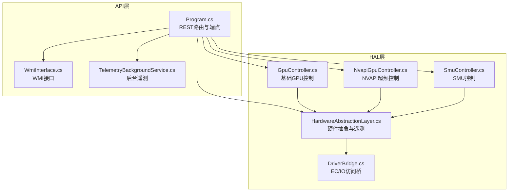
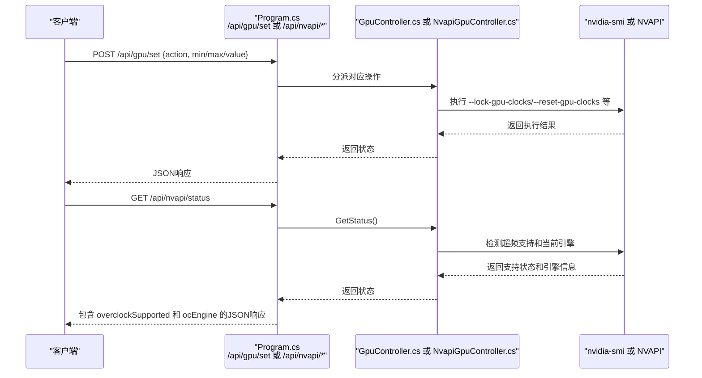
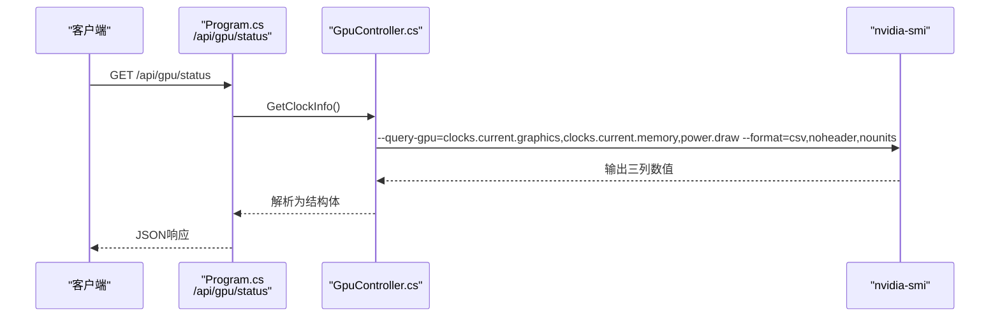
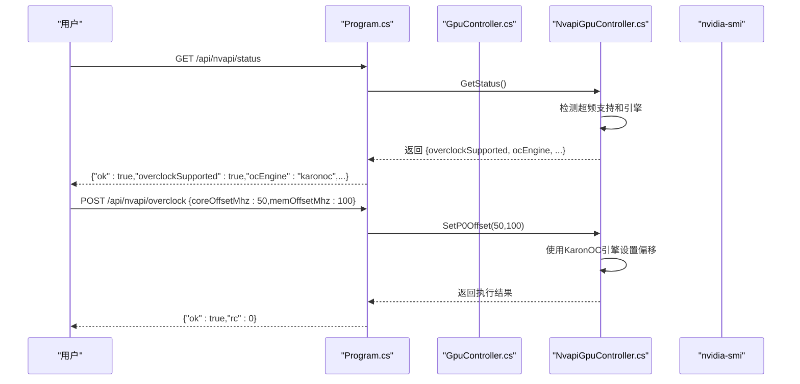
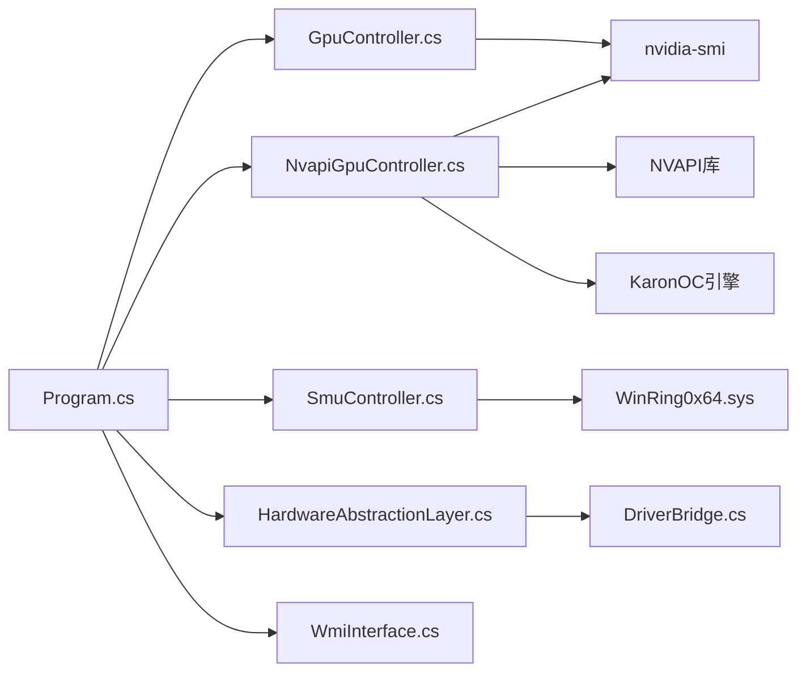

# GPU控制器API

<cite>
**本文档引用的文件**
- [GpuController.cs](file://server/hal/GpuController.cs)
- [Program.cs](file://server/api/Program.cs)
- [HardwareAbstractionLayer.cs](file://server/hal/HardwareAbstractionLayer.cs)
- [WmiInterface.cs](file://server/api/WmiInterface.cs)
- [TelemetryBackgroundService.cs](file://server/api/TelemetryBackgroundService.cs)
- [DriverBridge.cs](file://server/hal/DriverBridge.cs)
- [SmuController.cs](file://server/hal/SmuController.cs)
- [NvapiGpuController.cs](file://server/hal/NvapiGpuController.cs)
- [Douzhanzhe.API.csproj](file://server/api/Douzhanzhe.API.csproj)
</cite>

## 更新摘要
**变更内容**
- 新增NVAPI超频能力检测功能，包括`overclockSupported`和`ocEngine`字段
- 在GPU状态响应中提供超频支持状态和当前引擎信息
- 改善监控应用程序的透明度和超频能力识别

## 目录
1. [简介](#简介)
2. [项目结构](#项目结构)
3. [核心组件](#核心组件)
4. [架构总览](#架构总览)
5. [详细组件分析](#详细组件分析)
6. [依赖关系分析](#依赖关系分析)
7. [性能考虑](#性能考虑)
8. [故障排除指南](#故障排除指南)
9. [结论](#结论)
10. [附录](#附录)

## 简介
本文件面向DOUZHANZHE-Control项目的GPU控制器API，聚焦NVIDIA GPU的控制接口，涵盖以下能力：
- 核心频率锁定与上限限制
- 显存频率锁定与上限限制
- 频率重置
- GPU状态查询、时钟信息获取与功率监控
- **新增**：超频能力检测与当前引擎信息显示
- 提供完整的性能调优示例与兼容性要求说明

该API通过nvidia-smi子进程执行底层控制命令，结合硬件抽象层(HAL)与WMI接口，提供稳定可控的GPU频率管理能力。**新增的NVAPI支持**为高级超频功能提供了更精细的控制选项。

## 项目结构
后端采用ASP.NET Core Web API，核心模块分布如下：
- API层：定义REST接口与路由，负责请求解析、参数校验与响应封装
- HAL层：抽象硬件访问，提供统一的遥测与控制接口
- 控制器层：具体实现GPU、SMU、风扇等设备控制逻辑
- 遥测服务：后台定时推送系统状态至前端

**图表来源**
- [Program.cs:1-839](file://server/api/Program.cs#L1-L839)
- [GpuController.cs:1-116](file://server/hal/GpuController.cs#L1-L116)
- [NvapiGpuController.cs:1-491](file://server/hal/NvapiGpuController.cs#L1-L491)
- [HardwareAbstractionLayer.cs:1-772](file://server/hal/HardwareAbstractionLayer.cs#L1-L772)
- [WmiInterface.cs:1-210](file://server/api/WmiInterface.cs#L1-L210)
- [TelemetryBackgroundService.cs:1-143](file://server/api/TelemetryBackgroundService.cs#L1-L143)
- [DriverBridge.cs:1-150](file://server/hal/DriverBridge.cs#L1-L150)
- [SmuController.cs:1-142](file://server/hal/SmuController.cs#L1-L142)

**章节来源**
- [Program.cs:1-839](file://server/api/Program.cs#L1-L839)
- [Douzhanzhe.API.csproj:1-40](file://server/api/Douzhanzhe.API.csproj#L1-L40)

## 核心组件
- GPU控制器(GpuController)：封装nvidia-smi子进程，提供锁频、限频、重置等操作
- **NVAPI GPU控制器(NvapiGpuController)**：**新增** - 提供超频支持检测、当前引擎信息获取和高级GPU控制功能
- 硬件抽象层(HAL)：统一遥测与系统信息读取，提供GPU温度、频率、显存等数据
- WMI接口：提供系统级控制（如GPU模式、Fn锁、触摸板锁等）
- 后台遥测服务：周期性推送系统状态至前端

**章节来源**
- [GpuController.cs:1-116](file://server/hal/GpuController.cs#L1-L116)
- [NvapiGpuController.cs:1-491](file://server/hal/NvapiGpuController.cs#L1-L491)
- [HardwareAbstractionLayer.cs:1-772](file://server/hal/HardwareAbstractionLayer.cs#L1-L772)
- [WmiInterface.cs:1-210](file://server/api/WmiInterface.cs#L1-L210)
- [TelemetryBackgroundService.cs:1-143](file://server/api/TelemetryBackgroundService.cs#L1-L143)

## 架构总览
GPU控制流程通过API路由进入，根据action分派到GpuController或NvapiGpuController执行相应命令；同时可结合HAL进行状态查询与遥测展示。**新增的NVAPI路径**为超频功能提供了专用的控制通道。

**图表来源**
- [Program.cs:396-447](file://server/api/Program.cs#L396-L447)
- [Program.cs:469-481](file://server/api/Program.cs#L469-L481)
- [GpuController.cs:42-86](file://server/hal/GpuController.cs#L42-L86)
- [NvapiGpuController.cs:421-443](file://server/hal/NvapiGpuController.cs#L421-L443)

**章节来源**
- [Program.cs:396-447](file://server/api/Program.cs#L396-L447)
- [Program.cs:469-481](file://server/api/Program.cs#L469-L481)
- [GpuController.cs:1-116](file://server/hal/GpuController.cs#L1-L116)
- [NvapiGpuController.cs:1-491](file://server/hal/NvapiGpuController.cs#L1-L491)

## 详细组件分析

### GPU控制器API设计
- 请求体字段
  - action：操作类型，支持"lock"/"lock-clocks"、"lock-exact"、"limit"/"limit-max"、"reset"/"reset-clocks"、"lock-memory"/"lock-memory-clocks"、"limit-memory"、"reset-memory"/"reset-memory-clocks"
  - min/max/value：数值参数，用于指定频率上下限或精确频率
- 响应体字段
  - ok：布尔值，表示操作是否成功
  - error：字符串，错误信息（当ok=false时）

**图表来源**
- [Program.cs:396-447](file://server/api/Program.cs#L396-L447)
- [GpuController.cs:42-86](file://server/hal/GpuController.cs#L42-L86)

**章节来源**
- [Program.cs:396-447](file://server/api/Program.cs#L396-L447)
- [GpuController.cs:42-86](file://server/hal/GpuController.cs#L42-L86)

### NVAPI超频控制API设计
**新增** - NVAPI路径提供高级超频功能，包括超频能力检测和当前引擎信息获取。

- 状态端点：GET /api/nvapi/status
- 返回字段
  - ok：布尔值，表示NVAPI是否可用
  - gpuName：GPU名称
  - **overclockSupported**：**新增** - 布尔值，表示是否支持超频
  - **ocEngine**：**新增** - 字符串，当前使用的超频引擎（"karonoc"、"nvapi"或"none"）
  - coreMhz：当前核心频率(MHz)
  - memMhz：当前显存频率(MHz)
  - coreOffsetMhz：核心频率偏移(MHz)
  - memOffsetMhz：显存频率偏移(MHz)
  - powerLimitMw：功率限制(mW)
  - thermalLimitC：温度限制(°C)
  - 其他功率和温度范围信息

- 超频端点：POST /api/nvapi/overclock
- 请求体字段
  - coreOffsetMhz：核心频率偏移(MHz)
  - memOffsetMhz：显存频率偏移(MHz)

**章节来源**
- [Program.cs:469-481](file://server/api/Program.cs#L469-L481)
- [NvapiGpuController.cs:421-443](file://server/hal/NvapiGpuController.cs#L421-L443)

### GPU状态查询与功率监控
- 状态端点：GET /api/gpu/status
- 返回字段
  - coreClockMHz：当前核心频率(MHz)
  - memoryClockMHz：当前显存频率(MHz)
  - powerDrawW：当前功耗(W)
  - baseCoreClockMHz：基准核心频率
  - maxCoreClockMHz：硬件最大核心频率
- 实现原理：调用nvidia-smi查询当前频率与功耗，并解析输出

**图表来源**
- [Program.cs:448-462](file://server/api/Program.cs#L448-L462)
- [GpuController.cs:77-107](file://server/hal/GpuController.cs#L77-L107)

**章节来源**
- [Program.cs:448-462](file://server/api/Program.cs#L448-L462)
- [GpuController.cs:77-107](file://server/hal/GpuController.cs#L77-L107)

### GPU性能调优完整示例
以下示例演示常见的调优流程，建议在具备管理员权限且已安装nvidia驱动的环境中执行：

- 场景一：锁频
  - 动作：lock-exact
  - 参数：value=目标频率(MHz)
  - 适用：需要固定GPU频率以稳定性能或降低噪音
  - 注意：确保目标频率在显卡支持范围内

- 场景二：上限限制
  - 动作：limit-max
  - 参数：value=上限频率(MHz)
  - 适用：允许频率自动调节但不超过设定上限

- 场景三：显存频率限制
  - 动作：limit-memory
  - 参数：value=显存频率(单位：特定数值，参考显卡支持)
  - 适用：限制显存频率以控制发热与功耗

- 场景四：重置
  - 动作：reset-clocks 或 reset-memory-clocks
  - 适用：恢复默认频率策略

- 场景五：状态核对
  - 动作：GET /api/gpu/status
  - 适用：确认当前频率与功耗状态

- **场景六：超频能力检测**（**新增**）
  - 动作：GET /api/nvapi/status
  - 适用：检查GPU是否支持超频以及当前使用的引擎类型
  - 返回：包含overclockSupported和ocEngine字段的状态信息

- **场景七：高级超频控制**（**新增**）
  - 动作：POST /api/nvapi/overclock
  - 参数：coreOffsetMhz、memOffsetMhz
  - 适用：使用KaronOC或NVAPI引擎进行精确的频率偏移控制

**图表来源**
- [Program.cs:469-481](file://server/api/Program.cs#L469-L481)
- [Program.cs:486-491](file://server/api/Program.cs#L486-L491)
- [NvapiGpuController.cs:312-323](file://server/hal/NvapiGpuController.cs#L312-L323)

**章节来源**
- [Program.cs:396-462](file://server/api/Program.cs#L396-L462)
- [Program.cs:469-491](file://server/api/Program.cs#L469-L491)
- [GpuController.cs:42-86](file://server/hal/GpuController.cs#L42-L86)
- [NvapiGpuController.cs:312-323](file://server/hal/NvapiGpuController.cs#L312-L323)

### 兼容性要求与注意事项
- 系统与驱动
  - 需要Windows平台与已安装NVIDIA驱动
  - nvidia-smi需在PATH中可执行
  - **NVAPI功能需要相应的NVAPI库和权限**
- 权限要求
  - 需要管理员权限以执行频率锁定与重置
  - **超频功能可能需要额外的权限或驱动支持**
- 参数范围
  - 频率参数需在显卡支持范围内，否则nvidia-smi会拒绝
  - **超频偏移值需在GPU支持的范围内**
- 超时与错误处理
  - nvidia-smi执行存在超时机制，超时或非零退出码会抛出异常
  - **NVAPI调用可能因权限或驱动问题而失败**
- 并发与稳定性
  - 频率调整可能影响系统稳定性，建议在测试环境先行验证
  - **超频操作风险更高，可能导致系统不稳定或硬件损坏**

**章节来源**
- [GpuController.cs:12-40](file://server/hal/GpuController.cs#L12-L40)
- [NvapiGpuController.cs:168-250](file://server/hal/NvapiGpuController.cs#L168-L250)

## 依赖关系分析
- 组件耦合
  - API层通过依赖注入使用GpuController、NvapiGpuController与SmuController
  - GpuController依赖nvidia-smi子进程执行命令
  - **NvapiGpuController依赖NVAPI库和KaronOC引擎（可选）**
  - HAL层提供系统信息与遥测，被API层与遥测服务共享
- 外部依赖
  - nvidia-smi：NVIDIA官方工具，用于频率与功耗查询/控制
  - **NVAPI：NVIDIA官方API，用于高级GPU控制和超频**
  - WMI：系统级控制接口（如GPU模式、Fn锁等）
  - WinRing0：SMU控制所需的内核驱动（可选）

**图表来源**
- [Program.cs:1-839](file://server/api/Program.cs#L1-L839)
- [GpuController.cs:1-116](file://server/hal/GpuController.cs#L1-L116)
- [NvapiGpuController.cs:168-250](file://server/hal/NvapiGpuController.cs#L168-L250)
- [SmuController.cs:1-142](file://server/hal/SmuController.cs#L1-L142)
- [HardwareAbstractionLayer.cs:1-772](file://server/hal/HardwareAbstractionLayer.cs#L1-L772)
- [DriverBridge.cs:1-150](file://server/hal/DriverBridge.cs#L1-L150)

**章节来源**
- [Program.cs:1-839](file://server/api/Program.cs#L1-L839)
- [Douzhanzhe.API.csproj:1-40](file://server/api/Douzhanzhe.API.csproj#L1-L40)

## 性能考虑
- 频率锁定与上限限制
  - 锁定频率可减少波动，提升稳定性；但可能牺牲部分性能
  - 限频可在保证性能的同时控制发热与功耗
- **超频功能**
  - **NVAPI路径提供更精细的频率控制，但可能增加系统复杂性**
  - **超频操作需要权衡性能提升与稳定性风险**
- 功率监控
  - 通过nvidia-smi查询功耗，结合温度监控避免过热
  - **NVAPI路径提供更全面的功率和温度监控能力**
- 遥测频率
  - 后台遥测每250ms推送一次，兼顾实时性与系统开销

## 故障排除指南
- nvidia-smi超时或失败
  - 检查nvidia-smi是否在PATH中，确认驱动安装正确
  - 确认以管理员权限运行
- 频率设置无效
  - 确认输入频率在显卡支持范围内
  - 尝试先reset再重新设置
- **超频功能异常**（**新增**）
  - **检查NVAPI库是否正确安装和加载**
  - **确认KaronOC引擎是否存在且可访问**
  - **验证GPU是否实际支持超频功能**
- 状态查询异常
  - 若HAL回退到nvidia-smi查询，可能受网络/权限影响
  - 检查防火墙与杀毒软件拦截
- **NVAPI初始化失败**（**新增**）
  - **确认NVIDIA驱动版本支持NVAPI**
  - **检查系统权限和安全软件设置**

**章节来源**
- [GpuController.cs:12-40](file://server/hal/GpuController.cs#L12-L40)
- [HardwareAbstractionLayer.cs:147-195](file://server/hal/HardwareAbstractionLayer.cs#L147-L195)
- [NvapiGpuController.cs:168-250](file://server/hal/NvapiGpuController.cs#L168-L250)

## 结论
DOUZHANZHE-Control的GPU控制器API通过简洁的REST接口与nvidia-smi集成，提供了核心频率锁定、显存频率限制与频率重置等关键能力。**新增的NVAPI支持**进一步增强了系统的超频控制能力，通过`overclockSupported`和`ocEngine`字段为客户端提供了超频能力检测和当前引擎信息，显著改善了监控应用程序的透明度。配合状态查询与功率监控，可实现较为完善的GPU性能调优方案。建议在测试环境充分验证后再应用于生产环境，并严格遵循权限与兼容性要求。

## 附录

### API端点一览
- POST /api/gpu/set
  - 请求体：action、min、max、value
  - 响应：ok、error
- GET /api/gpu/status
  - 响应：coreClockMHz、memoryClockMHz、powerDrawW、baseCoreClockMHz、maxCoreClockMHz
- **GET /api/nvapi/status**（**新增**）
  - 响应：ok、gpuName、**overclockSupported**（**新增**）、**ocEngine**（**新增**）、coreMhz、memMhz、coreOffsetMhz、memOffsetMhz、powerLimitMw、thermalLimitC等
- **POST /api/nvapi/overclock**（**新增**）
  - 请求体：coreOffsetMhz、memOffsetMhz
  - 响应：ok、rc

**章节来源**
- [Program.cs:396-462](file://server/api/Program.cs#L396-L462)
- [Program.cs:469-491](file://server/api/Program.cs#L469-L491)
- [GpuController.cs:42-86](file://server/hal/GpuController.cs#L42-L86)
- [NvapiGpuController.cs:421-443](file://server/hal/NvapiGpuController.cs#L421-L443)

### 超频能力检测说明
**新增** - 通过`/api/nvapi/status`端点提供的超频能力检测功能，客户端可以：
- **判断GPU是否支持超频操作**
- **了解当前使用的超频引擎类型**（KaronOC或NVAPI）
- **根据检测结果决定是否启用高级超频功能**
- **为用户提供透明的超频能力反馈**

**章节来源**
- [Program.cs:469-481](file://server/api/Program.cs#L469-L481)
- [NvapiGpuController.cs:183-184](file://server/hal/NvapiGpuController.cs#L183-L184)
- [NvapiGpuController.cs:421-443](file://server/hal/NvapiGpuController.cs#L421-L443)