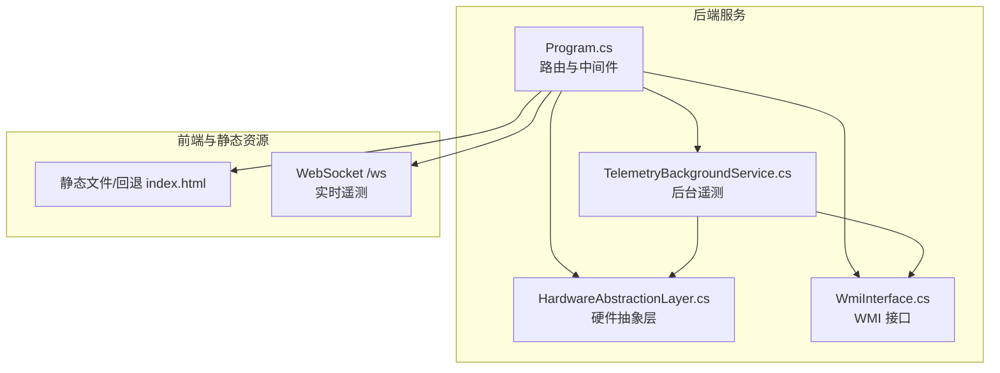
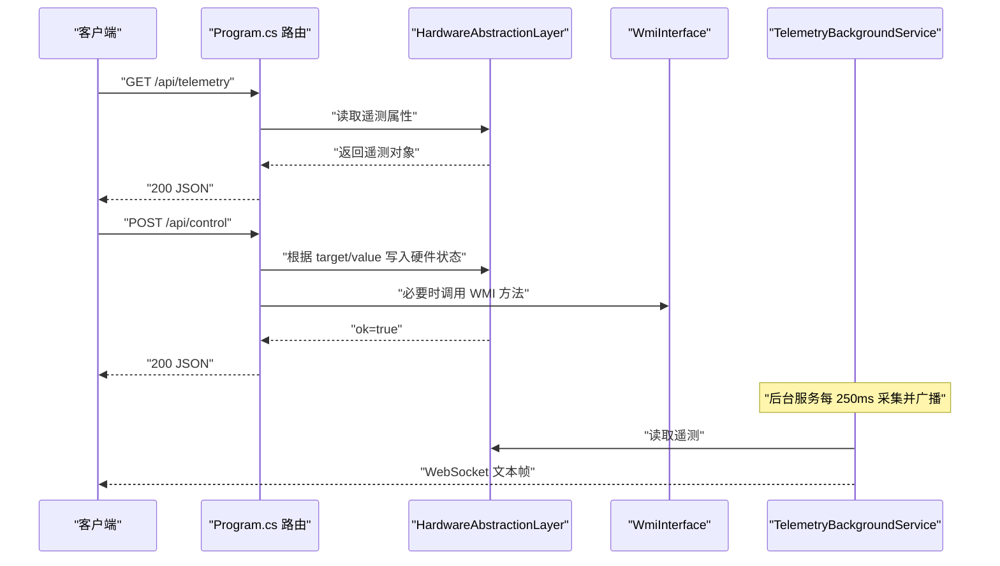
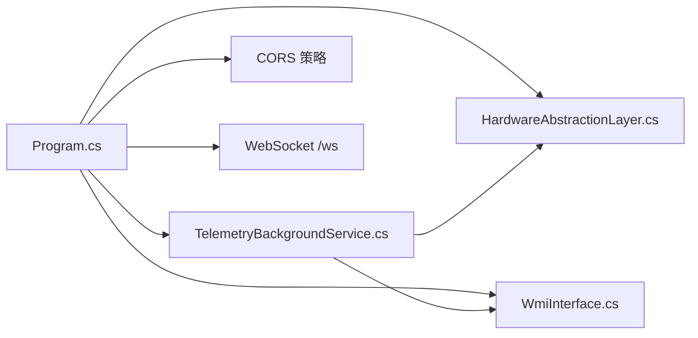

# RESTful API

<cite>
**本文引用的文件**
- [Program.cs](file://server/api/Program.cs)
- [WmiInterface.cs](file://server/api/WmiInterface.cs)
- [HardwareAbstractionLayer.cs](file://server/hal/HardwareAbstractionLayer.cs)
- [TelemetryBackgroundService.cs](file://server/api/TelemetryBackgroundService.cs)
- [appsettings.json](file://server/api/appsettings.json)
- [Douzhanzhe.API.http](file://server/api/Douzhanzhe.API.http)
- [custom-params.json](file://server/api/config/custom-params.json)
- [dashboard-default.json](file://server/config/dashboard-default.json)
- [dev-api.md](file://docs/dev-api.md)
</cite>

## 目录
1. [简介](#简介)
2. [项目结构](#项目结构)
3. [核心组件](#核心组件)
4. [架构总览](#架构总览)
5. [详细端点规范](#详细端点规范)
6. [依赖关系分析](#依赖关系分析)
7. [性能与可靠性](#性能与可靠性)
8. [故障排查指南](#故障排查指南)
9. [结论](#结论)
10. [附录](#附录)

## 简介
本文件为 DOUZHANZHE-Control 的后端 RESTful API 与 WebSocket 遥测接口的权威文档。内容覆盖遥测数据、系统信息、健康检查、硬件控制、风扇与 GPU 控制、SMU 参数设置、WMI 命令通道、以及配置持久化等端点。文档同时说明认证、CORS、安全与版本管理策略，并给出调用流程图与时序图，帮助开发者快速集成与排障。

## 项目结构
后端采用 ASP.NET Core Minimal API 架构，核心入口位于 Program.cs，通过 Map 路由注册各类端点；遥测通过后台服务周期性采集并通过 WebSocket 推送；硬件抽象层 HAL 提供统一的底层硬件访问接口；WMI 接口封装 ACPI MICommonInterface 方法以实现系统级控制。

图表来源
- [Program.cs:15-22](file://server/api/Program.cs#L15-L22)
- [TelemetryBackgroundService.cs:17-40](file://server/api/TelemetryBackgroundService.cs#L17-L40)
- [HardwareAbstractionLayer.cs:19-52](file://server/hal/HardwareAbstractionLayer.cs#L19-L52)
- [WmiInterface.cs:18-48](file://server/api/WmiInterface.cs#L18-L48)

章节来源
- [Program.cs:15-22](file://server/api/Program.cs#L15-L22)
- [TelemetryBackgroundService.cs:17-40](file://server/api/TelemetryBackgroundService.cs#L17-L40)

## 核心组件
- 硬件抽象层（HAL）：提供遥测读取与系统开关控制（电源计划、散热模式、键盘背光、Fn/Num/Caps 锁、触摸板锁、集显模式等），并封装 EC 寄存器访问与 SMU 通信接口。
- WMI 接口：通过 root\WMI 的 MICommonInterface 实现系统级控制（如 GPU 模式、Fn/触摸板锁、风扇手动模式与目标转速等）。
- 后台遥测服务：每 250ms 采集一次遥测数据，通过 WebSocket 广播给所有连接的客户端。
- 配置持久化：基于 JSON 文件的读写辅助函数，支持自定义参数、UI 状态、默认仪表盘布局等。

章节来源
- [HardwareAbstractionLayer.cs:19-767](file://server/hal/HardwareAbstractionLayer.cs#L19-L767)
- [WmiInterface.cs:18-210](file://server/api/WmiInterface.cs#L18-L210)
- [TelemetryBackgroundService.cs:17-142](file://server/api/TelemetryBackgroundService.cs#L17-L142)
- [Program.cs:29-55](file://server/api/Program.cs#L29-L55)

## 架构总览
后端服务启动时启用 CORS、WebSocket、静态文件与回退策略；所有 API 路由集中于 Program.cs 中的 Map 调用；遥测通过后台服务周期性推送，前端可选择轮询或订阅 WebSocket。

图表来源
- [Program.cs:87-120](file://server/api/Program.cs#L87-L120)
- [Program.cs:144-202](file://server/api/Program.cs#L144-L202)
- [TelemetryBackgroundService.cs:54-141](file://server/api/TelemetryBackgroundService.cs#L54-L141)
- [HardwareAbstractionLayer.cs:575-742](file://server/hal/HardwareAbstractionLayer.cs#L575-L742)
- [WmiInterface.cs:50-60](file://server/api/WmiInterface.cs#L50-L60)

## 详细端点规范

### 通用约定
- 主机与端口：默认监听本地回环，具体主机地址可在 HTTP 请求文件中配置。
- 内容类型：JSON；请求体需设置 Content-Type: application/json。
- 编码：UTF-8。
- 响应格式：成功通常返回 JSON 对象；失败返回 ProblemDetails 或错误消息 JSON。
- 状态码：遵循常见 REST 约定；部分端点返回 200 包含 ok 字段表示业务逻辑错误。

章节来源
- [Douzhanzhe.API.http:1-7](file://server/api/Douzhanzhe.API.http#L1-L7)
- [Program.cs:15-18](file://server/api/Program.cs#L15-L18)

### GET /api/telemetry
- 描述：返回全量系统遥测数据，包含 CPU/GPU 使用率、温度、频率、风扇转速、内存与磁盘使用情况、系统开关状态等。
- 认证：无。
- CORS：允许任意来源/方法/头。
- 响应字段（摘要）：
  - cpuUsage, cpuTemp, cpuFreq, cpuCores, gpuUsage, gpuTemp, gpuFreq, gpuVram, gpuVramUsed, fanLargeRpm, fanSmallRpm, fanLargeMax, fanSmallMax, memoryUsage, memoryTotalGB, memoryFreq, diskUsage, diskTotalGB, diskFreeGB, kbBrightness, fnLock, numLock, capsLock, thermalMode, powerPlan, touchpadLock, igpuOnly, gpuMode。
- 示例请求：GET /api/telemetry
- 示例响应：见“响应示例”章节
- 错误：内部异常时返回 500（ProblemDetails）

章节来源
- [Program.cs:87-120](file://server/api/Program.cs#L87-L120)
- [HardwareAbstractionLayer.cs:575-742](file://server/hal/HardwareAbstractionLayer.cs#L575-L742)

### GET /api/system/info
- 描述：返回系统硬件信息（机型、CPU/GPU 名称、内存容量与频率、磁盘容量等）。
- 认证：无。
- CORS：允许任意来源/方法/头。
- 响应字段：systemModel, cpuName, cpuCores, cpuFreq, gpuDiscrete, gpuIntegrated, memoryTotalGB, memoryFreq, diskTotalGB。
- 示例请求：GET /api/system/info
- 示例响应：见“响应示例”章节
- 错误：内部异常时返回 500

章节来源
- [Program.cs:121-135](file://server/api/Program.cs#L121-L135)
- [HardwareAbstractionLayer.cs:451-569](file://server/hal/HardwareAbstractionLayer.cs#L451-L569)

### GET /api/health
- 描述：执行健康检查，返回系统状态与时间戳。
- 认证：无。
- CORS：允许任意来源/方法/头。
- 响应字段：ok（布尔）、timestamp（毫秒时间戳）。
- 示例请求：GET /api/health
- 示例响应：见“响应示例”章节
- 错误：内部异常时返回 500

章节来源
- [Program.cs:136-143](file://server/api/Program.cs#L136-L143)
- [HardwareAbstractionLayer.cs:749-760](file://server/hal/HardwareAbstractionLayer.cs#L749-L760)

### POST /api/control
- 描述：硬件控制统一入口，支持多种 target/value 组合。
- 认证：无。
- CORS：允许任意来源/方法/头。
- 请求体：{ target: string, value: int }
- 支持的 target：
  - kb_light: 0-3（键盘背光等级）
  - fn_lock: 0/1（Fn 锁）
  - num_lock: 0/1（数字键锁定）
  - caps_lock: 0/1（大写锁定）
  - touchpad_lock: 0/1（触摸板锁定）
  - power_plan: 0/1/2（电源计划：平衡/高性能/节能）
  - thermal_mode: 0-3（散热模式：均衡/野兽/安静/斗战）
  - igpu_only: 0/1（仅集显模式）
  - gpu_mode: 0-2（GPU 模式：混合/集显/独显）
  - ec_write:<regHex>: 将 value 写入指定 EC 寄存器（regHex 以 0x 开头的十六进制）
- 成功返回：{ ok: true }
- 失败返回：{ ok: false, error: "<message>" } 或 400/500（ProblemDetails）
- 示例请求：POST /api/control { "target": "kb_light", "value": 3 }
- 示例响应：见“响应示例”章节
- 错误处理：
  - 未知 target：400
  - WMI 设置失败（如 gpu_mode）：500
  - 异常：500

章节来源
- [Program.cs:144-202](file://server/api/Program.cs#L144-L202)

### GET /api/discover
- 描述：硬件探测，返回可用性、EC 基址、驱动加载状态与触摸板可用性。
- 认证：无。
- CORS：允许任意来源/方法/头。
- 响应字段：available（布尔）、ecBase（字符串）、driverLoaded（布尔）、touchpad（布尔）。
- 示例请求：GET /api/discover
- 示例响应：见“响应示例”章节
- 错误：内部异常时返回 500

章节来源
- [Program.cs:203-212](file://server/api/Program.cs#L203-L212)

### GET /api/ec-scan
- 描述：扫描 EC 寄存器范围，返回指定 offset/count 的寄存器值。
- 认证：无。
- CORS：允许任意来源/方法/头。
- 查询参数：
  - offset: 起始偏移（十进制或 0x 前缀十六进制，默认 0）
  - count: 扫描长度（1-64，默认 16）
- 成功返回：{ ecBase, offset, count, results: [{ offset, value }] }
- 失败返回：{ error: "<message>" }（400）
- 示例请求：GET /api/ec-scan?offset=0&count=16
- 示例响应：见“响应示例”章节
- 错误：参数解析异常或越界时返回 400

章节来源
- [Program.cs:213-237](file://server/api/Program.cs#L213-L237)

### POST /api/smu/set
- 描述：设置 SMU 参数（通过子进程调用）。
- 认证：无。
- CORS：允许任意来源/方法/头。
- 请求体：{ parameter: string, valueM: int }
- 支持的 parameter：
  - stapm_limit / power_limit: 长时功耗（单位 mW）
  - short_power_limit: 短时功耗（单位 mW）
  - tctl_temp / temp_limit: 温度墙（摄氏度）
  - co_all: 电压曲线优化（mV）
  - cpu_freq_limit: CPU 频率限制（MHz）
  - turbo_disable: 是否禁用睿频（0/1）
- 成功返回：{ ok: true, rc: int }
- 失败返回：{ ok: false, error: "<message>" }
- 示例请求：POST /api/smu/set { "parameter": "power_limit", "valueM": 65000 }
- 示例响应：见“响应示例”章节
- 错误：内部异常时返回 500

章节来源
- [Program.cs:238-274](file://server/api/Program.cs#L238-L274)

### POST /api/smu/raw
- 描述：发送原始 SMU 命令（通过子进程）。
- 认证：无。
- CORS：允许任意来源/方法/头。
- 请求体：{ cmd: uint, arg0: uint }
- 成功返回：{ ok: true, cmd, arg0, response: string }
- 失败返回：{ ok: false, error: "<message>" }
- 示例请求：POST /api/smu/raw { "cmd": 0x4f, "arg0": 65000 }
- 示例响应：见“响应示例”章节
- 错误：内部异常时返回 500

章节来源
- [Program.cs:275-286](file://server/api/Program.cs#L275-L286)

### GET /api/smu/probe
- 描述：探测 SMU 可用性（通过子进程）。
- 认证：无。
- CORS：允许任意来源/方法/头。
- 成功返回：{ ok: true, source: "ryzenadj" }
- 失败返回：{ ok: false, error: "<message>", source: "ryzenadj" }
- 示例请求：GET /api/smu/probe
- 示例响应：见“响应示例”章节
- 错误：内部异常时返回 500

章节来源
- [Program.cs:287-298](file://server/api/Program.cs#L287-L298)

### GET /api/pci/probe
- 描述：探测 PCI 设备（识别 AMD 设备）。
- 认证：无。
- CORS：允许任意来源/方法/头。
- 成功返回：{ ok: true, vendorId, deviceId, isAmd: boolean }
- 失败返回：{ ok: false, error: "<message>" }
- 示例请求：GET /api/pci/probe
- 示例响应：见“响应示例”章节
- 错误：内部异常时返回 500

章节来源
- [Program.cs:299-314](file://server/api/Program.cs#L299-L314)

### GET /api/smu/status
- 描述：查询 SMU 能力与探测状态。
- 认证：无。
- CORS：允许任意来源/方法/头。
- 成功返回：{ ok: true, probe: boolean, source: "ryzenadj", capabilities: object }
- 失败返回：{ ok: false, error: "<message>", source: "ryzenadj" }
- 示例请求：GET /api/smu/status
- 示例响应：见“响应示例”章节
- 错误：内部异常时返回 500

章节来源
- [Program.cs:315-327](file://server/api/Program.cs#L315-L327)

### GET /api/smu/read-reg
- 描述：读取 SMN 寄存器值。
- 认证：无。
- CORS：允许任意来源/方法/头。
- 查询参数：addr（十六进制字符串，0x 前缀可选）
- 成功返回：{ ok: true, addr, value }
- 失败返回：{ ok: false, error: "<message>" }
- 示例请求：GET /api/smu/read-reg?addr=0x1234abcd
- 示例响应：见“响应示例”章节
- 错误：内部异常时返回 500

章节来源
- [Program.cs:328-344](file://server/api/Program.cs#L328-L344)

### POST /api/fan/set-target
- 描述：设置风扇目标转速（WMI Bellator 协议）。
- 认证：无。
- CORS：允许任意来源/方法/头。
- 请求体：{ largeRpm?: int, smallRpm?: int }
- 成功返回：{ ok: true }
- 失败返回：{ ok: false, error: "<message>" }（500）
- 注意：先启用手动模式，再设置目标转速。
- 示例请求：POST /api/fan/set-target { "largeRpm": 3600, "smallRpm": 6200 }
- 示例响应：见“响应示例”章节
- 错误：内部异常时返回 500

章节来源
- [Program.cs:345-367](file://server/api/Program.cs#L345-L367)
- [WmiInterface.cs:137-169](file://server/api/WmiInterface.cs#L137-L169)

### POST /api/fan/restore
- 描述：恢复固件对风扇的控制。
- 认证：无。
- CORS：允许任意来源/方法/头。
- 请求体：无
- 成功返回：{ ok: true }
- 失败返回：{ ok: false, error: "<message>" }
- 示例请求：POST /api/fan/restore
- 示例响应：见“响应示例”章节
- 错误：内部异常时返回 500

章节来源
- [Program.cs:368-379](file://server/api/Program.cs#L368-L379)
- [WmiInterface.cs:137-153](file://server/api/WmiInterface.cs#L137-L153)

### GET /api/fan/status
- 描述：查询风扇状态（WMI Bellator GET）。
- 认证：无。
- CORS：允许任意来源/方法/头。
- 成功返回：{ ok: true, manualEnabled: boolean, largeRpmTarget: int, smallRpmTarget: int }
- 失败返回：{ ok: false, error: "<message>" }
- 示例请求：GET /api/fan/status
- 示例响应：见“响应示例”章节
- 错误：内部异常时返回 500

章节来源
- [Program.cs:381-394](file://server/api/Program.cs#L381-L394)
- [WmiInterface.cs:171-198](file://server/api/WmiInterface.cs#L171-L198)

### POST /api/gpu/set
- 描述：设置 NVIDIA GPU 频率与显存频率（通过 nvidia-smi 子进程）。
- 认证：无。
- CORS：允许任意来源/方法/头。
- 请求体：{ action: string, min?: int, max?: int, value?: int }
- 支持的 action：
  - lock / lock-clocks: 锁定核心频率（min/max 或 value）
  - lock-exact: 精确锁定核心频率（value）
  - limit / limit-max: 设置核心频率上限（value 或 max）
  - reset / reset-clocks: 重置核心频率
  - lock-memory / lock-memory-clocks: 锁定显存频率（min/max）
  - limit-memory: 设置显存频率上限（value 或 max）
  - reset-memory / reset-memory-clocks: 重置显存频率
- 成功返回：{ ok: true }
- 失败返回：{ ok: false, error: "<message>" }
- 示例请求：POST /api/gpu/set { "action": "lock-exact", "value": 2700 }
- 示例响应：见“响应示例”章节
- 错误：内部异常时返回 500

章节来源
- [Program.cs:396-447](file://server/api/Program.cs#L396-L447)

### GET /api/gpu/status
- 描述：查询 GPU 当前状态（核心/显存频率、功耗、基础与最大核心频率）。
- 认证：无。
- CORS：允许任意来源/方法/头。
- 成功返回：{ ok: true, coreClockMHz, memoryClockMHz, powerDrawW, baseCoreClockMHz, maxCoreClockMHz }
- 失败返回：{ ok: false, error: "<message>" }
- 示例请求：GET /api/gpu/status
- 示例响应：见“响应示例”章节
- 错误：内部异常时返回 500

章节来源
- [Program.cs:448-461](file://server/api/Program.cs#L448-L461)

### POST /api/wmi/cmd
- 描述：发送通用 WMI 命令（方法号 + 可选值）。
- 认证：无。
- CORS：允许任意来源/方法/头。
- 请求体：{ method: int, value?: int }
- 成功返回：{ ok: true, method, value, response: string, outValue?: int }
- 失败返回：{ ok: false, error: "<message>" }
- 示例请求：POST /api/wmi/cmd { "method": 9, "value": 1 }
- 示例响应：见“响应示例”章节
- 错误：内部异常时返回 500

章节来源
- [Program.cs:504-518](file://server/api/Program.cs#L504-L518)
- [WmiInterface.cs:200-208](file://server/api/WmiInterface.cs#L200-L208)

### 废弃端点
以下端点已废弃，建议迁移至新端点：
- POST /api/system/settings → 使用 /api/control 替代
- POST /api/fan/full-speed → 使用 /api/fan/set-target 手动控制风扇

章节来源
- [Program.cs:519-533](file://server/api/Program.cs#L519-L533)

### 配置持久化端点
- GET /api/custom-params → 读取自定义参数（custom-params.json）
- POST /api/custom-params → 写入自定义参数（custom-params.json）
- GET /api/ui-state → 读取 UI 状态（ui-state.json）
- POST /api/ui-state → 写入 UI 状态（ui-state.json）
- GET /api/default-config → 读取默认仪表盘配置（dashboard-default.json）
- POST /api/default-config → 写入默认仪表盘配置（dashboard-default.json）

章节来源
- [Program.cs:538-584](file://server/api/Program.cs#L538-L584)
- [custom-params.json:1-22](file://server/api/config/custom-params.json#L1-L22)
- [dashboard-default.json:1-7](file://server/config/dashboard-default.json#L1-L7)

### 自动启动端点
- GET /api/auto-start → 查询开机自启任务是否存在
- POST /api/auto-start → 创建/删除开机自启任务（需要 { enabled: boolean }）
- GET /api/auto-start-opts → 读取最小化偏好
- POST /api/auto-start-opts → 写入最小化偏好（需要 { minimized: boolean }）

章节来源
- [Program.cs:586-686](file://server/api/Program.cs#L586-L686)

### WebSocket 遥测
- 路径：/ws
- 描述：建立 WebSocket 连接后，后台服务每 250ms 推送一次全量遥测 JSON。
- 客户端职责：接收文本帧并解析 JSON；断线自动重连。
- 注意：仅支持 WebSocket 请求，否则返回 400。

章节来源
- [Program.cs:56-86](file://server/api/Program.cs#L56-L86)
- [TelemetryBackgroundService.cs:54-141](file://server/api/TelemetryBackgroundService.cs#L54-L141)

## 依赖关系分析
- Program.cs 依赖 HAL 与 WMI 接口进行硬件读写与控制；依赖后台遥测服务进行周期性推送；启用 CORS、WebSocket、静态文件与回退。
- HAL 封装 EC 寄存器访问、SMU 通信、系统信息查询与遥测缓存。
- WMI 接口封装 MICommonInterface 方法，用于 GPU 模式、Fn/触摸板锁、风扇控制等。
- 配置持久化通过 JSON 文件读写辅助函数实现。

图表来源
- [Program.cs:10-18](file://server/api/Program.cs#L10-L18)
- [TelemetryBackgroundService.cs:17-40](file://server/api/TelemetryBackgroundService.cs#L17-L40)

章节来源
- [Program.cs:10-18](file://server/api/Program.cs#L10-L18)
- [HardwareAbstractionLayer.cs:19-52](file://server/hal/HardwareAbstractionLayer.cs#L19-L52)
- [WmiInterface.cs:18-48](file://server/api/WmiInterface.cs#L18-L48)

## 性能与可靠性
- 遥测采集：后台服务每 250ms 采集一次，避免频繁系统调用；HAL 对部分遥测结果做了缓存与去抖。
- WMI 调用：WMI 方法调用可能阻塞，建议在高频场景下合并请求或使用轮询替代。
- 子进程调用：SMU 与 nvidia-smi 通过子进程执行，注意进程启动与超时控制。
- CORS：默认允许任意来源/方法/头，生产部署建议收紧策略。
- 静态文件与回退：启用静态文件服务与 index.html 回退，便于前端 SPA 集成。

章节来源
- [TelemetryBackgroundService.cs:54-141](file://server/api/TelemetryBackgroundService.cs#L54-L141)
- [HardwareAbstractionLayer.cs:575-742](file://server/hal/HardwareAbstractionLayer.cs#L575-L742)
- [Program.cs:15-22](file://server/api/Program.cs#L15-L22)

## 故障排查指南
- 健康检查失败：检查 HAL 的 HealthCheck 返回值与异常日志。
- WMI 方法失败：确认 MICommonInterface 可用性与权限；部分方法可能抛出异常导致 500。
- SMU 子进程失败：确认 ryzenadj 可用与权限；查看返回的 error 字段。
- nvidia-smi 失败：确认 NVIDIA 驱动与 nvidia-smi 可用；查看返回的 error 字段。
- CORS 问题：确认已启用 app.UseCors()，并检查浏览器跨域错误。
- WebSocket 无法连接：确认请求为 WebSocket，且端口与路径正确；查看后台日志。

章节来源
- [Program.cs:15-18](file://server/api/Program.cs#L15-L18)
- [WmiInterface.cs:24-48](file://server/api/WmiInterface.cs#L24-L48)
- [TelemetryBackgroundService.cs:54-141](file://server/api/TelemetryBackgroundService.cs#L54-L141)

## 结论
本 API 以 HAL 为核心抽象，结合 WMI 与子进程能力，提供了全面的硬件遥测与控制能力。通过后台遥测服务与 WebSocket，实现了低延迟的实时监控体验。建议在生产环境中收紧 CORS 策略、增强异常处理与日志记录，并对高频调用进行节流与缓存优化。

## 附录

### 认证机制
- 默认未启用任何认证/授权中间件；所有端点均为公开访问。
- 建议在生产环境启用 JWT、API Key 或基于 IP 的访问控制。

章节来源
- [Program.cs:15-18](file://server/api/Program.cs#L15-L18)

### CORS 配置
- 默认策略允许任意来源、方法与头。
- 生产环境建议限定来源与方法，仅暴露必要端点。

章节来源
- [Program.cs:15-16](file://server/api/Program.cs#L15-L16)
- [appsettings.json](file://server/api/appsettings.json#L8)

### 安全考虑
- 硬件控制涉及系统稳定性与安全，建议：
  - 限制调用来源（IP 白名单）
  - 对敏感操作增加二次确认
  - 为关键端点增加鉴权与审计日志
  - 严格校验请求参数范围与类型

章节来源
- [Program.cs:15-18](file://server/api/Program.cs#L15-L18)

### API 版本管理与兼容性
- 当前未实现显式的 API 版本号（如 /api/v1/...）。
- 兼容性策略：
  - 新增端点在现有文档末尾追加
  - 废弃端点保留定义并在响应中提示迁移
  - 保持请求/响应字段命名一致性（camelCase）

章节来源
- [dev-api.md:1-8](file://docs/dev-api.md#L1-L8)

### 请求与响应示例（摘要）
- GET /api/telemetry
  - 请求：GET /api/telemetry
  - 响应：包含 cpuUsage、cpuTemp、gpuTemp、fanLargeRpm、memoryUsage、diskUsage 等字段的 JSON 对象
- GET /api/system/info
  - 请求：GET /api/system/info
  - 响应：包含 systemModel、cpuName、gpuDiscrete、memoryTotalGB、diskTotalGB 等字段的 JSON 对象
- GET /api/health
  - 请求：GET /api/health
  - 响应：{ ok: boolean, timestamp: number }
- POST /api/control
  - 请求：POST /api/control { "target": "kb_light", "value": 3 }
  - 响应：{ ok: true }
- GET /api/ec-scan
  - 请求：GET /api/ec-scan?offset=0&count=16
  - 响应：{ ecBase, offset, count, results: [{ offset, value }] }
- POST /api/smu/set
  - 请求：POST /api/smu/set { "parameter": "power_limit", "valueM": 65000 }
  - 响应：{ ok: true, rc: number }
- POST /api/wmi/cmd
  - 请求：POST /api/wmi/cmd { "method": 9, "value": 1 }
  - 响应：{ ok: true, method, value, response: string, outValue?: number }
- 配置持久化
  - GET /api/custom-params → 返回 custom-params.json 内容
  - POST /api/custom-params → 写入 custom-params.json
  - GET /api/ui-state → 返回 ui-state.json 内容
  - POST /api/ui-state → 写入 ui-state.json
  - GET /api/default-config → 返回 dashboard-default.json 内容
  - POST /api/default-config → 写入 dashboard-default.json

章节来源
- [Program.cs:87-120](file://server/api/Program.cs#L87-L120)
- [Program.cs:121-135](file://server/api/Program.cs#L121-L135)
- [Program.cs:136-143](file://server/api/Program.cs#L136-L143)
- [Program.cs:144-202](file://server/api/Program.cs#L144-L202)
- [Program.cs:213-237](file://server/api/Program.cs#L213-L237)
- [Program.cs:238-274](file://server/api/Program.cs#L238-L274)
- [Program.cs:504-518](file://server/api/Program.cs#L504-L518)
- [Program.cs:538-584](file://server/api/Program.cs#L538-L584)
- [custom-params.json:1-22](file://server/api/config/custom-params.json#L1-L22)
- [dashboard-default.json:1-7](file://server/config/dashboard-default.json#L1-L7)