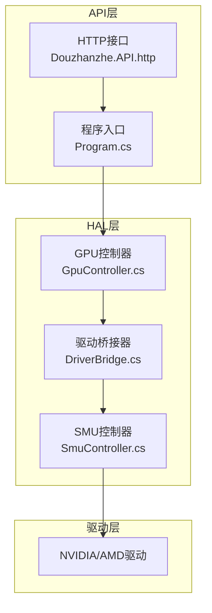
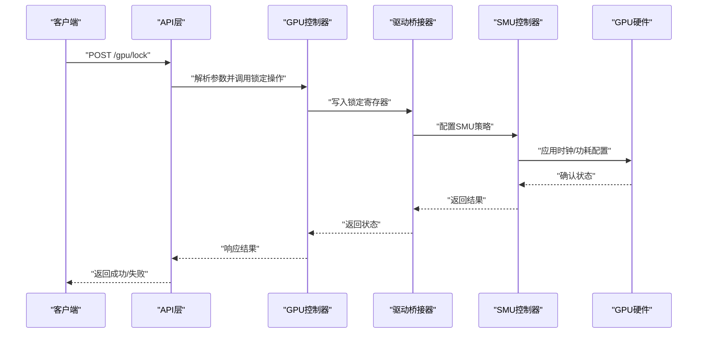
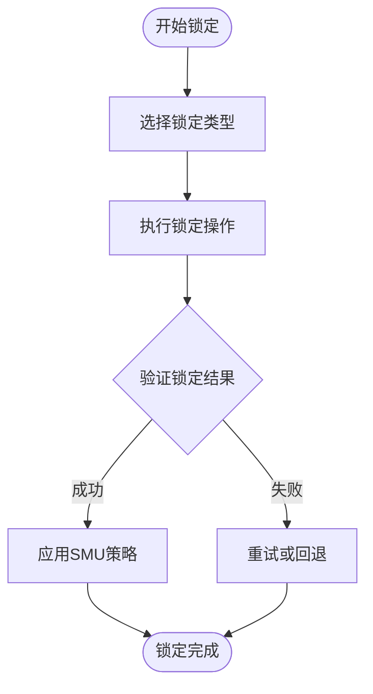
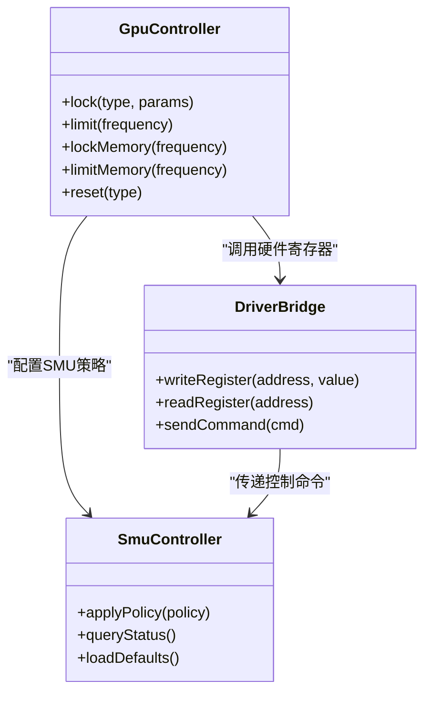
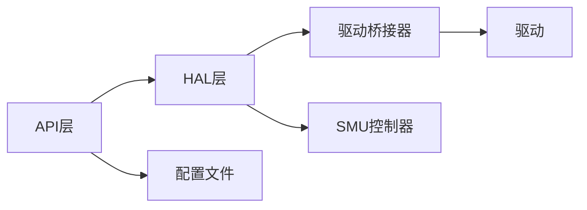

# GPU时钟控制

<cite>
**本文档引用的文件**
- [GpuController.cs](file://server/hal/GpuController.cs)
- [DriverBridge.cs](file://server/hal/DriverBridge.cs)
- [SmuController.cs](file://server/hal/SmuController.cs)
- [Douzhanzhe.API.http](file://server/api/Douzhanzhe.API.http)
- [Program.cs](file://server/api/Program.cs)
- [Douzhanzhe.API.csproj](file://server/api/Douzhanzhe.API.csproj)
- [appsettings.json](file://server/api/appsettings.json)
- [custom-params.json](file://server/api/config/custom-params.json)
</cite>

## 目录
1. [简介](#简介)
2. [项目结构](#项目结构)
3. [核心组件](#核心组件)
4. [架构概览](#架构概览)
5. [详细组件分析](#详细组件分析)
6. [依赖关系分析](#依赖关系分析)
7. [性能考虑](#性能考虑)
8. [故障排除指南](#故障排除指南)
9. [结论](#结论)
10. [附录](#附录)

## 简介
本文件为GPU时钟控制API的详细技术文档，涵盖GPU锁定操作、频率限制、显存锁定与重置机制。文档基于实际代码库中的硬件抽象层实现，提供架构说明、组件交互流程、最佳实践与风险提示，并包含可操作的使用示例与参数配置建议。

## 项目结构
GPU时钟控制功能主要由三层组成：
- API层：提供HTTP接口定义与请求处理入口
- HAL层：硬件抽象层，封装驱动桥接与SMU控制器
- 驱动层：通过底层驱动进行硬件状态读写

**图表来源**
- [GpuController.cs](file://server/hal/GpuController.cs)
- [DriverBridge.cs](file://server/hal/DriverBridge.cs)
- [SmuController.cs](file://server/hal/SmuController.cs)
- [Douzhanzhe.API.http](file://server/api/Douzhanzhe.API.http)

**章节来源**
- [GpuController.cs](file://server/hal/GpuController.cs)
- [DriverBridge.cs](file://server/hal/DriverBridge.cs)
- [SmuController.cs](file://server/hal/SmuController.cs)
- [Douzhanzhe.API.http](file://server/api/Douzhanzhe.API.http)

## 核心组件
本节概述GPU时钟控制的关键组件及其职责：
- GPU控制器：负责GPU锁定、频率限制、显存锁定与重置等操作的协调与调用
- 驱动桥接器：提供与底层驱动通信的统一接口，封装硬件寄存器访问
- SMU控制器：面向系统管理单元（System Management Unit）的控制逻辑，处理时钟域与功耗策略

**章节来源**
- [GpuController.cs](file://server/hal/GpuController.cs)
- [DriverBridge.cs](file://server/hal/DriverBridge.cs)
- [SmuController.cs](file://server/hal/SmuController.cs)

## 架构概览
GPU时钟控制采用分层架构，API层接收外部请求，HAL层完成硬件抽象，驱动层执行具体硬件操作。下图展示了典型请求从API到硬件的调用链路：

**图表来源**
- [GpuController.cs](file://server/hal/GpuController.cs)
- [DriverBridge.cs](file://server/hal/DriverBridge.cs)
- [SmuController.cs](file://server/hal/SmuController.cs)

## 详细组件分析

### GPU锁定操作详解
GPU锁定操作用于固定GPU的工作频率或功率状态，以获得稳定性能或降低功耗。根据实现，主要包含以下类型：
- lock：通用锁定，通常在允许范围内选择合适的目标频率
- lock-exact：精确锁定，要求硬件严格匹配目标频率，可能受限于硬件精度
- lock-clocks：同时锁定核心频率与显存频率，确保二者同步

使用场景举例：
- 游戏性能测试：使用lock或lock-exact固定帧率，便于对比不同设置下的表现
- AI训练：使用lock-clocks保持核心与显存频率一致，减少带宽瓶颈
- 能效优化：使用lock在满足性能的前提下降低功耗

**图表来源**
- [GpuController.cs](file://server/hal/GpuController.cs)
- [DriverBridge.cs](file://server/hal/DriverBridge.cs)

**章节来源**
- [GpuController.cs](file://server/hal/GpuController.cs)

### 区间锁定与精确锁定的差异
- 区间锁定：在给定频率范围内选择最接近目标值的可用频率，适用于大多数场景，兼容性更好
- 精确锁定：要求硬件严格达到目标频率，可能因硬件精度限制导致无法完全实现，适合对频率精度要求极高的测试环境

实现要点：
- 区间锁定优先考虑稳定性与兼容性
- 精确锁定需要更严格的硬件支持与校准

**章节来源**
- [GpuController.cs](file://server/hal/GpuController.cs)

### GPU上限限制与显存锁定
- limit：设置GPU频率上限，防止超过设定值运行
- limit-max：设置最大频率限制，通常用于极端场景下的安全保护
- lock-memory：锁定显存频率，确保显存带宽稳定
- limit-memory：设置显存频率上限，避免显存超频带来的不稳定

配置建议：
- 初学者建议先使用limit，再逐步尝试lock-memory
- 设置limit时应参考GPU默认频率范围，避免超出安全边界
- 显存锁定需与核心频率锁定配合，防止带宽不匹配

**章节来源**
- [GpuController.cs](file://server/hal/GpuController.cs)
- [custom-params.json](file://server/api/config/custom-params.json)

### GPU重置操作机制
GPU重置操作用于恢复硬件到默认状态，常见类型包括：
- reset：通用重置，恢复到出厂或上次保存的状态
- reset-clocks：仅重置时钟配置，保留其他设置
- reset-memory-clocks：仅重置显存与时钟配置，常用于解决显存相关问题

实现机制：
- reset通过驱动桥接器发送复位信号
- reset-clocks与reset-memory-clocks分别针对时钟域与显存域进行局部复位
- 复位后由SMU控制器重新加载默认策略

应用场景：
- 频繁调整参数后的状态清理
- 解决显存锁定导致的异常
- 恢复被意外修改的频率配置

**章节来源**
- [GpuController.cs](file://server/hal/GpuController.cs)
- [DriverBridge.cs](file://server/hal/DriverBridge.cs)
- [SmuController.cs](file://server/hal/SmuController.cs)

### 类关系与交互（代码级）

**图表来源**
- [GpuController.cs](file://server/hal/GpuController.cs)
- [DriverBridge.cs](file://server/hal/DriverBridge.cs)
- [SmuController.cs](file://server/hal/SmuController.cs)

## 依赖关系分析
GPU时钟控制API的依赖关系如下：
- API层依赖HAL层提供的控制器接口
- HAL层依赖驱动桥接器与SMU控制器
- 驱动桥接器直接与底层驱动通信
- 配置文件影响API行为与默认参数

**图表来源**
- [GpuController.cs](file://server/hal/GpuController.cs)
- [DriverBridge.cs](file://server/hal/DriverBridge.cs)
- [SmuController.cs](file://server/hal/SmuController.cs)
- [appsettings.json](file://server/api/appsettings.json)

**章节来源**
- [Douzhanzhe.API.csproj](file://server/api/Douzhanzhe.API.csproj)
- [appsettings.json](file://server/api/appsettings.json)

## 性能考虑
- 锁定频率会牺牲动态调节带来的性能增益，适合追求稳定的场景
- 精确锁定可能增加校准时间与失败概率，需权衡精度与成功率
- 显存锁定与核心锁定需匹配，避免带宽瓶颈导致的性能下降
- 频率上限设置过低会影响性能，过高则增加发热与功耗

## 故障排除指南
常见问题与解决方案：
- 锁定失败：检查硬件是否支持该频率；尝试区间锁定；确认驱动版本
- 显存锁定无效：检查显存频率是否在有效范围内；与核心频率锁定配合
- 重置后状态异常：使用reset-memory-clocks单独重置显存与时钟配置
- 性能波动：确认limit与lock设置是否冲突；检查SMU策略是否正确加载

**章节来源**
- [GpuController.cs](file://server/hal/GpuController.cs)
- [DriverBridge.cs](file://server/hal/DriverBridge.cs)
- [SmuController.cs](file://server/hal/SmuController.cs)

## 结论
GPU时钟控制API提供了灵活且强大的硬件调节能力。通过合理选择锁定类型、设置频率上限与显存锁定，并结合适当的重置策略，可以在保证系统稳定性的前提下获得所需的性能表现。建议在生产环境中谨慎使用精确锁定与极限频率设置，优先采用区间锁定与渐进式调整。

## 附录

### 使用示例与参数配置建议
- 基础锁定：使用通用锁定类型，设置目标频率与上限，观察系统稳定性
- 精确锁定：仅在测试环境下启用，设置目标频率并监控实际达成值
- 显存锁定：与核心锁定配合，确保带宽充足
- 安全重置：在遇到异常时优先使用局部重置，最后考虑全量重置

### 接口定义（基于HTTP接口文件）
- POST /gpu/lock：执行GPU锁定操作
- POST /gpu/limit：设置GPU频率上限
- POST /gpu/lock-memory：锁定显存频率
- POST /gpu/limit-memory：设置显存频率上限
- POST /gpu/reset：重置GPU状态
- POST /gpu/reset-clocks：仅重置时钟配置
- POST /gpu/reset-memory-clocks：重置显存与时钟配置

**章节来源**
- [Douzhanzhe.API.http](file://server/api/Douzhanzhe.API.http)