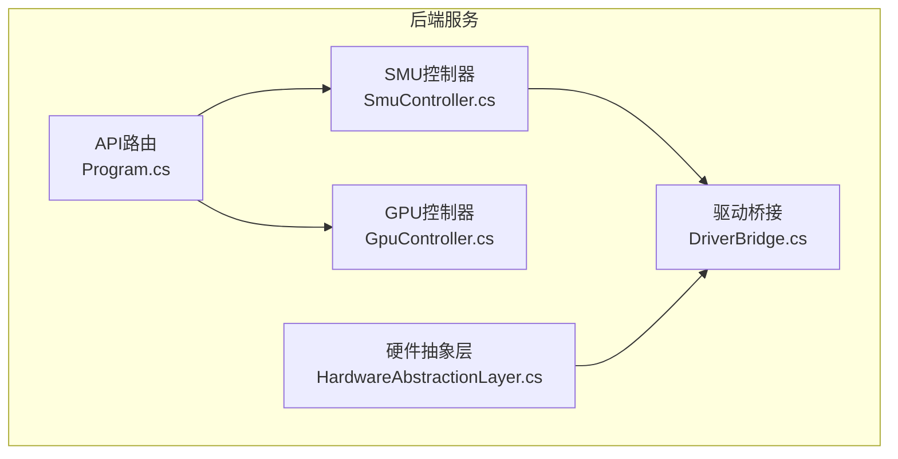
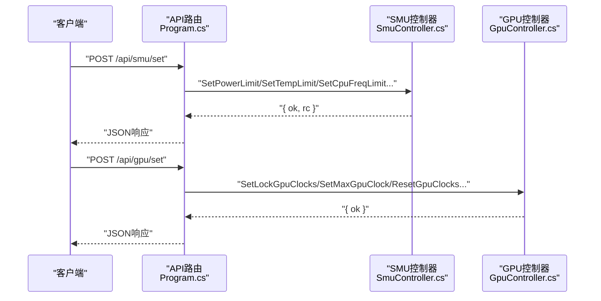
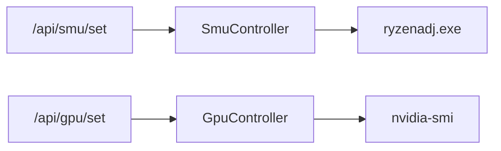

# SMU/GPU控制API

<cite>
**本文档引用的文件**
- [Program.cs](file://server/api/Program.cs)
- [SmuController.cs](file://server/hal/SmuController.cs)
- [GpuController.cs](file://server/hal/GpuController.cs)
- [DriverBridge.cs](file://server/hal/DriverBridge.cs)
- [dev-api.md](file://docs/dev-api.md)
</cite>

## 目录
1. [简介](#简介)
2. [项目结构](#项目结构)
3. [核心组件](#核心组件)
4. [架构总览](#架构总览)
5. [详细组件分析](#详细组件分析)
6. [依赖关系分析](#依赖关系分析)
7. [性能考虑](#性能考虑)
8. [故障排除指南](#故障排除指南)
9. [结论](#结论)
10. [附录](#附录)

## 简介
本文件面向SMU/GPU控制API的使用者与维护者，系统性说明以下内容：
- SMU参数设置API（/api/smu/set）支持的参数类型与取值范围
- SMU原始命令API（/api/smu/raw）的使用方法与限制
- GPU控制API（/api/gpu/set）的锁定、限制与重置操作
- SMU探测与状态查询端点的使用说明
- 安全警告与性能影响评估

本项目采用C#编写的后端服务，通过子进程调用外部工具（如ryzenadj.exe）实现SMU控制，并通过nvidia-smi实现GPU频率锁定与查询。

## 项目结构
后端服务基于ASP.NET Core，API路由集中在Program.cs中定义，硬件控制逻辑位于HAL层（Hardware Abstraction Layer），具体包括：
- SMU控制器：封装ryzenadj.exe子进程调用
- GPU控制器：封装nvidia-smi子进程调用
- 驱动桥接：提供底层IO与EC访问能力（用于其他硬件功能）

**图表来源**
- [Program.cs:1-783](file://server/api/Program.cs#L1-L783)
- [SmuController.cs:1-142](file://server/hal/SmuController.cs#L1-L142)
- [GpuController.cs:1-116](file://server/hal/GpuController.cs#L1-L116)
- [DriverBridge.cs:1-150](file://server/hal/DriverBridge.cs#L1-L150)

**章节来源**
- [Program.cs:1-783](file://server/api/Program.cs#L1-L783)

## 核心组件
- SMU控制器（SmuController）
  - 通过ryzenadj.exe子进程执行SMU参数设置与探测
  - 支持功耗限制、温度限制、频率限制、曲线优化器、CPU频率限制、睿频开关等
  - 提供能力清单与探测接口
- GPU控制器（GpuController）
  - 通过nvidia-smi子进程执行GPU频率锁定、上限限制、重置等操作
  - 提供当前核心/显存频率与功耗查询
- 驱动桥接（DriverBridge）
  - 提供底层IO与EC访问能力，用于系统其他硬件功能（本API文档不涉及）

**章节来源**
- [SmuController.cs:1-142](file://server/hal/SmuController.cs#L1-L142)
- [GpuController.cs:1-116](file://server/hal/GpuController.cs#L1-L116)
- [DriverBridge.cs:1-150](file://server/hal/DriverBridge.cs#L1-L150)

## 架构总览
后端服务通过HTTP路由接收请求，解析参数后调用对应的控制器（SmuController或GpuController），控制器内部以子进程方式调用外部工具完成硬件控制。返回统一的JSON格式结果。

**图表来源**
- [Program.cs:238-461](file://server/api/Program.cs#L238-L461)
- [SmuController.cs:61-95](file://server/hal/SmuController.cs#L61-L95)
- [GpuController.cs:42-86](file://server/hal/GpuController.cs#L42-L86)

## 详细组件分析

### SMU参数设置API（/api/smu/set）
- 请求方法：POST
- 请求体：包含两个字段
  - parameter：字符串，表示要设置的参数键
  - valueM：整数，表示参数值（单位见下表）
- 返回：JSON对象，包含ok（布尔）与rc（整数，0表示成功）

支持的参数键与含义：
- stapm_limit / power_limit：CPU长时功耗墙（单位mW，内部转换为瓦特输入到ryzenadj）
- short_power_limit：CPU短时功耗墙（单位mW）
- tctl_temp / temp_limit：CPU温度墙（单位°C）
- co_all：曲线优化器全核电压偏移（单位mV，负值表示降压）
- cpu_freq_limit：CPU最大频率限制（单位MHz）
- turbo_disable：睿频开关（0=开启，1=关闭）

参数与单位对照表
- 功耗类：valueM为毫瓦（mW），内部转换为瓦特传给ryzenadj
- 温度类：valueM为摄氏度（°C）
- 电压类：valueM为毫伏（mV）
- 频率类：valueM为兆赫（MHz）
- 开关类：valueM为0/1

典型使用场景
- 设置长时功耗墙：parameter为power_limit，valueM为期望的毫瓦值
- 设置短时功耗墙：parameter为short_power_limit，valueM为期望的毫瓦值
- 设置温度墙：parameter为temp_limit，valueM为期望的摄氏度
- 设置曲线优化器：parameter为co_all，valueM为期望的毫伏值（负值降压）
- 设置CPU频率限制：parameter为cpu_freq_limit，valueM为期望的MHz
- 关闭睿频：parameter为turbo_disable，valueM为1；开启睿频则为0

错误处理
- 当parameter不在支持列表内时，返回错误信息
- 当ryzenadj返回非零退出码时，rc非0，但存在特定崩溃情况被归类为成功

**章节来源**
- [Program.cs:238-274](file://server/api/Program.cs#L238-L274)
- [SmuController.cs:61-95](file://server/hal/SmuController.cs#L61-L95)
- [dev-api.md:55-80](file://docs/dev-api.md#L55-L80)

### SMU原始命令API（/api/smu/raw）
- 请求方法：POST
- 请求体：包含两个字段
  - cmd：原始SMU命令号（十进制或十六进制字符串）
  - arg0：命令参数（十进制或十六进制字符串）
- 返回：JSON对象，包含ok（布尔）、cmd、arg0与response

注意
- 当前实现中，SendRawSmuCommand抛出不支持异常，因此该端点不会生效
- 若需使用原始命令，应改用POST /api/smu/set进行参数化设置

**章节来源**
- [Program.cs:275-286](file://server/api/Program.cs#L275-L286)
- [SmuController.cs:101](file://server/hal/SmuController.cs#L101)

### GPU控制API（/api/gpu/set）
- 请求方法：POST
- 请求体：包含action、min、max、value四个字段
  - action：字符串，指定操作类型
  - min/max/value：可选整数，用于不同操作的参数
- 返回：JSON对象，包含ok（布尔）

支持的操作与参数
- 锁定核心频率（lock/lock-clocks）
  - 无min/max/value：仅设置上限（等价于limit-max）
  - 有min/max：锁定区间[min,max]
  - 有value：等价于上限限制（limit-max）
- 精确锁定（lock-exact）
  - 使用value作为精确锁定频率（MHz）
- 上限限制（limit/limit-max）
  - 使用value或max作为上限（MHz）
- 重置核心频率（reset/reset-clocks）
  - 恢复默认频率策略
- 锁定显存频率（lock-memory/lock-memory-clocks）
  - 使用min/max锁定显存频率区间
- 显存上限限制（limit-memory）
  - 使用value或max作为显存上限（MHz）
- 重置显存频率（reset-memory/reset-memory-clocks）
  - 恢复默认显存频率策略

典型使用场景
- 将GPU核心频率上限限制为2700MHz：action为limit-max，value为2700
- 锁定GPU核心频率在2500–3000MHz：action为lock，min为2500，max为3000
- 精确锁定到2700MHz：action为lock-exact，value为2700
- 重置所有频率锁定：action为reset，不带参数
- 限制显存频率为11001MHz：action为limit-memory，value为11001

**章节来源**
- [Program.cs:396-447](file://server/api/Program.cs#L396-L447)
- [GpuController.cs:42-86](file://server/hal/GpuController.cs#L42-L86)

### SMU探测与状态查询
- 探测端点：GET /api/smu/probe
  - 功能：检查SMU控制是否可用（ryzenadj子进程）
  - 返回：ok（布尔）、source（固定为"ryzenadj"）
- 状态端点：GET /api/smu/status
  - 功能：返回探测结果与能力清单
  - 返回：ok（布尔）、probe（布尔）、source（固定为"ryzenadj"）、capabilities（对象）
- 能力清单字段
  - powerLimit、tempLimit、shortPowerLimit、curveOptimizer、cpuFreqLimit、turboDisabled、probe、vrmCurrent、rawCommand、readRegister
  - 当前实现中，vrmCurrent、rawCommand、readRegister为false，表示不支持

**章节来源**
- [Program.cs:287-327](file://server/api/Program.cs#L287-L327)
- [SmuController.cs:123-141](file://server/hal/SmuController.cs#L123-L141)

### GPU状态查询
- 端点：GET /api/gpu/status
- 功能：查询当前GPU核心频率、显存频率与功耗
- 返回：ok（布尔）、coreClockMHz、memoryClockMHz、powerDrawW、baseCoreClockMHz、maxCoreClockMHz

**章节来源**
- [Program.cs:448-461](file://server/api/Program.cs#L448-L461)
- [GpuController.cs:77-107](file://server/hal/GpuController.cs#L77-L107)

## 依赖关系分析
- API路由依赖控制器
  - /api/smu/set → SmuController
  - /api/gpu/set → GpuController
- 控制器依赖外部工具
  - SmuController → ryzenadj.exe（通过ProcessStartInfo启动）
  - GpuController → nvidia-smi（通过ProcessStartInfo启动）
- 外部工具依赖系统环境
  - ryzenadj.exe必须存在于可发现路径
  - nvidia-smi需在PATH中且具备管理员权限

**图表来源**
- [Program.cs:238-447](file://server/api/Program.cs#L238-L447)
- [SmuController.cs:43-57](file://server/hal/SmuController.cs#L43-L57)
- [GpuController.cs:14-40](file://server/hal/GpuController.cs#L14-L40)

**章节来源**
- [Program.cs:1-783](file://server/api/Program.cs#L1-L783)
- [SmuController.cs:1-142](file://server/hal/SmuController.cs#L1-L142)
- [GpuController.cs:1-116](file://server/hal/GpuController.cs#L1-L116)

## 性能考虑
- 子进程开销
  - 每次调用API都会启动一个外部工具进程，频繁调用会产生额外开销
- 超时与稳定性
  - GPU控制器设置了超时时间，超时会触发异常
  - SMU控制器在特定情况下会将特定退出码视为成功（兼容性处理）
- 功耗与温度限制
  - 合理设置功耗与温度墙，避免系统降载或热关机
- 频率限制
  - 频率限制会影响性能表现，建议结合实际负载与散热条件调整

[本节为通用指导，无需列出章节来源]

## 故障排除指南
常见问题与排查步骤
- nvidia-smi失败
  - 现象：返回非零退出码或超时
  - 排查：确认nvidia-smi在PATH中，以管理员权限运行，驱动正常
- ryzenadj不可用
  - 现象：/api/smu/probe返回false或status中的probe为false
  - 排查：确认ryzenadj.exe存在且可执行，系统满足WinRing0驱动要求
- 参数无效
  - 现象：/api/smu/set返回unknown parameter或rc非0
  - 排查：检查parameter是否在支持列表内，valueM单位是否正确
- 原始命令不生效
  - 现象：/api/smu/raw抛出不支持异常
  - 排查：改用POST /api/smu/set进行参数化设置

**章节来源**
- [GpuController.cs:29-40](file://server/hal/GpuController.cs#L29-L40)
- [SmuController.cs:103-121](file://server/hal/SmuController.cs#L103-L121)
- [Program.cs:275-286](file://server/api/Program.cs#L275-L286)

## 结论
本API提供了对SMU与GPU的参数化控制能力，通过子进程调用外部工具实现硬件层面的限制与调节。使用时需关注参数单位、外部工具可用性与系统权限，并结合实际负载与散热条件合理设置，以获得稳定与可预期的性能表现。

[本节为总结性内容，无需列出章节来源]

## 附录

### SMU参数键与单位对照表
- stapm_limit / power_limit：valueM为毫瓦（mW）
- short_power_limit：valueM为毫瓦（mW）
- tctl_temp / temp_limit：valueM为摄氏度（°C）
- co_all：valueM为毫伏（mV）
- cpu_freq_limit：valueM为兆赫（MHz）
- turbo_disable：valueM为0/1

**章节来源**
- [Program.cs:238-274](file://server/api/Program.cs#L238-L274)
- [dev-api.md:55-80](file://docs/dev-api.md#L55-L80)

### GPU操作与参数对照表
- 锁定核心频率（lock/lock-clocks）
  - 无参数：上限限制（等价limit-max）
  - 有min/max：锁定区间[min,max]
  - 有value：上限限制（limit-max）
- 精确锁定（lock-exact）
  - 使用value（MHz）
- 上限限制（limit/limit-max）
  - 使用value或max（MHz）
- 重置核心频率（reset/reset-clocks）
  - 无参数
- 锁定显存频率（lock-memory/lock-memory-clocks）
  - 使用min/max（MHz）
- 显存上限限制（limit-memory）
  - 使用value或max（MHz）
- 重置显存频率（reset-memory/reset-memory-clocks）
  - 无参数

**章节来源**
- [Program.cs:396-447](file://server/api/Program.cs#L396-L447)