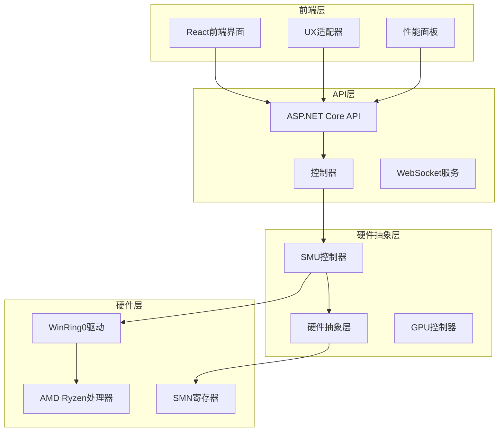
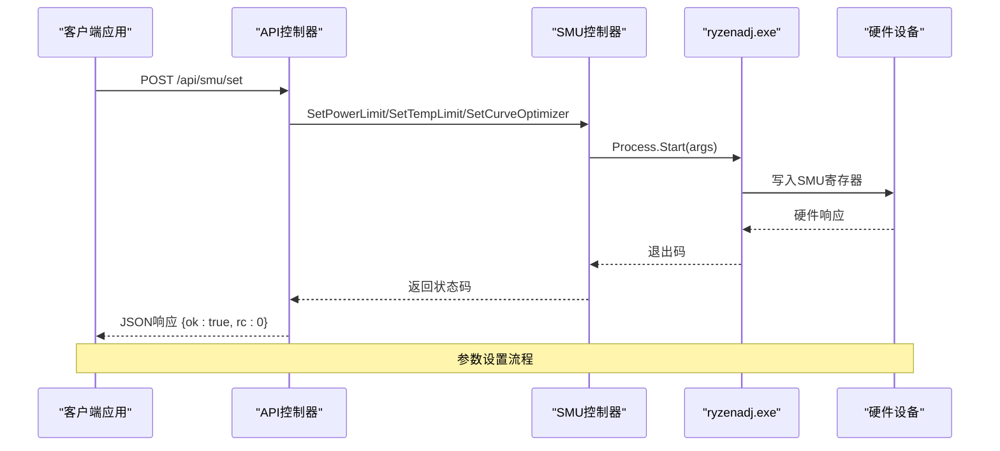
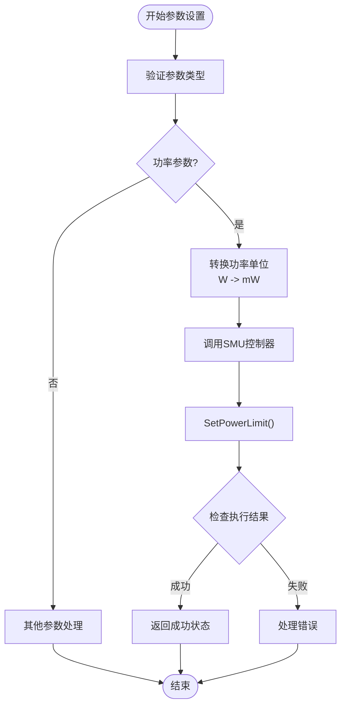
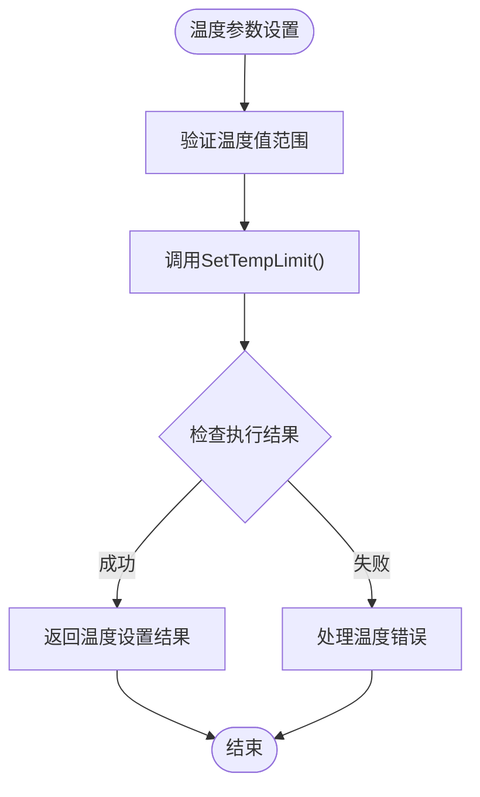
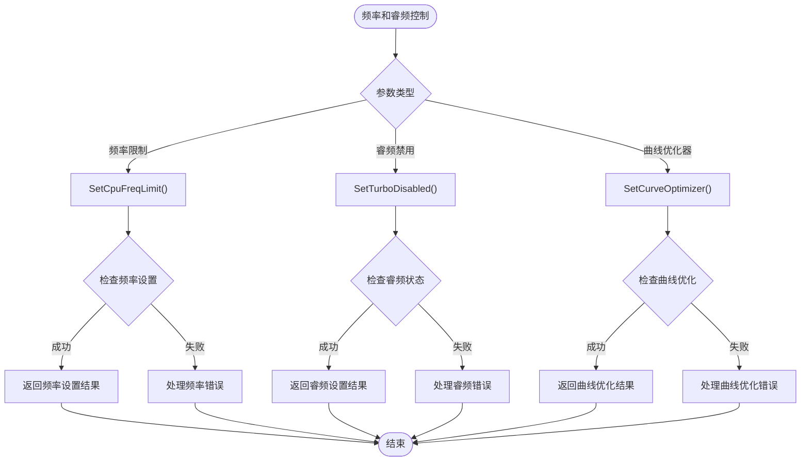
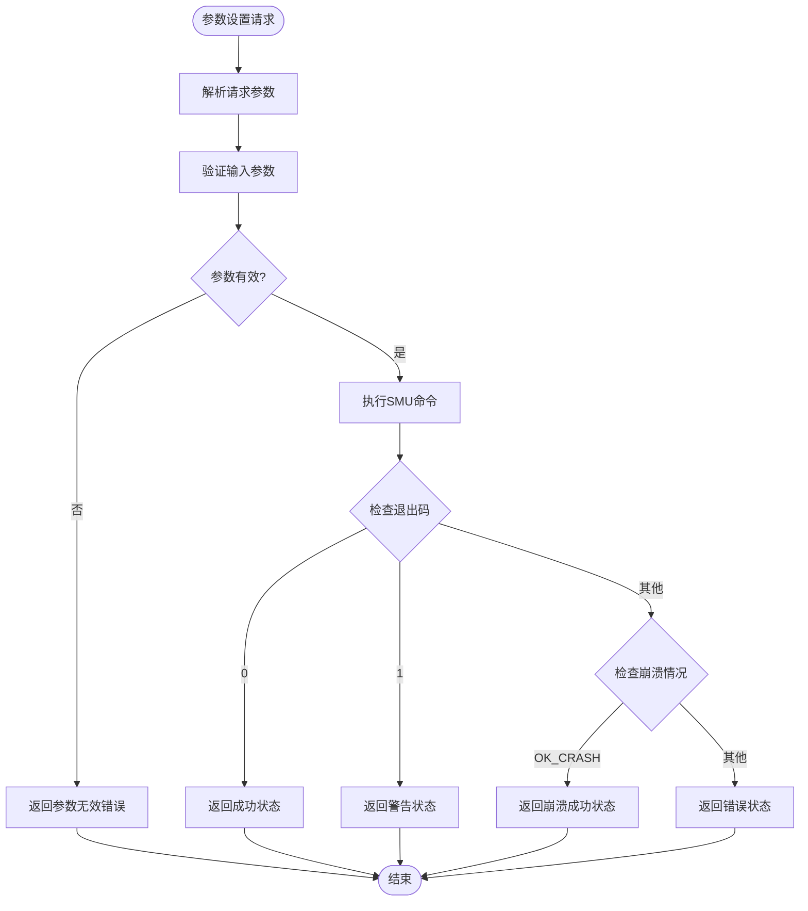
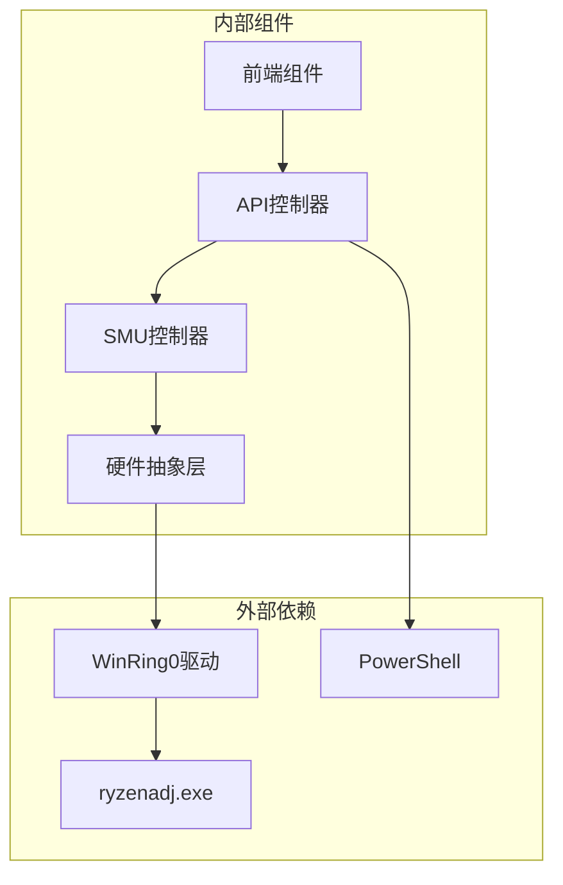

# SMU参数控制

<cite>
**本文档引用的文件**
- [SmuController.cs](file://server/hal/SmuController.cs)
- [Program.cs](file://server/api/Program.cs)
- [dev-backend.md](file://docs/dev-backend.md)
- [custom-params.json](file://server/api/config/custom-params.json)
- [uxtuAdapter.js](file://src/services/uxtuAdapter.js)
- [PerformancePanel.jsx](file://src/components/panels/PerformancePanel.jsx)
</cite>

## 目录
1. [简介](#简介)
2. [项目结构](#项目结构)
3. [核心组件](#核心组件)
4. [架构概览](#架构概览)
5. [详细组件分析](#详细组件分析)
6. [依赖关系分析](#依赖关系分析)
7. [性能考虑](#性能考虑)
8. [故障排除指南](#故障排除指南)
9. [结论](#结论)

## 简介

SMU参数控制API是Douzhanzhe控制系统中的核心功能模块，负责管理AMD Ryzen处理器的系统管理单元(SMU)参数。该API提供了对CPU功耗、温度、频率等关键参数的精确控制能力，支持多种参数类型和操作模式。

本系统采用子进程调用的方式，通过ryzenadj.exe工具与硬件直接交互，实现了对SMU寄存器的安全访问和参数设置。系统设计注重稳定性、安全性和易用性，提供了完整的错误处理机制和状态反馈。

## 项目结构

系统采用分层架构设计，主要包含以下核心层次：

**图表来源**
- [Program.cs:1-783](file://server/api/Program.cs#L1-L783)
- [SmuController.cs:1-142](file://server/hal/SmuController.cs#L1-L142)

**章节来源**
- [Program.cs:1-783](file://server/api/Program.cs#L1-L783)
- [SmuController.cs:1-142](file://server/hal/SmuController.cs#L1-L142)

## 核心组件

### SMU控制器 (SmuController)

SMU控制器是系统的核心组件，负责与硬件直接交互。它通过Process.Start启动ryzenadj.exe子进程，传递相应的命令行参数来设置SMU参数。

主要特性：
- 支持多种SMU参数类型设置
- 内置错误处理和状态检查
- 提供硬件能力检测功能
- 支持参数有效性验证

### API控制器 (Program.cs)

API控制器实现了RESTful接口，提供统一的参数控制入口。每个SMU参数都有对应的API端点，支持GET和POST方法。

关键功能：
- 参数验证和转换
- 错误处理和异常捕获
- 状态反馈和结果报告
- 与前端组件的集成

**章节来源**
- [SmuController.cs:12-142](file://server/hal/SmuController.cs#L12-L142)
- [Program.cs:238-274](file://server/api/Program.cs#L238-L274)

## 架构概览

系统采用客户端-服务器架构，通过HTTP API提供SMU参数控制服务：

**图表来源**
- [Program.cs:238-274](file://server/api/Program.cs#L238-L274)
- [SmuController.cs:43-95](file://server/hal/SmuController.cs#L43-L95)

## 详细组件分析

### 参数设置流程

系统支持以下主要SMU参数的设置：

#### 功率参数设置

**图表来源**
- [Program.cs:247-248](file://server/api/Program.cs#L247-L248)
- [SmuController.cs:61-65](file://server/hal/SmuController.cs#L61-L65)

#### 温度参数设置

温度参数设置流程相对简单，直接调用SetTempLimit方法：

**图表来源**
- [Program.cs](file://server/api/Program.cs#L254)
- [SmuController.cs:67-71](file://server/hal/SmuController.cs#L67-L71)

#### 频率和睿频控制

频率限制和睿频禁用功能提供了更精细的CPU控制：

**图表来源**
- [Program.cs:259-264](file://server/api/Program.cs#L259-L264)
- [SmuController.cs:84-95](file://server/hal/SmuController.cs#L84-L95)

### 参数类型和单位说明

系统支持以下SMU参数类型及其单位：

| 参数名称 | 参数键 | 单位 | 有效范围 | 描述 |
|---------|--------|------|----------|------|
| stapm_limit | power_limit/stapm_limit | 毫瓦(mW) | 0-系统上限 | 长时功耗限制 |
| short_power_limit | short_power_limit | 毫瓦(mW) | 0-系统上限 | 短时功耗限制 |
| tctl_temp | temp_limit/tctl_temp | 摄氏度(°C) | 60-100°C | CPU温度限制 |
| co_all | co_all | 毫伏(mV) | -50到+50mV | 曲线优化器电压偏移 |
| cpu_freq_limit | cpu_freq_limit | 兆赫兹(MHz) | 2000-5500MHz | CPU频率限制 |
| turbo_disable | turbo_disable | 布尔值 | 0/1 | 睿频禁用开关 |

**章节来源**
- [Program.cs:245-264](file://server/api/Program.cs#L245-L264)
- [SmuController.cs:61-95](file://server/hal/SmuController.cs#L61-L95)

### 成功判断和错误处理机制

系统实现了多层次的成功判断和错误处理：

**图表来源**
- [Program.cs:238-274](file://server/api/Program.cs#L238-L274)
- [SmuController.cs:59-65](file://server/hal/SmuController.cs#L59-L65)

**章节来源**
- [Program.cs:238-274](file://server/api/Program.cs#L238-L274)
- [SmuController.cs:59-65](file://server/hal/SmuController.cs#L59-L65)

### 参数对系统性能和稳定性的影响

不同SMU参数对系统的影响程度各不相同：

#### 功率参数影响
- **降低功耗限制**：减少CPU性能输出，延长电池续航，但可能影响峰值性能
- **提高功耗限制**：增加CPU性能输出，但会增加发热和功耗
- **短时功耗限制**：允许短暂超频，但需注意长时间运行稳定性

#### 温度参数影响
- **降低温度限制**：保护硬件安全，但可能限制性能发挥
- **提高温度限制**：允许更高温度运行，但增加硬件风险
- **建议范围**：65-95°C之间较为安全

#### 频率和睿频控制影响
- **频率限制**：直接影响CPU最大运行频率，影响整体性能
- **睿频禁用**：防止自动频率提升，保持稳定性能
- **曲线优化器**：调整CPU电压曲线，影响功耗和稳定性

**章节来源**
- [uxtuAdapter.js:109-115](file://src/services/uxtuAdapter.js#L109-L115)

## 依赖关系分析

系统依赖关系呈现清晰的分层结构：

**图表来源**
- [Program.cs:692-723](file://server/api/Program.cs#L692-L723)
- [SmuController.cs:17-41](file://server/hal/SmuController.cs#L17-L41)

**章节来源**
- [Program.cs:692-723](file://server/api/Program.cs#L692-L723)
- [SmuController.cs:17-41](file://server/hal/SmuController.cs#L17-L41)

## 性能考虑

系统在设计时充分考虑了性能和稳定性因素：

### 启动时序优化
- WinRing0驱动自动加载机制
- ryzenadj.exe路径智能查找
- 异步处理避免阻塞主线程

### 内存管理
- 使用using语句确保资源正确释放
- 进程生命周期管理
- 缓存策略优化

### 并发处理
- 多线程安全的参数设置
- 队列机制避免参数冲突
- 去抖动机制优化频繁操作

## 故障排除指南

### 常见问题和解决方案

#### SMU控制不可用
**症状**：`{ ok: false, error: "SMU control unavailable" }`

**原因**：
- WinRing0驱动未正确安装
- ryzenadj.exe文件缺失
- 权限不足

**解决方案**：
1. 确认WinRing0.sys文件存在
2. 检查管理员权限
3. 验证ryzenadj.exe完整性

#### 参数设置失败
**症状**：`{ ok: false, error: "参数无效" }`

**原因**：
- 参数值超出有效范围
- 参数类型不匹配
- 硬件不支持特定参数

**解决方案**：
1. 检查参数范围限制
2. 验证参数类型
3. 使用GetCapabilities查询硬件支持

#### 系统不稳定
**症状**：系统重启或蓝屏

**原因**：
- 参数设置过于激进
- 硬件温度过高
- 电源供应不足

**解决方案**：
1. 逐步调整参数值
2. 监控系统温度
3. 恢复默认设置

**章节来源**
- [Program.cs:265-273](file://server/api/Program.cs#L265-L273)
- [dev-backend.md:286-292](file://docs/dev-backend.md#L286-L292)

## 结论

SMU参数控制API为AMD Ryzen系统的深度定制提供了强大而安全的工具。通过合理的参数设置，用户可以在性能、功耗和稳定性之间找到最佳平衡点。

系统的主要优势包括：
- **安全性**：通过子进程隔离和权限控制确保系统安全
- **稳定性**：完善的错误处理和回滚机制
- **易用性**：直观的API接口和丰富的前端组件
- **扩展性**：模块化设计便于功能扩展

建议在使用过程中遵循渐进式调整原则，先从保守设置开始，逐步优化到满足需求的配置。同时定期监控系统状态，确保硬件在安全范围内运行。