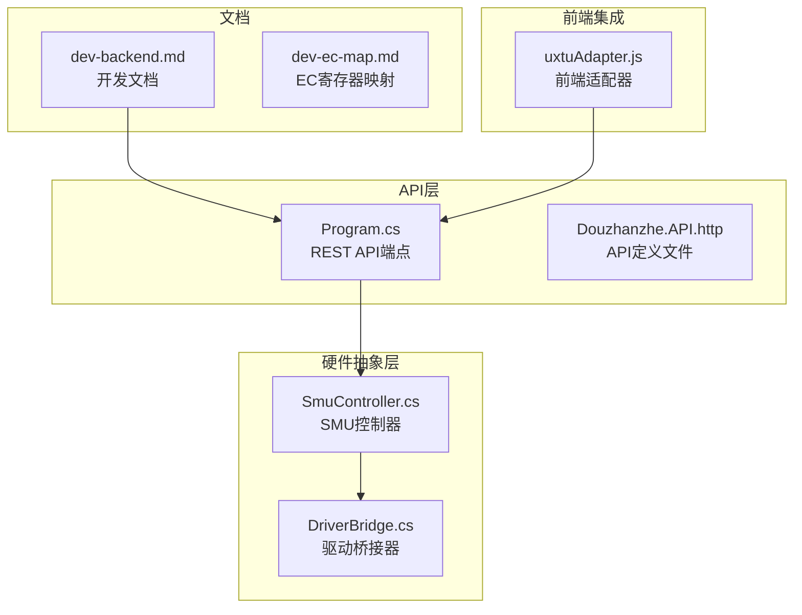
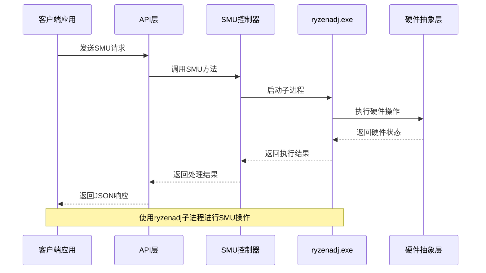
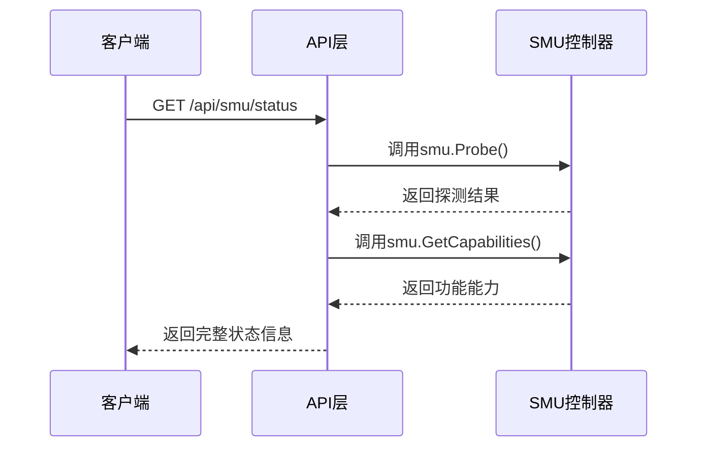
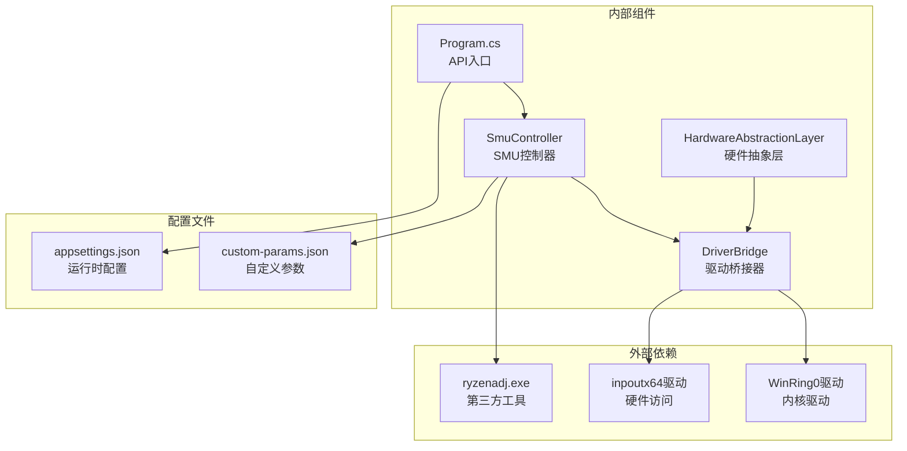

# SMU探测与状态

<cite>
**本文档引用的文件**
- [Program.cs](file://server/api/Program.cs)
- [SmuController.cs](file://server/hal/SmuController.cs)
- [DriverBridge.cs](file://server/hal/DriverBridge.cs)
- [dev-backend.md](file://docs/dev-backend.md)
- [Douzhanzhe.API.http](file://server/api/Douzhanzhe.API.http)
- [uxtuAdapter.js](file://src/services/uxtuAdapter.js)
</cite>

## 目录
1. [简介](#简介)
2. [项目结构](#项目结构)
3. [核心组件](#核心组件)
4. [架构概览](#架构概览)
5. [详细组件分析](#详细组件分析)
6. [依赖关系分析](#依赖关系分析)
7. [性能考虑](#性能考虑)
8. [故障排除指南](#故障排除指南)
9. [结论](#结论)

## 简介

本文档详细说明了DOUZHANZHE-Control项目中的SMU（System Management Unit）探测与状态API。SMU是AMD处理器中的专用管理单元，负责功耗限制、温度控制、频率调节等系统管理功能。

项目提供了三个核心SMU相关API：
- **/api/smu/probe** - SMU探测API，用于检测SMU连接性和可用性
- **/api/smu/status** - SMU状态查询API，返回能力检测和参数支持情况
- **/api/smu/read-reg** - SMU寄存器读取API，用于读取SMU寄存器

## 项目结构

项目的SMU相关功能分布在以下关键位置：



**图表来源**
- [Program.cs:288-321](file://server/api/Program.cs#L288-L321)
- [SmuController.cs:12-41](file://server/hal/SmuController.cs#L12-L41)
- [DriverBridge.cs:9-37](file://server/hal/DriverBridge.cs#L9-L37)

**章节来源**
- [Program.cs:288-321](file://server/api/Program.cs#L288-L321)
- [SmuController.cs:12-41](file://server/hal/SmuController.cs#L12-L41)

## 核心组件

### SMU控制器（SmuController）

SmuController是SMU功能的核心控制器，负责与ryzenadj子进程交互来执行SMU操作。

**主要职责：**
- 管理ryzenadj.exe子进程的生命周期
- 执行SMU参数设置操作
- 提供SMU探测和状态查询功能
- 处理SMU命令的执行和错误处理

**关键特性：**
- 自动定位ryzenadj.exe可执行文件
- 支持多种SMU参数设置
- 内置错误处理和兼容性检查
- 提供能力检测接口

**章节来源**
- [SmuController.cs:12-141](file://server/hal/SmuController.cs#L12-L141)

### 驱动桥接器（DriverBridge）

DriverBridge提供底层硬件访问能力，支持EC寄存器读写和其他硬件操作。

**主要功能：**
- 管理inpoutx64驱动的加载和初始化
- 提供EC寄存器物理地址映射
- 支持I/O端口读写操作
- 处理硬件访问的错误恢复

**章节来源**
- [DriverBridge.cs:9-82](file://server/hal/DriverBridge.cs#L9-L82)

## 架构概览

SMU系统的整体架构采用分层设计，确保了功能的模块化和可维护性：



**图表来源**
- [Program.cs:288-321](file://server/api/Program.cs#L288-L321)
- [SmuController.cs:43-57](file://server/hal/SmuController.cs#L43-L57)

## 详细组件分析

### SMU探测API（/api/smu/probe）

SMU探测API用于检测SMU的连通性和可用性状态。

#### 请求处理流程

```mermaid
flowchart TD
Start([收到GET请求]) --> Parse[解析请求参数]
Parse --> CallProbe[调用smu.Probe()]
CallProbe --> ExecProc[启动ryzenadj子进程]
ExecProc --> WaitExit[等待进程退出]
WaitExit --> CheckCode{检查退出码}
CheckCode --> |0或1| Success[返回ok=true]
CheckCode --> |-1073741819| CrashFix[适配崩溃退出码]
CheckCode --> |其他| Failure[返回ok=false]
CrashFix --> Success
Success --> End([返回JSON响应])
Failure --> End
```

**图表来源**
- [Program.cs:288-299](file://server/api/Program.cs#L288-L299)
- [SmuController.cs:77-95](file://server/hal/SmuController.cs#L77-L95)

#### 返回结果格式

| 字段 | 类型 | 描述 | 示例值 |
|------|------|------|--------|
| ok | boolean | 探测是否成功 | true/false |
| source | string | 检测来源 | "ryzenadj" |

#### ryzenadj子进程使用方式

SMU探测通过启动ryzenadj.exe子进程并传入`-i`参数来执行探测操作。该进程会在15秒超时时间内完成探测并返回退出码。

**章节来源**
- [Program.cs:288-299](file://server/api/Program.cs#L288-L299)
- [SmuController.cs:77-95](file://server/hal/SmuController.cs#L77-L95)

### SMU状态查询API（/api/smu/status）

SMU状态查询API提供完整的SMU状态信息，包括探测结果和功能能力检测。

#### 查询流程



**图表来源**
- [Program.cs:316-321](file://server/api/Program.cs#L316-L321)
- [SmuController.cs:123-138](file://server/hal/SmuController.cs#L123-L138)

#### 返回结果格式

| 字段 | 类型 | 描述 | 示例值 |
|------|------|------|--------|
| ok | boolean | 状态查询是否成功 | true |
| probe | boolean | SMU探测结果 | true/false |
| source | string | 检测来源 | "ryzenadj" |
| capabilities | object | 功能能力清单 | 见下表 |

#### 能力检测和参数支持

| 功能 | 支持状态 | 描述 |
|------|----------|------|
| powerLimit | ✅ 支持 | 功率限制设置 |
| tempLimit | ✅ 支持 | 温度限制设置 |
| shortPowerLimit | ✅ 支持 | 短时功率限制设置 |
| curveOptimizer | ✅ 支持 | 曲线优化器设置 |
| cpuFreqLimit | ✅ 支持 | CPU频率限制设置 |
| turboDisabled | ✅ 支持 | 禁用Turbo功能 |
| probe | ✅ 支持 | SMU探测功能 |
| vrmCurrent | ❌ 不支持 | VRM电流读取 |
| rawCommand | ❌ 不支持 | 原始SMU命令 |
| readRegister | ❌ 不支持 | SMN寄存器读取 |

**章节来源**
- [Program.cs:316-321](file://server/api/Program.cs#L316-L321)
- [SmuController.cs:123-138](file://server/hal/SmuController.cs#L123-L138)

### SMU寄存器读取API（/api/smu/read-reg）

SMU寄存器读取API用于直接读取SMU寄存器内容，但当前版本存在功能限制。

#### 当前实现状态

根据代码分析，当前版本的SMU寄存器读取API存在以下特点：

**不支持的功能：**
- SMN寄存器读取功能在当前实现中抛出NotSupportedException
- 该功能被标记为"not supported on this hardware"

**预期功能设计：**
虽然当前实现不支持，但从API设计可以看出预期的功能包括：
- 支持十六进制地址格式（如0xXXXX）
- 返回寄存器的原始数据值
- 提供数据解析和格式化

**章节来源**
- [SmuController.cs:140](file://server/hal/SmuController.cs#L140)

## 依赖关系分析

SMU功能的依赖关系体现了清晰的分层架构：



**图表来源**
- [Program.cs:734-756](file://server/api/Program.cs#L734-L756)
- [SmuController.cs:17-41](file://server/hal/SmuController.cs#L17-L41)

### 运行时依赖

**必需依赖：**
- **WinRing0驱动**：用于硬件I/O访问，自动安装和加载
- **ryzenadj.exe**：SMU操作的外部工具，自动定位和使用

**可选依赖：**
- **inpoutx64驱动**：提供额外的硬件访问能力
- **驱动桥接器**：在驱动不可用时提供降级处理

**章节来源**
- [Program.cs:734-756](file://server/api/Program.cs#L734-L756)
- [SmuController.cs:17-41](file://server/hal/SmuController.cs#L17-L41)

## 性能考虑

### 子进程开销

SMU操作通过ryzenadj子进程执行，需要考虑以下性能影响：

**启动开销：**
- 子进程启动时间：通常在几十毫秒范围内
- 内存占用：每个子进程约占用几MB内存
- CPU开销：相对较小，主要影响I/O操作

**并发处理：**
- API层支持并发请求处理
- 子进程池管理避免重复启动
- 超时机制防止长时间阻塞

### 缓存策略

建议在应用层面实施以下缓存策略：

**状态缓存：**
- SMU探测结果缓存1-5秒
- 能力检测结果长期缓存
- 避免频繁的硬件访问

**参数缓存：**
- 最近设置的参数值缓存
- 减少重复的参数查询

## 故障排除指南

### 常见问题及解决方案

#### 1. SMU探测失败

**症状：** `ok = false` 或 `error` 字段包含错误信息

**可能原因：**
- ryzenadj.exe文件缺失或损坏
- 权限不足无法执行硬件操作
- 系统不支持SMU功能

**解决步骤：**
1. 验证ryzenadj.exe文件存在且可执行
2. 以管理员权限运行应用程序
3. 检查系统是否为AMD平台
4. 查看详细的错误信息

#### 2. 权限问题

**症状：** 访问硬件设备时出现权限错误

**解决方案：**
- 确保应用程序以管理员权限运行
- 检查Windows服务状态（WinRing0）
- 验证用户账户控制(UAC)设置

#### 3. 驱动加载失败

**症状：** `driverLoaded = false`

**解决步骤：**
1. 检查WinRing0.sys文件是否存在
2. 验证系统服务状态
3. 重新安装驱动程序
4. 检查系统兼容性

#### 4. 参数设置失败

**症状：** `rc != 0` 返回非零值

**可能原因：**
- 参数值超出有效范围
- 硬件不支持特定功能
- 系统处于不支持的状态

**调试方法：**
1. 检查参数的有效性
2. 查看能力检测结果
3. 尝试简化参数组合
4. 参考日志输出获取详细信息

### 调试工具和方法

**API测试：**
- 使用Douzhanzhe.API.http文件进行API测试
- 通过curl或浏览器直接访问API端点
- 检查HTTP状态码和响应内容

**日志分析：**
- 查看应用程序启动日志
- 监控WinRing0驱动状态
- 分析ryzenadj.exe的执行日志

**章节来源**
- [dev-backend.md:286-292](file://docs/dev-backend.md#L286-L292)
- [Program.cs:734-756](file://server/api/Program.cs#L734-L756)

## 结论

DOUZHANZHE-Control项目提供了完整的SMU探测与状态管理功能，通过以下关键特性实现了可靠的SMU控制：

**技术优势：**
- 基于ryzenadj的成熟SMU控制方案
- 清晰的分层架构设计
- 完善的错误处理和兼容性检查
- 自动化的驱动管理和依赖处理

**功能覆盖：**
- SMU探测和状态查询
- 多种SMU参数的设置和控制
- 能力检测和功能验证
- 前端集成和兼容性支持

**使用建议：**
- 确保以管理员权限运行
- 验证系统硬件兼容性
- 合理设置参数值避免超出范围
- 监控SMU状态变化

该项目为AMD平台的SMU控制提供了一个稳定、可靠且易于使用的解决方案，适合在生产环境中部署和使用。