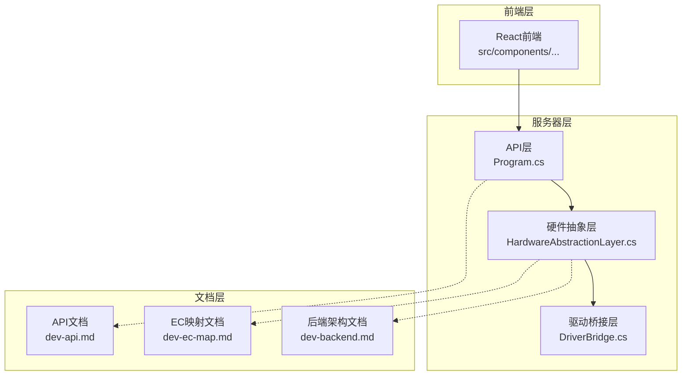
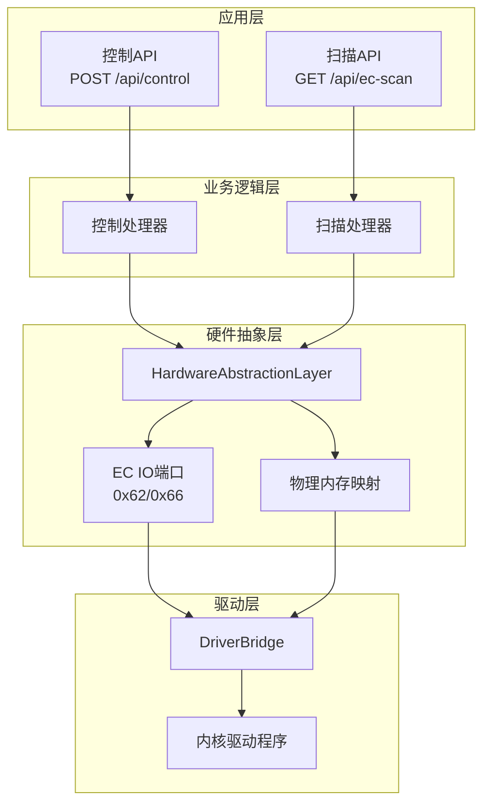
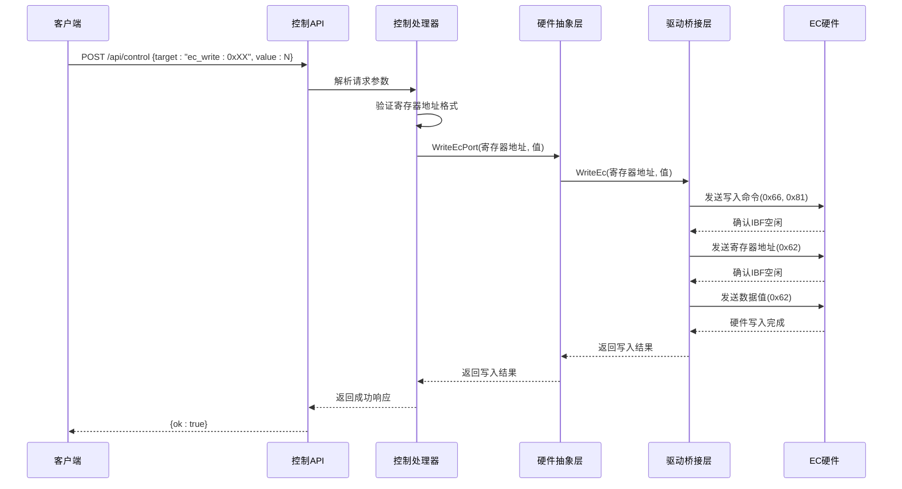
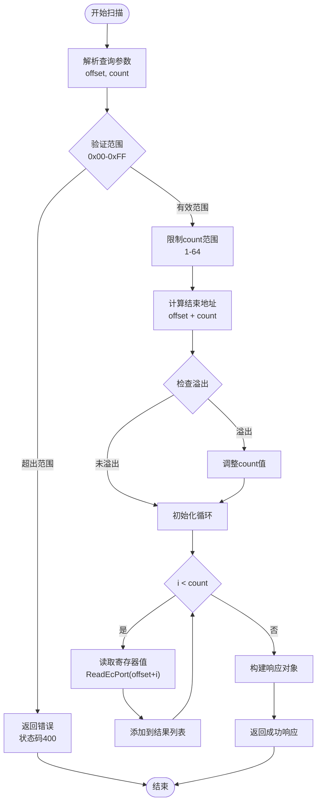
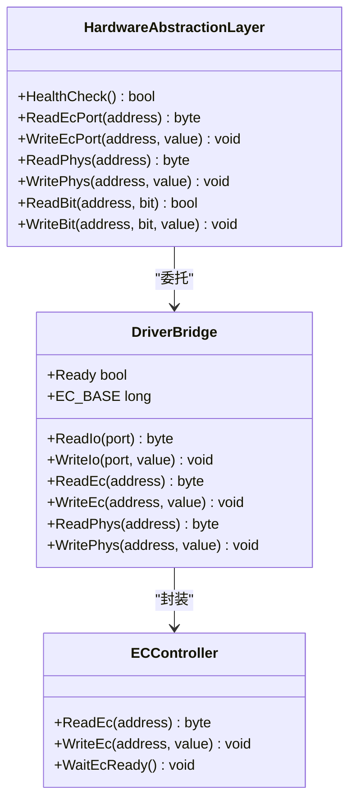
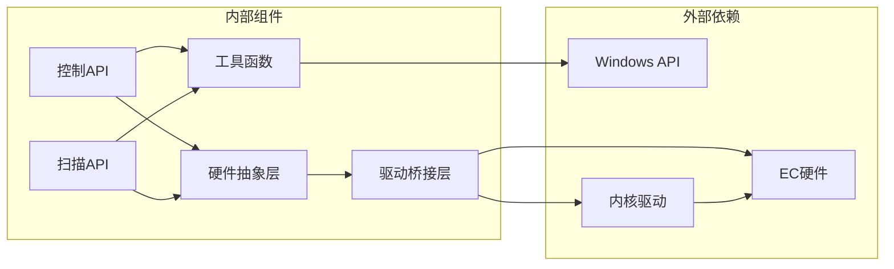

# EC寄存器控制API

<cite>
**本文档引用的文件**
- [Program.cs](file://server/api/Program.cs)
- [dev-ec-map.md](file://docs/dev-ec-map.md)
- [dev-backend.md](file://docs/dev-backend.md)
- [dev-api.md](file://docs/dev-api.md)
- [DriverBridge.cs](file://server/hal/DriverBridge.cs)
</cite>

## 目录
1. [简介](#简介)
2. [项目结构](#项目结构)
3. [核心组件](#核心组件)
4. [架构概览](#架构概览)
5. [详细组件分析](#详细组件分析)
6. [依赖关系分析](#依赖关系分析)
7. [性能考虑](#性能考虑)
8. [故障排除指南](#故障排除指南)
9. [结论](#结论)
10. [附录](#附录)

## 简介

EC寄存器控制API是DOUZHANZHE控制系统中的关键组件，负责直接访问和控制嵌入式控制器(EC)的硬件寄存器。该API提供了两种主要功能：通过POST /api/control端点进行EC寄存器写入操作，以及通过GET /api/ec-scan端点进行EC寄存器批量扫描。

EC寄存器控制API的核心价值在于它能够绕过传统的Windows驱动程序接口，直接与硬件交互，实现对风扇控制、键盘背光、散热模式等硬件功能的精确控制。这种直接硬件访问能力使得系统能够实现更精细的硬件调优和性能优化。

## 项目结构

该项目采用前后端分离的架构设计，EC寄存器控制API位于后端服务器部分，具体分布在以下目录结构中：



**图表来源**
- [Program.cs:174-238](file://server/api/Program.cs#L174-L238)
- [dev-api.md:1-53](file://docs/dev-api.md#L1-L53)

**章节来源**
- [Program.cs:174-238](file://server/api/Program.cs#L174-L238)
- [dev-api.md:1-53](file://docs/dev-api.md#L1-L53)

## 核心组件

### POST /api/control 端点

POST /api/control端点是EC寄存器控制API的核心入口，专门用于执行各种硬件控制操作。该端点支持多种target类型，其中EC寄存器写入是其重要功能之一。

#### 请求格式规范

请求体采用JSON格式，包含以下必需字段：

| 字段名 | 类型 | 必需 | 描述 | 示例 |
|--------|------|------|------|------|
| target | string | 是 | 控制目标标识符 | "ec_write:0xXX" |
| value | int | 是 | 要写入的数值 | 128 |

#### EC寄存器写入格式

对于EC寄存器写入操作，target参数必须采用特定格式："ec_write:0xXX"，其中XX表示十六进制寄存器地址。

**十六进制寄存器地址规范**：
- 格式：0xXX（必须以0x开头的十六进制数）
- 有效范围：0x00-0xFF（0-255十进制）
- 示例：0x5F、0x9A、0xFE800425

**写入值规范**：
- 类型：整数(int)
- 有效范围：根据具体寄存器而定
- 注意：某些寄存器有特定的数值含义和限制

#### 响应格式

成功响应返回标准JSON格式：
```json
{
  "ok": true
}
```

错误响应可能包含以下格式：
```json
{
  "error": "错误消息",
  "statusCode": 400
}
```

**章节来源**
- [Program.cs:174-203](file://server/api/Program.cs#L174-L203)
- [dev-api.md:20-34](file://docs/dev-api.md#L20-L34)

### GET /api/ec-scan 端点

GET /api/ec-scan端点提供EC寄存器的批量扫描功能，允许用户查询指定范围内的寄存器值。

#### 查询参数

| 参数名 | 类型 | 必需 | 默认值 | 描述 | 示例 |
|--------|------|------|--------|------|------|
| offset | string | 否 | "0" | 起始寄存器地址 | "0x50" 或 "80" |
| count | string | 否 | "16" | 扫描寄存器数量 | "32" |

**参数解析规则**：
- 支持十六进制和十进制格式
- 十六进制必须以"0x"前缀标识
- count参数被限制在1-64范围内

#### 响应格式

成功响应返回包含以下字段的JSON对象：

```json
{
  "ecBase": "0xFE800400",
  "offset": 80,
  "count": 16,
  "results": [
    {
      "offset": "0x50",
      "value": 128
    },
    {
      "offset": "0x51",
      "value": 64
    }
  ]
}
```

**章节来源**
- [Program.cs:214-238](file://server/api/Program.cs#L214-L238)
- [dev-api.md:51-53](file://docs/dev-api.md#L51-L53)

## 架构概览

EC寄存器控制API采用分层架构设计，确保了良好的模块化和可维护性：



**图表来源**
- [Program.cs:174-238](file://server/api/Program.cs#L174-L238)
- [DriverBridge.cs:105-137](file://server/hal/DriverBridge.cs#L105-L137)

**章节来源**
- [Program.cs:174-238](file://server/api/Program.cs#L174-L238)
- [DriverBridge.cs:105-137](file://server/hal/DriverBridge.cs#L105-L137)

## 详细组件分析

### EC寄存器写入流程

EC寄存器写入操作遵循严格的硬件协议，确保数据传输的可靠性和安全性：



**图表来源**
- [Program.cs:184-192](file://server/api/Program.cs#L184-L192)
- [DriverBridge.cs:121-137](file://server/hal/DriverBridge.cs#L121-L137)

### EC寄存器扫描流程

EC寄存器扫描功能提供了批量读取寄存器值的能力：



**图表来源**
- [Program.cs:214-238](file://server/api/Program.cs#L214-L238)

**章节来源**
- [Program.cs:184-192](file://server/api/Program.cs#L184-L192)
- [Program.cs:214-238](file://server/api/Program.cs#L214-L238)

### 硬件抽象层设计

硬件抽象层(HAL)提供了统一的硬件访问接口，隐藏了底层硬件差异：



**图表来源**
- [DriverBridge.cs:105-137](file://server/hal/DriverBridge.cs#L105-L137)

**章节来源**
- [DriverBridge.cs:105-137](file://server/hal/DriverBridge.cs#L105-L137)

## 依赖关系分析

EC寄存器控制API的依赖关系体现了清晰的分层架构：



**图表来源**
- [Program.cs:174-238](file://server/api/Program.cs#L174-L238)
- [DriverBridge.cs:105-137](file://server/hal/DriverBridge.cs#L105-L137)

**章节来源**
- [Program.cs:174-238](file://server/api/Program.cs#L174-L238)
- [DriverBridge.cs:105-137](file://server/hal/DriverBridge.cs#L105-L137)

## 性能考虑

EC寄存器控制API在设计时充分考虑了性能和可靠性：

### 并发控制
- 使用互斥锁确保EC访问的线程安全
- 防止多个线程同时访问EC硬件造成冲突
- 提供适当的超时机制避免死锁

### 缓存策略
- 对频繁访问的寄存器值进行缓存
- 减少不必要的硬件访问次数
- 实现智能缓存失效机制

### 错误处理
- 实现健壮的异常处理机制
- 提供详细的错误诊断信息
- 支持自动重试和降级策略

## 故障排除指南

### 常见问题及解决方案

#### 1. 硬件访问失败
**症状**：返回"硬件不可用"或"驱动未加载"
**解决方案**：
- 检查内核驱动是否正确安装
- 验证应用程序是否有足够的权限
- 确认EC硬件连接正常

#### 2. 寄存器地址无效
**症状**：返回"超出范围"错误
**解决方案**：
- 确保寄存器地址在0x00-0xFF范围内
- 检查十六进制格式是否正确
- 验证目标寄存器是否存在

#### 3. 写入操作失败
**症状**：写入后读取值不匹配
**解决方案**：
- 检查EC硬件协议时序
- 验证寄存器的可写性
- 确认目标寄存器没有只读保护

### 调试方法

#### 1. 启用详细日志
```csharp
// 在开发环境中启用详细日志输出
logger.LogInformation("EC寄存器写入: 地址=0x{Address}, 值={Value}", address, value);
```

#### 2. 使用调试工具
- 利用系统自带的硬件监控工具
- 检查Windows事件查看器中的相关日志
- 使用专门的EC寄存器扫描工具

#### 3. 分步验证
- 先测试简单的寄存器读取
- 逐步验证复杂寄存器的写入
- 建立完整的功能测试套件

**章节来源**
- [dev-ec-map.md:95-119](file://docs/dev-ec-map.md#L95-L119)

## 结论

EC寄存器控制API为DOUZHANZHE控制系统提供了强大的硬件控制能力。通过精心设计的API接口和严谨的实现，该系统能够在保证安全性的前提下，实现对EC硬件的精确控制。

### 主要优势

1. **直接硬件访问**：绕过传统驱动程序接口，实现更高效的硬件控制
2. **灵活的API设计**：支持多种控制目标和参数配置
3. **健壮的错误处理**：提供完善的错误诊断和恢复机制
4. **安全的访问控制**：通过权限验证和范围检查确保系统安全

### 未来发展方向

1. **扩展支持更多寄存器**：随着硬件功能的增加，持续扩展寄存器支持范围
2. **增强性能优化**：进一步优化硬件访问性能和响应速度
3. **完善监控功能**：增加更多的硬件状态监控和告警机制
4. **提升用户体验**：简化API使用方式，提供更友好的开发体验

## 附录

### EC寄存器操作最佳实践

#### 1. 安全操作原则
- 始终验证寄存器地址的有效性
- 遵循EC硬件的协议时序要求
- 实施适当的超时和重试机制
- 记录所有硬件访问操作

#### 2. 性能优化建议
- 批量处理相似的寄存器操作
- 实现智能的缓存策略
- 避免频繁的硬件访问
- 使用异步操作提高响应性

#### 3. 错误处理策略
- 实现分级的错误处理机制
- 提供有意义的错误信息
- 支持自动恢复和降级操作
- 建立完善的日志记录系统

**章节来源**
- [dev-ec-map.md:95-119](file://docs/dev-ec-map.md#L95-L119)
- [dev-backend.md:66-84](file://docs/dev-backend.md#L66-L84)