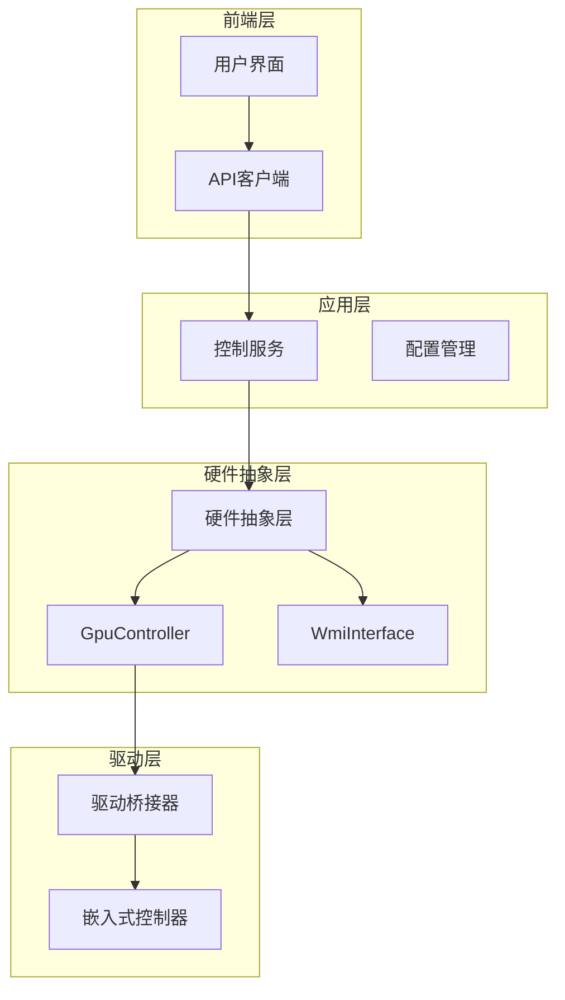
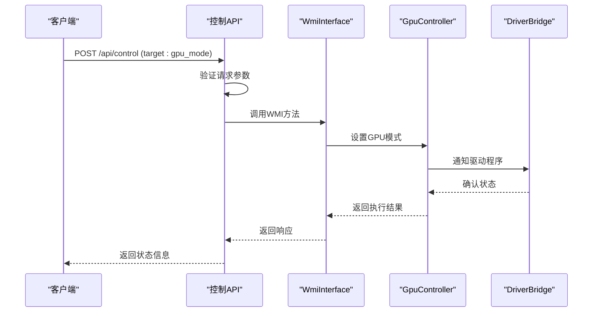
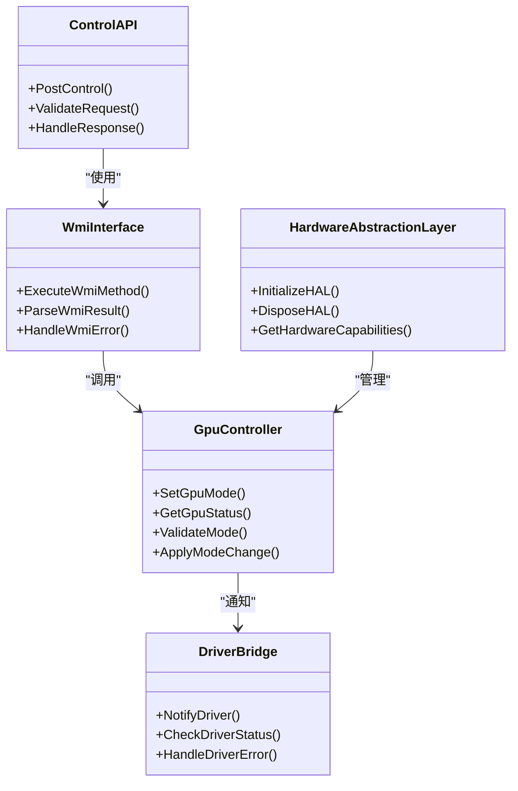
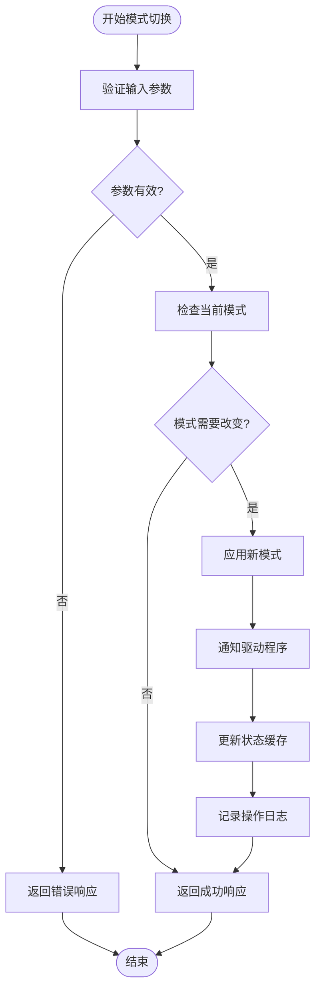
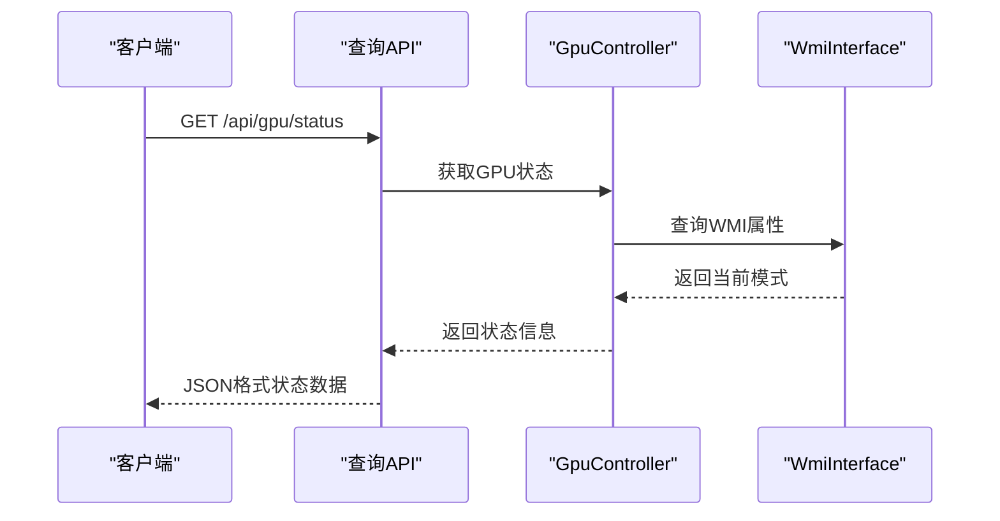
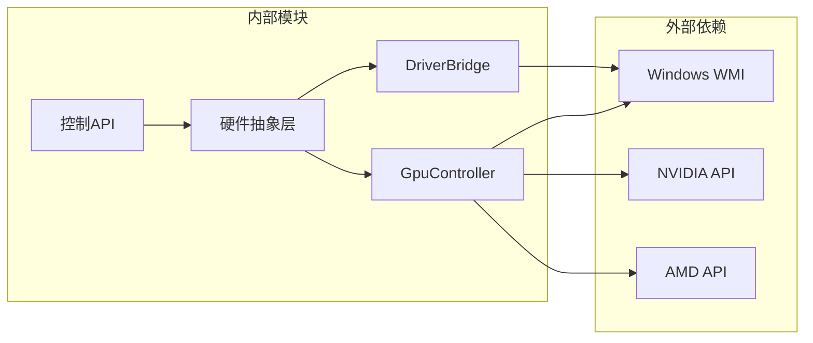
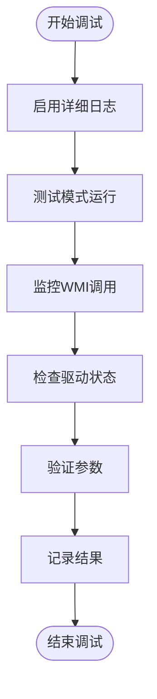

# GPU模式控制API

<cite>
**本文档引用的文件**
- [Douzhanzhe.API.http](file://server/api/Douzhanzhe.API.http)
- [Program.cs](file://server/api/Program.cs)
- [WmiInterface.cs](file://server/api/WmiInterface.cs)
- [GpuController.cs](file://server/hal/GpuController.cs)
- [DriverBridge.cs](file://server/hal/DriverBridge.cs)
- [HardwareAbstractionLayer.cs](file://server/hal/HardwareAbstractionLayer.cs)
- [appsettings.json](file://server/api/appsettings.json)
- [custom-params.json](file://server/api/config/custom-params.json)
</cite>

## 目录
1. [简介](#简介)
2. [项目结构](#项目结构)
3. [核心组件](#核心组件)
4. [架构概览](#架构概览)
5. [详细组件分析](#详细组件分析)
6. [依赖关系分析](#依赖关系分析)
7. [性能考虑](#性能考虑)
8. [故障排除指南](#故障排除指南)
9. [结论](#结论)

## 简介

本文档详细说明了GPU模式控制API的实现，重点关注POST /api/control端点中target为gpu_mode的GPU模式切换功能。该系统支持三种GPU模式：混合模式（0）、集显模式（1）、独显模式（2），通过WMI接口实现底层硬件控制。

## 项目结构

系统采用分层架构设计，主要包含以下组件：

**图表来源**
- [Program.cs:1-200](file://server/api/Program.cs#L1-L200)
- [HardwareAbstractionLayer.cs:1-150](file://server/hal/HardwareAbstractionLayer.cs#L1-L150)

**章节来源**
- [Program.cs:1-200](file://server/api/Program.cs#L1-L200)
- [HardwareAbstractionLayer.cs:1-150](file://server/hal/HardwareAbstractionLayer.cs#L1-L150)

## 核心组件

### GPU模式控制端点

POST /api/control端点负责处理GPU模式切换请求，支持以下模式：

| 模式编号 | 模式名称 | 描述 |
|---------|----------|------|
| 0 | 混合模式 | 自动在集成显卡和独立显卡之间切换，平衡性能和功耗 |
| 1 | 集显模式 | 仅使用集成显卡，低功耗，适合日常办公和轻度使用 |
| 2 | 独显模式 | 仅使用独立显卡，高性能，适合游戏和专业应用 |

### WMI接口实现

系统通过WMI（Windows Management Instrumentation）接口与硬件进行交互：

**图表来源**
- [WmiInterface.cs:1-200](file://server/api/WmiInterface.cs#L1-L200)
- [GpuController.cs:1-200](file://server/hal/GpuController.cs#L1-L200)

**章节来源**
- [Douzhanzhe.API.http:1-100](file://server/api/Douzhanzhe.API.http#L1-L100)
- [WmiInterface.cs:1-200](file://server/api/WmiInterface.cs#L1-L200)
- [GpuController.cs:1-200](file://server/hal/GpuController.cs#L1-L200)

## 架构概览

系统采用分层架构，确保硬件控制的可靠性和可维护性：

**图表来源**
- [Program.cs:1-200](file://server/api/Program.cs#L1-L200)
- [WmiInterface.cs:1-200](file://server/api/WmiInterface.cs#L1-L200)
- [GpuController.cs:1-200](file://server/hal/GpuController.cs#L1-L200)
- [DriverBridge.cs:1-200](file://server/hal/DriverBridge.cs#L1-L200)

## 详细组件分析

### GPU模式切换流程

GPU模式切换是一个复杂的多步骤过程，涉及多个组件的协调工作：

**图表来源**
- [GpuController.cs:1-200](file://server/hal/GpuController.cs#L1-L200)
- [DriverBridge.cs:1-200](file://server/hal/DriverBridge.cs#L1-L200)

### 错误处理机制

系统实现了多层次的错误处理机制：

| 错误类型 | 处理策略 | 用户反馈 |
|----------|----------|----------|
| 参数验证失败 | 返回400 Bad Request | 明确的错误消息 |
| WMI调用失败 | 重试机制 + 回滚 | 重试提示或回滚确认 |
| 驱动程序异常 | 驱动状态检查 + 重启 | 驱动修复建议 |
| 硬件不支持 | 硬件兼容性检查 | 兼容性警告 |

**章节来源**
- [WmiInterface.cs:1-200](file://server/api/WmiInterface.cs#L1-L200)
- [GpuController.cs:1-200](file://server/hal/GpuController.cs#L1-L200)

### 状态查询实现

GPU模式状态查询通过以下方式实现：

**图表来源**
- [GpuController.cs:1-200](file://server/hal/GpuController.cs#L1-L200)
- [WmiInterface.cs:1-200](file://server/api/WmiInterface.cs#L1-L200)

**章节来源**
- [GpuController.cs:1-200](file://server/hal/GpuController.cs#L1-L200)

## 依赖关系分析

系统组件之间的依赖关系如下：

**图表来源**
- [Program.cs:1-200](file://server/api/Program.cs#L1-L200)
- [HardwareAbstractionLayer.cs:1-150](file://server/hal/HardwareAbstractionLayer.cs#L1-L150)

**章节来源**
- [Program.cs:1-200](file://server/api/Program.cs#L1-L200)
- [HardwareAbstractionLayer.cs:1-150](file://server/hal/HardwareAbstractionLayer.cs#L1-L150)

## 性能考虑

### 不同GPU模式的性能影响

| 模式 | 性能表现 | 功耗水平 | 散热需求 | 适用场景 |
|------|----------|----------|----------|----------|
| 混合模式(0) | 自适应性能 | 中等偏低 | 中等 | 日常办公、轻度游戏 |
| 集显模式(1) | 低性能 | 最低 | 最低 | 文档处理、网页浏览 |
| 独显模式(2) | 高性能 | 最高 | 最高 | 游戏、视频编辑、3D渲染 |

### 性能优化建议

1. **自动模式选择**：根据使用场景自动调整GPU模式
2. **温度监控**：实时监控GPU温度，避免过热
3. **电源管理**：结合系统电源计划优化性能
4. **驱动更新**：定期更新显卡驱动程序

## 故障排除指南

### 常见问题及解决方案

| 问题描述 | 可能原因 | 解决方案 |
|----------|----------|----------|
| 模式切换失败 | 权限不足 | 以管理员身份运行 |
| 驱动程序冲突 | 驱动版本不兼容 | 更新或回滚驱动程序 |
| WMI访问被拒绝 | 安全策略限制 | 检查Windows安全设置 |
| 模式状态不一致 | 缓存同步问题 | 重启服务或重新初始化 |

### 调试和诊断

系统提供了完整的调试和诊断功能：

**章节来源**
- [appsettings.json:1-100](file://server/api/appsettings.json#L1-L100)
- [custom-params.json:1-100](file://server/api/config/custom-params.json#L1-L100)

## 结论

GPU模式控制API提供了完整的硬件抽象层，支持多种GPU模式的灵活切换。通过WMI接口实现，系统能够可靠地控制硬件行为，同时提供完善的错误处理和状态查询机制。建议用户根据具体使用场景选择合适的GPU模式，并定期维护系统以确保最佳性能和稳定性。