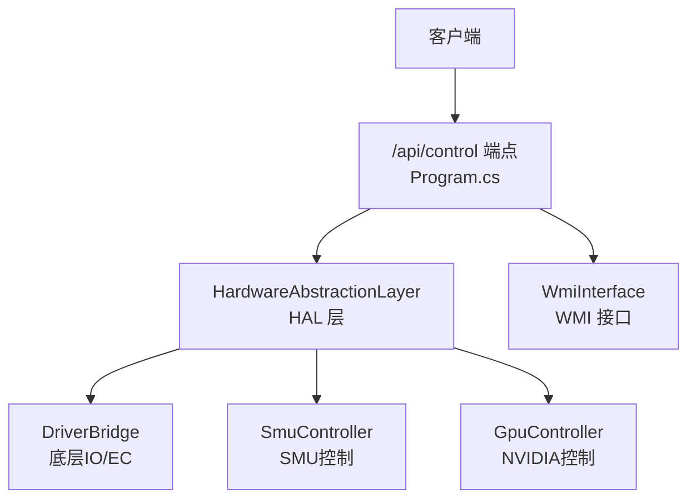
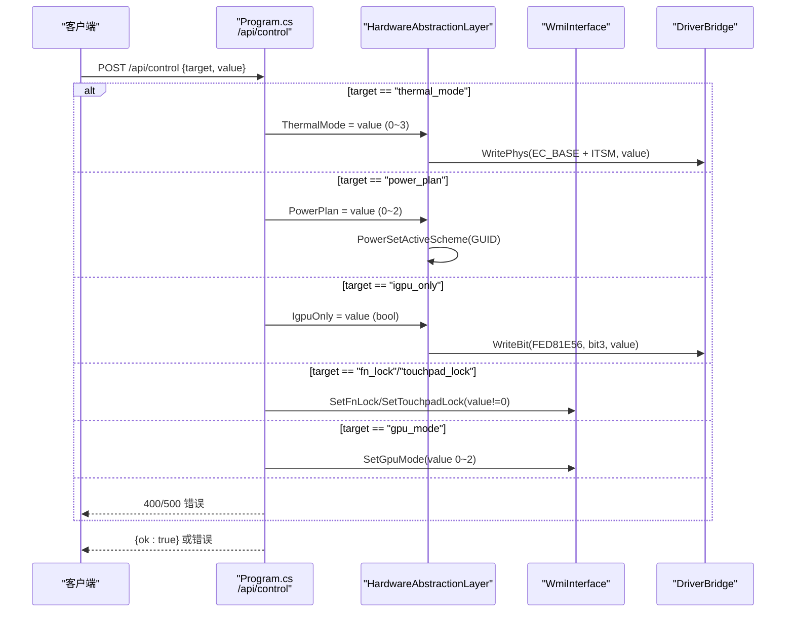
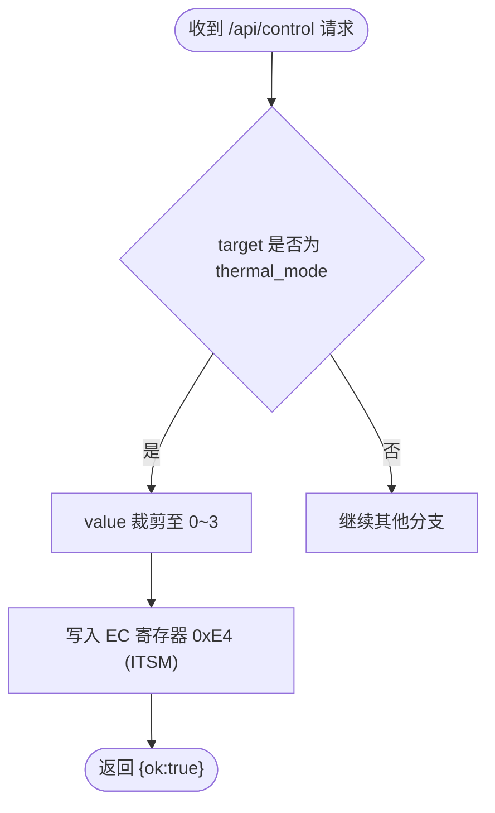
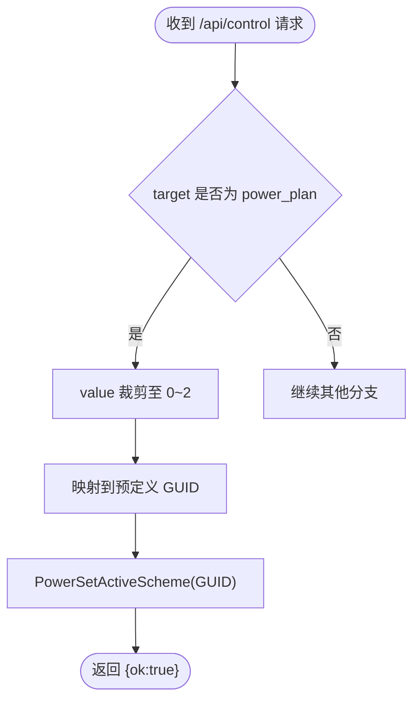
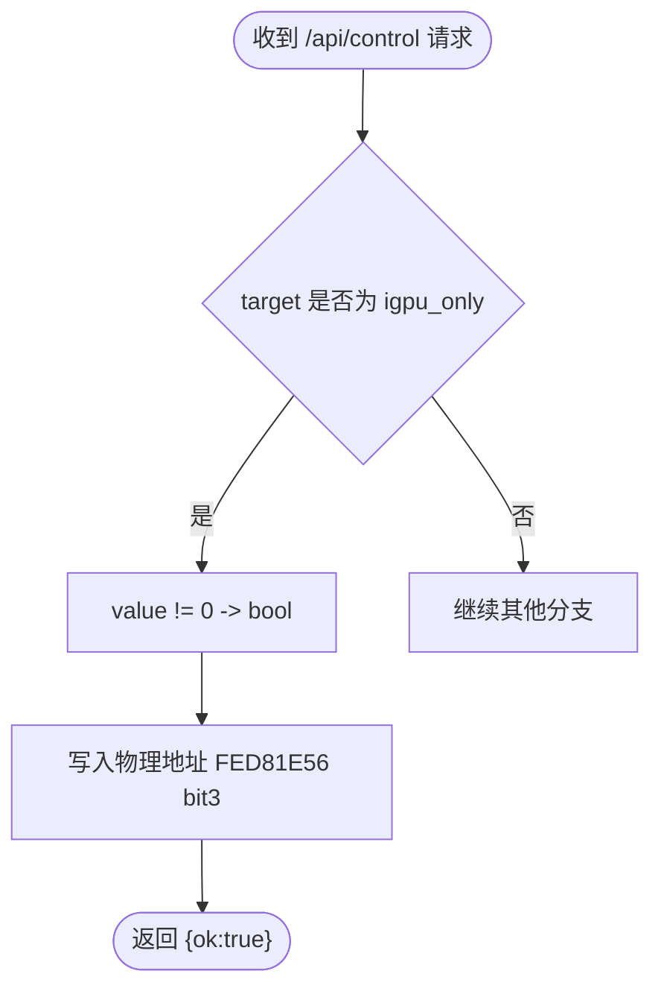
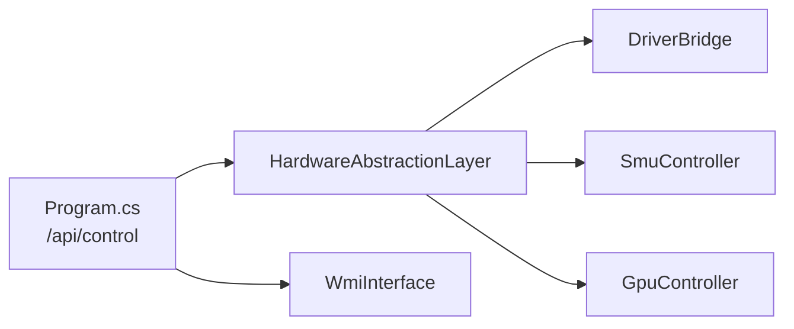

# 散热与电源控制API

<cite>
**本文档引用的文件**
- [Program.cs](file://server/api/Program.cs)
- [HardwareAbstractionLayer.cs](file://server/hal/HardwareAbstractionLayer.cs)
- [WmiInterface.cs](file://server/api/WmiInterface.cs)
- [DriverBridge.cs](file://server/hal/DriverBridge.cs)
- [GpuController.cs](file://server/hal/GpuController.cs)
- [SmuController.cs](file://server/hal/SmuController.cs)
- [Douzhanzhe.API.http](file://server/api/Douzhanzhe.API.http)
</cite>

## 目录
1. [简介](#简介)
2. [项目结构](#项目结构)
3. [核心组件](#核心组件)
4. [架构总览](#架构总览)
5. [详细组件分析](#详细组件分析)
6. [依赖关系分析](#依赖关系分析)
7. [性能考虑](#性能考虑)
8. [故障排除指南](#故障排除指南)
9. [结论](#结论)

## 简介
本文档面向散热与电源控制API，聚焦于POST /api/control端点中两个关键控制项：
- thermal_mode（散热模式）
- power_plan（电源计划）

同时解释igpu_only（集显优先）模式的切换机制，并基于源码给出参数范围、硬件映射、控制流程与最佳实践建议。

## 项目结构
后端采用ASP.NET Core Minimal API，服务端点集中在Program.cs中；硬件抽象与底层控制由HAL层提供，包括：
- DriverBridge：底层IO与EC访问
- HardwareAbstractionLayer：系统遥测与控制（含thermal_mode、power_plan、igpu_only等）
- WmiInterface：WMI接口封装（用于部分系统功能）
- SmuController：AMD SMU控制（ryzenadj子进程）
- GpuController：NVIDIA GPU控制（nvidia-smi子进程）

图表来源
- [Program.cs:145-203](file://server/api/Program.cs#L145-L203)
- [HardwareAbstractionLayer.cs:335-426](file://server/hal/HardwareAbstractionLayer.cs#L335-L426)
- [WmiInterface.cs:18-48](file://server/api/WmiInterface.cs#L18-L48)
- [DriverBridge.cs:9-37](file://server/hal/DriverBridge.cs#L9-L37)
- [SmuController.cs:12-41](file://server/hal/SmuController.cs#L12-L41)
- [GpuController.cs:10-40](file://server/hal/GpuController.cs#L10-L40)

章节来源
- [Program.cs:1-839](file://server/api/Program.cs#L1-L839)
- [HardwareAbstractionLayer.cs:1-772](file://server/hal/HardwareAbstractionLayer.cs#L1-L772)
- [WmiInterface.cs:1-210](file://server/api/WmiInterface.cs#L1-L210)
- [DriverBridge.cs:1-150](file://server/hal/DriverBridge.cs#L1-L150)
- [SmuController.cs:1-142](file://server/hal/SmuController.cs#L1-L142)
- [GpuController.cs:1-116](file://server/hal/GpuController.cs#L1-L116)

## 核心组件
- /api/control端点：统一入口，根据target分发到不同控制逻辑
- HardwareAbstractionLayer：提供thermal_mode、power_plan、igpu_only等属性的读写
- WmiInterface：提供Fn/TPLock、风扇控制、GPU模式等WMI相关能力
- DriverBridge：提供EC寄存器读写、SMU通信等底层能力
- SmuController：通过ryzenadj子进程设置AMD CPU功耗、温度、频率等
- GpuController：通过nvidia-smi子进程设置NVIDIA GPU频率与显存频率

章节来源
- [Program.cs:145-203](file://server/api/Program.cs#L145-L203)
- [HardwareAbstractionLayer.cs:113-136](file://server/hal/HardwareAbstractionLayer.cs#L113-L136)
- [HardwareAbstractionLayer.cs:335-340](file://server/hal/HardwareAbstractionLayer.cs#L335-L340)
- [HardwareAbstractionLayer.cs:403-426](file://server/hal/HardwareAbstractionLayer.cs#L403-L426)
- [WmiInterface.cs:62-87](file://server/api/WmiInterface.cs#L62-L87)
- [DriverBridge.cs:28-62](file://server/hal/DriverBridge.cs#L28-L62)
- [SmuController.cs:43-95](file://server/hal/SmuController.cs#L43-L95)
- [GpuController.cs:14-86](file://server/hal/GpuController.cs#L14-L86)

## 架构总览
POST /api/control的处理流程如下：

图表来源
- [Program.cs:145-203](file://server/api/Program.cs#L145-L203)
- [HardwareAbstractionLayer.cs:335-340](file://server/hal/HardwareAbstractionLayer.cs#L335-L340)
- [HardwareAbstractionLayer.cs:113-136](file://server/hal/HardwareAbstractionLayer.cs#L113-L136)
- [HardwareAbstractionLayer.cs:403-426](file://server/hal/HardwareAbstractionLayer.cs#L403-L426)
- [WmiInterface.cs:62-87](file://server/api/WmiInterface.cs#L62-L87)
- [DriverBridge.cs:28-62](file://server/hal/DriverBridge.cs#L28-L62)

## 详细组件分析

### POST /api/control 端点与控制机制
- 请求体包含target与value字段
- target支持："thermal_mode"、"power_plan"、"igpu_only"、"fn_lock"、"touchpad_lock"、"gpu_mode"等
- value会被裁剪到有效范围后再写入（如thermal_mode限制在0~3，power_plan限制在0~2）

章节来源
- [Program.cs:145-203](file://server/api/Program.cs#L145-L203)

### thermal_mode（散热模式）控制
- 参数范围：0~3
- 实现方式：写入EC寄存器0xE4（ITSM），对应物理地址为EC_BASE + 0xE4
- 对应关系（基于HAL注释与WMI命令映射）：
  - 0：均衡
  - 1：野兽
  - 2：安静
  - 3：斗战
- 写入路径：HardwareAbstractionLayer.ThermalMode属性调用DriverBridge.WritePhys完成

图表来源
- [Program.cs:169-171](file://server/api/Program.cs#L169-L171)
- [HardwareAbstractionLayer.cs:335-340](file://server/hal/HardwareAbstractionLayer.cs#L335-L340)
- [DriverBridge.cs:121-137](file://server/hal/DriverBridge.cs#L121-L137)

章节来源
- [Program.cs:169-171](file://server/api/Program.cs#L169-L171)
- [HardwareAbstractionLayer.cs:335-340](file://server/hal/HardwareAbstractionLayer.cs#L335-L340)
- [DriverBridge.cs:121-137](file://server/hal/DriverBridge.cs#L121-L137)

### power_plan（电源计划）控制
- 参数范围：0~2
- 实现方式：通过Windows电源计划API切换到预定义的GUID之一
- 对应关系：
  - 0：平衡（balanced）
  - 1：高性能（high performance）
  - 2：节能（power saver）
- 写入路径：HardwareAbstractionLayer.PowerPlan属性调用PowerSetActiveScheme完成

图表来源
- [Program.cs:166-168](file://server/api/Program.cs#L166-L168)
- [HardwareAbstractionLayer.cs:113-136](file://server/hal/HardwareAbstractionLayer.cs#L113-L136)

章节来源
- [Program.cs:166-168](file://server/api/Program.cs#L166-L168)
- [HardwareAbstractionLayer.cs:113-136](file://server/hal/HardwareAbstractionLayer.cs#L113-L136)

### igpu_only（集显优先）模式切换
- 参数：布尔值（非0视为true）
- 实现方式：通过DSAD方法访问物理地址0xFED81E56，设置bit3（ADPD）控制dGPU电源状态
  - true：ADPD=1，断电（仅集显）
  - false：ADPD=0，通电（混合/独显）
- 写入路径：HardwareAbstractionLayer.IgpuOnly属性调用DriverBridge.WriteBit完成

图表来源
- [Program.cs:172-174](file://server/api/Program.cs#L172-L174)
- [HardwareAbstractionLayer.cs:403-426](file://server/hal/HardwareAbstractionLayer.cs#L403-L426)
- [DriverBridge.cs:102-103](file://server/hal/DriverBridge.cs#L102-L103)

章节来源
- [Program.cs:172-174](file://server/api/Program.cs#L172-L174)
- [HardwareAbstractionLayer.cs:403-426](file://server/hal/HardwareAbstractionLayer.cs#L403-L426)
- [DriverBridge.cs:102-103](file://server/hal/DriverBridge.cs#L102-L103)

### 其他相关控制（WMI）
- fn_lock/touchpad_lock：通过WMI方法11/12设置
- gpu_mode：通过WMI方法9设置（0=混合，1=集显，2=独显）

章节来源
- [Program.cs:154-165](file://server/api/Program.cs#L154-L165)
- [WmiInterface.cs:62-87](file://server/api/WmiInterface.cs#L62-L87)

## 依赖关系分析
- /api/control依赖HAL层提供的属性写入能力
- HAL层依赖DriverBridge进行EC寄存器与物理地址访问
- 部分功能通过WMI接口实现（Fn/TPLock、风扇、GPU模式）
- SMU与NVIDIA控制为独立端点，不参与/api/control

图表来源
- [Program.cs:145-203](file://server/api/Program.cs#L145-L203)
- [HardwareAbstractionLayer.cs:335-426](file://server/hal/HardwareAbstractionLayer.cs#L335-L426)
- [WmiInterface.cs:18-48](file://server/api/WmiInterface.cs#L18-L48)
- [DriverBridge.cs:9-37](file://server/hal/DriverBridge.cs#L9-L37)
- [SmuController.cs:12-41](file://server/hal/SmuController.cs#L12-L41)
- [GpuController.cs:10-40](file://server/hal/GpuController.cs#L10-L40)

章节来源
- [Program.cs:145-203](file://server/api/Program.cs#L145-L203)
- [HardwareAbstractionLayer.cs:335-426](file://server/hal/HardwareAbstractionLayer.cs#L335-L426)
- [WmiInterface.cs:18-48](file://server/api/WmiInterface.cs#L18-L48)
- [DriverBridge.cs:9-37](file://server/hal/DriverBridge.cs#L9-L37)
- [SmuController.cs:12-41](file://server/hal/SmuController.cs#L12-L41)
- [GpuController.cs:10-40](file://server/hal/GpuController.cs#L10-L40)

## 性能考虑
- /api/control端点为轻量同步调用，写入EC或调用Windows API，延迟通常在毫秒级
- thermal_mode与power_plan切换即时生效，但系统策略可能需要数秒到数十秒才能完全稳定
- igpu_only切换涉及dGPU供电，建议在空载或低负载场景执行，避免应用中断
- 遥测端点会触发外部进程查询（如nvidia-smi、powershell），建议按需调用，避免频繁轮询

## 故障排除指南
- 无法写入EC寄存器
  - 检查DriverBridge驱动是否加载成功（Ready为true）
  - 确认以管理员权限运行
- /api/control返回500
  - 查看具体target分支是否抛出异常
  - 检查WMI方法调用是否成功（fn_lock/touchpad_lock/gpu_mode）
- thermal_mode/poer_plan未生效
  - 确认value被正确裁剪到0~3或0~2
  - 检查Windows电源计划切换是否成功
- igpu_only切换失败
  - 确认物理地址访问权限
  - 检查dGPU供电状态是否允许切换

章节来源
- [Program.cs:194-202](file://server/api/Program.cs#L194-L202)
- [DriverBridge.cs:39-62](file://server/hal/DriverBridge.cs#L39-L62)
- [WmiInterface.cs:72-87](file://server/api/WmiInterface.cs#L72-L87)
- [HardwareAbstractionLayer.cs:403-426](file://server/hal/HardwareAbstractionLayer.cs#L403-L426)

## 结论
POST /api/control通过统一入口实现了对散热模式、电源计划与集显优先等关键系统的控制。其核心在于：
- thermal_mode：写入EC ITSM寄存器，映射为均衡/野兽/安静/斗战
- power_plan：通过Windows电源计划API切换为平衡/高性能/节能
- igpu_only：通过DSAD方法控制dGPU供电，实现集显优先

建议在生产环境中结合业务场景合理选择模式，并注意切换时机与系统稳定性。