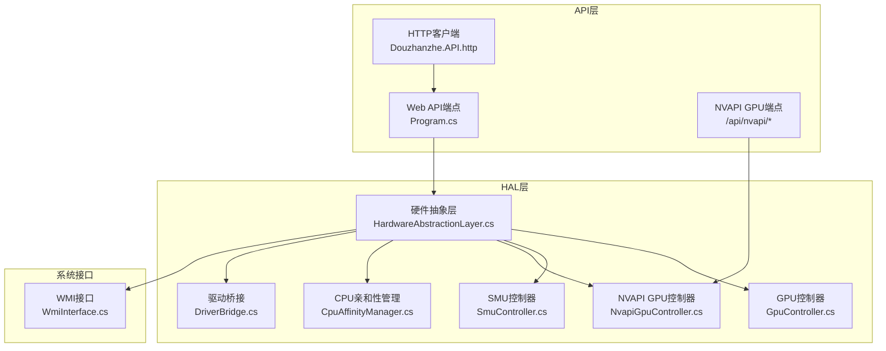
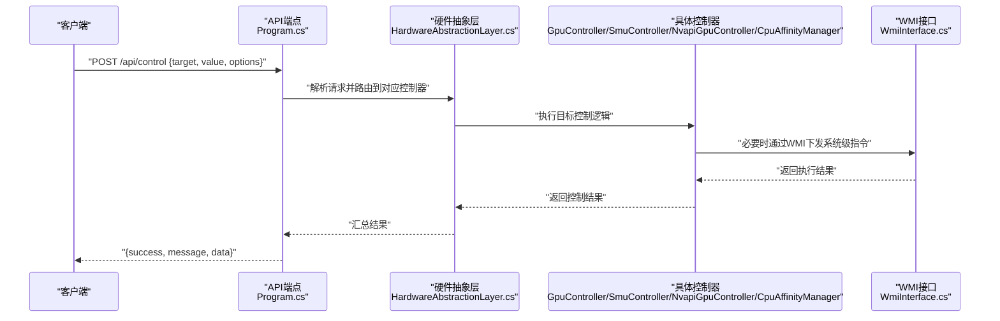
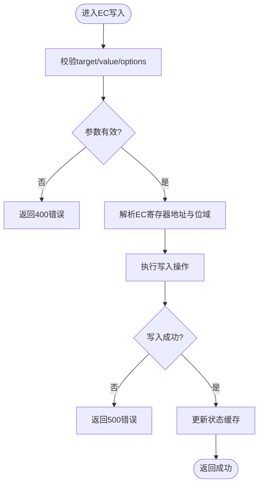
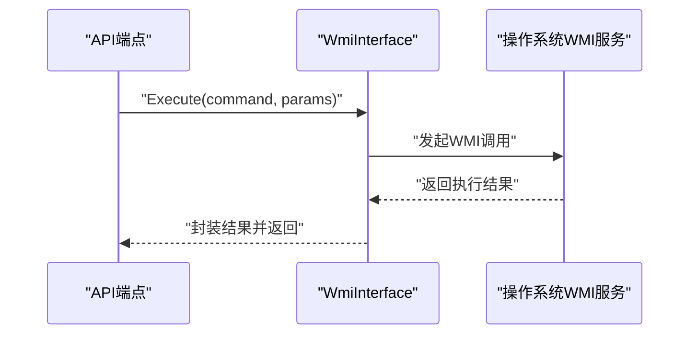
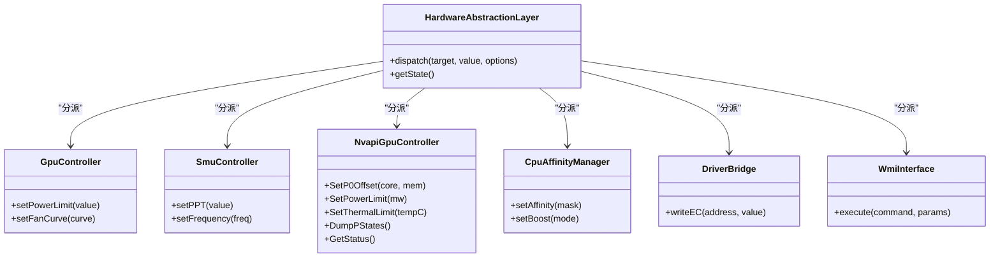
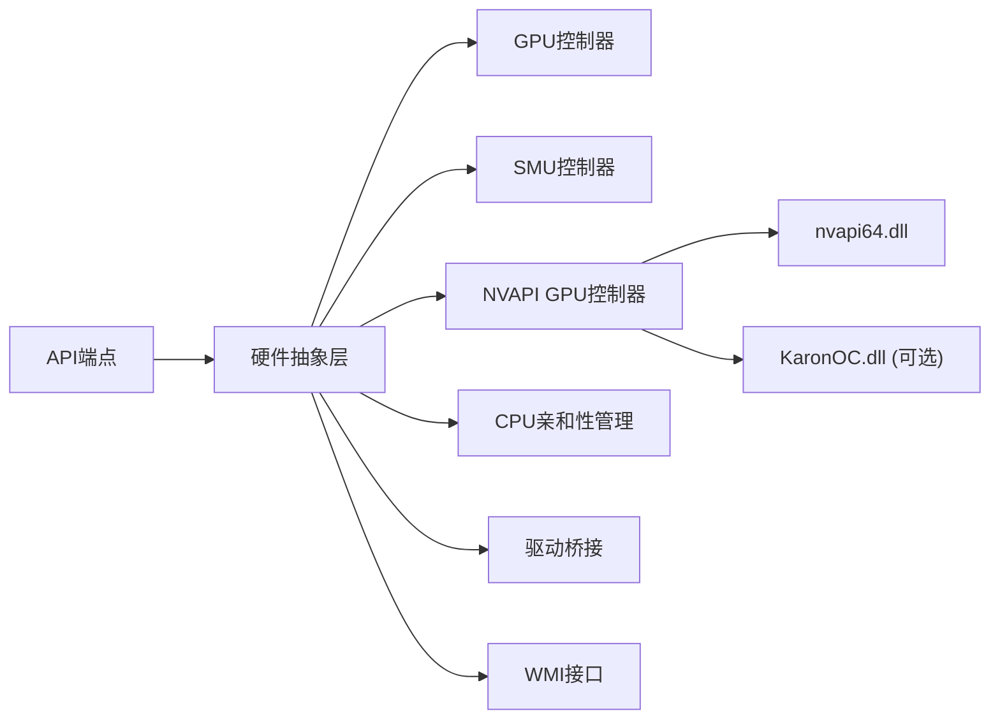

# 硬件控制API

<cite>
**本文档引用的文件**
- [Douzhanzhe.API.http](file://server/api/Douzhanzhe.API.http)
- [Program.cs](file://server/api/Program.cs)
- [WmiInterface.cs](file://server/api/WmiInterface.cs)
- [DriverBridge.cs](file://server/hal/DriverBridge.cs)
- [HardwareAbstractionLayer.cs](file://server/hal/HardwareAbstractionLayer.cs)
- [GpuController.cs](file://server/hal/GpuController.cs)
- [SmuController.cs](file://server/hal/SmuController.cs)
- [NvapiGpuController.cs](file://server/hal/NvapiGpuController.cs)
- [CpuAffinityManager.cs](file://server/hal/CpuAffinityManager.cs)
- [dev-api.md](file://docs/dev-api.md)
- [dev-architecture.md](file://docs/dev-architecture.md)
- [dev-backend.md](file://docs/dev-backend.md)
- [dev-ec-map.md](file://docs/dev-ec-map.md)
- [reference-consoles.md](file://docs/reference-consoles.md)
</cite>

## 目录
1. [简介](#简介)
2. [项目结构](#项目结构)
3. [核心组件](#核心组件)
4. [架构总览](#架构总览)
5. [详细组件分析](#详细组件分析)
6. [NVAPI GPU控制API](#nvapi-gpu控制api)
7. [依赖关系分析](#依赖关系分析)
8. [性能考量](#性能考量)
9. [故障排除指南](#故障排除指南)
10. [结论](#结论)
11. [附录](#附录)

## 简介
本文件面向硬件控制API的使用者与维护者，系统性阐述POST /api/control端点的控制请求格式、支持的控制目标（如键盘背光、Fn锁定、触摸板锁定等）、底层控制机制（EC寄存器写入、WMI命令执行）以及权限、安全与错误处理策略。文档同时提供参数验证与边界检查说明，并通过图示展示关键流程。**新增** NVAPI GPU控制API端点的详细说明，包括/status、/overclock、/dump-pstates、/thermal-limit、/power-limit等端点。

## 项目结构
后端采用ASP.NET Core Web API，HAL层封装底层硬件抽象，WMI接口用于与系统固件交互，前端通过HTTP客户端调用API。核心文件分布如下：
- API层：定义HTTP契约与端点（Program.cs、Douzhanzhe.API.http）
- HAL层：抽象硬件控制器（HardwareAbstractionLayer.cs、GpuController.cs、SmuController.cs、NvapiGpuController.cs、CpuAffinityManager.cs、DriverBridge.cs）
- WMI接口：系统级控制通道（WmiInterface.cs）
- 文档：开发API规范、架构设计、后端实现细节、EC映射与参考控制台



**图表来源**
- [Program.cs:1-200](file://server/api/Program.cs#L1-L200)
- [HardwareAbstractionLayer.cs:1-200](file://server/hal/HardwareAbstractionLayer.cs#L1-L200)
- [GpuController.cs:1-200](file://server/hal/GpuController.cs#L1-L200)
- [SmuController.cs:1-200](file://server/hal/SmuController.cs#L1-L200)
- [NvapiGpuController.cs:1-200](file://server/hal/NvapiGpuController.cs#L1-L200)
- [CpuAffinityManager.cs:1-200](file://server/hal/CpuAffinityManager.cs#L1-L200)
- [DriverBridge.cs:1-200](file://server/hal/DriverBridge.cs#L1-L200)
- [WmiInterface.cs:1-200](file://server/api/WmiInterface.cs#L1-L200)

**章节来源**
- [Program.cs:1-200](file://server/api/Program.cs#L1-L200)
- [dev-architecture.md:1-200](file://docs/dev-architecture.md#L1-L200)

## 核心组件
- 控制端点与契约
  - POST /api/control：接收控制请求，返回执行结果或错误信息
  - 请求体字段：target（控制目标）、value（目标值）、options（可选参数）
  - 响应体字段：success（布尔）、message（字符串）、data（可选负载）

- HAL层职责
  - HardwareAbstractionLayer：统一调度各控制器
  - GpuController：GPU相关控制（如风扇曲线、显卡功耗）
  - SmuController：系统管理单元控制（如PPT限制、频率调节）
  - NvapiGpuController：**新增** NVIDIA GPU NVAPI控制（超频、功率限制、温度限制）
  - CpuAffinityManager：CPU亲和性与调度策略
  - DriverBridge：与底层驱动通信的桥接层

- WMI接口
  - WmiInterface：封装WMI命令执行，用于系统级控制（如电源策略、设备状态）

- 文档支撑
  - dev-api.md：API规范与示例
  - dev-ec-map.md：EC寄存器映射与写入规则
  - reference-consoles.md：参考控制台与厂商工具链

**章节来源**
- [Douzhanzhe.API.http:1-200](file://server/api/Douzhanzhe.API.http#L1-L200)
- [HardwareAbstractionLayer.cs:1-200](file://server/hal/HardwareAbstractionLayer.cs#L1-L200)
- [GpuController.cs:1-200](file://server/hal/GpuController.cs#L1-L200)
- [SmuController.cs:1-200](file://server/hal/SmuController.cs#L1-L200)
- [NvapiGpuController.cs:1-200](file://server/hal/NvapiGpuController.cs#L1-L200)
- [CpuAffinityManager.cs:1-200](file://server/hal/CpuAffinityManager.cs#L1-L200)
- [DriverBridge.cs:1-200](file://server/hal/DriverBridge.cs#L1-L200)
- [WmiInterface.cs:1-200](file://server/api/WmiInterface.cs#L1-L200)
- [dev-api.md:1-200](file://docs/dev-api.md#L1-L200)
- [dev-ec-map.md:1-200](file://docs/dev-ec-map.md#L1-L200)
- [reference-consoles.md:1-200](file://docs/reference-consoles.md#L1-L200)

## 架构总览
POST /api/control的典型调用序列如下：



**图表来源**
- [Program.cs:1-200](file://server/api/Program.cs#L1-L200)
- [HardwareAbstractionLayer.cs:1-200](file://server/hal/HardwareAbstractionLayer.cs#L1-L200)
- [GpuController.cs:1-200](file://server/hal/GpuController.cs#L1-L200)
- [SmuController.cs:1-200](file://server/hal/SmuController.cs#L1-L200)
- [NvapiGpuController.cs:1-200](file://server/hal/NvapiGpuController.cs#L1-L200)
- [CpuAffinityManager.cs:1-200](file://server/hal/CpuAffinityManager.cs#L1-L200)
- [WmiInterface.cs:1-200](file://server/api/WmiInterface.cs#L1-L200)

## 详细组件分析

### 控制目标与请求格式
- 支持的控制目标（target示例）
  - keyboard_backlight：键盘背光强度（数值范围需满足设备支持）
  - fn_lock：Fn锁定开关（布尔）
  - touchpad_lock：触摸板锁定开关（布尔）
  - gpu_power_limit：GPU功耗限制（瓦特）
  - cpu_boost：CPU加速策略（枚举：禁用/启用/自动）
  - fan_curve：风扇曲线配置（数组或预设索引）
  - power_mode：电源模式（静音/均衡/高性能）
  - wmi_command：WMI命令名（字符串），配合options传递参数

- 请求体字段
  - target：必需，字符串，控制目标标识
  - value：根据target类型而定，数值、布尔或对象
  - options：可选，对象，传递额外参数（如WMI参数、EC寄存器地址等）

- 响应体字段
  - success：布尔，是否成功
  - message：字符串，简要描述（成功或失败原因）
  - data：可选，返回当前状态或执行结果摘要

- 参数验证与边界检查
  - 数值型：检查范围（如keyboard_backlight在[0,100]或设备支持区间）
  - 布尔型：仅接受true/false
  - 枚举型：限定集合内取值
  - 对象型：校验必填字段存在且类型匹配
  - 边界检查：超出设备能力的值应拒绝并返回错误

- 权限与安全
  - 需要管理员权限执行系统级控制（WMI、EC写入）
  - 建议启用身份认证与授权（如Bearer Token）
  - 对敏感控制（如功耗限制、风扇曲线）增加二次确认或白名单
  - 输入参数必须进行严格过滤，防止注入与越界

- 错误处理策略
  - 参数缺失：返回400并提示缺少字段
  - 类型不匹配：返回400并提示类型错误
  - 超出范围：返回400并提示范围错误
  - 设备不可用：返回503并提示设备离线
  - 执行失败：返回500并携带错误码与建议

**章节来源**
- [Douzhanzhe.API.http:1-200](file://server/api/Douzhanzhe.API.http#L1-L200)
- [dev-api.md:1-200](file://docs/dev-api.md#L1-L200)
- [dev-ec-map.md:1-200](file://docs/dev-ec-map.md#L1-L200)

### EC寄存器写入机制
- 适用场景
  - 键盘背光、Fn锁定、触摸板锁定等需要直接访问嵌入式控制器的设置
- 写入流程
  - 通过DriverBridge与底层驱动通信
  - 按照EC映射表定位寄存器地址与位域
  - 执行写入前进行校验（目标寄存器是否可写、位掩码是否合法）
  - 返回写入结果并更新内部状态缓存



**图表来源**
- [DriverBridge.cs:1-200](file://server/hal/DriverBridge.cs#L1-L200)
- [dev-ec-map.md:1-200](file://docs/dev-ec-map.md#L1-L200)

**章节来源**
- [DriverBridge.cs:1-200](file://server/hal/DriverBridge.cs#L1-L200)
- [dev-ec-map.md:1-200](file://docs/dev-ec-map.md#L1-L200)

### WMI命令执行机制
- 适用场景
  - 系统级电源策略、设备状态查询与切换
- 执行流程
  - 通过WmiInterface封装WMI调用
  - 校验命令名称与参数合法性
  - 异步执行并等待结果
  - 将结果映射为API响应



**图表来源**
- [WmiInterface.cs:1-200](file://server/api/WmiInterface.cs#L1-L200)

**章节来源**
- [WmiInterface.cs:1-200](file://server/api/WmiInterface.cs#L1-L200)

### 控制器分派与执行
- HardwareAbstractionLayer负责根据target选择具体控制器
- GpuController：处理GPU相关控制（功耗、温度、风扇曲线）
- SmuController：处理系统管理单元相关控制（PPT、频率）
- NvapiGpuController：**新增** 处理NVIDIA GPU NVAPI控制（超频、功率限制、温度限制）
- CpuAffinityManager：处理CPU亲和性与调度策略
- DriverBridge：处理EC寄存器写入
- WmiInterface：处理WMI命令



**图表来源**
- [HardwareAbstractionLayer.cs:1-200](file://server/hal/HardwareAbstractionLayer.cs#L1-L200)
- [GpuController.cs:1-200](file://server/hal/GpuController.cs#L1-L200)
- [SmuController.cs:1-200](file://server/hal/SmuController.cs#L1-L200)
- [NvapiGpuController.cs:1-200](file://server/hal/NvapiGpuController.cs#L1-L200)
- [CpuAffinityManager.cs:1-200](file://server/hal/CpuAffinityManager.cs#L1-L200)
- [DriverBridge.cs:1-200](file://server/hal/DriverBridge.cs#L1-L200)
- [WmiInterface.cs:1-200](file://server/api/WmiInterface.cs#L1-L200)

**章节来源**
- [HardwareAbstractionLayer.cs:1-200](file://server/hal/HardwareAbstractionLayer.cs#L1-L200)
- [GpuController.cs:1-200](file://server/hal/GpuController.cs#L1-L200)
- [SmuController.cs:1-200](file://server/hal/SmuController.cs#L1-L200)
- [NvapiGpuController.cs:1-200](file://server/hal/NvapiGpuController.cs#L1-L200)
- [CpuAffinityManager.cs:1-200](file://server/hal/CpuAffinityManager.cs#L1-L200)
- [DriverBridge.cs:1-200](file://server/hal/DriverBridge.cs#L1-L200)
- [WmiInterface.cs:1-200](file://server/api/WmiInterface.cs#L1-L200)

### 典型控制操作示例
- 设置键盘背光强度
  - 请求：target=keyboard_backlight, value=75
  - 响应：success=true, message="设置成功"
- 启用Fn锁定
  - 请求：target=fn_lock, value=true
  - 响应：success=true, message="已锁定Fn键"
- 设置GPU功耗上限
  - 请求：target=gpu_power_limit, value=170
  - 响应：success=true, data={current_limit: 170}
- 执行WMI命令
  - 请求：target=wmi_command, value="SetPowerPlan", options={plan: "HighPerformance"}
  - 响应：success=true, message="电源计划已切换"

**章节来源**
- [Douzhanzhe.API.http:1-200](file://server/api/Douzhanzhe.API.http#L1-L200)
- [dev-api.md:1-200](file://docs/dev-api.md#L1-L200)

## NVAPI GPU控制API

**新增** NVIDIA GPU控制API端点，提供超频、功率限制、温度限制等功能。

### 端点概览
- GET /api/nvapi/status：获取GPU状态和NVAPI能力信息
- POST /api/nvapi/overclock：设置GPU核心/显存超频
- GET /api/nvapi/dump-pstates：导出P-States诊断信息
- POST /api/nvapi/thermal-limit：设置GPU温度限制
- POST /api/nvapi/power-limit：设置GPU功率限制

### GET /api/nvapi/status
获取GPU状态和NVAPI能力信息。

**请求参数**
- 无

**响应格式**
```json
{
  "ok": true,
  "gpuName": "NVIDIA GeForce RTX 5060 Laptop GPU",
  "overclockSupported": true,
  "ocEngine": "karonoc",
  "coreMhz": 1485,
  "memMhz": 9001,
  "coreOffsetMhz": 0,
  "memOffsetMhz": 0,
  "thermalLimitC": 87,
  "thermalMinC": 0,
  "thermalMaxC": 87,
  "thermalDefaultC": 75,
  "powerLimitMw": 0,
  "powerMinMw": 0,
  "powerMaxMw": 0,
  "powerDefaultMw": 0
}
```

**响应字段说明**
- `ok`：布尔值，NVAPI初始化是否成功
- `gpuName`：字符串，GPU型号名称
- `overclockSupported`：布尔值，是否支持超频
- `ocEngine`：字符串，超频引擎类型（"karonoc"|"nvapi"|"none"）
- `coreMhz`：浮点数，当前核心频率（MHz）
- `memMhz`：浮点数，当前显存频率（MHz）
- `coreOffsetMhz`：整数，当前核心频率偏移（MHz）
- `memOffsetMhz`：整数，当前显存频率偏移（MHz）
- `thermalLimitC`：浮点数，当前温度限制（°C）
- `thermalMinC`：浮点数，温度限制最小值（°C）
- `thermalMaxC`：浮点数，温度限制最大值（°C）
- `thermalDefaultC`：浮点数，温度限制默认值（°C）
- `powerLimitMw`：整数，当前功率限制（mW）
- `powerMinMw`：整数，功率限制最小值（mW）
- `powerMaxMw`：整数，功率限制最大值（mW）
- `powerDefaultMw`：整数，功率限制默认值（mW）

### POST /api/nvapi/overclock
设置GPU核心和显存频率偏移（超频）。

**请求体格式**
```json
{
  "coreOffsetMhz": 100,
  "memOffsetMhz": 500
}
```

**请求字段**
- `coreOffsetMhz`：整数，核心频率偏移（MHz），范围[-1000, 1000]
- `memOffsetMhz`：整数，显存频率偏移（MHz），范围[-1000, 3000]

**响应格式**
```json
{
  "ok": true,
  "rc": 0
}
```

**响应字段**
- `ok`：布尔值，操作是否成功
- `rc`：整数，NVAPI返回码（0表示成功）

### GET /api/nvapi/dump-pstates
导出P-States诊断信息，显示各P-State的时钟偏移和范围。

**请求参数**
- 无

**响应格式**
- 返回纯文本格式的P-States信息

**示例响应**
```
sizeof=7316 states=5 clocks=2 voltages=0 OC=true
  P0: clk[0]dom=0/delta=0MHz/range=[-1000,1000] clk[1]dom=4/delta=0MHz/range=[-1000,3000]
  P1: clk[0]dom=0/delta=0MHz/range=[-1000,1000] clk[1]dom=4/delta=0MHz/range=[-1000,3000]
  P2: clk[0]dom=0/delta=0MHz/range=[-1000,1000] clk[1]dom=4/delta=0MHz/range=[-1000,3000]
  P3: clk[0]dom=0/delta=0MHz/range=[-1000,1000] clk[1]dom=4/delta=0MHz/range=[-1000,3000]
  P4: clk[0]dom=0/delta=0MHz/range=[-1000,1000] clk[1]dom=4/delta=0MHz/range=[-1000,3000]
```

### POST /api/nvapi/thermal-limit
设置GPU温度限制。

**请求体格式**
```json
{
  "tempC": 85.5
}
```

**请求字段**
- `tempC`：浮点数，温度限制（°C）

**响应格式**
```json
{
  "ok": true,
  "rc": 0
}
```

**响应字段**
- `ok`：布尔值，操作是否成功
- `rc`：整数，NVAPI返回码（0表示成功）

### POST /api/nvapi/power-limit
设置GPU功率限制。

**请求体格式**
```json
{
  "powerW": 170
}
```

**请求字段**
- `powerW`：整数，功率限制（瓦特）

**响应格式**
```json
{
  "ok": true,
  "rc": 0
}
```

**响应字段**
- `ok`：布尔值，操作是否成功
- `rc`：整数，NVAPI返回码（0表示成功）

**注意**：笔记本GPU通常不支持功率限制设置，NVAPI可能返回全零值。

### NVAPI控制器实现细节

**NvapiGpuController类**提供以下核心功能：

- **初始化**：加载nvapi64.dll并获取函数指针
- **超频支持检测**：优先使用KaronOC.dll绕过NVAPI限制，回退到NVAPI直接设置
- **状态查询**：获取当前频率、偏移、功率限制、温度限制等信息
- **P-States管理**：读取和设置P0时钟偏移
- **功率限制**：设置GPU功率限制（笔记本GPU可能不支持）
- **温度限制**：设置GPU温度限制
- **诊断输出**：导出详细的P-States信息

**章节来源**
- [NvapiGpuController.cs:1-511](file://server/hal/NvapiGpuController.cs#L1-L511)
- [Program.cs:469-505](file://server/api/Program.cs#L469-L505)
- [dev-api.md:206-242](file://docs/dev-api.md#L206-L242)

## 依赖关系分析
- 组件耦合
  - API层仅依赖HAL层接口，保持低耦合
  - HAL层内部控制器相互独立，通过统一调度解耦
- 外部依赖
  - WMI接口依赖操作系统WMI服务
  - DriverBridge依赖底层驱动（需管理员权限）
  - **新增** NvapiGpuController依赖NVIDIA NVAPI库（nvapi64.dll）
  - **新增** KaronOC.dll作为超频引擎（可选）
- 潜在循环依赖
  - 当前结构无循环依赖，分层清晰



**图表来源**
- [Program.cs:1-200](file://server/api/Program.cs#L1-L200)
- [HardwareAbstractionLayer.cs:1-200](file://server/hal/HardwareAbstractionLayer.cs#L1-L200)
- [GpuController.cs:1-200](file://server/hal/GpuController.cs#L1-L200)
- [SmuController.cs:1-200](file://server/hal/SmuController.cs#L1-L200)
- [NvapiGpuController.cs:1-200](file://server/hal/NvapiGpuController.cs#L1-L200)
- [CpuAffinityManager.cs:1-200](file://server/hal/CpuAffinityManager.cs#L1-L200)
- [DriverBridge.cs:1-200](file://server/hal/DriverBridge.cs#L1-L200)
- [WmiInterface.cs:1-200](file://server/api/WmiInterface.cs#L1-L200)

**章节来源**
- [Program.cs:1-200](file://server/api/Program.cs#L1-L200)
- [HardwareAbstractionLayer.cs:1-200](file://server/hal/HardwareAbstractionLayer.cs#L1-L200)

## 性能考量
- 控制延迟
  - EC写入与WMI调用通常在毫秒级，避免频繁高频调用
  - **新增** NVAPI调用可能需要额外的GPU状态查询，延迟相对较高
- 并发控制
  - 对同一目标的并发请求应串行化，防止竞态条件
  - **新增** NVAPI操作应避免与其他GPU控制操作同时执行
- 缓存策略
  - 对读取类操作（如当前功耗、温度）可缓存以减少重复查询
  - **新增** NVAPI状态可在短时间内缓存，避免频繁查询
- 资源占用
  - 避免在控制路径中执行高开销任务（如大量日志输出）
  - **新增** NVAPI调用可能占用额外内存和CPU资源

## 故障排除指南
- 常见错误与处理
  - 400错误：检查请求体字段是否完整、类型是否正确、数值是否在允许范围内
  - 500错误：查看WMI或驱动调用异常，确认管理员权限
  - 503错误：设备离线或驱动未加载，重试或重启服务
  - **新增** NVAPI错误：检查nvapi64.dll是否可用，确认GPU驱动版本兼容性
- 调试建议
  - 开启API日志，记录请求与响应
  - 使用Douzhanzhe.API.http测试端点，逐步缩小问题范围
  - 参考EC映射与WMI命令文档，核对参数
  - **新增** 使用GET /api/nvapi/dump-pstates检查P-States状态
  - **新增** 确认KaronOC.dll路径和版本，必要时重新安装

**章节来源**
- [Douzhanzhe.API.http:1-200](file://server/api/Douzhanzhe.API.http#L1-L200)
- [dev-api.md:1-200](file://docs/dev-api.md#L1-L200)

## 结论
POST /api/control提供了统一的硬件控制入口，通过HAL层与WMI/驱动桥接实现对键盘背光、Fn锁定、触摸板锁定、GPU功耗限制等目标的可控操作。**新增** NVAPI GPU控制API端点扩展了GPU控制能力，包括超频、功率限制、温度限制等功能。严格的参数验证、权限控制与错误处理确保了系统的稳定性与安全性。建议在生产环境中启用身份认证、最小权限原则与审计日志。

## 附录
- 参考控制台与厂商工具链
  - 参考控制台文档可用于交叉验证与逆向工程
- EC寄存器映射
  - EC寄存器写入需严格遵循映射表，避免破坏设备功能
- **新增** NVIDIA GPU控制注意事项
  - 确保NVIDIA驱动程序版本兼容
  - 超频操作有风险，建议先备份系统
  - 功率限制和温度限制可能因GPU型号而异

**章节来源**
- [reference-consoles.md:1-200](file://docs/reference-consoles.md#L1-L200)
- [dev-ec-map.md:1-200](file://docs/dev-ec-map.md#L1-L200)
- [NvapiGpuController.cs:1-511](file://server/hal/NvapiGpuController.cs#L1-L511)