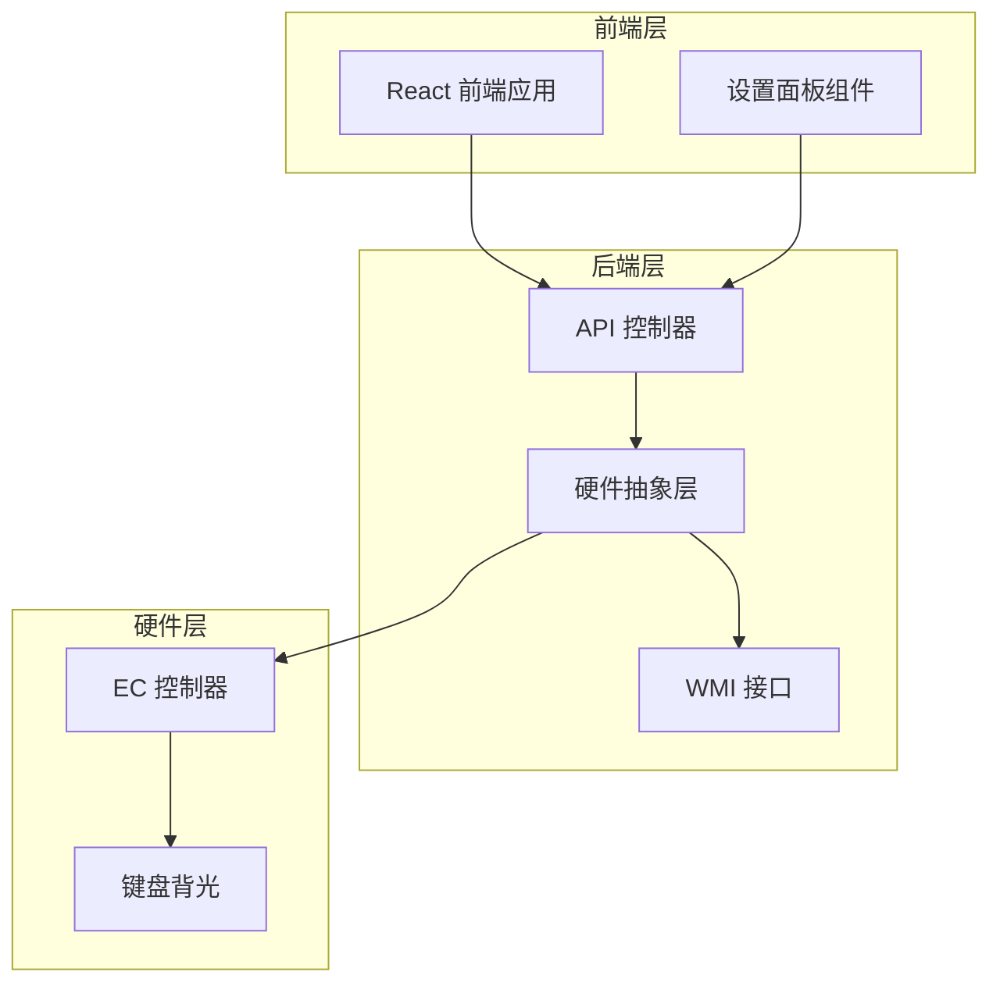
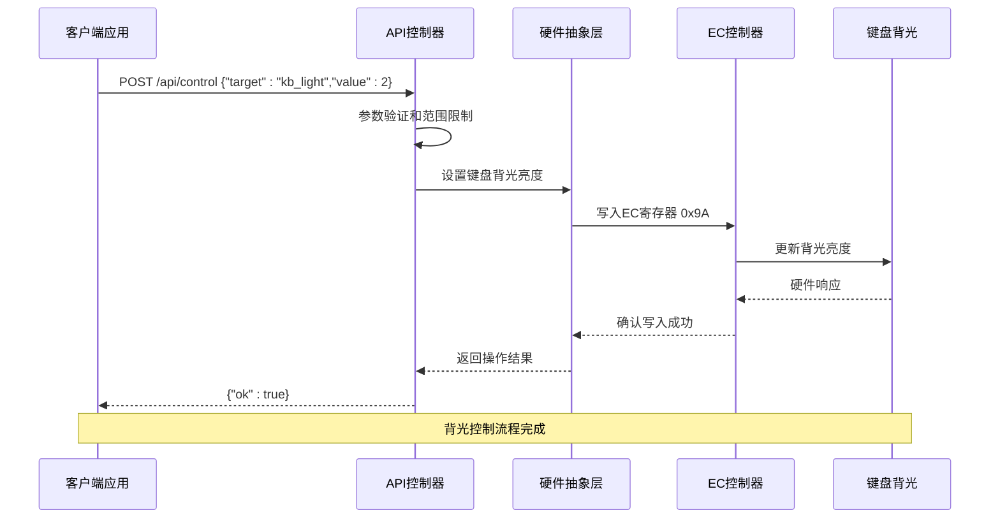
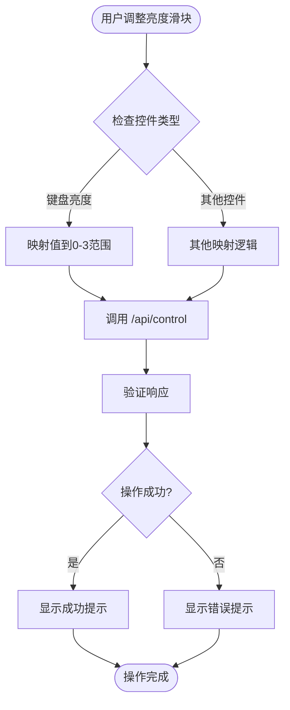
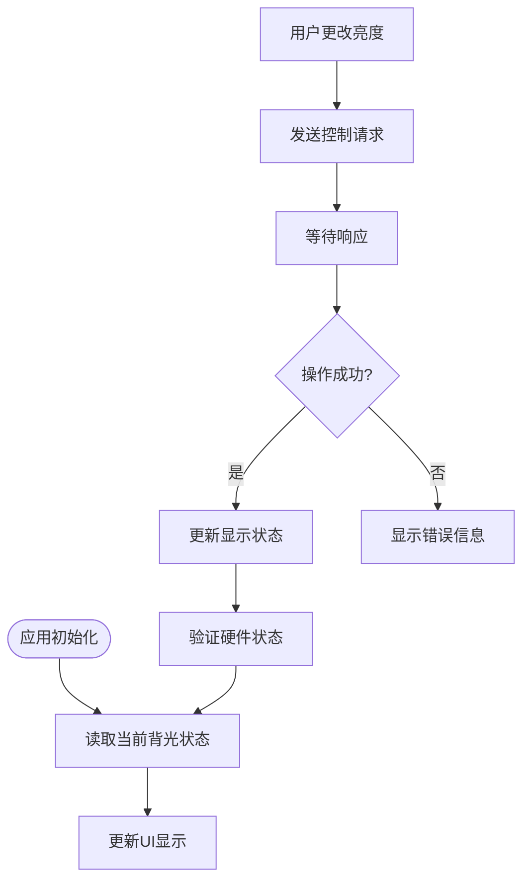
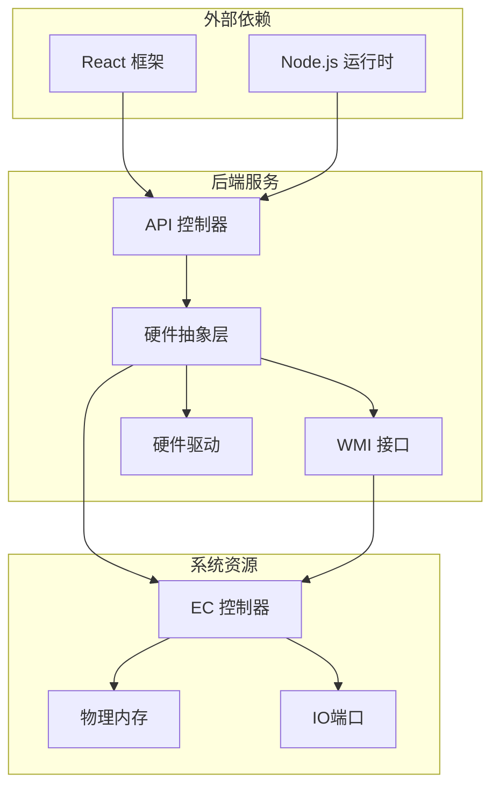
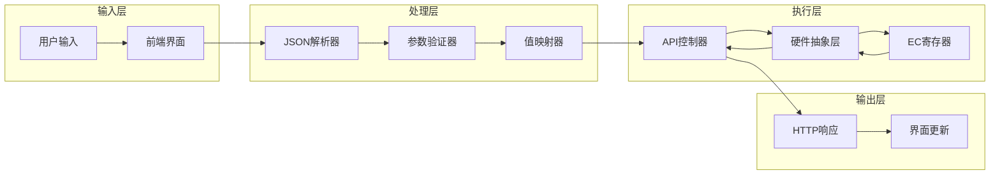

# 键盘背光控制API

<cite>
**本文档引用的文件**
- [Program.cs](file://server/api/Program.cs)
- [HardwareAbstractionLayer.cs](file://server/hal/HardwareAbstractionLayer.cs)
- [dev-api.md](file://docs/dev-api.md)
- [dev-ec-map.md](file://docs/dev-ec-map.md)
- [SettingsPanel.jsx](file://src/components/panels/SettingsPanel.jsx)
</cite>

## 目录
1. [简介](#简介)
2. [项目结构](#项目结构)
3. [核心组件](#核心组件)
4. [架构概览](#架构概览)
5. [详细组件分析](#详细组件分析)
6. [依赖关系分析](#依赖关系分析)
7. [性能考虑](#性能考虑)
8. [故障排除指南](#故障排除指南)
9. [结论](#结论)

## 简介

本文档详细说明了键盘背光控制API，重点介绍POST /api/control端点中target为kb_light的控制请求格式。该API允许用户通过HTTP接口控制笔记本电脑键盘背光亮度，支持0-3级亮度调节。

键盘背光控制是现代笔记本电脑的重要功能之一，特别是在光线较暗的环境中使用笔记本时，合适的键盘背光可以显著提升用户体验。本API提供了标准化的接口来实现这一功能，确保跨平台和跨应用的一致性。

## 项目结构

该项目采用前后端分离的架构设计，主要包含以下关键组件：



**图表来源**
- [Program.cs:144-202](file://server/api/Program.cs#L144-L202)
- [HardwareAbstractionLayer.cs:319-329](file://server/hal/HardwareAbstractionLayer.cs#L319-L329)

**章节来源**
- [Program.cs:144-202](file://server/api/Program.cs#L144-L202)
- [HardwareAbstractionLayer.cs:319-329](file://server/hal/HardwareAbstractionLayer.cs#L319-L329)

## 核心组件

### API 控制器

API控制器负责处理所有硬件控制请求，特别是键盘背光控制。它实现了统一的请求处理逻辑，支持多种控制目标和参数验证。

### 硬件抽象层 (HAL)

硬件抽象层提供了对底层硬件的统一访问接口，包括键盘背光控制、系统开关状态管理等功能。它封装了复杂的硬件交互细节，为上层应用提供简洁的API。

### 硬件映射关系

根据EC寄存器映射文档，键盘背光控制通过特定的硬件寄存器实现：

| 寄存器偏移 | 物理地址 | 功能 | 值范围 | 说明 |
|-----------|----------|------|--------|------|
| 0x9A | FE80049A | KBNL | 0-3 | 键盘背光亮度等级 |
| 0x99 | FE800499 | KBTY | 读取 | 键盘类型 |

**章节来源**
- [dev-ec-map.md:34-34](file://docs/dev-ec-map.md#L34-L34)
- [dev-ec-map.md:33-33](file://docs/dev-ec-map.md#L33-L33)
- [HardwareAbstractionLayer.cs:62-62](file://server/hal/HardwareAbstractionLayer.cs#L62-L62)

## 架构概览

键盘背光控制系统的整体架构如下：



**图表来源**
- [Program.cs:144-202](file://server/api/Program.cs#L144-L202)
- [HardwareAbstractionLayer.cs:319-329](file://server/hal/HardwareAbstractionLayer.cs#L319-L329)

## 详细组件分析

### 键盘背光控制请求格式

#### 请求结构

POST /api/control 端点支持多种控制目标，其中键盘背光控制的请求格式如下：

```json
{
  "target": "kb_light",
  "value": 2
}
```

#### 参数规范

| 字段名 | 类型 | 必填 | 说明 | 有效范围 |
|--------|------|------|------|----------|
| target | string | 是 | 控制目标标识符 | "kb_light" |
| value | integer | 是 | 背光亮度等级 | 0-3 |

#### 硬件映射关系

键盘背光亮度等级与硬件寄存器值的对应关系：

| 等级 | 硬件值 | 描述 |
|------|--------|------|
| 0 | 0 | 关闭背光 |
| 1 | 1 | 低亮度 |
| 2 | 2 | 中等亮度 |
| 3 | 3 | 高亮度 |

#### 前端集成

前端设置面板通过映射关系将用户界面的亮度选择转换为API调用：



**图表来源**
- [SettingsPanel.jsx:49-73](file://src/components/panels/SettingsPanel.jsx#L49-L73)

**章节来源**
- [Program.cs:144-202](file://server/api/Program.cs#L144-L202)
- [HardwareAbstractionLayer.cs:319-329](file://server/hal/HardwareAbstractionLayer.cs#L319-L329)
- [SettingsPanel.jsx:49-73](file://src/components/panels/SettingsPanel.jsx#L49-L73)

### 硬件限制和约束

#### 硬件寄存器特性

键盘背光控制基于EC寄存器实现，具有以下硬件特性：

1. **寄存器地址**: KBNL寄存器位于EC内存映射的0x9A偏移处
2. **写入策略**: 使用物理内存写入方法（WritePhys/SetPhysLong）
3. **预映射限制**: 键盘背光写入不走缓存映射，必须使用独立的物理内存写入方法
4. **验证状态**: 已通过实际硬件测试验证有效性

#### 硬件写入原则

根据EC写入经验总结，键盘背光写入遵循以下优先级原则：

1. **物理内存写入** (最高优先级): 适用于KBNL寄存器
2. **IO端口读写** (次优先级): 先读取当前状态，修改后再写入
3. **备用写入方法** (最低优先级): 仅在物理内存写入无效时使用

**章节来源**
- [dev-ec-map.md:98-103](file://docs/dev-ec-map.md#L98-L103)
- [HardwareAbstractionLayer.cs:325-327](file://server/hal/HardwareAbstractionLayer.cs#L325-L327)

### 权限要求

#### 系统权限

键盘背光控制需要以下系统权限：

1. **管理员权限**: 访问EC寄存器和物理内存写入通常需要管理员权限
2. **驱动程序加载**: 需要相应的硬件驱动程序支持
3. **WMI访问权限**: 某些系统功能可能需要WMI访问权限

#### 安全考虑

1. **输入验证**: 所有外部输入都会经过严格的参数验证
2. **范围限制**: 自动限制值范围在0-3之间
3. **异常处理**: 完善的异常捕获和错误处理机制

### 错误处理机制

#### 错误类型分类

系统实现了多层次的错误处理机制：

1. **参数验证错误**: 400 Bad Request
   - 未知的控制目标
   - 无效的数据格式
   - 超出范围的数值

2. **系统错误**: 500 Internal Server Error
   - 硬件访问失败
   - 驱动程序问题
   - 内存写入异常

#### 错误响应格式

所有错误都返回标准的JSON格式：

```json
{
  "ok": false,
  "error": "错误描述信息"
}
```

**章节来源**
- [Program.cs:193-201](file://server/api/Program.cs#L193-L201)

### 背光状态查询

#### 状态获取

虽然专门的键盘背光状态查询端点未在现有代码中实现，但可以通过以下方式获取当前状态：

1. **直接读取EC寄存器**: 从KBNL寄存器(0x9A)读取当前值
2. **硬件抽象层接口**: 使用HardwareAbstractionLayer的KeyboardBrightness属性

#### 状态同步

建议在用户界面中实现状态同步机制：



### 批量控制最佳实践

#### 批量操作策略

对于需要同时控制多个硬件参数的场景，建议采用以下策略：

1. **顺序执行**: 逐个发送控制请求，确保每个操作都有明确的响应
2. **错误恢复**: 如果某个操作失败，应停止后续操作并回滚已成功的操作
3. **状态检查**: 在批量操作后进行状态验证

#### 用户体验优化

1. **进度反馈**: 提供操作进度指示器
2. **撤销机制**: 允许用户撤销批量操作
3. **配置保存**: 自动保存用户的偏好设置

## 依赖关系分析

### 组件依赖图



**图表来源**
- [Program.cs:144-202](file://server/api/Program.cs#L144-L202)
- [HardwareAbstractionLayer.cs:319-329](file://server/hal/HardwareAbstractionLayer.cs#L319-L329)

### 数据流分析

键盘背光控制的数据流如下：



**图表来源**
- [Program.cs:144-202](file://server/api/Program.cs#L144-L202)
- [SettingsPanel.jsx:49-73](file://src/components/panels/SettingsPanel.jsx#L49-L73)

**章节来源**
- [Program.cs:144-202](file://server/api/Program.cs#L144-L202)
- [SettingsPanel.jsx:49-73](file://src/components/panels/SettingsPanel.jsx#L49-L73)

## 性能考虑

### 性能优化策略

1. **异步处理**: API控制器使用异步模式处理请求，避免阻塞
2. **连接复用**: 后端服务支持HTTP连接复用
3. **缓存策略**: 对于频繁查询的状态信息，可考虑适当的缓存机制
4. **批量处理**: 对于多个相关操作，建议合并为单个请求

### 资源管理

1. **内存管理**: 硬件抽象层正确管理内存分配和释放
2. **句柄管理**: 硬件驱动程序句柄的生命周期管理
3. **超时控制**: 合理设置硬件操作的超时时间

## 故障排除指南

### 常见问题诊断

#### 硬件不可访问

**症状**: 请求返回500错误，提示硬件访问失败

**可能原因**:
1. 硬件驱动程序未正确加载
2. 缺少管理员权限
3. 系统安全软件阻止硬件访问

**解决步骤**:
1. 以管理员身份运行应用程序
2. 检查硬件驱动程序状态
3. 临时禁用安全软件进行测试

#### 参数验证失败

**症状**: 请求返回400错误，提示未知控制目标或无效参数

**解决方法**:
1. 确认target字段为"kblight"
2. 验证value在0-3范围内
3. 检查JSON格式是否正确

#### 状态不同步

**症状**: UI显示的背光状态与实际硬件状态不一致

**解决方法**:
1. 重新读取硬件状态
2. 检查是否有其他应用程序同时控制背光
3. 重启硬件抽象层服务

### 调试工具

#### 日志记录

系统提供了详细的日志记录机制：

1. **请求日志**: 记录所有API请求的详细信息
2. **错误日志**: 记录所有异常和错误信息
3. **硬件日志**: 记录硬件交互的详细过程

#### 状态监控

建议实现以下监控指标：

1. **请求成功率**: 监控API调用的成功率
2. **响应时间**: 监控请求处理的平均时间
3. **硬件可用性**: 监控硬件驱动的状态

**章节来源**
- [Program.cs:193-201](file://server/api/Program.cs#L193-L201)

## 结论

键盘背光控制API提供了标准化、可靠的硬件控制接口，支持0-3级亮度调节。该API具有以下特点：

1. **简单易用**: 清晰的请求格式和响应结构
2. **安全可靠**: 完善的参数验证和错误处理机制
3. **性能优秀**: 异步处理和高效的硬件访问
4. **扩展性强**: 支持未来功能的扩展和增强

通过遵循本文档中的最佳实践和故障排除指南，开发者可以有效地集成和使用键盘背光控制功能，为用户提供优质的硬件控制体验。