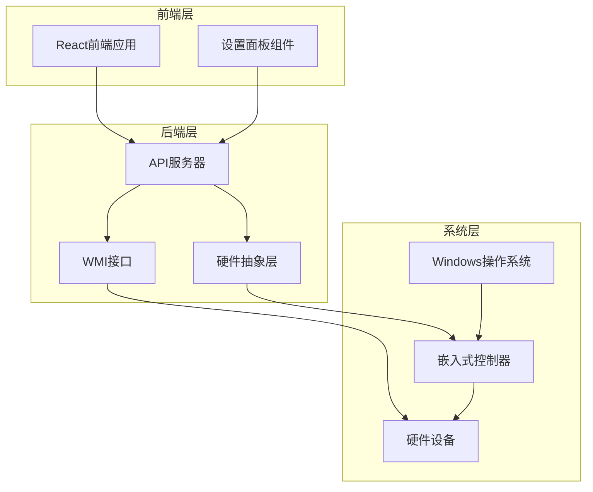
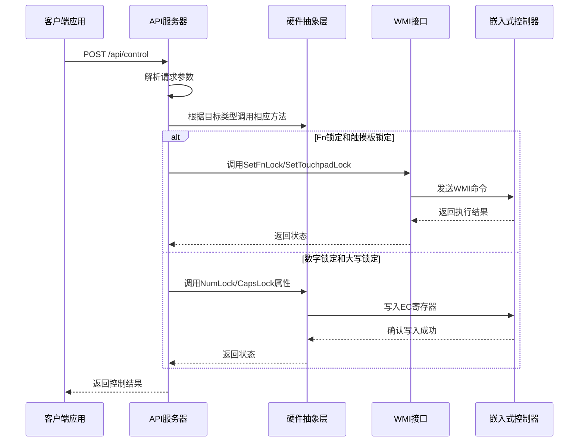
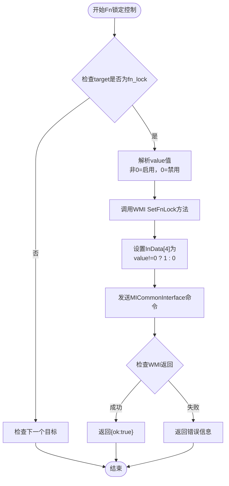
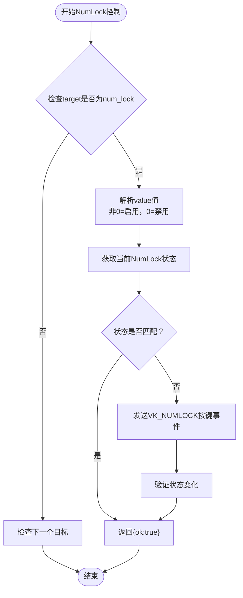
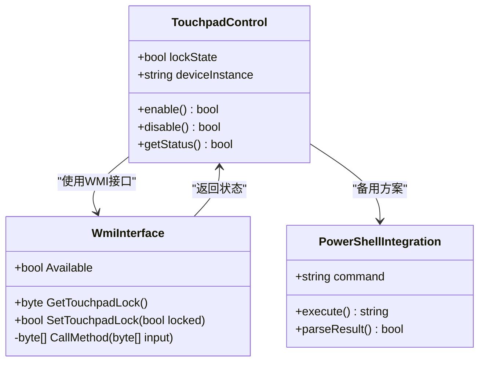
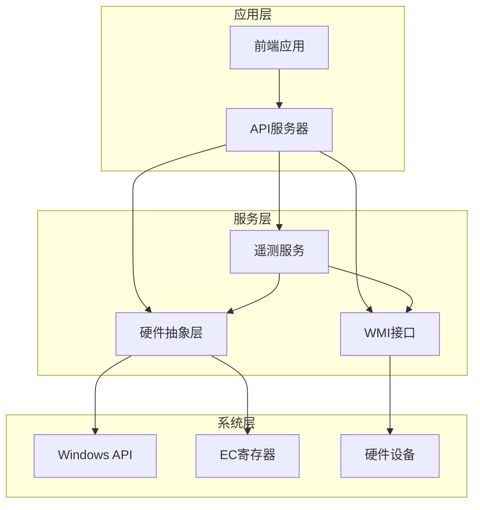

# 键盘锁定控制API

<cite>
**本文档引用的文件**
- [Program.cs](file://server/api/Program.cs)
- [WmiInterface.cs](file://server/api/WmiInterface.cs)
- [HardwareAbstractionLayer.cs](file://server/hal/HardwareAbstractionLayer.cs)
- [TelemetryBackgroundService.cs](file://server/api/TelemetryBackgroundService.cs)
- [Douzhanzhe.API.http](file://server/api/Douzhanzhe.API.http)
- [SettingsPanel.jsx](file://src/components/panels/SettingsPanel.jsx)
- [dev-ec-map.md](file://docs/dev-ec-map.md)
</cite>

## 目录
1. [简介](#简介)
2. [项目结构](#项目结构)
3. [核心组件](#核心组件)
4. [架构概览](#架构概览)
5. [详细组件分析](#详细组件分析)
6. [依赖关系分析](#依赖关系分析)
7. [性能考虑](#性能考虑)
8. [故障排除指南](#故障排除指南)
9. [结论](#结论)

## 简介

键盘锁定控制API提供了对计算机键盘锁定功能的统一控制接口。该API支持四种主要的锁定控制：Fn锁定、数字锁定（NumLock）、大写锁定（CapsLock）和触摸板锁定。通过标准化的RESTful接口，用户可以远程控制这些锁定状态，并实时查询当前的锁定状态。

该系统采用分层架构设计，结合了WMI接口和硬件抽象层，既保证了系统的稳定性，又提供了灵活的控制能力。API的设计充分考虑了不同锁定类型的特殊性，采用了相应的控制策略和状态查询机制。

## 项目结构

项目采用前后端分离的架构，后端使用ASP.NET Core构建RESTful API服务，前端使用React构建用户界面。

**图表来源**
- [Program.cs:1-825](file://server/api/Program.cs#L1-L825)
- [HardwareAbstractionLayer.cs:1-500](file://server/hal/HardwareAbstractionLayer.cs#L1-L500)
- [WmiInterface.cs:1-210](file://server/api/WmiInterface.cs#L1-L210)

**章节来源**
- [Program.cs:1-825](file://server/api/Program.cs#L1-L825)
- [Douzhanzhe.API.http:1-7](file://server/api/Douzhanzhe.API.http#L1-L7)

## 核心组件

### API服务器组件

API服务器是整个系统的核心，负责处理HTTP请求、路由控制和状态管理。它实现了以下关键功能：

- **统一控制接口**：提供标准化的POST /api/control端点
- **状态查询服务**：通过GET /api/telemetry提供实时状态
- **错误处理机制**：完善的异常捕获和错误响应
- **跨平台支持**：支持CORS和WebSocket通信

### 硬件抽象层组件

硬件抽象层负责与底层硬件进行交互，提供了以下功能：

- **EC寄存器访问**：通过IO端口直接访问嵌入式控制器
- **Windows API集成**：调用系统API控制操作系统级功能
- **状态同步机制**：确保软件状态与硬件状态一致
- **安全保护措施**：防止误操作和系统不稳定

### WMI接口组件

WMI接口提供了与Windows Management Instrumentation的通信能力：

- **MICommonInterface支持**：访问ACPI设备的通用接口
- **方法调用封装**：简化复杂的WMI调用过程
- **错误处理机制**：优雅处理WMI调用失败的情况
- **状态查询能力**：支持查询硬件当前状态

**章节来源**
- [Program.cs:145-203](file://server/api/Program.cs#L145-L203)
- [HardwareAbstractionLayer.cs:274-313](file://server/hal/HardwareAbstractionLayer.cs#L274-L313)
- [WmiInterface.cs:18-48](file://server/api/WmiInterface.cs#L18-L48)

## 架构概览

系统采用分层架构设计，确保了良好的可维护性和扩展性。

**图表来源**
- [Program.cs:145-203](file://server/api/Program.cs#L145-L203)
- [WmiInterface.cs:89-135](file://server/api/WmiInterface.cs#L89-L135)
- [HardwareAbstractionLayer.cs:274-313](file://server/hal/HardwareAbstractionLayer.cs#L274-L313)

## 详细组件分析

### POST /api/control 端点

#### 请求格式规范

控制API采用统一的请求格式，所有请求都包含以下字段：

| 字段名 | 类型 | 必需 | 描述 | 示例值 |
|--------|------|------|------|--------|
| target | string | 是 | 控制目标标识符 | "fn_lock" |
| value | integer | 是 | 控制值（0或非0） | 1 |

#### 锁定控制目标详解

##### Fn锁定控制 (fn_lock)

Fn锁定控制是最复杂的锁定类型，因为它涉及多个层面的硬件交互：

**启用机制**：
- 使用WMI接口调用SetFnLock方法
- 通过MICommonInterface发送控制命令
- 设置InData[4]为1表示启用

**禁用机制**：
- 调用相同的WMI接口但设置InData[4]为0
- 确保Fn键功能被完全禁用

**状态查询**：
- 通过GetFnLock方法查询当前状态
- 返回值为1表示启用，0表示禁用

**图表来源**
- [Program.cs:154-155](file://server/api/Program.cs#L154-L155)
- [WmiInterface.cs:89-111](file://server/api/WmiInterface.cs#L89-L111)

**启用值和禁用值**：
- 启用：value = 非0整数（通常使用1）
- 禁用：value = 0

##### 数字锁定控制 (num_lock)

数字锁定控制相对简单，通过Windows API直接控制：

**启用机制**：
- 调用HardwareAbstractionLayer.NumLock属性
- 使用keybd_event发送按键事件
- 通过VK_NUMLOCK虚拟键码触发

**禁用机制**：
- 检查当前NumLock状态
- 如果状态不匹配则发送对应的按键事件
- 确保状态切换完成

**状态查询**：
- 通过Console.NumberLock属性获取当前状态
- 返回布尔值表示锁定状态

**图表来源**
- [Program.cs:157-158](file://server/api/Program.cs#L157-L158)
- [HardwareAbstractionLayer.cs:302-313](file://server/hal/HardwareAbstractionLayer.cs#L302-L313)

**启用值和禁用值**：
- 启用：value = 非0整数（通常使用1）
- 禁用：value = 0

##### 大写锁定控制 (caps_lock)

大写锁定控制与数字锁定类似，但使用不同的虚拟键码：

**启用机制**：
- 调用HardwareAbstractionLayer.CapsLock属性
- 使用VK_CAPITAL虚拟键码发送按键事件
- 触发大写锁定状态切换

**禁用机制**：
- 检查当前CapsLock状态
- 发送相应的按键事件进行状态切换
- 确保大小写锁定状态正确

**状态查询**：
- 通过Console.CapsLock属性获取当前状态
- 返回布尔值表示锁定状态

**启用值和禁用值**：
- 启用：value = 非0整数（通常使用1）
- 禁用：value = 0

##### 触摸板锁定控制 (touchpad_lock)

触摸板锁定控制是最特殊的锁定类型，因为它涉及系统设备管理：

**启用机制**：
- 使用WMI接口调用SetTouchpadLock方法
- 通过MICommonInterface发送设备管理命令
- 设置设备为禁用状态

**禁用机制**：
- 调用相同的WMI接口但设置相反状态
- 启用设备使其恢复正常工作

**状态查询**：
- 通过GetTouchpadLock方法查询设备状态
- 返回值为1表示禁用，0表示启用

**图表来源**
- [WmiInterface.cs:113-135](file://server/api/WmiInterface.cs#L113-L135)
- [HardwareAbstractionLayer.cs:348-375](file://server/hal/HardwareAbstractionLayer.cs#L348-L375)

**启用值和禁用值**：
- 启用：value = 非0整数（通常使用1）
- 禁用：value = 0

### 状态查询方法

#### 实时状态查询

系统提供了多种状态查询方法，确保用户可以实时了解锁定状态：

**遥测端点**：
- GET /api/telemetry 提供完整的系统状态信息
- 包含所有锁定状态的实时数据
- 支持WebSocket推送更新

**系统信息端点**：
- GET /api/system/info 提供硬件配置信息
- 包含系统型号、CPU/GPU信息等
- 用于诊断和配置目的

**健康检查端点**：
- GET /api/health 提供系统健康状态
- 检查各组件的可用性和状态
- 用于监控和故障诊断

#### 状态持久性

锁定状态的持久性取决于具体的锁定类型：

**硬件级别持久性**：
- Fn锁定和触摸板锁定通常具有硬件级别的持久性
- 系统重启后状态保持不变
- 通过EC寄存器或设备管理器保存状态

**软件级别持久性**：
- 数字锁定和大写锁定依赖于Windows会话
- 系统重启后状态可能重置
- 通过Windows输入系统管理状态

**章节来源**
- [Program.cs:88-121](file://server/api/Program.cs#L88-L121)
- [TelemetryBackgroundService.cs:80-105](file://server/api/TelemetryBackgroundService.cs#L80-L105)
- [HardwareAbstractionLayer.cs:274-313](file://server/hal/HardwareAbstractionLayer.cs#L274-L313)

### WMI接口使用说明

#### WMI基础架构

WMI接口提供了与Windows Management Instrumentation的深度集成：

**连接建立**：
- 自动连接到root\WMI命名空间
- 验证MICommonInterface实例的存在
- 处理连接失败的异常情况

**方法调用机制**：
- 封装MiInterface方法调用
- 标准化输入输出数据格式
- 提供错误处理和重试机制

#### WMI命令格式

WMI命令采用标准化的数据包格式：

| 字节位置 | 数据类型 | 描述 | 示例值 |
|----------|----------|------|--------|
| 0 | byte | 固定值 | 0x00 |
| 1 | byte | 操作类型 | 0xFA=Get, 0xFB=Set |
| 2 | byte | 固定值 | 0x00 |
| 3 | byte | 方法编号 | 0x0B=FnLock, 0x0C=TouchpadLock |
| 4 | byte | 参数值 | 0x00/0x01 |
| 5-31 | byte | 填充数据 | 0x00 |

**章节来源**
- [WmiInterface.cs:50-60](file://server/api/WmiInterface.cs#L50-L60)
- [WmiInterface.cs:89-135](file://server/api/WmiInterface.cs#L89-L135)

## 依赖关系分析

系统中的组件依赖关系体现了清晰的分层架构：

**图表来源**
- [Program.cs:10-15](file://server/api/Program.cs#L10-L15)
- [HardwareAbstractionLayer.cs:1-50](file://server/hal/HardwareAbstractionLayer.cs#L1-L50)
- [WmiInterface.cs:14](file://server/api/WmiInterface.cs#L14)

### 组件耦合度分析

系统设计遵循了低耦合高内聚的原则：

**API层**：
- 与具体硬件实现解耦
- 通过抽象接口提供统一服务
- 支持多种硬件平台

**HAL层**：
- 封装硬件差异
- 提供统一的硬件访问接口
- 处理平台特定的实现细节

**WMI层**：
- 专注于Windows特定功能
- 提供标准化的WMI调用接口
- 处理WMI连接和错误

**章节来源**
- [Program.cs:145-203](file://server/api/Program.cs#L145-L203)
- [HardwareAbstractionLayer.cs:1-500](file://server/hal/HardwareAbstractionLayer.cs#L1-L500)

## 性能考虑

### 并发处理

系统采用异步处理机制，确保高并发场景下的稳定性：

**异步请求处理**：
- 所有API端点支持异步处理
- 避免阻塞主线程
- 提高系统响应性能

**连接池管理**：
- WMI连接使用连接池
- 减少连接建立开销
- 提高重复调用效率

### 缓存策略

系统实现了多层次的缓存机制：

**状态缓存**：
- 硬件状态定期缓存
- 减少频繁的硬件查询
- 提高状态查询性能

**配置缓存**：
- 用户配置信息缓存
- 支持快速配置读取
- 减少文件I/O操作

### 错误处理优化

系统具备完善的错误处理机制：

**渐进式降级**：
- WMI失败时使用替代方案
- HAL层提供本地控制能力
- 确保基本功能可用

**超时控制**：
- 硬件操作设置超时
- 防止长时间阻塞
- 提供超时错误反馈

## 故障排除指南

### 常见问题诊断

#### WMI连接失败

**症状**：
- WMI接口显示不可用
- 锁定控制操作失败
- 状态查询返回错误

**解决方案**：
- 检查Windows Management Instrumentation服务状态
- 验证用户权限是否足够
- 确认系统版本支持所需功能

#### 硬件访问权限不足

**症状**：
- EC寄存器访问失败
- 硬件控制无响应
- 权限相关错误

**解决方案**：
- 以管理员权限运行应用程序
- 检查驱动程序安装状态
- 验证硬件兼容性

#### 状态同步问题

**症状**：
- 显示状态与实际状态不符
- 状态查询结果异常
- 状态切换后立即恢复

**解决方案**：
- 检查硬件状态查询逻辑
- 验证状态缓存一致性
- 确认状态更新机制

### 调试工具

系统提供了丰富的调试工具：

**内置调试页面**：
- 提供实时状态监控
- 支持手动控制测试
- 显示详细的系统信息

**日志记录**：
- 记录所有API调用
- 跟踪硬件操作历史
- 提供错误诊断信息

**章节来源**
- [Program.cs:729-733](file://server/api/Program.cs#L729-L733)
- [dev-ec-map.md:95-119](file://docs/dev-ec-map.md#L95-L119)

## 结论

键盘锁定控制API提供了一个完整、稳定且高效的解决方案，用于控制系统中的各种锁定功能。通过精心设计的架构和实现，该系统能够满足不同用户的需求，从简单的状态查询到复杂的硬件控制。

系统的主要优势包括：

**统一接口**：提供标准化的API接口，简化了客户端开发
**多层架构**：清晰的分层设计确保了系统的可维护性和扩展性
**灵活实现**：针对不同锁定类型采用最适合的控制策略
**强大功能**：支持实时状态查询、历史记录和远程控制
**稳定可靠**：完善的错误处理和故障恢复机制

未来的发展方向包括：

- 扩展更多锁定类型的控制支持
- 增强系统的可配置性和定制能力
- 优化性能和资源使用效率
- 提供更丰富的监控和诊断功能

该API为键盘锁定控制提供了一个坚实的技术基础，为用户提供了便捷、可靠的控制体验。