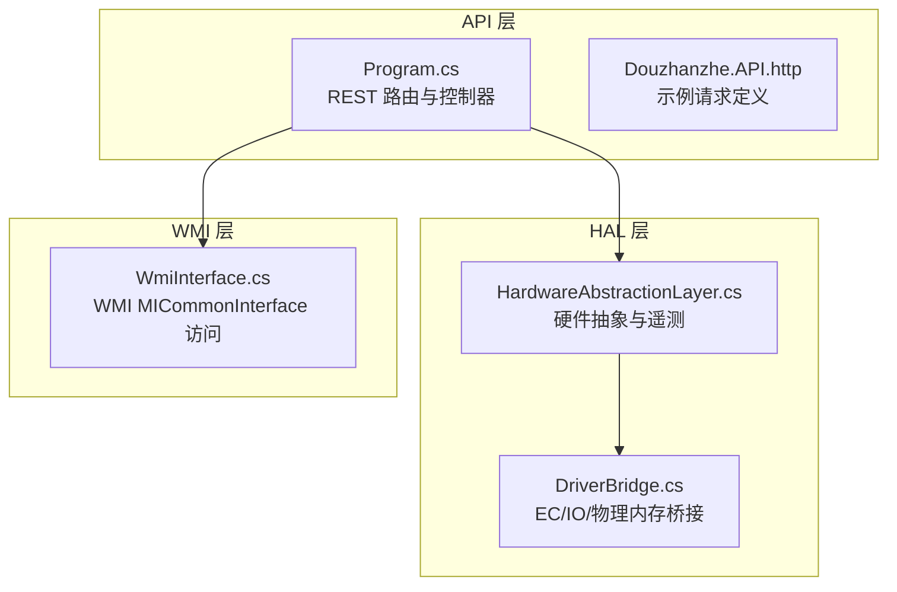
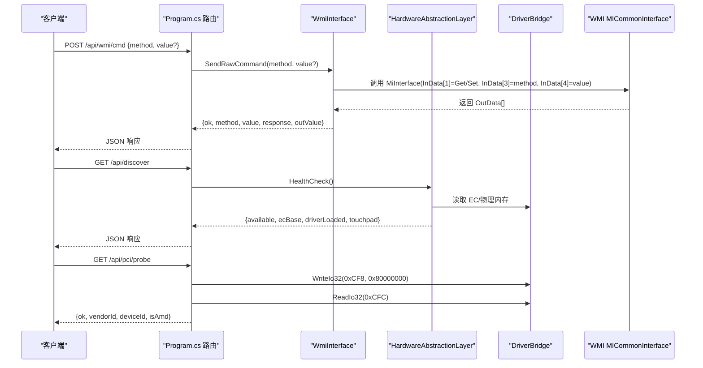
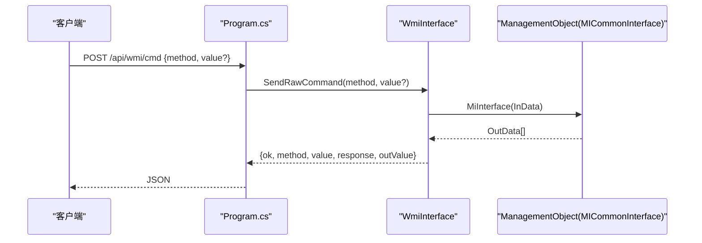
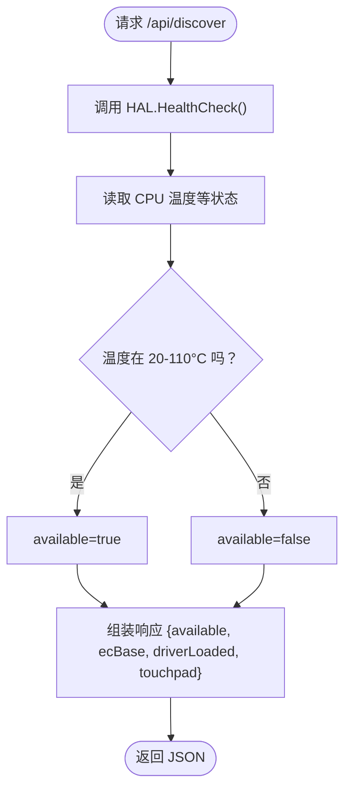
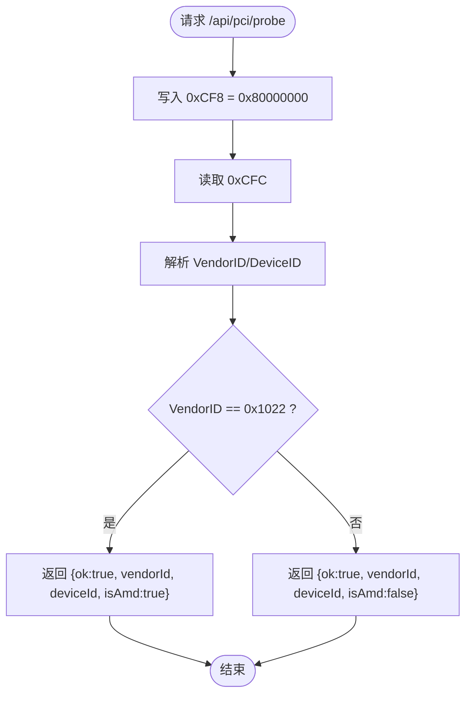
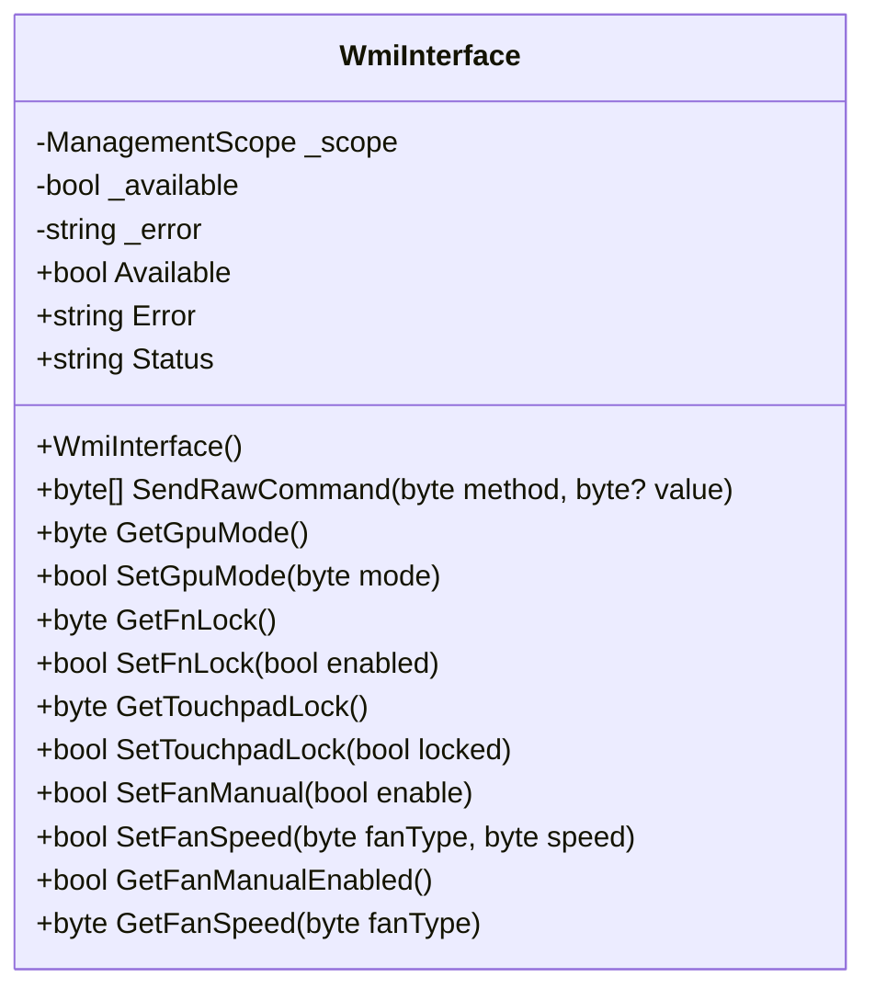
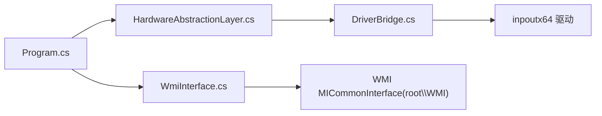

# 系统/WMI API

<cite>
**本文档引用的文件**
- [WmiInterface.cs](file://server/api/WmiInterface.cs)
- [Program.cs](file://server/api/Program.cs)
- [HardwareAbstractionLayer.cs](file://server/hal/HardwareAbstractionLayer.cs)
- [DriverBridge.cs](file://server/hal/DriverBridge.cs)
- [Douzhanzhe.API.http](file://server/api/Douzhanzhe.API.http)
</cite>

## 目录
1. [简介](#简介)
2. [项目结构](#项目结构)
3. [核心组件](#核心组件)
4. [架构总览](#架构总览)
5. [详细组件分析](#详细组件分析)
6. [依赖关系分析](#依赖关系分析)
7. [性能考量](#性能考量)
8. [故障排查指南](#故障排查指南)
9. [结论](#结论)

## 简介
本文件面向系统/WMI API，重点覆盖以下方面：
- WMI 命令 API（/api/wmi/cmd）的原始命令发送机制与数据包格式
- 系统发现 API（/api/discover）的硬件检测能力与健康检查逻辑
- PCI 探测 API（/api/pci/probe）的设备识别流程
- WMI 接口的兼容性检查与错误处理策略
- WMI 控制的安全限制与权限要求

该系统采用 C#/.NET 构建，后端提供 REST API 与 WebSocket 遥测，底层通过 WMI、EC IO、SMU、PCI 等接口实现对硬件的读写与控制。

## 项目结构
后端服务位于 server/api，硬件抽象层位于 server/hal。API 层负责路由与业务编排，HAL 层负责与硬件驱动交互。

图表来源
- [Program.cs:1-783](file://server/api/Program.cs#L1-L783)
- [HardwareAbstractionLayer.cs:1-772](file://server/hal/HardwareAbstractionLayer.cs#L1-L772)
- [DriverBridge.cs:1-150](file://server/hal/DriverBridge.cs#L1-L150)
- [WmiInterface.cs:1-210](file://server/api/WmiInterface.cs#L1-L210)

章节来源
- [Program.cs:1-783](file://server/api/Program.cs#L1-L783)
- [Douzhanzhe.API.http:1-7](file://server/api/Douzhanzhe.API.http#L1-L7)

## 核心组件
- WmiInterface：封装 WMI MICommonInterface 的调用，提供通用原始命令发送与特定功能（如 GPU 模式、Fn/TPLock、风扇控制等）的便捷方法。
- HardwareAbstractionLayer：在 DriverBridge 之上提供语义化硬件访问接口，包括遥测读取、系统开关控制、EC 寄存器读写等。
- DriverBridge：底层硬件桥接，提供 EC IO、物理内存映射、IO 端口读写、SMI 触发等能力。
- Program.cs：定义所有 API 路由，包括 /api/wmi/cmd、/api/discover、/api/pci/probe 等，并注入服务生命周期。

章节来源
- [WmiInterface.cs:18-210](file://server/api/WmiInterface.cs#L18-L210)
- [HardwareAbstractionLayer.cs:19-772](file://server/hal/HardwareAbstractionLayer.cs#L19-L772)
- [DriverBridge.cs:9-150](file://server/hal/DriverBridge.cs#L9-L150)
- [Program.cs:10-783](file://server/api/Program.cs#L10-L783)

## 架构总览
系统通过 API 层统一对外暴露硬件控制与查询能力，内部以 HAL 为核心协调各硬件子系统。WMI 作为 ACPI 下的 MICommonInterface 接口，用于发送原始命令；HAL 提供更稳定的遥测与控制通道；DriverBridge 提供底层 IO/内存访问。

图表来源
- [Program.cs:504-518](file://server/api/Program.cs#L504-L518)
- [Program.cs:203-212](file://server/api/Program.cs#L203-L212)
- [Program.cs:299-314](file://server/api/Program.cs#L299-L314)
- [WmiInterface.cs:50-60](file://server/api/WmiInterface.cs#L50-L60)
- [DriverBridge.cs:106-109](file://server/hal/DriverBridge.cs#L106-L109)

## 详细组件分析

### WMI 命令 API（/api/wmi/cmd）
- 功能概述
  - 接收 method 与可选 value，构造 32 字节输入缓冲区，调用 WMI MICommonInterface 的 MiInterface 方法，返回原始输出数据与解析后的 outValue。
- 数据包格式
  - InData[1]: 250 表示 Get，251 表示 Set
  - InData[3]: 命令号（method）
  - InData[4]: 设置时的参数值（可选）
  - OutData[4..11]: 返回数据片段（具体含义由上层业务解释）
- 错误处理
  - 路由层捕获异常并返回 {ok:false, error:...}
  - WmiInterface 内部在构造连接与调用时捕获异常，记录错误字符串
- 使用建议
  - 优先使用已封装的方法（如 SetGpuMode、SetFnLock、SetFanManual 等），避免直接使用原始命令
  - 对于需要调试的场景，使用 /api/wmi/cmd 发送原始命令，观察 OutData 前 8 字节十六进制

图表来源
- [Program.cs:504-518](file://server/api/Program.cs#L504-L518)
- [WmiInterface.cs:200-208](file://server/api/WmiInterface.cs#L200-L208)
- [WmiInterface.cs:50-60](file://server/api/WmiInterface.cs#L50-L60)

章节来源
- [Program.cs:504-518](file://server/api/Program.cs#L504-L518)
- [WmiInterface.cs:200-208](file://server/api/WmiInterface.cs#L200-L208)
- [WmiInterface.cs:50-60](file://server/api/WmiInterface.cs#L50-L60)

### 系统发现 API（/api/discover）
- 功能概述
  - 返回系统硬件可用性、EC 基址、驱动加载状态与触摸板支持信息
  - 通过 HAL 的 HealthCheck() 进行健康检查（读取 CPU 温度并在合理范围内判定健康）
- 关键字段
  - available: 健康检查结果
  - ecBase: EC 基址（0xFE800400）
  - driverLoaded: DriverBridge 是否就绪
  - touchpad: 固定为 true（表示支持触摸板锁定）

图表来源
- [Program.cs:203-212](file://server/api/Program.cs#L203-L212)
- [HardwareAbstractionLayer.cs:754-765](file://server/hal/HardwareAbstractionLayer.cs#L754-L765)

章节来源
- [Program.cs:203-212](file://server/api/Program.cs#L203-L212)
- [HardwareAbstractionLayer.cs:754-765](file://server/hal/HardwareAbstractionLayer.cs#L754-L765)

### PCI 探测 API（/api/pci/probe）
- 功能概述
  - 通过向 PCI 配置空间寄存器写入地址与读取 Vendor/Device ID，判断平台厂商与设备类型
- 实现要点
  - 写入 0xCF8（PCI 配置地址寄存器）为 0x80000000（启用配置寄存器访问）
  - 读取 0xCFC（PCI 配置数据寄存器）得到 VendorID:DeviceID 组合
  - 解析 VendorID 并标记是否为 AMD（0x1022）
- 错误处理
  - 异常捕获并返回 {ok:false, error}

图表来源
- [Program.cs:299-314](file://server/api/Program.cs#L299-L314)
- [DriverBridge.cs:106-109](file://server/hal/DriverBridge.cs#L106-L109)

章节来源
- [Program.cs:299-314](file://server/api/Program.cs#L299-L314)
- [DriverBridge.cs:106-109](file://server/hal/DriverBridge.cs#L106-L109)

### WMI 接口的兼容性检查与错误处理
- 兼容性检查
  - WmiInterface 构造函数尝试连接 root\WMI 并访问 MICommonInterface 实例，成功则标记可用，失败记录错误字符串
  - Program.cs 中的 /api/telemetry 与 /api/control 等端点会根据 wmi.Available 决定是否使用 WMI 获取状态或执行操作
- 错误处理策略
  - 路由层：捕获异常并返回 {ok:false, error}
  - WMI 层：构造输入缓冲区失败或调用 MiInterface 失败时抛出异常
  - 建议：在调用前先检查 wmi.Available，必要时降级到 HAL 提供的替代方案

图表来源
- [WmiInterface.cs:18-210](file://server/api/WmiInterface.cs#L18-L210)

章节来源
- [WmiInterface.cs:24-48](file://server/api/WmiInterface.cs#L24-L48)
- [Program.cs:87-120](file://server/api/Program.cs#L87-L120)

### WMI 控制的安全限制与权限要求
- 权限要求
  - 访问 WMI MICommonInterface 需要系统具备相应权限，且目标实例必须存在
  - HAL 与 DriverBridge 依赖底层驱动（如 inpoutx64）进行 IO/物理内存访问，通常需要以管理员身份运行
- 安全限制
  - 由于涉及底层硬件控制，不当的命令可能导致系统不稳定或设备损坏
  - 建议仅在受信任环境中启用相关功能，并限制访问来源
- 最佳实践
  - 优先使用封装好的 API（如 /api/control、/api/fan/set-target 等），避免直接调用 /api/wmi/cmd
  - 在生产环境启用 CORS 与认证授权，限制 WebSocket 与 API 的访问范围

章节来源
- [WmiInterface.cs:24-48](file://server/api/WmiInterface.cs#L24-L48)
- [Program.cs:14-18](file://server/api/Program.cs#L14-L18)
- [DriverBridge.cs:39-62](file://server/hal/DriverBridge.cs#L39-L62)

## 依赖关系分析

图表来源
- [Program.cs:10-13](file://server/api/Program.cs#L10-L13)
- [WmiInterface.cs:14](file://server/api/WmiInterface.cs#L14)
- [DriverBridge.cs:11-26](file://server/hal/DriverBridge.cs#L11-L26)

章节来源
- [Program.cs:10-13](file://server/api/Program.cs#L10-L13)
- [WmiInterface.cs:14](file://server/api/WmiInterface.cs#L14)
- [DriverBridge.cs:11-26](file://server/hal/DriverBridge.cs#L11-L26)

## 性能考量
- WMI 调用
  - 每次调用 MiInterface 都会建立 WMI 连接并调用方法，频繁调用会产生额外开销
  - 建议合并请求或使用批量控制接口（如 /api/control）
- HAL 遥测
  - 部分遥测通过 PowerShell 或 nvidia-smi 子进程获取，存在启动延迟
  - HAL 内部对部分数据进行了缓存（如 GPU 温度、风扇转速等），减少重复查询
- IO/内存访问
  - DriverBridge 对 EC IO 与物理内存访问做了线程同步与兜底处理，避免竞态与失败

章节来源
- [HardwareAbstractionLayer.cs:148-229](file://server/hal/HardwareAbstractionLayer.cs#L148-L229)
- [HardwareAbstractionLayer.cs:662-693](file://server/hal/HardwareAbstractionLayer.cs#L662-L693)
- [DriverBridge.cs:111-147](file://server/hal/DriverBridge.cs#L111-L147)

## 故障排查指南
- WMI 不可用
  - 检查构造函数日志与 wmi.Error 字段，确认 root\WMI 可访问且实例存在
  - 若失败，路由层会返回 {ok:false, error}，可在前端或日志中查看
- 驱动不可用
  - DriverBridge.Ready 为 false 时，HAL 会降级为安全默认值
  - 检查 inpoutx64 驱动是否安装并以管理员身份运行
- 健康检查失败
  - /api/discover 返回 available=false，通常意味着无法从 EC 读取有效温度
  - 可通过 HAL 的 HealthCheck() 自行验证
- PCI 探测失败
  - 捕获异常并返回错误信息，确认 0xCF8/0xCFC IO 访问是否被禁用或驱动未加载

章节来源
- [WmiInterface.cs:24-48](file://server/api/WmiInterface.cs#L24-L48)
- [DriverBridge.cs:39-62](file://server/hal/DriverBridge.cs#L39-L62)
- [HardwareAbstractionLayer.cs:754-765](file://server/hal/HardwareAbstractionLayer.cs#L754-L765)
- [Program.cs:299-314](file://server/api/Program.cs#L299-L314)

## 结论
本系统通过清晰的分层设计实现了对硬件的统一访问与控制。WMI 命令 API 提供了底层原始命令通道，但建议优先使用封装好的接口；系统发现与 PCI 探测 API 为硬件识别与诊断提供了基础能力；HAL 与 DriverBridge 则确保了在不同硬件平台上的稳定运行。在生产环境中，务必关注权限与安全限制，并结合错误处理与健康检查机制提升系统的可靠性。