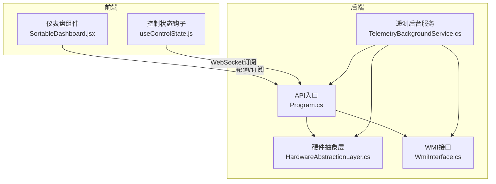
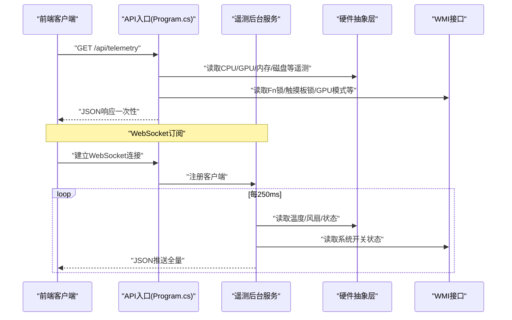
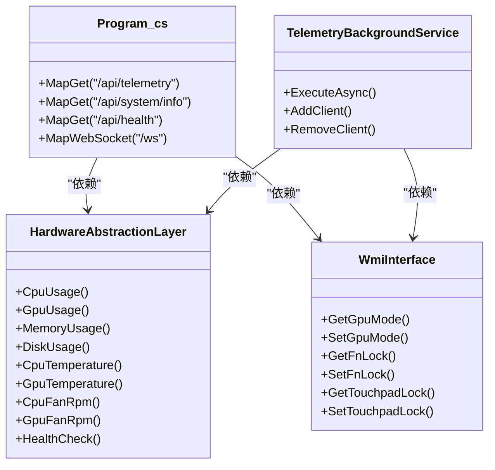

# 遥测数据API

<cite>
**本文引用的文件**
- [Program.cs](file://server/api/Program.cs)
- [TelemetryBackgroundService.cs](file://server/api/TelemetryBackgroundService.cs)
- [HardwareAbstractionLayer.cs](file://server/hal/HardwareAbstractionLayer.cs)
- [WmiInterface.cs](file://server/api/WmiInterface.cs)
- [mockTelemetry.js](file://src/data/mockTelemetry.js)
- [dev-api.md](file://docs/dev-api.md)
- [SortableDashboard.jsx](file://src/components/SortableDashboard.jsx)
- [useControlState.js](file://src/hooks/useControlState.js)
</cite>

## 目录
1. [简介](#简介)
2. [项目结构](#项目结构)
3. [核心组件](#核心组件)
4. [架构总览](#架构总览)
5. [详细组件分析](#详细组件分析)
6. [依赖关系分析](#依赖关系分析)
7. [性能考虑](#性能考虑)
8. [故障排查指南](#故障排查指南)
9. [结论](#结论)
10. [附录](#附录)

## 简介
本文档面向遥测数据API，重点说明以下端点：
- GET /api/telemetry：全量遥测数据的JSON响应结构与字段含义
- GET /api/system/info：系统信息API的数据字段与含义
- GET /api/health：健康检查API的状态返回格式

同时提供请求示例、响应示例、错误处理说明，并解释遥测数据的更新频率、精度与数据来源。

## 项目结构
后端采用ASP.NET Core Minimal API，遥测数据由后台服务周期性采集并通过WebSocket推送，同时提供HTTP端点按需拉取。

图表来源
- [Program.cs](file://server/api/Program.cs)
- [TelemetryBackgroundService.cs](file://server/api/TelemetryBackgroundService.cs)
- [HardwareAbstractionLayer.cs](file://server/hal/HardwareAbstractionLayer.cs)
- [WmiInterface.cs](file://server/api/WmiInterface.cs)
- [SortableDashboard.jsx](file://src/components/SortableDashboard.jsx)
- [useControlState.js](file://src/hooks/useControlState.js)

章节来源
- [Program.cs](file://server/api/Program.cs)
- [TelemetryBackgroundService.cs](file://server/api/TelemetryBackgroundService.cs)
- [HardwareAbstractionLayer.cs](file://server/hal/HardwareAbstractionLayer.cs)
- [WmiInterface.cs](file://server/api/WmiInterface.cs)
- [SortableDashboard.jsx](file://src/components/SortableDashboard.jsx)
- [useControlState.js](file://src/hooks/useControlState.js)

## 核心组件
- API入口与路由：在Program.cs中注册HTTP端点与WebSocket端点，注入HAL与WMI服务。
- 遥测后台服务：每250毫秒读取一次硬件状态，构建完整遥测包并通过WebSocket广播给所有客户端。
- 硬件抽象层：封装底层驱动与系统调用，提供统一的遥测与控制接口。
- WMI接口：通过WMI方法访问系统特定能力（如GPU模式、Fn锁、触摸板锁等）。

章节来源
- [Program.cs](file://server/api/Program.cs)
- [TelemetryBackgroundService.cs](file://server/api/TelemetryBackgroundService.cs)
- [HardwareAbstractionLayer.cs](file://server/hal/HardwareAbstractionLayer.cs)
- [WmiInterface.cs](file://server/api/WmiInterface.cs)

## 架构总览
遥测数据流经两条路径：
- WebSocket推送：后台服务定时采集并广播，前端通过WebSocket订阅。
- HTTP拉取：前端可直接GET /api/telemetry获取一次全量数据。

图表来源
- [Program.cs](file://server/api/Program.cs)
- [TelemetryBackgroundService.cs](file://server/api/TelemetryBackgroundService.cs)
- [HardwareAbstractionLayer.cs](file://server/hal/HardwareAbstractionLayer.cs)
- [WmiInterface.cs](file://server/api/WmiInterface.cs)

## 详细组件分析

### GET /api/telemetry 响应结构与字段说明
该端点返回一次性的全量遥测数据，字段覆盖CPU/GPU/内存/磁盘/风扇/系统开关等。

- 字段清单与含义
  - cpuUsage: CPU总体占用百分比（整数）
  - cpuTemp: CPU温度（摄氏度，整数）
  - cpuFreq: CPU基准频率（GHz，浮点数）
  - cpuCores: CPU核心数（整数）
  - gpuUsage: GPU占用百分比（整数）
  - gpuTemp: GPU温度（摄氏度，整数）
  - gpuFreq: GPU当前频率（GHz，浮点数）
  - gpuVram: GPU显存总量（GB，整数）
  - gpuVramUsed: GPU显存已用量（GB，浮点数）
  - fanLargeRpm: 大风扇（CPU）实际转速（RPM，整数）
  - fanSmallRpm: 小风扇（GPU）实际转速（RPM，整数）
  - fanLargeMax: 大风扇最大转速（RPM，整数）
  - fanSmallMax: 小风扇最大转速（RPM，整数）
  - memoryUsage: 内存占用百分比（整数）
  - memoryTotalGB: 内存总量（GB，整数）
  - memoryFreq: 内存频率（MT/s，整数）
  - diskUsage: 磁盘占用百分比（整数）
  - diskTotalGB: 磁盘总量（GB，整数）
  - diskFreeGB: 磁盘剩余空间（GB，整数）
  - kbBrightness: 键盘背光等级（0-3，整数）
  - fnLock: Fn锁定状态（布尔，来自WMI或本地状态）
  - numLock: 数字锁定状态（布尔）
  - capsLock: 大写锁定状态（布尔）
  - thermalMode: 散热模式（0-3，整数）
  - powerPlan: 电源计划（0=均衡,1=高性能,2=节能，整数）
  - touchpadLock: 触摸板锁定状态（布尔，来自WMI或本地状态）
  - igpuOnly: 仅集显模式（布尔）
  - gpuMode: GPU模式（字符串："0"/"1"/"2"或null，来自WMI）

- 数据来源与精度
  - 温度：CPU温度来自EC IO端口；GPU温度优先物理内存，失败时回退nvidia-smi，带2秒冷却窗口。
  - 风扇转速：EC IO端口读取，双字节仲裁以避免竞态。
  - 占用率与频率：CPU占用来自系统计数器；GPU占用/频率/显存来自nvidia-smi；内存/磁盘通过PowerShell与系统API。
  - 精度：百分比类字段通常为整数；频率类字段为浮点数，单位分别为GHz与MT/s。

- 请求示例
  - curl -i http://localhost:5250/api/telemetry

- 响应示例
  - 示例字段（示意）：
    - {"cpuUsage":12,"cpuTemp":68,"cpuFreq":4.1,"cpuCores":16,"gpuUsage":18,"gpuTemp":62,"gpuFreq":1.2,"gpuVram":8,"gpuVramUsed":0,"fanLargeRpm":3000,"fanSmallRpm":5100,"fanLargeMax":4400,"fanSmallMax":8200,"memoryUsage":56,"memoryTotalGB":32,"memoryFreq":5200,"diskUsage":39,"diskTotalGB":1024,"diskFreeGB":586,"kbBrightness":2,"fnLock":false,"numLock":true,"capsLock":false,"thermalMode":1,"powerPlan":0,"touchpadLock":false,"igpuOnly":false,"gpuMode":"1"}

- 错误处理
  - 当底层驱动不可用或系统调用失败时，相应字段可能返回默认值（如0或上一次有效值），健康检查可作为快速判断依据。

章节来源
- [Program.cs](file://server/api/Program.cs)
- [HardwareAbstractionLayer.cs](file://server/hal/HardwareAbstractionLayer.cs)
- [WmiInterface.cs](file://server/api/WmiInterface.cs)
- [mockTelemetry.js](file://src/data/mockTelemetry.js)

### GET /api/system/info 字段与含义
该端点返回系统硬件配置信息，便于前端展示设备概况。

- 字段清单与含义
  - systemModel: 品牌/型号（字符串）
  - cpuName: CPU名称（字符串）
  - cpuCores: CPU核心数（整数）
  - cpuFreq: CPU基准频率（GHz，四舍五入到0.1位）
  - gpuDiscrete: 独显名称（字符串）
  - gpuIntegrated: 集显名称（字符串）
  - memoryTotalGB: 内存总量（GB，整数）
  - memoryFreq: 内存频率（MT/s，整数）
  - diskTotalGB: 磁盘总量（GB，整数）

- 请求示例
  - curl -i http://localhost:5250/api/system/info

- 响应示例
  - 示例字段（示意）：
    - {"systemModel":"Dell Inspiron","cpuName":"Intel i7-12700H","cpuCores":20,"cpuFreq":2.4,"gpuDiscrete":"NVIDIA RTX3070","gpuIntegrated":"AMD Radeon Graphics","memoryTotalGB":32,"memoryFreq":4800,"diskTotalGB":1024}

- 错误处理
  - PowerShell调用失败时返回空值或上一次缓存值，建议前端做容错显示。

章节来源
- [Program.cs](file://server/api/Program.cs)
- [HardwareAbstractionLayer.cs](file://server/hal/HardwareAbstractionLayer.cs)

### GET /api/health 返回格式
该端点用于快速健康检查，返回系统健康状态与时间戳。

- 返回结构
  - ok: 布尔值，表示健康检查结果
  - timestamp: 长整型，UTC时间戳（毫秒）

- 请求示例
  - curl -i http://localhost:5250/api/health

- 响应示例
  - 示例字段（示意）：
    - {"ok":true,"timestamp":1710000000000}

- 错误处理
  - 健康检查基于CPU温度读取范围判断，异常时返回false。

章节来源
- [Program.cs](file://server/api/Program.cs)
- [HardwareAbstractionLayer.cs](file://server/hal/HardwareAbstractionLayer.cs)

### 遥测数据更新频率、精度与数据来源
- 更新频率
  - WebSocket推送：每250毫秒一次全量推送
  - HTTP拉取：即时一次性响应
- 精度
  - 百分比类字段通常为整数
  - 频率类字段为浮点数，单位分别为GHz与MT/s
- 数据来源
  - EC IO端口：温度、风扇转速、系统开关状态
  - nvidia-smi：GPU占用率、频率、显存
  - PowerShell与系统API：CPU占用、内存、磁盘、系统信息
  - WMI：Fn锁、触摸板锁、GPU模式等

章节来源
- [TelemetryBackgroundService.cs](file://server/api/TelemetryBackgroundService.cs)
- [HardwareAbstractionLayer.cs](file://server/hal/HardwareAbstractionLayer.cs)
- [WmiInterface.cs](file://server/api/WmiInterface.cs)

## 依赖关系分析
- 组件耦合
  - Program.cs依赖HAL与WMI服务，负责HTTP端点与WebSocket接入
  - TelemetryBackgroundService依赖HAL与WMI，负责定时采集与广播
  - 前端通过WebSocket订阅遥测，或轮询HTTP端点
- 外部依赖
  - nvidia-smi：用于GPU遥测
  - PowerShell：用于系统信息与资源统计
  - WMI：用于系统特定控制与状态读取

图表来源
- [Program.cs](file://server/api/Program.cs)
- [TelemetryBackgroundService.cs](file://server/api/TelemetryBackgroundService.cs)
- [HardwareAbstractionLayer.cs](file://server/hal/HardwareAbstractionLayer.cs)
- [WmiInterface.cs](file://server/api/WmiInterface.cs)

章节来源
- [Program.cs](file://server/api/Program.cs)
- [TelemetryBackgroundService.cs](file://server/api/TelemetryBackgroundService.cs)
- [HardwareAbstractionLayer.cs](file://server/hal/HardwareAbstractionLayer.cs)
- [WmiInterface.cs](file://server/api/WmiInterface.cs)

## 性能考虑
- 遥测采集间隔：250ms，兼顾实时性与系统开销
- 缓存策略：部分系统信息与GPU遥测设置缓存窗口，减少频繁调用
- 并发推送：WebSocket广播使用线程安全集合管理客户端，异常连接自动清理
- 前端渲染：前端组件根据字段进行可视化，避免重复计算

## 故障排查指南
- 健康检查失败
  - 检查CPU温度读取范围是否在合理区间
  - 确认HAL驱动可用性
- nvidia-smi不可用
  - 确认GPU驱动安装与nvidia-smi路径
  - 观察GPU遥测回退逻辑（温度与占用）
- WMI调用失败
  - 检查WMI命名空间与权限
  - 关注gpuMode、Fn锁、触摸板锁等字段是否为null或默认值
- WebSocket无法连接
  - 确认端口与跨域策略
  - 查看客户端日志与服务端异常日志

章节来源
- [Program.cs](file://server/api/Program.cs)
- [HardwareAbstractionLayer.cs](file://server/hal/HardwareAbstractionLayer.cs)
- [WmiInterface.cs](file://server/api/WmiInterface.cs)

## 结论
遥测数据API通过HTTP与WebSocket两种方式提供全量硬件状态，具备较高的实时性与可扩展性。前端可根据字段进行可视化展示，后端通过HAL与WMI实现对底层硬件的统一抽象与控制。建议在生产环境中结合健康检查与缓存策略，确保稳定性与性能。

## 附录
- 相关文档与规范
  - API接口定义与说明：参见开发文档中的API章节
  - 前端使用示例：仪表盘组件与控制状态钩子展示了如何消费遥测数据

章节来源
- [dev-api.md](file://docs/dev-api.md)
- [SortableDashboard.jsx](file://src/components/SortableDashboard.jsx)
- [useControlState.js](file://src/hooks/useControlState.js)