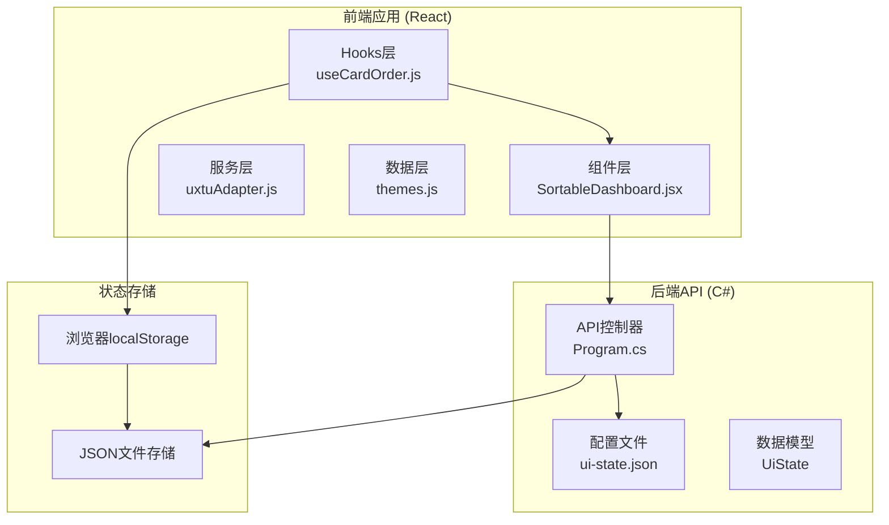
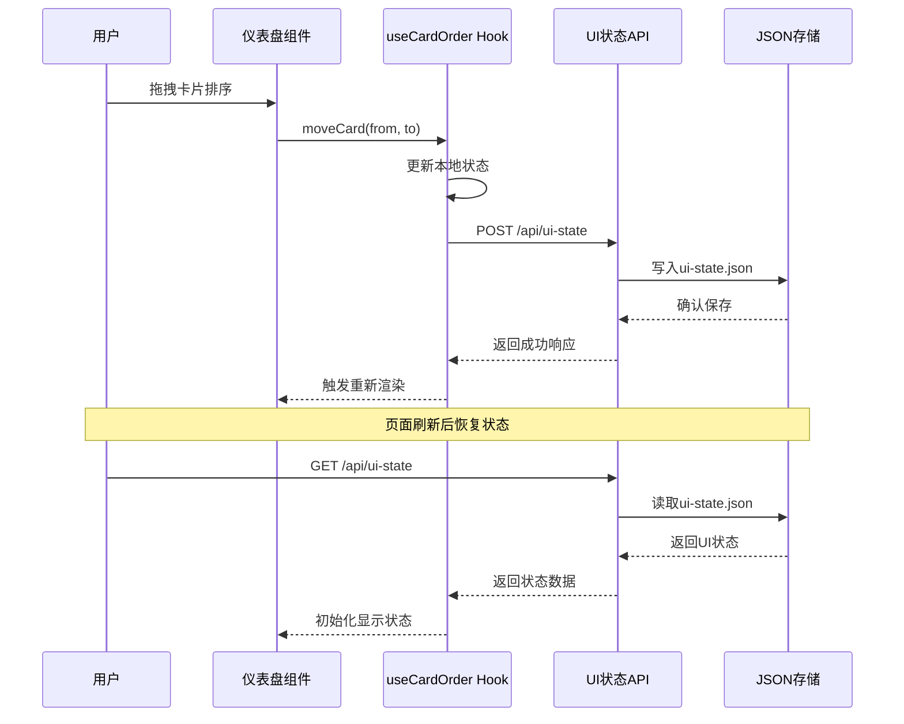
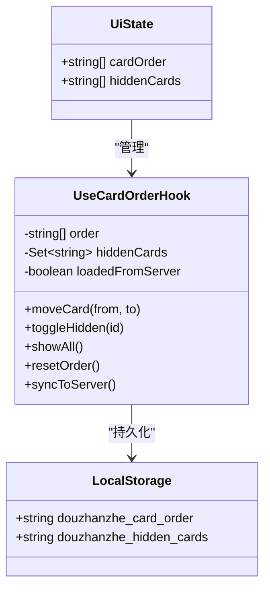
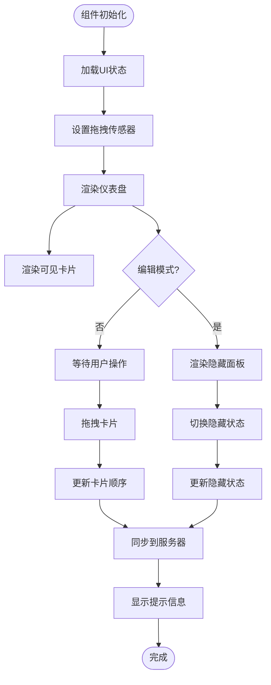
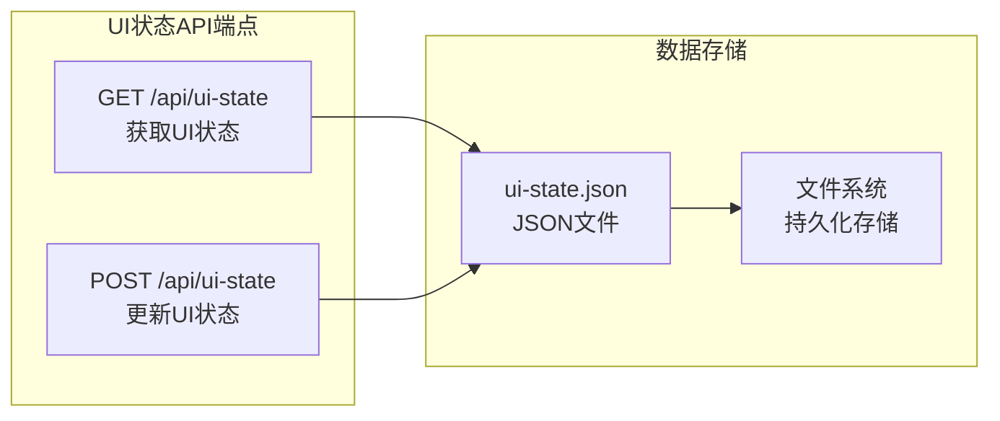

# UI状态管理

<cite>
**本文档引用的文件**
- [useCardOrder.js](file://src/hooks/useCardOrder.js)
- [SortableDashboard.jsx](file://src/components/SortableDashboard.jsx)
- [ui-state.json](file://server/api/config/ui-state.json)
- [Program.cs](file://server/api/Program.cs)
- [useControlState.js](file://src/hooks/useControlState.js)
- [themes.js](file://src/data/themes.js)
- [ThemeSwitcher.jsx](file://src/components/ThemeSwitcher.jsx)
- [App.jsx](file://src/App.jsx)
</cite>

## 目录
1. [简介](#简介)
2. [项目结构](#项目结构)
3. [核心组件](#核心组件)
4. [架构概览](#架构概览)
5. [详细组件分析](#详细组件分析)
6. [依赖关系分析](#依赖关系分析)
7. [性能考虑](#性能考虑)
8. [故障排除指南](#故障排除指南)
9. [结论](#结论)
10. [附录](#附录)

## 简介

UI状态管理API是Douzhanzhe控制系统的核心功能之一，负责管理仪表盘的布局状态、卡片显示/隐藏状态以及主题切换等用户界面配置。该系统实现了完整的状态持久化和恢复机制，支持用户自定义仪表盘布局，并确保在页面刷新或重新启动后能够恢复到用户上次的配置。

系统采用前后端分离的设计模式，前端使用React Hooks管理本地状态，后端使用C# ASP.NET Core提供REST API接口，通过JSON文件实现状态的持久化存储。

## 项目结构

UI状态管理系统主要分布在以下目录结构中：



**图表来源**
- [useCardOrder.js:1-128](file://src/hooks/useCardOrder.js#L1-L128)
- [SortableDashboard.jsx:1-247](file://src/components/SortableDashboard.jsx#L1-L247)
- [Program.cs:594-610](file://server/api/Program.cs#L594-L610)

**章节来源**
- [useCardOrder.js:1-128](file://src/hooks/useCardOrder.js#L1-L128)
- [SortableDashboard.jsx:1-247](file://src/components/SortableDashboard.jsx#L1-L247)
- [Program.cs:594-610](file://server/api/Program.cs#L594-L610)

## 核心组件

UI状态管理系统由三个核心组件构成：

### 1. useCardOrder Hook
负责管理卡片排序和隐藏状态的React Hook，提供完整的CRUD操作能力。

### 2. SortableDashboard 组件
主仪表盘组件，集成拖拽排序功能，根据UI状态动态渲染卡片。

### 3. UI状态API
后端REST API，提供UI状态的获取、更新和持久化功能。

**章节来源**
- [useCardOrder.js:46-127](file://src/hooks/useCardOrder.js#L46-L127)
- [SortableDashboard.jsx:38-246](file://src/components/SortableDashboard.jsx#L38-L246)
- [Program.cs:594-610](file://server/api/Program.cs#L594-L610)

## 架构概览

UI状态管理采用分层架构设计，实现了清晰的关注点分离：



**图表来源**
- [useCardOrder.js:53-91](file://src/hooks/useCardOrder.js#L53-L91)
- [Program.cs:595-610](file://server/api/Program.cs#L595-L610)

## 详细组件分析

### useCardOrder Hook 分析

useCardOrder是UI状态管理的核心Hook，提供了完整的状态管理功能：

#### 数据结构设计



**图表来源**
- [useCardOrder.js:3-18](file://src/hooks/useCardOrder.js#L3-L18)
- [Program.cs:823](file://server/api/Program.cs#L823)

#### 状态管理策略

Hook实现了三种状态管理策略：

1. **默认状态**：使用硬编码的默认卡片顺序和隐藏列表
2. **本地状态**：使用localStorage存储用户自定义的卡片顺序和隐藏状态
3. **服务器状态**：通过API获取和同步到服务器端的UI状态

#### 关键功能实现

**卡片排序功能**：
- 支持拖拽排序和程序化排序
- 自动处理新卡片的合并逻辑
- 维护卡片顺序的完整性

**面板显示/隐藏功能**：
- 实时切换卡片的显示状态
- 提供批量显示和隐藏操作
- 维护可见卡片和隐藏卡片的分离状态

**状态同步机制**：
- 自动同步到localStorage
- 手动同步到服务器端
- 错误处理和重试机制

**章节来源**
- [useCardOrder.js:21-127](file://src/hooks/useCardOrder.js#L21-L127)

### SortableDashboard 组件分析

SortableDashboard是主仪表盘组件，集成了完整的拖拽排序和状态管理功能：

#### 组件架构



**图表来源**
- [SortableDashboard.jsx:49-71](file://src/components/SortableDashboard.jsx#L49-L71)

#### 卡片映射系统

组件维护了一个卡片ID到显示名称的映射表，支持多语言显示：

| 卡片ID | 显示名称 |
|--------|----------|
| cpu-monitor | CPU监控 |
| gpu-monitor | GPU监控 |
| mem-disk | 内存+硬盘 |
| fan-info | 风扇信息 |
| cpu-adjust | CPU调节 |
| gpu-adjust | GPU调节 |
| system-switches | 系统开关 |
| keyboard-light | 键盘灯亮度 |
| gpu-mode | GPU模式 |
| about | 关于 |

**章节来源**
- [SortableDashboard.jsx:25-36](file://src/components/SortableDashboard.jsx#L25-L36)

### UI状态API 分析

后端API提供了完整的UI状态管理REST接口：

#### API端点设计



**图表来源**
- [Program.cs:594-610](file://server/api/Program.cs#L594-L610)

#### 数据模型定义

UI状态数据模型包含两个核心字段：

| 字段名 | 类型 | 描述 | 默认值 |
|--------|------|------|--------|
| cardOrder | string[] | 卡片显示顺序数组 | 默认卡片顺序 |
| hiddenCards | string[] | 隐藏的卡片ID数组 | 空数组 |

**章节来源**
- [Program.cs:594-610](file://server/api/Program.cs#L594-L610)
- [ui-state.json:1-17](file://server/api/config/ui-state.json#L1-L17)

## 依赖关系分析

UI状态管理系统涉及多个层次的依赖关系：

```mermaid
graph TB
subgraph "前端依赖"
React[React核心]
DnDKit[@dnd-kit/core]
SortableContext[@dnd-kit/sortable]
useCardOrder[useCardOrder Hook]
SortableDashboard[SortableDashboard组件]
end
subgraph "后端依赖"
ASPNetCore[ASP.NET Core]
SystemTextJson[System.Text.Json]
Program[Program.cs]
end
subgraph "外部存储"
localStorage[浏览器localStorage]
uiStateJson[ui-state.json]
end
React --> useCardOrder
useCardOrder --> SortableDashboard
SortableDashboard --> DnDKit
SortableDashboard --> SortableContext
useCardOrder --> Program
Program --> SystemTextJson
Program --> uiStateJson
useCardOrder --> localStorage
localStorage --> uiStateJson
```

**图表来源**
- [useCardOrder.js:1-128](file://src/hooks/useCardOrder.js#L1-L128)
- [Program.cs:594-610](file://server/api/Program.cs#L594-L610)

**章节来源**
- [useCardOrder.js:1-128](file://src/hooks/useCardOrder.js#L1-L128)
- [Program.cs:594-610](file://server/api/Program.cs#L594-L610)

## 性能考虑

UI状态管理系统在设计时充分考虑了性能优化：

### 1. 状态更新优化
- 使用React的useState和useEffect进行高效的状态管理
- 避免不必要的重新渲染，通过合理的依赖数组优化
- 实现了防抖机制，减少频繁的状态更新

### 2. 数据持久化优化
- localStorage存储采用异步写入，避免阻塞主线程
- JSON序列化和反序列化操作进行了错误处理
- 文件I/O操作最小化，仅在必要时进行

### 3. 网络请求优化
- API调用实现了错误处理和重试机制
- 使用fetch API进行异步请求，避免阻塞UI线程
- 请求超时和错误状态进行了妥善处理

### 4. 内存管理
- 使用Set数据结构存储隐藏卡片ID，提高查找效率
- 合理的垃圾回收策略，避免内存泄漏
- 大数据量处理时的内存优化

## 故障排除指南

### 常见问题及解决方案

#### 1. UI状态无法保存
**症状**：页面刷新后UI状态恢复到默认值
**可能原因**：
- localStorage存储空间不足
- 浏览器隐私模式限制localStorage访问
- API请求失败

**解决方法**：
- 检查浏览器localStorage容量和权限
- 确认API端点可用性
- 查看浏览器开发者工具中的网络请求

#### 2. 卡片排序异常
**症状**：拖拽排序后卡片位置不正确
**可能原因**：
- 事件处理器冲突
- 状态更新时机问题
- DOM元素ID重复

**解决方法**：
- 检查拖拽事件处理器的实现
- 确认状态更新的原子性
- 验证卡片ID的唯一性

#### 3. 主题切换失效
**症状**：主题切换后样式没有变化
**可能原因**：
- CSS变量未正确更新
- 主题文件加载失败
- DOM元素类名未更新

**解决方法**：
- 检查CSS变量的绑定
- 验证主题文件的完整性
- 确认DOM元素类名的动态更新

**章节来源**
- [useCardOrder.js:53-67](file://src/hooks/useCardOrder.js#L53-L67)
- [App.jsx:39-40](file://src/App.jsx#L39-L40)

## 结论

UI状态管理系统通过精心设计的架构和实现，成功实现了仪表盘布局的完全可定制化。系统具备以下优势：

1. **完整的状态管理**：支持卡片排序、显示/隐藏、主题切换等多种状态
2. **可靠的持久化机制**：结合localStorage和服务器端存储，确保状态的可靠保存
3. **良好的用户体验**：提供直观的拖拽排序和即时的状态反馈
4. **可扩展的架构**：模块化设计便于功能扩展和维护

该系统为用户提供了高度个性化的仪表盘体验，同时保持了系统的稳定性和可靠性。

## 附录

### UI状态文件数据结构

UI状态文件采用JSON格式存储，包含以下字段：

```json
{
  "cardOrder": ["cpu-monitor", "gpu-monitor", "cpu-adjust"],
  "hiddenCards": ["system-switches"]
}
```

### 最佳实践建议

#### 1. 状态管理最佳实践
- 使用单一数据源原则，避免状态分散
- 实现状态的版本控制，支持向后兼容
- 提供状态重置功能，便于故障恢复

#### 2. 用户体验优化
- 提供明确的状态反馈和视觉指示
- 实现撤销/重做功能
- 优化移动端的触摸交互体验

#### 3. 性能优化建议
- 实现状态的增量更新，减少不必要的重渲染
- 使用虚拟滚动处理大量卡片的情况
- 优化网络请求的批处理和缓存策略