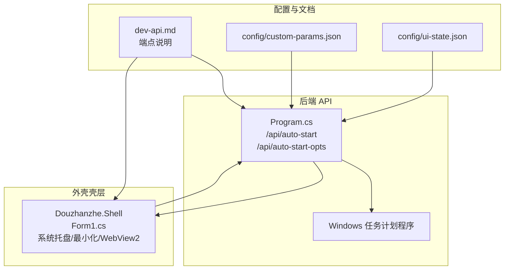
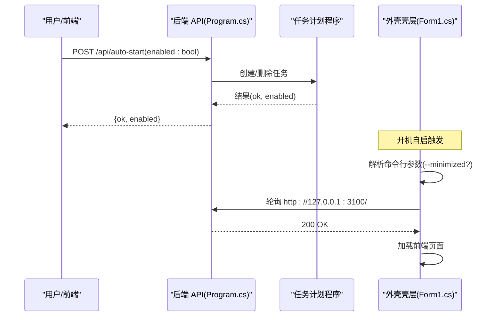
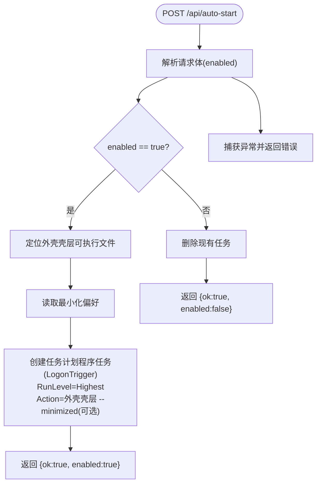
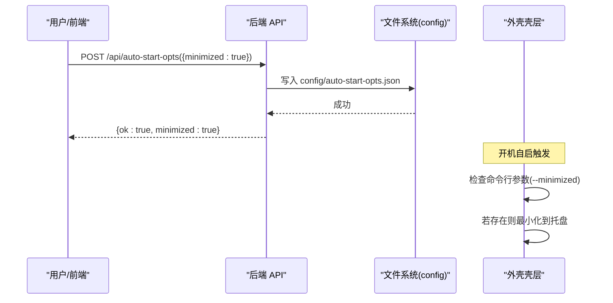
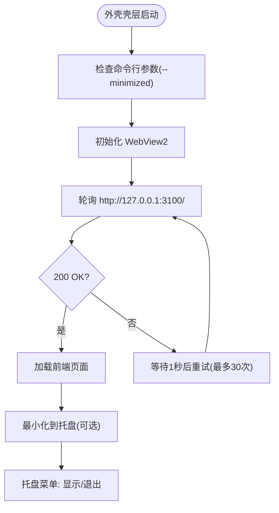
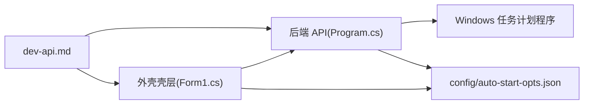

# 启动配置

<cite>
**本文引用的文件**
- [Program.cs](file://server/api/Program.cs)
- [Form1.cs](file://server/shell/Douzhanzhe.Shell/Form1.cs)
- [dev-api.md](file://docs/dev-api.md)
- [_run_admin.bat](file://server/api/_run_admin.bat)
- [custom-params.json](file://server/api/config/custom-params.json)
- [ui-state.json](file://server/api/config/ui-state.json)
</cite>

## 目录
1. [简介](#简介)
2. [项目结构](#项目结构)
3. [核心组件](#核心组件)
4. [架构总览](#架构总览)
5. [详细组件分析](#详细组件分析)
6. [依赖分析](#依赖分析)
7. [性能考量](#性能考量)
8. [故障排除指南](#故障排除指南)
9. [结论](#结论)
10. [附录](#附录)

## 简介
本文件围绕“启动配置”主题，系统化说明以下能力与实现细节：
- 开机自启动功能的启用与禁用机制
- 最小化启动偏好（开机即最小化到系统托盘）的配置与持久化
- Windows 任务计划程序的使用、权限要求与行为约束
- 系统托盘集成与后台运行配置
- 启动延迟与错误处理机制
- 故障排除与安全注意事项

上述内容均基于仓库中的后端 API、外壳壳层（WinForms + WebView2）以及相关文档进行梳理与总结。

## 项目结构
启动配置涉及的关键模块与文件如下：
- 后端 API（C#）：提供开机自启与最小化偏好的查询/设置端点，并通过 Windows 任务计划程序实现开机启动
- 外壳壳层（Douzhanzhe.Shell）：WinForms + WebView2，负责系统托盘、最小化到托盘、等待后端 API 就绪并导航到前端页面
- 文档与配置：API 端点定义、配置持久化位置与样例

**图表来源**
- [Program.cs:628-728](file://server/api/Program.cs#L628-L728)
- [Form1.cs:61-92](file://server/shell/Douzhanzhe.Shell/Form1.cs#L61-L92)
- [dev-api.md:120-141](file://docs/dev-api.md#L120-L141)

**章节来源**
- [Program.cs:1-836](file://server/api/Program.cs#L1-L836)
- [Form1.cs:1-140](file://server/shell/Douzhanzhe.Shell/Form1.cs#L1-L140)
- [dev-api.md:120-141](file://docs/dev-api.md#L120-L141)

## 核心组件
- 开机自启动 API
  - 查询状态：GET /api/auto-start
  - 设置状态：POST /api/auto-start（enabled: bool）
  - 行为：启用时创建任务计划程序任务；禁用时删除任务
- 最小化启动偏好 API
  - 查询偏好：GET /api/auto-start-opts
  - 保存偏好：POST /api/auto-start-opts（minimized: bool）
  - 行为：持久化到 config/auto-start-opts.json
- 外壳壳层（Douzhanzhe.Shell）
  - 支持命令行参数 --minimized，用于开机自启时最小化到托盘
  - 等待后端 API 就绪（约 30 秒轮询），随后加载前端页面
  - 提供系统托盘菜单与气泡提示，支持从托盘恢复窗口

**章节来源**
- [Program.cs:628-728](file://server/api/Program.cs#L628-L728)
- [Form1.cs:61-92](file://server/shell/Douzhanzhe.Shell/Form1.cs#L61-L92)
- [dev-api.md:120-141](file://docs/dev-api.md#L120-L141)

## 架构总览
启动配置的整体流程如下：
- 用户通过前端或外部脚本调用 /api/auto-start 以启用/禁用开机自启
- 后端根据 enabled 参数创建或删除任务计划程序任务，目标为外壳壳层可执行文件（Douzhanzhe.Shell.exe）
- 外壳壳层启动后，读取最小化偏好（来自 /api/auto-start-opts），决定是否最小化到托盘
- 外壳壳层等待后端 API 就绪（HTTP 127.0.0.1:3100），然后加载前端页面

**图表来源**
- [Program.cs:663-728](file://server/api/Program.cs#L663-L728)
- [Form1.cs:61-92](file://server/shell/Douzhanzhe.Shell/Form1.cs#L61-L92)

## 详细组件分析

### 组件A：开机自启动（Windows 任务计划程序）
- 端点
  - GET /api/auto-start：返回当前是否存在名为 DouzhanzheControl 的任务
  - POST /api/auto-start：创建或删除该任务
- 行为与逻辑
  - 启用时：定位外壳壳层可执行文件（优先当前目录，否则回退到开发目录），读取最小化偏好，创建最高权限任务（LogonTrigger），并附加 --minimized 参数（若已启用最小化）
  - 禁用时：删除现有任务
- 权限与运行级别
  - 任务设置为最高权限（RunLevel.Highest），确保在登录时具备足够权限执行硬件控制
- 错误处理
  - 任何异常均被捕获并返回错误信息；查询端点在异常时返回 enabled=false

**图表来源**
- [Program.cs:673-728](file://server/api/Program.cs#L673-L728)

**章节来源**
- [Program.cs:663-728](file://server/api/Program.cs#L663-L728)
- [dev-api.md:120-130](file://docs/dev-api.md#L120-L130)

### 组件B：最小化启动偏好（开机即最小化到托盘）
- 端点
  - GET /api/auto-start-opts：返回当前最小化偏好
  - POST /api/auto-start-opts：保存最小化偏好
- 持久化
  - 偏好存储于 config/auto-start-opts.json（位于后端可执行文件所在 config 目录）
- 外壳壳层联动
  - 启动时检查命令行参数 --minimized，若存在则最小化到托盘且不显示窗口
  - 系统托盘菜单支持“显示主窗口”和“退出”，双击托盘图标可恢复窗口

**图表来源**
- [Program.cs:628-660](file://server/api/Program.cs#L628-L660)
- [Form1.cs:61-69](file://server/shell/Douzhanzhe.Shell/Form1.cs#L61-L69)

**章节来源**
- [Program.cs:628-660](file://server/api/Program.cs#L628-L660)
- [Form1.cs:61-69](file://server/shell/Douzhanzhe.Shell/Form1.cs#L61-L69)
- [dev-api.md:132-141](file://docs/dev-api.md#L132-L141)

### 组件C：系统托盘集成与后台运行
- 托盘图标与菜单
  - 支持“显示主窗口”、“退出”
  - 双击托盘图标恢复窗口
- 最小化行为
  - 窗口最小化时隐藏到托盘，并弹出气泡提示
- 后台运行与前端导航
  - 启动后先初始化 WebView2，再轮询后端 API（最多 30 秒，每秒一次），成功后加载前端页面
  - 若轮询超时，仍尝试加载前端页面

**图表来源**
- [Form1.cs:61-92](file://server/shell/Douzhanzhe.Shell/Form1.cs#L61-L92)

**章节来源**
- [Form1.cs:19-119](file://server/shell/Douzhanzhe.Shell/Form1.cs#L19-L119)

### 组件D：启动延迟与错误处理机制
- 启动延迟
  - 外壳壳层在启动后循环等待后端 API 就绪，最多 30 秒，每次间隔 1 秒
  - 若超时仍未就绪，仍尝试加载前端页面
- 错误处理
  - 任务计划程序相关端点在异常时返回错误信息；查询端点在异常时返回 enabled=false
  - 外壳壳层在最小化到托盘时弹出提示，避免用户误以为程序已关闭

**章节来源**
- [Program.cs:663-728](file://server/api/Program.cs#L663-L728)
- [Form1.cs:74-92](file://server/shell/Douzhanzhe.Shell/Form1.cs#L74-L92)

## 依赖分析
- 组件耦合
  - 后端 API 依赖 Windows 任务计划程序（Microsoft.Win32.TaskScheduler）以实现开机自启
  - 外壳壳层依赖后端 API 提供的健康状态与前端页面
- 外部依赖
  - 任务计划程序：需要管理员权限以创建最高权限任务
  - WebView2：用于承载前端页面
- 配置与持久化
  - config/auto-start-opts.json：最小化偏好
  - config/custom-params.json、config/ui-state.json：其他持久化配置（与启动配置相关但非直接）

**图表来源**
- [Program.cs:628-728](file://server/api/Program.cs#L628-L728)
- [Form1.cs:61-92](file://server/shell/Douzhanzhe.Shell/Form1.cs#L61-L92)
- [dev-api.md:120-141](file://docs/dev-api.md#L120-L141)

**章节来源**
- [Program.cs:628-728](file://server/api/Program.cs#L628-L728)
- [Form1.cs:61-92](file://server/shell/Douzhanzhe.Shell/Form1.cs#L61-L92)
- [dev-api.md:120-141](file://docs/dev-api.md#L120-L141)

## 性能考量
- 启动轮询
  - 外壳壳层对后端 API 的轮询频率为每秒一次，持续最多 30 秒，属于轻量级轮询，对系统影响极小
- 任务计划程序
  - 任务在登录时触发，外壳壳层启动后立即进行轮询，整体启动时延可控
- 文件 I/O
  - 最小化偏好写入为一次性 JSON 写入，文件体积小，性能开销可忽略

## 故障排除指南
- 无法启用开机自启
  - 确认已以管理员身份运行后端 API 或使用提供的管理员启动脚本
  - 检查任务计划程序中是否存在名为 DouzhanzheControl 的任务
  - 查看 POST /api/auto-start 的返回错误信息
- 启用后未自动最小化
  - 确认已通过 POST /api/auto-start-opts 保存了 minimized=true
  - 检查外壳壳层启动时是否携带 --minimized 参数（由后端在创建任务时附加）
- 启动后前端页面未加载
  - 外壳壳层会在 30 秒内持续轮询后端 API，若超时仍尝试加载
  - 检查后端 API 是否正常监听 127.0.0.1:3100
- 管理员权限问题
  - 任务计划程序任务设置为最高权限，需管理员权限创建
  - 可使用提供的管理员启动脚本辅助验证驱动与后端服务

**章节来源**
- [Program.cs:663-728](file://server/api/Program.cs#L663-L728)
- [Form1.cs:74-92](file://server/shell/Douzhanzhe.Shell/Form1.cs#L74-L92)
- [_run_admin.bat:1-13](file://server/api/_run_admin.bat#L1-L13)

## 结论
本项目的启动配置通过“后端 API + 任务计划程序 + 外壳壳层”的组合实现了稳定可靠的开机自启与最小化启动体验。最小化偏好通过 JSON 文件持久化，外壳壳层负责托盘集成与前端导航。整体设计简洁、边界清晰，便于维护与扩展。

## 附录
- 端点一览（与启动配置相关）
  - GET /api/auto-start：查询开机自启状态
  - POST /api/auto-start：设置开机自启（enabled: bool）
  - GET /api/auto-start-opts：查询最小化偏好
  - POST /api/auto-start-opts：保存最小化偏好（minimized: bool）
- 配置文件位置
  - config/auto-start-opts.json：最小化偏好
  - config/custom-params.json、config/ui-state.json：其他持久化配置（与启动配置相关但非直接）

**章节来源**
- [dev-api.md:120-141](file://docs/dev-api.md#L120-L141)
- [custom-params.json:1-22](file://server/api/config/custom-params.json#L1-L22)
- [ui-state.json:1-17](file://server/api/config/ui-state.json#L1-L17)