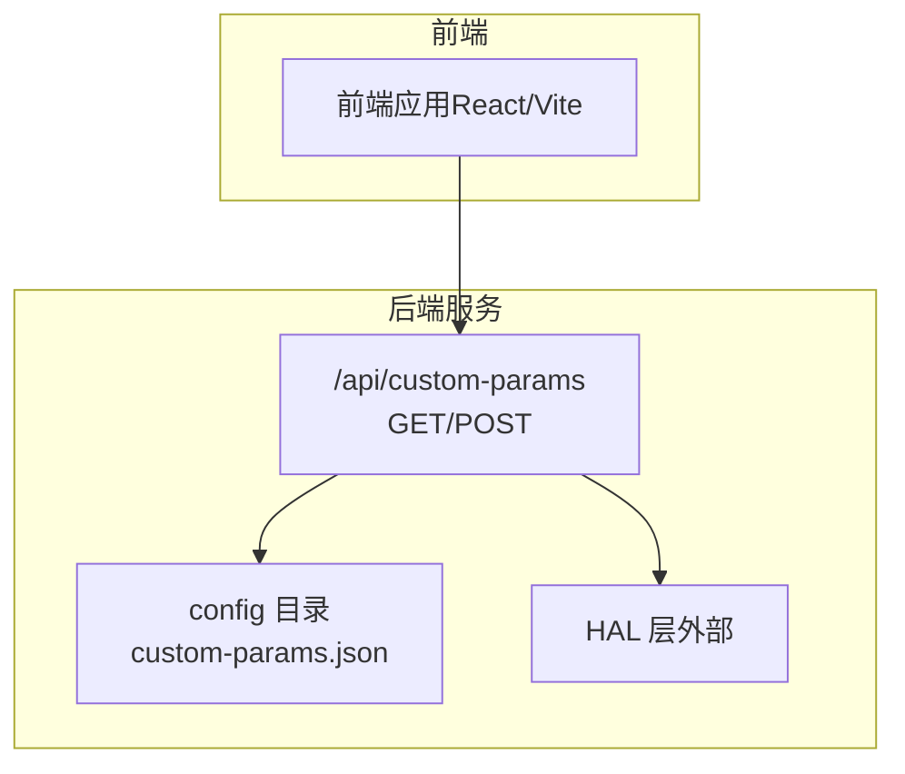
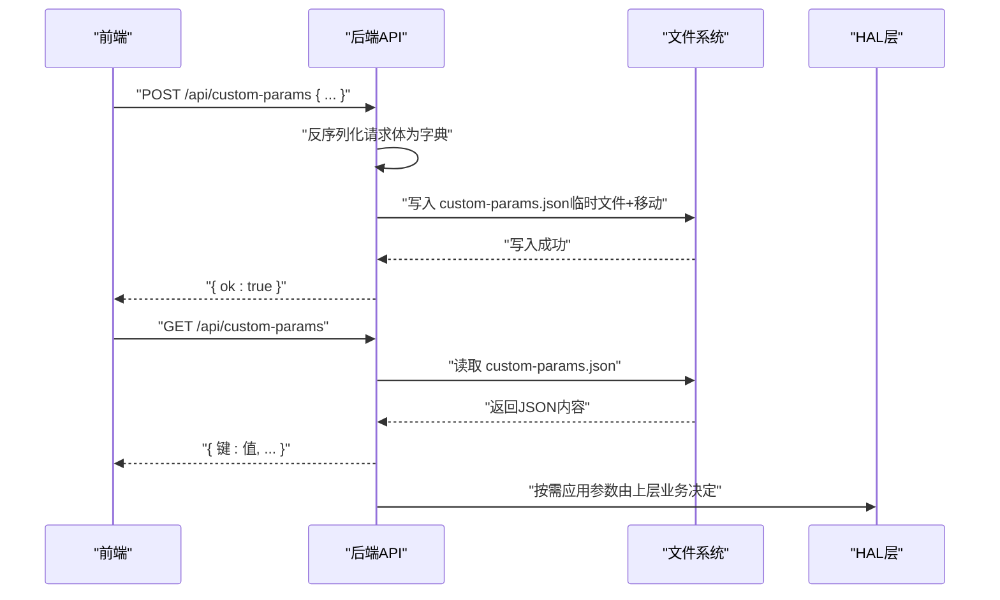
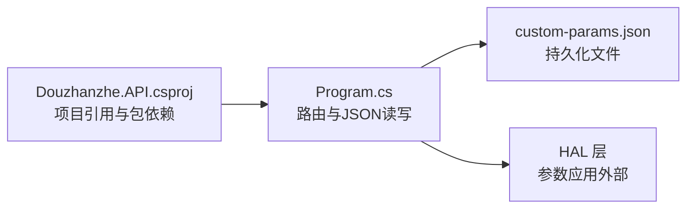

# 自定义参数

<cite>
**本文引用的文件**
- [custom-params.json](file://server/api/config/custom-params.json)
- [Program.cs](file://server/api/Program.cs)
- [Douzhanzhe.API.csproj](file://server/api/Douzhanzhe.API.csproj)
- [dashboard-default.json](file://server/config/dashboard-default.json)
- [ui-state.json](file://server/api/config/ui-state.json)
</cite>

## 目录
1. [简介](#简介)
2. [项目结构](#项目结构)
3. [核心组件](#核心组件)
4. [架构总览](#架构总览)
5. [详细组件分析](#详细组件分析)
6. [依赖关系分析](#依赖关系分析)
7. [性能考量](#性能考量)
8. [故障排查指南](#故障排查指南)
9. [结论](#结论)
10. [附录](#附录)

## 简介
本文件面向“自定义参数”API，系统性说明以下内容：
- 自定义参数的键值对存储格式与数据类型支持
- 参数的读取与写入请求格式
- 参数的持久化机制与文件存储位置
- CPU频率限制、GPU频率限制、风扇转速目标、电压偏移等具体参数的配置说明
- 参数验证规则与默认值设置
- 使用场景与最佳实践建议

## 项目结构
自定义参数API位于后端服务（C# ASP.NET）中，通过HTTP端点提供读写能力，并以JSON文件形式进行持久化。配置文件位于共享的“config”目录中。

图表来源
- [Program.cs:538-552](file://server/api/Program.cs#L538-L552)
- [custom-params.json:1-22](file://server/api/config/custom-params.json#L1-L22)

章节来源
- [Program.cs:23-27](file://server/api/Program.cs#L23-L27)
- [Program.cs:538-552](file://server/api/Program.cs#L538-L552)
- [custom-params.json:1-22](file://server/api/config/custom-params.json#L1-L22)

## 核心组件
- 自定义参数API端点
  - GET /api/custom-params：读取当前自定义参数
  - POST /api/custom-params：写入自定义参数
- 持久化机制
  - 采用JSON文件进行本地持久化，文件名为 custom-params.json
  - 写入过程使用临时文件+原子替换，避免部分写入导致的数据损坏
- 数据类型与默认值
  - 支持任意键值对（对象），值可为数字、字符串、布尔或null
  - 默认值为空对象，若文件不存在或解析失败则返回空对象

章节来源
- [Program.cs:538-552](file://server/api/Program.cs#L538-L552)
- [Program.cs:29-55](file://server/api/Program.cs#L29-L55)
- [custom-params.json:1-22](file://server/api/config/custom-params.json#L1-L22)

## 架构总览
自定义参数API在后端服务中以路由映射的形式暴露，读写逻辑封装在通用的JSON读写辅助函数中；参数最终落盘到共享配置目录。

图表来源
- [Program.cs:538-552](file://server/api/Program.cs#L538-L552)
- [Program.cs:29-55](file://server/api/Program.cs#L29-L55)

## 详细组件分析

### 自定义参数API端点
- GET /api/custom-params
  - 功能：返回当前自定义参数的完整字典
  - 返回：JSON对象
  - 失败处理：文件不存在或解析异常时返回空对象
- POST /api/custom-params
  - 请求体：JSON对象（键值对）
  - 行为：将请求体写入 custom-params.json
  - 成功：返回 { ok: true }
  - 失败：返回错误信息（JSON）

章节来源
- [Program.cs:538-552](file://server/api/Program.cs#L538-L552)

### JSON读写辅助函数
- 读取（JsonRead）
  - 作用：从指定文件读取JSON并反序列化为目标类型，支持大小写不敏感属性名
  - 行为：文件不存在或解析异常时返回提供的回退值
- 写入（JsonWrite）
  - 作用：将对象序列化为JSON并写入文件
  - 行为：先写入临时文件，再原子移动覆盖原文件，确保写入完整性

章节来源
- [Program.cs:29-55](file://server/api/Program.cs#L29-L55)

### 文件存储位置与命名
- 配置目录定位
  - 后端启动时会尝试定位“../config”作为配置目录，若不存在则回退到“../..”下的config
  - 若目录不存在则自动创建
- 文件命名
  - 自定义参数文件：custom-params.json
  - UI状态文件：ui-state.json
  - 仪表盘默认配置：dashboard-default.json

章节来源
- [Program.cs:23-27](file://server/api/Program.cs#L23-L27)
- [Program.cs:553-568](file://server/api/Program.cs#L553-L568)
- [Program.cs:569-584](file://server/api/Program.cs#L569-L584)
- [custom-params.json:1-22](file://server/api/config/custom-params.json#L1-L22)
- [ui-state.json:1-200](file://server/api/config/ui-state.json#L1-L200)
- [dashboard-default.json:1-200](file://server/config/dashboard-default.json#L1-L200)

### 参数键与默认值（示例）
以下键来自默认配置文件，用于说明参数键的命名风格与典型含义。实际生效与否取决于上层业务如何消费这些键。

- CPU相关
  - cpuFreqLimitEnabled: 布尔
  - cpuFreqLimitMhz: 数值（MHz）
  - cpuTurboDisabled: 布尔
  - cpuTempLimitC: 数值（摄氏度）
  - cpuCoreLimit: 数值（核心数）
  - cpuPowerPlan: 字符串（如 balance）
  - cpuVoltageOffset: 数值（偏移量）
  - cpuLongPptW: 数值（功率限制）
  - cpuShortPptW: 数值（短时功率限制）
- GPU相关
  - gpuFreqLimitEnabled: 布尔
  - gpuFreqLimitMhz: 数值（MHz）
  - gpuCoreFreqMhz: 数值（MHz）
  - gpuMemFreqMhz: 数值（MHz）
  - gpuFreqLocked: 布尔
  - gpuPptLimitW: 数值（功率限制）
  - gpuTempLimitC: 数值（摄氏度）
- 风扇相关
  - fanLargeRpmTarget: 数值（RPM）
  - fanSmallRpmTarget: 数值（RPM）
- 其他
  - gpuCoreOffsetMhz: 数值（MHz）
  - gpuMemOffsetMhz: 数值（MHz）

章节来源
- [custom-params.json:1-22](file://server/api/config/custom-params.json#L1-L22)

### 参数验证规则与默认值
- 验证规则
  - 读取：大小写不敏感的属性名映射；解析失败或文件缺失返回空对象
  - 写入：请求体必须为JSON对象；写入过程保证原子性
- 默认值
  - 当前自定义参数API未内置字段级校验与默认值注入；默认行为为直接持久化请求体或返回空对象

章节来源
- [Program.cs:29-55](file://server/api/Program.cs#L29-L55)
- [Program.cs:538-552](file://server/api/Program.cs#L538-L552)

### 典型参数配置说明
以下参数在默认配置文件中出现，可用于指导自定义参数的命名与取值范围。注意：是否生效取决于上层业务逻辑是否读取并应用这些键。

- CPU频率限制
  - cpuFreqLimitEnabled: 是否启用频率限制（布尔）
  - cpuFreqLimitMhz: 频率上限（数值，单位MHz）
  - cpuTurboDisabled: 是否禁用睿频（布尔）
  - cpuTempLimitC: 温度上限（数值，摄氏度）
  - cpuCoreLimit: 核心数限制（数值）
  - cpuPowerPlan: 电源计划（字符串）
  - cpuVoltageOffset: 电压偏移（数值）
  - cpuLongPptW: 长时间PPT功率限制（数值，瓦）
  - cpuShortPptW: 短时间PPT功率限制（数值，瓦）
- GPU频率与温度
  - gpuFreqLimitEnabled: 是否启用频率限制（布尔）
  - gpuFreqLimitMhz: 频率上限（数值，MHz）
  - gpuCoreFreqMhz: 核心频率（数值，MHz）
  - gpuMemFreqMhz: 显存频率（数值，MHz）
  - gpuFreqLocked: 是否锁定频率（布尔）
  - gpuPptLimitW: PPT功率限制（数值，瓦）
  - gpuTempLimitC: 温度上限（数值，摄氏度）
- 风扇转速目标
  - fanLargeRpmTarget: 大风扇目标转速（数值，RPM）
  - fanSmallRpmTarget: 小风扇目标转速（数值，RPM）
- GPU频率偏移
  - gpuCoreOffsetMhz: 核心频率偏移（数值，MHz）
  - gpuMemOffsetMhz: 显存频率偏移（数值，MHz）

章节来源
- [custom-params.json:1-22](file://server/api/config/custom-params.json#L1-L22)

### 使用场景与最佳实践
- 使用场景
  - 在系统启动或用户切换配置时，通过POST /api/custom-params写入一组参数键值对
  - 通过GET /api/custom-params读取当前生效的参数，用于UI展示或审计
- 最佳实践
  - 统一命名风格：使用小驼峰命名，便于跨语言与工具链兼容
  - 分层管理：将不同硬件域（CPU/GPU/风扇）的参数分组存放，避免键冲突
  - 版本化：在键名中加入版本号或语义化标识，便于后续演进
  - 原子写入：依赖后端的原子写入机制，避免并发写入导致的半成品文件
  - 缺省策略：对于可选参数，建议在上层业务中提供合理的默认值，而非依赖API的空对象返回

## 依赖关系分析
- 后端服务依赖
  - 配置目录定位与创建
  - JSON序列化/反序列化选项（大小写不敏感属性名）
  - 原子写入（临时文件+移动）
- 外部依赖
  - HAL层负责将参数应用到硬件（例如SMU、WMI、GPU控制器等），具体行为不在本API内实现

图表来源
- [Program.cs:29-55](file://server/api/Program.cs#L29-L55)
- [Program.cs:538-552](file://server/api/Program.cs#L538-L552)
- [Douzhanzhe.API.csproj:12-29](file://server/api/Douzhanzhe.API.csproj#L12-L29)

章节来源
- [Program.cs:29-55](file://server/api/Program.cs#L29-L55)
- [Program.cs:538-552](file://server/api/Program.cs#L538-L552)
- [Douzhanzhe.API.csproj:12-29](file://server/api/Douzhanzhe.API.csproj#L12-L29)

## 性能考量
- JSON读写为同步IO，文件较小（KB级）时开销可忽略
- 原子写入避免了并发写入竞争带来的数据损坏风险
- 建议：参数变更频率不高时，无需额外缓存；若频繁读写，可在上层增加轻量缓存以减少重复IO

## 故障排查指南
- 无法读取参数
  - 检查配置目录是否存在且可访问
  - 确认 custom-params.json 是否被其他进程占用
  - 查看后端日志，确认是否抛出异常
- 写入失败
  - 检查请求体是否为合法JSON对象
  - 确认磁盘空间与权限
  - 观察临时文件是否残留（写入过程中断可能导致）
- 参数未生效
  - 确认上层业务是否正确读取并应用了自定义参数
  - 检查HAL层对相应键的支持情况

章节来源
- [Program.cs:29-55](file://server/api/Program.cs#L29-L55)
- [Program.cs:538-552](file://server/api/Program.cs#L538-L552)

## 结论
自定义参数API提供了简单可靠的键值对持久化能力，具备原子写入与容错回退机制。结合默认配置文件中的参数键示例，用户可以灵活地组织与管理各类硬件参数。实际效果取决于上层业务对这些键的消费与应用。

## 附录

### API定义概览
- GET /api/custom-params
  - 描述：读取自定义参数
  - 返回：JSON对象
- POST /api/custom-params
  - 描述：写入自定义参数
  - 请求体：JSON对象
  - 返回：{ ok: true } 或错误信息

章节来源
- [Program.cs:538-552](file://server/api/Program.cs#L538-L552)