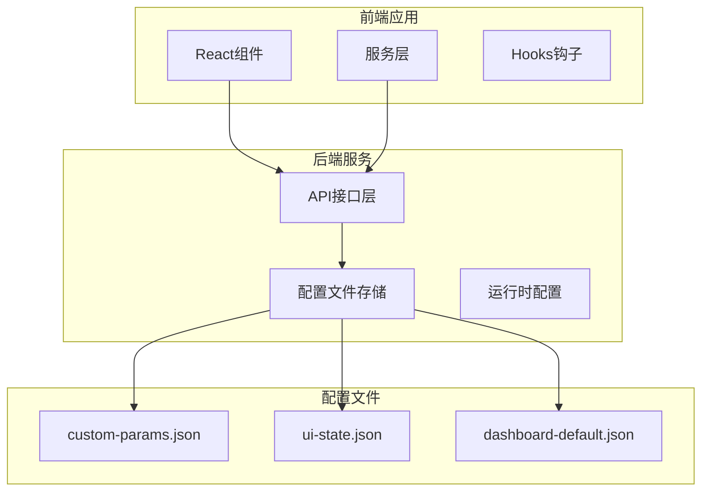
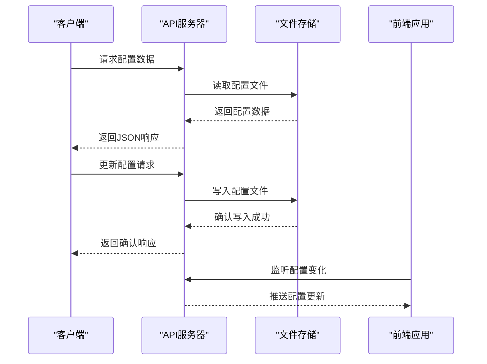
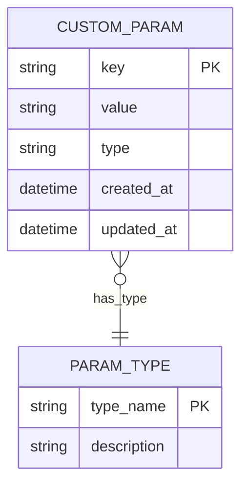
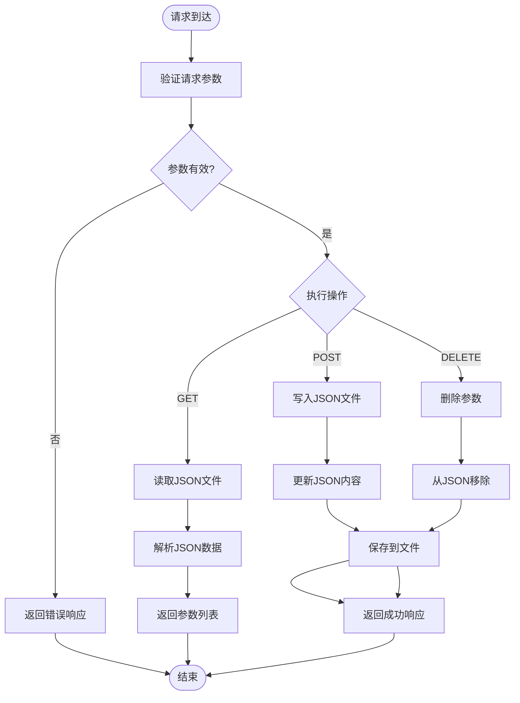
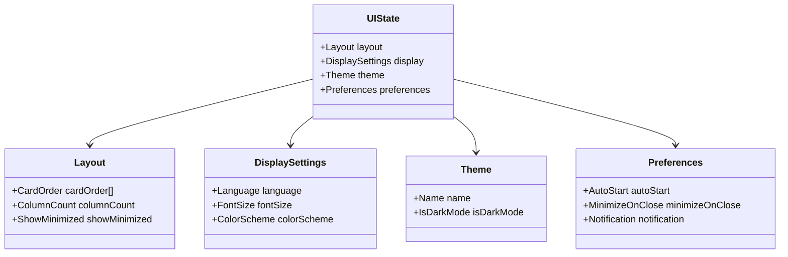
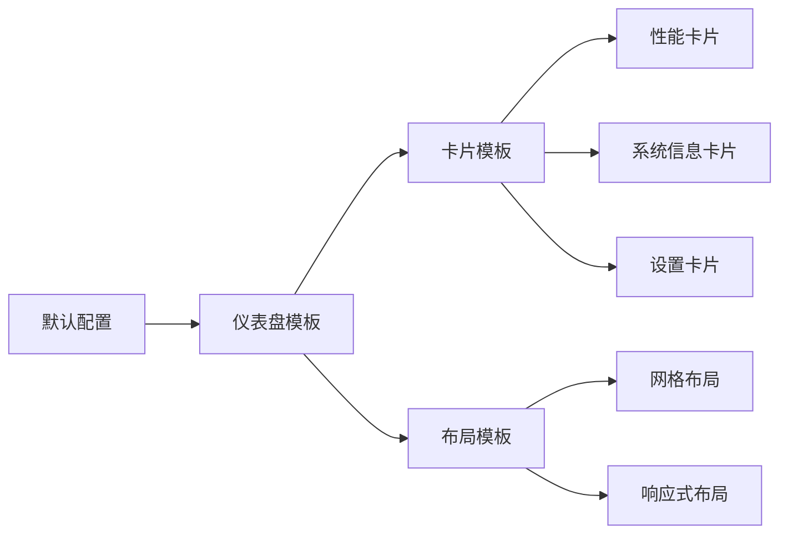
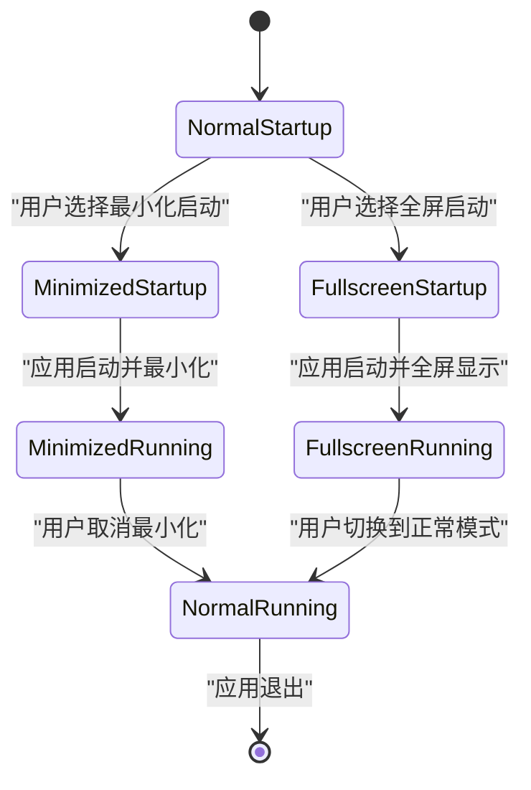
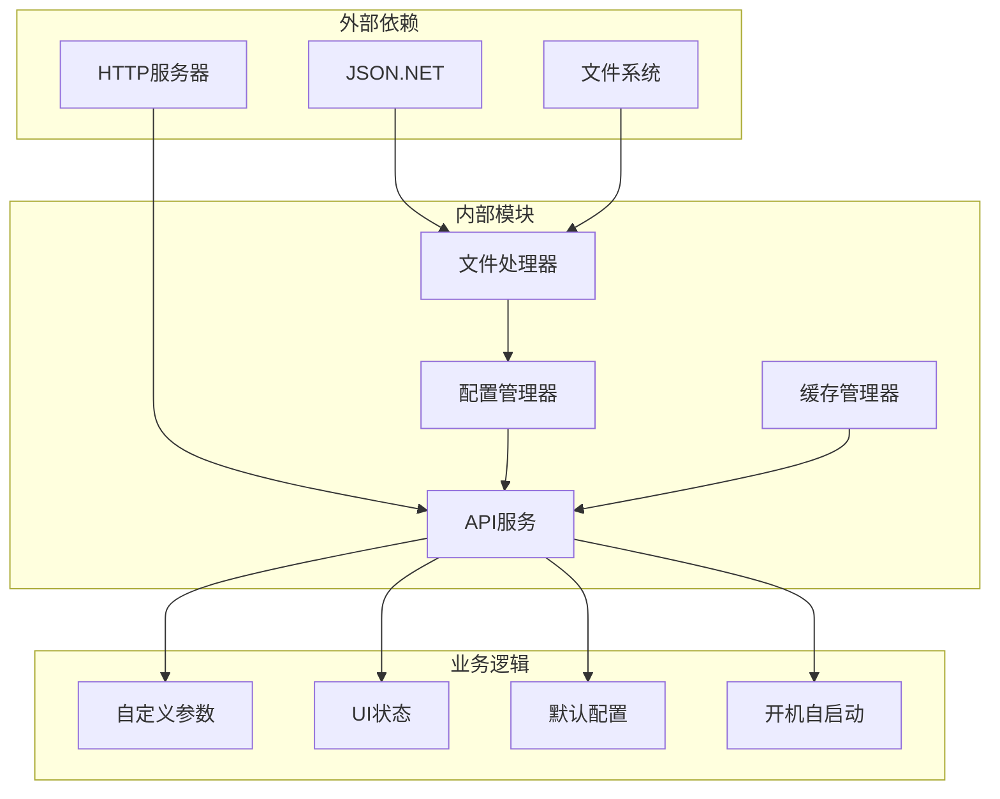

# 配置管理API

<cite>
**本文档引用的文件**
- [Douzhanzhe.API.http](file://server/api/Douzhanzhe.API.http)
- [Program.cs](file://server/api/Program.cs)
- [custom-params.json](file://server/api/config/custom-params.json)
- [ui-state.json](file://server/api/config/ui-state.json)
- [dashboard-default.json](file://server/config/dashboard-default.json)
- [App.jsx](file://src/App.jsx)
</cite>

## 目录
1. [简介](#简介)
2. [项目结构](#项目结构)
3. [核心组件](#核心组件)
4. [架构概览](#架构概览)
5. [详细组件分析](#详细组件分析)
6. [依赖关系分析](#依赖关系分析)
7. [性能考虑](#性能考虑)
8. [故障排除指南](#故障排除指南)
9. [结论](#结论)

## 简介

本文件详细说明了配置管理API的设计与实现，涵盖以下核心功能模块：

- 自定义参数API：用于存储和管理键值对形式的用户自定义配置
- UI状态API：管理界面布局、显示设置和用户偏好
- 默认配置API：提供仪表盘模板设置的默认值
- 开机自启动选项API：处理应用的最小化偏好设置
- 配置文件持久化机制：说明数据格式和存储策略

该系统采用前后端分离架构，后端通过HTTP接口提供配置管理服务，前端通过React组件进行交互。

## 项目结构

配置管理系统主要分布在以下目录中：

**图表来源**
- [Program.cs](file://server/api/Program.cs)
- [custom-params.json](file://server/api/config/custom-params.json)
- [ui-state.json](file://server/api/config/ui-state.json)

**章节来源**
- [Program.cs](file://server/api/Program.cs)
- [Douzhanzhe.API.http](file://server/api/Douzhanzhe.API.http)

## 核心组件

### API接口层

后端通过HTTP接口提供配置管理功能，主要包含以下端点：

- `GET /api/custom-params` - 获取所有自定义参数
- `POST /api/custom-params` - 创建或更新自定义参数
- `DELETE /api/custom-params/{key}` - 删除指定参数
- `GET /api/ui-state` - 获取UI状态配置
- `POST /api/ui-state` - 更新UI状态配置
- `GET /api/default-config` - 获取默认配置
- `GET /api/auto-start-opts` - 获取开机自启动选项

### 配置存储层

系统使用JSON文件作为配置存储介质，确保配置的持久化和可移植性：

- `custom-params.json`：存储用户自定义键值对参数
- `ui-state.json`：存储界面状态和布局设置
- `dashboard-default.json`：存储仪表盘模板的默认配置

### 前端交互层

前端通过React组件与后端API进行交互，提供直观的配置管理界面。

**章节来源**
- [Douzhanzhe.API.http](file://server/api/Douzhanzhe.API.http)
- [App.jsx](file://src/App.jsx)

## 架构概览

**图表来源**
- [Program.cs](file://server/api/Program.cs)
- [custom-params.json](file://server/api/config/custom-params.json)

## 详细组件分析

### 自定义参数API (/api/custom-params)

自定义参数API负责管理用户定义的键值对配置，支持完整的CRUD操作。

#### 数据模型

**图表来源**
- [custom-params.json](file://server/api/config/custom-params.json)

#### 存储机制

系统采用JSON文件作为存储介质，每个参数以键值对的形式保存：

- **键名**：字符串类型，用作参数标识符
- **值**：支持多种数据类型（字符串、数字、布尔值）
- **元数据**：包含创建时间和最后修改时间戳

#### API流程

**图表来源**
- [Program.cs](file://server/api/Program.cs)
- [custom-params.json](file://server/api/config/custom-params.json)

**章节来源**
- [custom-params.json](file://server/api/config/custom-params.json)
- [Program.cs](file://server/api/Program.cs)

### UI状态API (/api/ui-state)

UI状态API管理界面布局、显示设置和用户偏好配置。

#### 配置结构

**图表来源**
- [ui-state.json](file://server/api/config/ui-state.json)

#### 状态管理

系统维护以下UI状态信息：

- **布局配置**：卡片排列顺序、列数、最小化显示
- **显示设置**：语言、字体大小、颜色方案
- **主题配置**：明暗主题切换、主题名称
- **用户偏好**：开机自启动、关闭行为、通知设置

**章节来源**
- [ui-state.json](file://server/api/config/ui-state.json)

### 默认配置API (/api/default-config)

默认配置API提供仪表盘模板设置的默认值，确保新用户获得一致的初始体验。

#### 模板结构

**图表来源**
- [dashboard-default.json](file://server/config/dashboard-default.json)

#### 配置继承机制

系统采用配置继承策略：

1. **基础模板**：定义标准的卡片类型和布局规则
2. **用户覆盖**：允许用户自定义特定卡片的显示设置
3. **动态调整**：根据屏幕尺寸自动调整布局

**章节来源**
- [dashboard-default.json](file://server/config/dashboard-default.json)

### 开机自启动选项API (/api/auto-start-opts)

开机自启动选项API处理应用的最小化偏好设置，确保应用在系统启动时按用户期望的方式运行。

#### 启动模式

**图表来源**
- [Program.cs](file://server/api/Program.cs)

#### 最小化偏好设置

系统支持以下最小化偏好选项：

- **启动时最小化**：应用启动后立即最小化到系统托盘
- **保持窗口状态**：根据上次退出时的状态恢复
- **用户确认**：每次启动都询问用户的偏好设置

**章节来源**
- [Program.cs](file://server/api/Program.cs)

## 依赖关系分析

**图表来源**
- [Program.cs](file://server/api/Program.cs)
- [custom-params.json](file://server/api/config/custom-params.json)

**章节来源**
- [Program.cs](file://server/api/Program.cs)

## 性能考虑

### 缓存策略

系统采用多级缓存机制：

- **内存缓存**：最近访问的配置数据存储在内存中
- **文件缓存**：定期检查文件变更，避免频繁磁盘I/O
- **网络缓存**：前端组件使用本地状态管理减少API调用

### 异步处理

所有配置操作都采用异步模式：

- 文件读写操作使用异步I/O
- API响应采用异步处理
- 前端状态更新使用React的异步状态更新

### 错误处理

系统实现完善的错误处理机制：

- 参数验证失败时返回400错误
- 文件读写异常时返回500错误
- 网络超时重试机制

## 故障排除指南

### 常见问题

1. **配置文件无法读取**
   - 检查文件权限和路径
   - 验证JSON格式正确性
   - 确认文件编码为UTF-8

2. **API响应超时**
   - 检查网络连接稳定性
   - 验证服务器负载情况
   - 调整超时参数设置

3. **配置不生效**
   - 确认配置文件已正确保存
   - 检查前端缓存是否需要刷新
   - 验证配置优先级设置

### 调试方法

- 使用浏览器开发者工具查看API请求响应
- 检查服务器日志输出
- 验证配置文件的实际内容
- 测试不同环境下的配置行为

**章节来源**
- [Program.cs](file://server/api/Program.cs)

## 结论

配置管理API提供了完整、可靠的配置管理解决方案，具有以下特点：

- **可靠性**：基于JSON文件的持久化存储，确保配置安全
- **易用性**：简洁的RESTful API设计，易于集成和使用
- **扩展性**：模块化的架构设计，便于功能扩展
- **性能**：优化的缓存和异步处理机制，保证响应速度

该系统为用户提供了灵活的配置管理能力，支持从简单的键值对配置到复杂的UI状态管理，满足不同层次的配置需求。