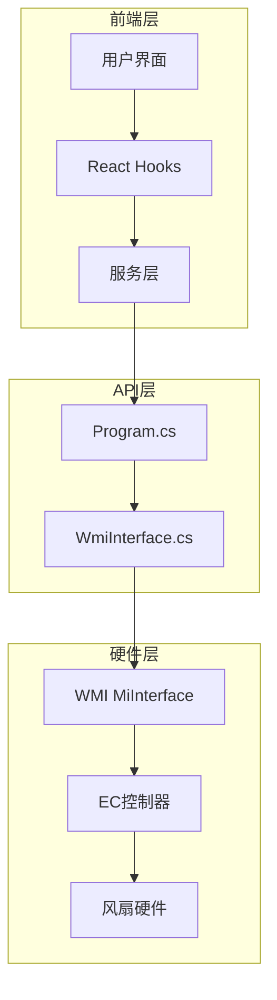
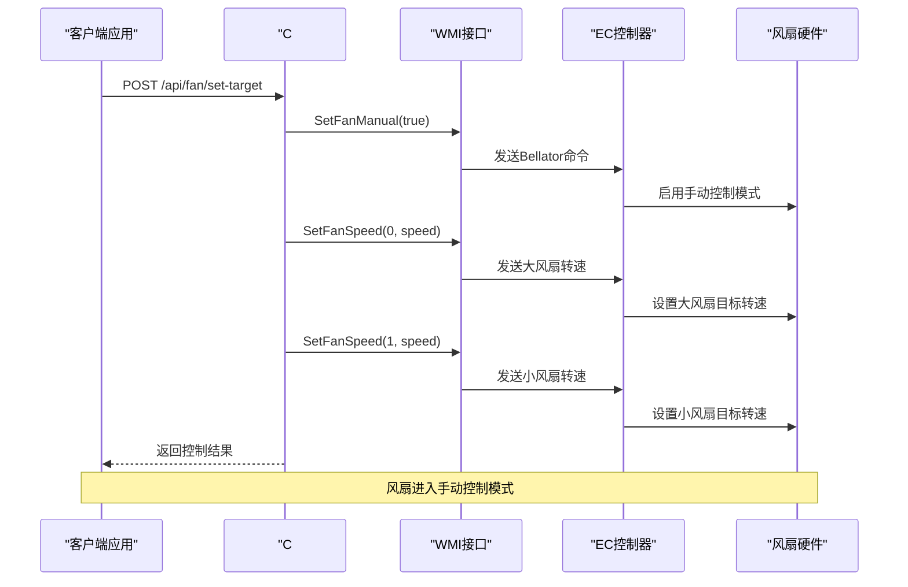
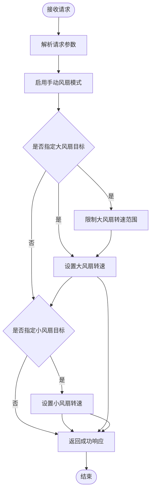
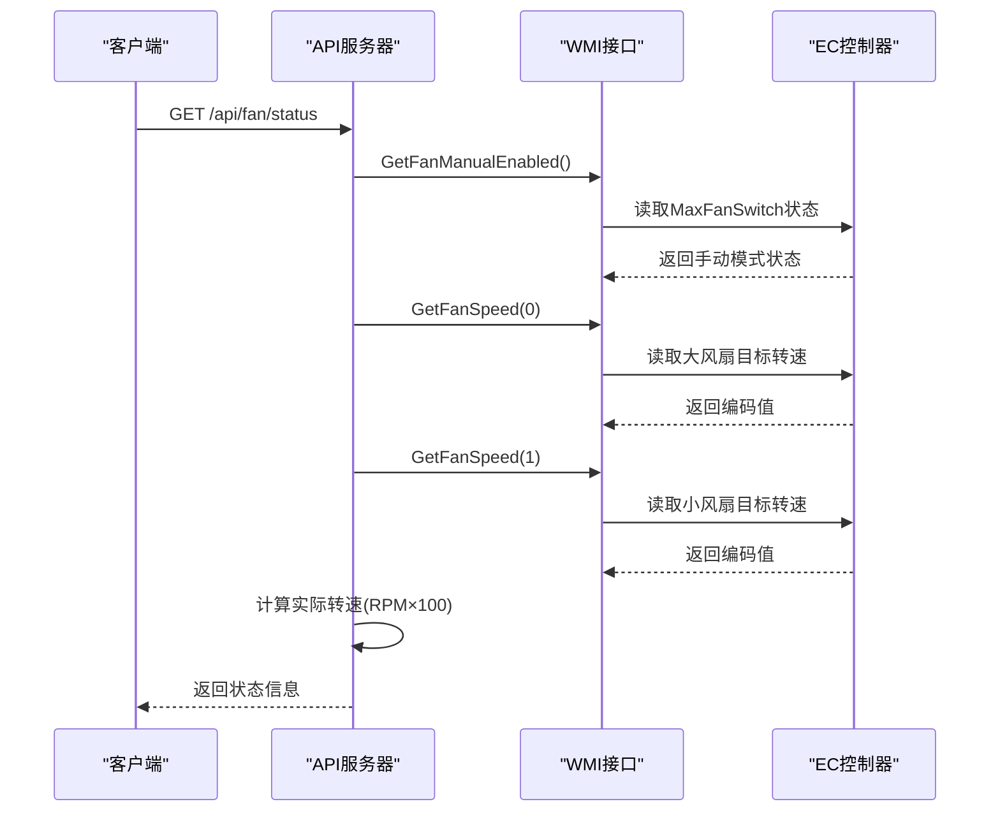
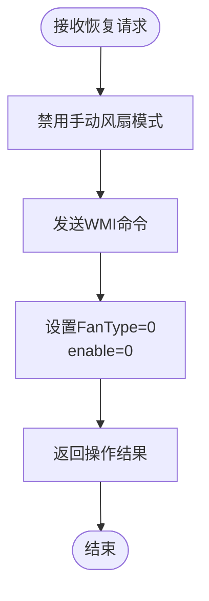
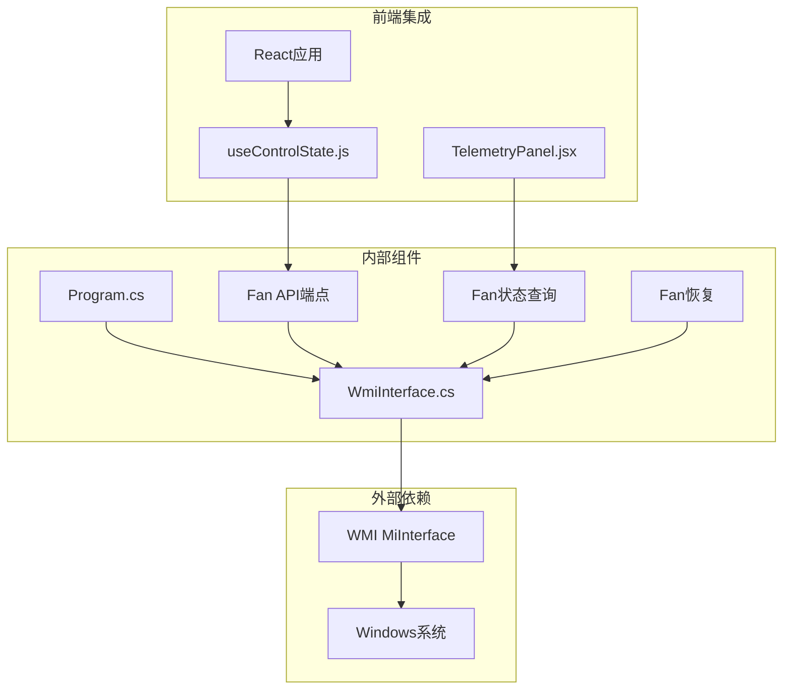
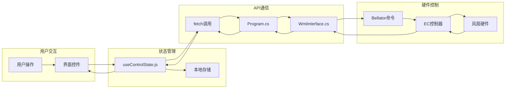

# 风扇控制API

<cite>
**本文档引用的文件**
- [Program.cs](file://server/api/Program.cs)
- [WmiInterface.cs](file://server/api/WmiInterface.cs)
- [dev-api.md](file://docs/dev-api.md)
- [uxtuAdapter.js](file://src/services/uxtuAdapter.js)
- [useControlState.js](file://src/hooks/useControlState.js)
- [TelemetryPanel.jsx](file://src/components/panels/TelemetryPanel.jsx)
- [reference-consoles.md](file://docs/reference-consoles.md)
</cite>

## 目录
1. [简介](#简介)
2. [项目结构](#项目结构)
3. [核心组件](#核心组件)
4. [架构概览](#架构概览)
5. [详细组件分析](#详细组件分析)
6. [依赖关系分析](#依赖关系分析)
7. [性能考虑](#性能考虑)
8. [故障排除指南](#故障排除指南)
9. [结论](#结论)

## 简介

本文档详细说明了风扇控制API的设计与实现，包括手动控制机制、状态查询和固件控制恢复功能。该系统基于WMI MiInterface协议，通过Bellator协议实现对大风扇（CPU/GPU风扇）和小风扇（SYS风扇）的精确控制。

## 项目结构

风扇控制系统采用分层架构设计：

**图表来源**
- [Program.cs:1-783](file://server/api/Program.cs#L1-L783)
- [WmiInterface.cs:1-210](file://server/api/WmiInterface.cs#L1-L210)

**章节来源**
- [Program.cs:1-783](file://server/api/Program.cs#L1-L783)
- [WmiInterface.cs:1-210](file://server/api/WmiInterface.cs#L1-L210)

## 核心组件

### 风扇控制API端点

系统提供三个核心风扇控制API端点：

1. **POST /api/fan/set-target** - 风扇目标设置API
2. **GET /api/fan/status** - 风扇状态查询API  
3. **POST /api/fan/restore** - 风扇恢复API

### WMI接口实现

WmiInterface类封装了所有WMI通信逻辑，支持以下操作：

- 手动风扇模式控制
- 风扇转速设置
- 风扇状态查询
- 通用WMI命令执行

**章节来源**
- [Program.cs:345-394](file://server/api/Program.cs#L345-L394)
- [WmiInterface.cs:137-209](file://server/api/WmiInterface.cs#L137-L209)

## 架构概览

风扇控制系统采用客户端-服务器架构，通过HTTP API进行通信：

**图表来源**
- [Program.cs:345-367](file://server/api/Program.cs#L345-L367)
- [WmiInterface.cs:139-169](file://server/api/WmiInterface.cs#L139-L169)

## 详细组件分析

### 风扇目标设置API (/api/fan/set-target)

#### 请求处理流程

**图表来源**
- [Program.cs:345-367](file://server/api/Program.cs#L345-L367)

#### 转速计算与限制

系统采用RPM/100的编码方式，具体限制如下：

- **大风扇（CPU/GPU风扇）**：0-4400 RPM，对应0-44的编码值
- **小风扇（SYS风扇）**：0-8200 RPM，对应0-82的编码值

转速转换公式：`编码值 = 转速值 ÷ 100`

#### 安全限制机制

1. **数值范围检查**：自动将超出范围的值限制在有效范围内
2. **模式约束**：受散热模式限制，超出下限的值会被EC截断
3. **手动模式优先**：每次设置都会强制启用手动控制模式

**章节来源**
- [Program.cs:345-367](file://server/api/Program.cs#L345-L367)
- [dev-api.md:82-88](file://docs/dev-api.md#L82-L88)

### 风扇状态查询API (/api/fan/status)

#### 状态读取机制

**图表来源**
- [Program.cs:381-394](file://server/api/Program.cs#L381-L394)
- [WmiInterface.cs:172-198](file://server/api/WmiInterface.cs#L172-L198)

#### 返回数据结构

| 字段名 | 类型 | 描述 | 示例值 |
|--------|------|------|--------|
| ok | boolean | 操作是否成功 | true |
| manualEnabled | boolean | 是否处于手动控制模式 | false |
| largeRpmTarget | integer | 大风扇目标转速(RPM) | 2200 |
| smallRpmTarget | integer | 小风扇目标转速(RPM) | 4100 |

**注意**：manualEnabled字段在某些模具上可能不准确，始终返回false。

**章节来源**
- [Program.cs:381-394](file://server/api/Program.cs#L381-L394)
- [dev-api.md:35-39](file://docs/dev-api.md#L35-L39)

### 风扇恢复API (/api/fan/restore)

#### 恢复机制

恢复API负责将风扇控制权交还给固件，重新启用自动风扇控制曲线：

**图表来源**
- [Program.cs:368-379](file://server/api/Program.cs#L368-L379)

#### 恢复效果

- 禁用手动风扇控制模式
- 恢复固件风扇曲线控制
- 风扇转速由系统根据温度自动调节

**章节来源**
- [Program.cs:368-379](file://server/api/Program.cs#L368-L379)
- [dev-api.md:90-93](file://docs/dev-api.md#L90-L93)

### 转速范围与精度规范

#### 硬件转速范围

| 风扇类型 | 最小值 | 最大值 | 精度 | 编码范围 |
|----------|--------|--------|------|----------|
| 大风扇(CPU/GPU) | 0 RPM | 4400 RPM | ±100 RPM | 0-44 |
| 小风扇(SYS) | 0 RPM | 8200 RPM | ±100 RPM | 0-82 |

#### 散热模式约束

不同散热模式对风扇转速有特定的限制范围：

| 散热模式 | 大风扇下限 | 大风扇上限 | 小风扇下限 | 小风扇上限 |
|----------|------------|------------|------------|------------|
| 安静(Silent) | 1900 RPM | 2900 RPM | 1700 RPM | 6400 RPM |
| 平衡(Office) | 2600 RPM | 3500 RPM | 5900 RPM | 6900 RPM |
| 狂暴(Beast) | 3200 RPM | 3800 RPM | 6400 RPM | 7200 RPM |
| 竞速(Gaming) | 4000 RPM | 4400 RPM | 7500 RPM | 8200 RPM |

**章节来源**
- [uxtuAdapter.js:98-106](file://src/services/uxtuAdapter.js#L98-L106)
- [reference-consoles.md:215-225](file://docs/reference-consoles.md#L215-L225)

## 依赖关系分析

### 组件依赖图

**图表来源**
- [Program.cs:1-14](file://server/api/Program.cs#L1-L14)
- [WmiInterface.cs:1-48](file://server/api/WmiInterface.cs#L1-L48)

### 数据流分析

**图表来源**
- [useControlState.js:112-126](file://src/hooks/useControlState.js#L112-L126)
- [Program.cs:345-367](file://server/api/Program.cs#L345-L367)

**章节来源**
- [useControlState.js:1-355](file://src/hooks/useControlState.js#L1-L355)
- [Program.cs:1-783](file://server/api/Program.cs#L1-L783)

## 性能考虑

### 响应时间优化

1. **去抖机制**：风扇设置API采用600ms去抖延迟，避免频繁API调用
2. **批量更新**：同时设置大风扇和小风扇转速，减少网络往返
3. **状态缓存**：前端缓存风扇状态，减少不必要的查询

### 内存使用优化

- 使用byte数组进行WMI通信，最小化内存占用
- 流式处理API响应，避免大对象复制
- 及时清理定时器和事件监听器

### 网络效率

- HTTP/1.1 Keep-Alive连接复用
- JSON序列化优化，避免不必要的字段传输
- WebSocket用于实时遥测，减少轮询开销

## 故障排除指南

### 常见问题及解决方案

#### WMI连接失败

**症状**：API调用返回错误，风扇控制无效

**诊断步骤**：
1. 检查WMI服务状态
2. 验证用户权限
3. 确认MiInterface设备存在

**解决方法**：
- 以管理员权限运行应用程序
- 重启WMI服务
- 检查防火墙设置

#### 风扇无响应

**症状**：设置转速后风扇不变化

**可能原因**：
1. 散热模式限制导致转速被截断
2. EC控制器不支持某些转速值
3. 硬件兼容性问题

**解决方法**：
- 调整到允许的转速范围内
- 尝试不同的散热模式
- 更新BIOS和驱动程序

#### 状态查询异常

**症状**：/api/fan/status返回的状态不准确

**解决方法**：
- 某些模具的GET方法不回写开关状态
- 使用POST方法验证当前状态
- 检查WMI方法号是否正确

**章节来源**
- [Program.cs:381-394](file://server/api/Program.cs#L381-L394)
- [dev-api.md:38-39](file://docs/dev-api.md#L38-L39)

## 结论

风扇控制API提供了完整的硬件级风扇控制能力，通过WMI MiInterface协议实现了对大风扇和小风扇的精确控制。系统设计考虑了安全性、可靠性和用户体验，在保证硬件安全的前提下提供了灵活的控制选项。

主要特性包括：
- 精确的转速控制（±100 RPM精度）
- 多种散热模式支持
- 安全限制机制
- 实时状态监控
- 一键恢复固件控制

该系统为用户提供了专业级的风扇控制体验，同时保持了良好的系统稳定性和安全性。