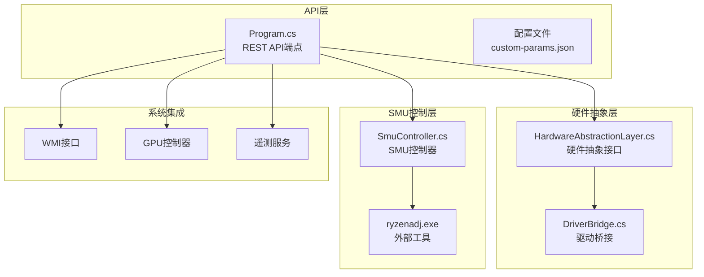
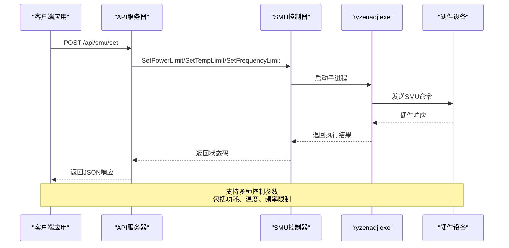
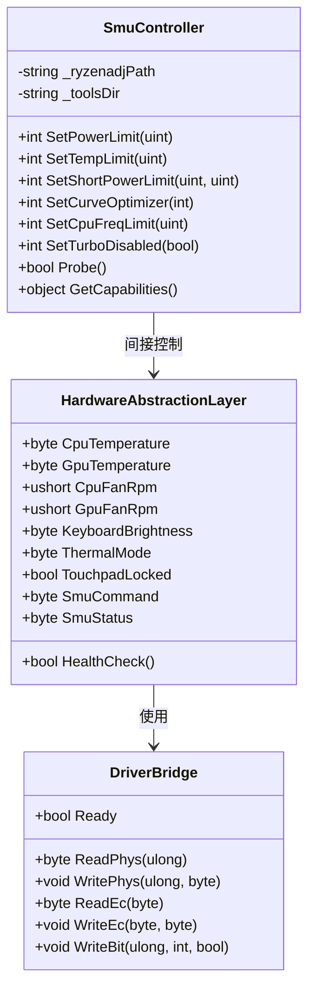
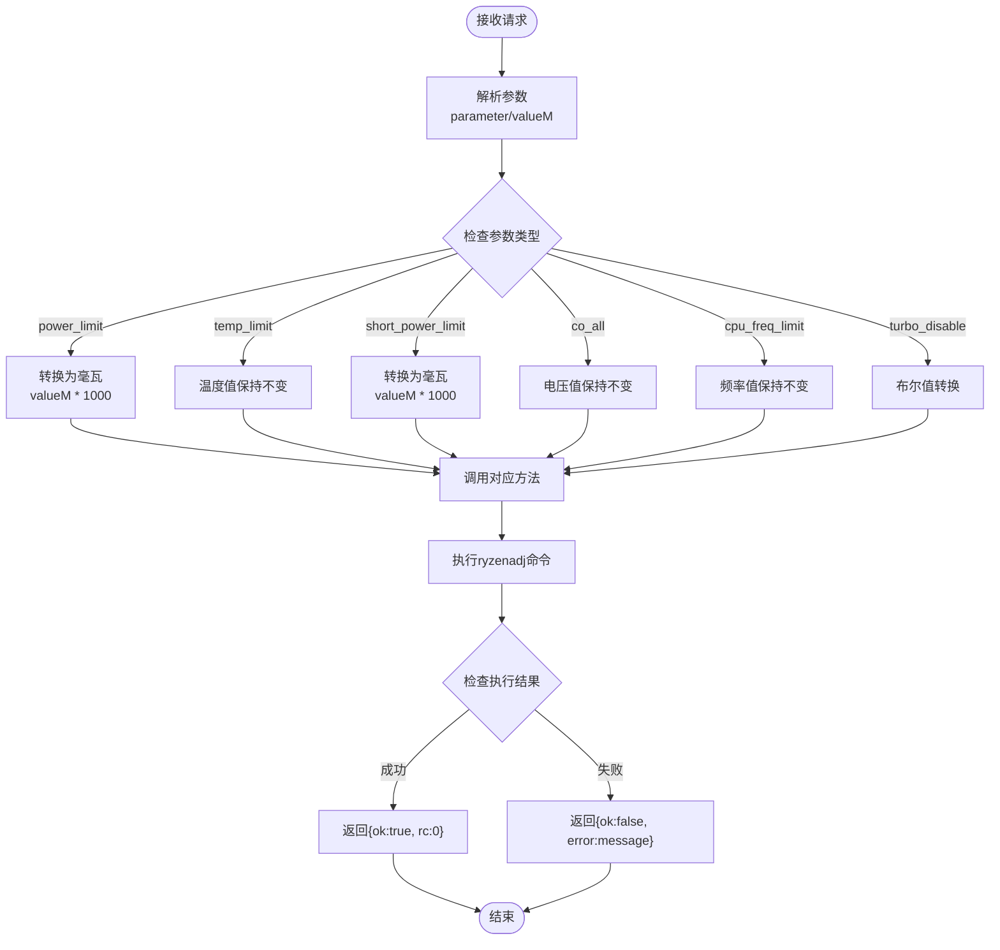
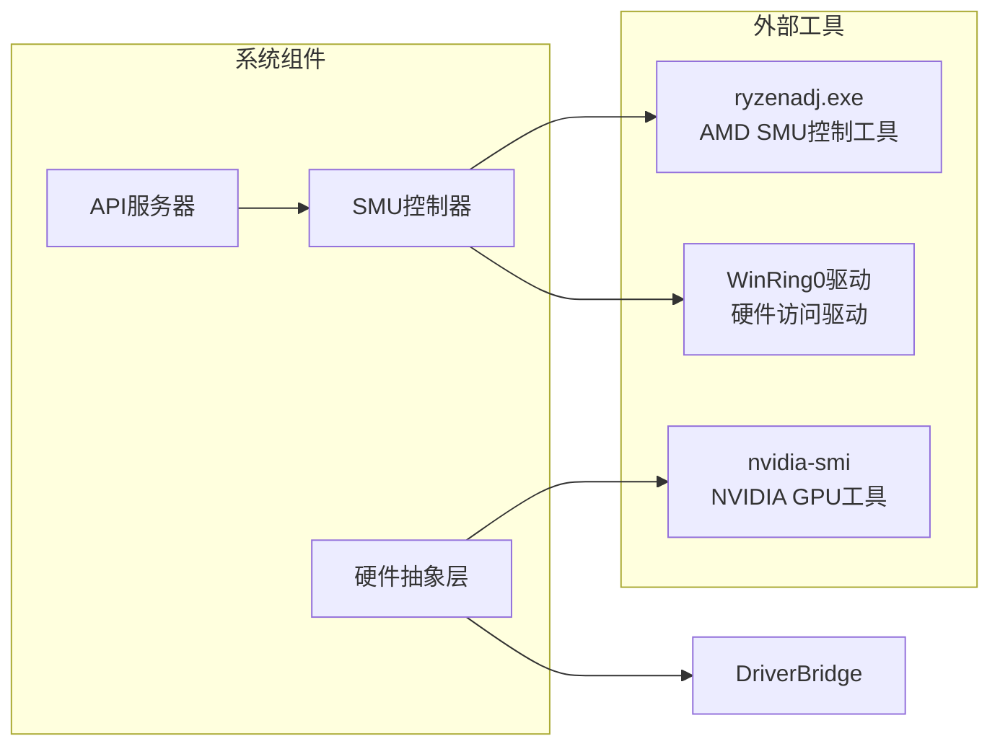
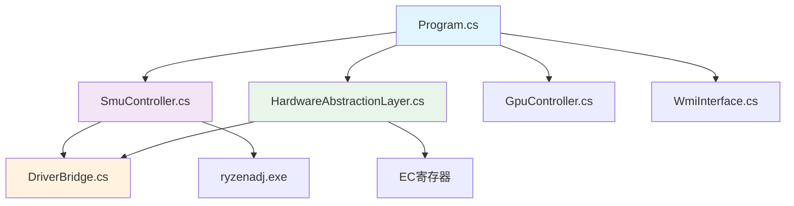

# SMU控制器API

<cite>
**本文档引用的文件**
- [SmuController.cs](file://server/hal/SmuController.cs)
- [Program.cs](file://server/api/Program.cs)
- [HardwareAbstractionLayer.cs](file://server/hal/HardwareAbstractionLayer.cs)
- [DriverBridge.cs](file://server/hal/DriverBridge.cs)
- [Douzhanzhe.API.csproj](file://server/api/Douzhanzhe.API.csproj)
- [dev-api.md](file://docs/dev-api.md)
- [dev-backend.md](file://docs/dev-backend.md)
</cite>

## 目录
1. [简介](#简介)
2. [项目结构](#项目结构)
3. [核心组件](#核心组件)
4. [架构概览](#架构概览)
5. [详细组件分析](#详细组件分析)
6. [依赖关系分析](#依赖关系分析)
7. [性能考虑](#性能考虑)
8. [故障排除指南](#故障排除指南)
9. [结论](#结论)
10. [附录](#附录)

## 简介

DOUZHANZHE-Control项目中的SMU控制器API为AMD System Management Unit（系统管理单元）提供了专业的控制接口。该API允许用户对AMD处理器进行精细化的功耗管理、温度控制和频率限制等操作。

SMU控制器通过子进程调用ryzenadj.exe工具来实现对AMD处理器的底层控制，支持多种性能调优场景，包括CPU功耗限制、温度墙设置、频率限制等关键参数的配置。

## 项目结构

该项目采用分层架构设计，主要包含以下核心模块：



**图表来源**
- [Program.cs:1-783](file://server/api/Program.cs#L1-L783)
- [SmuController.cs:1-142](file://server/hal/SmuController.cs#L1-L142)
- [HardwareAbstractionLayer.cs:1-772](file://server/hal/HardwareAbstractionLayer.cs#L1-L772)

**章节来源**
- [Program.cs:1-783](file://server/api/Program.cs#L1-L783)
- [Douzhanzhe.API.csproj:1-40](file://server/api/Douzhanzhe.API.csproj#L1-L40)

## 核心组件

### SMU控制器核心功能

SMU控制器提供了完整的AMD处理器控制能力，主要包括：

#### 功率管理
- **长时功耗限制** (`stapm_limit`, `power_limit`): 设置CPU长期功耗墙，单位为毫瓦
- **短时功耗限制** (`short_power_limit`): 设置CPU短期功耗墙
- **VRM电流限制**: 当前版本不支持

#### 温度控制
- **温度墙设置** (`tctl_temp`, `temp_limit`): 设置CPU温度上限，单位为摄氏度

#### 频率调节
- **频率限制** (`cpu_freq_limit`): 设置CPU最大频率限制，单位为MHz
- **睿频控制** (`turbo_disable`): 启用/禁用睿频功能

#### 电压优化
- **曲线优化器** (`co_all`): 设置全核电压偏移，单位为毫伏（负值表示降压）

**章节来源**
- [SmuController.cs:61-95](file://server/hal/SmuController.cs#L61-L95)
- [Program.cs:238-274](file://server/api/Program.cs#L238-L274)

## 架构概览

SMU控制器采用子进程架构，通过外部工具实现对硬件的直接控制：



**图表来源**
- [Program.cs:238-274](file://server/api/Program.cs#L238-L274)
- [SmuController.cs:43-57](file://server/hal/SmuController.cs#L43-L57)

### 硬件抽象层架构



**图表来源**
- [HardwareAbstractionLayer.cs:19-772](file://server/hal/HardwareAbstractionLayer.cs#L19-L772)
- [DriverBridge.cs:9-150](file://server/hal/DriverBridge.cs#L9-L150)
- [SmuController.cs:12-142](file://server/hal/SmuController.cs#L12-L142)

**章节来源**
- [HardwareAbstractionLayer.cs:19-772](file://server/hal/HardwareAbstractionLayer.cs#L19-L772)
- [DriverBridge.cs:9-150](file://server/hal/DriverBridge.cs#L9-L150)

## 详细组件分析

### SMU控制器类分析

SMU控制器是整个系统的核心组件，负责与外部ryzenadj工具交互以实现对AMD处理器的控制。

#### 主要方法功能

| 方法名称 | 参数 | 功能描述 | 返回值 |
|---------|------|----------|--------|
| `SetPowerLimit` | `uint mW` | 设置长时功耗限制 | 0表示成功，其他值表示错误代码 |
| `SetTempLimit` | `uint celsius` | 设置温度墙 | 0表示成功，其他值表示错误代码 |
| `SetShortPowerLimit` | `uint fastMw, uint slowMw` | 设置短时功耗限制 | 0表示成功，其他值表示错误代码 |
| `SetCurveOptimizer` | `int mV` | 设置电压偏移 | 0表示成功，其他值表示错误代码 |
| `SetCpuFreqLimit` | `uint mhz` | 设置频率限制 | 0表示成功，其他值表示错误代码 |
| `SetTurboDisabled` | `bool disabled` | 禁用/启用睿频 | 0表示成功，其他值表示错误代码 |
| `Probe` | 无 | 探测SMU连接状态 | `true`表示可用，`false`表示不可用 |
| `GetCapabilities` | 无 | 获取支持的能力列表 | 对象包含各项功能支持状态 |

#### 参数处理流程



**图表来源**
- [Program.cs:238-274](file://server/api/Program.cs#L238-L274)
- [SmuController.cs:61-95](file://server/hal/SmuController.cs#L61-L95)

**章节来源**
- [SmuController.cs:43-95](file://server/hal/SmuController.cs#L43-L95)
- [Program.cs:238-274](file://server/api/Program.cs#L238-L274)

### API端点详细说明

#### POST /api/smu/set - SMU参数设置

**请求体格式**:
```json
{
  "parameter": "string",
  "valueM": "number"
}
```

**支持的参数**:

| 参数名 | 值类型 | 描述 | 单位 | 示例 |
|--------|--------|------|------|------|
| `stapm_limit` | 数字 | 长时功耗限制 | 毫瓦 | 65000 |
| `power_limit` | 数字 | 功耗限制别名 | 毫瓦 | 65000 |
| `short_power_limit` | 数字 | 短时功耗限制 | 毫瓦 | 75000 |
| `tctl_temp` | 数字 | 温度限制 | 摄氏度 | 90 |
| `temp_limit` | 数字 | 温度限制别名 | 摄氏度 | 85 |
| `co_all` | 数字 | 电压偏移 | 毫伏 | -20 |
| `cpu_freq_limit` | 数字 | 频率限制 | 兆赫 | 3000 |
| `turbo_disable` | 数字 | 睿频控制 | 0/1 | 1 |

**响应格式**:
```json
{
  "ok": true,
  "rc": 0
}
```

#### GET /api/smu/probe - SMU连接探测

**响应格式**:
```json
{
  "ok": true,
  "source": "ryzenadj"
}
```

#### GET /api/smu/status - SMU状态查询

**响应格式**:
```json
{
  "ok": true,
  "probe": true,
  "source": "ryzenadj",
  "capabilities": {
    "powerLimit": true,
    "tempLimit": true,
    "shortPowerLimit": true,
    "curveOptimizer": true,
    "cpuFreqLimit": true,
    "turboDisabled": true,
    "probe": true,
    "vrmCurrent": false,
    "rawCommand": false,
    "readRegister": false
  }
}
```

**章节来源**
- [Program.cs:238-327](file://server/api/Program.cs#L238-L327)
- [dev-api.md:55-80](file://docs/dev-api.md#L55-L80)

### 硬件抽象层集成

硬件抽象层提供了统一的硬件访问接口，确保SMU控制器能够正确地与底层硬件交互：

#### EC寄存器映射

| 寄存器偏移 | 名称 | 功能 |
|------------|------|------|
| `0x28` | `OFF_SMPR` | SMU命令寄存器 |
| `0x29` | `OFF_SMST` | SMU状态寄存器 |
| `0x2A` | `OFF_SMAD` | SMU地址寄存器 |
| `0x2C` | `OFF_SDAT` | SMU数据寄存器 |

#### 驱动桥接功能

DriverBridge类提供了对硬件的直接访问能力：

- **物理内存访问**: `ReadPhys()`, `WritePhys()`
- **EC协议访问**: `ReadEc()`, `WriteEc()`
- **I/O端口访问**: `ReadIo()`, `WriteIo()`
- **位操作**: `WriteBit()`

**章节来源**
- [HardwareAbstractionLayer.cs:383-392](file://server/hal/HardwareAbstractionLayer.cs#L383-L392)
- [DriverBridge.cs:66-137](file://server/hal/DriverBridge.cs#L66-L137)

## 依赖关系分析

### 外部依赖



**图表来源**
- [Program.cs:692-723](file://server/api/Program.cs#L692-L723)
- [Douzhanzhe.API.csproj:24-25](file://server/api/Douzhanzhe.API.csproj#L24-L25)

### 内部依赖关系



**图表来源**
- [Program.cs:1-17](file://server/api/Program.cs#L1-L17)
- [SmuController.cs:1-142](file://server/hal/SmuController.cs#L1-L142)

**章节来源**
- [Program.cs:1-17](file://server/api/Program.cs#L1-L17)
- [SmuController.cs:1-142](file://server/hal/SmuController.cs#L1-L142)

## 性能考虑

### 执行效率

SMU控制器的性能主要受以下因素影响：

1. **子进程启动开销**: 每次调用都会启动新的ryzenadj进程
2. **硬件响应时间**: 取决于主板和BIOS的实现
3. **参数验证**: 在API层进行参数范围检查

### 内存管理

- 使用`using`语句确保Process对象正确释放
- 避免在高频调用中创建大量临时对象
- 合理使用缓冲区大小（如4096字节的WebSocket缓冲区）

### 并发处理

API服务器支持并发请求处理，但需要注意：
- SMU操作具有原子性，避免同时修改同一参数
- 频繁的参数变更可能导致系统不稳定
- 建议添加适当的请求节流机制

## 故障排除指南

### 常见问题及解决方案

#### 1. SMU控制不可用

**症状**: `GET /api/smu/probe` 返回 `{"ok": false}`

**可能原因**:
- ryzenadj.exe未找到或权限不足
- WinRing0驱动未正确加载
- 硬件不支持SMU控制

**解决步骤**:
1. 检查ryzenadj.exe是否存在且可执行
2. 以管理员权限运行应用程序
3. 验证WinRing0驱动状态
4. 使用PCI探测确认AMD硬件支持

#### 2. 参数设置失败

**症状**: `POST /api/smu/set` 返回 `{"ok": false, "error": "..."}`

**可能原因**:
- 参数值超出硬件支持范围
- 硬件处于保护状态
- 权限不足

**解决步骤**:
1. 检查参数范围是否符合硬件规格
2. 确认系统满足最低要求
3. 重新启动应用程序获取新权限

#### 3. 驱动加载失败

**症状**: 控制台输出"Driver not loaded, attempting to install..."

**解决步骤**:
1. 手动安装WinRing0驱动
2. 检查系统兼容性
3. 重启系统后重试

**章节来源**
- [Program.cs:692-723](file://server/api/Program.cs#L692-L723)
- [dev-backend.md:286-292](file://docs/dev-backend.md#L286-L292)

### 错误代码参考

| 错误代码 | 描述 | 可能原因 |
|----------|------|----------|
| `-1` | 进程启动失败 | 文件不存在或权限不足 |
| `-1073741819` | 0xC0000005异常 | ryzenadj写入成功但退出时崩溃 |
| `1` | 参数无效 | 参数格式或范围错误 |
| 其他正数 | 执行失败 | 硬件或驱动问题 |

## 结论

DOUZHANZHE-Control项目的SMU控制器API为AMD处理器提供了专业而灵活的控制接口。通过子进程架构和硬件抽象层的结合，实现了对功耗、温度、频率等关键参数的精确控制。

### 主要优势

1. **功能完整**: 支持主流的SMU控制参数
2. **易于使用**: 提供简洁的REST API接口
3. **安全可靠**: 包含参数验证和错误处理机制
4. **扩展性强**: 模块化设计便于功能扩展

### 适用场景

- **性能调优**: 通过功耗和温度限制优化系统稳定性
- **散热控制**: 在高负载下维持合理的温度水平
- **能耗管理**: 在移动设备上延长电池续航时间
- **系统监控**: 结合遥测数据进行实时调整

### 局限性

- 需要管理员权限运行
- 依赖外部工具和驱动
- 参数设置具有一定的风险性
- 不同硬件平台支持程度不同

## 附录

### API使用示例

#### CPU功耗限制设置
```javascript
// 设置长时功耗为65W
fetch('/api/smu/set', {
  method: 'POST',
  headers: {'Content-Type': 'application/json'},
  body: JSON.stringify({
    parameter: 'power_limit',
    valueM: 65000
  })
})
```

#### 温度墙设置
```javascript
// 设置温度墙为85°C
fetch('/api/smu/set', {
  method: 'POST',
  headers: {'Content-Type': 'application/json'},
  body: JSON.stringify({
    parameter: 'temp_limit',
    valueM: 85
  })
})
```

#### 频率限制设置
```javascript
// 设置频率限制为4.0GHz
fetch('/api/smu/set', {
  method: 'POST',
  headers: {'Content-Type': 'application/json'},
  body: JSON.stringify({
    parameter: 'cpu_freq_limit',
    valueM: 4000
  })
})
```

#### 睿频控制
```javascript
// 禁用睿频
fetch('/api/smu/set', {
  method: 'POST',
  headers: {'Content-Type': 'application/json'},
  body: JSON.stringify({
    parameter: 'turbo_disable',
    valueM: 1
  })
})
```

### 安全注意事项

1. **权限要求**: 必须以管理员权限运行，否则无法访问硬件
2. **参数验证**: 始终验证输入参数的有效性和安全性
3. **渐进调整**: 建议逐步调整参数，避免激进的改变
4. **监控反馈**: 结合遥测数据监控系统状态
5. **备份恢复**: 在重要参数调整前做好系统备份

### 风险提示

- **硬件损坏风险**: 错误的参数设置可能导致硬件损坏
- **系统不稳定**: 过度限制可能影响系统正常运行
- **温度过高**: 温度限制设置过低可能导致性能下降
- **功耗异常**: 功耗限制不当可能影响电池续航或散热效果