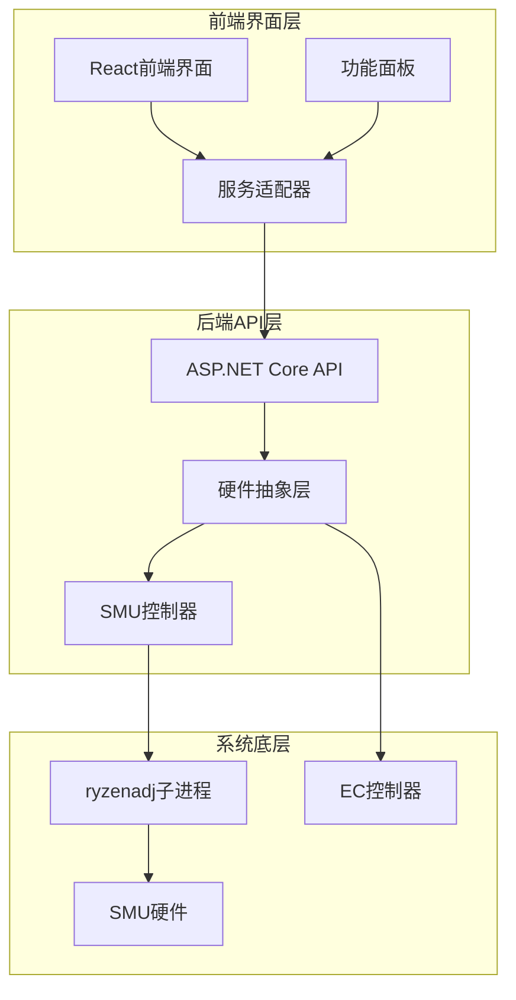
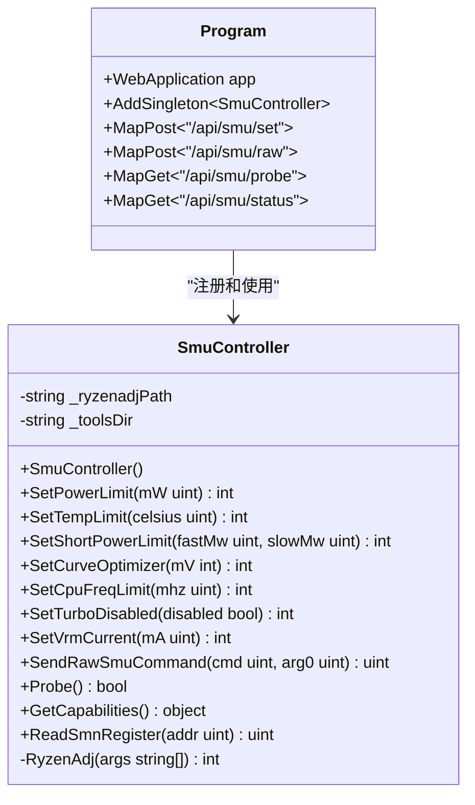
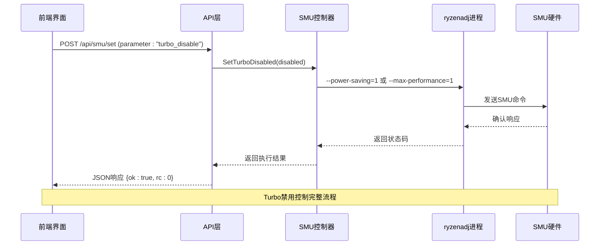
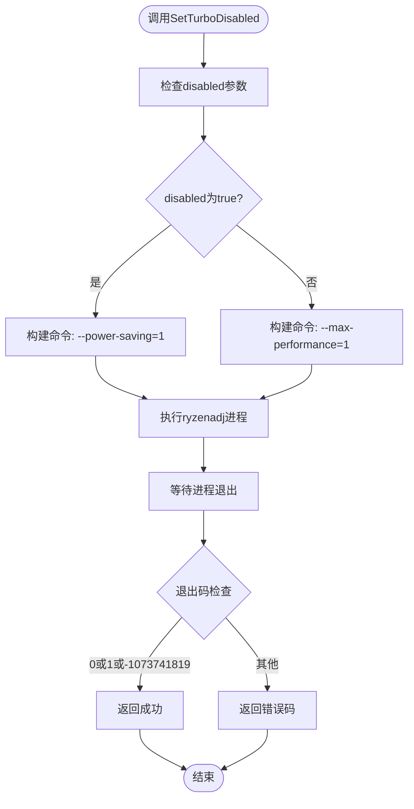
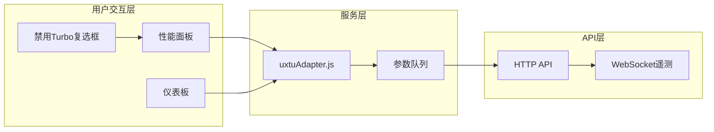
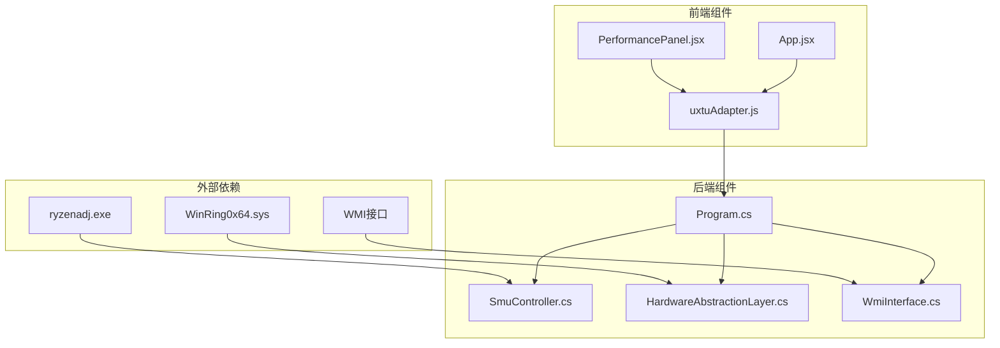
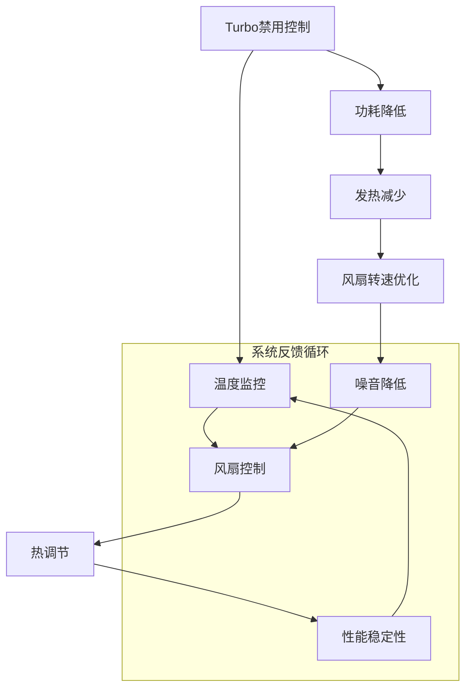

# Turbo禁用控制

<cite>
**本文档引用的文件**
- [SmuController.cs](file://server/hal/SmuController.cs)
- [Program.cs](file://server/api/Program.cs)
- [HardwareAbstractionLayer.cs](file://server/hal/HardwareAbstractionLayer.cs)
- [uxtuAdapter.js](file://src/services/uxtuAdapter.js)
- [PerformancePanel.jsx](file://src/components/panels/PerformancePanel.jsx)
- [App.jsx](file://src/App.jsx)
- [custom-params.json](file://server/api/config/custom-params.json)
</cite>

## 目录
1. [简介](#简介)
2. [项目结构](#项目结构)
3. [核心组件](#核心组件)
4. [架构概览](#架构概览)
5. [详细组件分析](#详细组件分析)
6. [依赖关系分析](#依赖关系分析)
7. [性能考量](#性能考量)
8. [故障排除指南](#故障排除指南)
9. [结论](#结论)
10. [附录](#附录)

## 简介

本文档详细说明了SMU Turbo禁用控制接口的实现和使用方法。SMU（System Management Unit）是AMD平台上的系统管理单元，负责CPU的电源管理、频率控制等功能。Turbo Boost技术允许CPU在特定条件下超频运行，但某些应用场景需要稳定的性能输出。

该系统通过ryzenadj子进程与SMU进行通信，实现了对CPU Turbo Boost的精确控制。文档涵盖了SetTurboDisabled功能的技术原理、实现方法、Power Saving和Max Performance两种模式的区别，以及实际使用场景和注意事项。

## 项目结构

项目采用前后端分离的架构设计：



**图表来源**
- [Program.cs:1-15](file://server/api/Program.cs#L1-L15)
- [SmuController.cs:12-41](file://server/hal/SmuController.cs#L12-L41)

**章节来源**
- [Program.cs:1-783](file://server/api/Program.cs#L1-L783)
- [SmuController.cs:1-142](file://server/hal/SmuController.cs#L1-L142)

## 核心组件

### SMU控制器组件

SMU控制器是整个Turbo禁用功能的核心组件，负责与ryzenadj子进程通信并执行具体的SMU命令。



**图表来源**
- [SmuController.cs:12-95](file://server/hal/SmuController.cs#L12-L95)
- [Program.cs:10-14](file://server/api/Program.cs#L10-L14)

### 硬件抽象层组件

硬件抽象层提供了统一的硬件访问接口，屏蔽了底层EC寄存器和SMU通信的复杂性。

**章节来源**
- [SmuController.cs:1-142](file://server/hal/SmuController.cs#L1-L142)
- [HardwareAbstractionLayer.cs:19-772](file://server/hal/HardwareAbstractionLayer.cs#L19-L772)

## 架构概览

系统采用分层架构设计，确保了功能的模块化和可维护性：



**图表来源**
- [Program.cs:238-274](file://server/api/Program.cs#L238-L274)
- [SmuController.cs:90-95](file://server/hal/SmuController.cs#L90-L95)

## 详细组件分析

### SetTurboDisabled功能实现

SetTurboDisabled方法是Turbo禁用控制的核心实现，它通过ryzenadj工具与SMU硬件直接通信。

#### 技术原理

Turbo Boost技术的工作原理基于以下机制：
- **动态频率调整**：根据负载和散热条件动态提升CPU频率
- **功率预算管理**：通过PPM（Package Power Model）限制总功耗
- **温度监控**：实时监控CPU温度，防止过热损坏
- **电压调节**：通过降低电压来控制功耗和发热

#### 实现细节



**图表来源**
- [SmuController.cs:90-95](file://server/hal/SmuController.cs#L90-L95)

#### 参数映射关系

| 参数值 | 对应命令 | 功能描述 |
|--------|----------|----------|
| true | `--power-saving=1` | 启用Power Saving模式，禁用Turbo Boost |
| false | `--max-performance=1` | 启用Max Performance模式，启用Turbo Boost |

**章节来源**
- [SmuController.cs:90-95](file://server/hal/SmuController.cs#L90-L95)
- [Program.cs:262-264](file://server/api/Program.cs#L262-L264)

### Power Saving vs Max Performance模式

两种模式在Turbo Boost控制方面有根本性的区别：

#### Power Saving模式 (`--power-saving=1`)
- **禁用Turbo Boost**：完全关闭动态超频功能
- **稳定性能输出**：提供一致的性能表现
- **降低功耗**：减少峰值功耗和发热
- **延长电池续航**：在笔记本设备上特别有效

#### Max Performance模式 (`--max-performance=1`)
- **启用Turbo Boost**：允许CPU在条件满足时超频
- **最大化性能**：获得最高的瞬时性能
- **增加功耗**：峰值功耗和发热更高
- **可能产生噪音**：风扇需要更积极地散热

### 前端集成实现

前端通过多种方式集成了Turbo禁用控制功能：



**图表来源**
- [PerformancePanel.jsx:84-90](file://src/components/panels/PerformancePanel.jsx#L84-L90)
- [uxtuAdapter.js:121-129](file://src/services/uxtuAdapter.js#L121-L129)

**章节来源**
- [PerformancePanel.jsx:1-213](file://src/components/panels/PerformancePanel.jsx#L1-L213)
- [uxtuAdapter.js:1-130](file://src/services/uxtuAdapter.js#L1-L130)

## 依赖关系分析

系统各组件之间的依赖关系如下：



**图表来源**
- [Program.cs:10-14](file://server/api/Program.cs#L10-L14)
- [SmuController.cs:17-41](file://server/hal/SmuController.cs#L17-L41)

**章节来源**
- [Program.cs:1-783](file://server/api/Program.cs#L1-L783)
- [SmuController.cs:1-142](file://server/hal/SmuController.cs#L1-L142)

## 性能考量

### Turbo禁用对系统性能的影响

#### 性能波动性影响
- **稳定性提升**：禁用Turbo Boost后，CPU频率更加稳定，减少了性能波动
- **平均性能变化**：在轻负载情况下可能略有下降，在重负载情况下可能保持更稳定的峰值
- **可预测性增强**：对于需要稳定性能的应用程序（如服务器、实时系统）非常有利

#### 能耗影响
- **功耗降低**：禁用Turbo Boost通常能降低峰值功耗约10-20%
- **发热减少**：CPU温度曲线更加平滑，温升幅度减小
- **电池续航**：在移动设备上可显著延长电池使用时间

### 散热系统协调

Turbo禁用控制需要与散热系统协调工作：



**章节来源**
- [HardwareAbstractionLayer.cs:147-229](file://server/hal/HardwareAbstractionLayer.cs#L147-L229)

## 故障排除指南

### 常见问题及解决方案

#### 1. SMU控制不可用
**症状**：`/api/smu/status`返回probe=false
**原因**：
- ryzenadj.exe文件缺失
- WinRing0驱动未正确加载
- 权限不足

**解决方案**：
- 确保ryzenadj.exe存在于tools目录
- 检查WinRing0x64.sys是否存在
- 以管理员权限运行应用程序

#### 2. Turbo禁用设置失败
**症状**：API返回错误码非0
**原因**：
- SMU硬件不支持该功能
- ryzenadj版本不兼容
- 系统权限不足

**解决方案**：
- 检查硬件兼容性
- 更新ryzenadj到最新版本
- 确认具有必要的系统权限

#### 3. 前端界面无响应
**症状**：点击禁用Turbo按钮无反应
**原因**：
- WebSocket连接失败
- API服务未启动
- 网络代理配置问题

**解决方案**：
- 检查C# HAL服务是否运行
- 验证WebSocket端口3100可用
- 检查防火墙设置

**章节来源**
- [Program.cs:692-723](file://server/api/Program.cs#L692-L723)
- [SmuController.cs:103-121](file://server/hal/SmuController.cs#L103-L121)

## 结论

SMU Turbo禁用控制接口提供了对CPU Turbo Boost功能的精确控制能力。通过ryzenadj子进程与SMU硬件的直接通信，系统实现了稳定可靠的Turbo禁用/启用功能。

### 主要优势
1. **精确控制**：通过SMU寄存器直接控制，精度高
2. **稳定性能**：禁用Turbo Boost后提供一致的性能输出
3. **易于集成**：RESTful API设计，便于前端集成
4. **多场景支持**：适用于服务器、工作站、笔记本等多种设备

### 适用场景
- **服务器环境**：需要稳定性能输出，避免性能波动
- **办公环境**：追求安静运行，降低风扇噪音
- **电池供电设备**：延长续航时间
- **实时系统**：需要可预测的性能表现

### 技术建议
- 在生产环境中建议保留Turbo Boost功能，仅在特殊需求时禁用
- 定期监控系统温度和功耗，确保散热系统正常工作
- 结合其他电源管理策略，实现最佳的整体性能平衡

## 附录

### 使用示例

#### 1. 禁用Turbo Boost
```javascript
// 前端调用示例
await applySmuSet("turbo_disable", 1);

// 直接API调用
fetch('/api/smu/set', {
    method: 'POST',
    headers: {'Content-Type': 'application/json'},
    body: JSON.stringify({
        parameter: 'turbo_disable',
        valueM: 1
    })
});
```

#### 2. 启用Turbo Boost
```javascript
// 前端调用示例
await applySmuSet("turbo_disable", 0);

// 直接API调用
fetch('/api/smu/set', {
    method: 'POST',
    headers: {'Content-Type': 'application/json'},
    body: JSON.stringify({
        parameter: 'turbo_disable',
        valueM: 0
    })
});
```

#### 3. 模式预设应用
```javascript
// 应用预设配置
const payload = {
    chipset: "Ryzen 9 8940HX",
    profile: "silent",
    params: {
        cpuTurboDisabled: true,
        cpuTempLimitC: 75,
        cpuLongPptW: 35,
        cpuShortPptW: 45
    }
};

await applyUxtuLimits(payload);
```

**章节来源**
- [uxtuAdapter.js:119-129](file://src/services/uxtuAdapter.js#L119-L129)
- [App.jsx:112-121](file://src/App.jsx#L112-L121)