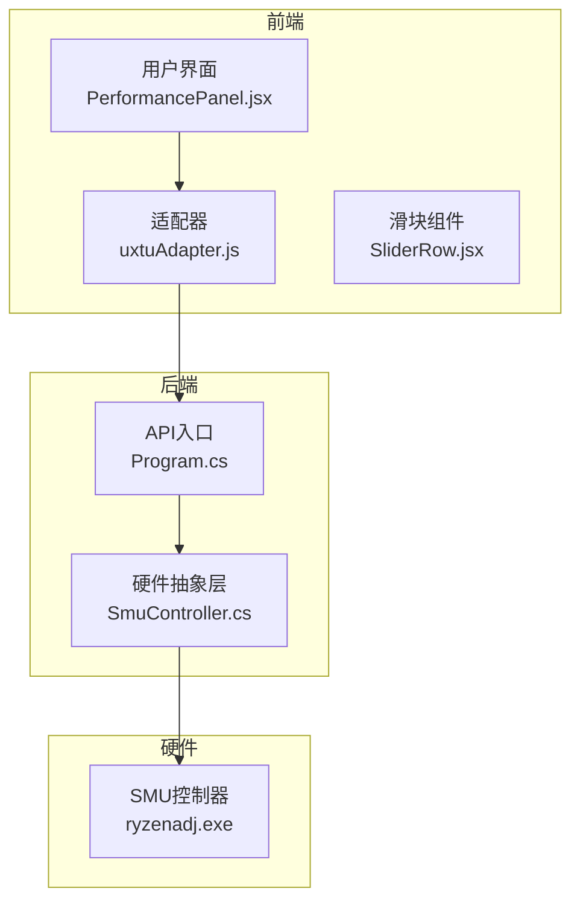
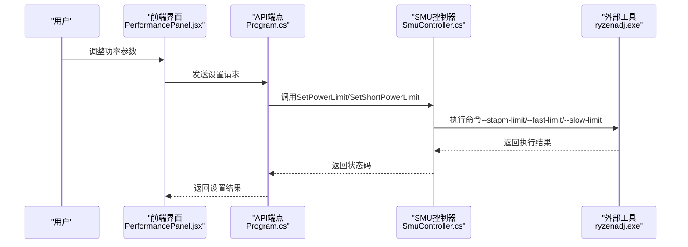
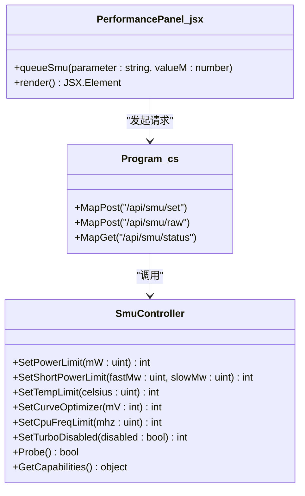
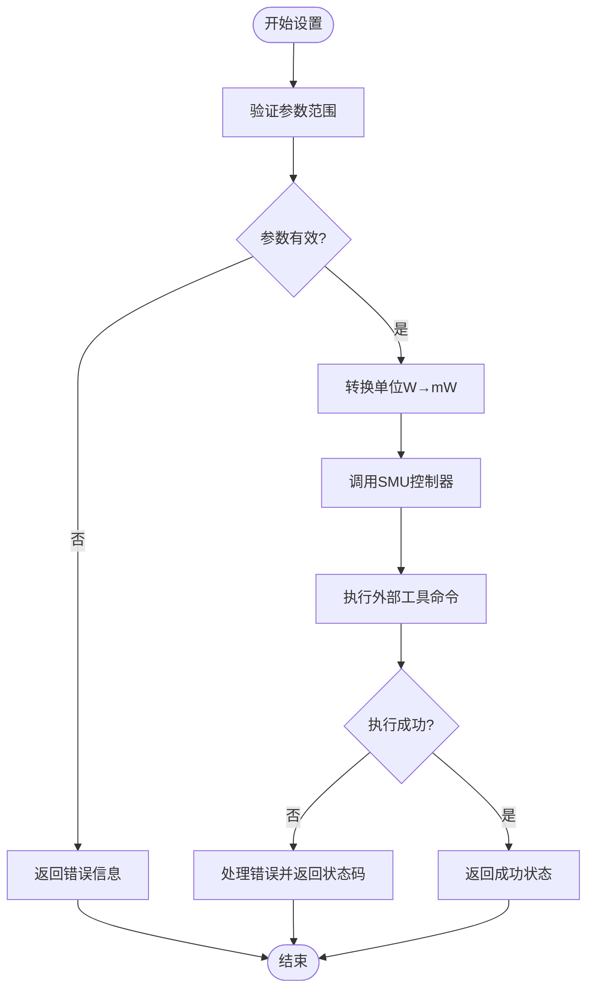
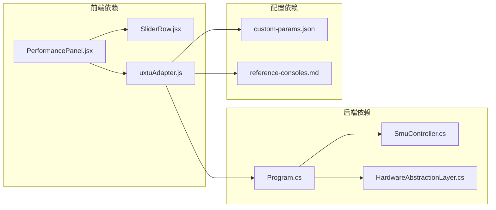

# 功率控制接口

<cite>
**本文档引用的文件**
- [Program.cs](file://server/api/Program.cs)
- [SmuController.cs](file://server/hal/SmuController.cs)
- [PerformancePanel.jsx](file://src/components/panels/PerformancePanel.jsx)
- [uxtuAdapter.js](file://src/services/uxtuAdapter.js)
- [custom-params.json](file://server/api/config/custom-params.json)
- [HardwareAbstractionLayer.cs](file://server/hal/HardwareAbstractionLayer.cs)
- [SliderRow.jsx](file://src/components/ui/SliderRow.jsx)
- [reference-consoles.md](file://docs/reference-consoles.md)
</cite>

## 目录
1. [简介](#简介)
2. [项目结构](#项目结构)
3. [核心组件](#核心组件)
4. [架构概览](#架构概览)
5. [详细组件分析](#详细组件分析)
6. [依赖关系分析](#依赖关系分析)
7. [性能考虑](#性能考虑)
8. [故障排除指南](#故障排除指南)
9. [结论](#结论)
10. [附录](#附录)

## 简介
本文件为SMU功率控制接口的详细技术文档，重点说明SetPowerLimit、SetShortPowerLimit等功率限制设置方法，涵盖STAPM、Fast、Slow功率限制的含义与应用场景，记录功率值单位转换（毫瓦到瓦）、有效取值范围与默认值，并提供CPU功耗限制的实际使用示例（游戏模式、办公模式等），解释功率限制对系统性能与电池续航的影响，以及安全限制与错误处理机制。

## 项目结构
该功率控制系统采用前后端分离架构：
- 前端（React）：提供用户界面与参数调整，通过HTTP API与后端通信
- 后端（.NET）：提供REST API，封装SMU控制逻辑并通过ryzenadj.exe执行底层操作
- 硬件抽象层（HAL）：封装与硬件交互的具体实现



**图表来源**
- [Program.cs:238-274](file://server/api/Program.cs#L238-L274)
- [SmuController.cs:12-41](file://server/hal/SmuController.cs#L12-L41)
- [PerformancePanel.jsx:1-134](file://src/components/panels/PerformancePanel.jsx#L1-L134)

**章节来源**
- [Program.cs:238-274](file://server/api/Program.cs#L238-L274)
- [SmuController.cs:12-41](file://server/hal/SmuController.cs#L12-L41)
- [PerformancePanel.jsx:1-134](file://src/components/panels/PerformancePanel.jsx#L1-L134)

## 核心组件
本系统围绕以下核心组件构建：

- **SMU控制器（SmuController）**：封装与SMU交互的逻辑，负责调用外部工具执行功率限制设置
- **API入口（Program.cs）**：提供REST端点，接收前端请求并调用SMU控制器
- **前端面板（PerformancePanel.jsx）**：提供用户界面，允许调整功率限制参数
- **参数适配器（uxtuAdapter.js）**：管理模式预设与参数应用流程
- **硬件抽象层（HardwareAbstractionLayer.cs）**：提供Windows电源计划等系统级控制能力

**章节来源**
- [SmuController.cs:12-142](file://server/hal/SmuController.cs#L12-L142)
- [Program.cs:238-274](file://server/api/Program.cs#L238-L274)
- [PerformancePanel.jsx:1-134](file://src/components/panels/PerformancePanel.jsx#L1-L134)
- [uxtuAdapter.js:109-115](file://src/services/uxtuAdapter.js#L109-L115)
- [HardwareAbstractionLayer.cs:94-119](file://server/hal/HardwareAbstractionLayer.cs#L94-L119)

## 架构概览
系统采用分层架构，从前端到后端再到硬件的清晰分层设计，确保了功能模块的职责分离与可维护性。



**图表来源**
- [Program.cs:238-274](file://server/api/Program.cs#L238-L274)
- [SmuController.cs:61-95](file://server/hal/SmuController.cs#L61-L95)
- [PerformancePanel.jsx:21-27](file://src/components/panels/PerformancePanel.jsx#L21-L27)

**章节来源**
- [Program.cs:238-274](file://server/api/Program.cs#L238-L274)
- [SmuController.cs:43-95](file://server/hal/SmuController.cs#L43-L95)
- [PerformancePanel.jsx:21-27](file://src/components/panels/PerformancePanel.jsx#L21-L27)

## 详细组件分析

### SMU功率限制设置方法

#### SetPowerLimit（STAPM功率限制）
- **功能**：设置CPU长期（STAPM）功率限制，同时影响快速与慢速功率限制
- **参数**：接受毫瓦（mW）作为输入，内部转换为SMU期望的单位
- **调用链**：前端滑块 -> API端点 -> SMU控制器 -> 外部工具
- **返回值**：0表示成功，非0表示失败；包含特定崩溃情况的兼容处理

#### SetShortPowerLimit（短时功率限制）
- **功能**：独立设置CPU短时（Fast/Slow）功率限制，支持快慢限制分别配置
- **参数**：接受毫瓦（mW）作为输入，分别设置快速与慢速限制
- **应用场景**：应对突发负载时的瞬时功率峰值控制



**图表来源**
- [SmuController.cs:61-95](file://server/hal/SmuController.cs#L61-L95)
- [Program.cs:238-274](file://server/api/Program.cs#L238-L274)
- [PerformancePanel.jsx:21-27](file://src/components/panels/PerformancePanel.jsx#L21-L27)

**章节来源**
- [SmuController.cs:61-95](file://server/hal/SmuController.cs#L61-L95)
- [Program.cs:238-274](file://server/api/Program.cs#L238-L274)
- [PerformancePanel.jsx:21-27](file://src/components/panels/PerformancePanel.jsx#L21-L27)

### STAPM、Fast、Slow功率限制详解

#### STAPM（长期功率限制）
- **含义**：系统长期平均功率限制，用于维持稳定的功耗水平
- **应用场景**：日常办公、轻度游戏、续航优先模式
- **典型范围**：15W-120W（根据硬件能力调整）

#### Fast（快速功率限制）
- **含义**：短时间内的功率峰值限制，通常用于应对突发负载
- **应用场景**：游戏开启动画、视频编码、编译任务
- **典型范围**：15W-140W（高于STAPM但持续时间较短）

#### Slow（慢速功率限制）
- **含义**：介于STAPM和Fast之间的功率限制，平衡长期稳定与短期峰值
- **应用场景**：中等强度工作负载、多任务处理
- **典型范围**：15W-140W

**章节来源**
- [Program.cs:247-250](file://server/api/Program.cs#L247-L250)
- [reference-consoles.md:135-136](file://docs/reference-consoles.md#L135-L136)

### 单位转换与取值范围

#### 单位转换
- **输入单位**：前端滑块以瓦（W）为单位
- **内部转换**：API层将瓦转换为毫瓦（mW）传递给SMU控制器
- **转换公式**：mW = W × 1000

#### 有效取值范围
- **STAPM/功率限制**：15W-120W（对应15000mW-120000mW）
- **短时功率限制**：15W-140W（对应15000mW-140000mW）
- **温度限制**：60°C-100°C
- **电压调节**：-30mV-0mV

#### 默认值
- **STAPM默认值**：55W（来自自定义参数配置）
- **短时默认值**：70W（来自自定义参数配置）
- **温度默认值**：80°C（来自自定义参数配置）
- **电压默认值**：-18mV（来自自定义参数配置）

**章节来源**
- [Program.cs:247-250](file://server/api/Program.cs#L247-L250)
- [custom-params.json:9-10](file://server/api/config/custom-params.json#L9-L10)
- [custom-params.json](file://server/api/config/custom-params.json#L5)
- [custom-params.json](file://server/api/config/custom-params.json#L8)

### 实际使用示例

#### 游戏模式配置
```json
{
  "cpuTempLimitC": 95,
  "cpuLongPptW": 120,
  "cpuShortPptW": 140,
  "cpuVoltageOffset": 0,
  "cpuFreqLimitEnabled": false,
  "cpuFreqLimitMhz": 5500,
  "cpuTurboDisabled": false,
  "gpuPptLimitW": 115,
  "gpuTempLimitC": 95,
  "fanLargeRpmTarget": 4300,
  "fanSmallRpmTarget": 8000
}
```

#### 办公模式配置
```json
{
  "cpuTempLimitC": 80,
  "cpuLongPptW": 55,
  "cpuShortPptW": 70,
  "cpuVoltageOffset": 0,
  "cpuFreqLimitEnabled": false,
  "cpuFreqLimitMhz": 4500,
  "cpuTurboDisabled": false,
  "gpuPptLimitW": 75,
  "gpuTempLimitC": 85,
  "fanLargeRpmTarget": 2900,
  "fanSmallRpmTarget": 6400
}
```

#### 最高能效模式配置
```json
{
  "cpuTempLimitC": 75,
  "cpuLongPptW": 35,
  "cpuShortPptW": 45,
  "cpuVoltageOffset": 0,
  "cpuFreqLimitEnabled": false,
  "cpuFreqLimitMhz": 3000,
  "cpuTurboDisabled": false,
  "gpuPptLimitW": 60,
  "gpuTempLimitC": 75,
  "fanLargeRpmTarget": 2200,
  "fanSmallRpmTarget": 2000
}
```

**章节来源**
- [uxtuAdapter.js:109-115](file://src/services/uxtuAdapter.js#L109-L115)
- [custom-params.json:1-22](file://server/api/config/custom-params.json#L1-L22)

### 功率限制对系统性能与电池续航的影响

#### 性能影响
- **STAPM限制过低**：可能导致CPU降频，影响峰值性能
- **短时限制过高**：可能触发热节流，反而降低整体性能
- **温度限制**：直接影响热节流触发点，进而影响性能稳定性

#### 电池续航影响
- **功率限制越低**：电池续航时间越长，但性能相应下降
- **短时功率峰值**：短暂提升性能，但会加速电量消耗
- **温度控制**：合理的温度限制有助于延长设备寿命

**章节来源**
- [reference-consoles.md:122-137](file://docs/reference-consoles.md#L122-L137)

### 安全限制与错误处理机制

#### 错误处理
- **外部工具异常**：ryzenadj.exe执行失败时返回非零状态码
- **参数验证**：API层对输入参数进行基本验证与范围检查
- **兼容性处理**：特定崩溃情况（如写入成功后退出码异常）被视为成功

#### 安全限制
- **参数范围限制**：前端滑块限制在合理范围内
- **渐进式调整**：防抖机制避免频繁参数变更
- **温度保护**：温度限制防止过热损坏硬件



**图表来源**
- [Program.cs:238-274](file://server/api/Program.cs#L238-L274)
- [SmuController.cs:61-95](file://server/hal/SmuController.cs#L61-L95)

**章节来源**
- [Program.cs:238-274](file://server/api/Program.cs#L238-L274)
- [SmuController.cs:59-65](file://server/hal/SmuController.cs#L59-L65)

## 依赖关系分析



**图表来源**
- [PerformancePanel.jsx:1-134](file://src/components/panels/PerformancePanel.jsx#L1-L134)
- [SliderRow.jsx:1-22](file://src/components/ui/SliderRow.jsx#L1-L22)
- [uxtuAdapter.js:109-115](file://src/services/uxtuAdapter.js#L109-L115)
- [Program.cs:238-274](file://server/api/Program.cs#L238-L274)
- [SmuController.cs:12-41](file://server/hal/SmuController.cs#L12-L41)
- [HardwareAbstractionLayer.cs:94-119](file://server/hal/HardwareAbstractionLayer.cs#L94-L119)
- [custom-params.json:1-22](file://server/api/config/custom-params.json#L1-L22)
- [reference-consoles.md:122-137](file://docs/reference-consoles.md#L122-L137)

**章节来源**
- [PerformancePanel.jsx:1-134](file://src/components/panels/PerformancePanel.jsx#L1-L134)
- [Program.cs:238-274](file://server/api/Program.cs#L238-L274)
- [SmuController.cs:12-41](file://server/hal/SmuController.cs#L12-L41)
- [uxtuAdapter.js:109-115](file://src/services/uxtuAdapter.js#L109-L115)
- [custom-params.json:1-22](file://server/api/config/custom-params.json#L1-L22)

## 性能考虑
- **响应延迟**：外部工具执行存在固定延迟，前端采用防抖机制优化用户体验
- **参数更新频率**：滑块调整后延迟600ms批量应用，避免频繁系统调用
- **并发控制**：同一参数的多次调整会被合并为一次执行
- **资源占用**：SMU控制操作对系统资源占用极低，主要开销在外部工具调用

## 故障排除指南

### 常见问题与解决方案

#### 设置失败
- **症状**：返回错误状态码
- **原因**：参数超出硬件支持范围或外部工具执行失败
- **解决**：检查参数范围，确认硬件支持情况

#### 温度异常升高
- **症状**：CPU温度快速上升
- **原因**：功率限制设置过低导致降频不足
- **解决**：适当提高功率限制，检查散热系统

#### 性能不稳定
- **症状**：时快时慢的性能表现
- **原因**：功率限制设置不当导致频繁热节流
- **解决**：调整STAPM与短时限制的比例，优化温度控制

**章节来源**
- [Program.cs:265-273](file://server/api/Program.cs#L265-L273)
- [SmuController.cs:59-65](file://server/hal/SmuController.cs#L59-L65)

## 结论
本功率控制接口通过清晰的分层架构实现了对SMU硬件的精细控制。前端提供了直观的参数调整界面，后端负责参数验证与硬件交互，硬件抽象层确保了系统的可扩展性。合理的功率限制配置能够在性能与续航之间找到最佳平衡点，满足不同使用场景的需求。

## 附录

### API端点定义
- **POST /api/smu/set**：设置功率限制参数
- **GET /api/smu/status**：查询SMU状态与能力
- **GET /api/smu/probe**：探测SMU可用性

### 参数映射表
- **stapm_limit/power_limit** → SetPowerLimit
- **short_power_limit** → SetShortPowerLimit  
- **tctl_temp/temp_limit** → SetTempLimit
- **co_all** → SetCurveOptimizer
- **cpu_freq_limit** → SetCpuFreqLimit
- **turbo_disable** → SetTurboDisabled

**章节来源**
- [Program.cs:238-274](file://server/api/Program.cs#L238-L274)
- [Program.cs:287-327](file://server/api/Program.cs#L287-L327)