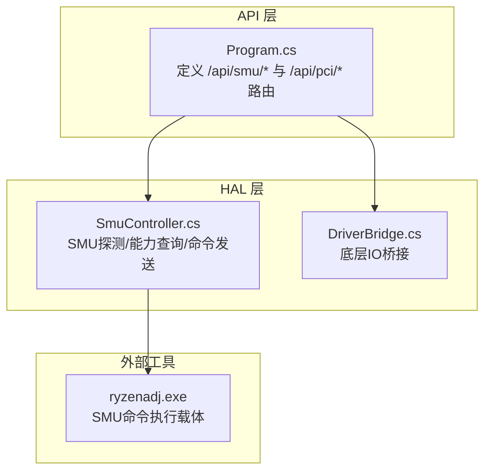
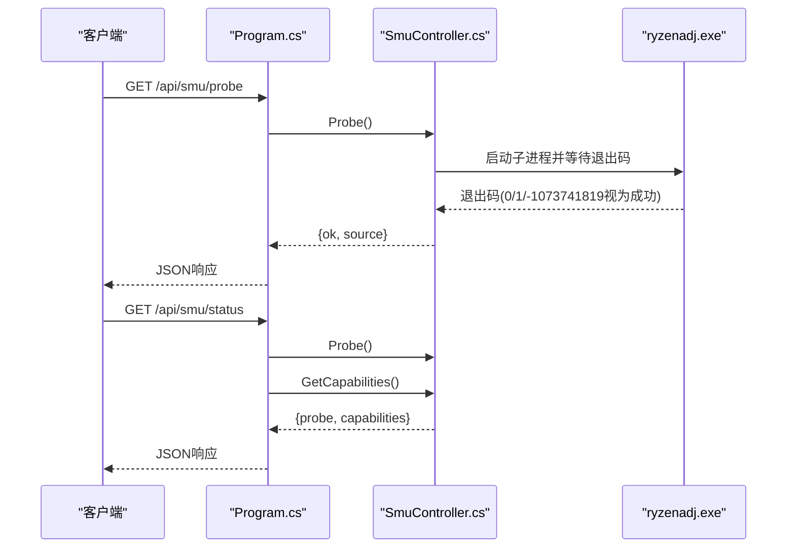
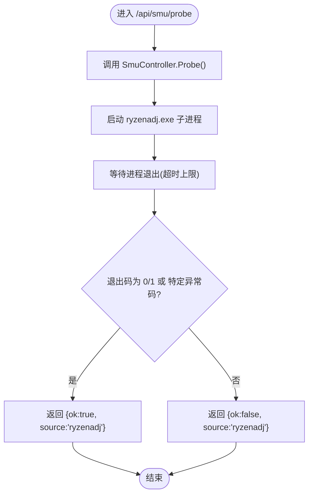
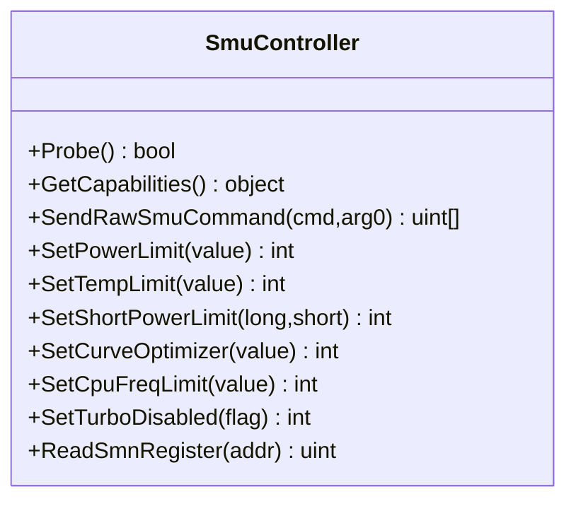
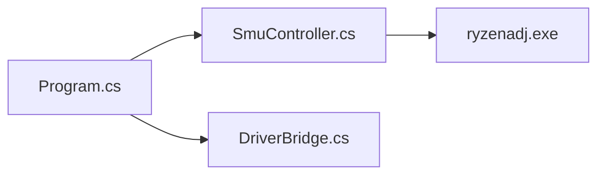

# 探测与能力查询

<cite>
**本文引用的文件**
- [Program.cs](file://server/api/Program.cs)
- [SmuController.cs](file://server/hal/SmuController.cs)
- [DriverBridge.cs](file://server/hal/DriverBridge.cs)
</cite>

## 目录
1. [简介](#简介)
2. [项目结构](#项目结构)
3. [核心组件](#核心组件)
4. [架构总览](#架构总览)
5. [详细组件分析](#详细组件分析)
6. [依赖关系分析](#依赖关系分析)
7. [性能考量](#性能考量)
8. [故障排查指南](#故障排查指南)
9. [结论](#结论)
10. [附录](#附录)

## 简介
本文件聚焦于系统中“SMU探测与能力查询”接口的设计与使用，涵盖以下目标：
- 说明SMU可用性检测（Probe）流程与硬件兼容性验证方法
- 记录GetCapabilities能力查询接口返回的SMU功能支持列表及各控制参数支持状态
- 提供实际使用场景：启动时的硬件适配检查、功能降级处理等
- 解释不同AMD处理器系列在SMU功能上的差异与兼容性注意事项

## 项目结构
后端采用ASP.NET Core Minimal API作为HTTP入口，SMU控制通过HAL层的SmuController封装调用外部工具ryzenadj.exe完成；PCI设备探测用于识别平台是否为AMD平台。

图表来源
- [Program.cs:287-325](file://server/api/Program.cs#L287-L325)
- [SmuController.cs:12-41](file://server/hal/SmuController.cs#L12-L41)
- [DriverBridge.cs](file://server/hal/DriverBridge.cs)

章节来源
- [Program.cs:287-325](file://server/api/Program.cs#L287-L325)

## 核心组件
- SMU探测接口：/api/smu/probe
  - 返回值包含ok字段表示SMU可用性，以及source标识来源（ryzenadj）
  - 实际实现委托给SmuController.Probe()
- 能力查询接口：/api/smu/status
  - 返回probe结果与capabilities对象，其中capabilities来自SmuController.GetCapabilities()
- 能力清单（GetCapabilities）：当前返回固定能力集合，明确哪些参数受支持
- PCI探测接口：/api/pci/probe
  - 通过底层IO读取PCI厂商ID与设备ID，判断是否为AMD平台

章节来源
- [Program.cs:287-325](file://server/api/Program.cs#L287-L325)
- [SmuController.cs:123-141](file://server/hal/SmuController.cs#L123-L141)

## 架构总览
SMU相关请求从API层进入，经HAL层的SmuController进行实际探测与能力查询，必要时通过外部工具ryzenadj.exe执行底层操作；PCI探测独立于SMU，但同样位于HAL层并通过DriverBridge访问底层IO。

图表来源
- [Program.cs:287-325](file://server/api/Program.cs#L287-L325)
- [SmuController.cs:115-121](file://server/hal/SmuController.cs#L115-L121)
- [SmuController.cs:123-141](file://server/hal/SmuController.cs#L123-L141)

## 详细组件分析

### SMU探测（Probe）
- 入口：/api/smu/probe
- 处理逻辑：
  - 调用SmuController.Probe()
  - 该方法内部尝试启动ryzenadj.exe并等待其退出，若退出码为0、1或特定异常码则视为探测成功
  - 捕获异常并返回错误信息
- 返回示例字段：
  - ok：布尔值，表示SMU可用性
  - source：字符串，标识来源（ryzenadj）

图表来源
- [Program.cs:287-298](file://server/api/Program.cs#L287-L298)
- [SmuController.cs:115-121](file://server/hal/SmuController.cs#L115-L121)

章节来源
- [Program.cs:287-298](file://server/api/Program.cs#L287-L298)
- [SmuController.cs:115-121](file://server/hal/SmuController.cs#L115-L121)

### 能力查询（GetCapabilities）
- 入口：/api/smu/status（内部组合Probe与GetCapabilities）
- 能力清单（GetCapabilities）当前返回固定集合，包含如下键：
  - powerLimit：true
  - tempLimit：true
  - shortPowerLimit：true
  - curveOptimizer：true
  - cpuFreqLimit：true
  - turboDisabled：true
  - probe：true
  - vrmCurrent：false
  - rawCommand：false
  - readRegister：false
- 说明：
  - 当前实现返回固定能力集，未根据具体硬件动态判定
  - 若某项为false，表示当前运行环境不支持该功能（例如rawCommand、readRegister等）

图表来源
- [SmuController.cs:12-41](file://server/hal/SmuController.cs#L12-L41)
- [SmuController.cs:123-141](file://server/hal/SmuController.cs#L123-L141)

章节来源
- [Program.cs:315-325](file://server/api/Program.cs#L315-L325)
- [SmuController.cs:123-141](file://server/hal/SmuController.cs#L123-L141)

### 设置与原始命令接口（参考）
- /api/smu/set：根据参数名路由到对应设置函数（如功率限制、温度限制、曲线优化、频率限制、禁用睿频等）
- /api/smu/raw：发送原始SMU命令，返回响应数组
- 这些接口的存在表明系统具备完整的SMU控制能力，但当前GetCapabilities对部分能力标记为false

章节来源
- [Program.cs:238-286](file://server/api/Program.cs#L238-L286)
- [Program.cs:275-286](file://server/api/Program.cs#L275-L286)

### PCI探测（兼容性前置检查）
- /api/pci/probe：通过底层IO读取PCI厂商ID与设备ID，判断是否为AMD平台
- 返回字段包含ok、vendorId、deviceId与isAmd布尔值
- 建议在启动阶段先执行此探测，以决定是否启用SMU相关功能

章节来源
- [Program.cs:299-314](file://server/api/Program.cs#L299-L314)
- [DriverBridge.cs](file://server/hal/DriverBridge.cs)

## 依赖关系分析
- API层依赖HAL层的SmuController与DriverBridge
- SmuController内部依赖ryzenadj.exe作为SMU命令执行载体
- 能力查询与探测接口耦合度高，建议在启动时先执行PCI探测与SMU探测，再按能力清单决定UI与功能启用

图表来源
- [Program.cs:287-325](file://server/api/Program.cs#L287-L325)
- [SmuController.cs:12-41](file://server/hal/SmuController.cs#L12-L41)
- [DriverBridge.cs](file://server/hal/DriverBridge.cs)

章节来源
- [Program.cs:287-325](file://server/api/Program.cs#L287-L325)
- [SmuController.cs:12-41](file://server/hal/SmuController.cs#L12-L41)

## 性能考量
- 探测接口涉及子进程启动与等待，存在一定的启动延迟；建议在应用启动阶段异步执行一次探测，并缓存结果
- 能力查询接口同时包含探测与能力清单，若频繁调用可考虑合并或缓存能力清单
- 对于高频设置操作（如功率限制），应避免重复探测，优先复用已知能力清单

## 故障排查指南
- 探测失败（ok=false）：
  - 检查ryzenadj.exe是否存在且路径正确（构造函数会尝试多个候选路径）
  - 确认系统权限与驱动状态，确保能够启动外部进程
  - 查看异常信息中的错误描述
- 能力清单为false的功能：
  - 当前实现固定返回false的能力项（如rawCommand、readRegister），不代表硬件不支持，而是运行环境未启用
  - 如需启用，请在HAL层扩展能力检测逻辑并更新GetCapabilities返回值
- PCI探测失败：
  - 确认底层IO访问正常，检查DriverBridge实例可用性

章节来源
- [SmuController.cs:17-41](file://server/hal/SmuController.cs#L17-L41)
- [Program.cs:287-298](file://server/api/Program.cs#L287-L298)
- [Program.cs:315-325](file://server/api/Program.cs#L315-L325)

## 结论
- SMU探测与能力查询接口已完整实现，覆盖启动时的硬件适配检查与功能降级处理
- 能力清单当前为静态返回，建议后续基于硬件动态检测以提升准确性
- 建议在启动阶段统一执行PCI与SMU探测，并依据能力清单启用相应UI与功能

## 附录

### 使用场景与最佳实践
- 启动时的硬件适配检查
  - 先执行PCI探测确认AMD平台，再执行SMU探测确认SMU可用性
  - 根据探测结果决定是否显示SMU相关面板与控件
- 功能降级处理
  - 当能力清单中某项为false时，隐藏对应UI控件或提示用户当前不支持该功能
  - 对于关键功能（如功率限制、温度限制），若不可用应提供替代方案或提示

### 不同AMD处理器系列的兼容性考虑
- 当前实现未区分具体处理器系列，能力检测为通用策略
- 随着产品演进，建议在HAL层增加针对不同APM/SMU版本的能力检测分支，以更精确地反映各代处理器的SMU功能差异