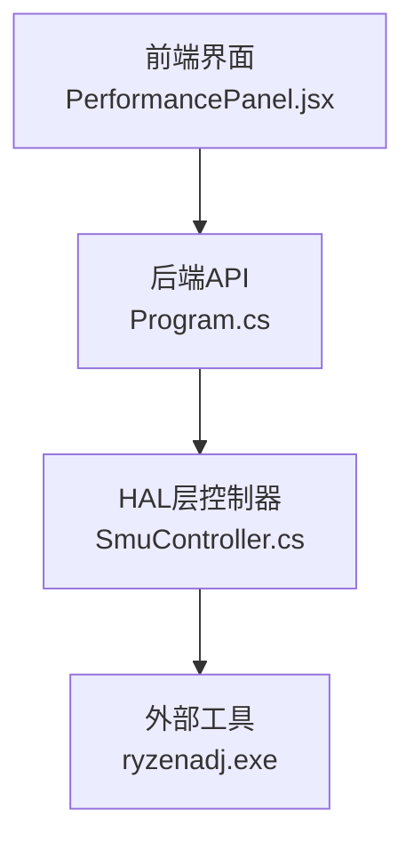
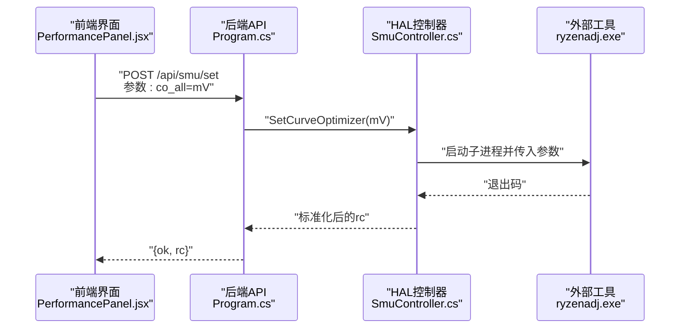
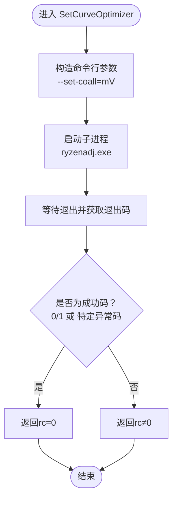
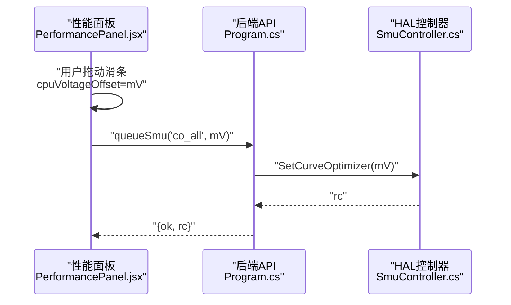

# 曲线优化器

<cite>
**本文引用的文件**
- [SmuController.cs](file://server/hal/SmuController.cs)
- [Program.cs](file://server/api/Program.cs)
- [custom-params.json](file://server/api/config/custom-params.json)
- [uxtuAdapter.js](file://src/services/uxtuAdapter.js)
- [PerformancePanel.jsx](file://src/components/panels/PerformancePanel.jsx)
- [App.jsx](file://src/App.jsx)
</cite>

## 目录
1. [简介](#简介)
2. [项目结构](#项目结构)
3. [核心组件](#核心组件)
4. [架构总览](#架构总览)
5. [详细组件分析](#详细组件分析)
6. [依赖关系分析](#依赖关系分析)
7. [性能考量](#性能考量)
8. [故障排查指南](#故障排查指南)
9. [结论](#结论)
10. [附录](#附录)

## 简介
本文件面向“SMU曲线优化器”接口的专业文档，聚焦于SetCurveOptimizer功能，系统阐述其在CPU曲线优化中的作用、电压调节机制与mV单位设置方法，并结合仓库中实际实现，说明该功能如何影响CPU性能与稳定性，给出典型应用场景（如超频前电压校准、功耗优化），同时强调安全电压范围与潜在风险。

## 项目结构
本项目采用前后端分离架构：
- 前端（React/Vite）负责用户界面与参数交互，通过HTTP接口调用后端服务。
- 后端（ASP.NET Core Web API）提供SMU控制能力，内部通过子进程调用ryzenadj.exe完成底层写入。
- HAL层封装SMU控制器，统一暴露SetCurveOptimizer等能力。

图表来源
- [Program.cs:238-274](file://server/api/Program.cs#L238-L274)
- [SmuController.cs:12-41](file://server/hal/SmuController.cs#L12-L41)
- [PerformancePanel.jsx:119-120](file://src/components/panels/PerformancePanel.jsx#L119-L120)

章节来源
- [Program.cs:238-274](file://server/api/Program.cs#L238-L274)
- [SmuController.cs:12-41](file://server/hal/SmuController.cs#L12-L41)

## 核心组件
- SMU控制器（SmuController）
  - 提供SetCurveOptimizer等SMU控制方法，内部以子进程方式调用ryzenadj.exe。
  - 支持探测（Probe）、能力查询（GetCapabilities）等辅助功能。
- Web API（Program.cs）
  - 暴露REST接口，接收前端请求并分派到SmuController执行。
  - 对参数进行类型转换与单位换算（如功率W到mW）。
- 前端面板（PerformancePanel.jsx）
  - 提供滑条控件，允许用户设置“电压调节（降压）”，单位为mV。
  - 将变更实时提交至后端，触发SetCurveOptimizer生效。
- 默认参数配置（custom-params.json）
  - 包含默认的cpuVoltageOffset等参数，便于初始化与恢复。
- 预设适配器（uxtuAdapter.js）
  - 定义多种运行模式（silent/office/gaming/beast/custom），其中包含cpuVoltageOffset字段，用于批量应用。

章节来源
- [SmuController.cs:78-82](file://server/hal/SmuController.cs#L78-L82)
- [Program.cs:238-274](file://server/api/Program.cs#L238-L274)
- [PerformancePanel.jsx:119-120](file://src/components/panels/PerformancePanel.jsx#L119-L120)
- [custom-params.json](file://server/api/config/custom-params.json#L8)
- [uxtuAdapter.js:109-115](file://src/services/uxtuAdapter.js#L109-L115)

## 架构总览
SMU曲线优化器通过“前端参数 -> API路由 -> HAL控制器 -> 外部工具”的链路工作。SetCurveOptimizer最终由ryzenadj.exe执行，返回码被标准化处理，兼容特定异常退出情形。

图表来源
- [Program.cs:238-274](file://server/api/Program.cs#L238-L274)
- [SmuController.cs:43-57](file://server/hal/SmuController.cs#L43-L57)
- [SmuController.cs:78-82](file://server/hal/SmuController.cs#L78-L82)

## 详细组件分析

### SetCurveOptimizer接口与实现
- 参数与单位
  - 接口参数名为co_all，对应“所有曲线优化器”。
  - 值以mV为单位，支持负值（表示降压）与零。
- 实现机制
  - HAL层通过RyzenAdj构造命令行参数，调用ryzenadj.exe执行。
  - 返回码被标准化：接受0、1以及特定异常退出码视为成功。
- 错误处理
  - 若子进程无法启动或返回非预期错误码，API会返回错误信息。

图表来源
- [SmuController.cs:43-57](file://server/hal/SmuController.cs#L43-L57)
- [SmuController.cs:78-82](file://server/hal/SmuController.cs#L78-L82)

章节来源
- [SmuController.cs:78-82](file://server/hal/SmuController.cs#L78-L82)
- [Program.cs:256-258](file://server/api/Program.cs#L256-L258)

### CPU电压调节机制与mV单位设置
- 设置入口
  - 前端通过滑条控件设置“电压调节（降压）”，单位为mV，范围通常为[-30, 0]。
  - 每次变更即触发队列写入，调用后端接口将参数传递给SetCurveOptimizer。
- 参数映射
  - 前端参数名：cpuVoltageOffset（单位mV）。
  - 后端路由参数名：co_all（单位mV）。
  - 配置文件默认值：cpuVoltageOffset=-18。
- 应用流程
  - 用户在界面调整滑条 -> 更新本地状态 -> 发送POST /api/smu/set(co_all, value) -> HAL执行SetCurveOptimizer -> ryzenadj写入 -> SMU生效。

图表来源
- [PerformancePanel.jsx:119-120](file://src/components/panels/PerformancePanel.jsx#L119-L120)
- [Program.cs:256-258](file://server/api/Program.cs#L256-L258)
- [SmuController.cs:78-82](file://server/hal/SmuController.cs#L78-L82)

章节来源
- [PerformancePanel.jsx:119-120](file://src/components/panels/PerformancePanel.jsx#L119-L120)
- [Program.cs:256-258](file://server/api/Program.cs#L256-L258)
- [custom-params.json](file://server/api/config/custom-params.json#L8)

### 曲线优化对CPU性能与稳定性的影响
- 性能影响
  - 降低电压可提升系统在高负载下的稳定性，减少热节流与掉频概率，从而在部分工况下获得更平滑的频率曲线。
  - 过度降压可能导致系统不稳定，出现蓝屏、死机或任务失败。
- 稳定性影响
  - 不同平台与散热条件差异较大，需要通过小步测试确定安全边界。
  - 结合温度墙、功耗墙与睿频禁用策略，可进一步提升稳定性。
- 与其他参数的关系
  - 与温度墙（tctl_temp）、功耗墙（power_limit/short_power_limit）协同使用，形成多维度约束。
  - 与CPU频率限制（cpu_freq_limit）配合，避免在低电压下强行高频导致系统崩溃。

章节来源
- [Program.cs:247-263](file://server/api/Program.cs#L247-L263)
- [Program.cs:469-484](file://server/api/Program.cs#L469-L484)

### 不同电压设置的适用场景
- 超频前电压校准
  - 在尝试更高频率前，先通过SetCurveOptimizer进行小幅降压（例如-10/-18mV），观察系统稳定性，再逐步提高频率。
- 日常节能与静音
  - 使用较低的cpuVoltageOffset（如-18）与较保守的温度/功耗墙，平衡性能与噪音。
- 高负载稳定性优先
  - 在极端负载场景下，适度降压（如-20~-25）可显著降低热节流，提升持续性能表现。

章节来源
- [custom-params.json](file://server/api/config/custom-params.json#L8)
- [uxtuAdapter.js:109-115](file://src/services/uxtuAdapter.js#L109-L115)

### 实际应用案例
- 案例一：超频前电压校准
  - 步骤：将cpuVoltageOffset从默认-18逐步下调至-20/-25，运行压力测试，记录系统崩溃点；随后在该电压范围内尝试更高频率。
  - 关联接口：co_all（SetCurveOptimizer）。
- 案例二：功耗优化
  - 步骤：在办公/轻负载模式下，降低cpuVoltageOffset并收紧功耗墙，减少发热与能耗。
  - 关联接口：co_all、power_limit、short_power_limit。
- 案例三：模式化应用
  - 使用预设（silent/office/gaming/beast/custom）一键应用包含cpuVoltageOffset的参数组合，快速切换不同性能-稳定性偏好。

章节来源
- [Program.cs:469-484](file://server/api/Program.cs#L469-L484)
- [uxtuAdapter.js:109-115](file://src/services/uxtuAdapter.js#L109-L115)
- [App.jsx:112-121](file://src/App.jsx#L112-L121)

### 安全电压范围与风险提示
- 安全范围建议
  - 初学者建议从-18mV起步，逐步下调至-20~-25mV，观察系统稳定性。
  - 绝对不建议超过-30mV（除非具备充分测试与散热保障）。
- 风险提示
  - 电压过低可能导致系统在高负载下崩溃、重启或无法启动。
  - 与温度墙、功耗墙、睿频禁用策略配合使用，可有效降低风险。
  - 若出现异常，应立即恢复默认电压（0mV）并检查散热与电源设计。

章节来源
- [PerformancePanel.jsx:119-120](file://src/components/panels/PerformancePanel.jsx#L119-L120)
- [Program.cs:256-258](file://server/api/Program.cs#L256-L258)

## 依赖关系分析
- 前端依赖后端API提供的/co_all参数，通过queueSmu发送至后端。
- 后端依赖HAL层的SetCurveOptimizer，后者依赖ryzenadj.exe执行实际写入。
- HAL层对特定异常退出码进行兼容处理，保证API返回一致性。

图表来源
- [Program.cs:238-274](file://server/api/Program.cs#L238-L274)
- [SmuController.cs:78-82](file://server/hal/SmuController.cs#L78-L82)

章节来源
- [Program.cs:238-274](file://server/api/Program.cs#L238-L274)
- [SmuController.cs:78-82](file://server/hal/SmuController.cs#L78-L82)

## 性能考量
- 电压与频率的协同
  - 适当降压可降低热节流阈值，使CPU在更高频率下保持稳定。
- 功耗与温度的联动
  - 降低电压通常伴随更低的功耗与温度，有助于延长电池续航与降低噪音。
- 测试与验证
  - 引入压力测试与监控工具，持续观测温度、频率与稳定性指标，逐步逼近最优配置。

## 故障排查指南
- 症状：设置后无响应或返回错误
  - 检查ryzenadj.exe是否存在且可执行。
  - 确认后端日志与返回码，关注特定异常退出码的兼容处理。
- 症状：系统不稳定或崩溃
  - 立即恢复默认电压（0mV），并降低功耗墙与温度墙。
  - 检查散热与风扇曲线，确保风道畅通。
- 症状：参数未持久保存
  - 确认前端参数是否正确写入localStorage与后端配置文件。

章节来源
- [SmuController.cs:103-121](file://server/hal/SmuController.cs#L103-L121)
- [Program.cs:269-273](file://server/api/Program.cs#L269-L273)

## 结论
SetCurveOptimizer通过mV级电压调节，为CPU提供精细化的曲线优化能力。结合温度墙、功耗墙与频率限制策略，可在不同场景下取得性能与稳定性的最佳平衡。建议以小步测试的方式探索安全边界，并在高负载场景下优先考虑降压以换取更稳定的持续性能。

## 附录
- 关键参数对照
  - 前端参数：cpuVoltageOffset（单位mV）
  - 后端参数：co_all（单位mV）
  - 默认值：-18mV
- 相关接口
  - POST /api/smu/set（参数：co_all, value）
  - GET /api/smu/status（能力查询）
  - GET /api/smu/probe（探测ryzenadj可用性）

章节来源
- [Program.cs:238-274](file://server/api/Program.cs#L238-L274)
- [Program.cs:287-298](file://server/api/Program.cs#L287-L298)
- [custom-params.json](file://server/api/config/custom-params.json#L8)