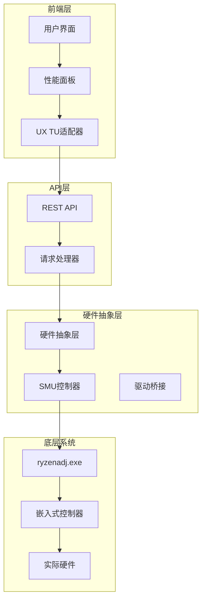
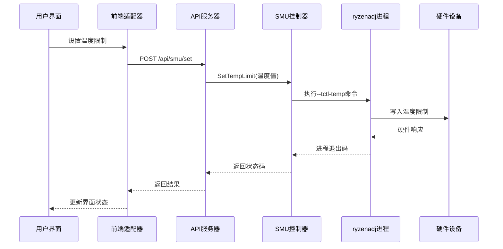
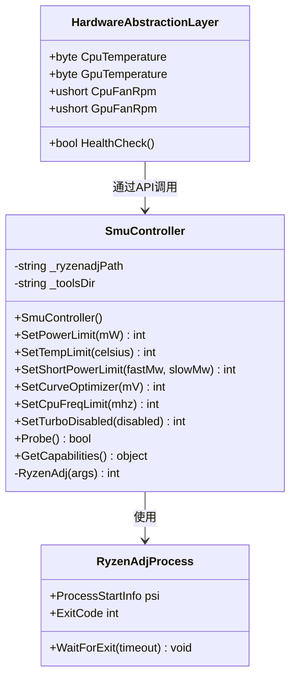
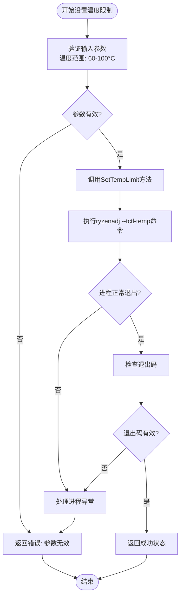
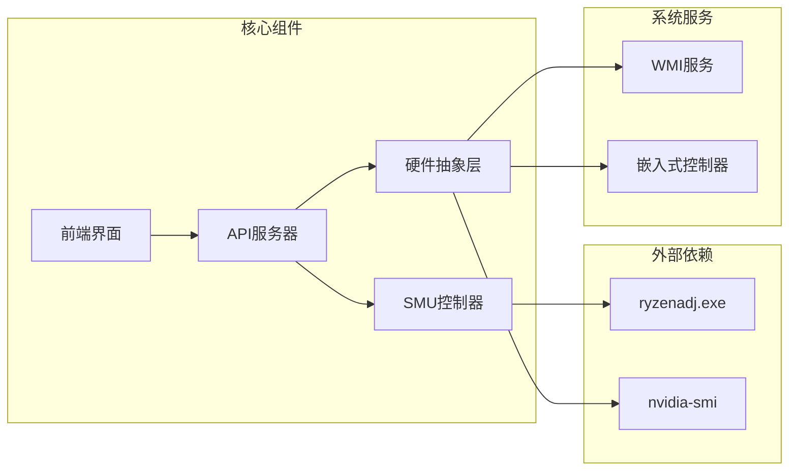

# 温度控制接口

<cite>
**本文档引用的文件**
- [SmuController.cs](file://server/hal/SmuController.cs)
- [Program.cs](file://server/api/Program.cs)
- [HardwareAbstractionLayer.cs](file://server/hal/HardwareAbstractionLayer.cs)
- [uxtuAdapter.js](file://src/services/uxtuAdapter.js)
- [PerformancePanel.jsx](file://src/components/panels/PerformancePanel.jsx)
- [custom-params.json](file://server/api/config/custom-params.json)
- [dev-ec-map.md](file://docs/dev-ec-map.md)
</cite>

## 目录
1. [简介](#简介)
2. [项目结构](#项目结构)
3. [核心组件](#核心组件)
4. [架构概览](#架构概览)
5. [详细组件分析](#详细组件分析)
6. [依赖关系分析](#依赖关系分析)
7. [性能考虑](#性能考虑)
8. [故障排除指南](#故障排除指南)
9. [结论](#结论)

## 简介

本文档详细说明了SMU温度控制接口的SetTempLimit温度墙设置功能。该接口允许用户设置CPU温度限制，范围通常在80-110°C之间，并解释了温度限制对系统稳定性、散热需求的影响机制。

SMU（System Management Unit）温度控制是AMD平台的重要功能，通过ryzenadj子进程实现对CPU温度墙的动态调整。该接口提供了完整的温度控制解决方案，包括温度限制设置、生效机制、最佳实践建议等。

## 项目结构

该项目采用分层架构设计，主要包含以下层次：

**图表来源**
- [Program.cs:240-274](file://server/api/Program.cs#L240-L274)
- [SmuController.cs:12-41](file://server/hal/SmuController.cs#L12-L41)
- [HardwareAbstractionLayer.cs:19-41](file://server/hal/HardwareAbstractionLayer.cs#L19-L41)

**章节来源**
- [Program.cs:240-274](file://server/api/Program.cs#L240-L274)
- [SmuController.cs:12-41](file://server/hal/SmuController.cs#L12-L41)
- [HardwareAbstractionLayer.cs:19-41](file://server/hal/HardwareAbstractionLayer.cs#L19-L41)

## 核心组件

### SMU温度控制核心功能

SMU温度控制接口的核心功能由以下组件构成：

#### 温度限制设置
- 支持参数名称：`tctl_temp` 和 `temp_limit`
- 温度范围：60-100°C（用户界面默认范围）
- 生效机制：通过ryzenadj子进程执行

#### 温度监控
- CPU温度读取：EC IO端口0x1C
- GPU温度读取：物理内存映射或nvidia-smi回退
- 实时遥测：WebSocket连接提供实时温度数据

#### 配置管理
- 预设模式：安静、均衡、游戏、野兽四种模式
- 自定义参数：支持用户自定义温度限制
- 参数持久化：JSON配置文件存储

**章节来源**
- [SmuController.cs:67-71](file://server/hal/SmuController.cs#L67-L71)
- [Program.cs:252-254](file://server/api/Program.cs#L252-L254)
- [HardwareAbstractionLayer.cs:147-195](file://server/hal/HardwareAbstractionLayer.cs#L147-L195)

## 架构概览

SMU温度控制接口采用分层架构，确保了良好的模块化和可维护性：

**图表来源**
- [uxtuAdapter.js:121-129](file://src/services/uxtuAdapter.js#L121-L129)
- [Program.cs:252-254](file://server/api/Program.cs#L252-L254)
- [SmuController.cs:67-71](file://server/hal/SmuController.cs#L67-L71)

## 详细组件分析

### SMU控制器类分析

SMU控制器是温度控制的核心组件，负责与底层硬件进行交互：

**图表来源**
- [SmuController.cs:12-141](file://server/hal/SmuController.cs#L12-L141)
- [HardwareAbstractionLayer.cs:147-229](file://server/hal/HardwareAbstractionLayer.cs#L147-L229)

#### 温度限制设置流程

温度限制设置的具体实现流程如下：

**图表来源**
- [SmuController.cs:67-71](file://server/hal/SmuController.cs#L67-L71)
- [Program.cs:252-254](file://server/api/Program.cs#L252-L254)

**章节来源**
- [SmuController.cs:67-71](file://server/hal/SmuController.cs#L67-L71)
- [Program.cs:252-254](file://server/api/Program.cs#L252-L254)

### 前端集成组件

前端提供了直观的温度控制界面，支持实时温度监控和参数调整：

#### 性能面板集成
- 温度墙滑块控件（60-100°C）
- 实时温度显示
- 预设模式切换
- 参数锁定功能

#### UX TU适配器
- API请求封装
- 错误处理机制
- 异步操作支持

**章节来源**
- [PerformancePanel.jsx:90-112](file://src/components/panels/PerformancePanel.jsx#L90-L112)
- [uxtuAdapter.js:121-129](file://src/services/uxtuAdapter.js#L121-L129)

### 预设模式配置

系统提供了多种预设模式，每种模式都有特定的温度限制策略：

| 模式 | CPU温度限制(°C) | GPU温度限制(°C) | 风扇转速(RPM) | 使用场景 |
|------|----------------|----------------|---------------|----------|
| 安静(Silent) | 75 | 75 | 大:2200/小:2000 | 日常办公、静音需求 |
| 均衡(Office) | 80 | 85 | 大:2900/小:6400 | 办公娱乐、平衡性能 |
| 游戏(Gaming) | 95 | 95 | 大:4300/小:8000 | 游戏、高负载应用 |
| 野兽(Beast) | 88 | 90 | 大:3500/小:6900 | 极致性能、散热充足 |

**章节来源**
- [custom-params.json:1-22](file://server/api/config/custom-params.json#L1-L22)
- [uxtuAdapter.js:109-115](file://src/services/uxtuAdapter.js#L109-L115)

## 依赖关系分析

### 组件依赖图

**图表来源**
- [SmuController.cs:17-41](file://server/hal/SmuController.cs#L17-L41)
- [HardwareAbstractionLayer.cs:173-191](file://server/hal/HardwareAbstractionLayer.cs#L173-L191)

### 数据流分析

温度控制的数据流遵循以下路径：

1. **用户输入** → 前端界面
2. **参数验证** → UX TU适配器
3. **API调用** → REST API
4. **SMU处理** → SMU控制器
5. **硬件执行** → ryzenadj进程
6. **状态反馈** → 实时监控

**章节来源**
- [uxtuAdapter.js:121-129](file://src/services/uxtuAdapter.js#L121-L129)
- [Program.cs:252-254](file://server/api/Program.cs#L252-L254)

## 性能考虑

### 温度限制对系统性能的影响

#### 正常工作范围
- **推荐范围**：80-110°C
- **安全下限**：60°C（用户界面限制）
- **默认值**：90°C（系统配置）

#### 性能保护机制
当温度达到限制值时，系统会自动采取以下保护措施：
1. **频率降级**：CPU基础频率降低
2. **功率限制**：动态功率墙生效
3. **风扇加速**：提高散热效率
4. **负载调度**：减少系统负载

### 散热需求优化

#### 风扇控制协调
- **温度墙配合**：根据温度限制调整风扇曲线
- **散热模式**：不同模式对应不同的风扇转速范围
- **实时监控**：通过EC寄存器监控风扇状态

#### 最佳实践建议

**高负载场景设置**：
- 游戏模式：CPU 95°C，GPU 95°C
- 编译/渲染：CPU 90°C，GPU 90°C
- 录屏/直播：CPU 85°C，GPU 85°C

**日常使用设置**：
- 办公：CPU 80°C，GPU 85°C
- 浏览/文档：CPU 75°C，GPU 75°C

**章节来源**
- [dev-ec-map.md:63-71](file://docs/dev-ec-map.md#L63-L71)
- [custom-params.json:5-17](file://server/api/config/custom-params.json#L5-L17)

## 故障排除指南

### 常见问题及解决方案

#### 温度限制设置失败
**症状**：设置温度限制后无效果
**可能原因**：
1. ryzenadj进程权限不足
2. 硬件不支持温度墙功能
3. 参数值超出有效范围

**解决步骤**：
1. 检查管理员权限
2. 验证硬件兼容性
3. 确认温度范围在60-100°C之间

#### 温度读数异常
**症状**：温度显示异常或波动
**可能原因**：
1. EC寄存器读取失败
2. nvidia-smi不可用
3. 硬件传感器故障

**解决步骤**：
1. 检查硬件连接
2. 重启相关服务
3. 更新驱动程序

#### API调用错误
**症状**：HTTP 500错误
**可能原因**：
1. SMU控制器初始化失败
2. 网络连接问题
3. 参数格式错误

**解决步骤**：
1. 检查服务状态
2. 验证请求格式
3. 查看日志信息

**章节来源**
- [SmuController.cs:103-121](file://server/hal/SmuController.cs#L103-L121)
- [Program.cs:270-273](file://server/api/Program.cs#L270-L273)

## 结论

SMU温度控制接口提供了完整的CPU温度墙管理解决方案。通过合理的温度限制设置和风扇控制协调，可以在保证系统稳定性的同时最大化性能表现。

### 关键要点总结

1. **温度范围**：建议在80-110°C范围内设置，避免过低或过高
2. **生效机制**：通过ryzenadj子进程实现，即时生效
3. **监控反馈**：提供实时温度监控和状态反馈
4. **最佳实践**：根据使用场景选择合适的预设模式
5. **故障排除**：建立完善的错误处理和诊断机制

该接口的设计充分考虑了用户体验和系统稳定性，在提供强大功能的同时保持了良好的易用性和可靠性。