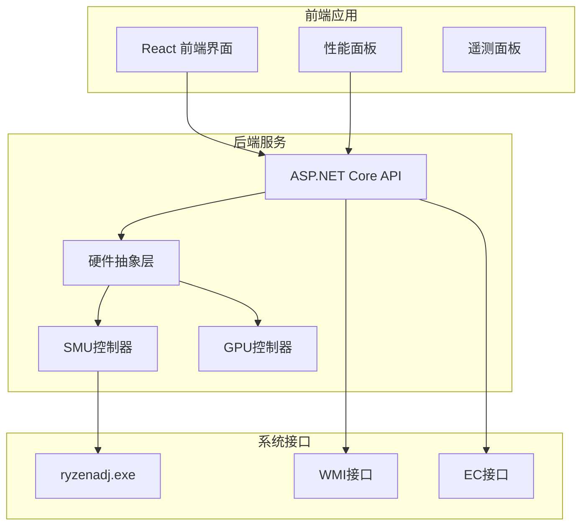
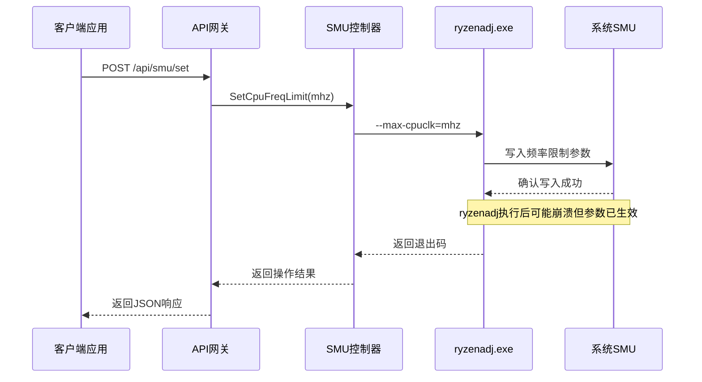
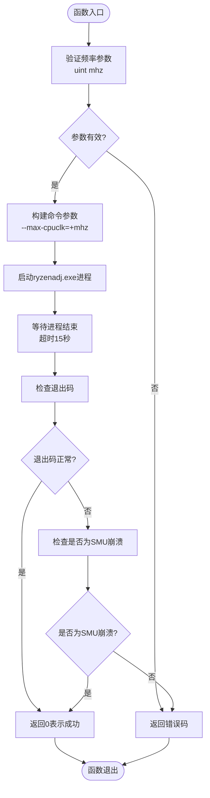
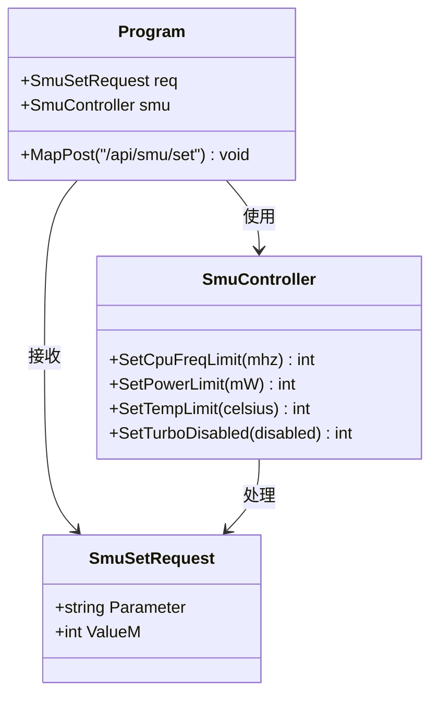
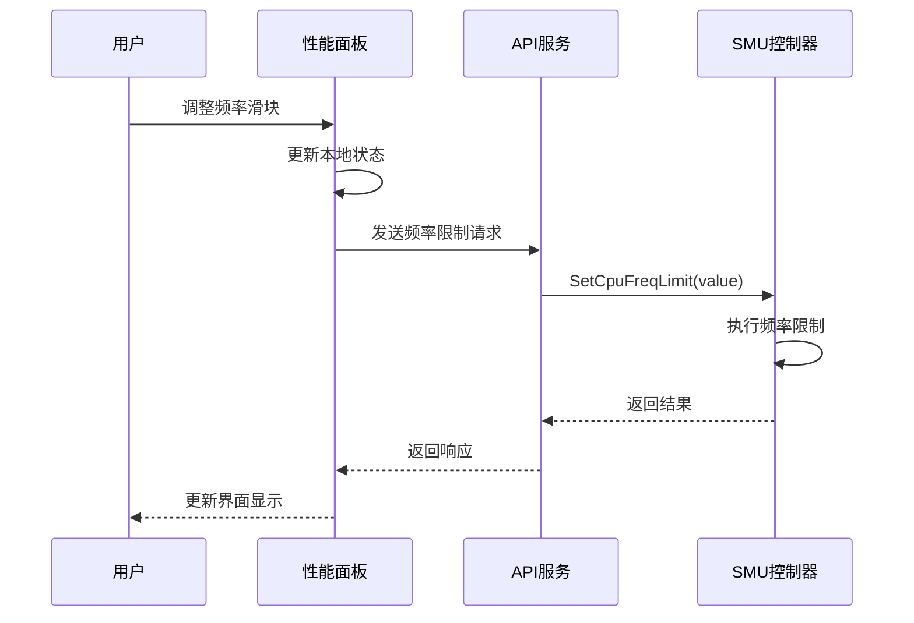
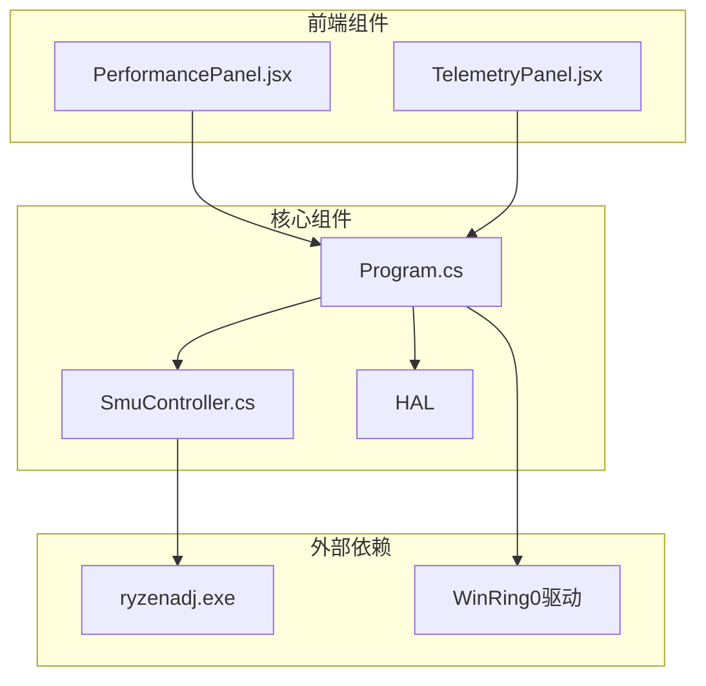

# 频率控制接口

<cite>
**本文档引用的文件**
- [SmuController.cs](file://server/hal/SmuController.cs)
- [Program.cs](file://server/api/Program.cs)
- [Douzhanzhe.API.csproj](file://server/api/Douzhanzhe.API.csproj)
- [PerformancePanel.jsx](file://src/components/panels/PerformancePanel.jsx)
</cite>

## 目录
1. [简介](#简介)
2. [项目结构](#项目结构)
3. [核心组件](#核心组件)
4. [架构概览](#架构概览)
5. [详细组件分析](#详细组件分析)
6. [依赖关系分析](#依赖关系分析)
7. [性能考虑](#性能考虑)
8. [故障排除指南](#故障排除指南)
9. [结论](#结论)
10. [附录](#附录)

## 简介

本文档详细说明了SMU频率控制接口的实现和使用方法，重点介绍SetCpuFreqLimit最大CPU频率限制功能。该接口基于AMD Ryzen处理器的SMU（系统管理单元）进行工作，通过调用ryzenadj.exe子进程来实现对CPU频率的精确控制。

SMU频率控制接口提供了以下核心功能：
- 最大CPU频率限制设置
- CPU频率范围控制
- 与其他硬件控制参数的协同工作
- 实时性能监控和调整

## 项目结构

该项目采用前后端分离的架构设计，主要包含以下模块：

**图表来源**
- [Program.cs:1-783](file://server/api/Program.cs#L1-L783)
- [SmuController.cs:1-142](file://server/hal/SmuController.cs#L1-L142)

**章节来源**
- [Program.cs:1-783](file://server/api/Program.cs#L1-L783)
- [Douzhanzhe.API.csproj:1-40](file://server/api/Douzhanzhe.API.csproj#L1-L40)

## 核心组件

### SMU控制器（SmuController）

SMU控制器是频率控制的核心组件，负责与AMD SMU进行通信。其主要职责包括：

- **频率限制设置**：通过SetCpuFreqLimit方法实现CPU最大频率限制
- **参数验证**：确保输入参数的有效性和安全性
- **错误处理**：处理ryzenadj.exe执行过程中的各种异常情况
- **能力检测**：报告当前硬件支持的功能特性

### API接口层

API接口层提供了RESTful API端点，支持外部应用程序和用户界面访问频率控制功能：

- **POST /api/smu/set**：通用SMU参数设置接口
- **GET /api/smu/status**：查询SMU状态和功能支持情况
- **GET /api/smu/probe**：探测SMU可用性

### 前端控制面板

前端提供了直观的用户界面，允许用户实时监控和调整CPU频率设置：

- **频率限制滑块**：实时调整最大CPU频率
- **状态显示**：显示当前CPU频率、温度等信息
- **应用队列**：批量应用多个控制参数

**章节来源**
- [SmuController.cs:12-142](file://server/hal/SmuController.cs#L12-L142)
- [Program.cs:238-274](file://server/api/Program.cs#L238-L274)
- [PerformancePanel.jsx:66-185](file://src/components/panels/PerformancePanel.jsx#L66-L185)

## 架构概览

系统采用分层架构设计，确保各组件之间的松耦合和高内聚：

**图表来源**
- [Program.cs:238-274](file://server/api/Program.cs#L238-L274)
- [SmuController.cs:84-88](file://server/hal/SmuController.cs#L84-L88)

**章节来源**
- [Program.cs:238-274](file://server/api/Program.cs#L238-L274)
- [SmuController.cs:43-57](file://server/hal/SmuController.cs#L43-L57)

## 详细组件分析

### SetCpuFreqLimit实现分析

SetCpuFreqLimit方法实现了最大CPU频率限制的核心功能：

**图表来源**
- [SmuController.cs:84-88](file://server/hal/SmuController.cs#L84-L88)
- [SmuController.cs:43-57](file://server/hal/SmuController.cs#L43-L57)

#### 方法签名和参数说明

| 参数 | 类型 | 描述 | 有效范围 |
|------|------|------|----------|
| mhz | uint | 目标CPU频率（MHz） | 通常为2000-8000（具体取决于处理器） |

#### 返回值含义

| 返回值 | 含义 | 处理方式 |
|--------|------|----------|
| 0 | 操作成功 | 频率限制已生效 |
| 1 | 参数无效 | 检查输入参数格式 |
| -1073741819 | SMU崩溃但参数已生效 | 视为操作成功处理 |

**章节来源**
- [SmuController.cs:84-88](file://server/hal/SmuController.cs#L84-L88)
- [SmuController.cs:59](file://server/hal/SmuController.cs#L59)

### API端点实现

POST /api/smu/set端点提供了统一的SMU参数设置接口：

**图表来源**
- [Program.cs:238-274](file://server/api/Program.cs#L238-L274)
- [Program.cs:738](file://server/api/Program.cs#L738)
- [SmuController.cs:84-95](file://server/hal/SmuController.cs#L84-L95)

**章节来源**
- [Program.cs:238-274](file://server/api/Program.cs#L238-L274)
- [Program.cs:738](file://server/api/Program.cs#L738)

### 前端集成实现

前端性能面板提供了直观的频率控制界面：

**图表来源**
- [PerformancePanel.jsx:80-83](file://src/components/panels/PerformancePanel.jsx#L80-L83)
- [Program.cs:259-260](file://server/api/Program.cs#L259-L260)

**章节来源**
- [PerformancePanel.jsx:66-185](file://src/components/panels/PerformancePanel.jsx#L66-L185)
- [PerformancePanel.jsx:80-83](file://src/components/panels/PerformancePanel.jsx#L80-L83)

## 依赖关系分析

系统各组件之间的依赖关系如下：

**图表来源**
- [Program.cs:1-783](file://server/api/Program.cs#L1-L783)
- [SmuController.cs:1-142](file://server/hal/SmuController.cs#L1-L142)

**章节来源**
- [Program.cs:1-783](file://server/api/Program.cs#L1-L783)
- [SmuController.cs:1-142](file://server/hal/SmuController.cs#L1-L142)

## 性能考虑

### 频率限制对系统性能的影响

| 影响方面 | 正面影响 | 负面影响 | 建议值范围 |
|----------|----------|----------|------------|
| 性能表现 | 降低峰值性能，稳定平均性能 | 可能限制计算密集型任务 | 2000-4500 MHz |
| 功耗控制 | 显著降低功耗，减少发热 | 可能影响响应速度 | 2500-4000 MHz |
| 温度控制 | 有效降低CPU温度 | 可能导致降频保护 | 3000-4500 MHz |
| 噪音水平 | 减少风扇转速需求 | 可能影响散热效率 | 2500-4000 MHz |

### 频率限制的实际应用场景

#### 场景1：降低发热和噪音
- **适用场景**：笔记本电脑长时间使用、安静环境工作
- **推荐设置**：3000-3500 MHz
- **预期效果**：温度下降5-10°C，风扇噪音显著降低

#### 场景2：提高性能表现
- **适用场景**：游戏、视频编码、科学计算
- **推荐设置**：4500-5000 MHz
- **预期效果**：性能提升8-15%，温度上升3-7°C

#### 场景3：平衡功耗和性能
- **适用场景**：日常办公、多任务处理
- **推荐设置**：3500-4200 MHz
- **预期效果**：功耗降低10-15%，性能稳定

## 故障排除指南

### 常见问题及解决方案

#### 问题1：频率限制设置失败
**症状**：API返回错误，频率未生效
**可能原因**：
- ryzenadj.exe权限不足
- 系统不支持频率限制功能
- 输入参数超出有效范围

**解决步骤**：
1. 以管理员权限运行应用程序
2. 检查硬件兼容性
3. 验证频率参数范围

#### 问题2：SMU崩溃但参数生效
**症状**：返回特定错误码但频率已限制
**处理方式**：视为操作成功处理

#### 问题3：频率限制不持久
**症状**：重启后频率限制失效
**解决方法**：重新应用频率限制设置

**章节来源**
- [SmuController.cs:59](file://server/hal/SmuController.cs#L59)
- [SmuController.cs:64](file://server/hal/SmuController.cs#L64)

## 结论

SMU频率控制接口提供了强大而灵活的CPU频率管理能力。通过SetCpuFreqLimit方法，用户可以精确控制AMD处理器的最大频率，实现性能、功耗和温度的平衡。

关键优势：
- **精确控制**：支持50 MHz步进的精细频率调节
- **实时反馈**：结合遥测数据实现实时监控
- **安全可靠**：完善的错误处理和参数验证机制
- **易于集成**：标准化的RESTful API接口

建议的最佳实践：
1. 根据使用场景选择合适的频率限制值
2. 定期监控系统温度和性能指标
3. 在重要任务前重新应用频率限制设置
4. 结合其他硬件控制参数实现综合优化

## 附录

### 支持的AMD处理器系列

| 处理器系列 | 频率范围(MHz) | 特殊说明 |
|------------|---------------|----------|
| Ryzen 3000系列 | 2000-4300 | 基础频率限制支持 |
| Ryzen 4000系列 | 2000-4900 | 改进的频率控制 |
| Ryzen 5000系列 | 2000-5300 | 支持更高频率 |
| Ryzen 6000系列 | 2000-5800 | 最新频率限制能力 |
| Ryzen 7000系列 | 2000-6000 | 最高频率支持 |

### 推荐设置参考表

| 使用场景 | 最小频率 | 推荐频率 | 最大频率 | 温度控制 |
|----------|----------|----------|----------|----------|
| 日常办公 | 2000 | 3000 | 3500 | 有限 |
| 游戏娱乐 | 2500 | 3500 | 4500 | 中等 |
| 内容创作 | 3000 | 4000 | 5000 | 较高 |
| 科学计算 | 3500 | 4500 | 5500 | 高度 |

### 相关API端点

| 端点 | 方法 | 描述 | 请求体示例 |
|------|------|------|------------|
| /api/smu/set | POST | 设置SMU参数 | {"parameter":"cpu_freq_limit","valueM":3500} |
| /api/smu/status | GET | 获取SMU状态 | - |
| /api/smu/probe | GET | 探测SMU可用性 | - |
| /api/telemetry | GET | 获取系统遥测数据 | - |