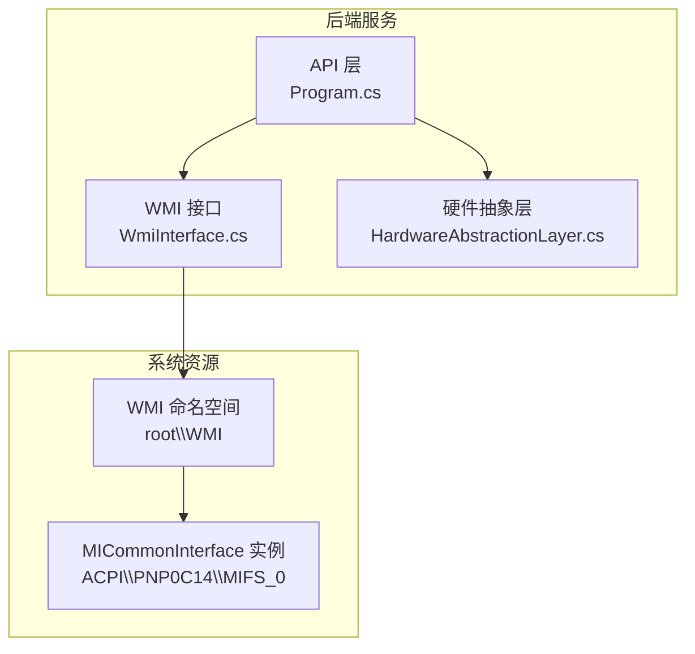
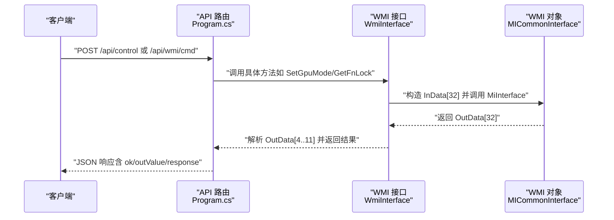
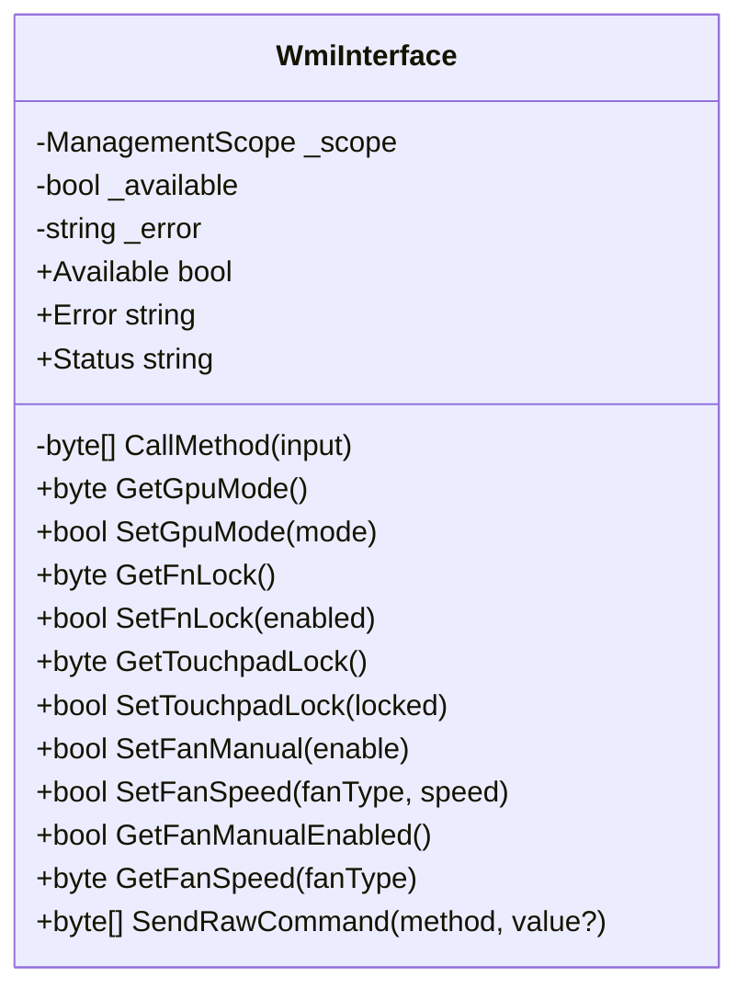
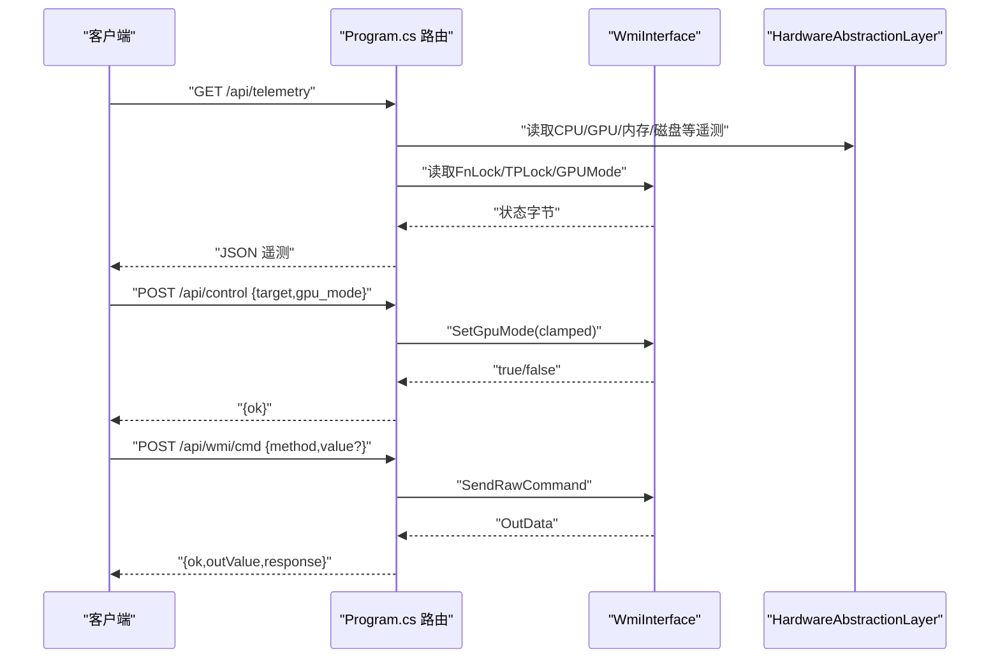
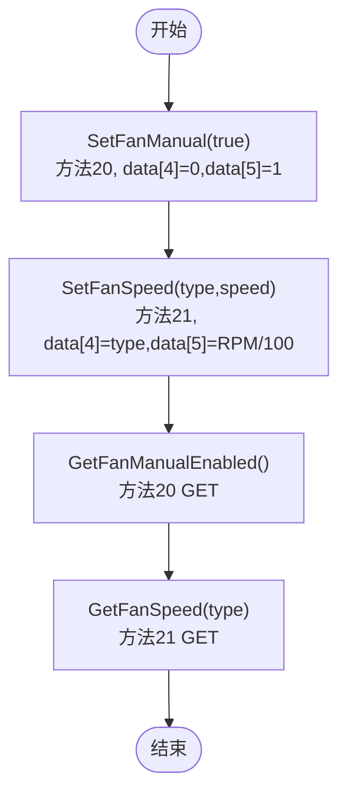
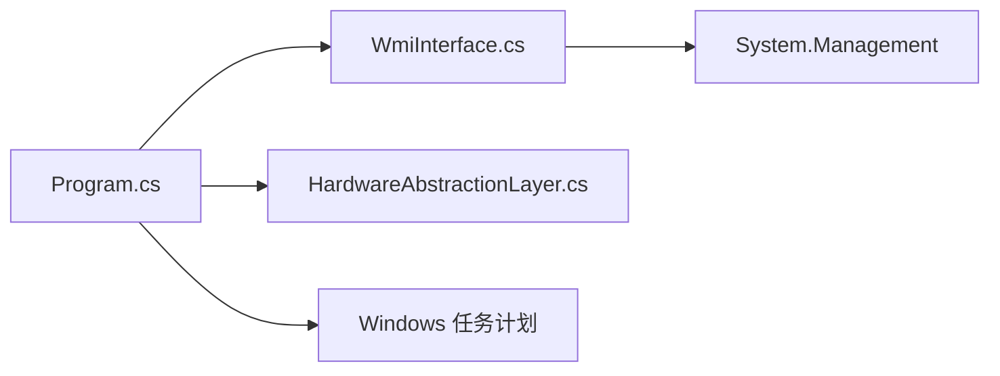

# WMI接口

<cite>
**本文引用的文件**
- [WmiInterface.cs](file://server/api/WmiInterface.cs)
- [Program.cs](file://server/api/Program.cs)
- [HardwareAbstractionLayer.cs](file://server/hal/HardwareAbstractionLayer.cs)
- [reference-consoles.md](file://docs/reference-consoles.md)
</cite>

## 目录
1. [简介](#简介)
2. [项目结构](#项目结构)
3. [核心组件](#核心组件)
4. [架构总览](#架构总览)
5. [详细组件分析](#详细组件分析)
6. [依赖关系分析](#依赖关系分析)
7. [性能考量](#性能考量)
8. [故障排除指南](#故障排除指南)
9. [结论](#结论)
10. [附录](#附录)

## 简介
本文件面向DOUZHANZHE-Control项目的WMI接口，系统性说明Windows Management Instrumentation在该系统中的使用方式，涵盖系统查询、状态获取与配置修改的API。重点记录以下控制命令的调用规范：
- GPUMode（显卡模式）
- FnLock（功能键锁定）
- TPLock（触摸板锁定）
- SystemPerMode（系统性能模式）
- 风扇控制（Bellator协议：MaxFanSwitch、MaxFanSpeed）

同时，文档给出权限要求、错误处理与异常情况说明，提供命令执行的完整示例（参数格式、返回值解析），并总结接口限制与兼容性注意事项。

## 项目结构
WMI接口位于后端服务的API层，通过System.Management访问root\WMI命名空间下的MICommonInterface实例，封装通用的MiInterface方法调用，对外暴露高层控制与查询能力；上层HTTP接口将其集成到REST API与WebSocket遥测中。

**图表来源**
- [Program.cs:87-120](file://server/api/Program.cs#L87-L120)
- [WmiInterface.cs:24-44](file://server/api/WmiInterface.cs#L24-L44)

**章节来源**
- [Program.cs:1-783](file://server/api/Program.cs#L1-L783)
- [WmiInterface.cs:1-210](file://server/api/WmiInterface.cs#L1-L210)

## 核心组件
- WmiInterface：封装WMI MiInterface调用，提供GPUMode、FnLock、TPLock、风扇控制等方法，并支持通用原始命令发送。
- Program.cs中的HTTP路由：将WMI能力暴露为REST API，包括GET /api/telemetry、POST /api/control、POST /api/wmi/cmd、GET/POST /api/fan/*等。
- HardwareAbstractionLayer：提供键盘背光、电源计划、散热模式等非WMI硬件控制，作为WMI能力的补充。

**章节来源**
- [WmiInterface.cs:18-210](file://server/api/WmiInterface.cs#L18-L210)
- [Program.cs:87-120](file://server/api/Program.cs#L87-L120)
- [Program.cs:144-202](file://server/api/Program.cs#L144-L202)
- [Program.cs:345-394](file://server/api/Program.cs#L345-L394)
- [Program.cs:504-518](file://server/api/Program.cs#L504-L518)
- [HardwareAbstractionLayer.cs:114-151](file://server/hal/HardwareAbstractionLayer.cs#L114-L151)

## 架构总览
WMI接口采用“统一输入输出缓冲区 + 方法编号”的协议格式，通过ManagementObject调用MiInterface方法，实现读取与设置两类操作。

**图表来源**
- [Program.cs:144-202](file://server/api/Program.cs#L144-L202)
- [Program.cs:504-518](file://server/api/Program.cs#L504-L518)
- [WmiInterface.cs:50-60](file://server/api/WmiInterface.cs#L50-L60)

## 详细组件分析

### WmiInterface类
- 初始化与可用性检测：尝试连接root\WMI并访问特定实例，失败则记录错误。
- 统一调用流程：CallMethod负责构造InData并调用MiInterface，返回OutData供上层解析。
- 方法族：
  - GPUMode：GetGpuMode/SetGpuMode（方法编号9）
  - FnLock：GetFnLock/SetFnLock（方法编号11）
  - TPLock：GetTouchpadLock/SetTouchpadLock（方法编号12）
  - 风扇控制：SetFanManual（方法20）、SetFanSpeed（方法21）、GetFanManualEnabled（方法20 GET）、GetFanSpeed（方法21 GET）
  - 通用原始命令：SendRawCommand（方法编号+可选值）

**图表来源**
- [WmiInterface.cs:18-210](file://server/api/WmiInterface.cs#L18-L210)

**章节来源**
- [WmiInterface.cs:24-48](file://server/api/WmiInterface.cs#L24-L48)
- [WmiInterface.cs:50-60](file://server/api/WmiInterface.cs#L50-L60)
- [WmiInterface.cs:63-87](file://server/api/WmiInterface.cs#L63-L87)
- [WmiInterface.cs:90-135](file://server/api/WmiInterface.cs#L90-L135)
- [WmiInterface.cs:139-198](file://server/api/WmiInterface.cs#L139-L198)
- [WmiInterface.cs:201-208](file://server/api/WmiInterface.cs#L201-L208)

### API路由与集成
- GET /api/telemetry：聚合HAL遥测与WMI状态（FnLock、TouchpadLock、GPUMode等）。
- POST /api/control：集中式控制入口，根据target分派到WMI或HAL。
- POST /api/wmi/cmd：通用原始命令接口，返回十六进制响应与解析后的outValue。
- GET/POST /api/fan/*：风扇控制与状态查询，基于Bellator协议。

**图表来源**
- [Program.cs:87-120](file://server/api/Program.cs#L87-L120)
- [Program.cs:144-202](file://server/api/Program.cs#L144-L202)
- [Program.cs:504-518](file://server/api/Program.cs#L504-L518)

**章节来源**
- [Program.cs:87-120](file://server/api/Program.cs#L87-L120)
- [Program.cs:144-202](file://server/api/Program.cs#L144-L202)
- [Program.cs:345-394](file://server/api/Program.cs#L345-L394)
- [Program.cs:504-518](file://server/api/Program.cs#L504-L518)

### 风扇控制（Bellator协议）
- 启用手动模式：SetFanManual(true)，方法20，data[4]=FanType（0=大扇），data[5]=1。
- 设置风扇转速：SetFanSpeed(fanType, speed)，方法21，data[4]=FanType，data[5]=RPM/100。
- 查询状态：GetFanManualEnabled（方法20 GET，FanType=0），GetFanSpeed（方法21 GET）。

**图表来源**
- [WmiInterface.cs:139-198](file://server/api/WmiInterface.cs#L139-L198)

**章节来源**
- [WmiInterface.cs:139-198](file://server/api/WmiInterface.cs#L139-L198)

### 通用原始命令
SendRawCommand支持两种模式：
- GET：value为空，InData[1]=250，InData[3]=method
- SET：value存在，InData[1]=251，InData[3]=method，InData[4]=value

返回值解析：OutData前4字节为头部，OutData[4..11]通常携带业务数据；接口返回前8字节的十六进制字符串与解析出的outValue（若存在）。

**章节来源**
- [WmiInterface.cs:201-208](file://server/api/WmiInterface.cs#L201-L208)
- [Program.cs:504-518](file://server/api/Program.cs#L504-L518)

## 依赖关系分析
- System.Management：用于访问WMI命名空间与调用MiInterface方法。
- 硬件抽象层：提供键盘背光、电源计划、散热模式等非WMI控制，作为WMI能力的补充。
- Windows任务计划：用于开机自启管理（与WMI无直接耦合）。

**图表来源**
- [WmiInterface.cs:14](file://server/api/WmiInterface.cs#L14)
- [Program.cs:1-17](file://server/api/Program.cs#L1-L17)

**章节来源**
- [WmiInterface.cs:14](file://server/api/WmiInterface.cs#L14)
- [Program.cs:1-17](file://server/api/Program.cs#L1-L17)

## 性能考量
- 单次WMI调用为本地IPC，延迟较低；频繁调用可能带来累积开销。
- 风扇控制涉及多次调用（先启用手动模式，再设置转速），建议批量下发以减少往返。
- 建议在前端进行参数范围校验与节流，避免重复请求。

## 故障排除指南
- 可用性检查：WmiInterface构造函数失败时，Available=false，Error包含异常类型与消息。可通过GET /api/telemetry中的fnLock/touchpadLock/gpuMode字段判断WMI是否可用。
- 权限问题：WMI调用需要具备相应权限；若失败，检查运行账户与系统策略。
- 返回值解析：通用命令返回前8字节十六进制字符串，outValue来自OutData[4]（若存在）。若长度不足，解析为默认值。
- 典型错误场景：
  - 方法编号不存在或不被固件识别：返回值可能为空或无意义。
  - 参数越界：Set系列方法内部会捕获异常并返回false；上层API返回错误信息。
  - 固件不支持：某些机型或固件版本可能不支持特定方法。

**章节来源**
- [WmiInterface.cs:24-48](file://server/api/WmiInterface.cs#L24-L48)
- [Program.cs:504-518](file://server/api/Program.cs#L504-L518)

## 结论
WMI接口通过统一的MiInterface协议实现了对系统关键硬件状态的读取与控制，覆盖显卡模式、功能键锁定、触摸板锁定以及风扇控制等常用场景。结合HAL提供的非WMI能力，形成完整的底层控制闭环。建议在生产环境中严格进行参数校验、异常捕获与日志记录，确保稳定性与可维护性。

## 附录

### WMI命令格式与参数
- 通用格式（InData[32]）：
  - InData[1]：250（GET）/251（SET）
  - InData[3]：方法编号
  - InData[4]：可选参数（SET时使用）
  - OutData[4..11]：业务数据（视方法而定）
- 常用方法编号：
  - GPUMode：9（GET/SET）
  - FnLock：11（GET/SET）
  - TPLock：12（GET/SET）
  - 风扇控制：MaxFanSwitch=20（SET启用手动，GET查询），MaxFanSpeed=21（SET/GET）
  - SystemPerMode：8（参考文档说明）

**章节来源**
- [WmiInterface.cs:8-12](file://server/api/WmiInterface.cs#L8-L12)
- [WmiInterface.cs:63-87](file://server/api/WmiInterface.cs#L63-L87)
- [WmiInterface.cs:90-135](file://server/api/WmiInterface.cs#L90-L135)
- [WmiInterface.cs:139-198](file://server/api/WmiInterface.cs#L139-L198)
- [reference-consoles.md:206-214](file://docs/reference-consoles.md#L206-L214)

### API使用示例（步骤说明）
- 获取遥测与状态
  - 请求：GET /api/telemetry
  - 说明：返回CPU/GPU/内存/磁盘等遥测，以及FnLock、TouchpadLock、GPUMode等状态
- 设置显卡模式
  - 请求：POST /api/control
  - Body：{"target":"gpu_mode","value":0..2}
  - 说明：内部调用SetGpuMode，超出范围会被裁剪
- 设置功能键锁定
  - 请求：POST /api/control
  - Body：{"target":"fn_lock","value":0/1}
- 设置触摸板锁定
  - 请求：POST /api/control
  - Body：{"target":"touchpad_lock","value":0/1}
- 发送通用原始命令
  - 请求：POST /api/wmi/cmd
  - Body：{"method":9,"value":1}（示例：GPUMode=1）
  - 响应：包含ok、method、value、response（前8字节十六进制）、outValue（若存在）
- 风扇控制
  - 启用手动：POST /api/fan/set-target（largeRpm/smallRpm任选其一或两者）
  - 恢复固件：POST /api/fan/restore

**章节来源**
- [Program.cs:87-120](file://server/api/Program.cs#L87-L120)
- [Program.cs:144-202](file://server/api/Program.cs#L144-L202)
- [Program.cs:345-394](file://server/api/Program.cs#L345-L394)
- [Program.cs:504-518](file://server/api/Program.cs#L504-L518)

### 权限与兼容性
- 权限要求：WMI调用需要具备相应权限；若不可用，Available=false且Error包含异常信息。
- 兼容性：不同机型与固件版本对方法的支持程度不同；建议在首次使用时通过SendRawCommand探测并记录返回值。
- 稳定性：Set系列方法内部有异常捕获，失败时返回false；上层API会返回错误信息，便于前端提示与重试。

**章节来源**
- [WmiInterface.cs:24-48](file://server/api/WmiInterface.cs#L24-L48)
- [Program.cs:504-518](file://server/api/Program.cs#L504-L518)