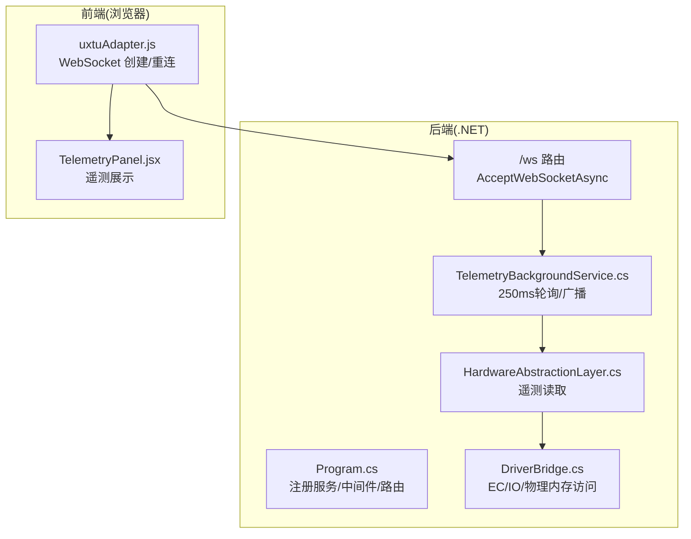
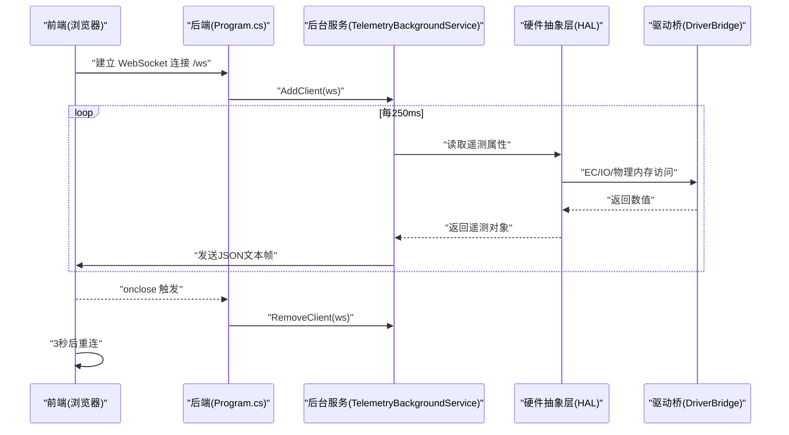
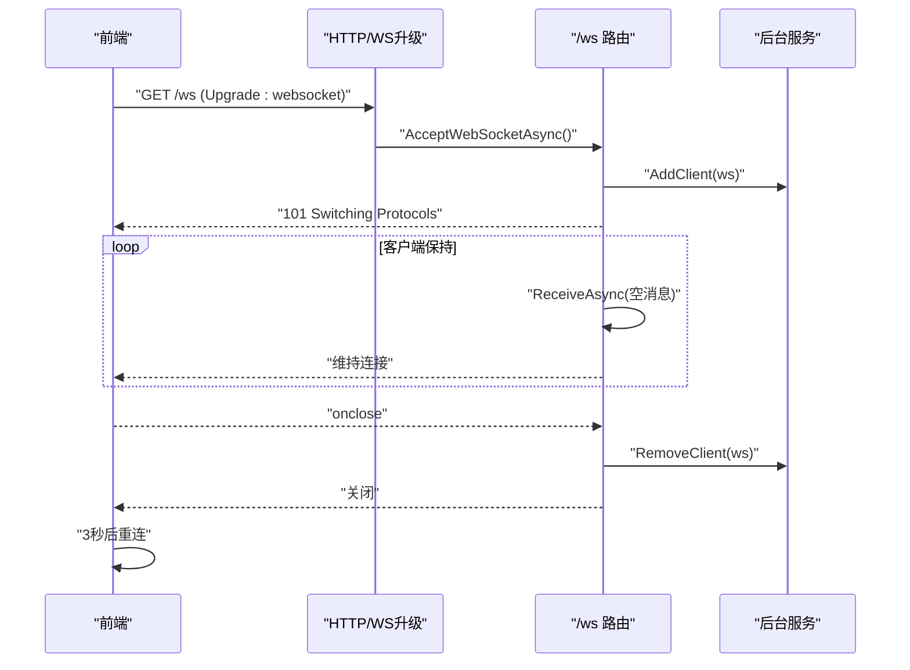
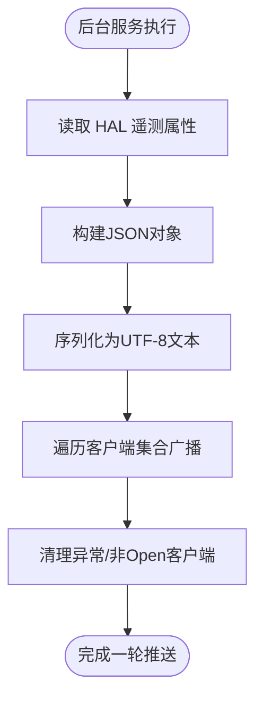
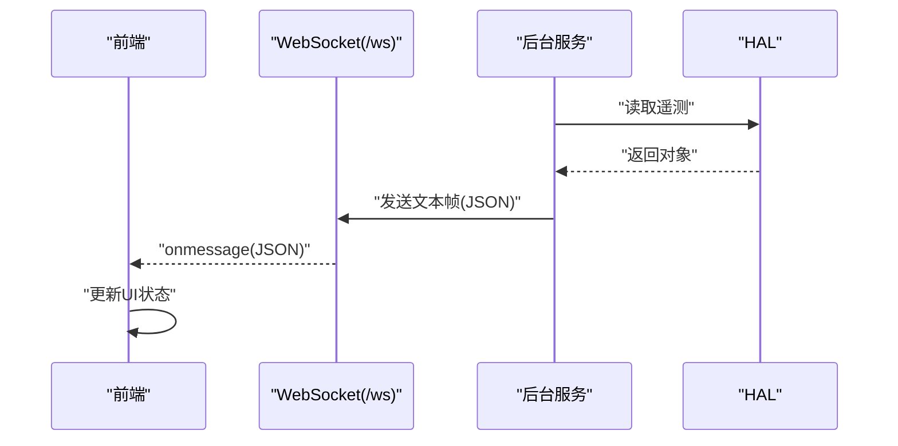
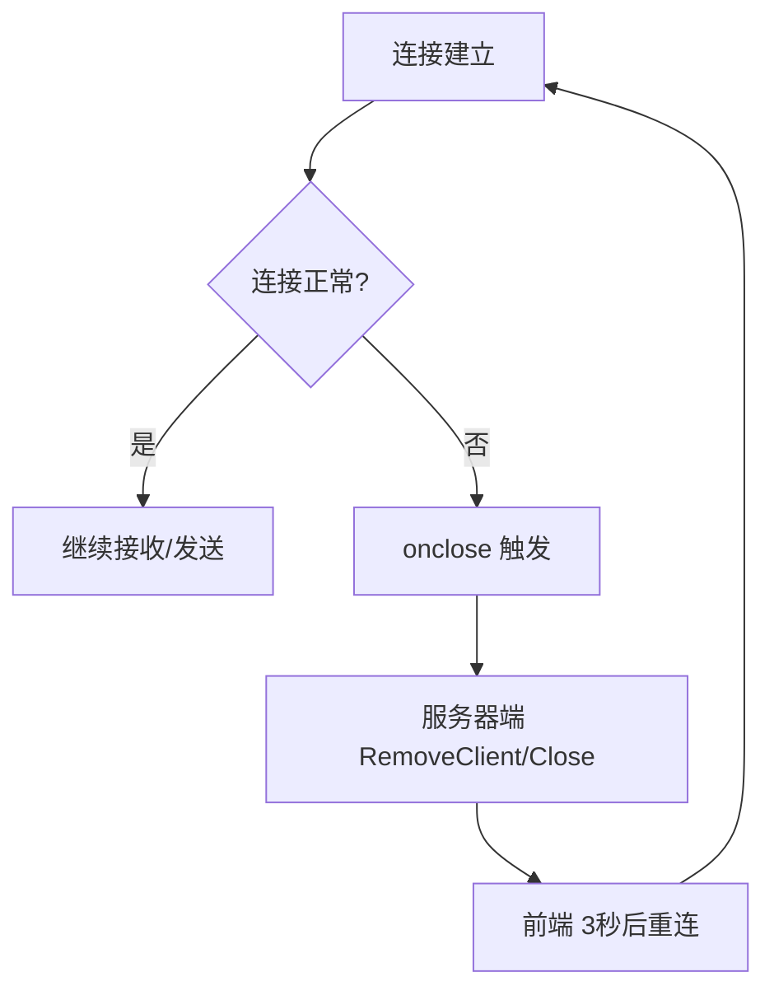
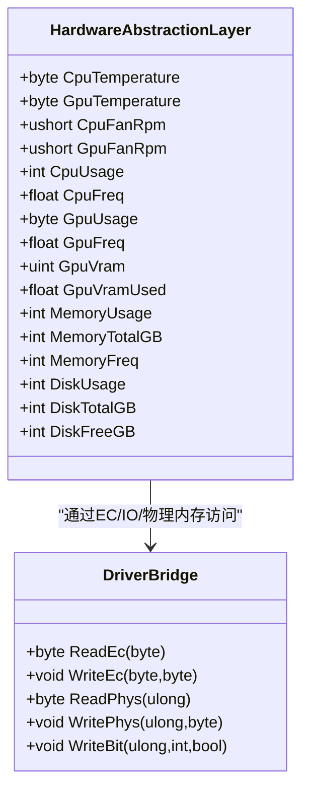
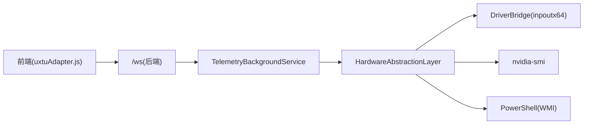

# WebSocket API

<cite>
**本文引用的文件**
- [Program.cs](file://server/api/Program.cs)
- [TelemetryBackgroundService.cs](file://server/api/TelemetryBackgroundService.cs)
- [uxtuAdapter.js](file://src/services/uxtuAdapter.js)
- [HardwareAbstractionLayer.cs](file://server/hal/HardwareAbstractionLayer.cs)
- [DriverBridge.cs](file://server/hal/DriverBridge.cs)
- [TelemetryPanel.jsx](file://src/components/panels/TelemetryPanel.jsx)
</cite>

## 目录
1. [简介](#简介)
2. [项目结构](#项目结构)
3. [核心组件](#核心组件)
4. [架构总览](#架构总览)
5. [详细组件分析](#详细组件分析)
6. [依赖关系分析](#依赖关系分析)
7. [性能考虑](#性能考虑)
8. [故障排查指南](#故障排查指南)
9. [结论](#结论)
10. [附录](#附录)

## 简介
本文件为 DOUZHANZHE-Control 的 WebSocket API 文档，聚焦于实时遥测数据通道的建立、握手协议、消息格式与订阅方式，以及心跳、重连与性能优化策略。该系统通过 C# 后端提供 WebSocket 服务，周期性采集硬件遥测并通过文本帧推送至前端；前端通过原生 WebSocket 订阅数据，并在断线时自动重连。

## 项目结构
- 后端（.NET/C#）负责：
  - 初始化硬件抽象层与后台遥测服务
  - 提供 /ws WebSocket 端点，接受连接并维护客户端集合
  - 每 250ms 读取遥测并广播给所有连接的客户端
- 前端（React/JS）负责：
  - 建立到本地 WebSocket 的连接
  - 解析 JSON 遥测消息并渲染仪表盘
  - 在断线时以指数退避策略重连

**图表来源**
- [Program.cs:15-22](file://server/api/Program.cs#L15-L22)
- [Program.cs:135-179](file://server/api/Program.cs#L135-L179)
- [TelemetryBackgroundService.cs:54-142](file://server/api/TelemetryBackgroundService.cs#L54-L142)
- [HardwareAbstractionLayer.cs:147-229](file://server/hal/HardwareAbstractionLayer.cs#L147-L229)
- [DriverBridge.cs:111-137](file://server/hal/DriverBridge.cs#L111-L137)
- [uxtuAdapter.js:58-71](file://src/services/uxtuAdapter.js#L58-L71)
- [TelemetryPanel.jsx:20-121](file://src/components/panels/TelemetryPanel.jsx#L20-L121)

**章节来源**
- [Program.cs:15-22](file://server/api/Program.cs#L15-L22)
- [Program.cs:135-179](file://server/api/Program.cs#L135-L179)
- [TelemetryBackgroundService.cs:54-142](file://server/api/TelemetryBackgroundService.cs#L54-L142)
- [HardwareAbstractionLayer.cs:147-229](file://server/hal/HardwareAbstractionLayer.cs#L147-L229)
- [DriverBridge.cs:111-137](file://server/hal/DriverBridge.cs#L111-L137)
- [uxtuAdapter.js:58-71](file://src/services/uxtuAdapter.js#L58-L71)
- [TelemetryPanel.jsx:20-121](file://src/components/panels/TelemetryPanel.jsx#L20-L121)

## 核心组件
- 后端 WebSocket 路由与生命周期管理
  - 使用 UseWebSockets() 启用 WebSocket 支持
  - /ws 路由中调用 AcceptWebSocketAsync 接受连接
  - 将 WebSocket 实例加入 TelemetryBackgroundService 的客户端集合
  - 循环接收空消息以维持连接，捕获异常后清理并关闭
- 后台遥测服务
  - 每 250ms 读取 HAL 遥测，序列化为 JSON 文本帧
  - 广播给所有处于 Open 状态的客户端
  - 对异常或非 Open 状态的客户端进行清理
- 硬件抽象层（HAL）
  - 提供 CPU/GPU 温度、风扇转速、使用率、频率、显存等遥测属性
  - 通过 DriverBridge 访问 EC、IO 端口与物理内存
- 前端适配器
  - 建立 ws://127.0.0.1:3100/ws 的 WebSocket 连接
  - onmessage 解析 JSON 并回调上层
  - onclose 自动 3 秒重连

**章节来源**
- [Program.cs:15-22](file://server/api/Program.cs#L15-L22)
- [Program.cs:135-179](file://server/api/Program.cs#L135-L179)
- [TelemetryBackgroundService.cs:54-142](file://server/api/TelemetryBackgroundService.cs#L54-L142)
- [HardwareAbstractionLayer.cs:147-229](file://server/hal/HardwareAbstractionLayer.cs#L147-L229)
- [DriverBridge.cs:111-137](file://server/hal/DriverBridge.cs#L111-L137)
- [uxtuAdapter.js:58-71](file://src/services/uxtuAdapter.js#L58-L71)

## 架构总览
WebSocket 数据流自 HAL 采集，经后台服务聚合后通过文本帧推送到所有已连接客户端。前端解析消息并渲染仪表盘，同时具备断线重连能力。

**图表来源**
- [Program.cs:135-179](file://server/api/Program.cs#L135-L179)
- [TelemetryBackgroundService.cs:54-142](file://server/api/TelemetryBackgroundService.cs#L54-L142)
- [HardwareAbstractionLayer.cs:147-229](file://server/hal/HardwareAbstractionLayer.cs#L147-L229)
- [DriverBridge.cs:111-137](file://server/hal/DriverBridge.cs#L111-L137)
- [uxtuAdapter.js:58-71](file://src/services/uxtuAdapter.js#L58-L71)

## 详细组件分析

### WebSocket 连接与握手
- 握手与路由
  - 后端启用 UseWebSockets()，/ws 路由调用 AcceptWebSocketAsync 接受连接
  - 将 WebSocket 加入全局客户端集合，用于后续广播
- 生命周期
  - 循环接收消息（空消息）以维持连接
  - 捕获 WebSocketException，收到 Close 消息或异常时清理并关闭
- 前端连接
  - 直连 ws://127.0.0.1:3100/ws
  - onclose 回调触发 3 秒后重连

**图表来源**
- [Program.cs:135-179](file://server/api/Program.cs#L135-L179)
- [uxtuAdapter.js:58-71](file://src/services/uxtuAdapter.js#L58-L71)

**章节来源**
- [Program.cs:135-179](file://server/api/Program.cs#L135-L179)
- [uxtuAdapter.js:58-71](file://src/services/uxtuAdapter.js#L58-L71)

### 遥测消息格式与字段
- 发送方式
  - 后台服务每 250ms 序列化一次全量遥测对象，发送为 UTF-8 文本帧
- 字段说明（均为数值型，单位见注释）
  - cpuUsage: CPU 使用率百分比
  - cpuTemp: CPU 温度（°C）
  - cpuFreq: CPU 频率（GHz）
  - cpuCores: CPU 核心数
  - gpuUsage: GPU 使用率百分比
  - gpuTemp: GPU 温度（°C）
  - gpuFreq: GPU 显存频率（MHz）
  - gpuVram: 显存总量（GiB）
  - gpuVramUsed: 显存使用量（GiB）
  - fanLargeRpm: 大风扇(CPU)转速（RPM）
  - fanSmallRpm: 小风扇(GPU)转速（RPM）
  - fanLargeMax: 大风扇最大理论值（RPM）
  - fanSmallMax: 小风扇最大理论值（RPM）
  - memoryUsage: 内存使用率百分比
  - memoryTotalGB: 内存总量（GB）
  - memoryFreq: 内存频率（MHz）
  - diskUsage: 磁盘使用率百分比
- 编码与命名
  - JSON 属性采用 camelCase 命名策略
  - 字段均为标量数值，无嵌套对象或数组

**图表来源**
- [TelemetryBackgroundService.cs:64-130](file://server/api/TelemetryBackgroundService.cs#L64-L130)

**章节来源**
- [TelemetryBackgroundService.cs:64-130](file://server/api/TelemetryBackgroundService.cs#L64-L130)
- [Program.cs:87-107](file://server/api/Program.cs#L87-L107)

### 客户端订阅与实时更新
- 订阅方式
  - 前端直接连接 ws://127.0.0.1:3100/ws，无需额外订阅指令
  - 服务器端不区分频道，同一消息广播给所有客户端
- 实时更新
  - 前端 onmessage 解析 JSON 并更新状态
  - UI 组件根据字段渲染仪表盘与曲线图

**图表来源**
- [uxtuAdapter.js:58-71](file://src/services/uxtuAdapter.js#L58-L71)
- [TelemetryBackgroundService.cs:104-130](file://server/api/TelemetryBackgroundService.cs#L104-L130)

**章节来源**
- [uxtuAdapter.js:58-71](file://src/services/uxtuAdapter.js#L58-L71)
- [TelemetryPanel.jsx:20-121](file://src/components/panels/TelemetryPanel.jsx#L20-L121)

### 心跳机制与断线重连
- 心跳
  - 后端通过循环 ReceiveAsync(空消息) 维持连接活跃
  - 未实现专用 ping/pong帧
- 断线与重连
  - 前端 onclose 回调触发，3 秒后重新连接
  - 服务器端 onclose 后清理客户端并关闭连接

**图表来源**
- [Program.cs:70-85](file://server/api/Program.cs#L70-L85)
- [uxtuAdapter.js:67-71](file://src/services/uxtuAdapter.js#L67-L71)

**章节来源**
- [Program.cs:70-85](file://server/api/Program.cs#L70-L85)
- [uxtuAdapter.js:67-71](file://src/services/uxtuAdapter.js#L67-L71)

### 硬件数据来源与可靠性
- HAL 提供的遥测字段来自不同源：
  - EC 寄存器：CPU/GPU 温度、风扇转速、散热模式等
  - WMI/子进程：CPU 使用率、频率、内存、磁盘、系统型号等
  - nvidia-smi：GPU 使用率、显存、显存频率
- 可靠性策略
  - 多源回退（如 GPU 温度物理内存失败时回退 nvidia-smi）
  - 防归零（nvidia-smi 偶发 0 时不覆盖已有有效值）
  - 缓存与去抖（部分指标按时间窗口缓存）

**图表来源**
- [HardwareAbstractionLayer.cs:147-229](file://server/hal/HardwareAbstractionLayer.cs#L147-L229)
- [DriverBridge.cs:111-137](file://server/hal/DriverBridge.cs#L111-L137)

**章节来源**
- [HardwareAbstractionLayer.cs:147-229](file://server/hal/HardwareAbstractionLayer.cs#L147-L229)
- [DriverBridge.cs:111-137](file://server/hal/DriverBridge.cs#L111-L137)

## 依赖关系分析
- 组件耦合
  - Program.cs 依赖 TelemetryBackgroundService 与 HAL/WMI
  - TelemetryBackgroundService 依赖 HAL 与 WMI 接口
  - 前端仅依赖本地 WebSocket 服务，耦合度低
- 外部依赖
  - inpoutx64 驱动（通过 DriverBridge 访问 IO/物理内存）
  - nvidia-smi（GPU 遥测回退）
  - PowerShell（WMI 查询）

**图表来源**
- [Program.cs:15-22](file://server/api/Program.cs#L15-L22)
- [TelemetryBackgroundService.cs:17-40](file://server/api/TelemetryBackgroundService.cs#L17-L40)
- [HardwareAbstractionLayer.cs:147-229](file://server/hal/HardwareAbstractionLayer.cs#L147-L229)
- [DriverBridge.cs:111-137](file://server/hal/DriverBridge.cs#L111-L137)

**章节来源**
- [Program.cs:15-22](file://server/api/Program.cs#L15-L22)
- [TelemetryBackgroundService.cs:17-40](file://server/api/TelemetryBackgroundService.cs#L17-L40)
- [HardwareAbstractionLayer.cs:147-229](file://server/hal/HardwareAbstractionLayer.cs#L147-L229)
- [DriverBridge.cs:111-137](file://server/hal/DriverBridge.cs#L111-L137)

## 性能考虑
- 推送频率
  - 每 250ms 推送一次，适合实时监控场景
- 序列化与传输
  - 使用 UTF-8 文本帧，字段均为标量，体积较小
- 客户端清理
  - 对非 Open 状态或异常客户端及时清理，避免阻塞广播
- 前端渲染
  - 建议在 UI 层做节流/防抖，避免频繁重绘
- 硬件访问
  - HAL 对高频查询做了缓存与去抖，减少系统调用
- 建议
  - 如需降低带宽，可考虑按需订阅或分频道推送
  - 增加 ping/pong 帧提升长连接稳定性
  - 对高刷新率图表使用采样策略

[本节为通用建议，不直接分析具体文件]

## 故障排查指南
- 无法建立 WebSocket 连接
  - 检查后端是否正确启用 UseWebSockets() 与 /ws 路由
  - 确认前端连接地址为 ws://127.0.0.1:3100/ws
- 连接被立即关闭
  - 查看后端 onclose 分支是否抛出异常或收到 Close 消息
  - 确保前端未主动关闭连接
- 遥测数据为空或为 0
  - 检查 HAL 的 HealthCheck 与 DriverBridge 初始化状态
  - 确认 nvidia-smi 与 PowerShell 可用
- 前端未收到消息
  - 检查 onmessage 是否正确解析 JSON
  - 确认后台服务正在广播（日志与断点）

**章节来源**
- [Program.cs:15-22](file://server/api/Program.cs#L15-L22)
- [Program.cs:135-179](file://server/api/Program.cs#L135-L179)
- [Program.cs:70-85](file://server/api/Program.cs#L70-L85)
- [TelemetryBackgroundService.cs:104-130](file://server/api/TelemetryBackgroundService.cs#L104-L130)
- [HardwareAbstractionLayer.cs:753-765](file://server/hal/HardwareAbstractionLayer.cs#L753-L765)
- [DriverBridge.cs:39-62](file://server/hal/DriverBridge.cs#L39-L62)
- [uxtuAdapter.js:58-71](file://src/services/uxtuAdapter.js#L58-L71)

## 结论
本 WebSocket API 以极简设计实现了稳定的实时遥测推送：后端每 250ms 采集并广播，前端直连本地服务并在断线时自动重连。消息格式清晰、字段明确，便于扩展与集成。建议在未来引入 ping/pong、订阅/频道与更细粒度的数据压缩以进一步提升稳定性与性能。

[本节为总结，不直接分析具体文件]

## 附录

### API 定义概览
- 路由
  - GET /ws：WebSocket 升级，接受连接并维持
  - GET /api/telemetry：HTTP JSON 遥测（一次性）
- 请求头
  - 无特殊要求，/ws 为标准 WebSocket 升级
- 响应体
  - /ws：文本帧，JSON 对象（见“遥测消息格式与字段”）
  - /api/telemetry：JSON 对象（一次性）

**章节来源**
- [Program.cs:135-179](file://server/api/Program.cs#L135-L179)
- [Program.cs:87-107](file://server/api/Program.cs#L87-L107)

### 前端接入要点
- 连接地址：ws://127.0.0.1:3100/ws
- 消息解析：onmessage 中 JSON.parse
- 错误处理：onerror 回调
- 断线重连：onclose 回调中 3 秒重连

**章节来源**
- [uxtuAdapter.js:58-71](file://src/services/uxtuAdapter.js#L58-L71)