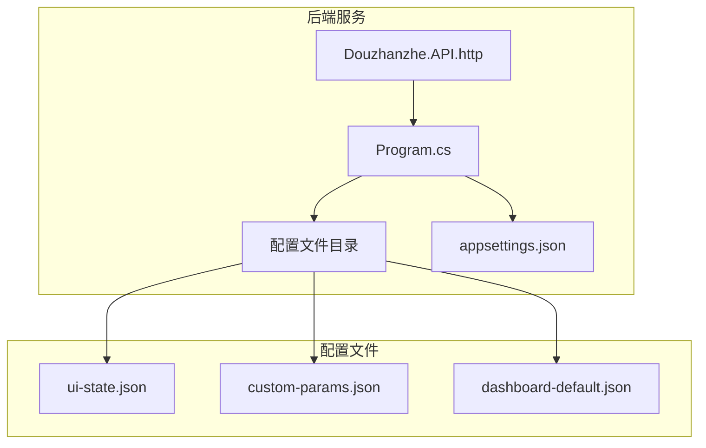
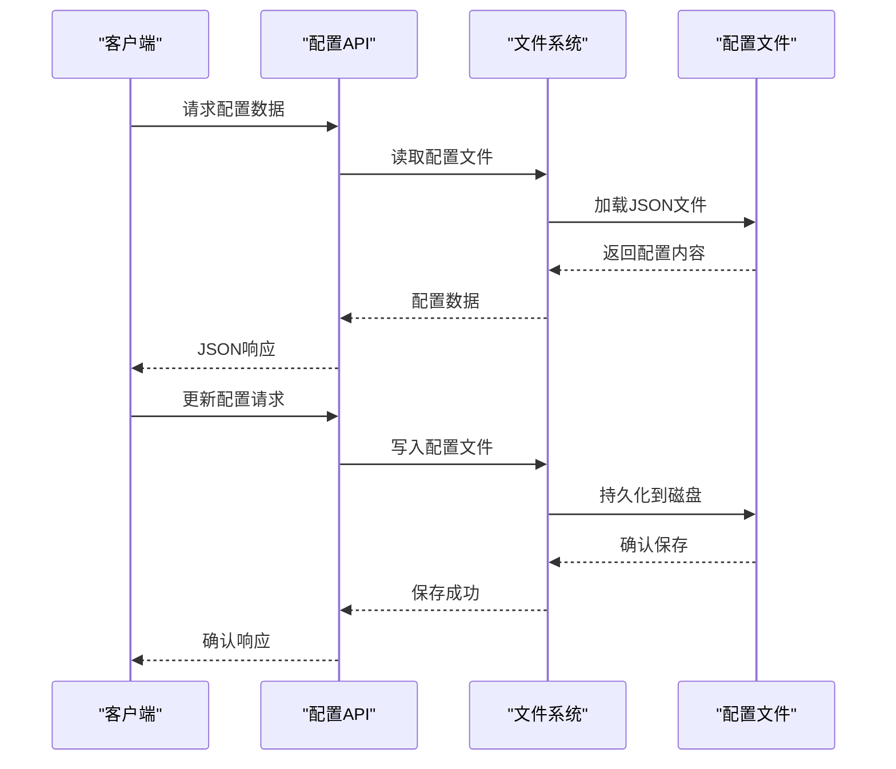
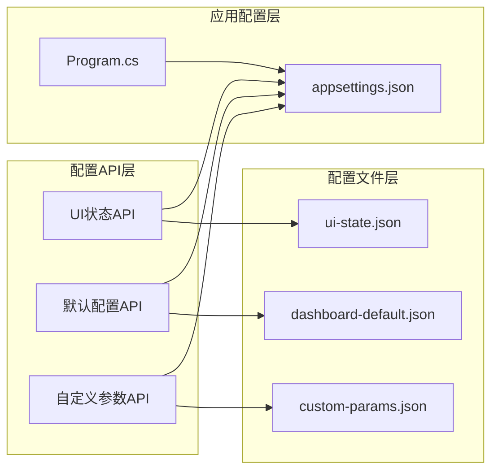

# 配置管理API

<cite>
**本文档引用的文件**
- [Douzhanzhe.API.http](file://server/api/Douzhanzhe.API.http)
- [Program.cs](file://server/api/Program.cs)
- [appsettings.json](file://server/api/appsettings.json)
- [ui-state.json](file://server/api/config/ui-state.json)
- [custom-params.json](file://server/api/config/custom-params.json)
- [dashboard-default.json](file://server/config/dashboard-default.json)
</cite>

## 目录
1. [简介](#简介)
2. [项目结构](#项目结构)
3. [核心组件](#核心组件)
4. [架构概览](#架构概览)
5. [详细组件分析](#详细组件分析)
6. [依赖关系分析](#依赖关系分析)
7. [性能考虑](#性能考虑)
8. [故障排除指南](#故障排除指南)
9. [结论](#结论)
10. [附录](#附录)

## 简介
本文件为 DOUZHANZHE-Control 的配置管理API提供完整技术文档。重点覆盖以下配置相关端点：
- 用户界面状态管理API：/api/ui-state
- 默认配置API：/api/default-config  
- 自定义参数API：/api/custom-params

文档详细说明配置文件的存储格式、读写机制和持久化策略；解释配置项的数据结构、验证规则和默认值处理；提供配置管理的最佳实践，包括配置备份、迁移和版本控制；并涵盖配置API的安全考虑和访问控制。

## 项目结构
配置管理相关的后端实现位于 server/api 目录，前端配置数据位于 server/config 和 server/api/config 目录中。主要文件包括：
- HTTP接口定义：Douzhanzhe.API.http
- 应用程序入口：Program.cs
- 配置文件：ui-state.json、custom-params.json、dashboard-default.json
- 运行时配置：appsettings.json



**图表来源**
- [Douzhanzhe.API.http](file://server/api/Douzhanzhe.API.http)
- [Program.cs](file://server/api/Program.cs)
- [appsettings.json](file://server/api/appsettings.json)

**章节来源**
- [Douzhanzhe.API.http](file://server/api/Douzhanzhe.API.http)
- [Program.cs](file://server/api/Program.cs)
- [appsettings.json](file://server/api/appsettings.json)

## 核心组件
配置管理API的核心组件包括：

### 配置文件系统
- **UI状态配置**：存储用户界面布局和状态信息
- **自定义参数配置**：存储用户自定义的系统参数
- **默认配置**：提供系统默认设置模板

### API端点架构
- 基于HTTP的RESTful接口设计
- JSON格式的数据交换
- 文件系统持久化机制

**章节来源**
- [ui-state.json](file://server/api/config/ui-state.json)
- [custom-params.json](file://server/api/config/custom-params.json)
- [dashboard-default.json](file://server/config/dashboard-default.json)

## 架构概览
配置管理采用分层架构设计，通过HTTP接口与文件系统交互：



**图表来源**
- [Douzhanzhe.API.http](file://server/api/Douzhanzhe.API.http)
- [Program.cs](file://server/api/Program.cs)

## 详细组件分析

### 用户界面状态管理API (/api/ui-state)
该API负责管理用户的界面布局和状态配置。

#### 数据结构
UI状态配置包含以下核心字段：
- 布局信息：面板位置、大小和可见性
- 用户偏好：主题选择、语言设置
- 会话状态：上次打开的页面、窗口尺寸

#### 读写机制
- **读取流程**：从 ui-state.json 文件加载配置
- **更新流程**：验证数据完整性后写入文件
- **默认处理**：若文件不存在，使用默认配置模板

#### 验证规则
- 字段类型验证（字符串、数字、布尔值）
- 范围检查（数值参数的合理范围）
- 结构完整性检查（必需字段的存在性）

**章节来源**
- [ui-state.json](file://server/api/config/ui-state.json)

### 默认配置API (/api/default-config)
提供系统默认配置的获取和重置功能。

#### 配置模板
默认配置来源于 dashboard-default.json 文件，包含：
- 系统基准设置
- 性能优化参数
- 安全策略配置

#### 处理逻辑
- 获取默认配置：返回预定义的配置模板
- 重置配置：将当前配置恢复到默认状态
- 版本兼容：支持配置格式的向后兼容

**章节来源**
- [dashboard-default.json](file://server/config/dashboard-default.json)

### 自定义参数API (/api/custom-params)
管理用户自定义的系统参数配置。

#### 参数类型
- 性能参数：风扇曲线、温度阈值
- 行为设置：自动模式、节能策略
- 界面定制：显示选项、快捷键配置

#### 数据验证
- 类型安全：确保参数值符合预期类型
- 业务规则：参数值在有效范围内
- 依赖关系：相关参数的一致性检查

**章节来源**
- [custom-params.json](file://server/api/config/custom-params.json)

### 配置文件存储机制

#### 存储格式
所有配置文件采用JSON格式存储，具有以下特点：
- 结构化数据表示
- 轻量级文件体积
- 跨平台兼容性
- 易于人类阅读和编辑

#### 持久化策略
- **原子写入**：先写入临时文件，确认成功后再替换原文件
- **备份机制**：重要配置变更前创建备份副本
- **错误恢复**：写入失败时回滚到上一个有效版本

#### 文件组织
```
server/
├── api/config/          # 运行时配置
│   ├── ui-state.json    # UI状态
│   └── custom-params.json # 自定义参数
└── config/              # 默认配置
    └── dashboard-default.json
```

**章节来源**
- [ui-state.json](file://server/api/config/ui-state.json)
- [custom-params.json](file://server/api/config/custom-params.json)
- [dashboard-default.json](file://server/config/dashboard-default.json)

## 依赖关系分析



**图表来源**
- [Douzhanzhe.API.http](file://server/api/Douzhanzhe.API.http)
- [Program.cs](file://server/api/Program.cs)
- [appsettings.json](file://server/api/appsettings.json)

### 外部依赖
- **文件系统IO**：配置文件的读写操作
- **JSON序列化**：配置数据的序列化和反序列化
- **运行时环境**：应用程序的配置和环境变量

**章节来源**
- [Douzhanzhe.API.http](file://server/api/Douzhanzhe.API.http)
- [Program.cs](file://server/api/Program.cs)
- [appsettings.json](file://server/api/appsettings.json)

## 性能考虑
配置管理API的性能优化策略：

### 缓存机制
- **内存缓存**：热点配置文件驻留在内存中
- **文件监控**：监听配置文件变化，及时更新缓存
- **懒加载**：按需加载不常用的配置文件

### 并发控制
- **读写锁**：并发读取时的无阻塞访问
- **事务性写入**：批量配置更新的原子性保证
- **队列处理**：高并发场景下的请求排队

### I/O优化
- **批量操作**：支持一次请求更新多个配置项
- **增量更新**：只传输变更的配置部分
- **压缩传输**：大配置文件的压缩传输

## 故障排除指南

### 常见问题及解决方案

#### 配置文件损坏
**症状**：API返回解析错误或配置丢失
**解决**：
1. 检查JSON语法正确性
2. 使用备份文件恢复
3. 重新生成默认配置

#### 权限问题
**症状**：无法读取或写入配置文件
**解决**：
1. 检查文件权限设置
2. 确认应用程序有足够权限
3. 以管理员身份运行

#### 并发冲突
**症状**：配置更新相互覆盖
**解决**：
1. 实施乐观锁机制
2. 使用版本号控制
3. 增加重试和回退逻辑

### 调试工具
- **日志记录**：详细的配置操作日志
- **健康检查**：配置文件完整性验证
- **性能监控**：配置API的响应时间统计

**章节来源**
- [Program.cs](file://server/api/Program.cs)
- [appsettings.json](file://server/api/appsettings.json)

## 结论
DOUZHANZHE-Control的配置管理API提供了完整的配置生命周期管理能力。通过文件系统持久化、严格的验证机制和灵活的API设计，实现了可靠的配置管理功能。建议在生产环境中实施适当的备份策略和安全控制，以确保配置数据的完整性和安全性。

## 附录

### API端点规范
- **GET /api/ui-state**：获取当前UI状态配置
- **PUT /api/ui-state**：更新UI状态配置
- **GET /api/default-config**：获取默认配置模板
- **POST /api/default-config**：重置为默认配置
- **GET /api/custom-params**：获取自定义参数
- **PUT /api/custom-params**：更新自定义参数

### 安全最佳实践
- **访问控制**：基于角色的权限验证
- **数据加密**：敏感配置的加密存储
- **审计日志**：配置变更的完整记录
- **输入验证**：防止恶意配置注入

### 版本管理策略
- **语义化版本**：配置格式的版本控制
- **向后兼容**：新旧配置格式的兼容处理
- **迁移脚本**：自动化的配置升级工具