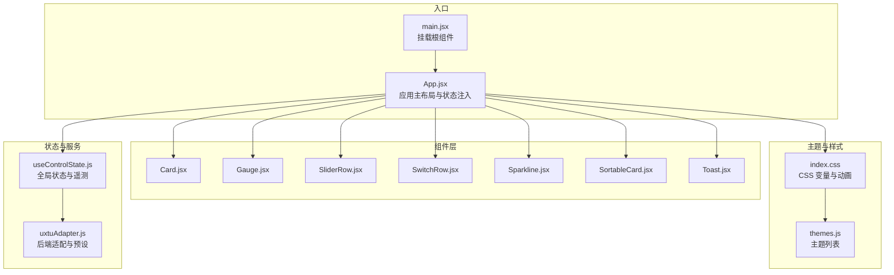
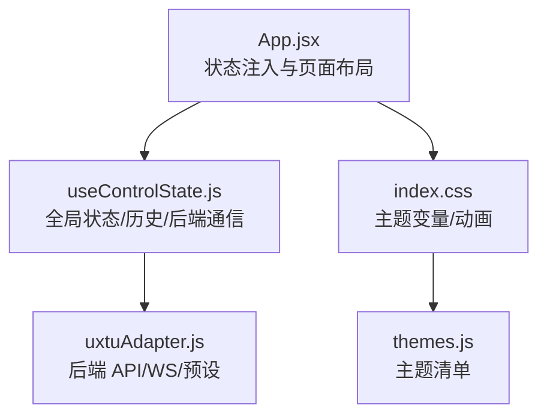
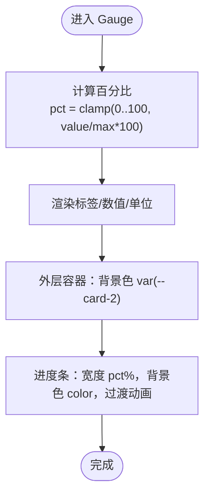
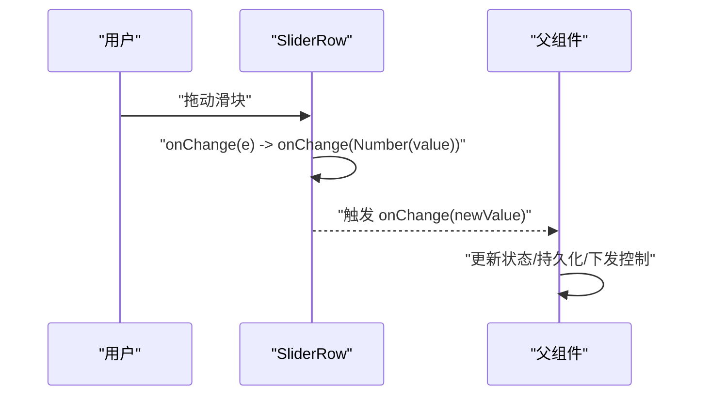
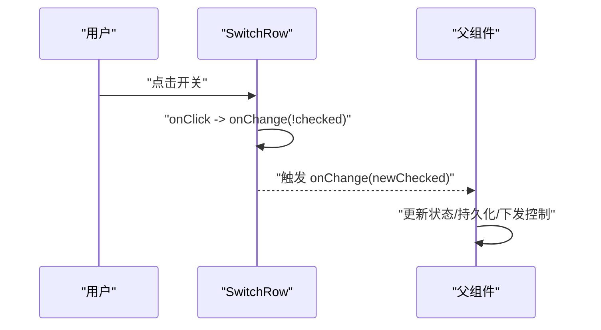
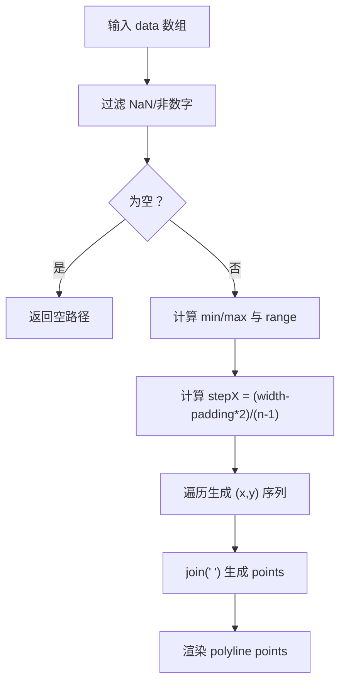
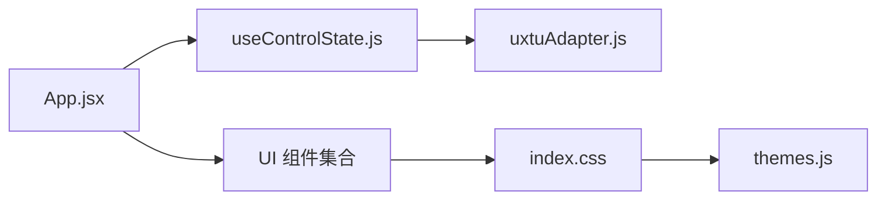

# UI组件库

<cite>
**本文引用的文件**
- [Gauge.jsx](file://src/components/ui/Gauge.jsx)
- [Card.jsx](file://src/components/ui/Card.jsx)
- [SliderRow.jsx](file://src/components/ui/SliderRow.jsx)
- [SwitchRow.jsx](file://src/components/ui/SwitchRow.jsx)
- [Sparkline.jsx](file://src/components/ui/Sparkline.jsx)
- [SortableCard.jsx](file://src/components/ui/SortableCard.jsx)
- [Toast.jsx](file://src/components/ui/Toast.jsx)
- [useControlState.js](file://src/hooks/useControlState.js)
- [uxtuAdapter.js](file://src/services/uxtuAdapter.js)
- [themes.js](file://src/data/themes.js)
- [index.css](file://src/index.css)
- [main.jsx](file://src/main.jsx)
- [App.jsx](file://src/App.jsx)
</cite>

## 目录
1. [简介](#简介)
2. [项目结构](#项目结构)
3. [核心组件](#核心组件)
4. [架构总览](#架构总览)
5. [组件详解](#组件详解)
6. [依赖关系分析](#依赖关系分析)
7. [性能考量](#性能考量)
8. [故障排查指南](#故障排查指南)
9. [结论](#结论)
10. [附录](#附录)

## 简介
本文件为 UI 组件库的组件级文档，聚焦以下组件的设计理念、属性接口与使用方法：
- 仪表组件 Gauge：基于 SVG 的进度指示器，支持颜色与单位定制、百分比计算与过渡动画。
- 表单控件：SliderRow（滑块行）、SwitchRow（开关行），涵盖状态管理与事件处理。
- 图表组件：Sparkline（迷你折线图），包含点位生成、归一化与 SVG 渲染。
- 布局与容器：Card（卡片）、SortableCard（可拖拽卡片）。
- 通知与主题：Toast（全局提示）、主题系统（CSS 变量与多主题）。

同时提供定制指南、样式覆盖方法、无障碍访问建议以及最佳实践。

## 项目结构
前端采用 React + TailwindCSS 架构，组件位于 src/components/ui，业务状态通过自定义 Hook 管理，主题与样式集中于 index.css，并通过 App.jsx 注入到根节点。

**图表来源**
- [main.jsx:1-14](file://src/main.jsx#L1-L14)
- [App.jsx:1-134](file://src/App.jsx#L1-L134)
- [Card.jsx:1-18](file://src/components/ui/Card.jsx#L1-L18)
- [Gauge.jsx:1-21](file://src/components/ui/Gauge.jsx#L1-L21)
- [SliderRow.jsx:1-23](file://src/components/ui/SliderRow.jsx#L1-L23)
- [SwitchRow.jsx:1-21](file://src/components/ui/SwitchRow.jsx#L1-L21)
- [Sparkline.jsx:1-40](file://src/components/ui/Sparkline.jsx#L1-L40)
- [SortableCard.jsx:1-43](file://src/components/ui/SortableCard.jsx#L1-L43)
- [Toast.jsx:1-50](file://src/components/ui/Toast.jsx#L1-L50)
- [useControlState.js:1-355](file://src/hooks/useControlState.js#L1-L355)
- [uxtuAdapter.js:1-130](file://src/services/uxtuAdapter.js#L1-L130)
- [themes.js:1-34](file://src/data/themes.js#L1-L34)
- [index.css:1-460](file://src/index.css#L1-L460)

**章节来源**
- [main.jsx:1-14](file://src/main.jsx#L1-L14)
- [App.jsx:1-134](file://src/App.jsx#L1-L134)
- [index.css:1-460](file://src/index.css#L1-L460)

## 核心组件
- Card：卡片容器，支持标题、操作区与内容区，统一使用 CSS 变量实现主题色。
- Gauge：数值仪表，显示标签、数值与单位，内部计算百分比并在条形槽中展示进度。
- SliderRow：带单位显示的滑块行，支持禁用态与自定义步进。
- SwitchRow：圆角开关，支持点击切换状态。
- Sparkline：迷你折线图，对输入序列进行归一化并生成 SVG 折线。
- SortableCard：可拖拽卡片包装器，提供拖拽句柄与隐藏按钮。
- Toast：全局提示，支持成功/错误/信息三类类型与自动消失。

**章节来源**
- [Card.jsx:1-18](file://src/components/ui/Card.jsx#L1-L18)
- [Gauge.jsx:1-21](file://src/components/ui/Gauge.jsx#L1-L21)
- [SliderRow.jsx:1-23](file://src/components/ui/SliderRow.jsx#L1-L23)
- [SwitchRow.jsx:1-21](file://src/components/ui/SwitchRow.jsx#L1-L21)
- [Sparkline.jsx:1-40](file://src/components/ui/Sparkline.jsx#L1-L40)
- [SortableCard.jsx:1-43](file://src/components/ui/SortableCard.jsx#L1-L43)
- [Toast.jsx:1-50](file://src/components/ui/Toast.jsx#L1-L50)

## 架构总览
组件库围绕“主题变量 + 自定义 Hook + 服务适配”的架构组织，主题通过 CSS 变量在运行时切换，全局状态由 useControlState 提供，后端能力通过 uxtuAdapter 封装。

**图表来源**
- [App.jsx:1-134](file://src/App.jsx#L1-L134)
- [useControlState.js:1-355](file://src/hooks/useControlState.js#L1-L355)
- [uxtuAdapter.js:1-130](file://src/services/uxtuAdapter.js#L1-L130)
- [index.css:1-460](file://src/index.css#L1-L460)
- [themes.js:1-34](file://src/data/themes.js#L1-L34)

## 组件详解

### Gauge 仪表组件
- 设计理念
  - 使用纯 HTML/CSS 实现进度条，避免引入重型图表库。
  - 通过 CSS 变量与内联样式实现颜色与边框主题化。
- 属性接口
  - label：字符串，仪表标签文本。
  - value：数字，当前值。
  - unit：字符串，默认“%”，数值后缀。
  - color：CSS 变量或颜色值，默认“var(--primary)”。
  - max：数字，默认 100，用于计算百分比。
- 数据绑定与动画
  - 百分比计算：当 max > 0 时，将 value 归一化到 0~100；否则为 0。
  - 进度条宽度通过 transition-all 实现平滑过渡。
- 使用建议
  - 与 useControlState 的 telemetry 结合，动态更新 value。
  - 通过 color 覆盖主题色，保持与整体风格一致。

**图表来源**
- [Gauge.jsx:1-21](file://src/components/ui/Gauge.jsx#L1-L21)

**章节来源**
- [Gauge.jsx:1-21](file://src/components/ui/Gauge.jsx#L1-L21)

### SliderRow 滑块行
- 设计理念
  - 将标签与滑块组合为一行，右侧显示当前值与单位，支持禁用态。
- 属性接口
  - label：标签文本。
  - value：当前值。
  - min/max：范围边界。
  - step：步进，默认 1。
  - onChange：回调，接收转换后的数值。
  - unit：单位字符串。
  - displayValue：自定义显示值（如“自动”）。
  - disabled：是否禁用。
- 交互设计
  - 输入变更时将事件值转换为数字并回调 onChange。
  - 禁用态降低透明度并改变光标。
- 最佳实践
  - 对外部传入的 onChange 进行防抖或节流，避免频繁触发后端。
  - 当 displayValue 为特殊文案时，避免拼接单位。

**图表来源**
- [SliderRow.jsx:1-23](file://src/components/ui/SliderRow.jsx#L1-L23)

**章节来源**
- [SliderRow.jsx:1-23](file://src/components/ui/SliderRow.jsx#L1-L23)

### SwitchRow 开关行
- 设计理念
  - 圆角开关，通过 transform 与 transition 实现滑动动画。
- 属性接口
  - label：标签文本。
  - checked：布尔，开关状态。
  - onChange：回调，接收翻转后的状态。
- 交互设计
  - 点击按钮触发状态翻转，背景与球体位置随状态变化。
- 最佳实践
  - 在 onChange 中同步更新本地与远端状态，必要时加入确认或撤销。
  - 为无障碍考虑，可添加 aria-checked 与键盘支持。

**图表来源**
- [SwitchRow.jsx:1-21](file://src/components/ui/SwitchRow.jsx#L1-L21)

**章节来源**
- [SwitchRow.jsx:1-21](file://src/components/ui/SwitchRow.jsx#L1-L21)

### Sparkline 折线图
- 设计理念
  - 以 SVG polyline 绘制迷你折线，适合展示短期趋势。
- 属性接口
  - data：数值数组，支持 NaN/非数字过滤。
  - title：标题文本。
  - color：折线颜色。
- 渲染机制
  - buildPoints：清理无效值，计算最小/最大与范围，按索引均匀分布 x，按归一化映射 y。
  - 固定画布尺寸与内边距，保证不同长度数组的一致性。
- 性能优化
  - 仅在 data 变化时重新计算 points，避免重复计算。
  - 使用 strokeLinejoin="round" 平滑连接点。
- 最佳实践
  - 传入固定长度的历史数组，便于对比趋势。
  - 与 useControlState 的 history 结合，滚动更新。

**图表来源**
- [Sparkline.jsx:1-40](file://src/components/ui/Sparkline.jsx#L1-L40)

**章节来源**
- [Sparkline.jsx:1-40](file://src/components/ui/Sparkline.jsx#L1-L40)

### Card 卡片
- 设计理念
  - 统一的圆角与边框，标题区与内容区分离，支持自定义 className 与 bodyClassName。
- 属性接口
  - title：标题文本。
  - children：内容区域。
  - action：操作区（如按钮）。
  - className/bodyClassName：扩展样式。
- 使用建议
  - 与 SortableCard 组合实现可拖拽卡片。
  - 在主题切换时保持背景与边框一致性。

**章节来源**
- [Card.jsx:1-18](file://src/components/ui/Card.jsx#L1-L18)

### SortableCard 可拖拽卡片
- 设计理念
  - 基于 @dnd-kit 的可拖拽包装器，提供拖拽手柄与隐藏按钮。
- 属性接口
  - id：拖拽键。
  - children：被包装的内容。
  - editMode：编辑模式开关。
  - onHide：隐藏回调。
- 交互设计
  - 拖拽时降低透明度并提升层级，增强反馈。
  - 编辑模式下显示拖拽手柄与隐藏按钮。
- 最佳实践
  - 将 SortableCard 与 Dashboard 的排序逻辑结合，持久化顺序。

**章节来源**
- [SortableCard.jsx:1-43](file://src/components/ui/SortableCard.jsx#L1-L43)

### Toast 全局提示
- 设计理念
  - Provider 模式提供全局提示上下文，右下角浮动展示。
- 属性接口
  - children：子树。
- 方法
  - useToast：返回添加提示的函数，支持 message、type、duration。
- 类型与样式
  - error：红色；success：绿色；info：蓝色。
  - 支持点击关闭与自动消失。
- 最佳实践
  - 成功/失败结果通过 onCustomSaveResult 等回调统一提示。
  - 控制提示时长，避免遮挡关键信息。

**章节来源**
- [Toast.jsx:1-50](file://src/components/ui/Toast.jsx#L1-L50)

## 依赖关系分析
- 组件间依赖
  - App.jsx 注入 useControlState 提供的状态给各面板与控件。
  - Card、Gauge、SliderRow、SwitchRow、Sparkline、SortableCard、Toast 均为无副作用纯组件，依赖 props 与 CSS 变量。
- 外部依赖
  - uxtuAdapter 提供后端 API 与 WebSocket，被 useControlState 使用。
  - themes.js 与 index.css 提供主题列表与 CSS 变量，App.jsx 将主题类名同步到 body。

**图表来源**
- [App.jsx:1-134](file://src/App.jsx#L1-L134)
- [useControlState.js:1-355](file://src/hooks/useControlState.js#L1-L355)
- [uxtuAdapter.js:1-130](file://src/services/uxtuAdapter.js#L1-L130)
- [index.css:1-460](file://src/index.css#L1-L460)
- [themes.js:1-34](file://src/data/themes.js#L1-L34)

**章节来源**
- [App.jsx:1-134](file://src/App.jsx#L1-L134)
- [useControlState.js:1-355](file://src/hooks/useControlState.js#L1-L355)
- [uxtuAdapter.js:1-130](file://src/services/uxtuAdapter.js#L1-L130)
- [index.css:1-460](file://src/index.css#L1-L460)
- [themes.js:1-34](file://src/data/themes.js#L1-L34)

## 性能考量
- Sparkline
  - 计算复杂度 O(n)，建议传入固定长度数组，减少 DOM 重排。
  - 使用 useMemo 缓存 points，避免重复计算。
- SliderRow/SwitchRow
  - onChange 回调应做防抖/节流，减少后端压力。
- Gauge
  - 百分比计算与过渡动画开销低，适合高频更新。
- Toast
  - 自动消失与点击关闭避免内存泄漏，注意控制数量与时长。
- 主题切换
  - 通过 CSS 变量与类名切换，避免重绘大范围区域。

[本节为通用性能建议，不直接分析具体文件]

## 故障排查指南
- 组件未按预期渲染
  - 检查 props 是否正确传递（如 SliderRow 的 onChange 类型）。
  - 确认 CSS 变量是否生效（index.css 中 --card、--border 等）。
- 主题切换无效
  - 确认 App.jsx 已将主题类名同步到 body。
  - 检查 themes.js 中是否存在对应主题 ID。
- 滑块/开关无响应
  - 确认 disabled 与事件回调未被意外覆盖。
- 折线图不显示
  - 检查 data 是否为空或全为 NaN；确保传入数组长度大于 0。
- 后端通信异常
  - 查看 uxtuAdapter 的 fetch/WS 错误与超时重试逻辑。
- 保存/下发失败
  - 使用 Toast 提示错误信息，检查网络与权限。

**章节来源**
- [index.css:1-460](file://src/index.css#L1-L460)
- [App.jsx:1-134](file://src/App.jsx#L1-L134)
- [uxtuAdapter.js:1-130](file://src/services/uxtuAdapter.js#L1-L130)
- [Toast.jsx:1-50](file://src/components/ui/Toast.jsx#L1-L50)

## 结论
该 UI 组件库以简洁、主题化与可定制为核心，通过 CSS 变量与纯组件实现高一致性与低耦合。Gauge、SliderRow、SwitchRow、Sparkline 等组件覆盖了仪表盘与设置面板的主要需求，配合 SortableCard 与 Toast 提升了可操作性与可用性。建议在生产环境中结合防抖/节流与缓存策略进一步优化性能，并完善无障碍支持。

[本节为总结性内容，不直接分析具体文件]

## 附录

### 组件属性速查表
- Gauge
  - label, value, unit, color, max
- SliderRow
  - label, value, min, max, step, onChange, unit, displayValue, disabled
- SwitchRow
  - label, checked, onChange
- Sparkline
  - data, title, color
- Card
  - title, children, action, className, bodyClassName
- SortableCard
  - id, children, editMode, onHide
- Toast
  - children；useToast(message, type, duration)

**章节来源**
- [Gauge.jsx:1-21](file://src/components/ui/Gauge.jsx#L1-L21)
- [SliderRow.jsx:1-23](file://src/components/ui/SliderRow.jsx#L1-L23)
- [SwitchRow.jsx:1-21](file://src/components/ui/SwitchRow.jsx#L1-L21)
- [Sparkline.jsx:1-40](file://src/components/ui/Sparkline.jsx#L1-L40)
- [Card.jsx:1-18](file://src/components/ui/Card.jsx#L1-L18)
- [SortableCard.jsx:1-43](file://src/components/ui/SortableCard.jsx#L1-L43)
- [Toast.jsx:1-50](file://src/components/ui/Toast.jsx#L1-L50)

### 样式覆盖与主题定制
- 覆盖方式
  - 通过 CSS 变量覆盖 index.css 中的主题变量，实现全局替换。
  - 使用 className 与 body 类名切换主题。
- 建议
  - 优先使用 CSS 变量而非硬编码颜色。
  - 为关键组件提供默认的 hover/focus/active 状态样式。

**章节来源**
- [index.css:1-460](file://src/index.css#L1-L460)
- [themes.js:1-34](file://src/data/themes.js#L1-L34)
- [App.jsx:1-134](file://src/App.jsx#L1-L134)

### 无障碍访问建议
- 滑块与开关
  - 添加 aria-label/aria-describedby 提升屏幕阅读器体验。
  - 支持键盘操作（Space/Toggle）。
- 卡片与按钮
  - 使用语义化标签与可聚焦元素，提供键盘导航。
- 提示与对话
  - Toast 提供可关闭能力，避免长时间遮挡界面。

[本节为通用建议，不直接分析具体文件]