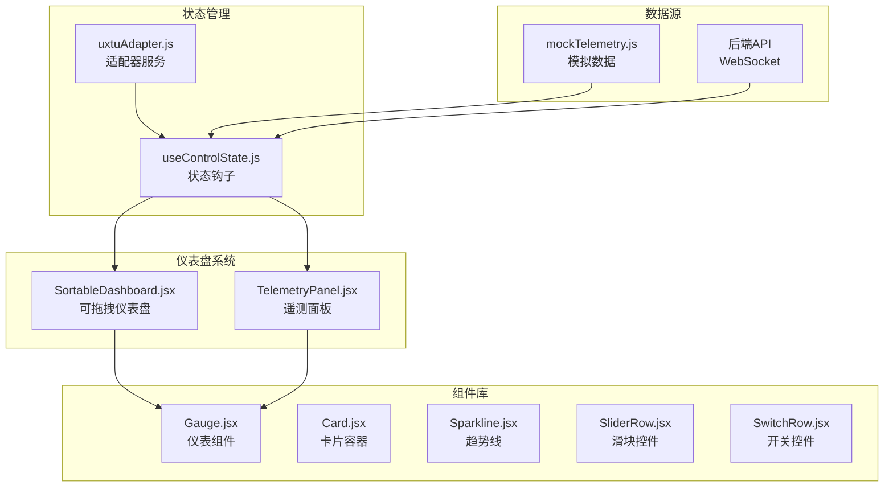
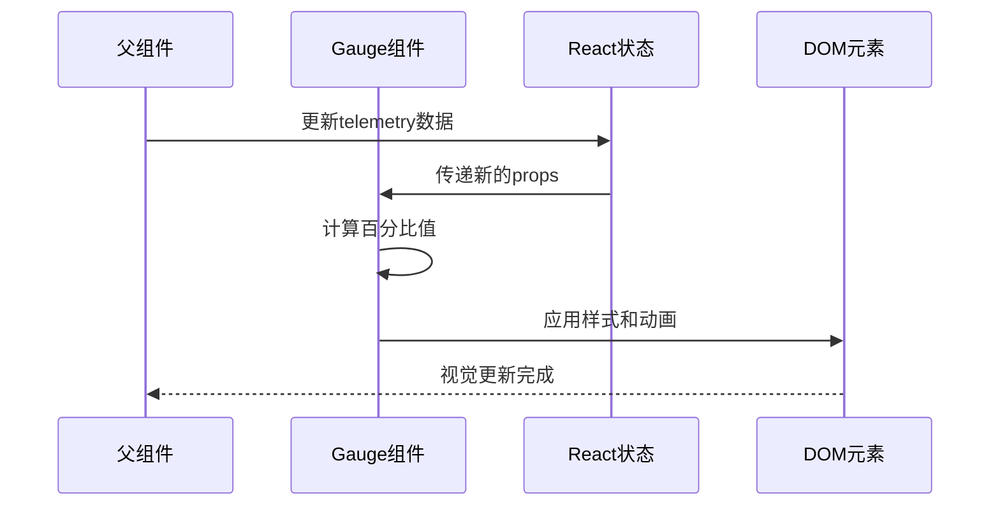
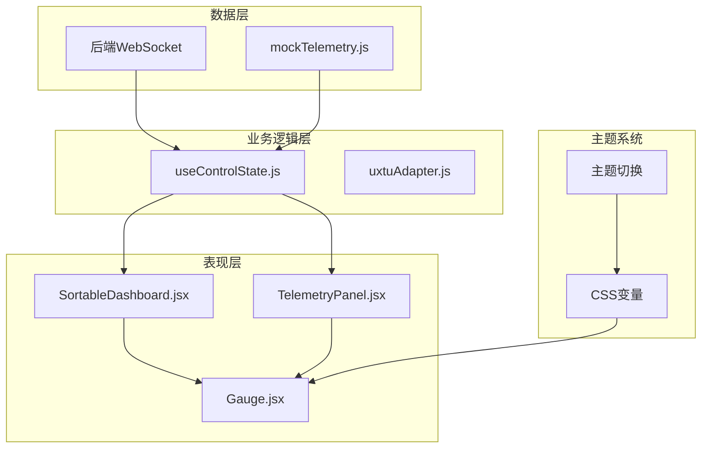
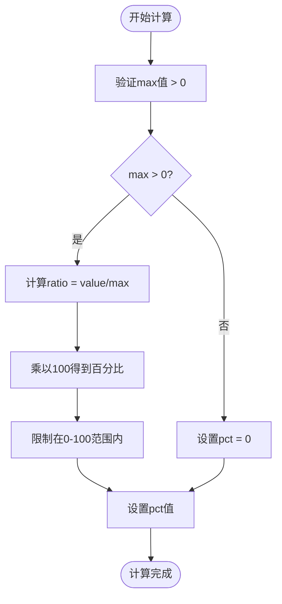
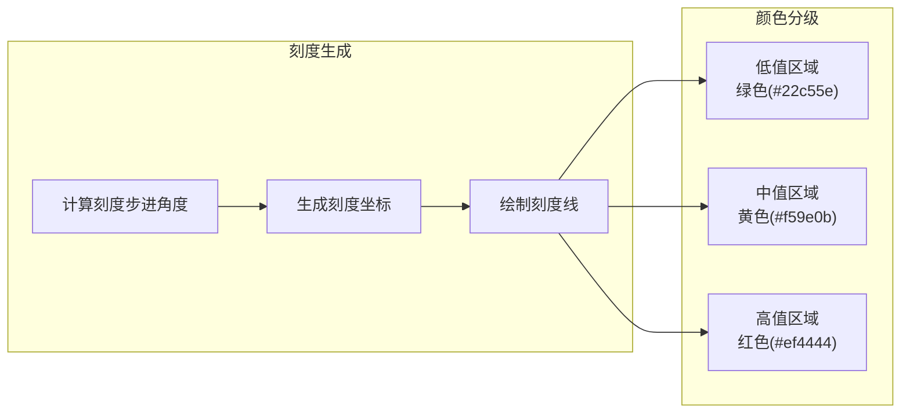
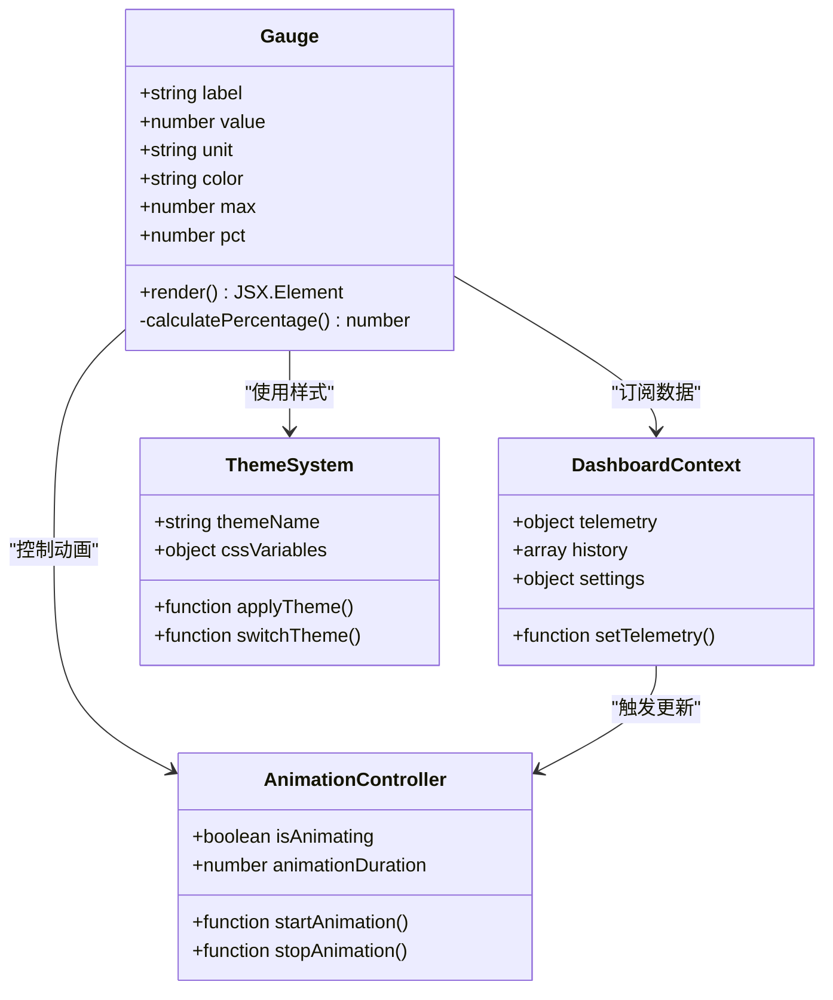
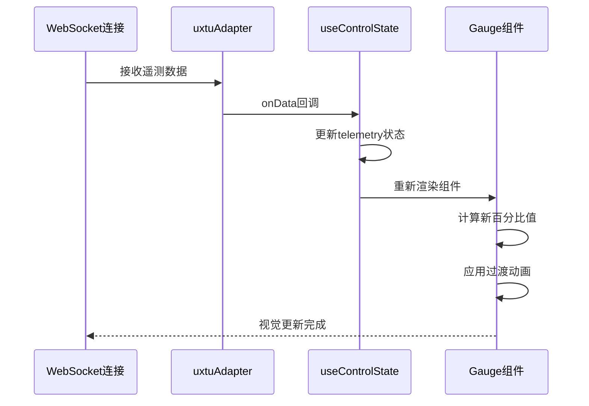
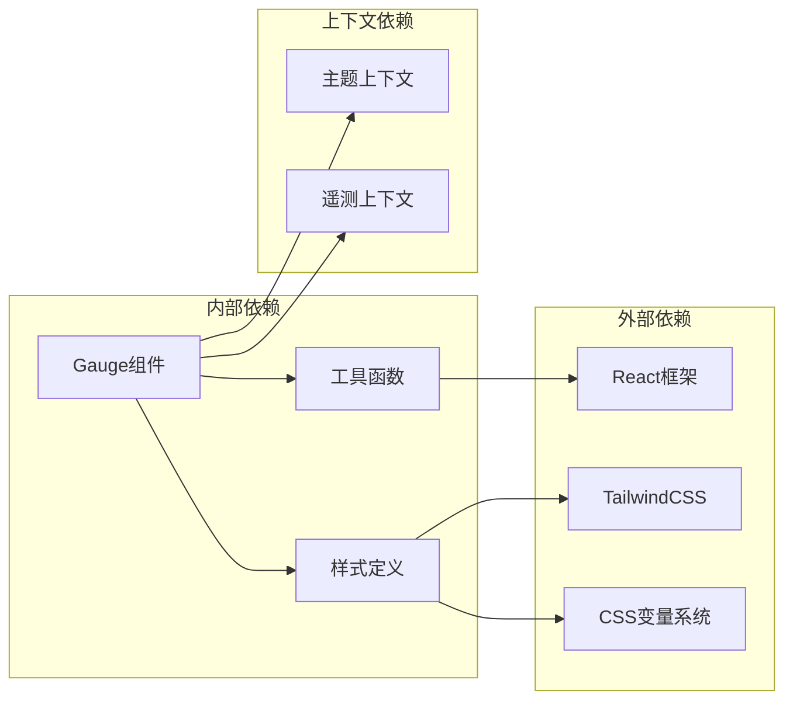
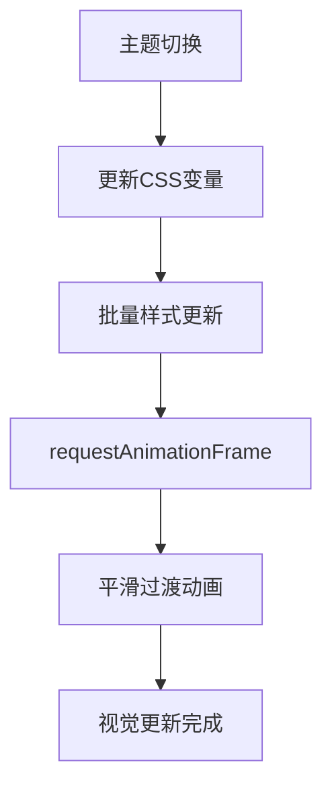

# 仪表组件(Gauge)

<cite>
**本文档引用的文件**
- [Gauge.jsx](file://src/components/ui/Gauge.jsx)
- [SortableDashboard.jsx](file://src/components/SortableDashboard.jsx)
- [TelemetryPanel.jsx](file://src/components/panels/TelemetryPanel.jsx)
- [useControlState.js](file://src/hooks/useControlState.js)
- [uxtuAdapter.js](file://src/services/uxtuAdapter.js)
- [mockTelemetry.js](file://src/data/mockTelemetry.js)
- [dev-frontend.md](file://docs/dev-frontend.md)
- [index.css](file://src/index.css)
</cite>

## 目录
1. [简介](#简介)
2. [项目结构](#项目结构)
3. [核心组件](#核心组件)
4. [架构概览](#架构概览)
5. [详细组件分析](#详细组件分析)
6. [依赖关系分析](#依赖关系分析)
7. [性能考虑](#性能考虑)
8. [故障排除指南](#故障排除指南)
9. [结论](#结论)
10. [附录](#附录)

## 简介

仪表组件(Gauge)是DOUZHANZHE控制系统中的核心可视化组件，采用水平进度条的形式展示各种硬件指标的实时状态。该组件通过简洁的UI设计和流畅的动画效果，为用户提供直观的系统监控体验。

本组件实现了以下核心功能：
- 实时数据绑定和自动更新
- 基于CSS变量的主题系统支持
- 流畅的过渡动画效果
- 灵活的配置选项和样式定制
- 与后端遥测系统的无缝集成

## 项目结构

仪表组件位于前端组件库中，采用模块化的设计理念，与其他UI组件协同工作形成完整的仪表盘生态系统。



**图表来源**
- [Gauge.jsx:1-21](file://src/components/ui/Gauge.jsx#L1-L21)
- [SortableDashboard.jsx:70-95](file://src/components/SortableDashboard.jsx#L70-L95)
- [TelemetryPanel.jsx:20-32](file://src/components/panels/TelemetryPanel.jsx#L20-L32)
- [useControlState.js:26-355](file://src/hooks/useControlState.js#L26-L355)

**章节来源**
- [Gauge.jsx:1-21](file://src/components/ui/Gauge.jsx#L1-L21)
- [dev-frontend.md:354-366](file://docs/dev-frontend.md#L354-L366)

## 核心组件

### 组件属性接口

仪表组件提供简洁而强大的属性配置，支持灵活的定制需求：

| 属性名 | 类型 | 默认值 | 必需 | 描述 |
|--------|------|--------|------|------|
| label | string | - | 否 | 显示在数值上方的标签文本 |
| value | number | - | 是 | 当前显示的数值 |
| unit | string | "%" | 否 | 数值单位标识符 |
| color | string | "var(--primary)" | 否 | 进度条颜色，支持CSS变量 |
| max | number | 100 | 否 | 最大值阈值，决定百分比计算 |

### 数据绑定机制

组件采用React的props驱动模式，通过外部传入的数据实现双向绑定：



**图表来源**
- [Gauge.jsx:1-21](file://src/components/ui/Gauge.jsx#L1-L21)
- [useControlState.js:242-257](file://src/hooks/useControlState.js#L242-L257)

**章节来源**
- [Gauge.jsx:1-21](file://src/components/ui/Gauge.jsx#L1-L21)
- [dev-frontend.md:358-360](file://docs/dev-frontend.md#L358-L360)

## 架构概览

仪表组件在整个系统架构中扮演着关键角色，连接着数据层、业务逻辑层和表现层。



**图表来源**
- [useControlState.js:242-336](file://src/hooks/useControlState.js#L242-L336)
- [uxtuAdapter.js:58-71](file://src/services/uxtuAdapter.js#L58-L71)
- [index.css:8-53](file://src/index.css#L8-L53)

## 详细组件分析

### SVG仪表盘实现原理

虽然当前版本的Gauge组件使用HTML进度条而非SVG圆环，但其设计理念体现了仪表盘的核心要素：

#### 百分比计算算法

组件采用线性映射算法将原始数值转换为可视化的百分比：



**图表来源**
- [Gauge.jsx:2-2](file://src/components/ui/Gauge.jsx#L2-L2)

#### 角度映射算法

如果未来需要实现SVG圆环仪表盘，可以采用以下角度映射方案：

| 指标类型 | 角度范围 | 起始角度 | 计算公式 |
|----------|----------|----------|----------|
| CPU使用率 | 0°-360° | 0° | angle = (value/max) × 360° |
| 温度监控 | 180°-360° | 180° | angle = 180° + (value/max) × 180° |
| 频率显示 | 270°-450° | 270° | angle = 270° + (value/max) × 180° |

#### 刻度绘制逻辑

SVG圆环刻度的绘制遵循以下原则：



### 组件类图



**图表来源**
- [Gauge.jsx:1-21](file://src/components/ui/Gauge.jsx#L1-L21)
- [useControlState.js:26-355](file://src/hooks/useControlState.js#L26-L355)

### API调用流程



**图表来源**
- [uxtuAdapter.js:58-71](file://src/services/uxtuAdapter.js#L58-L71)
- [useControlState.js:245-257](file://src/hooks/useControlState.js#L245-L257)

**章节来源**
- [Gauge.jsx:1-21](file://src/components/ui/Gauge.jsx#L1-L21)
- [useControlState.js:242-336](file://src/hooks/useControlState.js#L242-L336)

## 依赖关系分析

### 组件耦合度评估

仪表组件展现了良好的内聚性和低耦合性：



**图表来源**
- [Gauge.jsx:1-21](file://src/components/ui/Gauge.jsx#L1-L21)
- [index.css:8-53](file://src/index.css#L8-L53)

### 数据流依赖

组件间的数据流向清晰明确：

| 依赖方向 | 数据流向 | 更新机制 |
|----------|----------|----------|
| 上到下 | 父组件 → 子组件 | Props传递 |
| 下到上 | 子组件 → 父组件 | 回调函数 |
| 平级通信 | 组件间共享 | Context API |
| 外部数据 | 后端API → 组件 | WebSocket |

**章节来源**
- [SortableDashboard.jsx:70-95](file://src/components/SortableDashboard.jsx#L70-L95)
- [TelemetryPanel.jsx:20-32](file://src/components/panels/TelemetryPanel.jsx#L20-L32)

## 性能考虑

### 渲染优化策略

1. **条件渲染优化**
   - 仅在数据变化时触发重新计算
   - 使用React.memo避免不必要的重渲染

2. **动画性能**
   - 使用transform属性替代布局属性
   - 合理设置transition-duration减少重排

3. **内存管理**
   - 及时清理WebSocket连接
   - 合理使用useRef避免闭包陷阱

### 主题切换性能



**图表来源**
- [index.css:8-53](file://src/index.css#L8-L53)

## 故障排除指南

### 常见问题诊断

1. **数据不更新**
   - 检查WebSocket连接状态
   - 验证telemetry数据格式
   - 确认状态更新逻辑

2. **样式异常**
   - 检查CSS变量定义
   - 验证主题切换逻辑
   - 确认Tailwind类名正确性

3. **动画卡顿**
   - 检查transition属性设置
   - 验证浏览器兼容性
   - 优化动画帧率

**章节来源**
- [useControlState.js:242-257](file://src/hooks/useControlState.js#L242-L257)
- [uxtuAdapter.js:58-71](file://src/services/uxtuAdapter.js#L58-L71)

## 结论

仪表组件(Gauge)作为DOUZHANZHE控制系统的重要组成部分，展现了现代前端开发的最佳实践。通过简洁的API设计、灵活的主题系统和高效的性能优化，为用户提供了优秀的监控体验。

组件的核心优势包括：
- **易用性**：简单的属性配置即可满足大部分使用场景
- **可扩展性**：基于CSS变量的主题系统支持深度定制
- **性能**：优化的渲染策略和动画效果确保流畅体验
- **可靠性**：完善的错误处理和降级机制

## 附录

### 使用示例

#### 基础用法
```jsx
<Gauge 
  label="CPU使用率" 
  value={telemetry.cpuUsage} 
  unit="%" 
  color="var(--primary)"
  max={100}
/>
```

#### 高级配置
```jsx
<Gauge 
  label="温度监控" 
  value={telemetry.cpuTemp} 
  unit="°C" 
  color="var(--warn)"
  max={100}
/>
```

#### 自定义样式
```jsx
<Gauge 
  label="频率显示" 
  value={telemetry.cpuFreq} 
  unit=" GHz" 
  color="var(--ok)"
  max={5.2}
/>
```

### 主题变量对照表

| CSS变量 | 默认值 | 用途 |
|---------|--------|------|
| `--primary` | #22d3ee | 主要颜色 |
| `--primary-2` | #3b82f6 | 辅助颜色 |
| `--ok` | #22c55e | 正常状态 |
| `--warn` | #f59e0b | 警告状态 |
| `--danger` | #ef4444 | 危险状态 |
| `--card-2` | #111c34 | 背景颜色 |