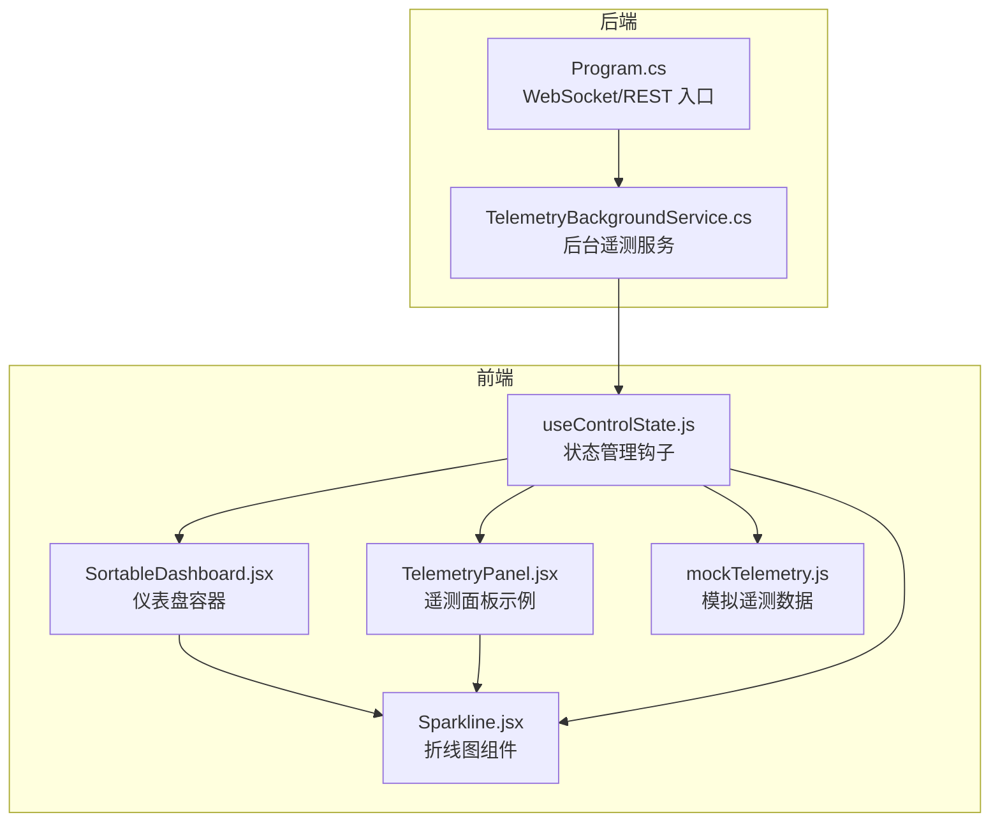
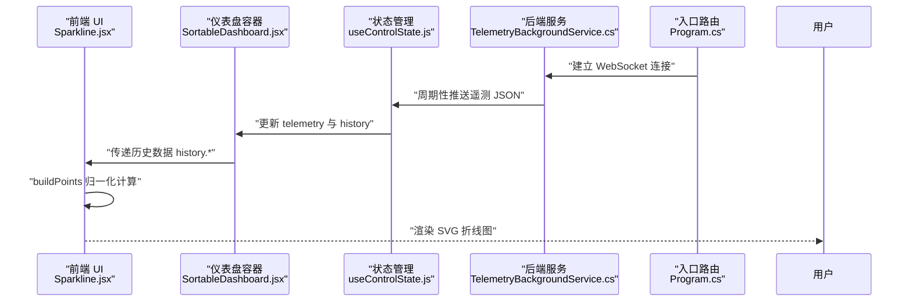
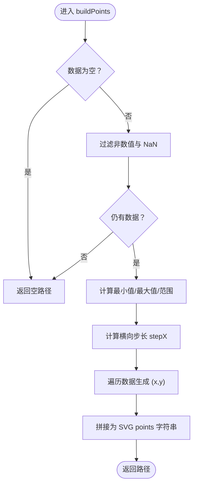
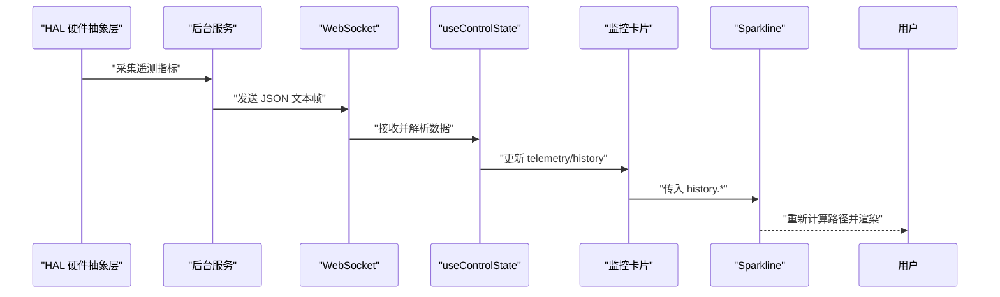

# 图表组件

<cite>
**本文档引用的文件**
- [Sparkline.jsx](file://src/components/ui/Sparkline.jsx)
- [TelemetryPanel.jsx](file://src/components/panels/TelemetryPanel.jsx)
- [SortableDashboard.jsx](file://src/components/SortableDashboard.jsx)
- [useControlState.js](file://src/hooks/useControlState.js)
- [mockTelemetry.js](file://src/data/mockTelemetry.js)
- [TelemetryBackgroundService.cs](file://server/api/TelemetryBackgroundService.cs)
- [Program.cs](file://server/api/Program.cs)
- [dev-frontend.md](file://docs/dev-frontend.md)
</cite>

## 目录
1. [简介](#简介)
2. [项目结构](#项目结构)
3. [核心组件](#核心组件)
4. [架构总览](#架构总览)
5. [详细组件分析](#详细组件分析)
6. [依赖关系分析](#依赖关系分析)
7. [性能考量](#性能考量)
8. [故障排查指南](#故障排查指南)
9. [结论](#结论)
10. [附录](#附录)

## 简介
本文件面向“图表组件”中的折线图（Sparkline）子系统，系统性阐述其实现原理、性能优化策略、配置选项、数据格式与实时更新机制，并提供可操作的使用示例与定制化方案。该组件以 SVG 多边形折线为基础，通过坐标轴归一化与路径点生成，实现轻量、可读性强的实时趋势展示。

## 项目结构
与图表组件相关的前端与后端模块分布如下：
- 前端组件层：Sparkline 折线图组件位于 UI 组件目录；在仪表盘中被多个监控卡片复用。
- 状态管理层：useControlState 提供遥测数据与历史曲线数据的集中管理。
- 数据来源层：后端通过 WebSocket 实时推送遥测数据，前端消费并渲染曲线。
- 文档与规范：开发文档对前端状态管理策略进行说明，便于理解数据流与持久化策略。

**图表来源**
- [Sparkline.jsx:1-40](file://src/components/ui/Sparkline.jsx#L1-L40)
- [SortableDashboard.jsx:70-95](file://src/components/SortableDashboard.jsx#L70-L95)
- [TelemetryPanel.jsx:1-32](file://src/components/panels/TelemetryPanel.jsx#L1-L32)
- [useControlState.js:26-45](file://src/hooks/useControlState.js#L26-L45)
- [mockTelemetry.js:1-22](file://src/data/mockTelemetry.js#L1-L22)
- [TelemetryBackgroundService.cs:43-142](file://server/api/TelemetryBackgroundService.cs#L43-L142)
- [Program.cs:70-107](file://server/api/Program.cs#L70-L107)

**章节来源**
- [Sparkline.jsx:1-40](file://src/components/ui/Sparkline.jsx#L1-L40)
- [SortableDashboard.jsx:70-95](file://src/components/SortableDashboard.jsx#L70-L95)
- [TelemetryPanel.jsx:1-32](file://src/components/panels/TelemetryPanel.jsx#L1-L32)
- [useControlState.js:26-45](file://src/hooks/useControlState.js#L26-L45)
- [mockTelemetry.js:1-22](file://src/data/mockTelemetry.js#L1-L22)
- [TelemetryBackgroundService.cs:43-142](file://server/api/TelemetryBackgroundService.cs#L43-L142)
- [Program.cs:70-107](file://server/api/Program.cs#L70-L107)

## 核心组件
- 折线图组件（Sparkline）
  - 输入：数值数组 data、标题 title、颜色 color
  - 输出：SVG 多边形折线路径
  - 关键能力：坐标轴归一化、路径点生成、空值过滤、边界处理
- 仪表盘容器（SortableDashboard）
  - 在不同监控卡片中内嵌 Sparkline，展示 CPU/GPU 负载曲线
- 状态管理（useControlState）
  - 维护实时遥测 telemetry 与历史曲线 history（含 CPU/GPU 等）
  - 提供 WebSocket 连接与数据更新逻辑
- 遥测数据源（后端）
  - 通过后台服务周期性采集硬件指标并通过 WebSocket 推送

**章节来源**
- [Sparkline.jsx:20-39](file://src/components/ui/Sparkline.jsx#L20-L39)
- [SortableDashboard.jsx:70-95](file://src/components/SortableDashboard.jsx#L70-L95)
- [useControlState.js:26-45](file://src/hooks/useControlState.js#L26-L45)
- [TelemetryBackgroundService.cs:54-142](file://server/api/TelemetryBackgroundService.cs#L54-L142)

## 架构总览
下图展示了从前端组件到后端服务的数据通路与交互流程：

**图表来源**
- [Sparkline.jsx:1-18](file://src/components/ui/Sparkline.jsx#L1-L18)
- [SortableDashboard.jsx:70-95](file://src/components/SortableDashboard.jsx#L70-L95)
- [useControlState.js:26-45](file://src/hooks/useControlState.js#L26-L45)
- [TelemetryBackgroundService.cs:54-142](file://server/api/TelemetryBackgroundService.cs#L54-L142)
- [Program.cs:70-107](file://server/api/Program.cs#L70-L107)

## 详细组件分析

### 折线图（Sparkline）实现原理
- 坐标轴转换
  - 过滤非数值与 NaN 值，确保后续计算稳定
  - 计算最小值、最大值与范围，避免除零
  - 横向步长 stepX 基于有效点数与画布内边距计算
  - 归一化公式将数值映射到 [0,1] 区间，再线性映射到像素高度
- 路径生成算法
  - 逐点生成 “x,y” 坐标字符串，拼接为 SVG polyline 的 points 属性
  - 使用 round join 使折线连接处更顺滑
- 多数据系列支持
  - 当前版本仅支持单系列输入 data
  - 若需多系列，可在上层容器中并排渲染多个 Sparkline 或扩展组件以接收 series 数组

**图表来源**
- [Sparkline.jsx:1-18](file://src/components/ui/Sparkline.jsx#L1-L18)

**章节来源**
- [Sparkline.jsx:1-18](file://src/components/ui/Sparkline.jsx#L1-L18)

### 组件 API 与配置选项
- 组件属性
  - data: 数值数组（建议长度与 history 一致以保证视觉连续性）
  - title: 标题文本（默认“趋势”）
  - color: 线条颜色（CSS 变量或颜色值）
- 渲染尺寸与内边距
  - 固定画布尺寸与内边距，适配紧凑卡片布局
- 样式与主题
  - 使用 CSS 变量继承主题色，确保与卡片背景与边框协调

**章节来源**
- [Sparkline.jsx:20-39](file://src/components/ui/Sparkline.jsx#L20-L39)

### 数据格式规范与实时更新机制
- 数据格式
  - data 为数值数组，元素类型为 number，NaN 将被过滤
  - 建议与 history 中的历史长度保持一致，以便平滑过渡
- 实时更新链路
  - 后端每 250ms 采集一次遥测并推送
  - 前端 useControlState 接收数据，更新 telemetry 与 history
  - 仪表盘订阅 history 并传入 Sparkline 渲染

**图表来源**
- [TelemetryBackgroundService.cs:54-142](file://server/api/TelemetryBackgroundService.cs#L54-L142)
- [Program.cs:70-107](file://server/api/Program.cs#L70-L107)
- [useControlState.js:26-45](file://src/hooks/useControlState.js#L26-L45)
- [SortableDashboard.jsx:70-95](file://src/components/SortableDashboard.jsx#L70-L95)
- [Sparkline.jsx:20-39](file://src/components/ui/Sparkline.jsx#L20-L39)

**章节来源**
- [TelemetryBackgroundService.cs:54-142](file://server/api/TelemetryBackgroundService.cs#L54-L142)
- [Program.cs:70-107](file://server/api/Program.cs#L70-L107)
- [useControlState.js:26-45](file://src/hooks/useControlState.js#L26-L45)
- [SortableDashboard.jsx:70-95](file://src/components/SortableDashboard.jsx#L70-L95)

### 使用示例与定制化方案
- 基础用法
  - 在监控卡片中直接传入 history.cpu 或 history.gpu
  - 设置 title 与 color 以匹配主题
- 多系列展示
  - 方案一：在同一卡片中并排渲染多个 Sparkline，分别传入不同 series
  - 方案二：扩展组件以接收 series 数组，内部循环绘制多条折线
- 主题与样式
  - 通过 color 传入 CSS 变量，实现与主题联动
  - 结合卡片容器的背景与边框变量，统一视觉风格
- 与仪表盘集成
  - 在 SortableDashboard 的对应 case 中注入 Sparkline，并绑定 history.*

**章节来源**
- [TelemetryPanel.jsx:20-32](file://src/components/panels/TelemetryPanel.jsx#L20-L32)
- [SortableDashboard.jsx:70-95](file://src/components/SortableDashboard.jsx#L70-L95)
- [Sparkline.jsx:20-39](file://src/components/ui/Sparkline.jsx#L20-L39)

## 依赖关系分析
- 组件耦合
  - Sparkline 仅依赖传入的 data、title、color，内聚度高，耦合度低
  - 与上层容器（仪表盘）通过 props 传递历史数据，解耦数据来源
- 数据流向
  - 后端采集 → WebSocket 推送 → 前端状态管理 → 仪表盘渲染 → 组件展示
- 可能的循环依赖
  - 当前文件间不存在循环导入；若扩展多系列支持，需避免在组件内部引入容器逻辑

**图表来源**
- [TelemetryBackgroundService.cs:54-142](file://server/api/TelemetryBackgroundService.cs#L54-L142)
- [Program.cs:70-107](file://server/api/Program.cs#L70-L107)
- [useControlState.js:26-45](file://src/hooks/useControlState.js#L26-L45)
- [SortableDashboard.jsx:70-95](file://src/components/SortableDashboard.jsx#L70-L95)
- [Sparkline.jsx:20-39](file://src/components/ui/Sparkline.jsx#L20-L39)

**章节来源**
- [useControlState.js:26-45](file://src/hooks/useControlState.js#L26-L45)
- [Sparkline.jsx:20-39](file://src/components/ui/Sparkline.jsx#L20-L39)
- [SortableDashboard.jsx:70-95](file://src/components/SortableDashboard.jsx#L70-L95)

## 性能考量
- 数据采样与历史长度
  - history 默认维护固定长度（如 60），避免无限增长导致的重绘压力
- 重绘控制
  - 仅在 history 变化时触发 Sparkline 重绘；建议在上层容器中使用浅比较或 memo 化减少无效渲染
- 内存管理
  - 使用固定容量队列，及时丢弃过旧数据；清理无效 NaN 值，降低计算与存储开销
- SVG 渲染优化
  - 使用 polyline 曲线连接（round join）提升视觉质量；避免频繁修改 viewBox 与尺寸
- 后端推送节流
  - 后端按固定间隔推送，前端按需消费，避免 UI 线程阻塞

**章节来源**
- [useControlState.js:33-41](file://src/hooks/useControlState.js#L33-L41)
- [TelemetryBackgroundService.cs:54-142](file://server/api/TelemetryBackgroundService.cs#L54-L142)
- [Sparkline.jsx:1-18](file://src/components/ui/Sparkline.jsx#L1-L18)

## 故障排查指南
- 折线图不显示
  - 检查 data 是否为空或全部为 NaN；确认传入的是数值数组
  - 确认容器尺寸与内边距设置是否合理
- 颜色与主题不一致
  - 确认 color 传入值与主题变量一致；检查 CSS 变量是否正确生效
- 数据不更新
  - 检查 WebSocket 连接状态与后端推送逻辑
  - 确认 useControlState 是否成功更新 telemetry 与 history
- 性能问题
  - 检查 history 长度是否过大；确认是否在上层容器中进行了不必要的重渲染

**章节来源**
- [Sparkline.jsx:1-18](file://src/components/ui/Sparkline.jsx#L1-L18)
- [useControlState.js:26-45](file://src/hooks/useControlState.js#L26-L45)
- [TelemetryBackgroundService.cs:54-142](file://server/api/TelemetryBackgroundService.cs#L54-L142)

## 结论
Sparkline 组件以简洁的坐标轴归一化与路径生成算法实现了高效的实时趋势展示。通过与 useControlState 和后端 WebSocket 的配合，能够稳定地提供 CPU/GPU 负载曲线等可视化能力。建议在多系列场景中采用并排渲染或多实例方式扩展，同时结合历史长度控制与重绘优化策略，确保在复杂仪表盘中的流畅体验。

## 附录
- 开发文档对前端状态管理策略的说明可作为理解数据流与持久化的参考
- 模拟遥测数据可用于本地调试与演示

**章节来源**
- [dev-frontend.md:169-210](file://docs/dev-frontend.md#L169-L210)
- [mockTelemetry.js:1-22](file://src/data/mockTelemetry.js#L1-L22)