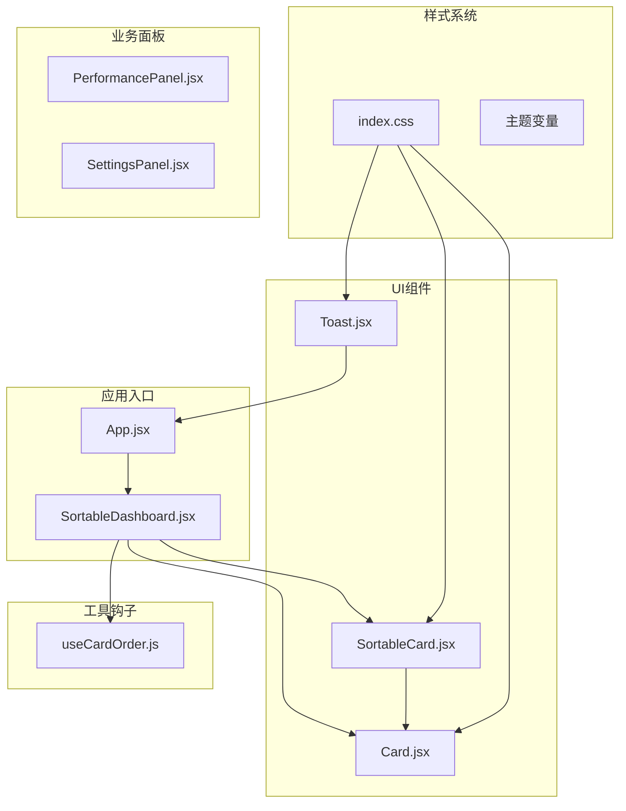
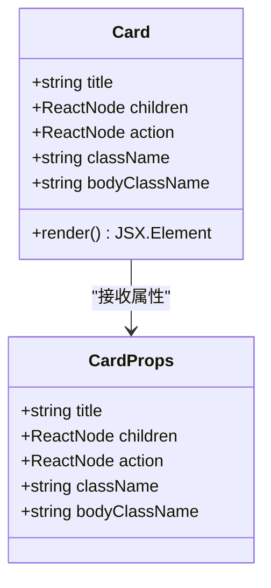
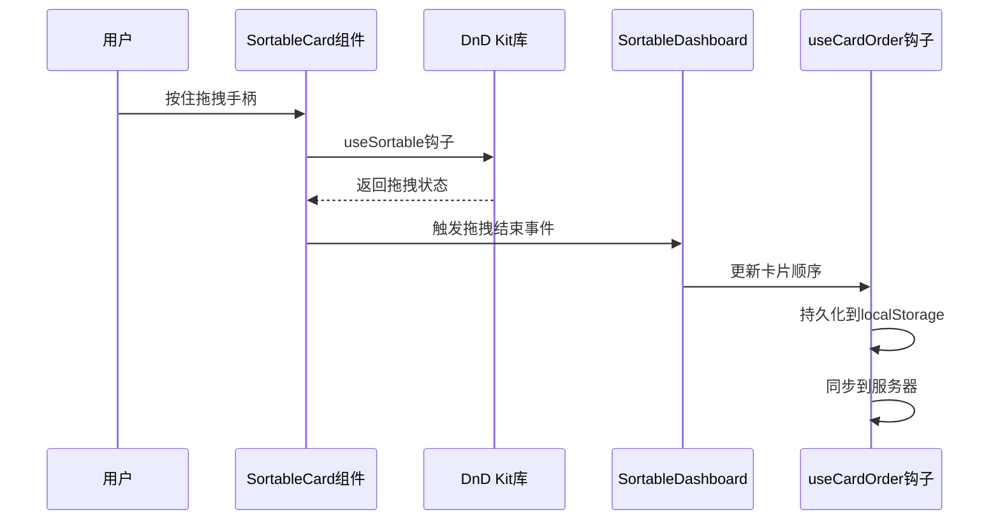
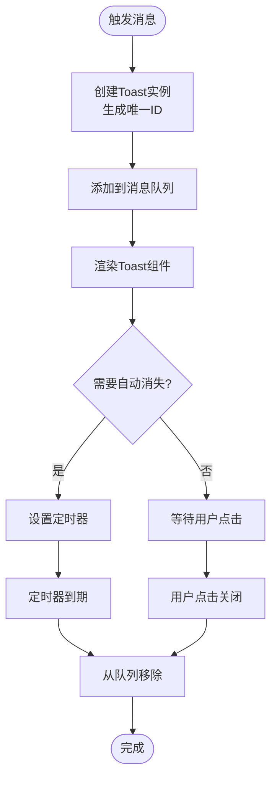
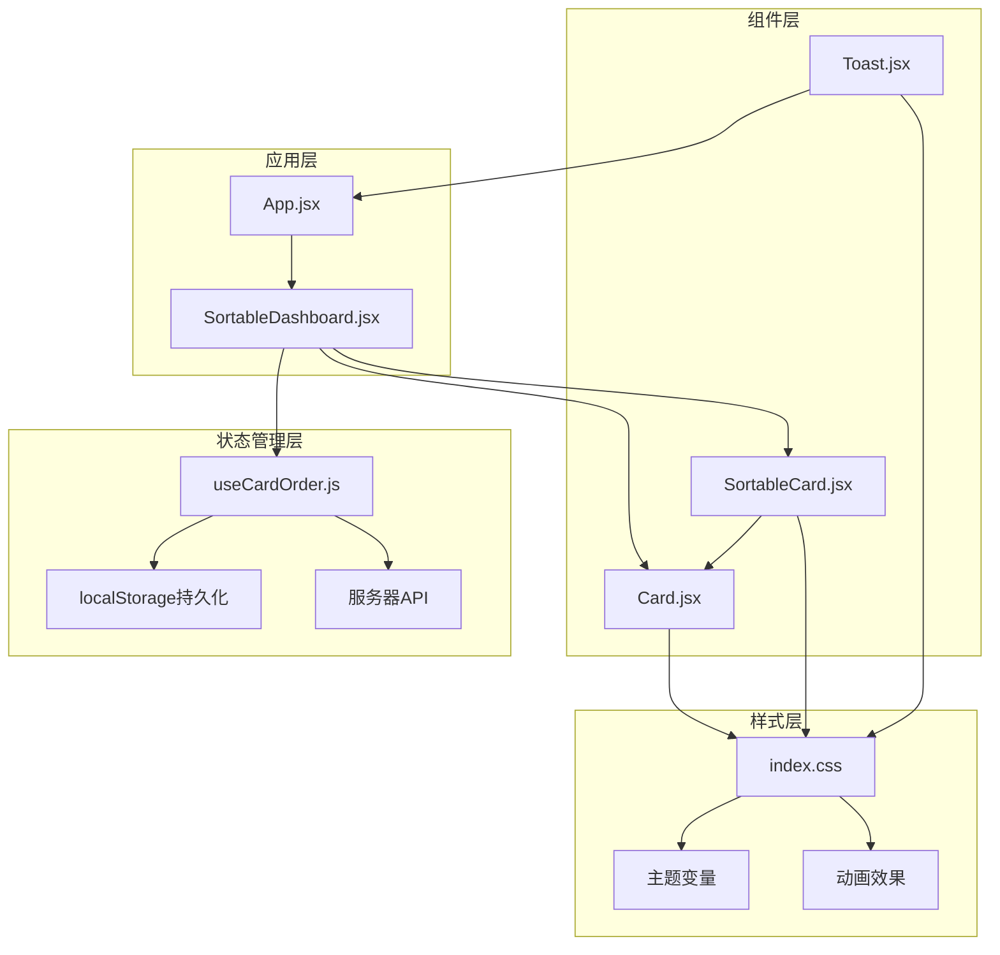
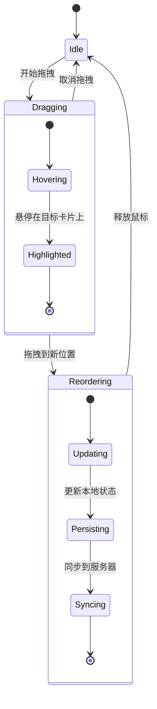
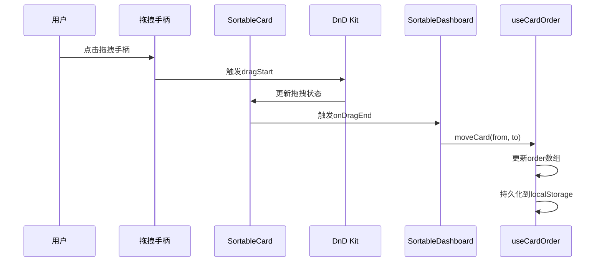
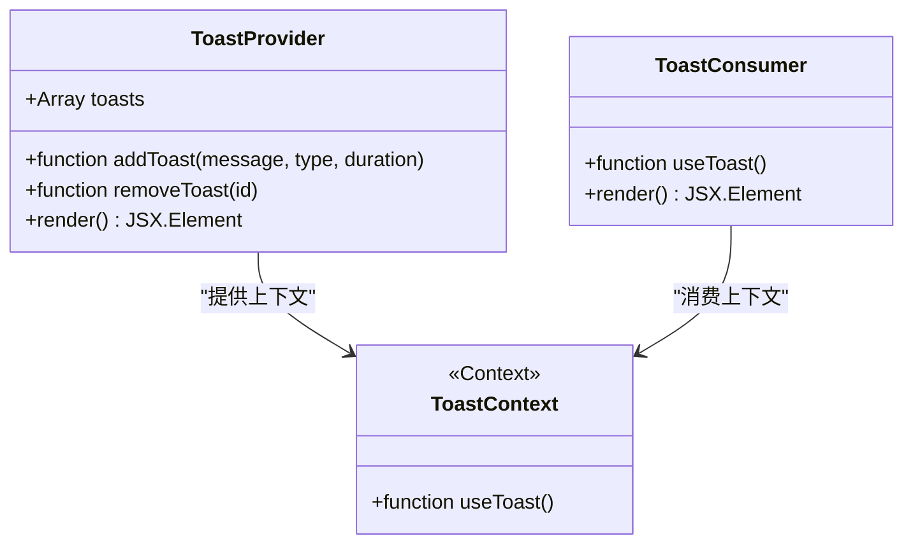
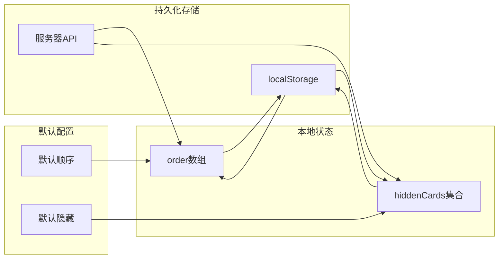
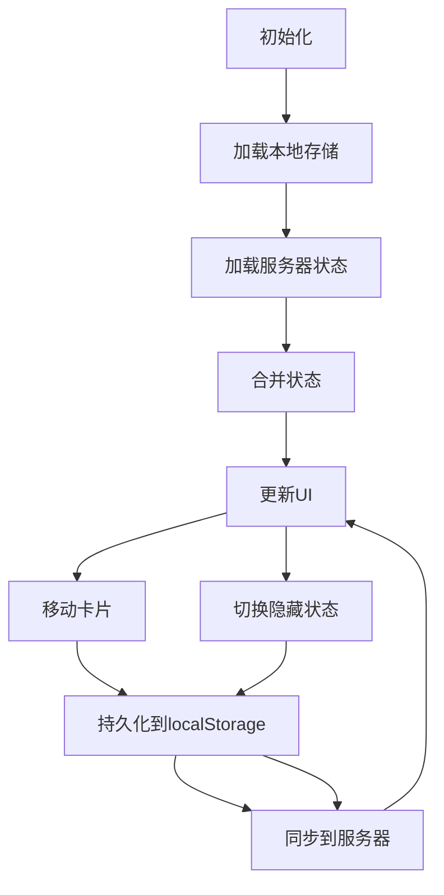

# 布局容器组件

<cite>
**本文档引用的文件**
- [Card.jsx](file://src/components/ui/Card.jsx)
- [SortableCard.jsx](file://src/components/ui/SortableCard.jsx)
- [Toast.jsx](file://src/components/ui/Toast.jsx)
- [SortableDashboard.jsx](file://src/components/SortableDashboard.jsx)
- [useCardOrder.js](file://src/hooks/useCardOrder.js)
- [App.jsx](file://src/App.jsx)
- [index.css](file://src/index.css)
</cite>

## 目录
1. [简介](#简介)
2. [项目结构](#项目结构)
3. [核心组件](#核心组件)
4. [架构概览](#架构概览)
5. [详细组件分析](#详细组件分析)
6. [依赖关系分析](#依赖关系分析)
7. [性能考虑](#性能考虑)
8. [故障排除指南](#故障排除指南)
9. [结论](#结论)
10. [附录](#附录)

## 简介

Douzhanzhe Console 是一个高性能的硬件控制面板应用，专注于为联想 Legion 笔记本提供专业的散热管理和性能调优功能。该应用采用现代化的前端技术栈，提供了丰富的布局容器组件，包括卡片组件、可排序卡片和提示框等核心UI组件。

本文档深入解析布局容器组件的设计理念和实现机制，涵盖阴影效果、圆角处理、响应式适配、拖拽实现、位置变换、状态同步以及消息显示机制等关键特性。同时提供组件组合使用的最佳实践和样式定制方法，帮助开发者更好地理解和使用这些组件。

## 项目结构

该项目采用模块化的组件架构设计，主要目录结构如下：



**图表来源**
- [App.jsx:1-134](file://src/App.jsx#L1-L134)
- [SortableDashboard.jsx:1-247](file://src/components/SortableDashboard.jsx#L1-L247)
- [Card.jsx:1-18](file://src/components/ui/Card.jsx#L1-L18)
- [SortableCard.jsx:1-43](file://src/components/ui/SortableCard.jsx#L1-L43)
- [Toast.jsx:1-50](file://src/components/ui/Toast.jsx#L1-L50)

**章节来源**
- [App.jsx:1-134](file://src/App.jsx#L1-L134)
- [index.css:1-460](file://src/index.css#L1-L460)

## 核心组件

### 卡片组件 (Card)

Card 组件是整个应用的基础布局容器，提供了统一的视觉风格和交互体验。其设计理念基于现代UI设计原则，注重可读性和一致性。

**核心特性：**
- 圆角设计：使用 `rounded-2xl` 实现柔和的视觉效果
- 边框系统：通过 `border: 1px solid var(--border)` 实现层次感
- 背景系统：使用CSS变量 `var(--card)` 实现主题适配
- 响应式布局：在不同屏幕尺寸下提供优化的间距
- 可扩展性：支持自定义类名和内容区域

**设计模式：**


**图表来源**
- [Card.jsx:1-18](file://src/components/ui/Card.jsx#L1-L18)

**章节来源**
- [Card.jsx:1-18](file://src/components/ui/Card.jsx#L1-L18)

### 可排序卡片组件 (SortableCard)

SortableCard 组件基于 @dnd-kit 库实现了高级的拖拽排序功能，为用户提供了直观的界面定制能力。

**核心功能：**
- 拖拽交互：通过 useSortable hook 实现平滑的拖拽体验
- 视觉反馈：拖拽时的透明度变化和层级提升
- 编辑模式：在编辑状态下显示拖拽手柄和隐藏按钮
- 状态管理：与外部状态系统集成，保持数据一致性

**技术实现：**


**图表来源**
- [SortableCard.jsx:1-43](file://src/components/ui/SortableCard.jsx#L1-L43)
- [SortableDashboard.jsx:64-71](file://src/components/SortableDashboard.jsx#L64-L71)
- [useCardOrder.js:93-100](file://src/hooks/useCardOrder.js#L93-L100)

**章节来源**
- [SortableCard.jsx:1-43](file://src/components/ui/SortableCard.jsx#L1-L43)
- [SortableDashboard.jsx:64-71](file://src/components/SortableDashboard.jsx#L64-L71)

### 提示框组件 (Toast)

Toast 组件提供了全局的消息通知系统，支持多种消息类型和自动消失机制。

**核心特性：**
- 上下文管理：使用 React Context 实现全局状态共享
- 多类型支持：错误、成功、信息三种消息类型
- 自动消失：可配置的显示时长和自动清理机制
- 固定定位：右下角固定位置，不影响页面布局
- 动画效果：滑入动画增强用户体验

**消息流程：**


**图表来源**
- [Toast.jsx:7-45](file://src/components/ui/Toast.jsx#L7-L45)

**章节来源**
- [Toast.jsx:1-50](file://src/components/ui/Toast.jsx#L1-L50)

## 架构概览

整个布局容器组件系统采用分层架构设计，各组件之间通过清晰的接口进行通信。



**图表来源**
- [App.jsx:23-133](file://src/App.jsx#L23-L133)
- [SortableDashboard.jsx:38-246](file://src/components/SortableDashboard.jsx#L38-L246)
- [useCardOrder.js:46-127](file://src/hooks/useCardOrder.js#L46-L127)

**章节来源**
- [App.jsx:23-133](file://src/App.jsx#L23-L133)
- [SortableDashboard.jsx:38-246](file://src/components/SortableDashboard.jsx#L38-L246)

## 详细组件分析

### 卡片组件深度解析

Card 组件虽然结构简单，但体现了现代UI设计的多个重要原则：

**视觉设计原则：**
- **圆角系统**：使用 `rounded-2xl` 提供柔和的视觉边界
- **层次感**：通过边框和背景色区分不同层级
- **对比度**：文本颜色使用 `var(--text)` 确保可读性
- **留白**：合理的内边距和外边距创造呼吸空间

**响应式设计：**
- 移动端：`p-2.5` 提供紧凑的移动端体验
- 平板及以上：`p-3` 和标题字体大小的调整
- 内容区域：`break-inside-avoid` 防止内容被分页打断

**可定制性：**
- 类名扩展：支持通过 `className` 和 `bodyClassName` 进行样式定制
- 动作区域：右侧动作区支持自定义操作按钮
- 结构灵活性：标题、内容、动作三部分可独立定制

**章节来源**
- [Card.jsx:1-18](file://src/components/ui/Card.jsx#L1-L18)
- [index.css:428-460](file://src/index.css#L428-L460)

### 可排序卡片组件实现

SortableCard 组件是整个应用交互性的核心，实现了复杂的拖拽排序逻辑。

**拖拽状态管理：**


**图表来源**
- [SortableCard.jsx:4-12](file://src/components/ui/SortableCard.jsx#L4-L12)
- [SortableDashboard.jsx:64-71](file://src/components/SortableDashboard.jsx#L64-L71)

**核心实现要点：**
- **useSortable钩子**：集成 @dnd-kit 的核心拖拽逻辑
- **样式动态计算**：根据拖拽状态实时更新transform和opacity
- **z-index管理**：拖拽时提升层级确保可见性
- **编辑模式控制**：条件渲染拖拽手柄和隐藏按钮

**拖拽交互流程：**


**图表来源**
- [SortableCard.jsx:14-41](file://src/components/ui/SortableCard.jsx#L14-L41)
- [SortableDashboard.jsx:64-71](file://src/components/SortableDashboard.jsx#L64-L71)

**章节来源**
- [SortableCard.jsx:1-43](file://src/components/ui/SortableCard.jsx#L1-L43)
- [SortableDashboard.jsx:64-71](file://src/components/SortableDashboard.jsx#L64-L71)

### 提示框组件架构

Toast 组件采用了现代React的最佳实践，使用Context实现全局状态管理。

**Context设计模式：**


**图表来源**
- [Toast.jsx:3-49](file://src/components/ui/Toast.jsx#L3-L49)

**消息生命周期：**
- **创建阶段**：生成唯一ID，添加到队列
- **显示阶段**：渲染到DOM，触发动画效果
- **交互阶段**：用户可点击关闭或等待自动消失
- **销毁阶段**：从队列移除，释放内存

**消息类型系统：**
- **错误消息**：红色背景，用于错误状态
- **成功消息**：绿色背景，用于成功状态  
- **信息消息**：蓝色背景，用于普通信息

**章节来源**
- [Toast.jsx:1-50](file://src/components/ui/Toast.jsx#L1-L50)

### 卡片排序钩子详解

useCardOrder 钩子是整个排序系统的中枢，负责管理卡片的顺序、可见性和持久化。

**状态管理架构：**


**图表来源**
- [useCardOrder.js:46-127](file://src/hooks/useCardOrder.js#L46-L127)

**核心功能实现：**
- **默认值管理**：提供合理的默认卡片顺序和隐藏列表
- **合并策略**：新版本发布时自动合并新增卡片
- **双向同步**：本地修改实时同步到服务器
- **错误处理**：网络异常时的优雅降级

**同步流程：**


**图表来源**
- [useCardOrder.js:78-91](file://src/hooks/useCardOrder.js#L78-L91)

**章节来源**
- [useCardOrder.js:1-128](file://src/hooks/useCardOrder.js#L1-L128)

## 依赖关系分析

组件间的依赖关系构成了整个应用的骨架结构。

```mermaid
graph TB
subgraph "外部依赖"
DnDKit[@dnd-kit/sortable]
React[React]
Tailwind[Tailwind CSS]
end
subgraph "内部组件"
Card[Card.jsx]
SortableCard[SortableCard.jsx]
Toast[Toast.jsx]
Dashboard[SortableDashboard.jsx]
useCardOrder[useCardOrder.js]
end
subgraph "样式依赖"
indexCSS[index.css]
ThemeVars[主题变量]
end
DnDKit --> SortableCard
React --> Card
React --> SortableCard
React --> Toast
React --> Dashboard
React --> useCardOrder
Tailwind --> Card
Tailwind --> SortableCard
Tailwind --> Toast
Tailwind --> indexCSS
indexCSS --> ThemeVars
Card --> indexCSS
SortableCard --> indexCSS
Toast --> indexCSS
Dashboard --> Card
Dashboard --> SortableCard
Dashboard --> useCardOrder
SortableCard --> Card
```

**图表来源**
- [SortableCard.jsx:1-3](file://src/components/ui/SortableCard.jsx#L1-L3)
- [Card.jsx:1](file://src/components/ui/Card.jsx#L1)
- [Toast.jsx:1](file://src/components/ui/Toast.jsx#L1)
- [SortableDashboard.jsx:1-23](file://src/components/SortableDashboard.jsx#L1-L23)

**依赖特点：**
- **单一职责**：每个组件都有明确的功能边界
- **松耦合**：通过props和Context进行通信
- **可测试性**：函数式组件便于单元测试
- **可维护性**：清晰的导入导出关系

**章节来源**
- [SortableCard.jsx:1-3](file://src/components/ui/SortableCard.jsx#L1-L3)
- [index.css:1-460](file://src/index.css#L1-L460)

## 性能考虑

### 渲染优化

**虚拟滚动考虑：**
- 当卡片数量增加时，可考虑实现虚拟滚动以减少DOM节点
- 使用 React.memo 包装重型子组件
- 合理使用 key 属性优化列表重渲染

**拖拽性能：**
- 拖拽过程中避免不必要的重渲染
- 使用 CSS transform 而非改变布局属性
- 适当的防抖处理拖拽事件

### 内存管理

**状态清理：**
- Toast 组件自动清理过期消息
- 拖拽结束后及时清理临时状态
- 组件卸载时清理定时器和事件监听器

**持久化策略：**
- 使用节流/防抖减少localStorage写入频率
- 批量更新状态以减少重渲染次数

## 故障排除指南

### 常见问题及解决方案

**拖拽功能异常：**
1. 检查 @dnd-kit 依赖是否正确安装
2. 确认 useSortable 钩子的 id 参数唯一性
3. 验证 DndContext 和 SortableContext 的嵌套关系

**样式显示问题：**
1. 确认主题变量已在 :root 中正确定义
2. 检查 Tailwind CSS 配置是否正确
3. 验证 CSS 变量的优先级关系

**消息通知失效：**
1. 确认 ToastProvider 已在应用根部正确包裹
2. 检查 useToast 钩子的使用方式
3. 验证 Context Provider 的传递链路

**章节来源**
- [Toast.jsx:1-50](file://src/components/ui/Toast.jsx#L1-L50)
- [index.css:1-460](file://src/index.css#L1-L460)

## 结论

Douzhanzhe Console 的布局容器组件展现了现代前端开发的最佳实践。通过精心设计的组件架构、完善的拖拽交互、灵活的主题系统和可靠的持久化机制，为用户提供了优秀的使用体验。

**核心优势：**
- **模块化设计**：清晰的组件边界和职责分离
- **用户体验**：流畅的动画效果和直观的交互设计
- **可扩展性**：良好的抽象层支持功能扩展
- **可维护性**：规范的代码结构和完善的文档

**未来改进方向：**
- 增加更多的主题选项和自定义能力
- 实现卡片的动态加载和懒渲染
- 添加更丰富的拖拽手势支持
- 优化移动端的触摸交互体验

## 附录

### 组件使用示例

**基本卡片使用：**
```jsx
<Card title="监控面板" className="!p-5">
  <div className="space-y-3">
    <Gauge label="CPU占用率" value={telemetry.cpuUsage}/>
    <Gauge label="GPU占用率" value={telemetry.gpuUsage}/>
  </div>
</Card>
```

**可排序卡片使用：**
```jsx
<SortableCard id="cpu-monitor" editMode={editMode}>
  <Card title="CPU监控">
    <div className="space-y-2">
      <Gauge label="温度" value={telemetry.cpuTemp} unit="°C"/>
      <Gauge label="频率" value={telemetry.cpuFreq} unit="GHz"/>
    </div>
  </Card>
</SortableCard>
```

**提示框使用：**
```jsx
function MyComponent() {
  const toast = useToast();
  
  const handleClick = () => {
    toast("操作成功", "success");
  };
  
  return (
    <button onClick={handleClick}>点击测试</button>
  );
}
```

### 样式定制指南

**主题变量定制：**
```css
:root {
  --card: #1e293b;
  --card-2: #334155;
  --text: #f1f5f9;
  --primary: #3b82f6;
  --primary-2: #60a5fa;
  --ok: #22c55e;
  --warn: #f59e0b;
  --danger: #ef4444;
  --border: rgba(59, 130, 246, 0.2);
}
```

**响应式断点：**
- 移动端：`md:` 前缀用于平板及以上设备
- 标题字体：`text-sm md:text-base`
- 内边距：`p-2.5 md:p-3`
- 列布局：`columns-1 md:columns-2 lg:columns-3`

**章节来源**
- [Card.jsx:1-18](file://src/components/ui/Card.jsx#L1-L18)
- [SortableCard.jsx:1-43](file://src/components/ui/SortableCard.jsx#L1-L43)
- [Toast.jsx:1-50](file://src/components/ui/Toast.jsx#L1-L50)
- [index.css:1-460](file://src/index.css#L1-L460)