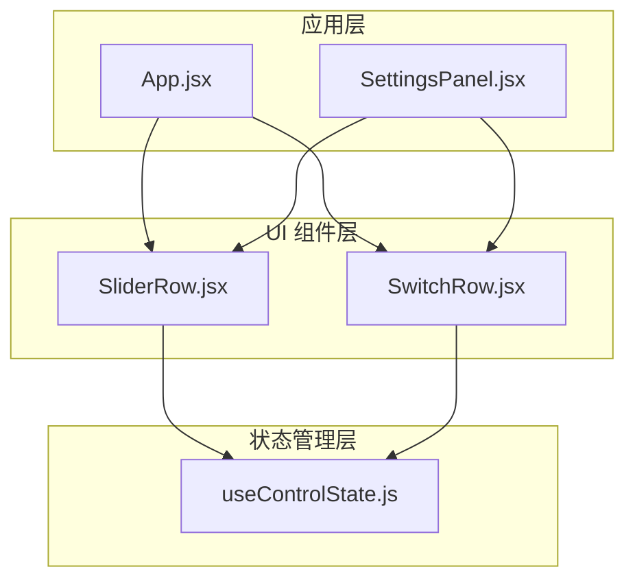
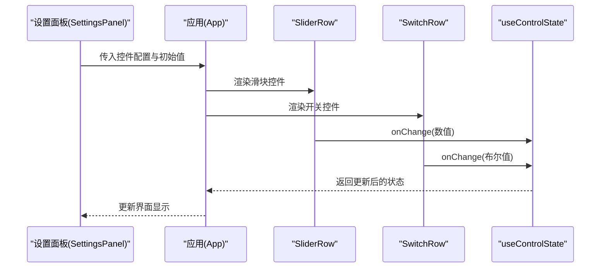
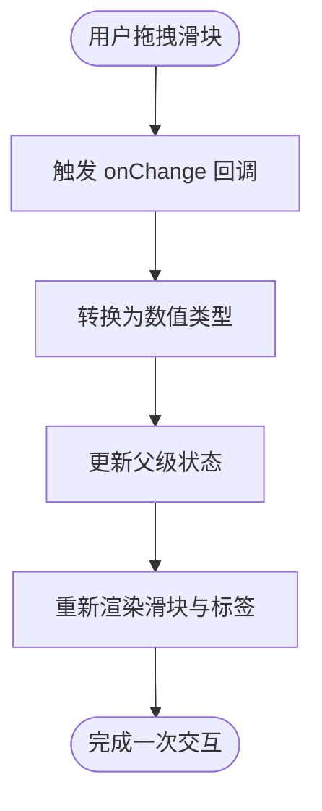
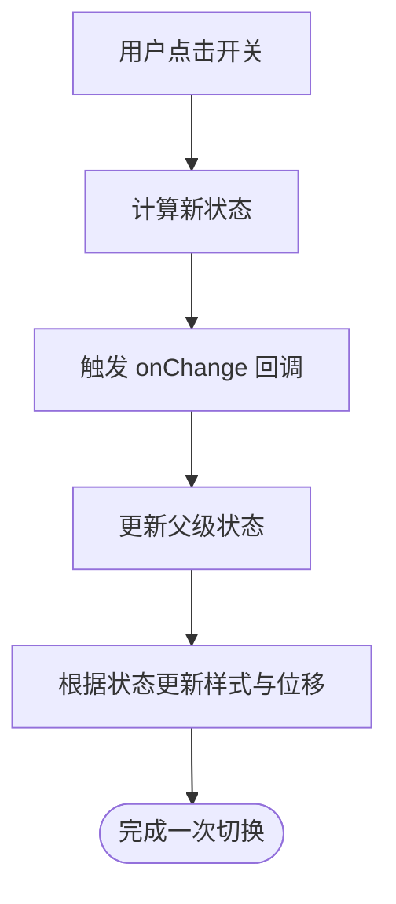
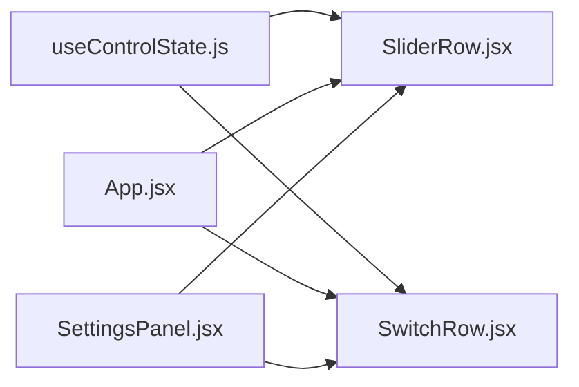

# 表单控件组件

<cite>
**本文档引用的文件**
- [SliderRow.jsx](file://src/components/ui/SliderRow.jsx)
- [SwitchRow.jsx](file://src/components/ui/SwitchRow.jsx)
- [useControlState.js](file://src/hooks/useControlState.js)
- [App.jsx](file://src/App.jsx)
- [SettingsPanel.jsx](file://src/components/panels/SettingsPanel.jsx)
</cite>

## 目录
1. [简介](#简介)
2. [项目结构](#项目结构)
3. [核心组件](#核心组件)
4. [架构概览](#架构概览)
5. [详细组件分析](#详细组件分析)
6. [依赖关系分析](#依赖关系分析)
7. [性能考虑](#性能考虑)
8. [故障排除指南](#故障排除指南)
9. [结论](#结论)
10. [附录](#附录)

## 简介
本文件为表单控件组件的综合技术文档，重点覆盖滑块控件（SliderRow）与开关控件（SwitchRow）的设计与实现。文档从交互机制、状态管理、样式定制、可访问性支持等维度进行深入解析，并总结两者的共同设计模式与差异化实现，提供属性配置指南、使用场景与最佳实践建议。

## 项目结构
表单控件位于前端组件目录中，采用简洁的函数式组件设计，配合自定义 Hook 实现状态管理与复用逻辑。组件通过 props 接收外部配置，内部通过受控方式更新 UI，确保数据流清晰可控。

**图表来源**
- [SliderRow.jsx:1-23](file://src/components/ui/SliderRow.jsx#L1-L23)
- [SwitchRow.jsx:1-21](file://src/components/ui/SwitchRow.jsx#L1-L21)
- [useControlState.js:1-200](file://src/hooks/useControlState.js#L1-L200)
- [App.jsx:1-200](file://src/App.jsx#L1-L200)
- [SettingsPanel.jsx:1-200](file://src/components/panels/SettingsPanel.jsx#L1-L200)

**章节来源**
- [SliderRow.jsx:1-23](file://src/components/ui/SliderRow.jsx#L1-L23)
- [SwitchRow.jsx:1-21](file://src/components/ui/SwitchRow.jsx#L1-L21)
- [useControlState.js:1-200](file://src/hooks/useControlState.js#L1-L200)
- [App.jsx:1-200](file://src/App.jsx#L1-L200)
- [SettingsPanel.jsx:1-200](file://src/components/panels/SettingsPanel.jsx#L1-L200)

## 核心组件
本节概述两个表单控件的核心职责与公共特性：
- SliderRow：提供连续数值选择的滑块输入，支持最小值、最大值、步长、单位显示与禁用态。
- SwitchRow：提供二进制切换的按钮式控件，支持标签文本与点击切换逻辑。

两者均采用受控组件模式，通过 props 驱动 UI 更新，避免内部状态冗余，便于在上层统一管理。

**章节来源**
- [SliderRow.jsx:1-23](file://src/components/ui/SliderRow.jsx#L1-L23)
- [SwitchRow.jsx:1-21](file://src/components/ui/SwitchRow.jsx#L1-L21)

## 架构概览
下图展示表单控件在应用中的典型调用链路：面板组件通过 props 将配置传递给控件；控件触发 onChange 回调；上层通过自定义 Hook 或本地状态处理变更并更新界面。

**图表来源**
- [SettingsPanel.jsx:1-200](file://src/components/panels/SettingsPanel.jsx#L1-L200)
- [App.jsx:1-200](file://src/App.jsx#L1-L200)
- [SliderRow.jsx:1-23](file://src/components/ui/SliderRow.jsx#L1-L23)
- [SwitchRow.jsx:1-21](file://src/components/ui/SwitchRow.jsx#L1-L21)
- [useControlState.js:1-200](file://src/hooks/useControlState.js#L1-L200)

## 详细组件分析

### 滑块控件 SliderRow 实现机制
SliderRow 基于 HTML range 输入实现，具备以下关键特性：
- 拖拽交互：原生 input[type="range"] 提供平滑拖拽体验，组件通过 onChange 回调返回数值。
- 数值范围控制：通过 min、max、step 控制取值区间与粒度，默认步长为 1。
- 实时反馈：顶部标签与右侧数值区域同步显示当前值与单位，支持自定义 displayValue 覆盖显示。
- 禁用态支持：disabled 属性控制交互与视觉状态，透明度与光标样式随禁用状态变化。

**图表来源**
- [SliderRow.jsx:10-18](file://src/components/ui/SliderRow.jsx#L10-L18)

**章节来源**
- [SliderRow.jsx:1-23](file://src/components/ui/SliderRow.jsx#L1-L23)

### 开关控件 SwitchRow 实现机制
SwitchRow 通过按钮容器模拟开关外观，具备以下特性：
- 状态管理：checked 属性驱动视觉状态，点击时通过 onChange 切换布尔值。
- 动画效果：使用 CSS 过渡与 transform 实现圆点移动与背景色变化，提供流畅的切换反馈。
- 可访问性：按钮元素具备可聚焦性与键盘可达性；建议在上层结合 aria-* 属性增强语义。
- 样式定制：通过 CSS 变量与内联样式的组合实现主题适配与边框、背景色控制。

**图表来源**
- [SwitchRow.jsx:5-16](file://src/components/ui/SwitchRow.jsx#L5-L16)

**章节来源**
- [SwitchRow.jsx:1-21](file://src/components/ui/SwitchRow.jsx#L1-L21)

### 共同设计模式与差异化实现
- 共同设计模式
  - 受控组件：两者均通过 props 驱动 UI，避免内部状态，便于集中管理。
  - 事件回调：均提供 onChange 回调，约定参数类型与返回值，便于上层处理。
  - 主题适配：通过 CSS 变量与内联样式实现主题兼容，保证在不同背景下的一致性。
- 差异化实现
  - 数据类型：SliderRow 处理连续数值，SwitchRow 处理离散布尔值。
  - 交互形态：SliderRow 依赖拖拽，SwitchRow 依赖点击切换。
  - 显示策略：SliderRow 支持单位与自定义显示值，SwitchRow 侧重视觉状态指示。

**章节来源**
- [SliderRow.jsx:1-23](file://src/components/ui/SliderRow.jsx#L1-L23)
- [SwitchRow.jsx:1-21](file://src/components/ui/SwitchRow.jsx#L1-L21)

### 属性配置指南
- SliderRow 属性
  - label: 字符串，左侧显示的标签文本
  - value: 数值，当前选中值
  - min: 数值，最小允许值
  - max: 数值，最大允许值
  - step: 数值，步长，默认 1
  - onChange: 函数，接收数值参数并返回 void
  - unit: 字符串，右侧单位显示
  - displayValue: 可选字符串，覆盖默认显示值
  - disabled: 布尔值，禁用态
- SwitchRow 属性
  - label: 字符串，左侧显示的标签文本
  - checked: 布尔值，当前选中状态
  - onChange: 函数，接收布尔值参数并返回 void

使用建议
- SliderRow
  - 设置合理的 min/max/step，确保用户可感知的粒度
  - 使用 displayValue 与 unit 提升可读性
  - 在复杂场景中结合 useControlState 管理多个滑块状态
- SwitchRow
  - 为每个开关提供明确的 label 文案
  - 在需要时添加 aria-checked 与 aria-label 提升可访问性
  - 结合 onChange 的防抖或批量提交策略优化性能

**章节来源**
- [SliderRow.jsx:1-23](file://src/components/ui/SliderRow.jsx#L1-L23)
- [SwitchRow.jsx:1-21](file://src/components/ui/SwitchRow.jsx#L1-L21)
- [useControlState.js:1-200](file://src/hooks/useControlState.js#L1-L200)

### 实际使用场景与最佳实践
- 设置面板集成
  - 在 SettingsPanel 中组合多个 SliderRow 与 SwitchRow，形成统一的控制区
  - 通过 App 状态管理器集中处理所有控件的变更，保持数据一致性
- 性能优化
  - 对高频变更的 SliderRow，建议在 onChange 中加入节流/防抖
  - SwitchRow 的样式过渡已内置，避免额外的重绘开销
- 可访问性
  - 为 SwitchRow 添加 aria-label 与 aria-checked
  - 为 SliderRow 提供 aria-valuemin/aria-valuemax/aria-valuenow
- 样式定制
  - 通过 CSS 变量统一主题色，减少硬编码
  - 使用 Tailwind 类名与内联样式的组合，兼顾灵活性与可维护性

**章节来源**
- [SettingsPanel.jsx:1-200](file://src/components/panels/SettingsPanel.jsx#L1-L200)
- [App.jsx:1-200](file://src/App.jsx#L1-L200)

## 依赖关系分析
- 组件依赖
  - SliderRow 与 SwitchRow 作为 UI 组件，不直接依赖外部状态管理库，通过 props 与回调解耦
  - useControlState 作为通用 Hook，被多个组件共享，提升状态复用效率
- 调用关系
  - SettingsPanel 与 App 作为容器组件，负责组装与传递 props
  - 控件通过回调向上层传递变更，上层决定如何持久化或响应

**图表来源**
- [useControlState.js:1-200](file://src/hooks/useControlState.js#L1-L200)
- [SliderRow.jsx:1-23](file://src/components/ui/SliderRow.jsx#L1-L23)
- [SwitchRow.jsx:1-21](file://src/components/ui/SwitchRow.jsx#L1-L21)
- [App.jsx:1-200](file://src/App.jsx#L1-L200)
- [SettingsPanel.jsx:1-200](file://src/components/panels/SettingsPanel.jsx#L1-L200)

**章节来源**
- [useControlState.js:1-200](file://src/hooks/useControlState.js#L1-L200)
- [SliderRow.jsx:1-23](file://src/components/ui/SliderRow.jsx#L1-L23)
- [SwitchRow.jsx:1-21](file://src/components/ui/SwitchRow.jsx#L1-L21)
- [App.jsx:1-200](file://src/App.jsx#L1-L200)
- [SettingsPanel.jsx:1-200](file://src/components/panels/SettingsPanel.jsx#L1-L200)

## 性能考虑
- 事件处理
  - SliderRow 的 onChange 应避免在每次拖拽时执行昂贵操作，建议在松手后统一提交
  - SwitchRow 的点击切换为轻量操作，但应避免在高频切换场景中频繁重渲染
- 渲染优化
  - 使用 React.memo 或类似手段对容器组件进行包裹，减少不必要的重渲染
  - 合理拆分组件，将独立的控件封装为独立单元，降低耦合度
- 样式与动画
  - SwitchRow 的 transform 与过渡已在组件内实现，注意避免在同一元素上叠加复杂动画

## 故障排除指南
- 滑块无法拖动
  - 检查 disabled 属性是否被意外启用
  - 确认 onChange 回调是否正确接收数值类型
- 数值显示异常
  - 检查 displayValue 是否覆盖了期望的显示值
  - 确认 unit 与 displayValue 的拼接逻辑是否符合预期
- 开关状态不更新
  - 确认 onChange 回调是否正确切换布尔值
  - 检查父级状态是否正确传递到 checked 属性
- 可访问性问题
  - 为 SwitchRow 添加 aria-label 与 aria-checked
  - 为 SliderRow 添加 aria-valuemin/aria-valuemax/aria-valuenow

**章节来源**
- [SliderRow.jsx:1-23](file://src/components/ui/SliderRow.jsx#L1-L23)
- [SwitchRow.jsx:1-21](file://src/components/ui/SwitchRow.jsx#L1-L21)

## 结论
SliderRow 与 SwitchRow 以简洁的函数式组件形式实现了表单控件的核心能力：滑块的连续数值选择与开关的二进制切换。二者遵循相同的受控组件模式与事件回调约定，同时在交互形态与显示策略上各有侧重。通过 useControlState 等通用 Hook，可以高效地在应用中复用状态管理逻辑，提升开发效率与可维护性。建议在实际项目中结合可访问性规范与性能优化策略，确保用户体验与系统稳定性。

## 附录
- 相关文件路径
  - [SliderRow.jsx](file://src/components/ui/SliderRow.jsx)
  - [SwitchRow.jsx](file://src/components/ui/SwitchRow.jsx)
  - [useControlState.js](file://src/hooks/useControlState.js)
  - [App.jsx](file://src/App.jsx)
  - [SettingsPanel.jsx](file://src/components/panels/SettingsPanel.jsx)