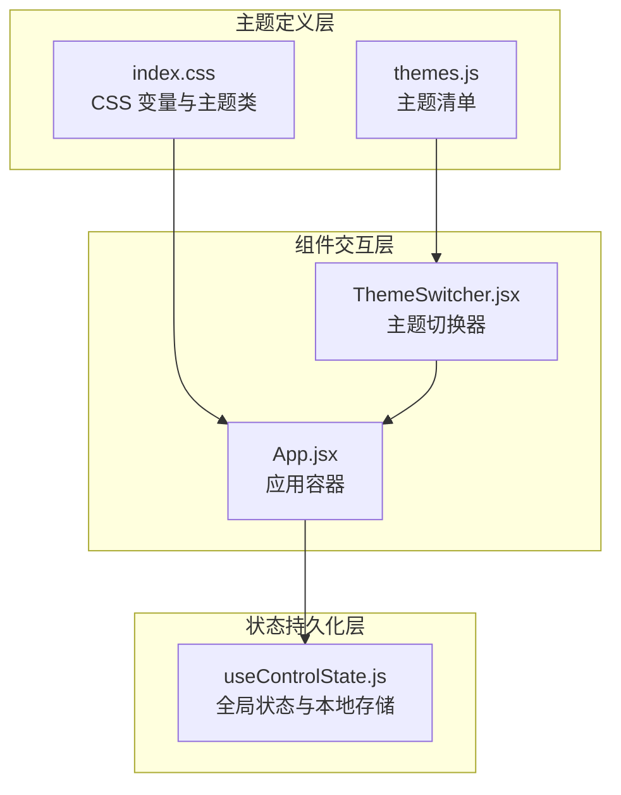
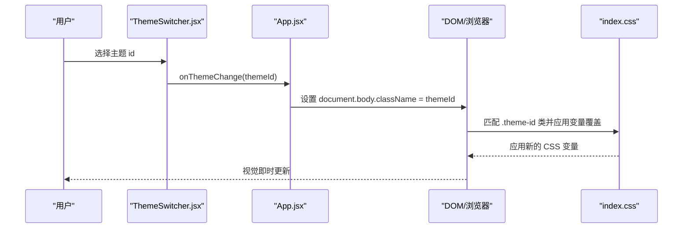
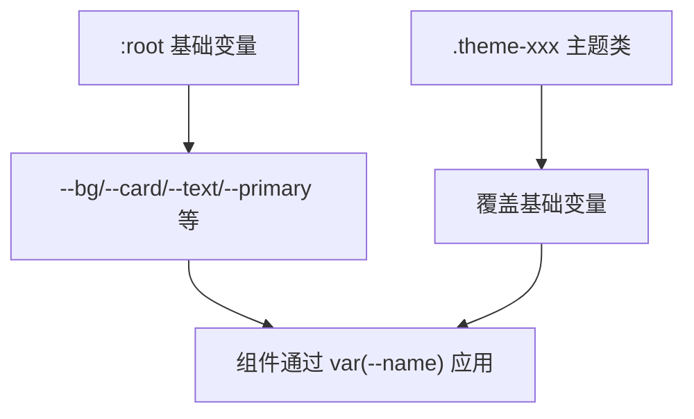
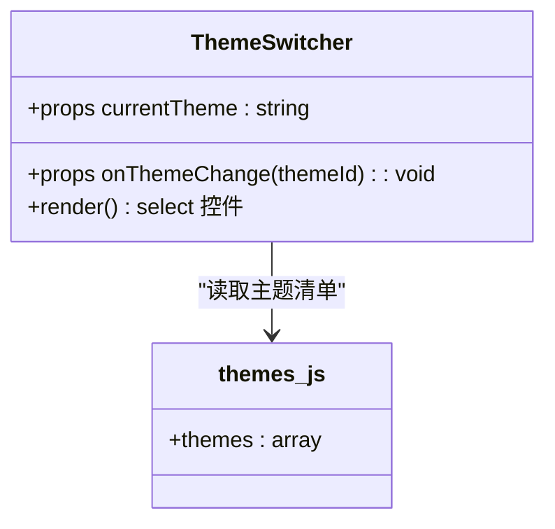
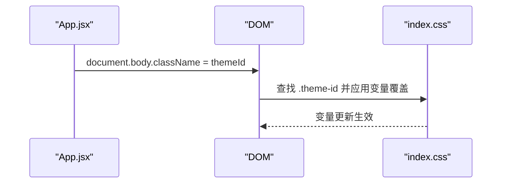
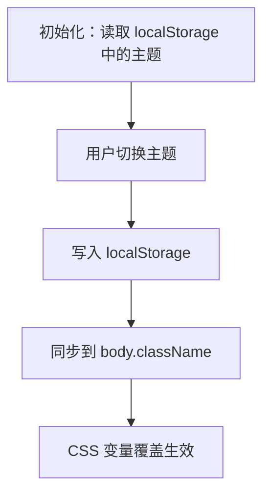
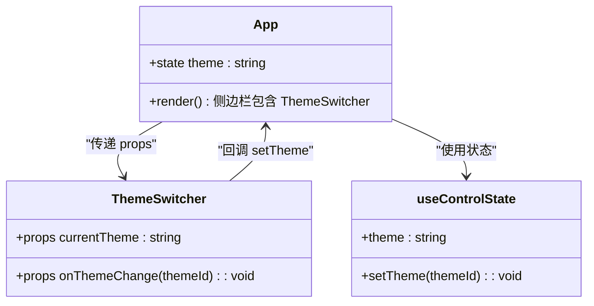
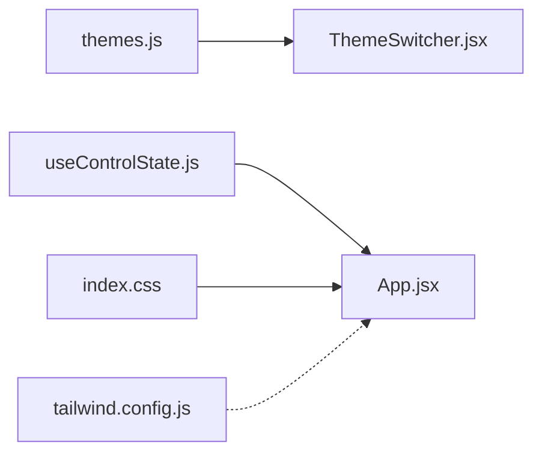

# 主题系统

<cite>
**本文档引用的文件**
- [src/data/themes.js](file://src/data/themes.js)
- [src/components/ThemeSwitcher.jsx](file://src/components/ThemeSwitcher.jsx)
- [src/index.css](file://src/index.css)
- [src/App.jsx](file://src/App.jsx)
- [src/hooks/useControlState.js](file://src/hooks/useControlState.js)
- [tailwind.config.js](file://tailwind.config.js)
</cite>

## 目录
1. [简介](#简介)
2. [项目结构](#项目结构)
3. [核心组件](#核心组件)
4. [架构总览](#架构总览)
5. [详细组件分析](#详细组件分析)
6. [依赖关系分析](#依赖关系分析)
7. [性能考量](#性能考量)
8. [故障排除指南](#故障排除指南)
9. [结论](#结论)
10. [附录](#附录)

## 简介
本文件系统性解析 DOUZHANZHE-Control 的主题系统，围绕“CSS 变量驱动的主题切换”展开，涵盖主题定义、变量映射、动态应用、切换器实现、用户偏好存储、主题预览与即时切换效果、数据结构设计（颜色定义、层级关系与继承规则）、可扩展性（自定义主题开发、打包与发布流程）、以及主题定制的最佳实践（色彩搭配与无障碍设计）。文档同时提供可视化图示帮助理解代码与样式之间的交互。

## 项目结构
主题系统由三层协同构成：
- 主题定义层：集中于主题清单与 CSS 变量集合
- 组件交互层：主题切换器与应用容器
- 状态持久化层：本地存储与全局状态钩子

**图表来源**
- [src/data/themes.js:1-33](file://src/data/themes.js#L1-L33)
- [src/index.css:1-460](file://src/index.css#L1-L460)
- [src/components/ThemeSwitcher.jsx:1-24](file://src/components/ThemeSwitcher.jsx#L1-L24)
- [src/App.jsx:1-134](file://src/App.jsx#L1-L134)
- [src/hooks/useControlState.js:1-355](file://src/hooks/useControlState.js#L1-L355)

**章节来源**
- [src/data/themes.js:1-33](file://src/data/themes.js#L1-L33)
- [src/index.css:1-460](file://src/index.css#L1-L460)
- [src/components/ThemeSwitcher.jsx:1-24](file://src/components/ThemeSwitcher.jsx#L1-L24)
- [src/App.jsx:1-134](file://src/App.jsx#L1-L134)
- [src/hooks/useControlState.js:1-355](file://src/hooks/useControlState.js#L1-L355)

## 核心组件
- 主题清单 themes.js：提供主题 id 与名称的映射，作为切换器选项来源
- CSS 变量与主题类 index.css：定义基础变量与各主题类的变量覆盖
- 主题切换器 ThemeSwitcher.jsx：基于受控组件模式，接收当前主题与变更回调
- 应用容器 App.jsx：将主题类同步到 body，使 CSS 变量生效
- 全局状态 useControlState.js：负责主题与设置的本地持久化与跨组件共享

**章节来源**
- [src/data/themes.js:1-33](file://src/data/themes.js#L1-L33)
- [src/index.css:1-460](file://src/index.css#L1-L460)
- [src/components/ThemeSwitcher.jsx:1-24](file://src/components/ThemeSwitcher.jsx#L1-L24)
- [src/App.jsx:1-134](file://src/App.jsx#L1-L134)
- [src/hooks/useControlState.js:1-355](file://src/hooks/useControlState.js#L1-L355)

## 架构总览
主题切换采用“类名驱动 + CSS 变量覆盖”的轻量机制：
- 用户在切换器中选择主题 id
- App 将该 id 作为类名设置到 body 上
- index.css 中对应的主题类覆盖 :root 的 CSS 变量
- 所有组件通过 var(--变量名) 使用这些变量，从而实现即时主题切换

**图表来源**
- [src/components/ThemeSwitcher.jsx:1-24](file://src/components/ThemeSwitcher.jsx#L1-L24)
- [src/App.jsx:39-40](file://src/App.jsx#L39-L40)
- [src/index.css:1-460](file://src/index.css#L1-L460)

**章节来源**
- [src/components/ThemeSwitcher.jsx:1-24](file://src/components/ThemeSwitcher.jsx#L1-L24)
- [src/App.jsx:39-40](file://src/App.jsx#L39-L40)
- [src/index.css:1-460](file://src/index.css#L1-L460)

## 详细组件分析

### 主题数据结构与变量映射
- 基础变量：:root 定义了背景、卡片、文本、强调色、主色、危险色、边框等基础变量
- 主题类：每个 .theme-xxx 类覆盖上述变量，形成完整的视觉风格
- 变量使用：组件通过 var(--变量名) 访问，无需硬编码颜色值

**图表来源**
- [src/index.css:5-18](file://src/index.css#L5-L18)
- [src/index.css:20-32](file://src/index.css#L20-L32)
- [src/index.css:34-46](file://src/index.css#L34-L46)

**章节来源**
- [src/index.css:5-18](file://src/index.css#L5-L18)
- [src/index.css:20-32](file://src/index.css#L20-L32)
- [src/index.css:34-46](file://src/index.css#L34-L46)

### 主题切换器实现原理
- 输入：currentTheme（当前主题 id）、onThemeChange（变更回调）
- 行为：受控 select，onChange 时调用 onThemeChange
- 样式：直接使用 CSS 变量进行内联样式，确保与主题一致

**图表来源**
- [src/components/ThemeSwitcher.jsx:1-24](file://src/components/ThemeSwitcher.jsx#L1-L24)
- [src/data/themes.js:1-33](file://src/data/themes.js#L1-L33)

**章节来源**
- [src/components/ThemeSwitcher.jsx:1-24](file://src/components/ThemeSwitcher.jsx#L1-L24)
- [src/data/themes.js:1-33](file://src/data/themes.js#L1-L33)

### 应用容器中的动态应用
- App 在主题变化时，将主题 id 设置为 body 的类名
- 由于 index.css 中的主题类覆盖 :root 变量，页面立即响应新主题

**图表来源**
- [src/App.jsx:39-40](file://src/App.jsx#L39-L40)
- [src/index.css:1-460](file://src/index.css#L1-L460)

**章节来源**
- [src/App.jsx:39-40](file://src/App.jsx#L39-L40)
- [src/index.css:1-460](file://src/index.css#L1-L460)

### 用户偏好存储与持久化
- useControlState 负责：
  - 初始化：从 localStorage 读取主题，默认为指定主题
  - 变更：每次主题变化写入 localStorage
  - 同步：将主题类名同步到 body，保证 CSS 变量即时生效

**图表来源**
- [src/hooks/useControlState.js:26-29](file://src/hooks/useControlState.js#L26-L29)
- [src/hooks/useControlState.js:140-142](file://src/hooks/useControlState.js#L140-L142)
- [src/App.jsx:39-40](file://src/App.jsx#L39-L40)

**章节来源**
- [src/hooks/useControlState.js:26-29](file://src/hooks/useControlState.js#L26-L29)
- [src/hooks/useControlState.js:140-142](file://src/hooks/useControlState.js#L140-L142)
- [src/App.jsx:39-40](file://src/App.jsx#L39-L40)

### 主题切换器在应用中的集成
- App 渲染侧边栏区域的 ThemeSwitcher
- 传入 currentTheme 与 setTheme（来自 useControlState）
- 切换后即时生效，无需刷新页面

**图表来源**
- [src/App.jsx:64-67](file://src/App.jsx#L64-L67)
- [src/App.jsx:28-29](file://src/App.jsx#L28-L29)
- [src/components/ThemeSwitcher.jsx:1-24](file://src/components/ThemeSwitcher.jsx#L1-L24)
- [src/hooks/useControlState.js:1-355](file://src/hooks/useControlState.js#L1-L355)

**章节来源**
- [src/App.jsx:64-67](file://src/App.jsx#L64-L67)
- [src/App.jsx:28-29](file://src/App.jsx#L28-L29)
- [src/components/ThemeSwitcher.jsx:1-24](file://src/components/ThemeSwitcher.jsx#L1-L24)
- [src/hooks/useControlState.js:1-355](file://src/hooks/useControlState.js#L1-L355)

## 依赖关系分析
- ThemeSwitcher 依赖 themes.js 提供主题选项
- App 依赖 useControlState 提供主题状态与 setter
- App 依赖 index.css 的 CSS 变量与主题类
- Tailwind 配置未直接参与主题变量，但影响组件样式生成

**图表来源**
- [src/data/themes.js:1-33](file://src/data/themes.js#L1-L33)
- [src/components/ThemeSwitcher.jsx:1-24](file://src/components/ThemeSwitcher.jsx#L1-L24)
- [src/hooks/useControlState.js:1-355](file://src/hooks/useControlState.js#L1-L355)
- [src/App.jsx:1-134](file://src/App.jsx#L1-L134)
- [src/index.css:1-460](file://src/index.css#L1-L460)
- [tailwind.config.js:1-12](file://tailwind.config.js#L1-L12)

**章节来源**
- [src/data/themes.js:1-33](file://src/data/themes.js#L1-L33)
- [src/components/ThemeSwitcher.jsx:1-24](file://src/components/ThemeSwitcher.jsx#L1-L24)
- [src/hooks/useControlState.js:1-355](file://src/hooks/useControlState.js#L1-L355)
- [src/App.jsx:1-134](file://src/App.jsx#L1-L134)
- [src/index.css:1-460](file://src/index.css#L1-L460)
- [tailwind.config.js:1-12](file://tailwind.config.js#L1-L12)

## 性能考量
- 切换成本低：纯 CSS 变量覆盖，无需重新渲染组件树
- 无第三方主题库：减少包体积与运行时开销
- 本地存储：避免每次启动重复计算，提升首屏体验
- 动画与过渡：Tailwind 的 slide-up 动画与主题切换互不影响

[本节为通用指导，不涉及具体文件分析]

## 故障排除指南
- 切换无效
  - 检查 App 是否正确将主题类名设置到 body
  - 确认 index.css 中是否存在对应的 .theme-id 类
- 样式异常
  - 确保 CSS 变量覆盖语法正确，且未被其他样式覆盖
  - 检查组件是否使用 var(--变量名) 而非硬编码颜色
- 本地存储问题
  - 确认 localStorage 写入成功，必要时清理缓存后重试

**章节来源**
- [src/App.jsx:39-40](file://src/App.jsx#L39-L40)
- [src/index.css:1-460](file://src/index.css#L1-L460)
- [src/hooks/useControlState.js:140-142](file://src/hooks/useControlState.js#L140-L142)

## 结论
DOUZHANZHE-Control 的主题系统以“CSS 变量 + 类名覆盖”为核心，具备以下优势：
- 切换即时、性能优异
- 结构清晰、易于扩展
- 与组件样式解耦，便于维护
建议在后续迭代中继续沿用此模式，结合无障碍规范与色彩对比度测试，持续优化用户体验。

[本节为总结性内容，不涉及具体文件分析]

## 附录

### 主题数据结构设计要点
- 颜色定义：以基础变量为“皮肤底座”，主题类覆盖关键变量
- 层级关系：:root 为基础，.theme-xxx 为主题覆盖层
- 继承规则：未显式覆盖的变量沿用 :root 值，确保一致性

**章节来源**
- [src/index.css:5-18](file://src/index.css#L5-L18)
- [src/index.css:20-32](file://src/index.css#L20-L32)

### 可扩展性与自定义主题开发
- 新增主题步骤
  - 在 themes.js 中添加 { id, name }
  - 在 index.css 中新增 .theme-id 类，覆盖所需变量
  - 如需渐变背景，可在该类中使用 CSS 渐变
- 打包与发布
  - 保持 CSS 变量命名一致，避免破坏既有主题
  - 发布前进行跨浏览器与高对比度模式测试

**章节来源**
- [src/data/themes.js:1-33](file://src/data/themes.js#L1-L33)
- [src/index.css:1-460](file://src/index.css#L1-L460)

### 主题定制指南与最佳实践
- 色彩搭配原则
  - 明暗对比：确保文本与背景满足可读性要求
  - 主次分明：primary/secondary 用于强调与次要信息
  - 一致性：同一语义（成功/警告/危险）使用统一颜色
- 无障碍设计考虑
  - 对比度：文本与背景对比度至少满足 AA/AAA 标准
  - 颜色无关信息：不依赖颜色传达关键信息
  - 高对比度模式：提供高对比度主题选项
- 实施建议
  - 为每种主题提供明/暗两套变量覆盖
  - 在 index.css 中集中管理变量，避免分散定义

**章节来源**
- [src/index.css:1-460](file://src/index.css#L1-L460)