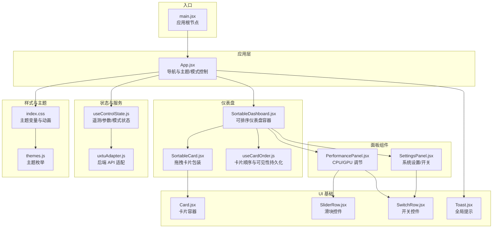
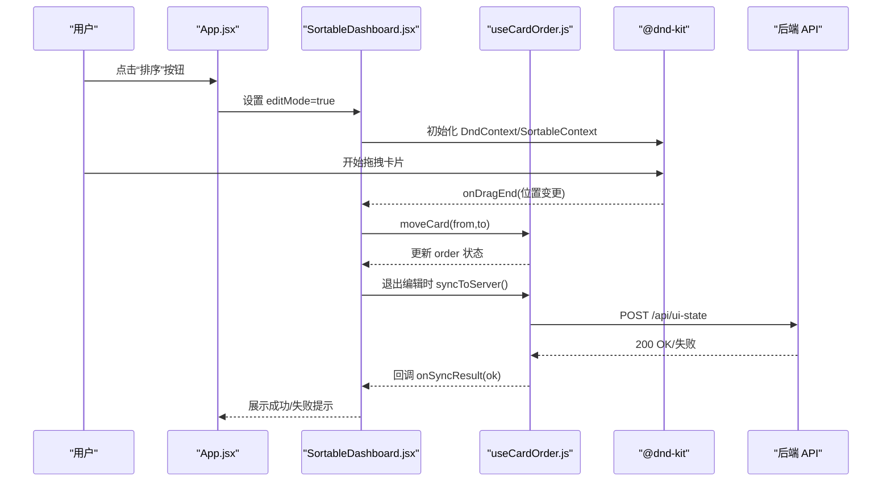
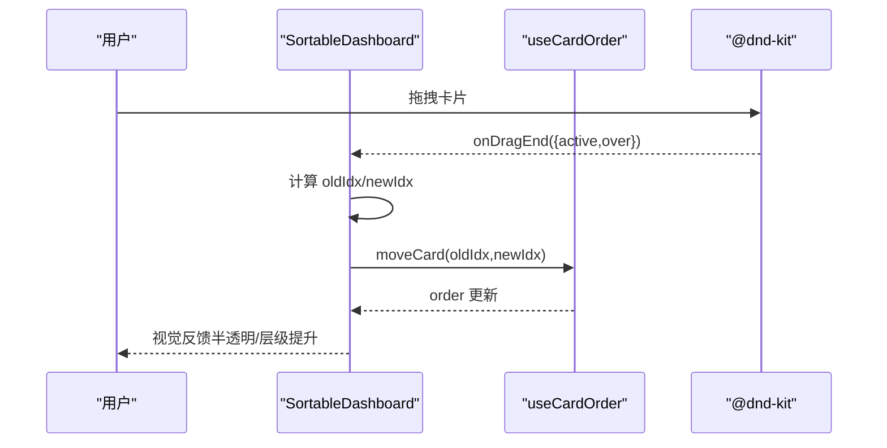
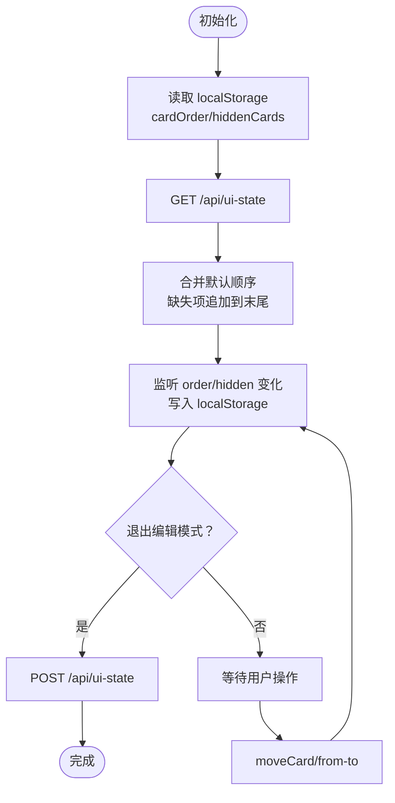
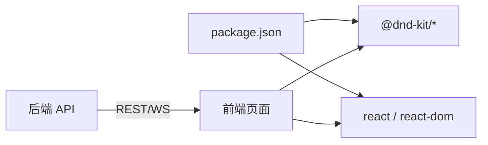

# 仪表盘系统

<cite>
**本文引用的文件**
- [src/components/SortableDashboard.jsx](file://src/components/SortableDashboard.jsx)
- [src/hooks/useCardOrder.js](file://src/hooks/useCardOrder.js)
- [src/components/ui/SortableCard.jsx](file://src/components/ui/SortableCard.jsx)
- [src/App.jsx](file://src/App.jsx)
- [src/main.jsx](file://src/main.jsx)
- [src/hooks/useControlState.js](file://src/hooks/useControlState.js)
- [src/services/uxtuAdapter.js](file://src/services/uxtuAdapter.js)
- [src/components/ui/Card.jsx](file://src/components/ui/Card.jsx)
- [src/data/themes.js](file://src/data/themes.js)
- [src/index.css](file://src/index.css)
- [src/components/panels/PerformancePanel.jsx](file://src/components/panels/PerformancePanel.jsx)
- [src/components/panels/SettingsPanel.jsx](file://src/components/panels/SettingsPanel.jsx)
- [src/components/ui/Toast.jsx](file://src/components/ui/Toast.jsx)
- [src/components/ui/SliderRow.jsx](file://src/components/ui/SliderRow.jsx)
- [src/components/ui/SwitchRow.jsx](file://src/components/ui/SwitchRow.jsx)
- [package.json](file://package.json)
</cite>

## 目录
1. [简介](#简介)
2. [项目结构](#项目结构)
3. [核心组件](#核心组件)
4. [架构总览](#架构总览)
5. [详细组件分析](#详细组件分析)
6. [依赖关系分析](#依赖关系分析)
7. [性能考虑](#性能考虑)
8. [故障排查指南](#故障排查指南)
9. [结论](#结论)
10. [附录](#附录)

## 简介
本文件为 DOUZHANZHE-Control 仪表盘系统的综合技术文档，聚焦“可排序仪表盘”的实现与扩展。内容涵盖：
- React DnD 拖拽排序机制与卡片布局算法
- 响应式网格系统与列平衡渲染
- 卡片顺序管理的持久化策略（localStorage、服务端同步与恢复）
- 交互设计（编辑模式切换、拖拽反馈与视觉提示）
- 性能优化（虚拟滚动、懒加载与渲染优化建议）
- 自定义面板开发指南与扩展方法

## 项目结构
前端采用 React + Vite 构建，核心位于 src 目录，按功能分层组织：
- components：可复用 UI 组件与业务面板
- hooks：自定义 Hook（状态与持久化逻辑）
- services：与后端通信适配器
- data：静态资源（如主题列表）
- index.css：主题变量与全局样式

图表来源
- [src/main.jsx:1-14](file://src/main.jsx#L1-L14)
- [src/App.jsx:1-134](file://src/App.jsx#L1-L134)
- [src/components/SortableDashboard.jsx:1-247](file://src/components/SortableDashboard.jsx#L1-L247)
- [src/hooks/useCardOrder.js:1-128](file://src/hooks/useCardOrder.js#L1-L128)
- [src/components/ui/SortableCard.jsx:1-43](file://src/components/ui/SortableCard.jsx#L1-L43)
- [src/components/panels/PerformancePanel.jsx:1-213](file://src/components/panels/PerformancePanel.jsx#L1-L213)
- [src/components/panels/SettingsPanel.jsx:1-124](file://src/components/panels/SettingsPanel.jsx#L1-L124)
- [src/hooks/useControlState.js:1-355](file://src/hooks/useControlState.js#L1-L355)
- [src/services/uxtuAdapter.js:1-130](file://src/services/uxtuAdapter.js#L1-L130)
- [src/components/ui/Card.jsx:1-18](file://src/components/ui/Card.jsx#L1-L18)
- [src/components/ui/SliderRow.jsx:1-23](file://src/components/ui/SliderRow.jsx#L1-L23)
- [src/components/ui/SwitchRow.jsx:1-21](file://src/components/ui/SwitchRow.jsx#L1-L21)
- [src/components/ui/Toast.jsx:1-50](file://src/components/ui/Toast.jsx#L1-L50)
- [src/index.css:1-460](file://src/index.css#L1-L460)
- [src/data/themes.js:1-34](file://src/data/themes.js#L1-L34)

章节来源
- [src/main.jsx:1-14](file://src/main.jsx#L1-L14)
- [src/App.jsx:1-134](file://src/App.jsx#L1-L134)
- [package.json:1-33](file://package.json#L1-L33)

## 核心组件
- 可排序仪表盘容器：负责 DnD 上下文、列平衡网格渲染、卡片映射与编辑模式下的隐藏/重置操作。
- 卡片排序包装：基于 @dnd-kit/sortable 提供拖拽行为与视觉反馈。
- 卡片顺序 Hook：统一管理本地持久化、服务端同步与可见性控制。
- 应用主控：主题切换、标签页持久化、模式选择与编辑模式开关。
- 状态与服务：遥测数据、参数、模式切换、WebSocket 遥测回退与后端 API 适配。

章节来源
- [src/components/SortableDashboard.jsx:1-247](file://src/components/SortableDashboard.jsx#L1-L247)
- [src/components/ui/SortableCard.jsx:1-43](file://src/components/ui/SortableCard.jsx#L1-L43)
- [src/hooks/useCardOrder.js:1-128](file://src/hooks/useCardOrder.js#L1-L128)
- [src/App.jsx:1-134](file://src/App.jsx#L1-L134)
- [src/hooks/useControlState.js:1-355](file://src/hooks/useControlState.js#L1-L355)
- [src/services/uxtuAdapter.js:1-130](file://src/services/uxtuAdapter.js#L1-L130)

## 架构总览
仪表盘系统采用“容器-展示”分层与 Hook 抽象，结合 DnD 与响应式网格实现可排序、可定制的仪表盘体验。编辑模式下通过拖拽改变顺序，通过 localStorage 与服务端同步保存用户偏好。

图表来源
- [src/App.jsx:34-63](file://src/App.jsx#L34-L63)
- [src/components/SortableDashboard.jsx:49-57](file://src/components/SortableDashboard.jsx#L49-L57)
- [src/hooks/useCardOrder.js:78-91](file://src/hooks/useCardOrder.js#L78-L91)

## 详细组件分析

### 可排序仪表盘容器（SortableDashboard）
- DnD 集成：使用 DndContext、PointerSensor/TouchSensor、SortableContext 与 verticalListSortingStrategy 实现垂直拖拽排序。
- 布局算法：使用 CSS 多列（columns-1 md:columns-2 lg:columns-3）与 column-fill:balance 实现列平衡，保证卡片在不同宽度下均匀分布。
- 卡片映射：根据 order 顺序渲染具体面板（CPU/GPU 监控、内存/硬盘、风扇信息、性能调节、系统设置、GPU 模式、关于等），部分面板以组合子形式嵌入。
- 编辑模式：在 editMode 下显示拖拽手柄与隐藏按钮，提供“全部显示/重置排序”等快捷操作。
- 退出编辑同步：在 editMode 由 true 变为 false 时，调用 syncToServer 将当前 order 与 hiddenCards 发送到服务端。

章节来源
- [src/components/SortableDashboard.jsx:194-246](file://src/components/SortableDashboard.jsx#L194-L246)
- [src/components/SortableDashboard.jsx:64-71](file://src/components/SortableDashboard.jsx#L64-L71)
- [src/components/SortableDashboard.jsx:196-205](file://src/components/SortableDashboard.jsx#L196-L205)

#### 拖拽流程时序

图表来源
- [src/components/SortableDashboard.jsx:64-71](file://src/components/SortableDashboard.jsx#L64-L71)
- [src/hooks/useCardOrder.js:93-100](file://src/hooks/useCardOrder.js#L93-L100)

### 卡片排序包装（SortableCard）
- 使用 useSortable 提供 attributes/listeners 与 transform/transition/opacity 等样式，实现拖拽时的视觉反馈（半透明、z-index 提升）。
- 在编辑模式下渲染拖拽手柄与隐藏按钮，隐藏按钮回调由父容器注入。

章节来源
- [src/components/ui/SortableCard.jsx:4-42](file://src/components/ui/SortableCard.jsx#L1-L43)

### 卡片顺序管理 Hook（useCardOrder）
- 默认顺序与隐藏集合：定义 DEFAULT_ORDER 与 DEFAULT_HIDDEN，确保新卡片加入时有序合入。
- 本地持久化：localStorage 存储 cardOrder 与 hiddenCards，每次更新即写入。
- 服务端同步：退出编辑时将当前状态 POST 到 /api/ui-state；加载时优先从服务端拉取，再与默认顺序合并。
- 操作接口：moveCard、toggleHidden、showAll、resetOrder、syncToServer，以及 visibleCards/hiddenList 的派生计算。

图表来源
- [src/hooks/useCardOrder.js:29-44](file://src/hooks/useCardOrder.js#L29-L44)
- [src/hooks/useCardOrder.js:53-67](file://src/hooks/useCardOrder.js#L53-L67)
- [src/hooks/useCardOrder.js:69-76](file://src/hooks/useCardOrder.js#L69-L76)
- [src/hooks/useCardOrder.js:78-91](file://src/hooks/useCardOrder.js#L78-L91)

章节来源
- [src/hooks/useCardOrder.js:1-128](file://src/hooks/useCardOrder.js#L1-L128)

### 应用主控（App）
- 编辑模式：点击“排序/完成排序”按钮切换 editMode，并在仪表盘中传递给 SortableDashboard。
- 标签页持久化：activeTab 保存到 localStorage，支持“主页/系统/设置”三栏。
- 主题同步：将当前主题类名设置到 document.body，使 CSS 变量生效。
- 模式选择：提供四种模式（安静/均衡/斗战/野兽），切换时合并预设参数并下发到后端。

章节来源
- [src/App.jsx:30-63](file://src/App.jsx#L30-L63)
- [src/App.jsx:70-80](file://src/App.jsx#L70-L80)
- [src/App.jsx:87-128](file://src/App.jsx#L87-L128)

### 状态与服务（useControlState 与 uxtuAdapter）
- useControlState：集中管理主题、遥测、参数、历史曲线、风扇目标转速、设置等；通过 WebSocket 与后端通信，后端不可用时使用 mock 数据模拟。
- uxtuAdapter：封装后端 API（/api/uxtu/apply、/api/telemetry、/api/control、/api/gpu/set 等），提供 applyUxtuLimits、applyHardwareControl、createTelemetrySocket 等工具函数。

章节来源
- [src/hooks/useControlState.js:26-355](file://src/hooks/useControlState.js#L1-L355)
- [src/services/uxtuAdapter.js:19-130](file://src/services/uxtuAdapter.js#L1-L130)

### 面板组件
- PerformancePanel：CPU/GPU 调节面板，包含频率限制、温度墙、核心数限制、电源计划、电压与功耗等参数调整，支持去抖与 SMU 参数队列下发。
- SettingsPanel：系统开关、键盘灯亮度、开机自启等设置，部分设置通过 /api/control 下发到 HAL。

章节来源
- [src/components/panels/PerformancePanel.jsx:13-213](file://src/components/panels/PerformancePanel.jsx#L1-L213)
- [src/components/panels/SettingsPanel.jsx:8-124](file://src/components/panels/SettingsPanel.jsx#L1-L124)

### UI 基础组件
- Card：卡片容器，支持标题、右侧操作区与自定义类名。
- SliderRow/SwitchRow：滑块与开关控件，提供统一的交互与样式。
- Toast：全局提示，支持成功/错误/信息类型与自动消失。

章节来源
- [src/components/ui/Card.jsx:1-18](file://src/components/ui/Card.jsx#L1-L18)
- [src/components/ui/SliderRow.jsx:1-23](file://src/components/ui/SliderRow.jsx#L1-L23)
- [src/components/ui/SwitchRow.jsx:1-21](file://src/components/ui/SwitchRow.jsx#L1-L21)
- [src/components/ui/Toast.jsx:1-50](file://src/components/ui/Toast.jsx#L1-L50)

### 主题与样式
- 主题变量：index.css 定义多套主题，通过在 body 上切换类名应用。
- 动画与视觉：风扇旋转动画、滑块样式、控制面板阴影与边框等。

章节来源
- [src/index.css:1-460](file://src/index.css#L1-L460)
- [src/data/themes.js:1-34](file://src/data/themes.js#L1-L34)

## 依赖关系分析
- 前端依赖：@dnd-kit/core、@dnd-kit/sortable、@dnd-kit/utilities、react、react-dom。
- 项目通过 Vite 构建，构建后资源复制到后端 wwwroot。

图表来源
- [package.json:11-17](file://package.json#L11-L17)
- [package.json:1-33](file://package.json#L1-L33)

章节来源
- [package.json:1-33](file://package.json#L1-L33)

## 性能考虑
- 渲染优化
  - 使用 CSS 多列与 column-fill:balance 实现列平衡，避免复杂 JS 计算；对于大量卡片场景，建议引入虚拟滚动（见“扩展建议”）。
  - 仅在 editMode 下渲染拖拽手柄与隐藏按钮，减少非编辑态 DOM 节点数量。
- 状态与持久化
  - useCardOrder 对 order/hiddenCards 的写入使用 useEffect 监听，避免频繁重渲染；退出编辑时一次性同步到服务端。
  - useControlState 对参数与风扇目标转速采用去抖策略，降低网络请求频率。
- 数据流
  - 遥测历史使用固定长度数组切片，避免无限增长；WebSocket 与 mock 数据双通道保障稳定性。
- 扩展建议（未在仓库实现）
  - 虚拟滚动：当卡片数量较多时，使用 react-window 或同等方案进行虚拟化渲染。
  - 懒加载：对重型面板（如 GPU 状态查询）采用懒加载与缓存策略。
  - 渲染优化：对高频更新的遥测曲线与风扇动画，使用 requestAnimationFrame 或更细粒度的订阅策略。

章节来源
- [src/components/SortableDashboard.jsx:196-205](file://src/components/SortableDashboard.jsx#L196-L205)
- [src/hooks/useCardOrder.js:69-76](file://src/hooks/useCardOrder.js#L69-L76)
- [src/hooks/useControlState.js:112-126](file://src/hooks/useControlState.js#L112-L126)
- [src/hooks/useControlState.js:144-169](file://src/hooks/useControlState.js#L144-L169)
- [src/hooks/useControlState.js:34-56](file://src/hooks/useControlState.js#L34-L56)

## 故障排查指南
- 拖拽无效
  - 检查 DndContext 传感器配置与激活阈值；确认 PointerSensor/TouchSensor 的距离/延迟设置是否合理。
  - 确认 SortableContext 的 strategy 与 items 与 order 一致。
- 排序未保存
  - 确认退出编辑模式后是否触发 syncToServer；检查 /api/ui-state 是否返回 200。
  - 检查 localStorage 是否被清理或超出配额。
- 遥测无数据
  - 检查 WebSocket 连接（ws://127.0.0.1:3100/ws）是否可用；后端不可用时会回落到 mock 数据。
  - 检查后端 REST 接口（/api/telemetry、/api/control 等）是否可达。
- 设置下发失败
  - 某些设置通过 /api/control 下发到 HAL，若 HAL 不支持对应键值会失败；检查 SettingsPanel 的映射与后端返回。

章节来源
- [src/components/SortableDashboard.jsx:59-62](file://src/components/SortableDashboard.jsx#L59-L62)
- [src/hooks/useCardOrder.js:78-91](file://src/hooks/useCardOrder.js#L78-L91)
- [src/services/uxtuAdapter.js:58-71](file://src/services/uxtuAdapter.js#L58-L71)
- [src/components/panels/SettingsPanel.jsx:49-73](file://src/components/panels/SettingsPanel.jsx#L49-L73)

## 结论
该仪表盘系统通过 DnD 与响应式网格实现了直观的卡片排序体验，配合本地与服务端双重持久化策略，确保用户偏好稳定可靠。状态与服务层清晰分离，便于扩展与维护。建议在大规模卡片场景下引入虚拟滚动与懒加载，进一步提升性能与用户体验。

## 附录

### 自定义面板开发指南
- 新增面板步骤
  1) 在 SortableDashboard 的 CARD_MAP 中注册新卡片 ID 与标签。
  2) 在 renderCard 分支中添加新面板的渲染逻辑，或直接引入现有面板组件。
  3) 在 DEFAULT_ORDER 中插入新卡片 ID，确保新用户也能看到该面板。
- 交互与状态
  - 若面板需要外部状态（如参数、遥测），通过 useControlState 注入并下发到后端。
  - 使用 Toast 提供即时反馈，保持一致的错误/成功提示风格。
- 样式与主题
  - 遵循现有 Card/SliderRow/SwitchRow 约定，使用 CSS 变量与主题类名，确保在各主题下一致呈现。
- 性能与可维护性
  - 对重型面板采用懒加载；对高频更新的数据使用去抖或节流策略。
  - 将面板拆分为更小的子组件，提高复用性与测试性。

章节来源
- [src/components/SortableDashboard.jsx:25-36](file://src/components/SortableDashboard.jsx#L25-L36)
- [src/components/SortableDashboard.jsx:73-192](file://src/components/SortableDashboard.jsx#L73-L192)
- [src/hooks/useCardOrder.js:7-19](file://src/hooks/useCardOrder.js#L7-L19)
- [src/components/ui/Toast.jsx:10-18](file://src/components/ui/Toast.jsx#L10-L18)
- [src/components/ui/Card.jsx:1-18](file://src/components/ui/Card.jsx#L1-L18)
- [src/components/ui/SliderRow.jsx:1-23](file://src/components/ui/SliderRow.jsx#L1-L23)
- [src/components/ui/SwitchRow.jsx:1-21](file://src/components/ui/SwitchRow.jsx#L1-L21)