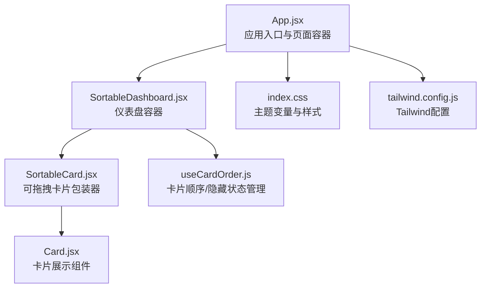
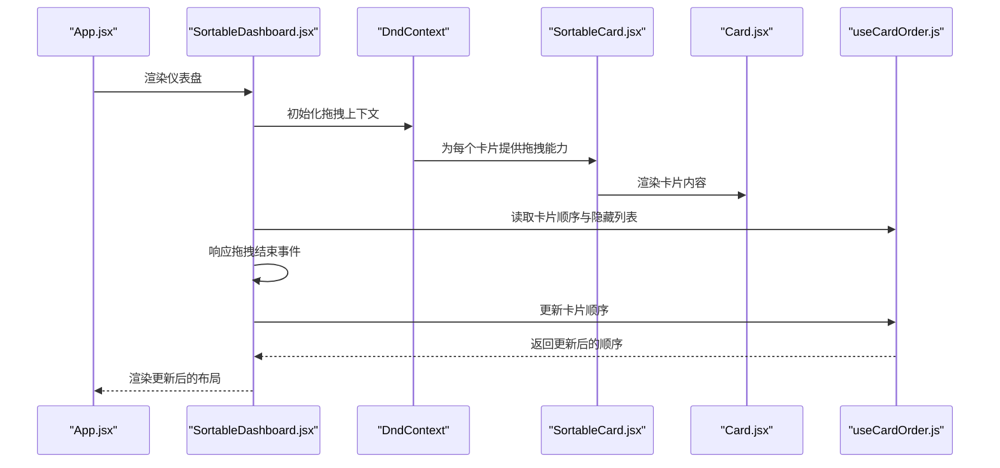
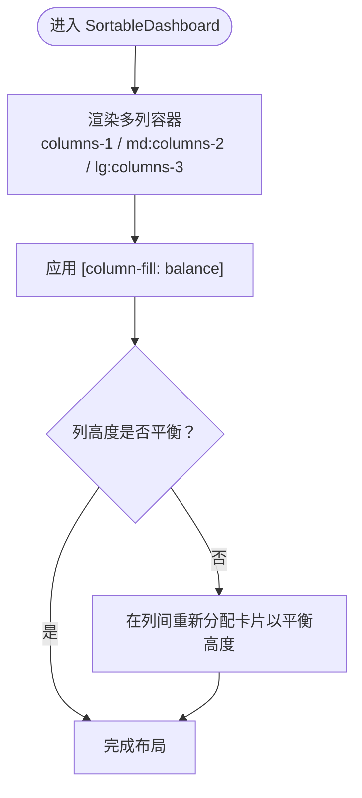
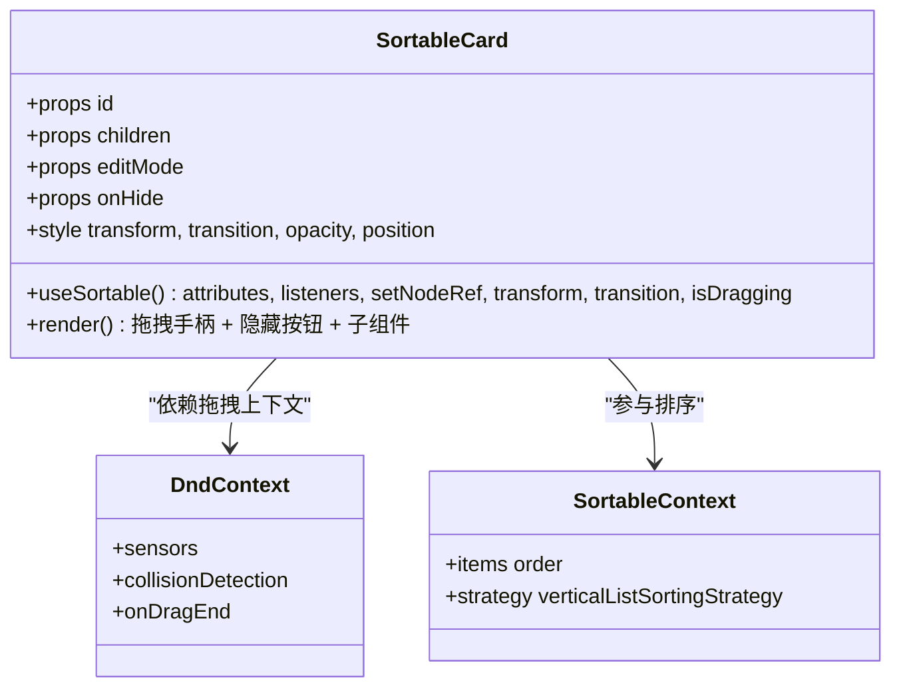
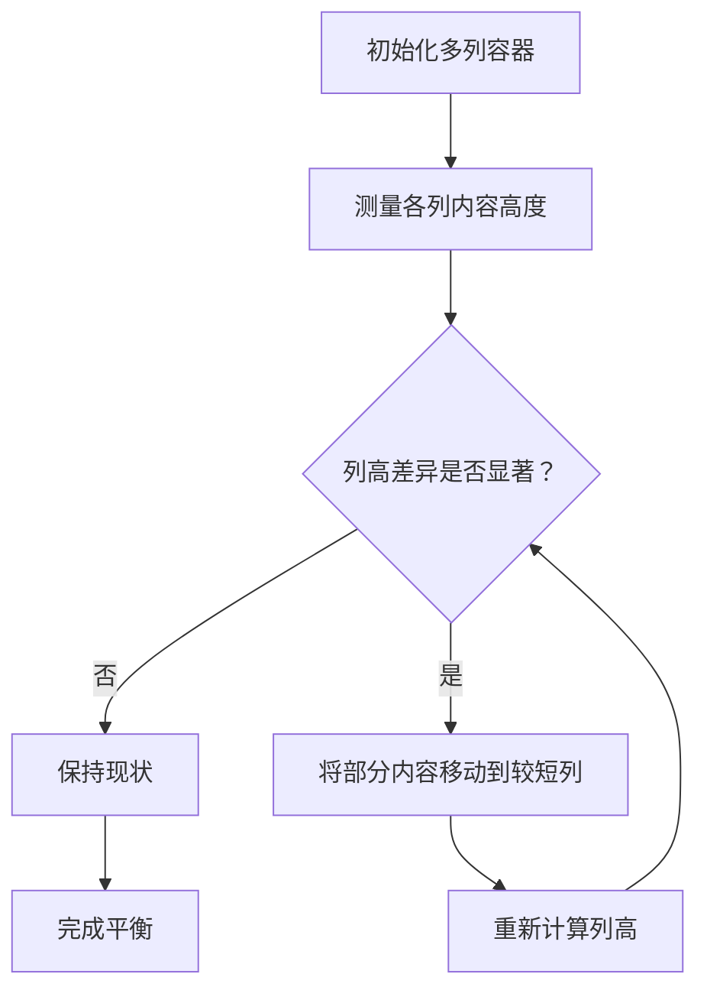
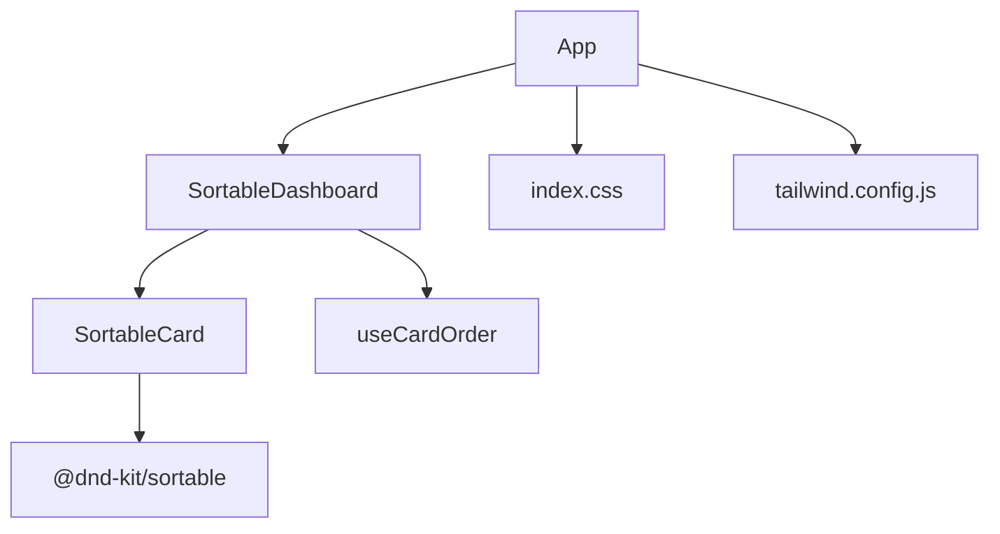

# 卡片布局系统

<cite>
**本文档引用的文件**
- [src/components/SortableDashboard.jsx](file://src/components/SortableDashboard.jsx)
- [src/components/ui/SortableCard.jsx](file://src/components/ui/SortableCard.jsx)
- [src/components/ui/Card.jsx](file://src/components/ui/Card.jsx)
- [src/hooks/useCardOrder.js](file://src/hooks/useCardOrder.js)
- [src/App.jsx](file://src/App.jsx)
- [src/index.css](file://src/index.css)
- [tailwind.config.js](file://tailwind.config.js)
- [docs/dev-frontend.md](file://docs/dev-frontend.md)
</cite>

## 目录
1. [简介](#简介)
2. [项目结构](#项目结构)
3. [核心组件](#核心组件)
4. [架构总览](#架构总览)
5. [详细组件分析](#详细组件分析)
6. [依赖关系分析](#依赖关系分析)
7. [性能考虑](#性能考虑)
8. [故障排除指南](#故障排除指南)
9. [结论](#结论)
10. [附录](#附录)

## 简介
本文件系统性梳理 DOUZHANZHE-Control 的卡片布局系统，重点围绕 CSS 多列布局（columns-1、md:columns-2、lg:columns-3）与响应式断点配置，深入解析 [column-fill: balance] 属性的平衡填充算法，阐述 SortableCard 组件的包装机制与拖拽上下文集成，分析不同屏幕尺寸下的布局适配策略与移动端优化，并提供自定义布局方案与网格系统的扩展方法。

## 项目结构
该布局系统主要由以下层次构成：
- 应用入口与页面容器：App.jsx 提供主题切换、导航与主内容区布局。
- 仪表盘容器：SortableDashboard.jsx 负责卡片集合的多列布局、拖拽排序与可见性管理。
- 卡片包装器：SortableCard.jsx 将每个卡片包裹为可拖拽单元，提供拖拽手柄与隐藏控制。
- 卡片展示：Card.jsx 提供统一的卡片外观与内容容器。
- 状态管理：useCardOrder.js 管理卡片顺序、隐藏列表与本地持久化/服务端同步。
- 样式与主题：index.css 定义主题变量与全局样式；tailwind.config.js 配置 Tailwind 插件。

**图表来源**
- [src/App.jsx:1-134](file://src/App.jsx#L1-L134)
- [src/components/SortableDashboard.jsx:1-247](file://src/components/SortableDashboard.jsx#L1-L247)
- [src/components/ui/SortableCard.jsx:1-43](file://src/components/ui/SortableCard.jsx#L1-L43)
- [src/components/ui/Card.jsx:1-18](file://src/components/ui/Card.jsx#L1-L18)
- [src/hooks/useCardOrder.js:1-128](file://src/hooks/useCardOrder.js#L1-L128)
- [src/index.css:1-460](file://src/index.css#L1-L460)
- [tailwind.config.js:1-12](file://tailwind.config.js#L1-L12)

**章节来源**
- [src/App.jsx:1-134](file://src/App.jsx#L1-L134)
- [src/components/SortableDashboard.jsx:1-247](file://src/components/SortableDashboard.jsx#L1-L247)
- [src/components/ui/SortableCard.jsx:1-43](file://src/components/ui/SortableCard.jsx#L1-L43)
- [src/components/ui/Card.jsx:1-18](file://src/components/ui/Card.jsx#L1-L18)
- [src/hooks/useCardOrder.js:1-128](file://src/hooks/useCardOrder.js#L1-L128)
- [src/index.css:1-460](file://src/index.css#L1-L460)
- [tailwind.config.js:1-12](file://tailwind.config.js#L1-L12)

## 核心组件
- SortableDashboard：负责多列布局容器、拖拽上下文、卡片渲染与编辑模式交互。
- SortableCard：将单个卡片包装为可拖拽元素，注入拖拽句柄与隐藏按钮。
- Card：提供统一的卡片外观、标题与内容区域。
- useCardOrder：维护卡片顺序与隐藏列表，支持本地持久化与服务端同步。

**章节来源**
- [src/components/SortableDashboard.jsx:194-246](file://src/components/SortableDashboard.jsx#L194-L246)
- [src/components/ui/SortableCard.jsx:4-42](file://src/components/ui/SortableCard.jsx#L4-L42)
- [src/components/ui/Card.jsx:1-18](file://src/components/ui/Card.jsx#L1-L18)
- [src/hooks/useCardOrder.js:46-127](file://src/hooks/useCardOrder.js#L46-L127)

## 架构总览
下图展示了卡片布局系统的整体交互流程：App.jsx 提供页面框架与主题，SortableDashboard.jsx 作为多列布局容器与拖拽上下文，SortableCard.jsx 包裹每个卡片以启用拖拽与隐藏，useCardOrder.js 管理卡片顺序与隐藏状态，Card.jsx 渲染具体卡片内容。

**图表来源**
- [src/App.jsx:42-133](file://src/App.jsx#L42-L133)
- [src/components/SortableDashboard.jsx:194-246](file://src/components/SortableDashboard.jsx#L194-L246)
- [src/components/ui/SortableCard.jsx:4-42](file://src/components/ui/SortableCard.jsx#L4-L42)
- [src/components/ui/Card.jsx:1-18](file://src/components/ui/Card.jsx#L1-L18)
- [src/hooks/useCardOrder.js:46-127](file://src/hooks/useCardOrder.js#L46-L127)

## 详细组件分析

### CSS 多列布局与响应式断点
- 多列容器：在 SortableDashboard.jsx 中，仪表盘使用一个 section 元素作为多列容器，类名包含 columns-1、md:columns-2、lg:columns-3 以及 gap-3、space-y-3 和 [column-fill: balance]。
- 断点策略：
  - 手机（< 768px）：1 列
  - 平板（768px-1023px）：2 列
  - 桌面（≥ 1024px）：3 列
- [column-fill: balance]：该属性确保列内卡片内容高度不一致时，浏览器会自动在列间平衡填充，避免出现“列高差过大”的视觉不均衡。

**图表来源**
- [src/components/SortableDashboard.jsx:198](file://src/components/SortableDashboard.jsx#L198)
- [docs/dev-frontend.md:248-260](file://docs/dev-frontend.md#L248-L260)

**章节来源**
- [src/components/SortableDashboard.jsx:198](file://src/components/SortableDashboard.jsx#L198)
- [docs/dev-frontend.md:248-260](file://docs/dev-frontend.md#L248-L260)

### SortableCard 组件的包装机制与拖拽上下文集成
- 包装机制：SortableCard 使用 @dnd-kit/sortable 的 useSortable 钩子，将传入的 id 作为拖拽项标识，提取 attributes、listeners、setNodeRef、transform、transition、isDragging 等拖拽状态与样式。
- 拖拽样式：通过 CSS.Transform.toString(transform) 应用实时拖拽变换，transition 控制过渡效果，isDragging 时降低透明度并提升层级，增强拖拽反馈。
- 编辑模式交互：当 editMode 为真时，显示拖拽手柄按钮（用于鼠标/触摸激活拖拽）与隐藏按钮（点击后将卡片加入隐藏列表），隐藏按钮仅在编辑模式下可见。
- 上下文集成：SortableCard 的父级 SortableContext 以 verticalListSortingStrategy 策略管理垂直列表排序，DndContext 负责处理指针与触摸传感器及碰撞检测。

**图表来源**
- [src/components/ui/SortableCard.jsx:4-42](file://src/components/ui/SortableCard.jsx#L4-L42)
- [src/components/SortableDashboard.jsx:194-206](file://src/components/SortableDashboard.jsx#L194-L206)

**章节来源**
- [src/components/ui/SortableCard.jsx:4-42](file://src/components/ui/SortableCard.jsx#L4-L42)
- [src/components/SortableDashboard.jsx:194-206](file://src/components/SortableDashboard.jsx#L194-L206)

### 响应式布局与移动端优化
- 页面布局：App.jsx 使用网格布局（grid-cols-1 / md:grid-cols-[220px_1fr]）实现侧边栏与主内容区的响应式分栏，移动端单列堆叠，桌面端固定侧边栏宽度。
- 仪表盘列布局：SortableDashboard.jsx 的多列容器采用 Tailwind 断点前缀（md:, lg:）实现列数随屏幕宽度动态变化。
- 移动端优化：
  - 触摸传感器：TouchSensor 配合 activationConstraint 的 delay 与 tolerance，减少误触。
  - 拖拽手柄：在编辑模式下提供明显的拖拽手柄，便于移动设备操作。
  - 动画与反馈：拖拽时的透明度变化与层级提升，配合 transition 过渡，提升交互体验。

**章节来源**
- [src/App.jsx:44-68](file://src/App.jsx#L44-L68)
- [src/components/SortableDashboard.jsx:198](file://src/components/SortableDashboard.jsx#L198)
- [src/components/SortableDashboard.jsx:59-62](file://src/components/SortableDashboard.jsx#L59-L62)
- [src/components/ui/SortableCard.jsx:14-41](file://src/components/ui/SortableCard.jsx#L14-L41)

### [column-fill:balance] 平衡填充算法说明
- 作用：在 CSS 多列布局中，当列内内容高度不一致时，[column-fill: balance] 会尝试在列之间重新分配内容，使各列高度尽可能接近，避免视觉上的“空洞”或“悬空”。
- 实现原理（概念性说明）：
  - 浏览器首先计算每列的可用空间与内容高度。
  - 当某列内容高度超过阈值或与其他列高度差异较大时，浏览器会尝试将部分内容移动到较短的列中。
  - 该过程可能涉及块级元素的分割与重排，最终达到视觉上的平衡。
- 在本项目中的意义：结合 columns-1/2/3 的断点，[column-fill: balance] 能够在不同列数下自动优化卡片排列，提升信息密度与视觉一致性。

**图表来源**
- [src/components/SortableDashboard.jsx:198](file://src/components/SortableDashboard.jsx#L198)

**章节来源**
- [src/components/SortableDashboard.jsx:198](file://src/components/SortableDashboard.jsx#L198)

### 自定义布局方案与网格系统扩展
- 自定义列数：可在多列容器上添加新的断点类（如 xl:columns-4），并根据设计需求调整 gap 与 space-y。
- 卡片尺寸适配：通过 Card.jsx 的内边距与 break-inside-avoid，确保卡片在多列环境中不会被拆分，同时在不同断点下保持一致的视觉间距。
- 主题与变量：index.css 定义了丰富的主题变量，可通过修改 :root 与 .theme-* 类实现多样式皮肤，不影响布局逻辑。
- 网格系统扩展：对于需要更复杂布局的场景，可在特定卡片内部使用 Tailwind Grid（如 grid grid-cols-1 sm:grid-cols-2），与外层多列布局协同工作。

**章节来源**
- [src/components/ui/Card.jsx:1-18](file://src/components/ui/Card.jsx#L1-L18)
- [src/index.css:1-460](file://src/index.css#L1-L460)
- [src/components/SortableDashboard.jsx:101](file://src/components/SortableDashboard.jsx#L101)

## 依赖关系分析
- 组件耦合：
  - SortableDashboard 依赖 SortableCard、useCardOrder 与多个面板组件。
  - SortableCard 依赖 @dnd-kit/sortable，形成拖拽功能闭环。
  - useCardOrder 依赖本地存储与服务端接口，负责状态持久化。
- 外部依赖：
  - Tailwind CSS 提供响应式断点与原子化样式。
  - @dnd-kit 提供拖拽能力与排序策略。

**图表来源**
- [src/components/SortableDashboard.jsx:1-247](file://src/components/SortableDashboard.jsx#L1-L247)
- [src/components/ui/SortableCard.jsx:1-3](file://src/components/ui/SortableCard.jsx#L1-L3)
- [src/App.jsx:1-134](file://src/App.jsx#L1-L134)
- [src/index.css:1-460](file://src/index.css#L1-L460)
- [tailwind.config.js:1-12](file://tailwind.config.js#L1-L12)

**章节来源**
- [src/components/SortableDashboard.jsx:1-247](file://src/components/SortableDashboard.jsx#L1-L247)
- [src/components/ui/SortableCard.jsx:1-3](file://src/components/ui/SortableCard.jsx#L1-L3)
- [src/App.jsx:1-134](file://src/App.jsx#L1-L134)
- [src/index.css:1-460](file://src/index.css#L1-L460)
- [tailwind.config.js:1-12](file://tailwind.config.js#L1-L12)

## 性能考虑
- 拖拽性能：使用 useSortable 的 transform 与 transition，避免强制重排；合理设置传感器激活约束，减少不必要的拖拽初始化。
- 布局稳定性：[column-fill: balance] 在内容频繁变化时可能触发重排，建议在大量卡片更新时批量操作 DOM 或使用虚拟滚动（如需）。
- 样式体积：Tailwind 原子类按需生成，主题变量集中管理，有助于减少重复样式与提升构建效率。

## 故障排除指南
- 拖拽无效：
  - 检查 DndContext 与 SortableContext 是否正确包裹；确认 useSortable 的 id 与 items 一致。
  - 确认 editMode 下的隐藏按钮与拖拽手柄未相互干扰。
- 布局错乱：
  - 检查多列容器的断点类是否正确拼接；确认 gap 与 space-y 设置是否影响列宽。
  - 若出现列高差异过大，确认 [column-fill: balance] 已生效且无外部样式冲突。
- 状态不同步：
  - 确认 useCardOrder 的本地存储键名与服务端接口路径一致；检查退出编辑模式时是否触发 syncToServer。

**章节来源**
- [src/components/SortableDashboard.jsx:194-206](file://src/components/SortableDashboard.jsx#L194-L206)
- [src/hooks/useCardOrder.js:78-91](file://src/hooks/useCardOrder.js#L78-L91)

## 结论
本布局系统通过 CSS 多列与断点组合、[column-fill: balance] 的平衡填充、@dnd-kit 的拖拽集成以及 useCardOrder 的状态管理，实现了在不同屏幕尺寸下稳定、美观且可交互的卡片布局。其模块化设计便于扩展与定制，适合在复杂仪表盘场景中复用与演进。

## 附录
- 断点参考：移动端（< 768px）、平板（768px-1023px）、桌面（≥ 1024px）。
- 主题变量：通过 :root 与 .theme-* 类集中管理，支持多种皮肤风格。
- 文档补充：详见 docs/dev-frontend.md 中的响应式布局与组件树说明。

**章节来源**
- [docs/dev-frontend.md:235-266](file://docs/dev-frontend.md#L235-L266)
- [src/index.css:5-18](file://src/index.css#L5-L18)