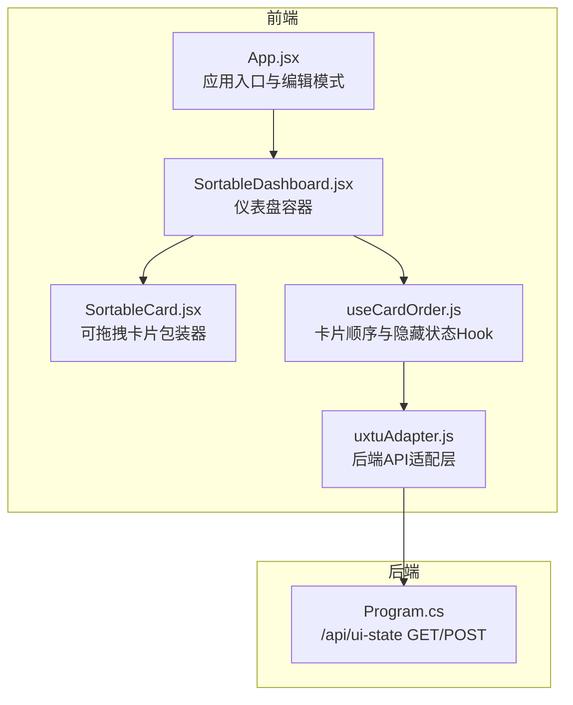
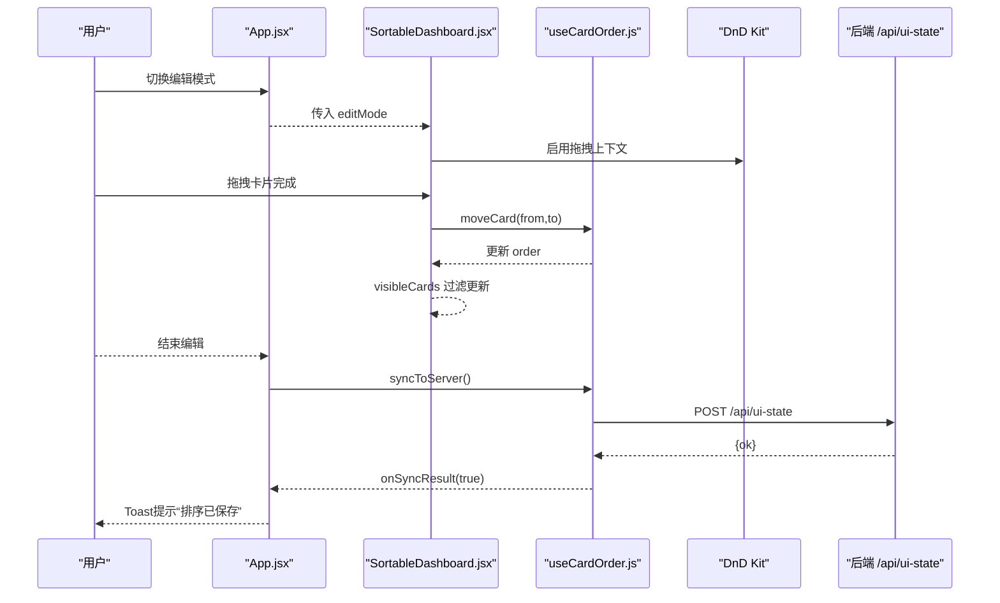
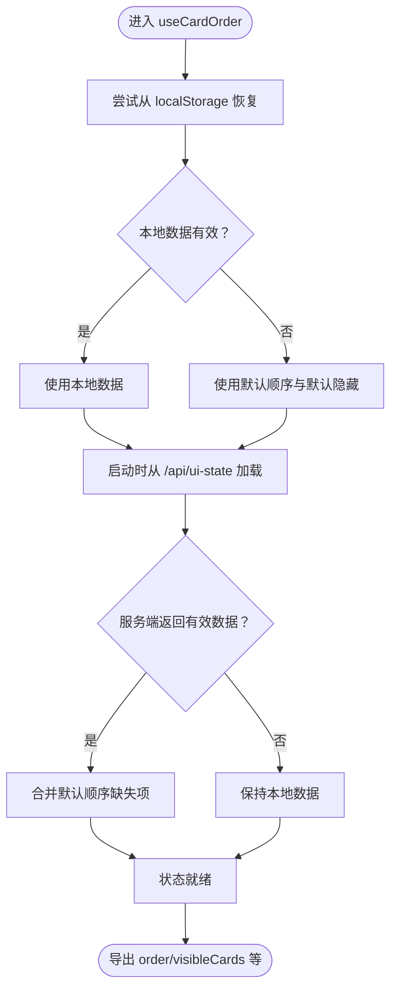
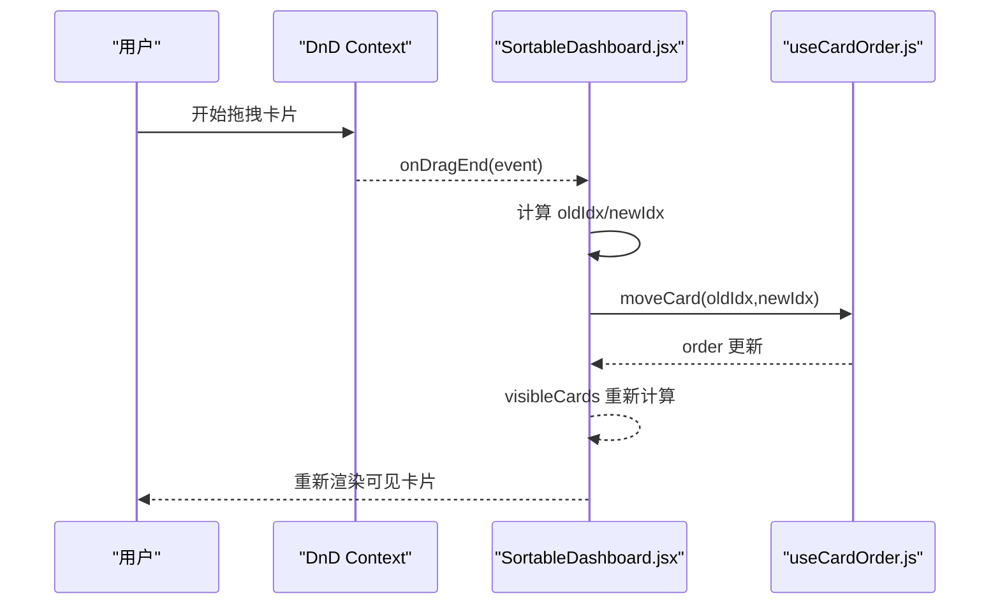
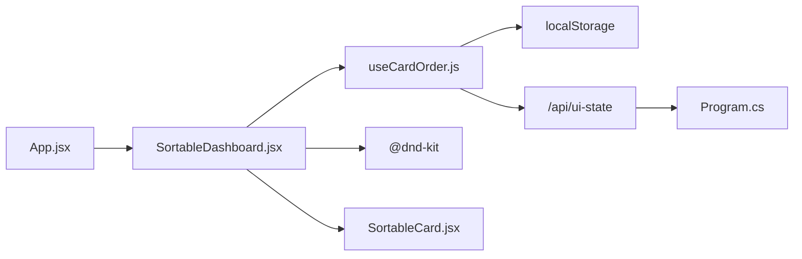

# 卡片顺序管理

<cite>
**本文引用的文件**
- [useCardOrder.js](file://src/hooks/useCardOrder.js)
- [SortableDashboard.jsx](file://src/components/SortableDashboard.jsx)
- [SortableCard.jsx](file://src/components/ui/SortableCard.jsx)
- [App.jsx](file://src/App.jsx)
- [uxtuAdapter.js](file://src/services/uxtuAdapter.js)
- [Program.cs](file://server/api/Program.cs)
</cite>

## 目录
1. [简介](#简介)
2. [项目结构](#项目结构)
3. [核心组件](#核心组件)
4. [架构总览](#架构总览)
5. [详细组件分析](#详细组件分析)
6. [依赖关系分析](#依赖关系分析)
7. [性能考量](#性能考量)
8. [故障排查指南](#故障排查指南)
9. [结论](#结论)

## 简介
本文件面向DOUZHANZHE-Control的“卡片顺序管理”子系统，聚焦于自定义Hook useCardOrder的实现与使用，系统性解析以下主题：
- order数组的状态管理与可见卡片过滤逻辑
- moveCard移动算法与索引操作
- toggleHidden隐藏卡片功能与状态同步机制
- localStorage持久化策略与数据恢复流程
- 服务器同步的触发时机、错误处理与回退策略
- 最佳实践与性能优化建议

该系统通过React Hooks在前端维护卡片顺序与隐藏状态，并通过HTTP接口与后端进行UI状态持久化；同时与拖拽库配合实现可视化排序交互。

## 项目结构
围绕卡片顺序管理的关键文件与职责如下：
- useCardOrder.js：封装卡片顺序与隐藏状态的Hook，负责本地持久化、服务端同步与状态计算
- SortableDashboard.jsx：仪表盘容器，集成拖拽上下文、渲染可见卡片、触发同步
- SortableCard.jsx：可拖拽卡片包装器，提供拖拽手柄与隐藏按钮
- App.jsx：应用入口，提供编辑模式切换与全局状态
- uxtuAdapter.js：后端API适配层，包含通用网络请求方法
- Program.cs（后端）：提供/api/ui-state的GET/POST端点，用于UI状态读写

图表来源
- [App.jsx:34-63](file://src/App.jsx#L34-L63)
- [SortableDashboard.jsx:49-57](file://src/components/SortableDashboard.jsx#L49-L57)
- [SortableCard.jsx:4-42](file://src/components/ui/SortableCard.jsx#L4-L42)
- [useCardOrder.js:46-127](file://src/hooks/useCardOrder.js#L46-L127)
- [uxtuAdapter.js:19-44](file://src/services/uxtuAdapter.js#L19-L44)
- [Program.cs:1121-1153](file://server/api/Program.cs#L1121-L1153)

章节来源
- [useCardOrder.js:1-128](file://src/hooks/useCardOrder.js#L1-L128)
- [SortableDashboard.jsx:1-247](file://src/components/SortableDashboard.jsx#L1-L247)
- [SortableCard.jsx:1-43](file://src/components/ui/SortableCard.jsx#L1-L43)
- [App.jsx:1-134](file://src/App.jsx#L1-L134)
- [uxtuAdapter.js:1-130](file://src/services/uxtuAdapter.js#L1-L130)
- [Program.cs:1121-1153](file://server/api/Program.cs#L1121-L1153)

## 核心组件
- useCardOrder Hook
  - 状态：order（卡片ID顺序）、hiddenCards（Set形式的隐藏ID集合）、loadedFromServer（是否完成服务端加载）
  - 计算属性：visibleCards（基于order与hiddenCards过滤出的可见ID列表）、hiddenList（被隐藏的ID列表）
  - 方法：moveCard（移动指定索引的卡片）、toggleHidden（切换某卡片隐藏状态）、showAll（显示全部）、resetOrder（重置为默认顺序）、syncToServer（同步至服务端）
  - 持久化：localStorage键值对分别保存order与hiddenCards
  - 服务端同步：启动时GET /api/ui-state，退出编辑时POST /api/ui-state

- SortableDashboard
  - 使用useCardOrder提供的order与visibleCards渲染卡片列
  - 在编辑模式下启用拖拽与隐藏按钮，退出编辑时触发同步
  - 提供“全部显示”“重置排序”等辅助操作

- SortableCard
  - 包装单个卡片，提供拖拽句柄与隐藏按钮（仅在编辑模式且允许隐藏时）

- App
  - 控制编辑模式开关，传递给SortableDashboard
  - 提供全局主题与标签页持久化

章节来源
- [useCardOrder.js:46-127](file://src/hooks/useCardOrder.js#L46-L127)
- [SortableDashboard.jsx:38-246](file://src/components/SortableDashboard.jsx#L38-L246)
- [SortableCard.jsx:4-42](file://src/components/ui/SortableCard.jsx#L4-L42)
- [App.jsx:34-63](file://src/App.jsx#L34-L63)

## 架构总览
前端通过useCardOrder统一管理卡片顺序与隐藏状态，结合DnD Kit实现拖拽排序；状态变更自动持久化到localStorage，并在合适时机同步到后端。后端提供/api/ui-state端点，以JSON文件形式保存UI状态。

图表来源
- [App.jsx:58-63](file://src/App.jsx#L58-L63)
- [SortableDashboard.jsx:49-57](file://src/components/SortableDashboard.jsx#L49-L57)
- [SortableDashboard.jsx:64-71](file://src/components/SortableDashboard.jsx#L64-L71)
- [useCardOrder.js:78-91](file://src/hooks/useCardOrder.js#L78-L91)
- [Program.cs:1131-1153](file://server/api/Program.cs#L1131-L1153)

## 详细组件分析

### useCardOrder Hook 实现原理
- 状态初始化与恢复
  - order：优先从localStorage恢复；若不存在或格式非法则回退到默认顺序；新增卡片会追加到末尾，保证兼容性
  - hiddenCards：从localStorage恢复为Set；默认隐藏“system-switches”
  - loadedFromServer：首次从服务端拉取UI状态后置为true，用于控制渲染时机

- 可见卡片过滤逻辑
  - visibleCards：基于order过滤，排除hiddenCards中的ID
  - hiddenList：基于order筛选出被隐藏的ID列表，用于编辑面板展示

- 移动算法与索引操作（moveCard）
  - 输入：from（旧索引）、to（新索引）
  - 步骤：复制当前order为next；从from位置删除一个元素得到moved；在to位置插入moved；返回next
  - 复杂度：O(n)，其中n为order长度；splice操作在JavaScript数组上平均O(n)

- 隐藏状态切换（toggleHidden）
  - 输入：卡片ID
  - 行为：若ID存在于hiddenCards则删除，否则添加；返回新的Set
  - 复杂度：O(1)哈希操作

- 重置与显示全部
  - resetOrder：恢复默认顺序与默认隐藏项
  - showAll：清空隐藏集合，显示所有卡片

- 服务器同步（syncToServer）
  - 触发时机：由调用方在退出编辑模式时调用
  - 请求体：{ cardOrder, hiddenCards }（均为数组）
  - 成功回调：onSyncResult(true)
  - 失败回调：onSyncResult(false)

- localStorage持久化
  - order：每次order变化即写入LS_KEY
  - hiddenCards：每次hiddenCards变化即写入LS_HIDDEN_KEY

- 数据恢复流程
  - 启动时：GET /api/ui-state，若返回有效数据则合并默认顺序，更新order与hiddenCards
  - 回退策略：若服务端无有效数据或请求失败，则使用本地localStorage；若本地也无数据则使用默认值

图表来源
- [useCardOrder.js:29-44](file://src/hooks/useCardOrder.js#L29-L44)
- [useCardOrder.js:54-67](file://src/hooks/useCardOrder.js#L54-L67)
- [useCardOrder.js:118-121](file://src/hooks/useCardOrder.js#L118-L121)

章节来源
- [useCardOrder.js:1-128](file://src/hooks/useCardOrder.js#L1-L128)
- [Program.cs:1121-1153](file://server/api/Program.cs#L1121-L1153)

### SortableDashboard 与拖拽交互
- 拖拽结束事件处理（handleDragEnd）
  - 计算active与over的ID在order中的索引
  - 若索引有效则调用moveCard(from,to)
- 可见卡片渲染
  - 基于visibleCards遍历渲染，每个卡片包裹SortableCard
- 编辑模式下的隐藏面板
  - 展示hiddenList，支持逐项显示与一键显示全部
  - 支持重置排序

图表来源
- [SortableDashboard.jsx:59-71](file://src/components/SortableDashboard.jsx#L59-L71)
- [useCardOrder.js:93-100](file://src/hooks/useCardOrder.js#L93-L100)

章节来源
- [SortableDashboard.jsx:38-246](file://src/components/SortableDashboard.jsx#L38-L246)

### SortableCard 可拖拽包装器
- 提供拖拽手柄（grab）与隐藏按钮（仅编辑模式且允许隐藏时）
- 使用@dnd-kit的useSortable钩子绑定节点与样式

章节来源
- [SortableCard.jsx:4-42](file://src/components/ui/SortableCard.jsx#L4-L42)

### App 编辑模式与同步触发
- 编辑模式切换：通过App.jsx的setEditMode控制
- 退出编辑时触发同步：使用useEffect监听editMode变化，从true变为false时调用syncToServer
- 同步结果反馈：通过onSyncResult回调向Toast组件发送成功/失败消息

章节来源
- [App.jsx:58-63](file://src/App.jsx#L58-L63)
- [SortableDashboard.jsx:46-57](file://src/components/SortableDashboard.jsx#L46-L57)

## 依赖关系分析
- useCardOrder依赖
  - React状态与副作用：useState/useEffect/useCallback/useRef
  - localStorage：键值对持久化
  - fetch：与后端/api/ui-state通信
- SortableDashboard依赖
  - @dnd-kit：拖拽能力
  - useCardOrder：顺序与可见性
  - SortableCard：卡片包装
- 后端依赖
  - Program.cs提供/api/ui-state的GET/POST，读写ui-state.json

图表来源
- [useCardOrder.js:3-5](file://src/hooks/useCardOrder.js#L3-L5)
- [useCardOrder.js:78-91](file://src/hooks/useCardOrder.js#L78-L91)
- [SortableDashboard.jsx:196-206](file://src/components/SortableDashboard.jsx#L196-L206)
- [Program.cs:1121-1153](file://server/api/Program.cs#L1121-L1153)

章节来源
- [useCardOrder.js:1-128](file://src/hooks/useCardOrder.js#L1-L128)
- [SortableDashboard.jsx:1-247](file://src/components/SortableDashboard.jsx#L1-L247)
- [Program.cs:1121-1153](file://server/api/Program.cs#L1121-L1153)

## 性能考量
- 状态更新粒度
  - moveCard每次只更新order数组，复杂度O(n)
  - toggleHidden对Set进行增删，复杂度O(1)
- 渲染优化
  - visibleCards与hiddenList基于order过滤，避免重复计算
  - useCallback缓存moveCard、toggleHidden、showAll、resetOrder，减少子组件重渲染
- 拖拽体验
  - DnD Kit使用transform与transition，保证流畅动画
- 存储与网络
  - localStorage写入在order与hiddenCards变化时触发，建议避免频繁抖动
  - 服务端同步仅在退出编辑时触发，降低网络压力

[本节为通用性能指导，不直接分析具体文件]

## 故障排查指南
- 服务端同步失败
  - 现象：Toast提示“排序保存失败”
  - 原因：/api/ui-state POST返回非2xx或抛出异常
  - 处理：检查后端服务状态与网络连通性；确认ui-state.json可写
- 本地数据损坏
  - 现象：卡片顺序异常或丢失
  - 原因：localStorage中JSON格式错误或为空
  - 处理：清除对应键值或使用resetOrder重置
- 服务端无数据
  - 现象：启动时未加载到已保存的UI状态
  - 原因：GET /api/ui-state返回无效或失败
  - 处理：确认后端已生成ui-state.json；检查权限与路径

章节来源
- [useCardOrder.js:54-67](file://src/hooks/useCardOrder.js#L54-L67)
- [useCardOrder.js:78-91](file://src/hooks/useCardOrder.js#L78-L91)
- [SortableDashboard.jsx:46-48](file://src/components/SortableDashboard.jsx#L46-L48)

## 结论
useCardOrder通过简洁的状态模型与明确的生命周期，实现了卡片顺序与隐藏状态的完整管理。其设计要点包括：
- 本地优先、服务端回退的数据恢复策略
- 基于Set的高效隐藏状态管理
- 拖拽结束即更新的即时反馈
- 退出编辑时的集中同步与错误回调

在实际使用中，建议遵循以下最佳实践：
- 避免在拖拽过程中频繁重置或大规模批量更新order
- 对toggleHidden与moveCard的调用尽量集中在用户交互路径
- 在需要强一致性的场景，确保后端/api/ui-state可用且可写
- 如需扩展卡片类型，保持DEFAULT_ORDER与映射表一致，以保证合入逻辑正确