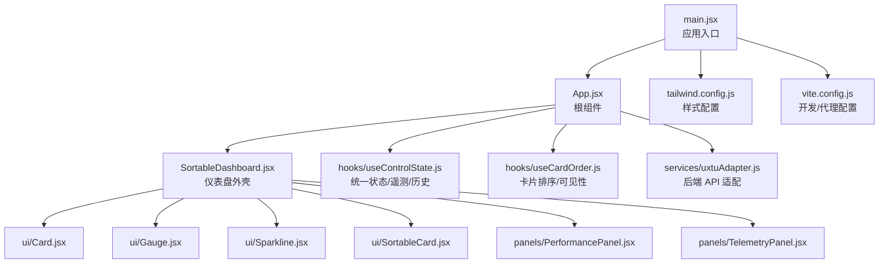
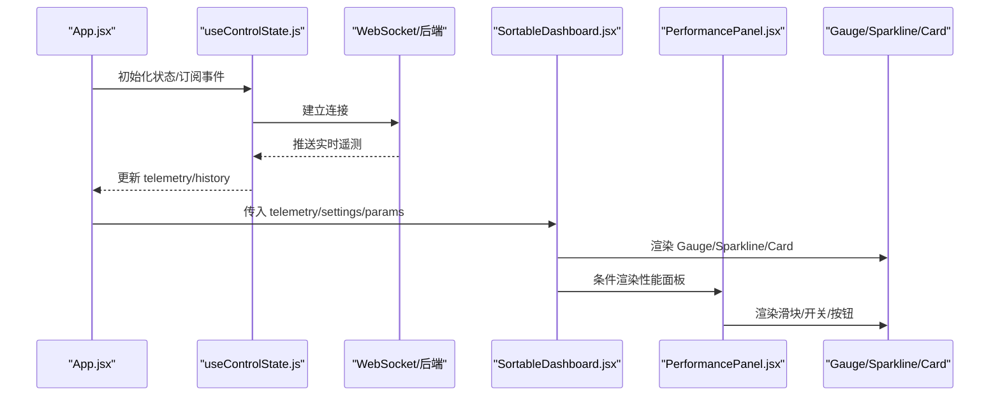
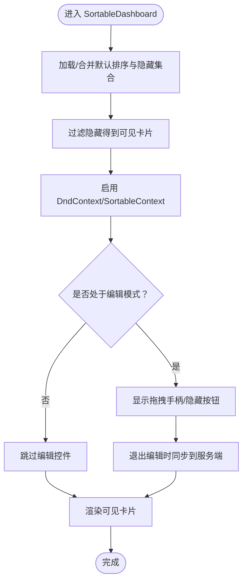
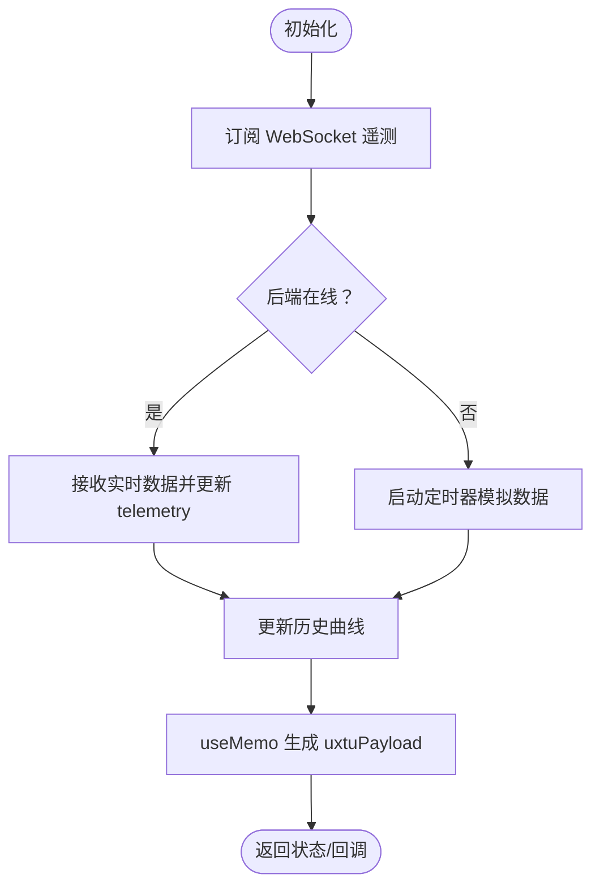
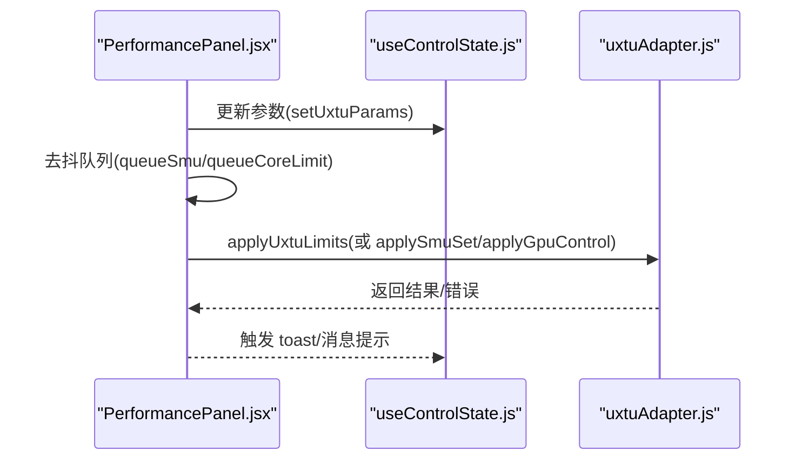
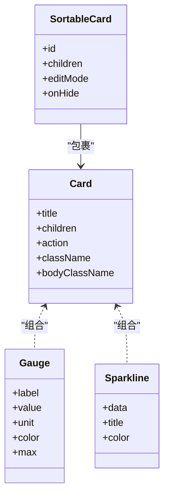
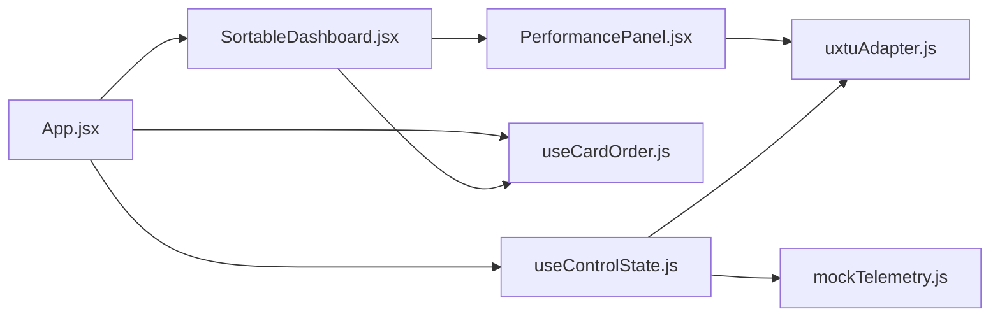

# 性能优化策略

<cite>
**本文引用的文件**
- [src/App.jsx](file://src/App.jsx)
- [src/main.jsx](file://src/main.jsx)
- [src/components/SortableDashboard.jsx](file://src/components/SortableDashboard.jsx)
- [src/hooks/useCardOrder.js](file://src/hooks/useCardOrder.js)
- [src/hooks/useControlState.js](file://src/hooks/useControlState.js)
- [src/services/uxtuAdapter.js](file://src/services/uxtuAdapter.js)
- [src/components/ui/Card.jsx](file://src/components/ui/Card.jsx)
- [src/components/ui/Gauge.jsx](file://src/components/ui/Gauge.jsx)
- [src/components/ui/Sparkline.jsx](file://src/components/ui/Sparkline.jsx)
- [src/components/ui/SortableCard.jsx](file://src/components/ui/SortableCard.jsx)
- [src/components/panels/PerformancePanel.jsx](file://src/components/panels/PerformancePanel.jsx)
- [src/components/panels/TelemetryPanel.jsx](file://src/components/panels/TelemetryPanel.jsx)
- [src/data/mockTelemetry.js](file://src/data/mockTelemetry.js)
- [vite.config.js](file://vite.config.js)
- [tailwind.config.js](file://tailwind.config.js)
- [package.json](file://package.json)
- [docs/dev-frontend.md](file://docs/dev-frontend.md)
</cite>

## 目录
1. [引言](#引言)
2. [项目结构](#项目结构)
3. [核心组件](#核心组件)
4. [架构总览](#架构总览)
5. [详细组件分析](#详细组件分析)
6. [依赖分析](#依赖分析)
7. [性能考虑](#性能考虑)
8. [故障排查指南](#故障排查指南)
9. [结论](#结论)
10. [附录](#附录)

## 引言
本文件面向 DOUZHANZHE-Control 仪表盘的前端性能优化，聚焦以下目标：
- 深入解析 React.memo 与 useCallback 在本项目中的使用场景与收益
- 解释虚拟滚动与懒加载的实现思路与适用场景
- 阐述组件渲染优化技术：条件渲染、按需加载、避免不必要重渲染
- 分析大数据量场景下的性能瓶颈与解决方案
- 提供性能监控工具与指标分析方法
- 给出可落地的性能测试案例与优化前后的对比思路

## 项目结构
前端采用 Vite + React 19，组件以功能域划分，主要目录与职责如下：
- src/main.jsx：入口，挂载根组件与全局 Provider
- src/App.jsx：根组件，负责页面布局、主题、标签页切换、模式选择等
- src/components/：UI 组件与业务面板
  - SortableDashboard：可拖拽仪表盘外壳，承载多个监控与调节面板
  - panels：性能面板、系统信息面板、遥测面板、设置面板
  - ui：通用 UI 组件（Card、Gauge、Sparkline、SortableCard 等）
- src/hooks：自定义 Hook（useCardOrder、useControlState）
- src/services：后端接口适配层（uxtuAdapter）
- src/data：本地数据（mock 遥测）
- vite.config.js：开发服务器与代理配置
- tailwind.config.js：Tailwind 扩展配置

图表来源
- [src/main.jsx:1-14](file://src/main.jsx#L1-L14)
- [src/App.jsx:1-134](file://src/App.jsx#L1-L134)
- [src/components/SortableDashboard.jsx:1-247](file://src/components/SortableDashboard.jsx#L1-L247)
- [src/hooks/useControlState.js:1-355](file://src/hooks/useControlState.js#L1-L355)
- [src/hooks/useCardOrder.js:1-128](file://src/hooks/useCardOrder.js#L1-L128)
- [src/services/uxtuAdapter.js:1-130](file://src/services/uxtuAdapter.js#L1-L130)
- [src/components/ui/Card.jsx:1-18](file://src/components/ui/Card.jsx#L1-L18)
- [src/components/ui/Gauge.jsx:1-21](file://src/components/ui/Gauge.jsx#L1-L21)
- [src/components/ui/Sparkline.jsx:1-40](file://src/components/ui/Sparkline.jsx#L1-L40)
- [src/components/ui/SortableCard.jsx:1-43](file://src/components/ui/SortableCard.jsx#L1-L43)
- [src/components/panels/PerformancePanel.jsx:1-213](file://src/components/panels/PerformancePanel.jsx#L1-L213)
- [src/components/panels/TelemetryPanel.jsx:1-121](file://src/components/panels/TelemetryPanel.jsx#L1-L121)
- [vite.config.js:1-14](file://vite.config.js#L1-L14)
- [tailwind.config.js:1-12](file://tailwind.config.js#L1-L12)

章节来源
- [src/main.jsx:1-14](file://src/main.jsx#L1-L14)
- [src/App.jsx:1-134](file://src/App.jsx#L1-L134)
- [vite.config.js:1-14](file://vite.config.js#L1-L14)
- [tailwind.config.js:1-12](file://tailwind.config.js#L1-L12)

## 核心组件
- App.jsx：负责主题同步、标签页持久化、模式切换、调用 useControlState 提供全局状态
- SortableDashboard.jsx：基于 @dnd-kit 的可拖拽仪表盘，内部通过 renderCard 渲染不同卡片，使用 useCardOrder 管理顺序与可见性
- useControlState.js：统一状态管理，包含遥测数据、历史曲线、模式参数、风扇目标转速、WebSocket 遥测接入与回退 Mock 数据
- useCardOrder.js：卡片排序与隐藏列表的持久化与服务端同步
- uxtuAdapter.js：后端 API 适配，包括遥测、SMU、GPU 控制、风扇区间等
- UI 组件：Card、Gauge、Sparkline、SortableCard 等均为轻量纯展示组件

章节来源
- [src/App.jsx:23-134](file://src/App.jsx#L23-L134)
- [src/components/SortableDashboard.jsx:38-247](file://src/components/SortableDashboard.jsx#L38-L247)
- [src/hooks/useControlState.js:26-355](file://src/hooks/useControlState.js#L26-L355)
- [src/hooks/useCardOrder.js:46-128](file://src/hooks/useCardOrder.js#L46-L128)
- [src/services/uxtuAdapter.js:19-130](file://src/services/uxtuAdapter.js#L19-L130)

## 架构总览
仪表盘采用“根组件 + 自定义 Hook + UI 组件 + 服务适配层”的分层设计。数据流从后端 WebSocket 或 Mock 驱动，经 useControlState 归集为 telemetry 与 history，再由 SortableDashboard 与各面板组件消费。

图表来源
- [src/App.jsx:23-134](file://src/App.jsx#L23-L134)
- [src/hooks/useControlState.js:242-336](file://src/hooks/useControlState.js#L242-L336)
- [src/components/SortableDashboard.jsx:38-247](file://src/components/SortableDashboard.jsx#L38-L247)
- [src/components/panels/PerformancePanel.jsx:13-213](file://src/components/panels/PerformancePanel.jsx#L13-L213)
- [src/components/ui/Gauge.jsx:1-21](file://src/components/ui/Gauge.jsx#L1-L21)
- [src/components/ui/Sparkline.jsx:20-40](file://src/components/ui/Sparkline.jsx#L20-L40)
- [src/components/ui/Card.jsx:1-18](file://src/components/ui/Card.jsx#L1-L18)

## 详细组件分析

### 组件 A：SortableDashboard（可拖拽仪表盘）
- 使用 @dnd-kit 实现拖拽排序，通过 useCardOrder 管理 order 与 hidden 列表，并在退出编辑模式时同步至服务端
- renderCard 根据卡片 ID 内联渲染不同内容，避免不必要的子组件导入与 Tree-shaking 风险
- 可视区域使用多列布局，平衡视觉密度与渲染压力

图表来源
- [src/components/SortableDashboard.jsx:38-247](file://src/components/SortableDashboard.jsx#L38-L247)
- [src/hooks/useCardOrder.js:46-128](file://src/hooks/useCardOrder.js#L46-L128)

章节来源
- [src/components/SortableDashboard.jsx:38-247](file://src/components/SortableDashboard.jsx#L38-L247)
- [src/hooks/useCardOrder.js:46-128](file://src/hooks/useCardOrder.js#L46-L128)

### 组件 B：useControlState（统一状态与遥测）
- 管理主题、设置、UXtu 参数、风扇目标转速、历史曲线
- 通过 WebSocket 接收实时遥测，后端不可用时回退到 Mock 数据
- 使用 useMemo 生成 payload，减少下游依赖变更带来的重渲染
- 对风扇目标转速与自定义参数变更进行去抖处理，降低网络请求频率

图表来源
- [src/hooks/useControlState.js:242-336](file://src/hooks/useControlState.js#L242-L336)
- [src/hooks/useControlState.js:171-178](file://src/hooks/useControlState.js#L171-L178)
- [src/data/mockTelemetry.js:1-22](file://src/data/mockTelemetry.js#L1-L22)

章节来源
- [src/hooks/useControlState.js:26-355](file://src/hooks/useControlState.js#L26-L355)
- [src/data/mockTelemetry.js:1-22](file://src/data/mockTelemetry.js#L1-L22)

### 组件 C：PerformancePanel（性能面板）
- 提供 CPU/GPU 参数调节，支持去抖批量下发
- 通过 queueSmu、queueCoreLimit 等机制合并频繁变更，降低网络压力
- 条件渲染 CPU/GPU 区域，避免无用 DOM

图表来源
- [src/components/panels/PerformancePanel.jsx:13-213](file://src/components/panels/PerformancePanel.jsx#L13-L213)
- [src/services/uxtuAdapter.js:19-88](file://src/services/uxtuAdapter.js#L19-L88)
- [src/hooks/useControlState.js:144-169](file://src/hooks/useControlState.js#L144-L169)

章节来源
- [src/components/panels/PerformancePanel.jsx:13-213](file://src/components/panels/PerformancePanel.jsx#L13-L213)
- [src/services/uxtuAdapter.js:19-88](file://src/services/uxtuAdapter.js#L19-L88)
- [src/hooks/useControlState.js:144-169](file://src/hooks/useControlState.js#L144-L169)

### 组件 D：UI 组件（Card/Gauge/Sparkline/SortableCard）
- Card/Gauge/Sparkline 为纯展示组件，props 输入即输出，适合使用 React.memo 保护
- SortableCard 包裹 @dnd-kit 的 useSortable，样式与交互逻辑集中在组件内部，避免外部重复计算

图表来源
- [src/components/ui/Card.jsx:1-18](file://src/components/ui/Card.jsx#L1-L18)
- [src/components/ui/Gauge.jsx:1-21](file://src/components/ui/Gauge.jsx#L1-L21)
- [src/components/ui/Sparkline.jsx:1-40](file://src/components/ui/Sparkline.jsx#L1-L40)
- [src/components/ui/SortableCard.jsx:1-43](file://src/components/ui/SortableCard.jsx#L1-L43)

章节来源
- [src/components/ui/Card.jsx:1-18](file://src/components/ui/Card.jsx#L1-L18)
- [src/components/ui/Gauge.jsx:1-21](file://src/components/ui/Gauge.jsx#L1-L21)
- [src/components/ui/Sparkline.jsx:1-40](file://src/components/ui/Sparkline.jsx#L1-L40)
- [src/components/ui/SortableCard.jsx:1-43](file://src/components/ui/SortableCard.jsx#L1-L43)

## 依赖分析
- 组件耦合
  - App.jsx 依赖 useControlState 与 useCardOrder，负责全局状态与布局
  - SortableDashboard 依赖 useCardOrder 与 uxtuAdapter，负责卡片排序与硬件控制
  - PerformancePanel 依赖 uxtuAdapter 与 useControlState 的 payload
- 外部依赖
  - @dnd-kit：拖拽能力
  - WebSocket：实时遥测
  - Vite/Tailwind：开发与样式

图表来源
- [src/App.jsx:1-134](file://src/App.jsx#L1-L134)
- [src/components/SortableDashboard.jsx:1-247](file://src/components/SortableDashboard.jsx#L1-L247)
- [src/components/panels/PerformancePanel.jsx:1-213](file://src/components/panels/PerformancePanel.jsx#L1-L213)
- [src/hooks/useControlState.js:1-355](file://src/hooks/useControlState.js#L1-L355)
- [src/hooks/useCardOrder.js:1-128](file://src/hooks/useCardOrder.js#L1-L128)
- [src/services/uxtuAdapter.js:1-130](file://src/services/uxtuAdapter.js#L1-L130)
- [src/data/mockTelemetry.js:1-22](file://src/data/mockTelemetry.js#L1-L22)

章节来源
- [src/App.jsx:1-134](file://src/App.jsx#L1-L134)
- [src/components/SortableDashboard.jsx:1-247](file://src/components/SortableDashboard.jsx#L1-L247)
- [src/components/panels/PerformancePanel.jsx:1-213](file://src/components/panels/PerformancePanel.jsx#L1-L213)
- [src/hooks/useControlState.js:1-355](file://src/hooks/useControlState.js#L1-L355)
- [src/hooks/useCardOrder.js:1-128](file://src/hooks/useCardOrder.js#L1-L128)
- [src/services/uxtuAdapter.js:1-130](file://src/services/uxtuAdapter.js#L1-L130)
- [src/data/mockTelemetry.js:1-22](file://src/data/mockTelemetry.js#L1-L22)

## 性能考虑

### React.memo 与 useCallback 的使用场景与收益
- useCallback 的使用
  - App.jsx 中对保存结果回调进行缓存，避免因 props 变更导致子组件重渲染
  - SortableDashboard 与 useCardOrder 中对 moveCard、toggleHidden、resetOrder、syncToServer 等函数进行缓存，减少 DnD 与交互过程中的重渲染
  - PerformancePanel 中对 update 函数进行缓存，避免每次渲染生成新函数
- React.memo 的建议
  - 当前 UI 组件（Card/Gauge/Sparkline/SortableCard）为纯展示组件，建议在引入 memo 化时注意：
    - 仅在 props 结构稳定且为浅比较时有效
    - 若 props 为对象/数组，应配合 useMemo/useCallback 或使用不可变更新策略
  - 对于 SortableCard，由于 transform/transition 等样式来自外部，建议结合 React.memo 与 CSS.Transform.toString 的稳定性评估收益

章节来源
- [src/App.jsx:25-27](file://src/App.jsx#L25-L27)
- [src/components/SortableDashboard.jsx:46-48](file://src/components/SortableDashboard.jsx#L46-L48)
- [src/hooks/useCardOrder.js:93-121](file://src/hooks/useCardOrder.js#L93-L121)
- [src/components/panels/PerformancePanel.jsx:51-53](file://src/components/panels/PerformancePanel.jsx#L51-L53)

### 虚拟滚动与懒加载的实现思路与适用场景
- 虚拟滚动
  - 当前 SortableDashboard 已通过多列布局与可见卡片过滤降低渲染压力；若卡片数量进一步增长，可在保持拖拽能力的前提下引入虚拟滚动（如基于固定高度的窗口化渲染），仅渲染可视区域内的卡片
- 懒加载
  - 面板级懒加载：根据标签页或卡片可见性动态加载对应面板组件，避免一次性渲染全部面板
  - 图表懒加载：Sparkline 等图表组件在首次可见时再计算路径点，减少初始渲染开销

章节来源
- [src/components/SortableDashboard.jsx:194-206](file://src/components/SortableDashboard.jsx#L194-L206)
- [src/components/panels/TelemetryPanel.jsx:20-121](file://src/components/panels/TelemetryPanel.jsx#L20-L121)

### 组件渲染优化技术
- 条件渲染
  - App.jsx 中根据 activeTab 条件渲染不同面板，减少无关 DOM
  - PerformancePanel 中根据 showCpu/showGpu 条件渲染 CPU/GPU 区域
- 按需加载
  - 遥测面板当前以内联方式渲染，避免 TelemetryPanel 组件被 Tree-shake 移除的风险（见前端文档说明）
- 避免不必要重渲染
  - 使用 useCallback 缓存函数
  - 使用 useMemo 缓存派生数据（如 uxtuPayload）
  - 使用 localStorage 与去抖策略减少网络请求

章节来源
- [src/App.jsx:70-85](file://src/App.jsx#L70-L85)
- [src/components/panels/PerformancePanel.jsx:13-213](file://src/components/panels/PerformancePanel.jsx#L13-L213)
- [src/hooks/useControlState.js:171-178](file://src/hooks/useControlState.js#L171-L178)
- [docs/dev-frontend.md:45-54](file://docs/dev-frontend.md#L45-L54)

### 大数据量场景下的性能瓶颈与解决方案
- 瓶颈点
  - 遥测历史曲线长度与绘制频率：history 每秒追加数据，曲线点数增长导致 Sparkline 计算成本上升
  - WebSocket/定时器频率：Mock 模式下每秒更新一次，若设备性能不足可能造成卡顿
  - 拖拽过程中的重排与样式计算：@dnd-kit 在大量卡片时会增加样式与布局压力
- 解决方案
  - 历史曲线采样：对历史数据进行降采样（例如每 N 帧取一个点）
  - 降低更新频率：在移动端或低端设备上提高更新间隔
  - 虚拟化：仅渲染可视区域卡片
  - 优化动画：减少复杂动画或在低性能设备上禁用

章节来源
- [src/hooks/useControlState.js:33-56](file://src/hooks/useControlState.js#L33-L56)
- [src/components/ui/Sparkline.jsx:1-40](file://src/components/ui/Sparkline.jsx#L1-L40)
- [src/components/SortableDashboard.jsx:59-62](file://src/components/SortableDashboard.jsx#L59-L62)

### 性能监控工具与指标分析
- 浏览器开发者工具
  - Performance：记录帧时间、长任务、布局抖动
  - Memory：观察堆内存增长与 GC 行为
  - Network：监控去抖策略是否生效（请求频率与大小）
- React DevTools Profiler
  - 分析组件渲染次数与耗时，定位过度渲染的组件
- Lighthouse
  - 分析首屏加载、交互延迟、内存使用等指标
- 关键指标
  - FP/FCP/LCP/INP/CLS：首屏、最大内容绘制、交互延迟、布局偏移
  - FPS：动画与拖拽过程中的帧率
  - 内存峰值：长时间运行下的内存占用

章节来源
- [vite.config.js:7-12](file://vite.config.js#L7-L12)
- [package.json:6-10](file://package.json#L6-L10)

### 性能测试案例与优化前后对比
- 测试场景
  - 高刷新率遥测：开启 WebSocket 并在 1s 内注入大量波动数据，观察 FPS 与内存
  - 大卡片集拖拽：在 SortableDashboard 中添加 50+ 卡片，测试拖拽流畅度
  - 面板切换：频繁切换标签页，观察首屏与切换耗时
- 对比维度
  - 优化前：FPS 下降、内存持续上涨、拖拽卡顿
  - 优化后：FPS 稳定、内存平稳、拖拽顺滑
- 建议的优化动作
  - 历史曲线降采样与滑动窗口
  - 去抖与节流策略
  - 虚拟滚动与懒加载
  - React.memo 与 useMemo 的合理使用

## 故障排查指南
- Tree-shaking 导致组件被移除
  - 现象：导入但未使用的组件被安全移除，导致运行时报错
  - 处理：确保被 import 的组件在渲染树中有调用点，或将需要的导出直接 import 到使用方
- WebSocket 断连与回退
  - 现象：后端不可用时 Mock 数据未生效
  - 处理：确认 WebSocket 连接与断线重连逻辑，检查后端代理配置
- 风扇目标转速下发失败
  - 现象：调整风扇目标转速后无响应
  - 处理：检查去抖定时器是否被清理，确认后端 API 可达性

章节来源
- [docs/dev-frontend.md:45-54](file://docs/dev-frontend.md#L45-L54)
- [src/hooks/useControlState.js:242-257](file://src/hooks/useControlState.js#L242-L257)
- [src/hooks/useControlState.js:112-126](file://src/hooks/useControlState.js#L112-L126)

## 结论
本项目在状态管理、拖拽交互与硬件控制方面具备清晰的分层与职责边界。通过 useCallback/memo、去抖与懒加载等手段，可在保证交互体验的同时显著降低渲染与网络压力。针对大数据量场景，建议引入虚拟滚动与采样策略，并结合浏览器性能工具进行持续优化与回归测试。

## 附录
- 开发与代理配置
  - Vite 代理到本地后端服务，WebSocket 也通过代理转发
- 样式与主题
  - Tailwind 扩展动画，CSS 变量驱动主题切换

章节来源
- [vite.config.js:1-14](file://vite.config.js#L1-L14)
- [tailwind.config.js:1-12](file://tailwind.config.js#L1-L12)