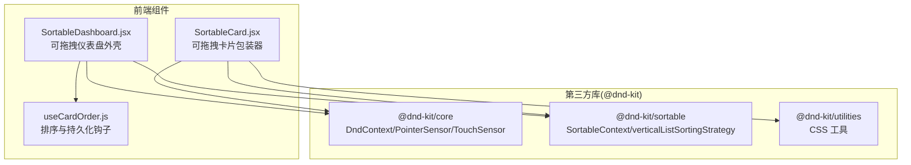
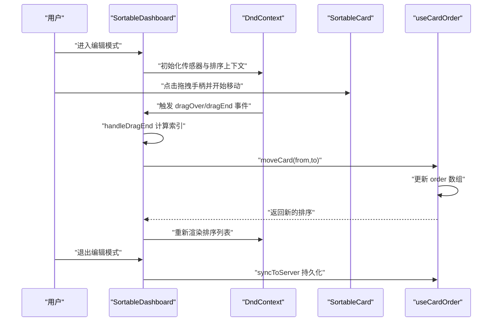
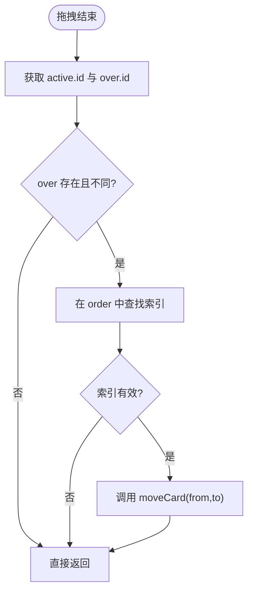
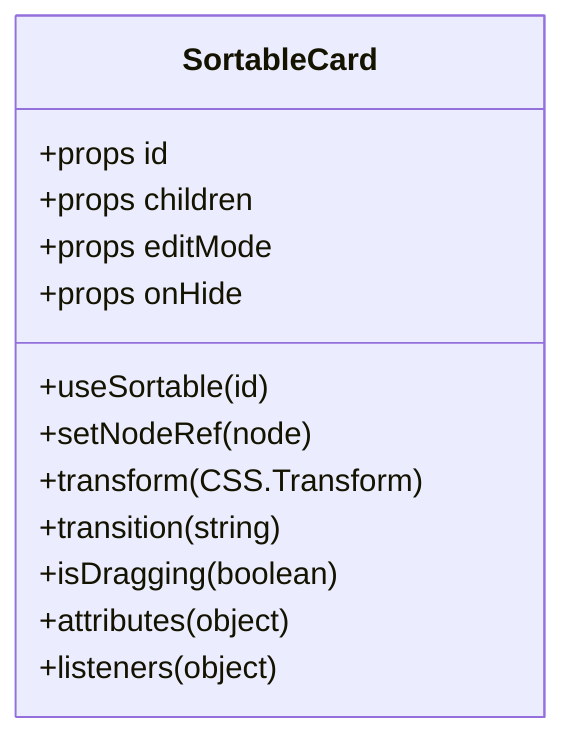
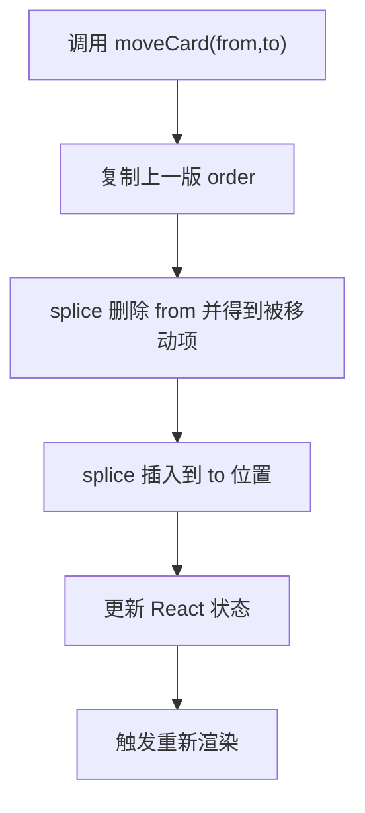
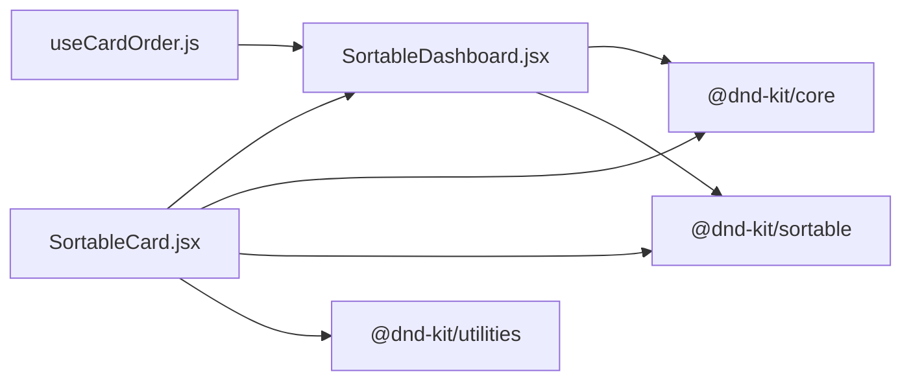

# 拖拽排序机制

<cite>
**本文档引用的文件**
- [src/components/SortableDashboard.jsx](file://src/components/SortableDashboard.jsx)
- [src/components/ui/SortableCard.jsx](file://src/components/ui/SortableCard.jsx)
- [src/hooks/useCardOrder.js](file://src/hooks/useCardOrder.js)
- [package-lock.json](file://package-lock.json)
- [docs/dev-frontend.md](file://docs/dev-frontend.md)
</cite>

## 目录
1. [简介](#简介)
2. [项目结构](#项目结构)
3. [核心组件](#核心组件)
4. [架构总览](#架构总览)
5. [详细组件分析](#详细组件分析)
6. [依赖分析](#依赖分析)
7. [性能考虑](#性能考虑)
8. [故障排查指南](#故障排查指南)
9. [结论](#结论)

## 简介
本文件聚焦 DOUZHANZHE-Control 中基于 @dnd-kit 的拖拽排序机制，系统性解析以下内容：
- @dnd-kit 的集成与配置：PointerSensor 与 TouchSensor 的使用、拖拽激活约束与触摸延迟/容差设置
- 拖拽结束事件处理器 handleDragEnd 的实现逻辑：索引定位、位置交换与状态更新
- verticalListSortingStrategy 排序策略的应用与自定义行为
- 用户体验设计：视觉反馈、动画与交互提示
- 调试方法与常见问题解决方案

## 项目结构
拖拽排序相关的核心文件位于前端 src 目录，关键文件如下：
- 可拖拽仪表盘外壳：src/components/SortableDashboard.jsx
- 可拖拽卡片包装器：src/components/ui/SortableCard.jsx
- 卡片排序与持久化钩子：src/hooks/useCardOrder.js
- 依赖版本锁定：package-lock.json
- 前端开发文档（包含文件结构与构建注意事项）：docs/dev-frontend.md

图表来源
- [src/components/SortableDashboard.jsx:1-76](file://src/components/SortableDashboard.jsx#L1-L76)
- [src/components/ui/SortableCard.jsx:1-42](file://src/components/ui/SortableCard.jsx#L1-L42)
- [package-lock.json:11-17](file://package-lock.json#L11-L17)

章节来源
- [docs/dev-frontend.md:11-43](file://docs/dev-frontend.md#L11-L43)

## 核心组件
- 可拖拽仪表盘外壳（SortableDashboard）
  - 集成 DndContext、PointerSensor、TouchSensor，并配置激活约束
  - 使用 SortableContext 与 verticalListSortingStrategy 实现垂直列表排序
  - 处理拖拽结束事件，计算索引并调用 moveCard 完成排序状态更新
  - 在退出编辑模式时触发同步至服务端
- 可拖拽卡片包装器（SortableCard）
  - 通过 useSortable 获取节点引用、拖拽变换与交互属性
  - 提供拖拽手柄按钮与隐藏按钮，仅在编辑模式显示
  - 应用 CSS Transform 与过渡动画，配合 isDragging 控制透明度与层级
- 排序与持久化钩子（useCardOrder）
  - 维护 order（卡片 ID 数组）与 hiddenCards（隐藏集合）
  - 提供 moveCard、toggleHidden、showAll、resetOrder、syncToServer 等能力
  - 通过服务端接口持久化 UI 状态变更

章节来源
- [src/components/SortableDashboard.jsx:38-71](file://src/components/SortableDashboard.jsx#L38-L71)
- [src/components/ui/SortableCard.jsx:4-42](file://src/components/ui/SortableCard.jsx#L4-L42)
- [src/hooks/useCardOrder.js:81-127](file://src/hooks/useCardOrder.js#L81-L127)

## 架构总览
下图展示拖拽排序在应用中的整体交互流程：用户在编辑模式下通过鼠标或触摸激活拖拽，@dnd-kit 计算拖拽状态与目标位置，回调 handleDragEnd，由 useCardOrder 执行排序数组的更新与持久化。

图表来源
- [src/components/SortableDashboard.jsx:59-71](file://src/components/SortableDashboard.jsx#L59-L71)
- [src/hooks/useCardOrder.js:93-100](file://src/hooks/useCardOrder.js#L93-L100)

## 详细组件分析

### 可拖拽仪表盘外壳（SortableDashboard）
- 传感器配置
  - PointerSensor：距离激活约束 distance=8，降低误触灵敏度
  - TouchSensor：延迟激活 delay=200ms、容差 tolerance=6，提升触摸设备的稳定性
- 排序上下文
  - SortableContext 与 verticalListSortingStrategy：保证垂直列表的自然排序行为
- 拖拽结束处理
  - 从事件对象提取 active 与 over 的 ID
  - 在 order 中查找旧索引与新索引，调用 moveCard 完成交换
  - 若 over 不存在或索引越界则直接返回
- 编辑模式与持久化
  - 退出编辑模式时触发 syncToServer，将当前排序与隐藏状态提交到服务端

图表来源
- [src/components/SortableDashboard.jsx:64-71](file://src/components/SortableDashboard.jsx#L64-L71)

章节来源
- [src/components/SortableDashboard.jsx:59-71](file://src/components/SortableDashboard.jsx#L59-L71)

### 可拖拽卡片包装器（SortableCard）
- useSortable 返回值
  - setNodeRef：绑定 DOM 节点
  - transform/transition/isDragging：驱动 CSS 变换与过渡
  - attributes/listeners：为拖拽手柄注入可访问性属性与事件监听
- 视觉与交互
  - 拖拽时降低透明度、提升层级，增强拾起感
  - 拖拽手柄仅在 editMode 下显示，避免干扰正常浏览
  - 隐藏按钮支持快速隐藏模块，便于布局调整

图表来源
- [src/components/ui/SortableCard.jsx:4-42](file://src/components/ui/SortableCard.jsx#L4-L42)

章节来源
- [src/components/ui/SortableCard.jsx:4-42](file://src/components/ui/SortableCard.jsx#L4-L42)

### 排序与持久化钩子（useCardOrder）
- 数据结构
  - order：字符串数组，表示可见卡片的显示顺序
  - hiddenCards：Set，记录被隐藏的卡片 ID
- 核心方法
  - moveCard(from,to)：在 order 中执行删除与插入，完成位置交换
  - toggleHidden(id)/showAll()/resetOrder()：维护隐藏状态与默认布局
  - syncToServer()：将 order 与 hiddenCards 组装为 payload，POST 至服务端接口
- 与服务端交互
  - 成功/失败分别通过回调 onSyncResult 触发 toast 提示
  - 该钩子贯穿“读取→更新→保存”的完整闭环

图表来源
- [src/hooks/useCardOrder.js:93-100](file://src/hooks/useCardOrder.js#L93-L100)

章节来源
- [src/hooks/useCardOrder.js:81-127](file://src/hooks/useCardOrder.js#L81-L127)

### 排序策略与自定义行为
- verticalListSortingStrategy
  - 适用于垂直列表的排序策略，@dnd-kit 在拖拽过程中根据元素位置进行智能重排
  - 与 SortableContext 配合，确保拖拽时的视觉反馈与物理接近感一致
- 自定义排序行为
  - 可通过 SortableContext 的 sortingStrategy 属性替换为其他策略（如 horizontalListSortingStrategy）
  - 若需更复杂的碰撞检测或吸附规则，可在 DndContext 上配置 collisionDetection 或其他策略

章节来源
- [src/components/SortableDashboard.jsx:10-13](file://src/components/SortableDashboard.jsx#L10-L13)

### 用户体验设计
- 视觉反馈
  - 拖拽时卡片半透明与层级提升，明确“拾起”状态
  - 拖拽手柄采用主题色与边框，提供清晰抓取点
- 动画与过渡
  - 通过 CSS Transform 与 transition 实现平滑位移
  - 拖拽结束后的回弹与落位由 @dnd-kit 自动处理
- 交互提示
  - 编辑模式下显示拖拽手柄与隐藏按钮
  - 保存成功/失败通过 toast 提示，及时反馈操作结果

章节来源
- [src/components/ui/SortableCard.jsx:7-12](file://src/components/ui/SortableCard.jsx#L7-L12)
- [src/components/SortableDashboard.jsx:46-48](file://src/components/SortableDashboard.jsx#L46-L48)

## 依赖分析
- @dnd-kit 版本
  - @dnd-kit/core: ^6.3.1
  - @dnd-kit/sortable: ^10.0.0
  - @dnd-kit/utilities: ^3.2.2
- 依赖关系
  - SortableCard 依赖 @dnd-kit/sortable 与 @dnd-kit/utilities
  - SortableDashboard 依赖 @dnd-kit/core 与 @dnd-kit/sortable

图表来源
- [package-lock.json:11-17](file://package-lock.json#L11-L17)
- [src/components/SortableDashboard.jsx:1-18](file://src/components/SortableDashboard.jsx#L1-L18)
- [src/components/ui/SortableCard.jsx:1-2](file://src/components/ui/SortableCard.jsx#L1-L2)

章节来源
- [package-lock.json:11-17](file://package-lock.json#L11-L17)

## 性能考虑
- 事件处理开销
  - handleDragEnd 仅执行索引查找与数组 splice 操作，时间复杂度 O(n)，在卡片数量有限的情况下开销可忽略
- 渲染优化
  - useCardOrder 中 moveCard 使用不可变更新模式，React 能够精确重渲染受影响区域
- 传感器激活约束
  - 适当的距离与触摸容差可减少误触发，降低不必要的重排与重绘
- 构建与摇树优化
  - 文档指出 Vite/Rolldown 的摇树可能导致未在渲染树中直接调用的组件被移除，应确保被 import 的组件在渲染树中有调用点，以避免运行时缺失导出

章节来源
- [src/components/SortableDashboard.jsx:59-62](file://src/components/SortableDashboard.jsx#L59-L62)
- [src/hooks/useCardOrder.js:93-100](file://src/hooks/useCardOrder.js#L93-L100)
- [docs/dev-frontend.md:47-53](file://docs/dev-frontend.md#L47-L53)

## 故障排查指南
- 拖拽无效或误触发
  - 检查 PointerSensor/TouchSensor 的激活约束是否过严或过松
  - 确认 SortableContext 的 strategy 是否正确设置为 verticalListSortingStrategy
- 拖拽结束后排序未更新
  - 确认 handleDragEnd 正确计算 active.id 与 over.id 的索引
  - 检查 moveCard 是否被正确调用以及 order 数组是否更新
- 退出编辑模式后未保存
  - 确认 useEffect 监听 editMode 变化并在变为 false 时调用 syncToServer
  - 检查服务端接口返回状态与 onSyncResult 回调
- 构建后某些组件缺失
  - 遵循文档建议：确保被 import 的组件在渲染树中有调用点，或直接 import 需要的导出，避免被摇树移除

章节来源
- [src/components/SortableDashboard.jsx:50-57](file://src/components/SortableDashboard.jsx#L50-L57)
- [src/components/SortableDashboard.jsx:64-71](file://src/components/SortableDashboard.jsx#L64-L71)
- [src/hooks/useCardOrder.js:81-91](file://src/hooks/useCardOrder.js#L81-L91)
- [docs/dev-frontend.md:47-53](file://docs/dev-frontend.md#L47-L53)

## 结论
本拖拽排序机制以 @dnd-kit 为核心，结合合理的传感器配置、垂直列表排序策略与轻量的状态更新逻辑，实现了稳定、直观的可视化布局调整体验。通过 useCardOrder 将排序与隐藏状态持久化到服务端，并在退出编辑模式时统一提交，确保用户修改可被可靠保存。针对构建摇树问题与交互细节，文档提供了明确的优化与排查建议，有助于维持长期可维护性与良好用户体验。