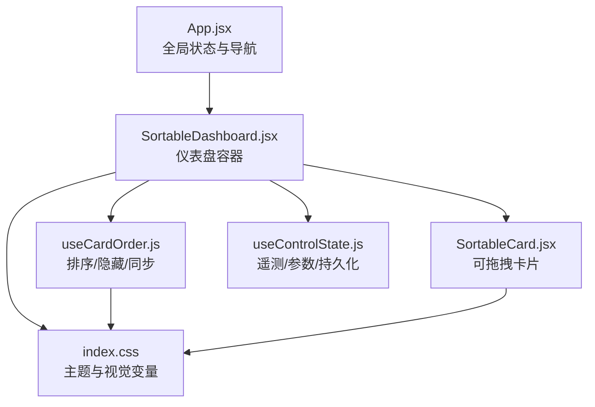
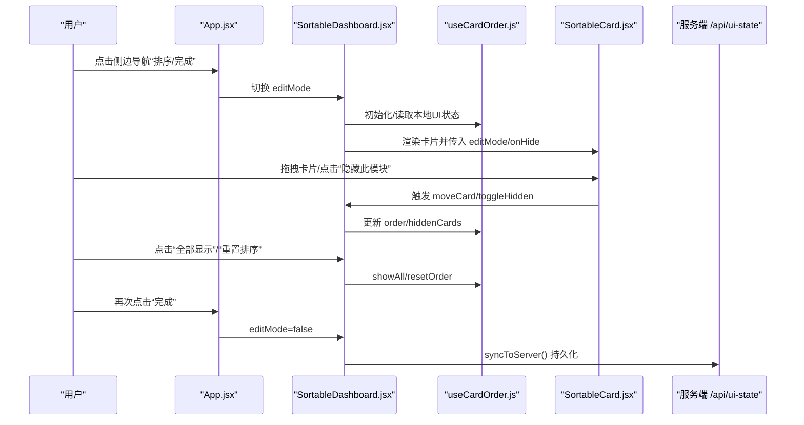
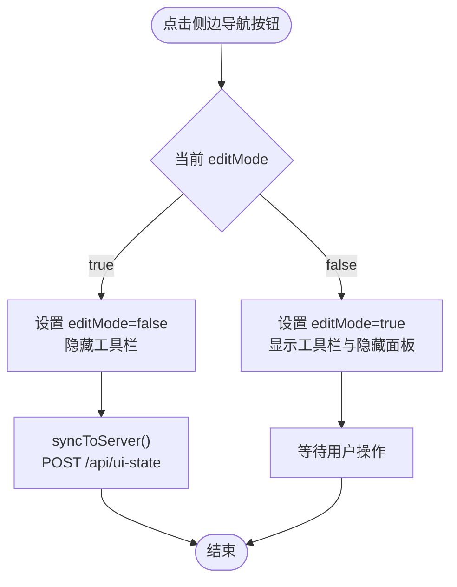
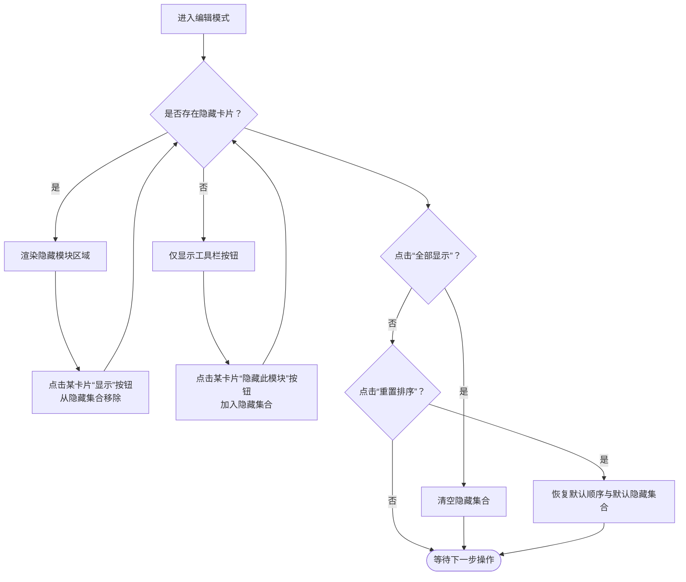
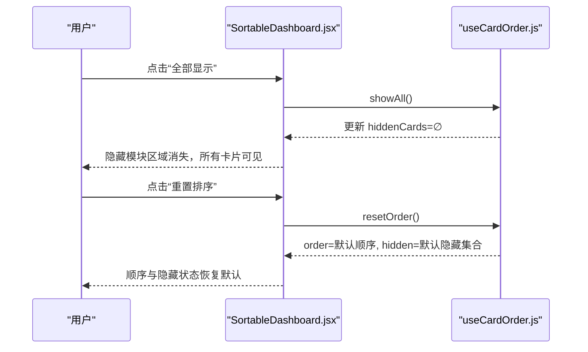
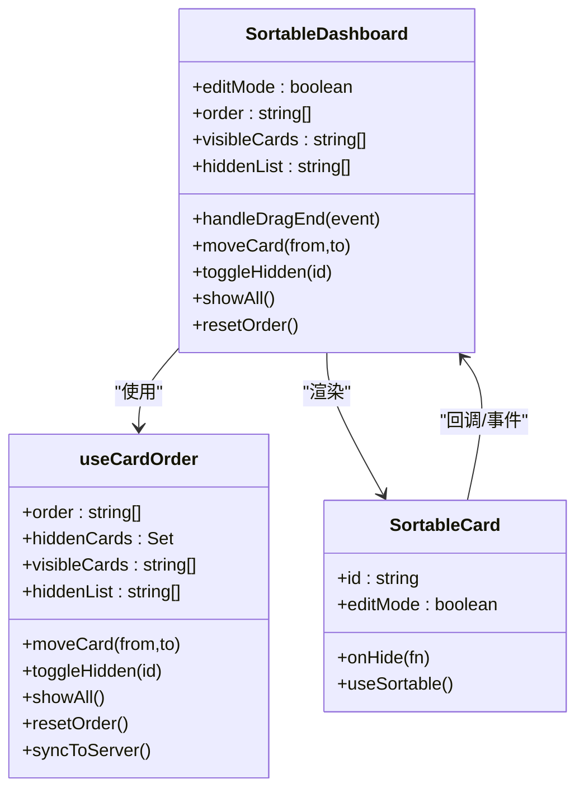
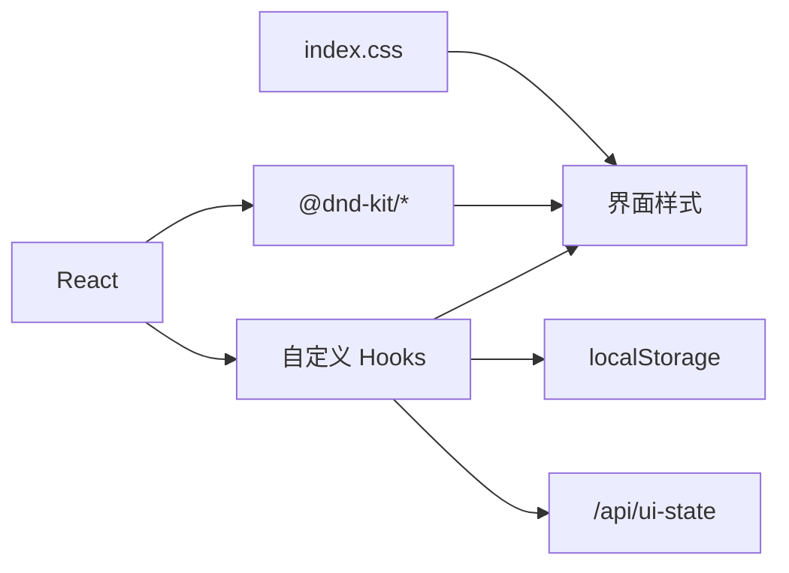

# 编辑模式交互

<cite>
**本文引用的文件**
- [App.jsx](file://src/App.jsx)
- [SortableDashboard.jsx](file://src/components/SortableDashboard.jsx)
- [useCardOrder.js](file://src/hooks/useCardOrder.js)
- [SortableCard.jsx](file://src/components/ui/SortableCard.jsx)
- [useControlState.js](file://src/hooks/useControlState.js)
- [index.css](file://src/index.css)
- [package.json](file://package.json)
</cite>

## 目录
1. [简介](#简介)
2. [项目结构](#项目结构)
3. [核心组件](#核心组件)
4. [架构总览](#架构总览)
5. [详细组件分析](#详细组件分析)
6. [依赖关系分析](#依赖关系分析)
7. [性能考量](#性能考量)
8. [故障排查指南](#故障排查指南)
9. [结论](#结论)
10. [附录](#附录)

## 简介
本文件聚焦 DOUZHANZHE-Control 的“编辑模式”交互，系统性阐述以下内容：
- 编辑模式的触发机制与状态切换逻辑
- 隐藏卡片列表的显示条件与用户操作流程
- 编辑模式下工具栏功能（“全部显示”“重置排序”）的行为
- 编辑模式与拖拽功能的协同与互斥处理
- 视觉设计与用户体验优化策略
- 扩展开发指南与自定义交互实现方法

## 项目结构
编辑模式交互涉及前端 React 组件、状态钩子与样式资源，核心文件如下：
- 应用入口与全局状态：App.jsx
- 仪表盘容器与拖拽编排：SortableDashboard.jsx
- 卡片排序与隐藏状态管理：useCardOrder.js
- 可拖拽卡片封装：SortableCard.jsx
- 控制态与持久化：useControlState.js
- 主题与视觉变量：index.css
- 依赖声明：package.json

图表来源
- [App.jsx:23-80](file://src/App.jsx#L23-L80)
- [SortableDashboard.jsx:38-246](file://src/components/SortableDashboard.jsx#L38-L246)
- [useCardOrder.js:46-127](file://src/hooks/useCardOrder.js#L46-L127)
- [SortableCard.jsx:4-42](file://src/components/ui/SortableCard.jsx#L4-L42)
- [useControlState.js:26-354](file://src/hooks/useControlState.js#L26-L354)
- [index.css:1-460](file://src/index.css#L1-L460)

章节来源
- [App.jsx:23-80](file://src/App.jsx#L23-L80)
- [SortableDashboard.jsx:38-246](file://src/components/SortableDashboard.jsx#L38-L246)
- [useCardOrder.js:46-127](file://src/hooks/useCardOrder.js#L46-L127)
- [SortableCard.jsx:4-42](file://src/components/ui/SortableCard.jsx#L4-L42)
- [useControlState.js:26-354](file://src/hooks/useControlState.js#L26-L354)
- [index.css:1-460](file://src/index.css#L1-L460)

## 核心组件
- 全局编辑模式开关：由 App.jsx 提供 editMode 状态，并在侧边导航区以按钮形式呈现，点击切换。
- 仪表盘容器：SortableDashboard.jsx 在编辑模式下渲染“隐藏模块”面板与工具栏，负责拖拽排序与隐藏卡片的展示控制。
- 排序与隐藏状态：useCardOrder.js 统一管理卡片顺序、隐藏集合、可见集合，并提供“全部显示”“重置排序”等动作。
- 可拖拽卡片：SortableCard.jsx 将每个卡片包装为可拖拽元素，并在编辑模式下显示拖拽手柄与“隐藏此模块”按钮。
- 控制态与持久化：useControlState.js 提供遥测、参数、主题等状态，以及与服务端的 UI 状态同步。

章节来源
- [App.jsx:34-63](file://src/App.jsx#L34-L63)
- [SortableDashboard.jsx:49-243](file://src/components/SortableDashboard.jsx#L49-L243)
- [useCardOrder.js:46-127](file://src/hooks/useCardOrder.js#L46-L127)
- [SortableCard.jsx:4-42](file://src/components/ui/SortableCard.jsx#L4-L42)
- [useControlState.js:26-354](file://src/hooks/useControlState.js#L26-L354)

## 架构总览
编辑模式交互采用“状态提升 + 自定义 Hook”的分层设计：
- App.jsx 管理全局 editMode，并将其传递至 SortableDashboard。
- SortableDashboard 使用 useCardOrder 管理卡片顺序与隐藏集合，同时集成 @dnd-kit 实现拖拽排序。
- SortableCard 作为可拖拽单元，暴露拖拽手柄与隐藏按钮。
- 离线持久化与在线同步：本地 localStorage 与服务端 /api/ui-state 双通道存储。

图表来源
- [App.jsx:58-63](file://src/App.jsx#L58-L63)
- [SortableDashboard.jsx:49-91](file://src/components/SortableDashboard.jsx#L49-L91)
- [useCardOrder.js:78-91](file://src/hooks/useCardOrder.js#L78-L91)
- [SortableCard.jsx:14-41](file://src/components/ui/SortableCard.jsx#L14-L41)

## 详细组件分析

### 编辑模式触发与状态切换
- 触发源：App.jsx 侧边导航中的“排序/完成”按钮，点击后通过 useState 切换 editMode。
- 切换行为：
  - 进入编辑模式：按钮高亮，仪表盘显示“隐藏模块”面板与工具栏。
  - 退出编辑模式：仪表盘隐藏工具栏，同时在 SortableDashboard 中监听 editMode 变化，触发一次同步到服务端。
- 本地持久化：编辑模式本身不直接持久化，但其触发的 UI 行为会通过 useCardOrder 的本地存储与服务端同步持久化。

图表来源
- [App.jsx:58-63](file://src/App.jsx#L58-L63)
- [SortableDashboard.jsx:50-57](file://src/components/SortableDashboard.jsx#L50-L57)
- [useCardOrder.js:78-91](file://src/hooks/useCardOrder.js#L78-L91)

章节来源
- [App.jsx:34-63](file://src/App.jsx#L34-L63)
- [SortableDashboard.jsx:50-57](file://src/components/SortableDashboard.jsx#L50-L57)

### 隐藏卡片列表的显示条件与用户操作流程
- 显示条件：
  - 仅当 editMode 为 true 时，仪表盘容器才渲染“隐藏模块”区域。
  - 隐藏模块区域包含一个“已隐藏模块”标题与若干卡片项，每项包含卡片标签与“显示”按钮。
- 用户操作流程：
  - 在编辑模式下，点击任意卡片右上角“隐藏此模块”按钮，将该卡片加入隐藏集合。
  - 若存在隐藏卡片，“全部显示”按钮可用，点击后清空隐藏集合。
  - “重置排序”按钮将顺序与隐藏集合恢复为默认值。

图表来源
- [SortableDashboard.jsx:208-243](file://src/components/SortableDashboard.jsx#L208-L243)
- [useCardOrder.js:102-121](file://src/hooks/useCardOrder.js#L102-L121)

章节来源
- [SortableDashboard.jsx:208-243](file://src/components/SortableDashboard.jsx#L208-L243)
- [useCardOrder.js:102-121](file://src/hooks/useCardOrder.js#L102-L121)

### 工具栏功能详解
- “全部显示”按钮
  - 条件：当存在隐藏卡片时显示。
  - 行为：调用 showAll，清空隐藏集合，使所有卡片重新可见。
- “重置排序”按钮
  - 条件：始终显示。
  - 行为：调用 resetOrder，将卡片顺序恢复为默认顺序，并将默认隐藏集合应用到当前卡片集合。

图表来源
- [SortableDashboard.jsx:230-240](file://src/components/SortableDashboard.jsx#L230-L240)
- [useCardOrder.js:111-121](file://src/hooks/useCardOrder.js#L111-L121)

章节来源
- [SortableDashboard.jsx:230-240](file://src/components/SortableDashboard.jsx#L230-L240)
- [useCardOrder.js:111-121](file://src/hooks/useCardOrder.js#L111-L121)

### 编辑模式与拖拽功能的协调与互斥
- 协作机制：
  - SortableDashboard 使用 @dnd-kit 的 DndContext/SortableContext 包裹可见卡片，启用垂直排序策略。
  - 每个 SortableCard 通过 useSortable 暴露拖拽句柄，支持指针/触摸传感器。
  - 拖拽结束回调 handleDragEnd 计算索引并调用 moveCard 更新顺序。
- 互斥与边界：
  - 仅在 editMode 为 true 时，卡片显示拖拽手柄与“隐藏此模块”按钮；否则卡片不可拖拽。
  - 隐藏卡片不会参与拖拽排序，仅在可见集合内进行排序。
  - 退出编辑模式时，自动触发一次 UI 状态同步，确保排序与隐藏状态持久化。

图表来源
- [SortableDashboard.jsx:38-246](file://src/components/SortableDashboard.jsx#L38-L246)
- [SortableCard.jsx:4-42](file://src/components/ui/SortableCard.jsx#L4-L42)
- [useCardOrder.js:46-127](file://src/hooks/useCardOrder.js#L46-L127)

章节来源
- [SortableDashboard.jsx:59-71](file://src/components/SortableDashboard.jsx#L59-L71)
- [SortableCard.jsx:4-42](file://src/components/ui/SortableCard.jsx#L4-L42)
- [useCardOrder.js:93-121](file://src/hooks/useCardOrder.js#L93-L121)

### 视觉设计与用户体验优化
- 主题系统：index.css 定义多套主题变量，编辑模式下的按钮与面板采用统一的边框、背景与强调色，保证在不同主题下的一致可辨识度。
- 编辑态高亮：侧边导航按钮在编辑模式下高亮显示，明确传达当前处于可编辑状态。
- 卡片交互反馈：
  - 拖拽时半透明与层级提升，提供即时反馈。
  - 隐藏按钮与拖拽手柄采用对比色，便于识别。
- 动画与过渡：卡片进入使用滑入动画，风扇图标旋转动画增强动态感；编辑态工具栏采用虚线边框与柔和背景，降低干扰。
- 响应式布局：工具栏与隐藏模块区域在移动端与桌面端均保持良好可读性与可操作性。

章节来源
- [index.css:1-460](file://src/index.css#L1-L460)
- [App.jsx:58-63](file://src/App.jsx#L58-L63)
- [SortableDashboard.jsx:208-243](file://src/components/SortableDashboard.jsx#L208-L243)
- [SortableCard.jsx:14-41](file://src/components/ui/SortableCard.jsx#L14-L41)

### 扩展开发指南与自定义交互
- 新增隐藏卡片项
  - 在 useCardOrder.js 的默认隐藏集合中添加新卡片 ID，并在卡片映射中补充标签。
  - 在 SortableDashboard 的隐藏模块区域渲染对应项。
- 自定义工具栏按钮
  - 在工具栏区域添加新的按钮，绑定相应动作（如“导出布局”“导入布局”），并在 useCardOrder 中实现对应逻辑。
- 与服务端联动
  - 通过 syncToServer 的 POST 请求扩展更多 UI 状态字段，确保退出编辑模式时同步。
- 与拖拽策略协作
  - 如需水平/网格排序，可在 SortableContext 中更换策略；注意隐藏卡片不参与排序。
- 无障碍与可访问性
  - 为拖拽手柄与隐藏按钮提供清晰的 title 或 aria-label，确保键盘可达与屏幕阅读器友好。

章节来源
- [useCardOrder.js:19-44](file://src/hooks/useCardOrder.js#L19-L44)
- [SortableDashboard.jsx:208-243](file://src/components/SortableDashboard.jsx#L208-L243)
- [package.json:11-17](file://package.json#L11-L17)

## 依赖关系分析
- 拖拽依赖：@dnd-kit/core、@dnd-kit/sortable、@dnd-kit/utilities 提供拖拽能力与排序策略。
- 状态管理：React Hooks（useState/useEffect/useCallback/useRef）与自定义 useCardOrder。
- 样式与主题：Tailwind CSS 与自定义 CSS 变量，支持多主题切换。
- 服务端通信：/api/ui-state 用于 UI 状态的远程持久化。

图表来源
- [package.json:11-17](file://package.json#L11-L17)
- [useCardOrder.js:78-91](file://src/hooks/useCardOrder.js#L78-L91)
- [index.css:1-460](file://src/index.css#L1-L460)

章节来源
- [package.json:11-17](file://package.json#L11-L17)
- [useCardOrder.js:78-91](file://src/hooks/useCardOrder.js#L78-L91)
- [index.css:1-460](file://src/index.css#L1-L460)

## 性能考量
- 拖拽激活阈值：PointerSensor/TouchSensor 的激活约束减少误触，提高交互稳定性。
- 状态更新批处理：拖拽移动与隐藏切换使用 useCallback 与 useState，避免不必要的重渲染。
- 同步去抖：编辑模式退出时一次性同步，减少频繁网络请求。
- 本地优先：默认顺序与隐藏集合优先从 localStorage 加载，降低首屏延迟。

章节来源
- [SortableDashboard.jsx:59-62](file://src/components/SortableDashboard.jsx#L59-L62)
- [useCardOrder.js:78-91](file://src/hooks/useCardOrder.js#L78-L91)

## 故障排查指南
- 编辑模式无法退出
  - 检查 SortableDashboard 是否正确监听 editMode 并调用 syncToServer。
  - 确认 /api/ui-state 可用且返回 2xx。
- 拖拽无效
  - 确认 editMode 为 true，卡片是否被隐藏。
  - 检查 @dnd-kit 依赖版本与传感器配置。
- 隐藏/显示异常
  - 检查 useCardOrder 的 toggleHidden 与 showAll 是否正确更新 hiddenCards。
  - 确认 localStorage 中隐藏集合键值有效。
- 主题显示异常
  - 检查当前主题类名是否正确挂载到 body，CSS 变量是否生效。

章节来源
- [SortableDashboard.jsx:50-57](file://src/components/SortableDashboard.jsx#L50-L57)
- [useCardOrder.js:102-113](file://src/hooks/useCardOrder.js#L102-L113)
- [index.css:428-460](file://src/index.css#L428-L460)

## 结论
编辑模式通过“状态提升 + 自定义 Hook”的方式，实现了卡片排序、隐藏与持久化的闭环。配合 @dnd-kit 的拖拽能力与统一的主题系统，既保证了交互的直观性，也兼顾了可扩展性。建议在后续迭代中进一步增强无障碍支持与服务端状态校验，以提升整体可靠性与可维护性。

## 附录
- 默认顺序与默认隐藏集合定义于 useCardOrder.js，可按需调整。
- 服务端接口 /api/ui-state 的 GET/POST 用于加载与保存 UI 状态。
- 依赖 @dnd-kit 提供拖拽体验，建议保持版本一致以避免兼容问题。

章节来源
- [useCardOrder.js:7-19](file://src/hooks/useCardOrder.js#L7-L19)
- [useCardOrder.js:54-67](file://src/hooks/useCardOrder.js#L54-L67)
- [package.json:11-17](file://package.json#L11-L17)