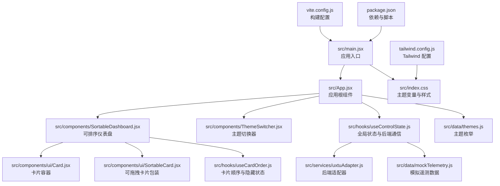
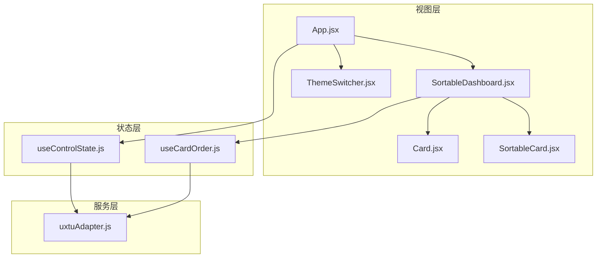
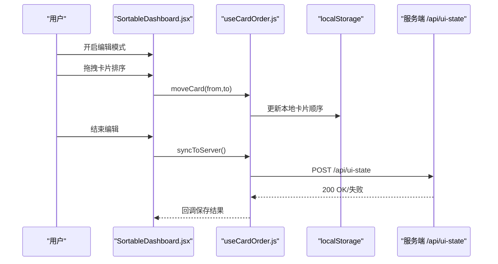
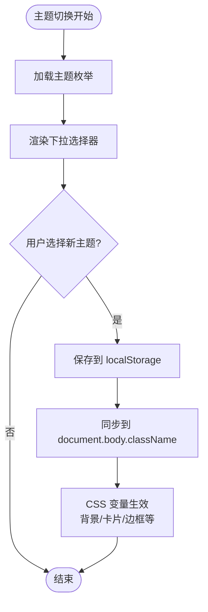
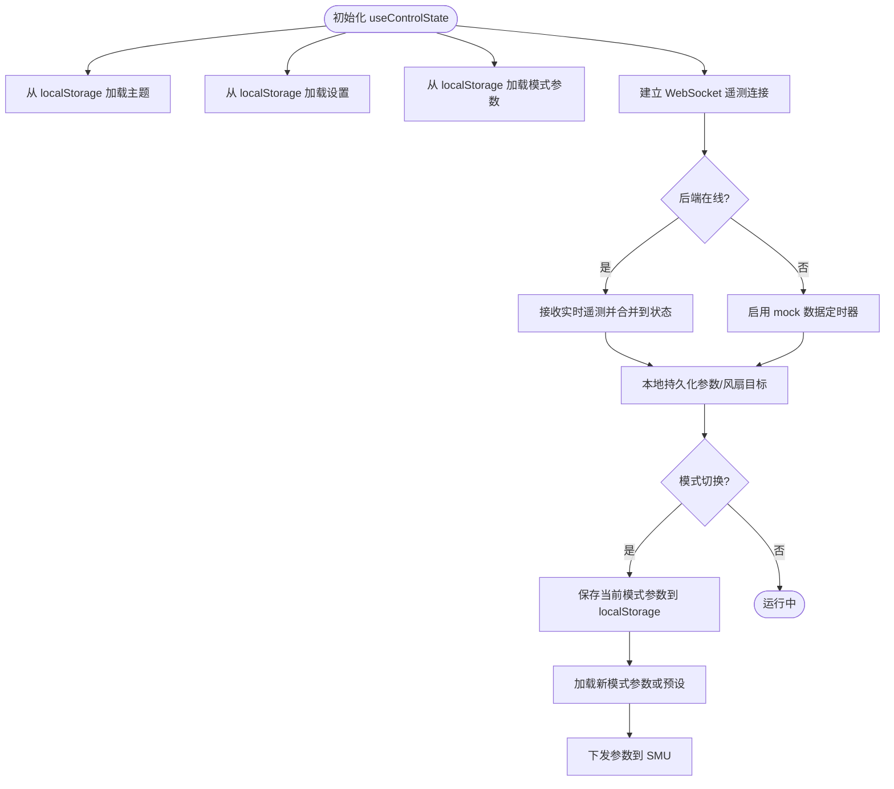
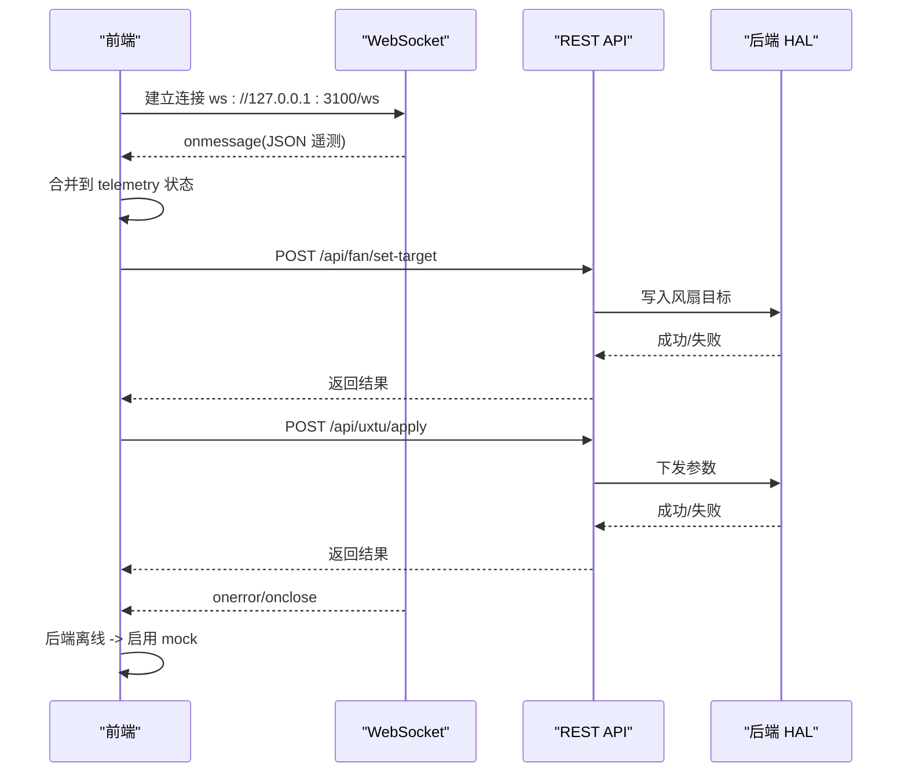
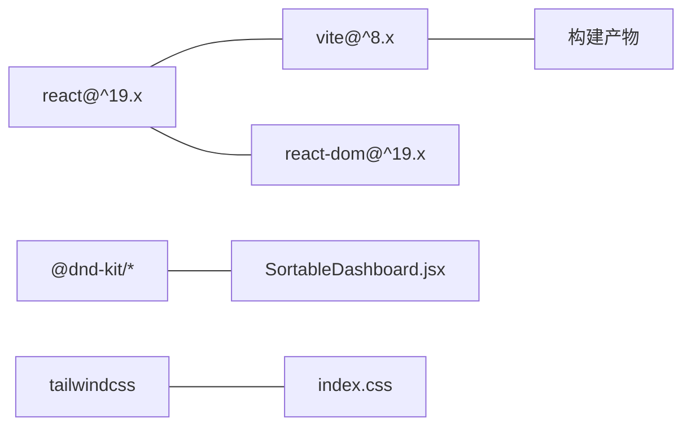

# 前端应用

<cite>
**本文引用的文件**
- [src/main.jsx](file://src/main.jsx)
- [src/App.jsx](file://src/App.jsx)
- [src/components/SortableDashboard.jsx](file://src/components/SortableDashboard.jsx)
- [src/components/ThemeSwitcher.jsx](file://src/components/ThemeSwitcher.jsx)
- [src/hooks/useControlState.js](file://src/hooks/useControlState.js)
- [src/hooks/useCardOrder.js](file://src/hooks/useCardOrder.js)
- [src/services/uxtuAdapter.js](file://src/services/uxtuAdapter.js)
- [src/components/ui/Card.jsx](file://src/components/ui/Card.jsx)
- [src/components/ui/SortableCard.jsx](file://src/components/ui/SortableCard.jsx)
- [src/data/themes.js](file://src/data/themes.js)
- [src/index.css](file://src/index.css)
- [src/data/mockTelemetry.js](file://src/data/mockTelemetry.js)
- [package.json](file://package.json)
- [vite.config.js](file://vite.config.js)
- [tailwind.config.js](file://tailwind.config.js)
</cite>

## 目录
1. [简介](#简介)
2. [项目结构](#项目结构)
3. [核心组件](#核心组件)
4. [架构总览](#架构总览)
5. [组件详解](#组件详解)
6. [依赖关系分析](#依赖关系分析)
7. [性能考量](#性能考量)
8. [故障排查指南](#故障排查指南)
9. [结论](#结论)
10. [附录](#附录)

## 简介
本文件为 DOUZHANZHE-Control 前端应用的综合技术文档，面向开发者与维护者，系统性阐述基于 React 19 的前端架构、组件层次、状态管理、路由与可排序仪表盘的实现原理，以及与后端的通信协议、实时数据更新与错误处理策略。文档同时提供组件开发指南、样式定制方法与性能优化建议。

## 项目结构
前端采用以功能域划分的目录组织方式，核心入口位于 src/main.jsx，应用根组件 App.jsx 负责导航、主题与全局状态协调，仪表盘由 SortableDashboard.jsx 提供可拖拽排序与响应式布局，状态管理通过自定义 Hook useControlState.js 与 useCardOrder.js 实现，UI 组件集中在 src/components/ui，主题与样式通过 src/index.css 与 src/data/themes.js 管理，后端通信通过 src/services/uxtuAdapter.js 统一封装。

图表来源
- [src/main.jsx:1-14](file://src/main.jsx#L1-L14)
- [src/App.jsx:1-134](file://src/App.jsx#L1-L134)
- [src/components/SortableDashboard.jsx:1-247](file://src/components/SortableDashboard.jsx#L1-L247)
- [src/components/ThemeSwitcher.jsx:1-24](file://src/components/ThemeSwitcher.jsx#L1-L24)
- [src/hooks/useControlState.js:1-355](file://src/hooks/useControlState.js#L1-L355)
- [src/hooks/useCardOrder.js:1-128](file://src/hooks/useCardOrder.js#L1-L128)
- [src/services/uxtuAdapter.js:1-130](file://src/services/uxtuAdapter.js#L1-L130)
- [src/components/ui/Card.jsx:1-18](file://src/components/ui/Card.jsx#L1-L18)
- [src/components/ui/SortableCard.jsx:1-43](file://src/components/ui/SortableCard.jsx#L1-L43)
- [src/data/themes.js:1-34](file://src/data/themes.js#L1-L34)
- [src/index.css:1-460](file://src/index.css#L1-L460)
- [src/data/mockTelemetry.js:1-22](file://src/data/mockTelemetry.js#L1-L22)
- [vite.config.js:1-8](file://vite.config.js#L1-L8)
- [tailwind.config.js:1-12](file://tailwind.config.js#L1-L12)
- [package.json:1-33](file://package.json#L1-L33)

章节来源
- [src/main.jsx:1-14](file://src/main.jsx#L1-L14)
- [package.json:1-33](file://package.json#L1-L33)
- [vite.config.js:1-8](file://vite.config.js#L1-L8)
- [tailwind.config.js:1-12](file://tailwind.config.js#L1-L12)

## 核心组件
- 应用根组件 App.jsx：负责页面导航、主题同步、标签页持久化、模式选择与预设恢复、以及将全局状态注入仪表盘与面板组件。
- 可排序仪表盘 SortableDashboard.jsx：集成拖拽排序、可见性控制、响应式列布局、风扇目标转速调节、GPU 模式切换与各监控卡片渲染。
- 主题切换器 ThemeSwitcher.jsx：基于主题枚举 themes.js，提供下拉选择并回调更新主题。
- 自定义 Hook：
  - useControlState.js：统一管理主题、遥测、历史曲线、UX TU 参数、风扇目标转速、设置、模式切换与后端通信。
  - useCardOrder.js：管理卡片顺序、隐藏列表、本地持久化与服务端同步。
- 服务适配器 uxtuAdapter.js：封装后端 REST 与 WebSocket 接口，包括遥测订阅、参数下发、风扇目标设置、GPU 控制等。
- UI 组件：Card.jsx 提供卡片容器，SortableCard.jsx 包裹可拖拽行为与编辑态交互。
- 样式与主题：index.css 定义 CSS 变量与多套主题，themes.js 提供主题名称与 ID 枚举。

章节来源
- [src/App.jsx:1-134](file://src/App.jsx#L1-L134)
- [src/components/SortableDashboard.jsx:1-247](file://src/components/SortableDashboard.jsx#L1-L247)
- [src/components/ThemeSwitcher.jsx:1-24](file://src/components/ThemeSwitcher.jsx#L1-L24)
- [src/hooks/useControlState.js:1-355](file://src/hooks/useControlState.js#L1-L355)
- [src/hooks/useCardOrder.js:1-128](file://src/hooks/useCardOrder.js#L1-L128)
- [src/services/uxtuAdapter.js:1-130](file://src/services/uxtuAdapter.js#L1-L130)
- [src/components/ui/Card.jsx:1-18](file://src/components/ui/Card.jsx#L1-L18)
- [src/components/ui/SortableCard.jsx:1-43](file://src/components/ui/SortableCard.jsx#L1-L43)
- [src/data/themes.js:1-34](file://src/data/themes.js#L1-L34)
- [src/index.css:1-460](file://src/index.css#L1-L460)

## 架构总览
前端采用“根组件协调 + 自定义 Hook 状态 + UI 组件组合 + 服务适配器通信”的分层架构。App.jsx 作为顶层协调者，将主题、遥测、参数与设置传递给仪表盘与面板；SortableDashboard.jsx 通过 DnD Kit 实现拖拽排序，结合 useCardOrder.js 管理 UI 状态；useControlState.js 负责与后端通信与本地持久化；uxtuAdapter.js 抽象后端接口，屏蔽 REST 与 WebSocket 差异。

图表来源
- [src/App.jsx:1-134](file://src/App.jsx#L1-L134)
- [src/components/SortableDashboard.jsx:1-247](file://src/components/SortableDashboard.jsx#L1-L247)
- [src/components/ui/Card.jsx:1-18](file://src/components/ui/Card.jsx#L1-L18)
- [src/components/ui/SortableCard.jsx:1-43](file://src/components/ui/SortableCard.jsx#L1-L43)
- [src/components/ThemeSwitcher.jsx:1-24](file://src/components/ThemeSwitcher.jsx#L1-L24)
- [src/hooks/useControlState.js:1-355](file://src/hooks/useControlState.js#L1-L355)
- [src/hooks/useCardOrder.js:1-128](file://src/hooks/useCardOrder.js#L1-L128)
- [src/services/uxtuAdapter.js:1-130](file://src/services/uxtuAdapter.js#L1-L130)

## 组件详解

### 可排序仪表盘：拖拽排序、布局与持久化
- 拖拽排序：使用 @dnd-kit/core 与 @dnd-kit/sortable，通过 DndContext 与 SortableContext 驱动，handleDragEnd 计算索引变更并调用 moveCard 更新顺序。
- 响应式布局：使用 Tailwind 多列网格（columns-1 md:columns-2 lg:columns-3），平衡列高，保证卡片不被截断。
- 编辑态交互：editMode 下显示拖拽手柄与隐藏按钮，支持隐藏模块与一键显示全部；退出编辑模式时调用 syncToServer 将 UI 状态同步至服务端。
- 卡片渲染：根据 order 渲染可见卡片，renderCard 根据类型映射不同面板（CPU/GPU 监控、内存/磁盘、风扇信息、性能调节、GPU 模式、系统开关、关于）。
- 风扇目标转速：基于当前模式的风扇区间动态限制滑条范围，本地持久化并在去抖后调用后端接口设置目标转速。
- 历史曲线：useControlState.js 维护历史数据，用于绘制 CPU/GPU 负载曲线与温度趋势。

图表来源
- [src/components/SortableDashboard.jsx:44-57](file://src/components/SortableDashboard.jsx#L44-L57)
- [src/hooks/useCardOrder.js:78-91](file://src/hooks/useCardOrder.js#L78-L91)

章节来源
- [src/components/SortableDashboard.jsx:1-247](file://src/components/SortableDashboard.jsx#L1-L247)
- [src/hooks/useCardOrder.js:1-128](file://src/hooks/useCardOrder.js#L1-L128)

### 主题切换与样式系统
- 主题枚举：themes.js 提供主题 ID 与名称，ThemeSwitcher.jsx 使用 select 下拉框展示并回调 setTheme。
- 样式变量：index.css 定义基础 CSS 变量与各主题的覆盖规则，App.jsx 在每次主题变化时同步到 document.body 的 className，使 CSS 变量即时生效。
- 响应式与动画：Tailwind 配置扩展 slide-up 动画，风扇图标使用自定义 spin 动画随转速变化。

图表来源
- [src/components/ThemeSwitcher.jsx:1-24](file://src/components/ThemeSwitcher.jsx#L1-L24)
- [src/data/themes.js:1-34](file://src/data/themes.js#L1-L34)
- [src/index.css:1-460](file://src/index.css#L1-L460)
- [src/App.jsx:39-40](file://src/App.jsx#L39-L40)

章节来源
- [src/components/ThemeSwitcher.jsx:1-24](file://src/components/ThemeSwitcher.jsx#L1-L24)
- [src/data/themes.js:1-34](file://src/data/themes.js#L1-L34)
- [src/index.css:1-460](file://src/index.css#L1-L460)
- [src/App.jsx:39-40](file://src/App.jsx#L39-L40)

### 状态管理：卡片顺序、主题、参数与历史
- useCardOrder.js：管理卡片顺序与隐藏集合，支持本地持久化与服务端同步；提供重置、显示全部、移动卡片等操作。
- useControlState.js：集中管理主题、遥测、历史曲线、UX TU 参数、风扇目标转速、设置与模式；封装后端通信与本地持久化逻辑；在后端不可用时回退到 mock 数据并模拟漂移变化。
- 模式切换：按模式独立保存参数，自定义模式下从服务端加载；切换时自动下发参数到 SMU 并记录后端在线状态。

图表来源
- [src/hooks/useControlState.js:26-355](file://src/hooks/useControlState.js#L26-L355)
- [src/data/mockTelemetry.js:1-22](file://src/data/mockTelemetry.js#L1-L22)
- [src/services/uxtuAdapter.js:58-71](file://src/services/uxtuAdapter.js#L58-L71)

章节来源
- [src/hooks/useCardOrder.js:1-128](file://src/hooks/useCardOrder.js#L1-L128)
- [src/hooks/useControlState.js:1-355](file://src/hooks/useControlState.js#L1-L355)
- [src/services/uxtuAdapter.js:1-130](file://src/services/uxtuAdapter.js#L1-L130)
- [src/data/mockTelemetry.js:1-22](file://src/data/mockTelemetry.js#L1-L22)

### 后端通信协议与实时更新
- REST 接口：
  - /api/custom-params：获取与保存自定义参数（仅自定义模式）
  - /api/ui-state：获取与保存 UI 状态（卡片顺序与隐藏）
  - /api/fan/set-target：设置风扇目标转速
  - /api/control：硬件控制（如热模式、键盘灯等）
  - /api/uxtu/apply：下发 UX TU 参数到 SMU
  - /api/gpu/set、/api/gpu/status：GPU 控制与状态查询
- WebSocket：
  - ws://127.0.0.1:3100/ws：订阅实时遥测，异常时自动重连。
- 错误处理：
  - fetch 请求失败与 WebSocket 错误均进行降级处理（mock 数据与提示）。
  - 保存与同步操作通过回调反馈成功/失败状态。

图表来源
- [src/services/uxtuAdapter.js:19-88](file://src/services/uxtuAdapter.js#L19-L88)
- [src/services/uxtuAdapter.js:58-71](file://src/services/uxtuAdapter.js#L58-L71)
- [src/hooks/useControlState.js:112-126](file://src/hooks/useControlState.js#L112-L126)
- [src/hooks/useControlState.js:242-257](file://src/hooks/useControlState.js#L242-L257)

章节来源
- [src/services/uxtuAdapter.js:1-130](file://src/services/uxtuAdapter.js#L1-L130)
- [src/hooks/useControlState.js:112-126](file://src/hooks/useControlState.js#L112-L126)
- [src/hooks/useControlState.js:242-257](file://src/hooks/useControlState.js#L242-L257)

### 组件开发指南
- 新增卡片：
  - 在 SortableDashboard.jsx 的 CARD_MAP 与 renderCard 分支中注册新卡片 ID 与渲染逻辑。
  - 如需交互，引入对应面板组件或 UI 组件（SliderRow、SwitchRow、Gauge、Sparkline 等）。
- 拖拽行为：
  - 使用 SortableCard.jsx 包裹内容，确保在编辑态显示拖拽手柄与隐藏按钮。
  - 保持 id 唯一且与 useCardOrder.js 默认顺序一致，以便合入新卡片。
- 状态持久化：
  - 对于需要持久化的用户设置，优先使用 useControlState.js 或 useCardOrder.js 的本地存储封装。
  - 仅在必要时直接使用 localStorage，遵循现有键名规范（如 douzhanzhe_params_*、douzhanzhe_card_order 等）。
- 主题扩展：
  - 在 themes.js 新增主题项，复制某主题块并在 index.css 中添加对应 CSS 变量覆盖。
  - 确保主题名称与 ID 不冲突，避免样式覆盖错乱。

章节来源
- [src/components/SortableDashboard.jsx:25-36](file://src/components/SortableDashboard.jsx#L25-L36)
- [src/components/ui/SortableCard.jsx:1-43](file://src/components/ui/SortableCard.jsx#L1-L43)
- [src/data/themes.js:1-34](file://src/data/themes.js#L1-L34)
- [src/index.css:1-460](file://src/index.css#L1-L460)

### 样式定制方法
- CSS 变量：通过修改 :root 与具体主题类中的 --bg/--card/--primary 等变量，统一调整整体风格。
- Tailwind 扩展：在 tailwind.config.js 中扩展动画、字体或颜色，避免直接在组件内硬编码样式。
- 响应式网格：利用 columns-* 与 gap-* 实现多列自适应布局，配合 break-inside-avoid 避免卡片被分栏打断。

章节来源
- [src/index.css:1-460](file://src/index.css#L1-L460)
- [tailwind.config.js:1-12](file://tailwind.config.js#L1-L12)
- [src/components/SortableDashboard.jsx:196-205](file://src/components/SortableDashboard.jsx#L196-L205)

## 依赖关系分析
- 依赖管理：React 19 与 Vite 构建，Tailwind CSS 提供原子化样式，@dnd-kit 支持拖拽排序。
- 组件耦合：App.jsx 与 SortableDashboard.jsx 通过 props 传入状态；useControlState.js 与 useCardOrder.js 作为纯函数 Hook，低耦合、高内聚。
- 外部接口：通过 uxtuAdapter.js 统一后端访问点，避免在业务组件中分散网络请求。

图表来源
- [package.json:11-31](file://package.json#L11-L31)

章节来源
- [package.json:1-33](file://package.json#L1-L33)

## 性能考量
- 去抖优化：风扇目标转速与自定义参数保存均采用去抖策略，减少频繁网络请求与后端压力。
- 本地优先：UI 状态与用户参数优先读写 localStorage，降低首屏等待与网络波动影响。
- 模拟退化：后端不可用时启用 mock 定时器，维持流畅体验；仅在必要时进行复杂计算（如历史曲线）。
- 渲染优化：卡片使用 break-inside-avoid 与多列平衡，避免重排；SortableCard.jsx 仅在拖拽时提升层级，减少不必要的 DOM 层级深度。

章节来源
- [src/hooks/useControlState.js:112-126](file://src/hooks/useControlState.js#L112-L126)
- [src/hooks/useControlState.js:144-169](file://src/hooks/useControlState.js#L144-L169)
- [src/hooks/useCardOrder.js:78-91](file://src/hooks/useCardOrder.js#L78-L91)
- [src/components/SortableDashboard.jsx:196-205](file://src/components/SortableDashboard.jsx#L196-L205)

## 故障排查指南
- WebSocket 断连：
  - 现象：遥测停止更新，界面提示后端离线。
  - 处理：检查后端服务是否启动，确认 ws://127.0.0.1:3100/ws 可达；查看浏览器网络面板与控制台错误。
- 参数下发失败：
  - 现象：模式切换或参数保存后无效果。
  - 处理：确认 /api/uxtu/apply 返回状态码；检查 thermal_mode 与 power_plan 映射是否正确；查看 uxtuAdapter.js 的错误抛出位置。
- 风扇目标设置无效：
  - 现象：滑条变化但风扇转速未改变。
  - 处理：确认 /api/fan/set-target 是否返回成功；检查去抖时间与目标值范围；核对 getFanRange 返回的模式区间。
- UI 状态未同步：
  - 现象：退出编辑模式后卡片顺序未保存。
  - 处理：检查 /api/ui-state 的 POST 是否成功；确认 useCardOrder.js 的 syncToServer 流程与 localStorage 合法性。

章节来源
- [src/services/uxtuAdapter.js:58-71](file://src/services/uxtuAdapter.js#L58-L71)
- [src/services/uxtuAdapter.js:19-27](file://src/services/uxtuAdapter.js#L19-L27)
- [src/hooks/useControlState.js:112-126](file://src/hooks/useControlState.js#L112-L126)
- [src/hooks/useCardOrder.js:78-91](file://src/hooks/useCardOrder.js#L78-L91)

## 结论
该前端应用以清晰的分层架构与完善的自定义 Hook 实现了主题、状态与 UI 的解耦，通过 DnD Kit 提供直观的可排序仪表盘体验，并以 uxtuAdapter.js 统一抽象后端通信。在性能方面采用去抖与本地优先策略，在可用性方面提供 mock 退化与错误反馈。建议后续持续完善服务端接口文档与测试覆盖，以进一步提升稳定性与可维护性。

## 附录
- 构建与部署：Vite 构建后通过脚本复制到 server/api/wwwroot，确保静态资源与后端同源。
- 开发工具：ESLint 与 Tailwind CSS 集成，提供一致的代码风格与样式体系。

章节来源
- [package.json:6-10](file://package.json#L6-L10)
- [vite.config.js:1-8](file://vite.config.js#L1-L8)
- [tailwind.config.js:1-12](file://tailwind.config.js#L1-L12)