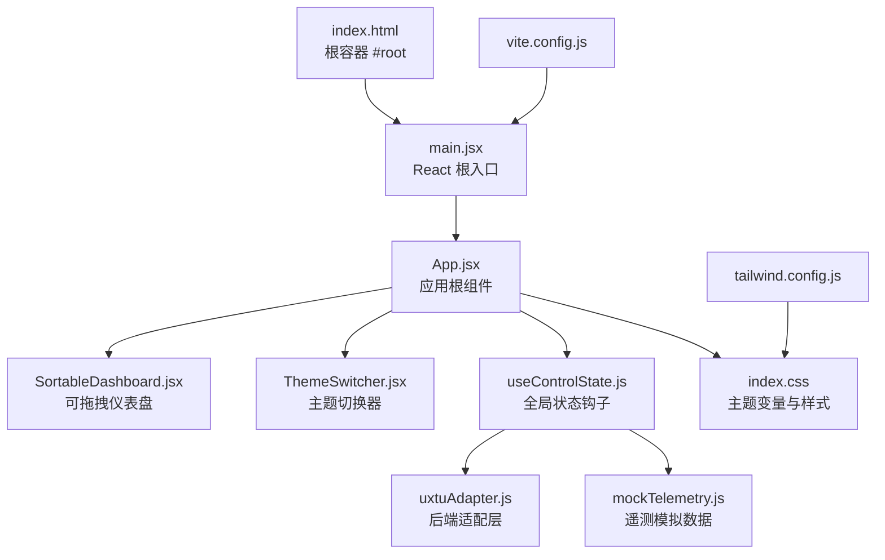
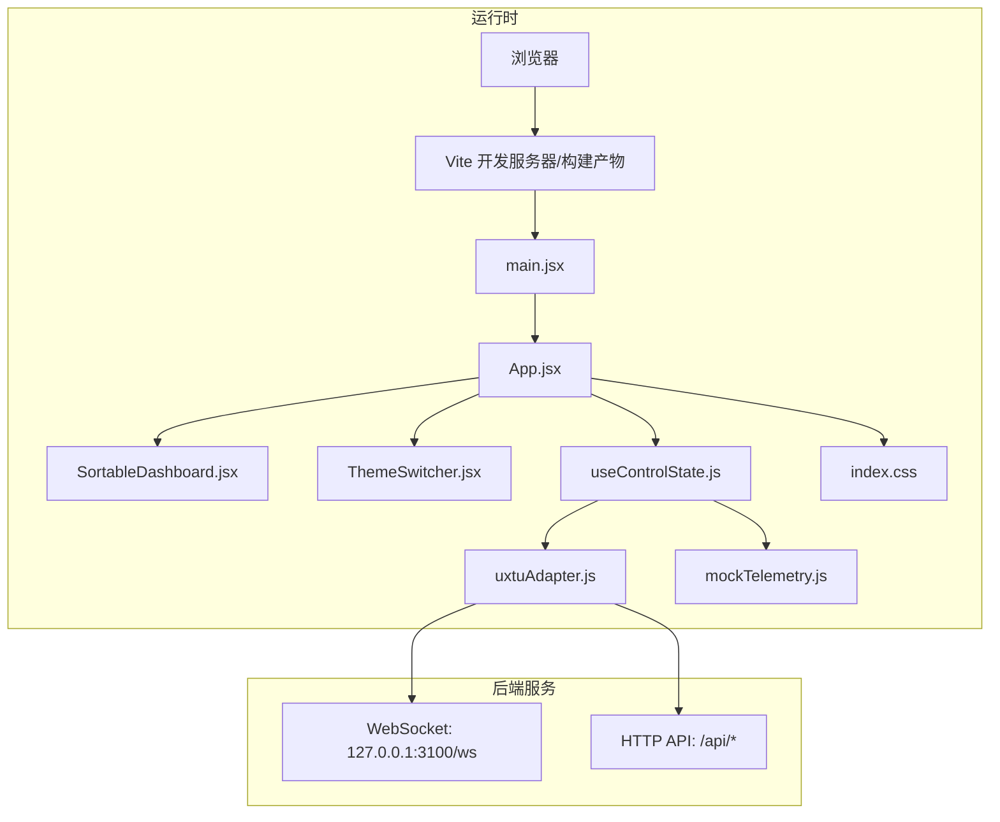
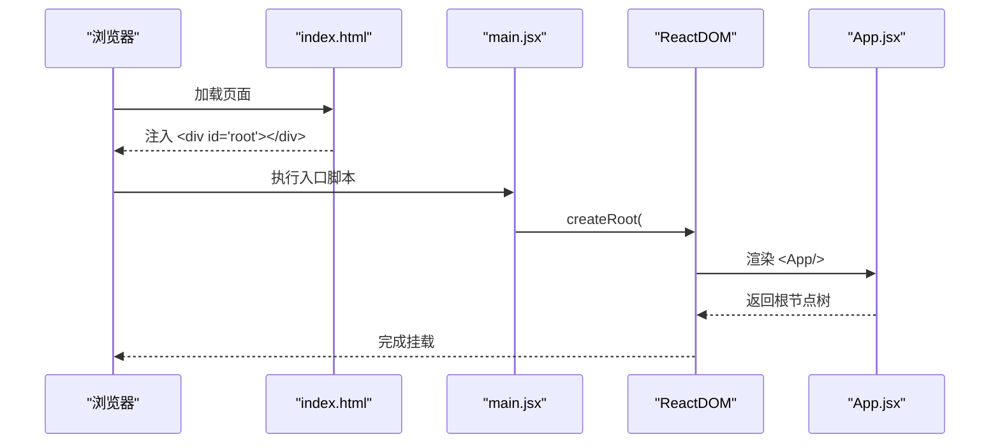
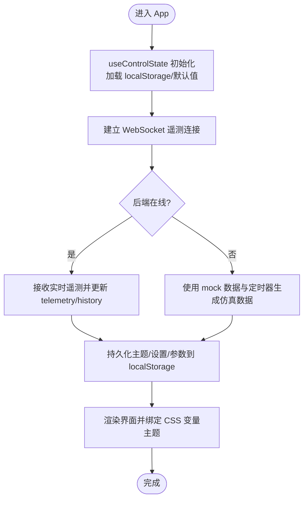
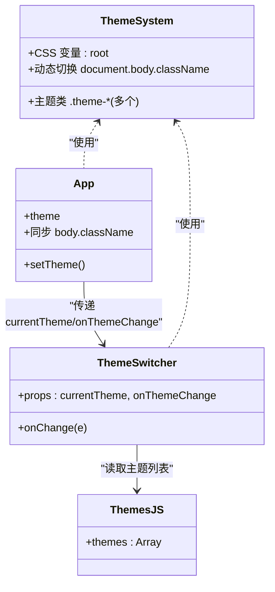
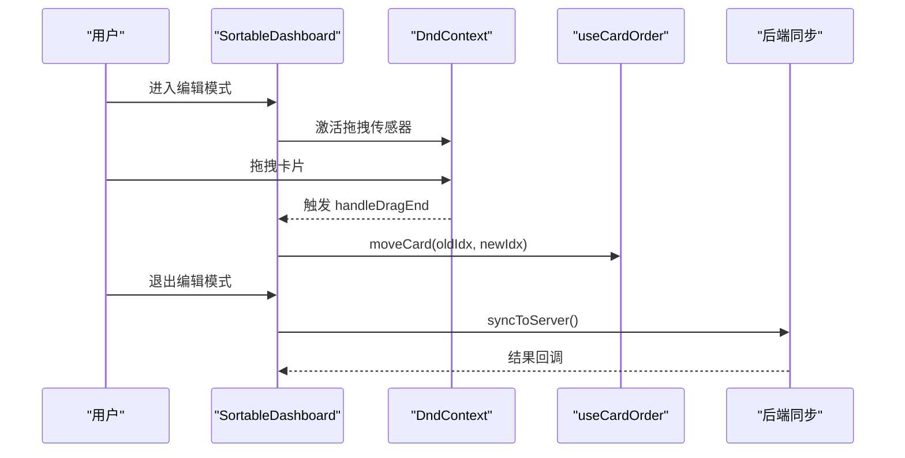
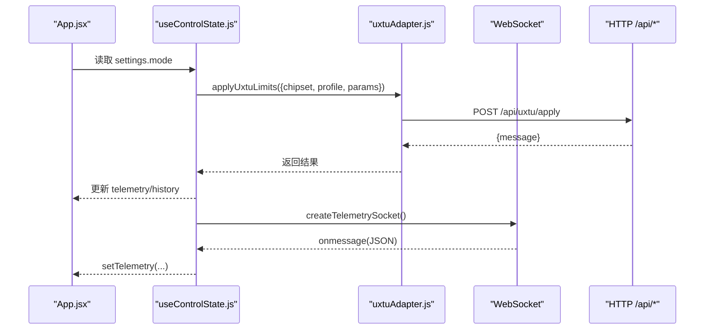
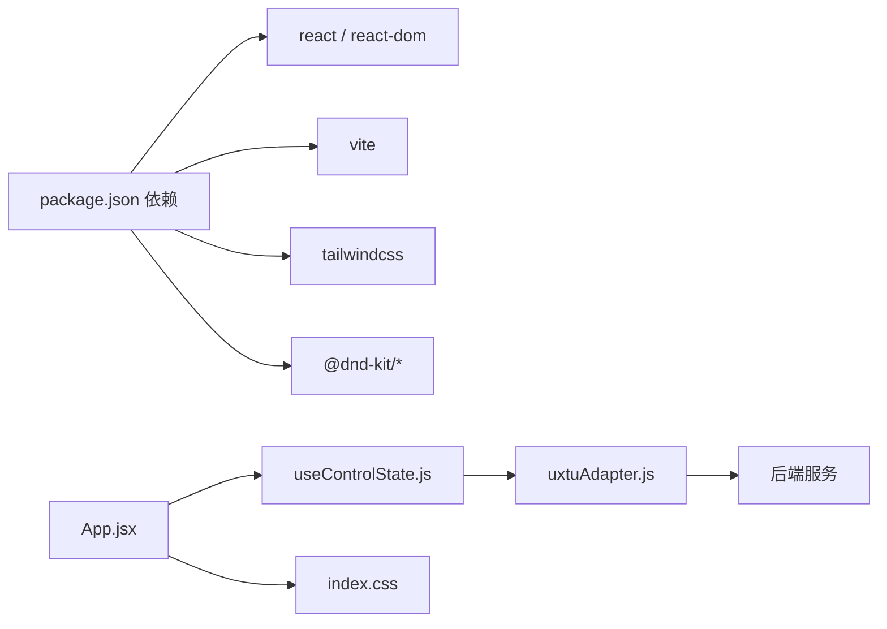

# 应用架构

<cite>
**本文引用的文件**
- [main.jsx](file://src/main.jsx)
- [App.jsx](file://src/App.jsx)
- [index.html](file://index.html)
- [index.css](file://src/index.css)
- [package.json](file://package.json)
- [vite.config.js](file://vite.config.js)
- [tailwind.config.js](file://tailwind.config.js)
- [useControlState.js](file://src/hooks/useControlState.js)
- [SortableDashboard.jsx](file://src/components/SortableDashboard.jsx)
- [ThemeSwitcher.jsx](file://src/components/ThemeSwitcher.jsx)
- [uxtuAdapter.js](file://src/services/uxtuAdapter.js)
- [themes.js](file://src/data/themes.js)
- [mockTelemetry.js](file://src/data/mockTelemetry.js)
- [Card.jsx](file://src/components/ui/Card.jsx)
- [PerformancePanel.jsx](file://src/components/panels/PerformancePanel.jsx)
</cite>

## 目录
1. [简介](#简介)
2. [项目结构](#项目结构)
3. [核心组件](#核心组件)
4. [架构总览](#架构总览)
5. [组件详解](#组件详解)
6. [依赖关系分析](#依赖关系分析)
7. [性能考量](#性能考量)
8. [故障排查指南](#故障排查指南)
9. [结论](#结论)
10. [附录](#附录)

## 简介
本文件面向 DOUZHANZHE-Control 前端应用，系统性梳理基于 React 19 的应用架构与实现细节。内容涵盖：
- 初始化流程与入口点
- 组件层次结构与路由配置策略
- 状态管理模式与跨组件共享
- CSS 变量主题系统与动态切换机制
- 响应式设计与断点策略
- 组件组织原则、命名规范与最佳实践

## 项目结构
前端采用 Vite + React 19 + Tailwind CSS 架构，源码位于 src 目录，公共资源位于 public，构建产物输出至 server/api/wwwroot（由脚本自动复制）。

图表来源
- [index.html:1-14](file://index.html#L1-L14)
- [main.jsx:1-14](file://src/main.jsx#L1-L14)
- [App.jsx:1-134](file://src/App.jsx#L1-L134)
- [SortableDashboard.jsx:1-247](file://src/components/SortableDashboard.jsx#L1-L247)
- [ThemeSwitcher.jsx:1-24](file://src/components/ThemeSwitcher.jsx#L1-L24)
- [useControlState.js:1-355](file://src/hooks/useControlState.js#L1-L355)
- [uxtuAdapter.js:1-130](file://src/services/uxtuAdapter.js#L1-L130)
- [mockTelemetry.js:1-22](file://src/data/mockTelemetry.js#L1-L22)
- [index.css:1-460](file://src/index.css#L1-L460)
- [tailwind.config.js:1-12](file://tailwind.config.js#L1-L12)
- [vite.config.js:1-8](file://vite.config.js#L1-L8)

章节来源
- [index.html:1-14](file://index.html#L1-L14)
- [main.jsx:1-14](file://src/main.jsx#L1-L14)
- [package.json:1-33](file://package.json#L1-L33)
- [vite.config.js:1-8](file://vite.config.js#L1-L8)
- [tailwind.config.js:1-12](file://tailwind.config.js#L1-L12)

## 核心组件
- 应用根组件 App.jsx：负责导航、主题同步、标签页持久化、模式选择与全局状态注入。
- 可拖拽仪表盘 SortableDashboard.jsx：基于 @dnd-kit 实现卡片拖拽排序与可见性管理。
- 主题切换器 ThemeSwitcher.jsx：基于 themes.js 提供多套 CSS 变量主题。
- 全局状态钩子 useControlState.js：集中管理主题、设置、遥测、历史、UX TU 参数与后端交互。
- 后端适配层 uxtuAdapter.js：封装 WebSocket 遥测、HTTP API 调用与模式预设。
- UI 基础组件：Card.jsx 等，统一使用 CSS 变量进行主题化渲染。

章节来源
- [App.jsx:1-134](file://src/App.jsx#L1-L134)
- [SortableDashboard.jsx:1-247](file://src/components/SortableDashboard.jsx#L1-L247)
- [ThemeSwitcher.jsx:1-24](file://src/components/ThemeSwitcher.jsx#L1-L24)
- [useControlState.js:1-355](file://src/hooks/useControlState.js#L1-L355)
- [uxtuAdapter.js:1-130](file://src/services/uxtuAdapter.js#L1-L130)
- [Card.jsx:1-18](file://src/components/ui/Card.jsx#L1-L18)

## 架构总览
应用采用“入口 -> 根组件 -> 面板/仪表盘 -> 服务适配”的分层架构。React 19 提供并发特性，Tailwind 提供原子化样式与响应式断点，@dnd-kit 支持拖拽排序，localStorage 实现本地持久化，WebSocket 实时接收硬件遥测。

图表来源
- [main.jsx:1-14](file://src/main.jsx#L1-L14)
- [App.jsx:1-134](file://src/App.jsx#L1-L134)
- [SortableDashboard.jsx:1-247](file://src/components/SortableDashboard.jsx#L1-L247)
- [ThemeSwitcher.jsx:1-24](file://src/components/ThemeSwitcher.jsx#L1-L24)
- [useControlState.js:1-355](file://src/hooks/useControlState.js#L1-L355)
- [uxtuAdapter.js:1-130](file://src/services/uxtuAdapter.js#L1-L130)
- [mockTelemetry.js:1-22](file://src/data/mockTelemetry.js#L1-L22)
- [index.css:1-460](file://src/index.css#L1-L460)

## 组件详解

### 初始化流程与入口点
- HTML 提供根容器 #root。
- main.jsx 使用 ReactDOM.createRoot 渲染 App，并包裹 ToastProvider 与 StrictMode。
- App.jsx 作为根组件，注入 useControlState 提供的状态与方法，渲染侧边栏导航、主内容区与主题切换器。

图表来源
- [index.html:1-14](file://index.html#L1-L14)
- [main.jsx:1-14](file://src/main.jsx#L1-L14)
- [App.jsx:1-134](file://src/App.jsx#L1-L134)

章节来源
- [index.html:1-14](file://index.html#L1-L14)
- [main.jsx:1-14](file://src/main.jsx#L1-L14)

### 导航与布局
- 侧边栏包含“主页/系统/设置”三个标签页，点击切换 activeTab 并持久化到 localStorage。
- 主区域根据 activeTab 渲染不同面板：仪表盘、系统信息、设置。
- 顶部导航与编辑模式按钮在仪表盘页启用拖拽排序。

章节来源
- [App.jsx:14-85](file://src/App.jsx#L14-L85)

### 状态管理与持久化
- useControlState.js 负责：
  - 主题 theme 与设置 settings 的 localStorage 持久化
  - 遥测 telemetry 与历史 history 的维护
  - UX TU 参数 uxtuParams 与 fan 目标转速的本地存储与服务端同步
  - 模式切换时的参数记忆与预设下发
  - WebSocket 遥测连接与后端不可用时的 mock 数据回退
- App.jsx 通过 useControlState 注入状态与方法，同步 body 类名以激活 CSS 变量主题。

图表来源
- [useControlState.js:1-355](file://src/hooks/useControlState.js#L1-L355)
- [App.jsx:23-40](file://src/App.jsx#L23-L40)

章节来源
- [useControlState.js:1-355](file://src/hooks/useControlState.js#L1-L355)
- [App.jsx:23-40](file://src/App.jsx#L23-L40)

### 主题系统与动态切换
- CSS 变量主题：index.css 定义基础变量 :root 与各主题类（如 .theme-neon），组件通过内联 style 使用 var(--xxx)。
- 动态切换：App.jsx 在 theme 变化时同步 document.body.className，使 CSS 变量即时生效。
- 主题列表：themes.js 提供主题 id 与名称映射，ThemeSwitcher.jsx 下拉选择触发 onThemeChange。

图表来源
- [index.css:1-460](file://src/index.css#L1-L460)
- [themes.js:1-34](file://src/data/themes.js#L1-L34)
- [ThemeSwitcher.jsx:1-24](file://src/components/ThemeSwitcher.jsx#L1-L24)
- [App.jsx:23-40](file://src/App.jsx#L23-L40)

章节来源
- [index.css:1-460](file://src/index.css#L1-L460)
- [themes.js:1-34](file://src/data/themes.js#L1-L34)
- [ThemeSwitcher.jsx:1-24](file://src/components/ThemeSwitcher.jsx#L1-L24)
- [App.jsx:23-40](file://src/App.jsx#L23-L40)

### 仪表盘与拖拽排序
- SortableDashboard.jsx 使用 @dnd-kit 的 DndContext/SortableContext 实现卡片拖拽排序。
- 卡片类型通过 CARD_MAP 映射，支持 CPU/GPU 监控、内存/硬盘、风扇信息、CPU/GPU 调节、系统开关、键盘灯、GPU 模式、关于等。
- 编辑模式下可隐藏/显示卡片与重置排序，退出编辑模式时同步到服务端（由 useCardOrder 钩子处理）。

图表来源
- [SortableDashboard.jsx:1-247](file://src/components/SortableDashboard.jsx#L1-L247)

章节来源
- [SortableDashboard.jsx:1-247](file://src/components/SortableDashboard.jsx#L1-L247)

### 遥测与模式预设
- uxtuAdapter.js 提供：
  - createTelemetrySocket：直连 C# HAL 的 WebSocket，接收实时遥测
  - applyUxtuLimits：下发参数到后端
  - MODE_PRESETS：四种模式的完整参数集合
  - thermalModeMap/powerPlanHALMap：与 HAL 的枚举映射
- useControlState.js 在模式切换时：
  - 保存当前模式参数到 localStorage 对应键
  - 从 localStorage 或服务端加载新模式参数
  - 自动下发参数到 SMU/EC/HAL

图表来源
- [App.jsx:86-128](file://src/App.jsx#L86-L128)
- [useControlState.js:191-240](file://src/hooks/useControlState.js#L191-L240)
- [uxtuAdapter.js:19-71](file://src/services/uxtuAdapter.js#L19-L71)

章节来源
- [uxtuAdapter.js:1-130](file://src/services/uxtuAdapter.js#L1-L130)
- [useControlState.js:191-240](file://src/hooks/useControlState.js#L191-L240)
- [App.jsx:86-128](file://src/App.jsx#L86-L128)

### 响应式设计与断点策略
- Tailwind CSS 提供移动优先的断点：mobile(md)、tablet(lg) 等，配合网格与列布局实现自适应。
- App.jsx 的外层容器使用 md:grid-cols-[220px_1fr] 在中等及以上屏幕展开侧边栏。
- SortableDashboard.jsx 使用 columns-1 / md:columns-2 / lg:columns-3 实现卡片列数自适应。
- Card.jsx 统一使用 var(--card)/var(--border) 等变量，确保在任意主题下保持一致的视觉层级。

章节来源
- [tailwind.config.js:1-12](file://tailwind.config.js#L1-L12)
- [App.jsx:42-44](file://src/App.jsx#L42-L44)
- [SortableDashboard.jsx:196-205](file://src/components/SortableDashboard.jsx#L196-L205)
- [Card.jsx:1-18](file://src/components/ui/Card.jsx#L1-L18)

### 组件组织原则与命名规范
- 文件组织：按功能域划分 components/ui、components/panels、hooks、services、data、assets。
- 命名规范：
  - 组件文件：首字母大写，如 SortableDashboard.jsx、ThemeSwitcher.jsx
  - 钩子函数：useXxx.js
  - 工具/适配：xxxAdapter.js 或 xxxUtil.js
  - 数据常量：xxx.js（如 themes.js、mockTelemetry.js）
- 样式：统一通过 CSS 变量与 Tailwind 原子类，避免内联样式的滥用。
- 交互：事件处理函数以 handleXxx 命名，便于识别。

章节来源
- [package.json:1-33](file://package.json#L1-L33)
- [index.css:1-460](file://src/index.css#L1-L460)

## 依赖关系分析
- React 19 与 Vite 提供开发与构建能力；Tailwind 作为样式框架；@dnd-kit 提供拖拽能力。
- 业务依赖链：App.jsx -> useControlState.js -> uxtuAdapter.js -> 后端 API/WebSocket。
- 样式依赖链：index.css 定义变量，组件通过内联 style 与 Tailwind 类使用变量。

图表来源
- [package.json:1-33](file://package.json#L1-L33)
- [App.jsx:1-134](file://src/App.jsx#L1-L134)
- [useControlState.js:1-355](file://src/hooks/useControlState.js#L1-L355)
- [uxtuAdapter.js:1-130](file://src/services/uxtuAdapter.js#L1-L130)
- [index.css:1-460](file://src/index.css#L1-L460)

章节来源
- [package.json:1-33](file://package.json#L1-L33)
- [vite.config.js:1-8](file://vite.config.js#L1-L8)
- [tailwind.config.js:1-12](file://tailwind.config.js#L1-L12)

## 性能考量
- 状态更新去抖：风扇目标转速与自定义参数保存均采用定时器去抖，减少频繁网络请求与写入。
- 本地优先：主题、设置、每模式参数优先从 localStorage 读取，提升首屏速度与离线可用性。
- WebSocket 重连：断线自动重连，降低单点故障影响。
- 模拟数据回退：后端不可用时使用 mock 数据与定时器生成仿真数据，保证界面可用。
- 拖拽优化：@dnd-kit 默认启用指针/触摸传感器与碰撞检测，结合最小移动距离阈值，避免误触。

章节来源
- [useControlState.js:112-126](file://src/hooks/useControlState.js#L112-L126)
- [useControlState.js:144-169](file://src/hooks/useControlState.js#L144-L169)
- [useControlState.js:242-257](file://src/hooks/useControlState.js#L242-L257)
- [useControlState.js:260-336](file://src/hooks/useControlState.js#L260-L336)
- [SortableDashboard.jsx:59-62](file://src/components/SortableDashboard.jsx#L59-L62)

## 故障排查指南
- 遥测无数据
  - 检查 WebSocket 是否连接成功，确认后端服务监听 127.0.0.1:3100/ws
  - 若断开则自动重连，观察控制台错误
- 参数下发失败
  - 查看 applyUxtuLimits 返回消息，确认后端 /api/uxtu/apply 可用
  - 检查 thermalModeMap 与 powerPlanHALMap 映射是否正确
- 主题切换无效
  - 确认 body.className 已更新为所选主题类
  - 检查 index.css 中对应主题变量是否完整
- 模式切换未生效
  - 确认 localStorage 中是否存在该模式的参数缓存
  - 检查后端是否成功下发到 SMU/EC/HAL

章节来源
- [uxtuAdapter.js:58-71](file://src/services/uxtuAdapter.js#L58-L71)
- [useControlState.js:242-257](file://src/hooks/useControlState.js#L242-L257)
- [App.jsx:39-40](file://src/App.jsx#L39-L40)
- [index.css:1-460](file://src/index.css#L1-L460)

## 结论
本应用以 React 19 为核心，结合 Tailwind 原子化样式与 @dnd-kit 拖拽能力，构建了高可用、可定制的硬件控制前端。通过 CSS 变量主题系统与 localStorage 持久化，实现了良好的用户体验与扩展性。建议后续持续完善错误边界、日志上报与单元测试，进一步提升稳定性与可观测性。

## 附录
- 构建与部署
  - npm run build 生成 dist
  - npm run postbuild 将 dist 复制到 server/api/wwwroot
- 开发工具
  - ESLint + Tailwind CSS 插件，确保代码风格与样式一致性

章节来源
- [package.json:6-10](file://package.json#L6-L10)
- [vite.config.js:1-8](file://vite.config.js#L1-L8)
- [tailwind.config.js:1-12](file://tailwind.config.js#L1-L12)