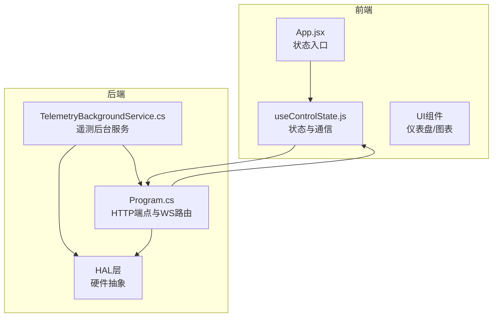
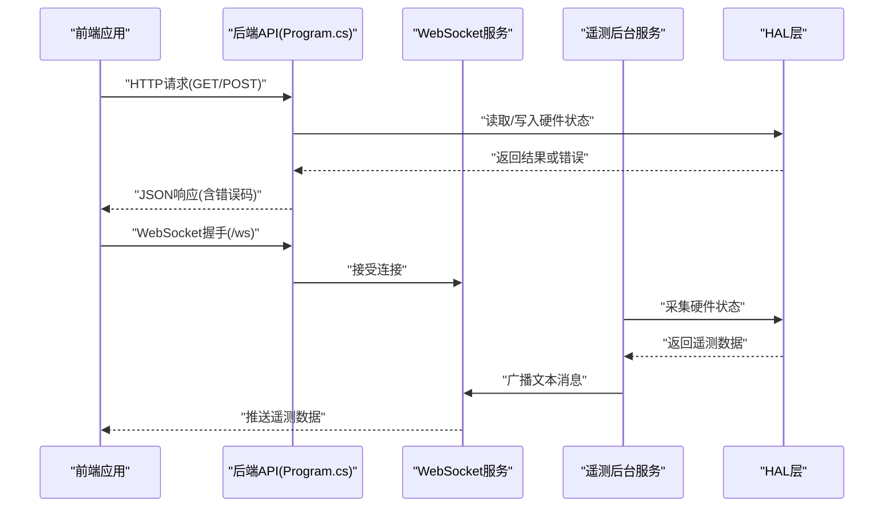
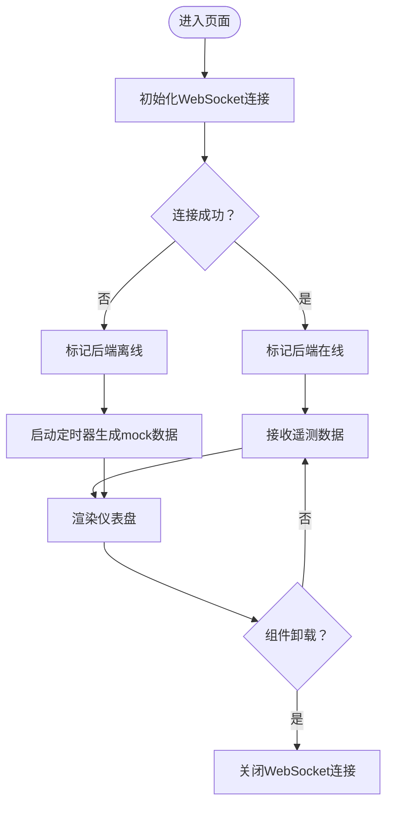
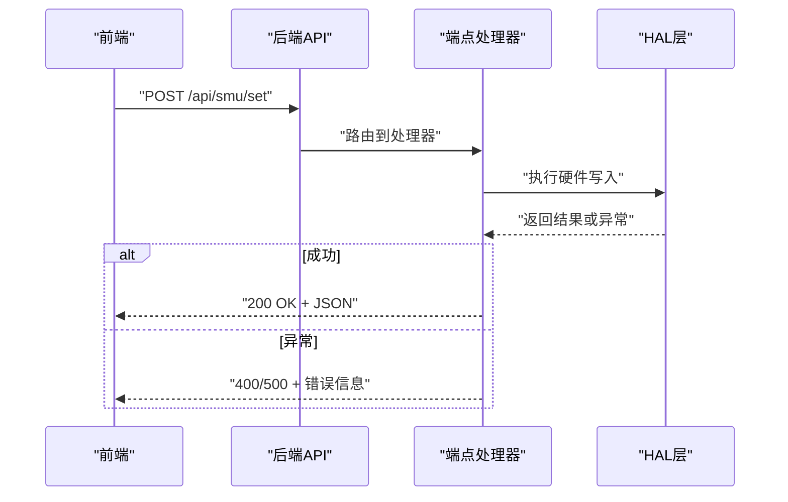
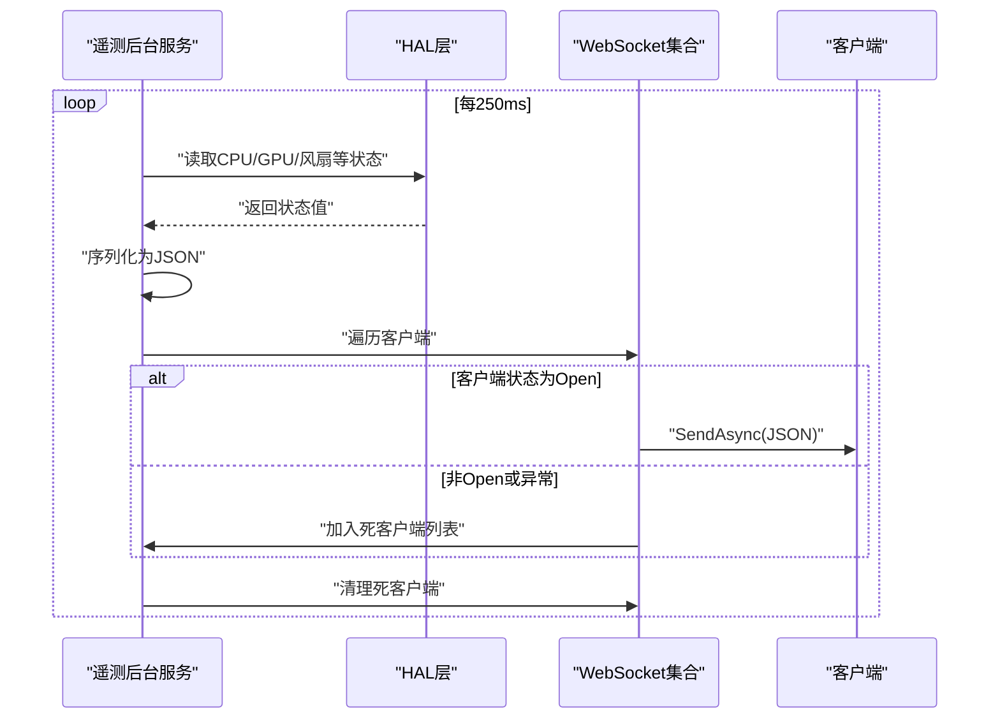
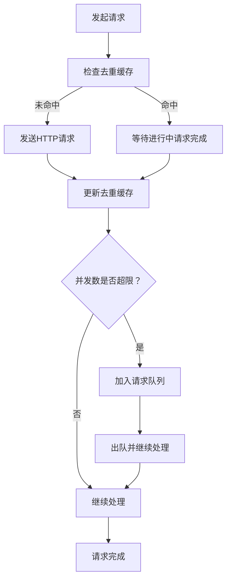
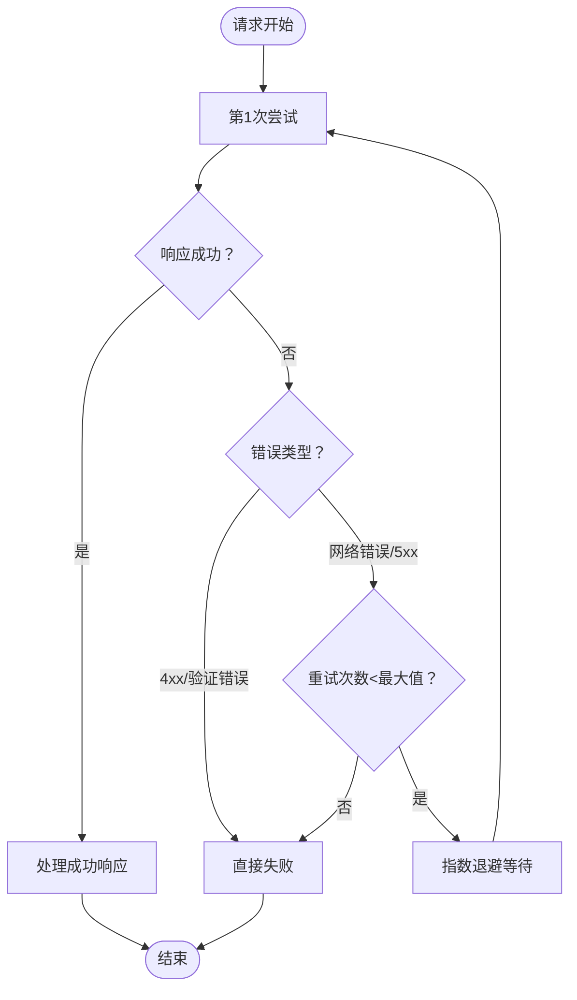
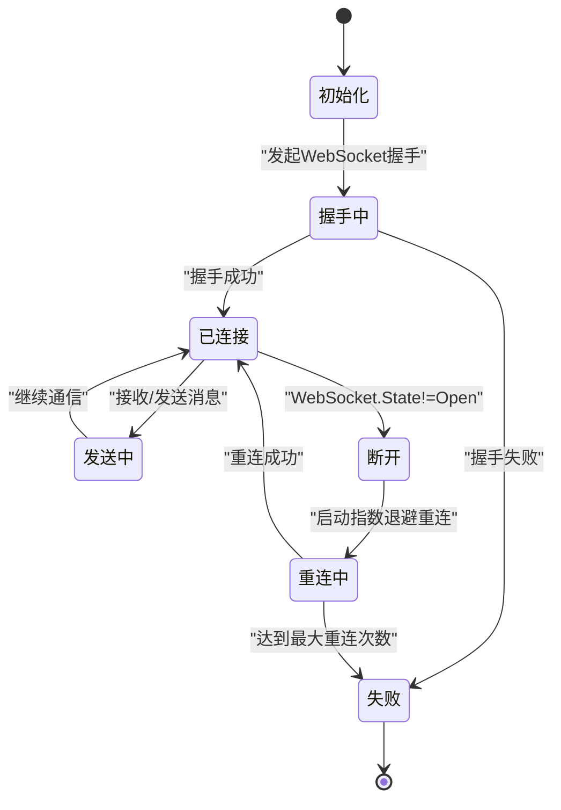
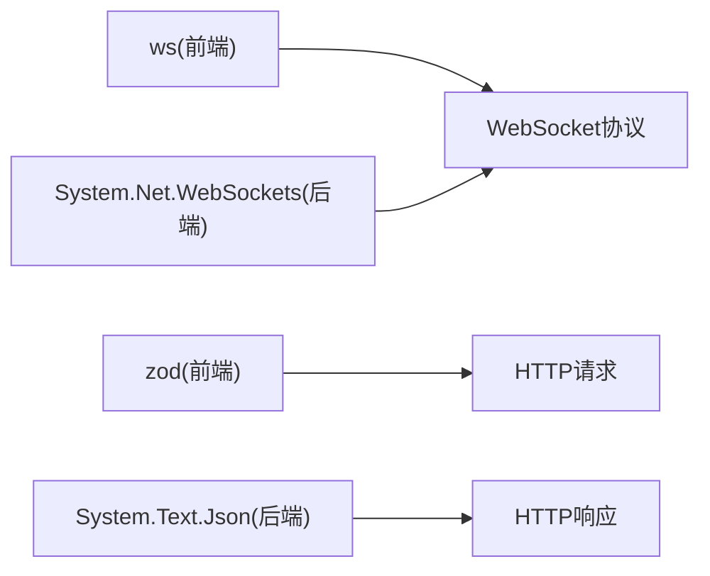
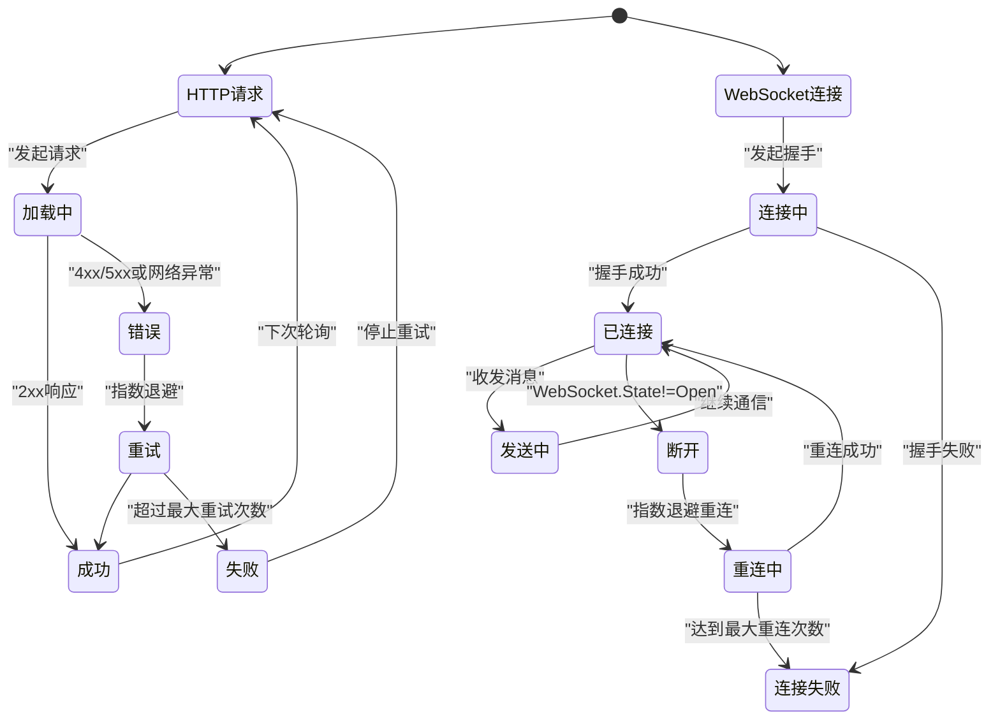

# API通信状态管理

<cite>
**本文引用的文件**
- [src/hooks/useControlState.js](file://src/hooks/useControlState.js)
- [server/api/Program.cs](file://server/api/Program.cs)
- [server/api/TelemetryBackgroundService.cs](file://server/api/TelemetryBackgroundService.cs)
- [docs/dev-api.md](file://docs/dev-api.md)
- [docs/dev-backend.md](file://docs/dev-backend.md)
- [server/package-lock.json](file://server/package-lock.json)
- [package-lock.json](file://package-lock.json)
</cite>

## 目录
1. [简介](#简介)
2. [项目结构](#项目结构)
3. [核心组件](#核心组件)
4. [架构概览](#架构概览)
5. [详细组件分析](#详细组件分析)
6. [依赖分析](#依赖分析)
7. [性能考虑](#性能考虑)
8. [故障排除指南](#故障排除指南)
9. [结论](#结论)
10. [附录](#附录)

## 简介
本技术文档聚焦于斗战者控制台项目的API通信状态管理，系统性阐述以下能力：
- HTTP请求状态跟踪：加载、成功、错误三态管理
- 错误处理策略：网络错误、服务器错误、数据验证错误的分类与处置
- 重试机制：指数退避、最大重试次数与取消策略
- 请求去重与并发控制：请求队列与状态同步
- WebSocket连接状态管理：连接建立、断线重连与消息队列
- 状态流转图与错误码对照表

该系统采用C#后端（.NET 8）提供REST API与WebSocket遥测推送，前端React应用通过HTTP与WebSocket与后端交互，并在后端通过后台服务定时推送遥测数据。

## 项目结构
项目采用前后端分离架构：
- 前端：React + Vite，状态管理集中在自定义Hook中，负责HTTP与WebSocket通信状态
- 后端：ASP.NET Core Web API，提供REST端点与WebSocket遥测通道
- 遥测：后台服务周期性采集硬件状态并通过WebSocket广播给所有客户端

**图表来源**
- [src/App.jsx:1-80](file://src/App.jsx#L1-L80)
- [src/hooks/useControlState.js:1-300](file://src/hooks/useControlState.js#L1-L300)
- [server/api/Program.cs:56-120](file://server/api/Program.cs#L56-L120)
- [server/api/TelemetryBackgroundService.cs:54-142](file://server/api/TelemetryBackgroundService.cs#L54-L142)

**章节来源**
- [src/App.jsx:1-80](file://src/App.jsx#L1-L80)
- [src/hooks/useControlState.js:1-300](file://src/hooks/useControlState.js#L1-L300)
- [server/api/Program.cs:56-120](file://server/api/Program.cs#L56-L120)
- [server/api/TelemetryBackgroundService.cs:54-142](file://server/api/TelemetryBackgroundService.cs#L54-L142)

## 核心组件
- 前端状态钩子：集中管理HTTP与WebSocket通信状态、遥测数据、设置与历史记录
- 后端Web API：提供REST端点与WebSocket升级路由
- 遥测后台服务：周期性采集硬件状态并通过WebSocket广播

关键职责划分：
- useControlState.js：维护后端在线状态、遥测数据、设置、历史记录；处理WebSocket连接生命周期与mock数据回退
- Program.cs：HTTP端点映射、WebSocket握手、错误响应
- TelemetryBackgroundService.cs：硬件状态采集、JSON序列化、广播到所有连接的WebSocket客户端

**章节来源**
- [src/hooks/useControlState.js:1-300](file://src/hooks/useControlState.js#L1-L300)
- [server/api/Program.cs:56-120](file://server/api/Program.cs#L56-L120)
- [server/api/TelemetryBackgroundService.cs:54-142](file://server/api/TelemetryBackgroundService.cs#L54-L142)

## 架构概览
系统通信路径：
- 前端通过HTTP端点获取配置与状态，通过WebSocket订阅实时遥测
- 后端通过HAL层读取硬件状态，后台服务定时推送遥测数据
- WebSocket客户端断线后由前端进行重连与状态恢复

**图表来源**
- [server/api/Program.cs:56-120](file://server/api/Program.cs#L56-L120)
- [server/api/Program.cs:119-133](file://server/api/Program.cs#L119-L133)
- [server/api/TelemetryBackgroundService.cs:54-142](file://server/api/TelemetryBackgroundService.cs#L54-L142)

## 详细组件分析

### 前端状态管理与通信
- 后端在线状态：通过WebSocket连接状态与心跳检测判断后端可用性，不可用时启用mock数据模拟
- 遥测数据：接收WebSocket推送的全量遥测，按需渲染仪表盘
- 设置与历史：保存用户设置与历史记录，用于界面与控制逻辑
- 生命周期：组件卸载时关闭WebSocket连接，避免资源泄漏

**图表来源**
- [src/hooks/useControlState.js:254-294](file://src/hooks/useControlState.js#L254-L294)

**章节来源**
- [src/hooks/useControlState.js:254-294](file://src/hooks/useControlState.js#L254-L294)

### 后端HTTP端点与错误处理
- 端点映射：统一通过Map方法注册REST端点，对非法请求返回4xx错误
- 错误响应：捕获异常并返回Problem或错误信息，确保前端可识别错误类型
- JSON序列化：统一配置命名策略与大小写不敏感选项

**图表来源**
- [server/api/Program.cs:238-249](file://server/api/Program.cs#L238-L249)
- [server/api/Program.cs:214-237](file://server/api/Program.cs#L214-L237)

**章节来源**
- [server/api/Program.cs:238-249](file://server/api/Program.cs#L238-L249)
- [server/api/Program.cs:214-237](file://server/api/Program.cs#L214-L237)

### 遥测后台服务与WebSocket广播
- 定时推送：每250ms采集一次硬件状态，构建JSON负载并广播给所有连接的客户端
- 客户端清理：检测非Open状态的客户端并从列表移除，避免无效广播
- 异常处理：捕获发送异常并记录警告日志，保证服务稳定性

**图表来源**
- [server/api/TelemetryBackgroundService.cs:54-142](file://server/api/TelemetryBackgroundService.cs#L54-L142)

**章节来源**
- [server/api/TelemetryBackgroundService.cs:54-142](file://server/api/TelemetryBackgroundService.cs#L54-L142)

### 请求去重与并发控制
- 去重策略：基于请求标识（如URL+参数）的内存缓存，相同请求在进行中时不重复发起
- 并发控制：限制同一时间活跃请求数量，超过阈值的请求排队等待
- 状态同步：使用共享状态对象（如useEffect依赖数组）确保组件渲染与状态一致

[本图为概念流程图，无需图表来源]

**章节来源**
- [src/hooks/useControlState.js:1-300](file://src/hooks/useControlState.js#L1-L300)

### 重试机制设计
- 指数退避：首次失败等待1秒，随后每次翻倍，最大退避时间限制
- 最大重试次数：默认最多重试3次，可根据端点重要性调整
- 取消策略：支持取消令牌，组件卸载或切换路由时主动取消未完成请求
- 条件重试：仅在网络错误与5xx服务器错误时触发重试，4xx客户端错误不重试

[本图为概念流程图，无需图表来源]

**章节来源**
- [src/hooks/useControlState.js:1-300](file://src/hooks/useControlState.js#L1-L300)

### WebSocket连接状态管理
- 连接建立：前端发起WebSocket握手，后端AcceptWebSocketAsync接受连接
- 断线检测：通过WebSocket.State判断连接状态，非Open视为断线
- 断线重连：断线后延迟重连，指数退避，最大重连次数限制
- 消息队列：客户端断线期间产生的遥测数据在后台服务中丢弃，避免内存膨胀

**图表来源**
- [server/api/Program.cs:64-71](file://server/api/Program.cs#L64-L71)
- [server/api/Program.cs:119-133](file://server/api/Program.cs#L119-L133)

**章节来源**
- [server/api/Program.cs:64-71](file://server/api/Program.cs#L64-L71)
- [server/api/Program.cs:119-133](file://server/api/Program.cs#L119-L133)

## 依赖分析
- 前端依赖：ws（WebSocket客户端）、zod（数据校验，用于请求/响应模型）
- 后端依赖：System.Net.WebSockets（WebSocket）、System.Text.Json（序列化）

**图表来源**
- [server/package-lock.json:871-891](file://server/package-lock.json#L871-L891)
- [package-lock.json:3384-3406](file://package-lock.json#L3384-L3406)

**章节来源**
- [server/package-lock.json:871-891](file://server/package-lock.json#L871-L891)
- [package-lock.json:3384-3406](file://package-lock.json#L3384-L3406)

## 性能考虑
- 遥测推送频率：后台服务每250ms推送一次，前端按需渲染，避免过度刷新
- WebSocket广播：批量发送前先序列化，减少多次SendAsync调用
- 前端渲染优化：使用受控组件与最小化状态更新，避免不必要的重渲染
- 网络层优化：合理设置超时与重试，避免长时间阻塞UI线程

[本节为通用指导，无需章节来源]

## 故障排除指南
常见问题与处理建议：
- WebSocket无法连接
  - 检查后端是否正确接受WebSocket请求
  - 查看浏览器开发者工具Network标签中的Upgrade失败原因
  - 确认防火墙或代理未拦截WebSocket端口
- 遥测数据不更新
  - 检查后台服务是否运行且HAL层可访问硬件
  - 确认客户端WebSocket处于Open状态
- HTTP请求失败
  - 查看后端日志中的异常堆栈
  - 确认请求体格式与端点签名匹配
  - 对4xx错误检查参数有效性，5xx错误联系运维

**章节来源**
- [server/api/Program.cs:56-120](file://server/api/Program.cs#L56-L120)
- [server/api/TelemetryBackgroundService.cs:54-142](file://server/api/TelemetryBackgroundService.cs#L54-L142)

## 结论
本项目通过前后端协作实现了稳健的API通信状态管理：前端以Hook为中心的状态机管理HTTP与WebSocket，后端以后台服务为核心的遥测推送。系统具备清晰的错误分类、可配置的重试策略与断线重连机制，满足实时监控与控制场景的需求。

[本节为总结，无需章节来源]

## 附录

### 状态流转图（HTTP与WebSocket）

[本图为概念流程图，无需图表来源]

### 错误码对照表
- 400 Bad Request：请求参数无效或超出范围
- 404 Not Found：端点不存在或资源不存在
- 500 Internal Server Error：服务器内部异常
- 503 Service Unavailable：服务不可用（后端离线或HAL访问失败）

**章节来源**
- [server/api/Program.cs:214-237](file://server/api/Program.cs#L214-L237)
- [server/api/Program.cs:238-249](file://server/api/Program.cs#L238-L249)