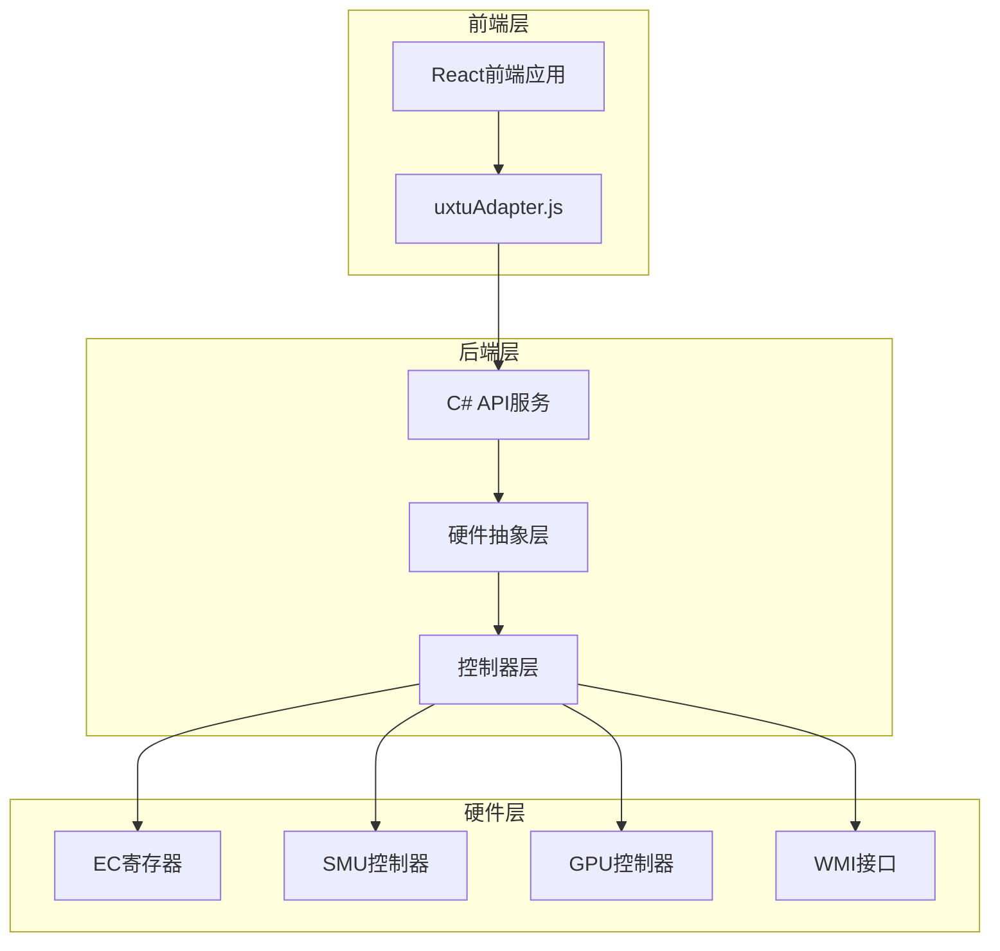
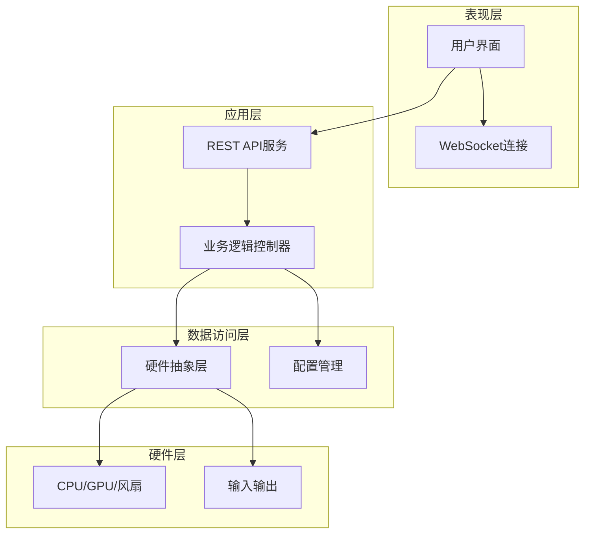
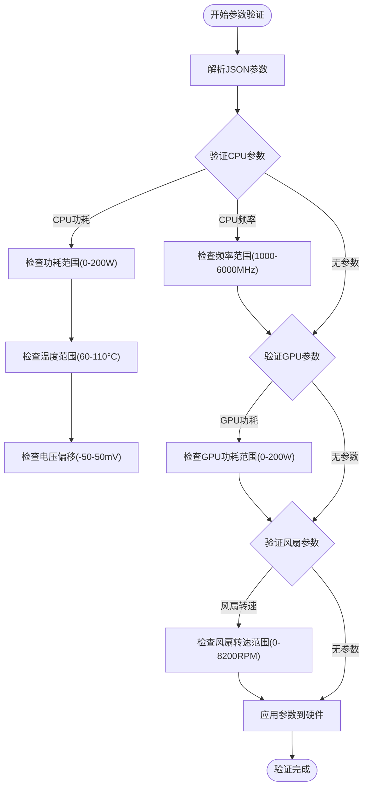
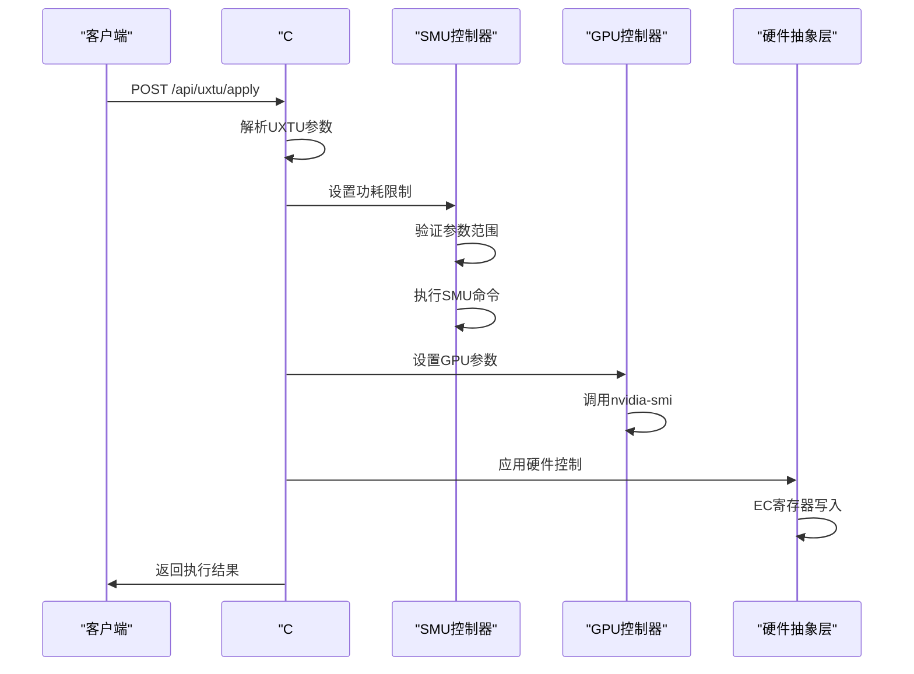
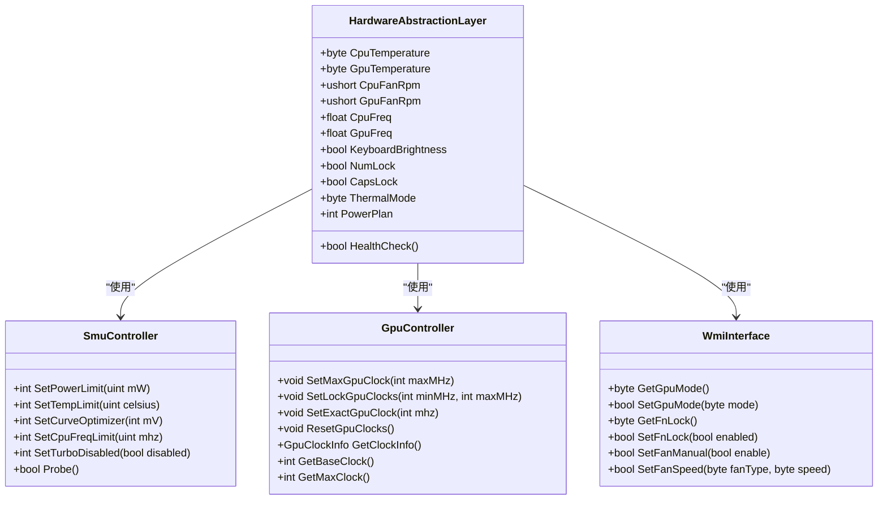
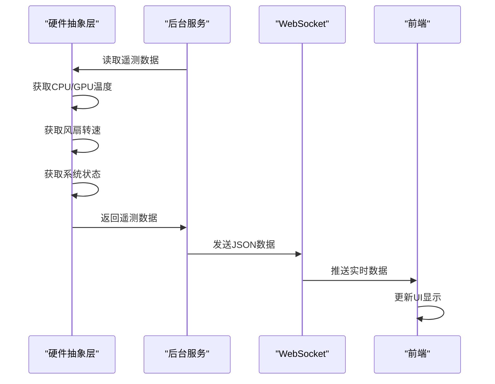
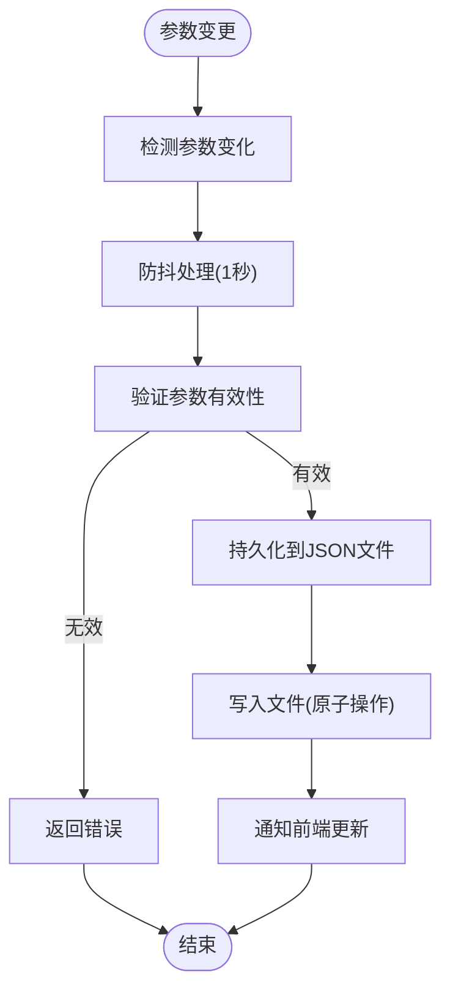
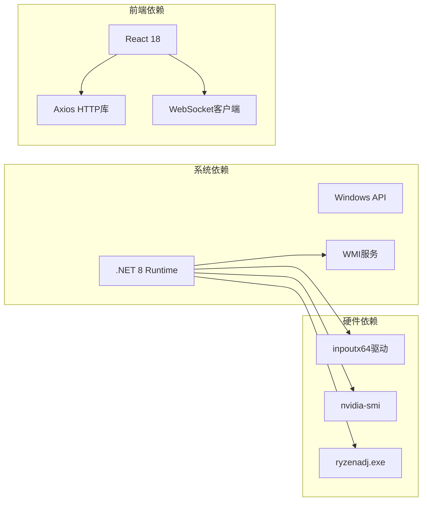
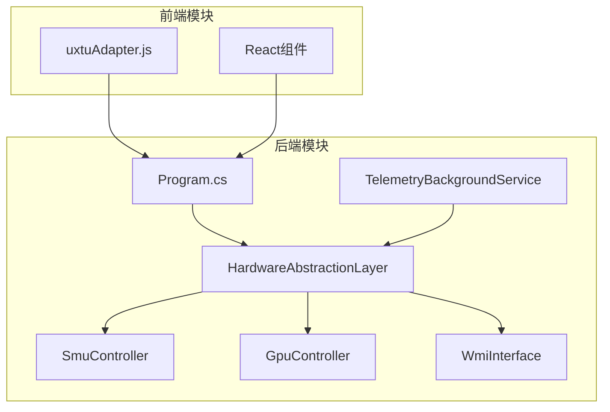

# UXTU参数适配器

<cite>
**本文档引用的文件**
- [uxtuAdapter.js](file://src/services/uxtuAdapter.js)
- [Program.cs](file://server/api/Program.cs)
- [Douzhanzhe.API.csproj](file://server/api/Douzhanzhe.API.csproj)
- [appsettings.json](file://server/api/appsettings.json)
- [HardwareAbstractionLayer.cs](file://server/hal/HardwareAbstractionLayer.cs)
- [SmuController.cs](file://server/hal/SmuController.cs)
- [GpuController.cs](file://server/hal/GpuController.cs)
- [WmiInterface.cs](file://server/api/WmiInterface.cs)
- [TelemetryBackgroundService.cs](file://server/api/TelemetryBackgroundService.cs)
- [custom-params.json](file://server/api/config/custom-params.json)
- [dashboard-default.json](file://server/config/dashboard-default.json)
- [dev-architecture.md](file://docs/dev-architecture.md)
</cite>

## 目录
1. [简介](#简介)
2. [项目结构](#项目结构)
3. [核心组件](#核心组件)
4. [架构概览](#架构概览)
5. [详细组件分析](#详细组件分析)
6. [依赖关系分析](#依赖关系分析)
7. [性能考虑](#性能考虑)
8. [故障排除指南](#故障排除指南)
9. [结论](#结论)
10. [附录](#附录)

## 简介

UXTU参数适配器服务是DOUZHANZHE控制系统的核心组件，负责将UXTU协议的参数映射到硬件抽象层，实现对CPU、GPU、风扇等硬件设备的精确控制。该服务采用前后端分离架构，前端使用React构建用户界面，后端基于.NET 8开发RESTful API服务。

该系统的主要功能包括：
- UXTU协议参数的编码、解码和验证
- 参数状态转换逻辑和数值范围检查
- 硬件控制指令的生成和执行
- 实时遥测数据的采集和传输
- 参数持久化策略和版本管理
- 错误处理和异常恢复机制

## 项目结构

项目采用多层架构设计，主要分为以下层次：

**图表来源**
- [dev-architecture.md:10-46](file://docs/dev-architecture.md#L10-L46)
- [Program.cs:1-22](file://server/api/Program.cs#L1-L22)

**章节来源**
- [dev-architecture.md:1-120](file://docs/dev-architecture.md#L1-L120)
- [Douzhanzhe.API.csproj:1-40](file://server/api/Douzhanzhe.API.csproj#L1-L40)

## 核心组件

### UXTU参数适配器核心功能

UXTU参数适配器服务提供了完整的参数控制能力，包括：

#### 参数映射机制
- **CPU参数映射**：功耗限制、温度限制、频率限制、睿频控制
- **GPU参数映射**：功耗限制、温度限制、频率锁定、显存控制
- **风扇控制映射**：转速目标、模式切换、手动控制
- **系统参数映射**：散热模式、电源计划、键盘背光

#### 状态转换逻辑
- **数值范围检查**：确保参数值在硬件允许范围内
- **类型转换**：统一参数格式和单位转换
- **格式标准化**：标准化参数命名和数据结构

#### 持久化策略
- **本地存储**：使用localStorage进行即时状态保存
- **远程同步**：通过REST API与后端进行参数同步
- **版本管理**：支持参数模板和配置文件的版本控制

**章节来源**
- [uxtuAdapter.js:1-130](file://src/services/uxtuAdapter.js#L1-L130)
- [Program.cs:463-494](file://server/api/Program.cs#L463-L494)

## 架构概览

系统采用分层架构，各层职责明确：

**图表来源**
- [dev-architecture.md:56-87](file://docs/dev-architecture.md#L56-L87)
- [Program.cs:1-22](file://server/api/Program.cs#L1-L22)

## 详细组件分析

### UXTU参数适配器实现

#### 参数映射表

| 参数名称 | 类型 | 范围 | 默认值 | 描述 |
|---------|------|------|--------|------|
| cpuLongPptW | 整数 | 0-200 | 55 | CPU长期功耗限制(W) |
| cpuShortPptW | 整数 | 0-200 | 70 | CPU短期功耗限制(W) |
| cpuTempLimitC | 整数 | 60-110 | 90 | CPU温度限制(°C) |
| gpuPptLimitW | 整数 | 0-200 | 75 | GPU功耗限制(W) |
| cpuVoltageOffset | 整数 | -50-50 | -18 | CPU电压偏移(mV) |
| cpuFreqLimitEnabled | 布尔 | true/false | false | CPU频率限制启用 |
| cpuFreqLimitMhz | 整数 | 1000-6000 | 4500 | CPU频率限制(MHz) |
| cpuTurboDisabled | 布尔 | true/false | false | CPU睿频禁用 |

#### 参数验证流程

**图表来源**
- [Program.cs:463-494](file://server/api/Program.cs#L463-L494)
- [uxtuAdapter.js:109-115](file://src/services/uxtuAdapter.js#L109-L115)

#### 硬件控制序列

**图表来源**
- [Program.cs:463-494](file://server/api/Program.cs#L463-L494)
- [SmuController.cs:61-95](file://server/hal/SmuController.cs#L61-L95)
- [GpuController.cs:42-75](file://server/hal/GpuController.cs#L42-L75)

**章节来源**
- [uxtuAdapter.js:19-27](file://src/services/uxtuAdapter.js#L19-L27)
- [Program.cs:463-494](file://server/api/Program.cs#L463-L494)

### 硬件抽象层分析

#### 硬件接口设计

**图表来源**
- [HardwareAbstractionLayer.cs:19-54](file://server/hal/HardwareAbstractionLayer.cs#L19-L54)
- [SmuController.cs:12-41](file://server/hal/SmuController.cs#L12-L41)
- [GpuController.cs:10-40](file://server/hal/GpuController.cs#L10-L40)
- [WmiInterface.cs:18-48](file://server/api/WmiInterface.cs#L18-L48)

#### 遥测数据流

**图表来源**
- [TelemetryBackgroundService.cs:54-141](file://server/api/TelemetryBackgroundService.cs#L54-L141)
- [Program.cs:87-120](file://server/api/Program.cs#L87-L120)

**章节来源**
- [HardwareAbstractionLayer.cs:113-136](file://server/hal/HardwareAbstractionLayer.cs#L113-L136)
- [TelemetryBackgroundService.cs:54-141](file://server/api/TelemetryBackgroundService.cs#L54-L141)

### 参数持久化策略

#### 配置文件管理

系统采用JSON文件进行参数持久化，主要包括：

| 文件名 | 用途 | 数据类型 | 更新策略 |
|--------|------|----------|----------|
| custom-params.json | 用户自定义参数 | 字典对象 | 异步写入，防抖处理 |
| ui-state.json | 界面状态配置 | UI状态对象 | 即时写入 |
| dashboard-default.json | 仪表盘默认配置 | 配置数组 | 启动时加载 |

#### 持久化流程

**图表来源**
- [Program.cs:538-568](file://server/api/Program.cs#L538-L568)
- [custom-params.json:1-22](file://server/api/config/custom-params.json#L1-L22)

**章节来源**
- [Program.cs:44-55](file://server/api/Program.cs#L44-L55)
- [Program.cs:538-584](file://server/api/Program.cs#L538-L584)

## 依赖关系分析

### 外部依赖

系统依赖的关键外部组件：

**图表来源**
- [Douzhanzhe.API.csproj:12-33](file://server/api/Douzhanzhe.API.csproj#L12-L33)
- [dev-architecture.md:99-114](file://docs/dev-architecture.md#L99-L114)

### 内部模块依赖

**图表来源**
- [Program.cs:1-17](file://server/api/Program.cs#L1-L17)
- [uxtuAdapter.js:1-10](file://src/services/uxtuAdapter.js#L1-L10)

**章节来源**
- [Douzhanzhe.API.csproj:12-33](file://server/api/Douzhanzhe.API.csproj#L12-L33)
- [Program.cs:1-17](file://server/api/Program.cs#L1-L17)

## 性能考虑

### 性能优化策略

#### 1. 遥测数据优化
- **采样频率**：250ms间隔轮询，平衡实时性和性能
- **数据压缩**：使用camelCase命名策略减少传输体积
- **增量更新**：前端实现状态缓存避免重复渲染

#### 2. 硬件访问优化
- **批量操作**：合并多个硬件写入操作
- **缓存机制**：硬件状态缓存减少频繁IO
- **超时控制**：5秒超时防止阻塞等待

#### 3. 网络通信优化
- **连接复用**：WebSocket长连接避免频繁握手
- **错误重连**：3秒自动重连机制
- **流量控制**：参数变更防抖(1秒)减少网络负载

### 性能监控指标

| 指标类型 | 目标值 | 监控方式 | 警告阈值 |
|----------|--------|----------|----------|
| 遥测延迟 | <250ms | WebSocket延迟测量 | <500ms |
| 硬件响应 | <500ms | 命令执行时间 | <2000ms |
| 参数应用 | <1000ms | 完整流程计时 | <3000ms |
| 内存使用 | <100MB | 进程内存监控 | >200MB |

## 故障排除指南

### 常见问题及解决方案

#### 1. 权限相关问题
**症状**：硬件控制失败，返回权限错误
**原因**：缺少管理员权限
**解决方案**：
- 以管理员身份运行C# API服务
- 确认inpoutx64驱动已正确安装
- 检查Windows安全策略设置

#### 2. 硬件兼容性问题
**症状**：某些参数设置无效或报错
**原因**：硬件平台差异
**解决方案**：
- 检查SMU控制器探测结果
- 验证GPU控制器支持情况
- 查看硬件限制文档

#### 3. 网络连接问题
**症状**：WebSocket连接断开，遥测数据丢失
**原因**：网络不稳定或防火墙阻拦
**解决方案**：
- 检查本地防火墙设置
- 验证端口3100可用性
- 重启后端服务

#### 4. 参数验证失败
**症状**：参数应用返回错误
**原因**：参数值超出硬件限制
**解决方案**：
- 检查参数范围限制
- 使用预设模式作为参考
- 逐步调整参数值

**章节来源**
- [Program.cs:687-725](file://server/api/Program.cs#L687-L725)
- [HardwareAbstractionLayer.cs:48-54](file://server/hal/HardwareAbstractionLayer.cs#L48-L54)

### 调试工具使用

#### 1. 内置调试页面
系统提供完整的调试界面，包含：
- 硬件状态实时显示
- 参数设置测试功能
- 硬件命令发送工具
- 连接状态监控

#### 2. 日志分析
- **后端日志**：记录API调用和硬件操作
- **前端日志**：记录用户交互和状态变化
- **系统日志**：Windows事件查看器

#### 3. 性能分析
- **CPU使用率**：监控系统资源占用
- **内存泄漏**：定期检查内存使用情况
- **网络延迟**：分析API响应时间

## 结论

UXTU参数适配器服务是一个功能完整、架构清晰的硬件控制系统。其特点包括：

1. **模块化设计**：清晰的分层架构便于维护和扩展
2. **参数映射**：完善的UXTU协议支持和参数验证
3. **硬件抽象**：统一的硬件访问接口
4. **实时监控**：高效的遥测数据传输
5. **持久化策略**：可靠的配置管理机制

该系统为用户提供了直观的参数控制界面，同时保证了系统的稳定性和安全性。通过合理的错误处理和异常恢复机制，确保了在各种硬件环境下都能提供良好的用户体验。

## 附录

### API接口文档

#### 参数设置接口
- **POST** `/api/uxtu/apply` - 应用UXTU参数
- **POST** `/api/control` - 硬件控制指令
- **POST** `/api/smu/set` - SMU参数设置
- **POST** `/api/gpu/set` - GPU参数设置

#### 参数查询接口
- **GET** `/api/telemetry` - 实时遥测数据
- **GET** `/api/system/info` - 系统信息
- **GET** `/api/custom-params` - 用户参数
- **GET** `/api/ui-state` - 界面状态

#### 监听接口
- **GET** `/ws` - WebSocket遥测流
- **GET** `/api/health` - 健康检查

### 参数范围参考

| 参数类别 | 最小值 | 最大值 | 默认值 | 单位 |
|----------|--------|--------|--------|------|
| 功耗限制 | 0 | 200 | 55-75 | W |
| 温度限制 | 60 | 110 | 85-95 | °C |
| 频率限制 | 1000 | 6000 | 3000-5500 | MHz |
| 风扇转速 | 0 | 8200 | 2000-8000 | RPM |
| 电压偏移 | -50 | 50 | -20 | mV |