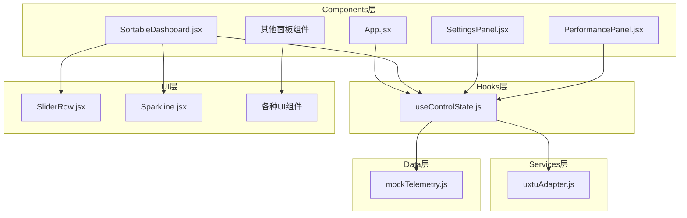
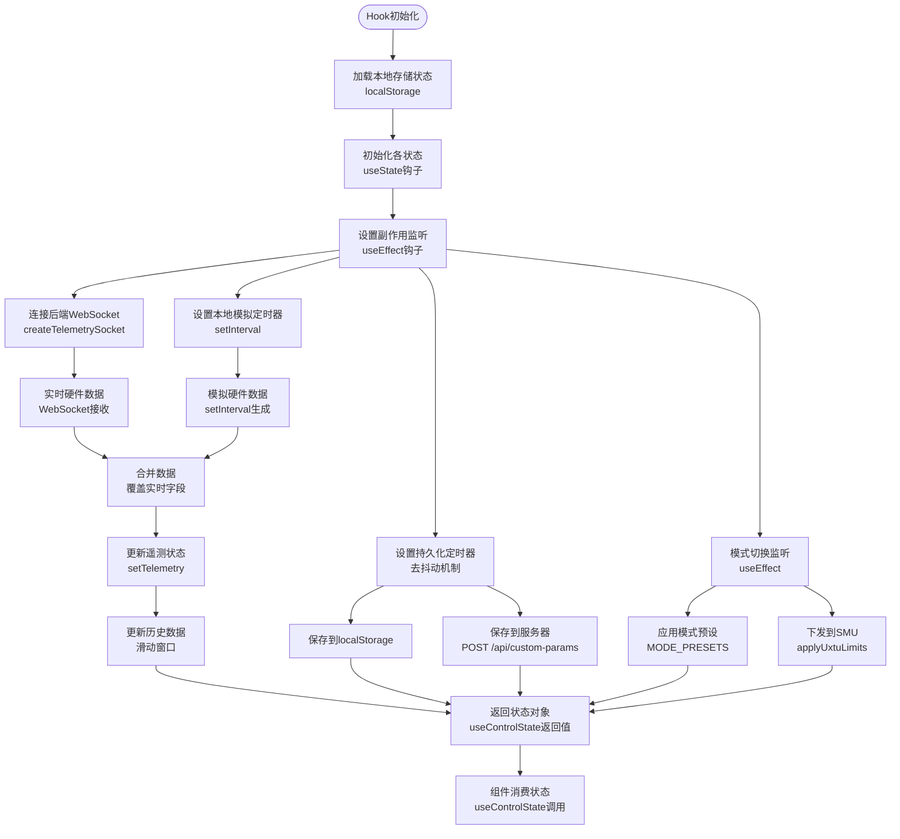
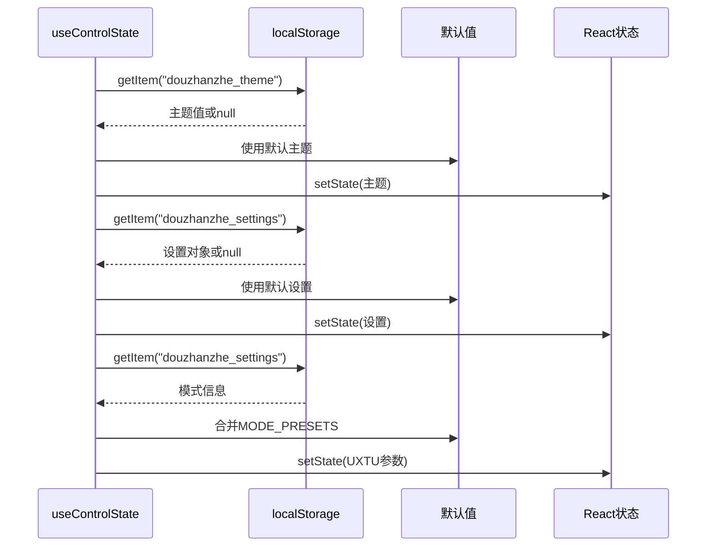
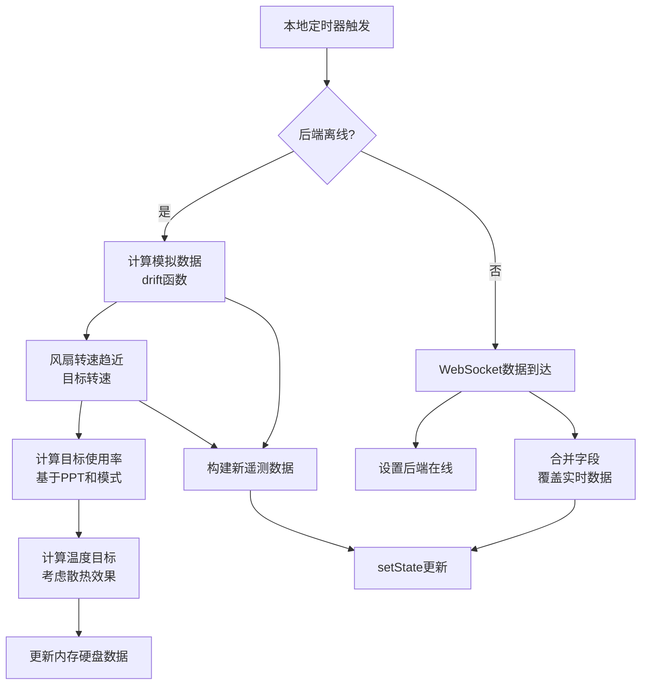
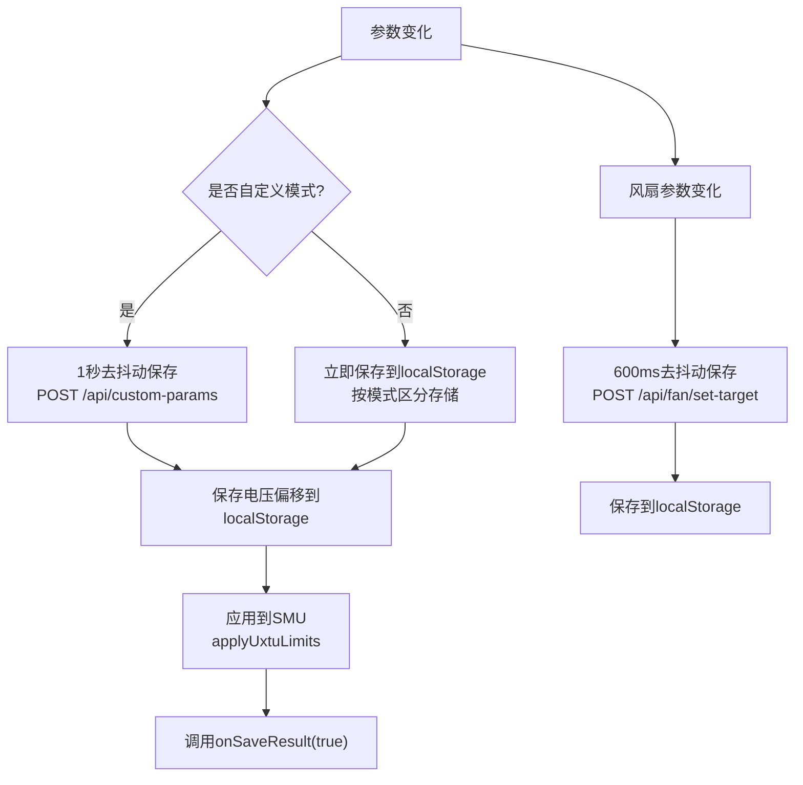
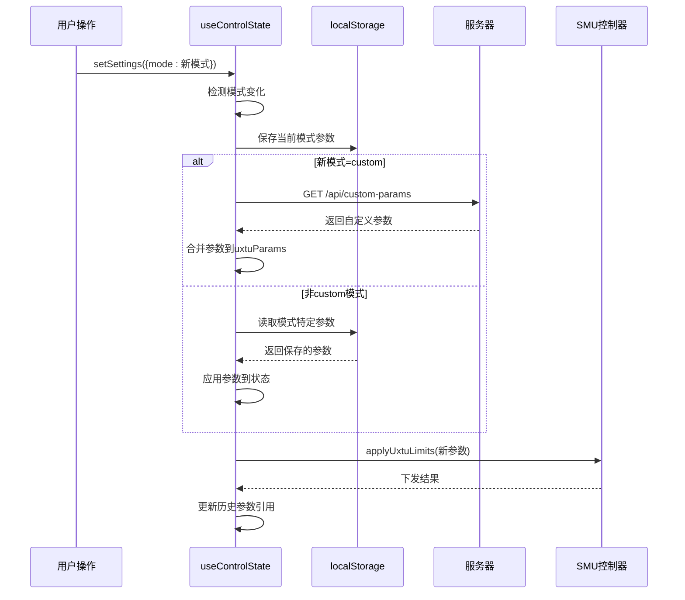
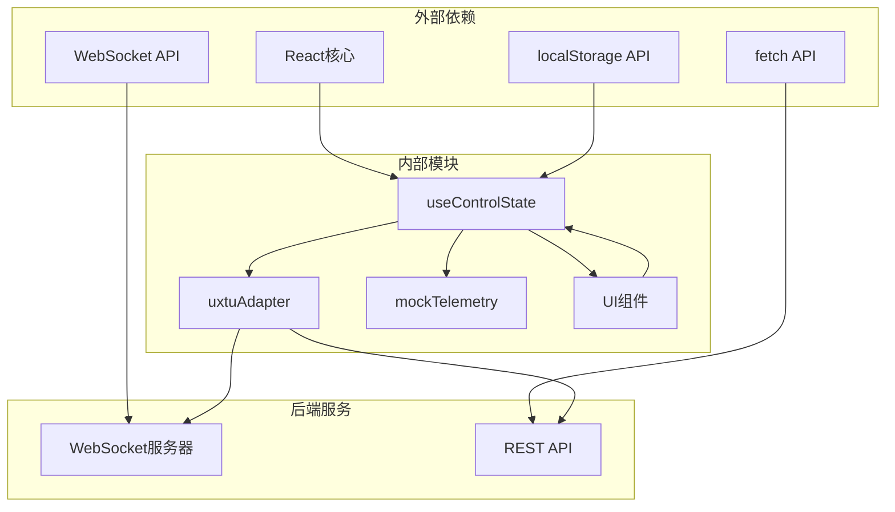
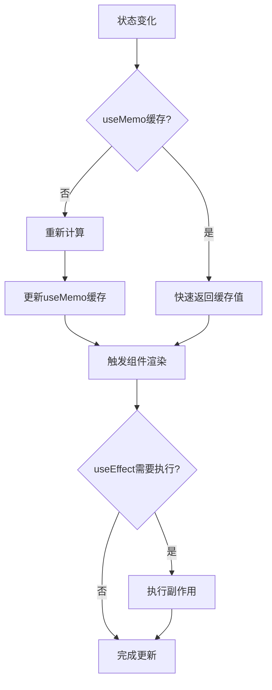

# useControlState自定义Hook技术文档

<cite>
**本文档引用的文件**
- [useControlState.js](file://src/hooks/useControlState.js)
- [App.jsx](file://src/App.jsx)
- [SettingsPanel.jsx](file://src/components/panels/SettingsPanel.jsx)
- [SortableDashboard.jsx](file://src/components/SortableDashboard.jsx)
- [PerformancePanel.jsx](file://src/components/panels/PerformancePanel.jsx)
- [uxtuAdapter.js](file://src/services/uxtuAdapter.js)
- [mockTelemetry.js](file://src/data/mockTelemetry.js)
- [SliderRow.jsx](file://src/components/ui/SliderRow.jsx)
- [Sparkline.jsx](file://src/components/ui/Sparkline.jsx)
</cite>

## 目录
1. [简介](#简介)
2. [项目结构](#项目结构)
3. [核心组件](#核心组件)
4. [架构概览](#架构概览)
5. [详细组件分析](#详细组件分析)
6. [依赖关系分析](#依赖关系分析)
7. [性能考虑](#性能考虑)
8. [故障排除指南](#故障排除指南)
9. [结论](#结论)
10. [附录](#附录)

## 简介

useControlState是一个专为Douzhanzhe控制系统设计的React自定义Hook，负责管理整个系统的全局状态。该Hook实现了复杂的全局状态与本地状态协调机制，包括状态初始化、状态更新逻辑和副作用管理。它处理从硬件设备获取的遥测数据、用户界面状态、系统设置以及与后端服务的通信。

该Hook的核心功能包括：
- 状态持久化到localStorage和服务器
- 实时硬件遥测数据的获取与模拟
- 多模式预设管理（安静、均衡、斗战、野兽模式）
- 风扇目标转速控制
- CPU/GPU参数调节
- 系统主题和设置管理

## 项目结构

Douzhanzhe控制系统采用模块化的前端架构，主要文件组织如下：



**图表来源**
- [useControlState.js:1-355](file://src/hooks/useControlState.js#L1-L355)
- [App.jsx:1-134](file://src/App.jsx#L1-L134)
- [uxtuAdapter.js:1-130](file://src/services/uxtuAdapter.js#L1-L130)

**章节来源**
- [useControlState.js:1-355](file://src/hooks/useControlState.js#L1-L355)
- [App.jsx:1-134](file://src/App.jsx#L1-L134)

## 核心组件

useControlState Hook提供了以下核心状态管理功能：

### 状态类型分类

1. **主题状态** (`theme`)
   - 用户界面主题选择
   - 支持多种预设主题
   - 自动同步到CSS变量

2. **遥测状态** (`telemetry`)
   - 实时硬件监控数据
   - 包括CPU/GPU使用率、温度、频率等
   - 支持WebSocket实时更新和本地模拟

3. **UXTU参数** (`uxtuParams`)
   - CPU/GPU性能调节参数
   - 功耗限制、温度墙、频率限制等
   - 支持多模式独立存储

4. **设置状态** (`settings`)
   - 系统功能开关
   - 键盘背光、锁键状态等
   - 模式选择和行为配置

5. **风扇状态** (`fanLargeRpmTarget`, `fanSmallRpmTarget`)
   - 大风扇(CPU)和小风扇(GPU)目标转速
   - 支持范围限制和实时调整

6. **历史数据** (`history`)
   - 遥测数据的历史记录
   - 用于负载曲线可视化
   - 支持滑动窗口管理

**章节来源**
- [useControlState.js:26-355](file://src/hooks/useControlState.js#L26-L355)

## 架构概览

useControlState采用分层架构设计，实现了状态的层次化管理和跨组件协调：



**图表来源**
- [useControlState.js:26-355](file://src/hooks/useControlState.js#L26-L355)
- [uxtuAdapter.js:58-71](file://src/services/uxtuAdapter.js#L58-L71)

## 详细组件分析

### 状态初始化机制

useControlState的初始化过程采用了智能的默认值加载策略：



**图表来源**
- [useControlState.js:29-84](file://src/hooks/useControlState.js#L29-L84)

### 状态更新逻辑

Hook实现了多层次的状态更新机制：

#### 1. 遥测数据更新流程



**图表来源**
- [useControlState.js:245-336](file://src/hooks/useControlState.js#L245-L336)

#### 2. 参数持久化策略

Hook采用了智能的去抖动和条件保存机制：



**图表来源**
- [useControlState.js:144-169](file://src/hooks/useControlState.js#L144-L169)
- [useControlState.js:112-126](file://src/hooks/useControlState.js#L112-L126)

### 全局状态与本地状态协调机制

#### 1. 模式切换协调



**图表来源**
- [useControlState.js:191-240](file://src/hooks/useControlState.js#L191-L240)

#### 2. 冲突解决策略

Hook实现了多层冲突解决机制：

1. **优先级策略**：自定义模式参数优先于预设参数
2. **时间一致性**：使用ref跟踪前一个状态，避免重复下发
3. **回滚机制**：参数应用失败时保持原有状态
4. **容错处理**：网络错误时继续运行，稍后重试

### 参数配置选项详解

#### 1. 默认值设置

Hook定义了完整的参数默认值体系：

| 参数类别 | 参数名称 | 默认值 | 单位 | 说明 |
|---------|----------|--------|------|------|
| CPU性能 | cpuFreqLimitEnabled | false | 布尔 | 频率限制开关 |
| CPU性能 | cpuFreqLimitMhz | 4500 | MHz | 最大频率限制 |
| CPU性能 | cpuTurboDisabled | false | 布尔 | 关闭睿频 |
| CPU性能 | cpuTempLimitC | 90 | °C | 温度墙 |
| CPU性能 | cpuCoreLimit | 0 | 核心数 | 核心数限制 |
| CPU性能 | cpuPowerPlan | "balance" | 字符串 | 电源计划 |
| CPU性能 | cpuVoltageOffset | 0 | mV | 电压偏移 |
| CPU性能 | cpuLongPptW | 65 | W | 长时功耗限制 |
| CPU性能 | cpuShortPptW | 85 | W | 短时功耗限制 |
| GPU性能 | gpuFreqLimitEnabled | false | 布尔 | GPU频率限制 |
| GPU性能 | gpuFreqLimitMhz | 2600 | MHz | GPU最大频率 |
| GPU性能 | gpuCoreFreqMhz | 2700 | MHz | GPU核心频率 |
| GPU性能 | gpuMemFreqMhz | 1 | 索引 | 显存频率索引 |
| GPU性能 | gpuFreqLocked | false | 布尔 | 锁定GPU频率 |
| GPU性能 | gpuPptLimitW | 115 | W | GPU功耗限制 |
| GPU性能 | gpuTempLimitC | 87 | °C | GPU温度墙 |

#### 2. 验证规则

Hook实现了多层次的数据验证：

1. **范围验证**：确保参数在有效范围内
2. **格式验证**：JSON解析异常处理
3. **兼容性验证**：服务端参数格式转换
4. **类型验证**：参数类型一致性检查

#### 3. 回调函数

Hook支持以下回调函数：

- `onSaveResult(ok)`：保存结果回调
- `onCustomSaveResult(ok)`：自定义参数保存回调
- `onApplied(payload)`：参数应用成功回调

**章节来源**
- [useControlState.js:58-84](file://src/hooks/useControlState.js#L58-L84)
- [useControlState.js:26-355](file://src/hooks/useControlState.js#L26-L355)

## 依赖关系分析

useControlState与其他组件的依赖关系如下：



**图表来源**
- [useControlState.js:1-3](file://src/hooks/useControlState.js#L1-L3)
- [uxtuAdapter.js:58-71](file://src/services/uxtuAdapter.js#L58-L71)

### 组件耦合度分析

- **高内聚**：Hook集中管理所有状态逻辑
- **低耦合**：通过适配器模式隔离外部依赖
- **单向数据流**：状态从Hook流向组件
- **事件驱动**：通过回调函数实现反向通信

**章节来源**
- [useControlState.js:1-355](file://src/hooks/useControlState.js#L1-L355)
- [uxtuAdapter.js:1-130](file://src/services/uxtuAdapter.js#L1-L130)

## 性能考虑

### 1. 状态缓存策略

Hook实现了多层缓存机制：

- **localStorage缓存**：持久化存储用户偏好
- **内存缓存**：React状态管理
- **去抖动缓存**：减少频繁网络请求
- **计算缓存**：useMemo优化复杂计算

### 2. 渲染优化



**图表来源**
- [useControlState.js:171-178](file://src/hooks/useControlState.js#L171-L178)

### 3. 内存管理

- **定时器清理**：useEffect返回清理函数
- **WebSocket连接管理**：自动重连和错误处理
- **事件监听器**：组件卸载时自动清理
- **引用管理**：useRef跟踪关键状态

### 4. 网络优化

- **去抖动机制**：1秒保存间隔，600ms风扇保存间隔
- **条件请求**：仅在必要时发起网络请求
- **错误降级**：网络失败时使用本地数据
- **并发控制**：避免重复的API调用

**章节来源**
- [useControlState.js:144-169](file://src/hooks/useControlState.js#L144-L169)
- [useControlState.js:245-336](file://src/hooks/useControlState.js#L245-L336)

## 故障排除指南

### 常见问题及解决方案

#### 1. 状态不同步问题

**症状**：UI显示与实际硬件状态不一致

**诊断步骤**：
1. 检查后端WebSocket连接状态
2. 验证localStorage数据完整性
3. 确认模式切换逻辑正确执行

**解决方案**：
```javascript
// 强制刷新状态
const forceRefresh = useCallback(() => {
  setSettings(prev => ({ ...prev }));
}, []);
```

#### 2. 参数应用失败

**症状**：修改参数后硬件无响应

**诊断步骤**：
1. 检查SMU控制器状态
2. 验证参数范围有效性
3. 确认权限足够

**解决方案**：
```javascript
// 添加重试机制
const retryApply = useCallback(async (payload, retries = 3) => {
  for (let i = 0; i < retries; i++) {
    try {
      await applyUxtuLimits(payload);
      return true;
    } catch (error) {
      if (i === retries - 1) throw error;
      await new Promise(resolve => setTimeout(resolve, 1000 * (i + 1)));
    }
  }
}, []);
```

#### 3. 性能问题

**症状**：界面卡顿或响应延迟

**诊断工具**：
1. 使用React DevTools分析渲染次数
2. 检查useMemo缓存命中率
3. 监控网络请求频率

**优化建议**：
```javascript
// 减少不必要的状态更新
const optimizedUpdate = useCallback((key, value) => {
  setUxtuParams(prev => {
    if (prev[key] === value) return prev;
    return { ...prev, [key]: value };
  });
}, []);
```

### 调试技巧

#### 1. 状态追踪

```javascript
// 添加状态变更日志
useEffect(() => {
  console.log('uxtuParams changed:', uxtuParams);
}, [uxtuParams]);
```

#### 2. 网络请求监控

```javascript
// 包装fetch请求
const monitoredFetch = useCallback(async (url, options) => {
  console.time(`Request: ${url}`);
  try {
    const response = await fetch(url, options);
    console.timeEnd(`Request: ${url}`);
    return response;
  } catch (error) {
    console.timeEnd(`Request: ${url}`);
    throw error;
  }
}, []);
```

#### 3. 性能分析

```javascript
// 分析渲染性能
const renderCount = useRef(0);
useEffect(() => {
  renderCount.current++;
  console.log(`Component rendered ${renderCount.current} times`);
}, []);
```

**章节来源**
- [useControlState.js:144-169](file://src/hooks/useControlState.js#L144-L169)
- [useControlState.js:245-336](file://src/hooks/useControlState.js#L245-L336)

## 结论

useControlState是一个设计精良的React自定义Hook，它成功地解决了复杂的全局状态管理问题。其架构特点包括：

1. **模块化设计**：清晰的状态分离和职责划分
2. **容错机制**：完善的错误处理和降级策略
3. **性能优化**：多层缓存和去抖动机制
4. **扩展性**：适配器模式便于功能扩展
5. **用户体验**：平滑的状态切换和即时反馈

该Hook为Douzhanzhe控制系统提供了稳定可靠的状态管理基础，支持复杂的硬件控制场景和多用户环境需求。

## 附录

### 使用示例

#### 基本用法
```javascript
// 在组件中使用
const { 
  telemetry, 
  uxtuParams, 
  settings,
  setUxtuParams,
  setSettings 
} = useControlState();

// 更新参数
setUxtuParams(prev => ({
  ...prev,
  cpuTempLimitC: 85
}));
```

#### 高级配置
```javascript
// 自定义保存回调
const onSaveResult = useCallback((ok) => {
  if (ok) {
    toast.success('参数保存成功');
  } else {
    toast.error('参数保存失败');
  }
}, []);

const { uxtuPayload } = useControlState(onSaveResult);
```

#### 最佳实践
1. **合理使用useMemo**：对昂贵的计算进行缓存
2. **避免过度渲染**：使用useCallback优化回调函数
3. **及时清理资源**：在useEffect中返回清理函数
4. **错误处理**：为异步操作添加适当的错误处理
5. **性能监控**：定期检查渲染性能和内存使用