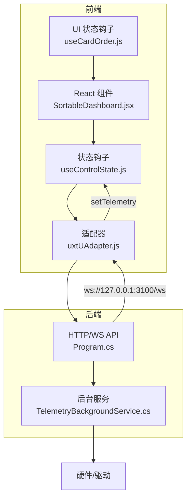
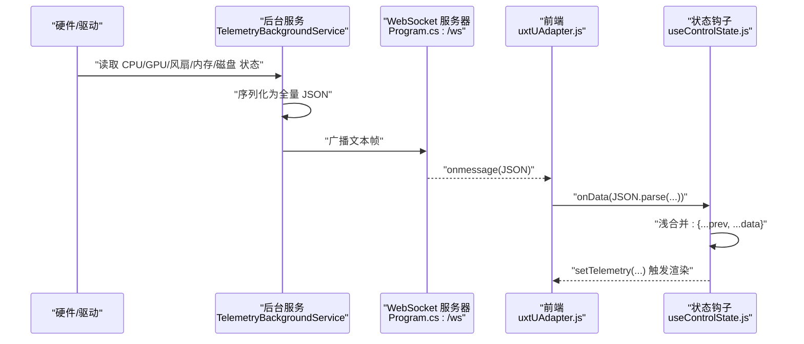
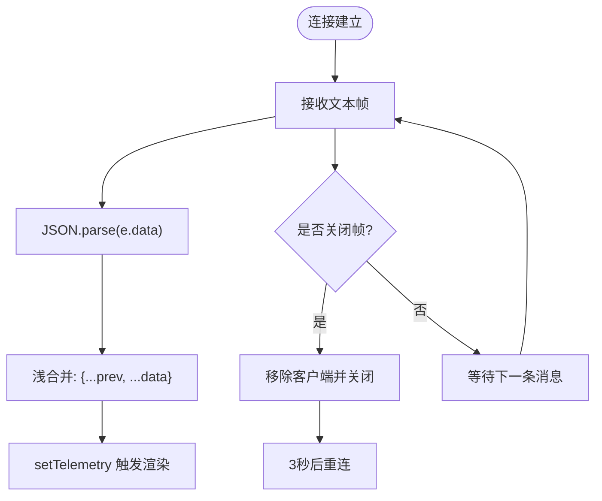
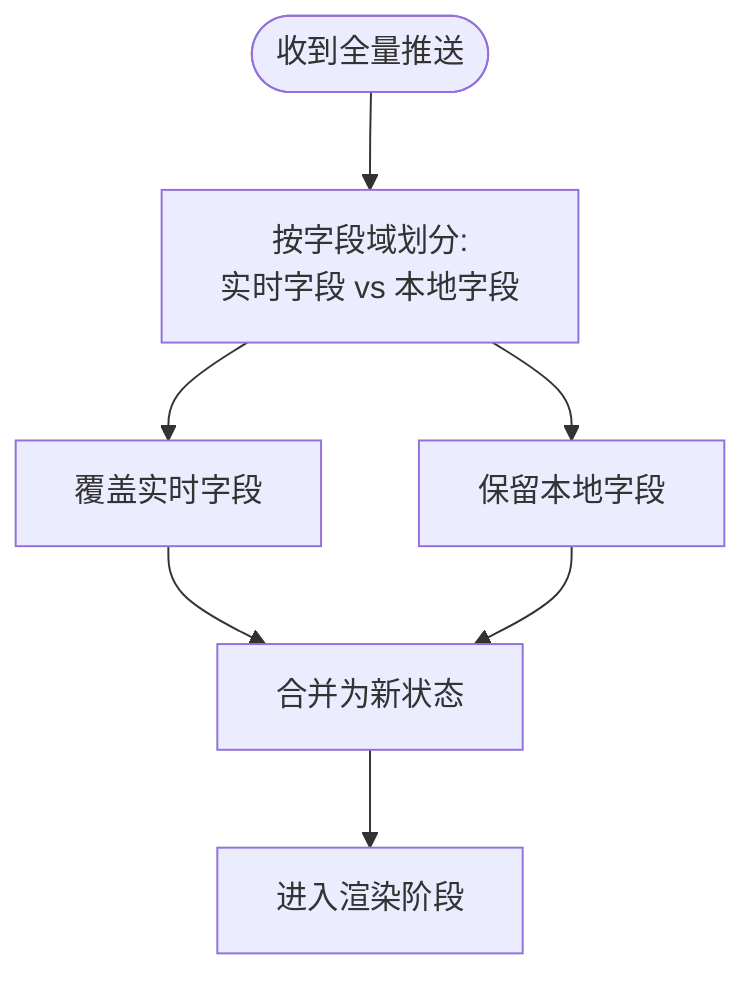
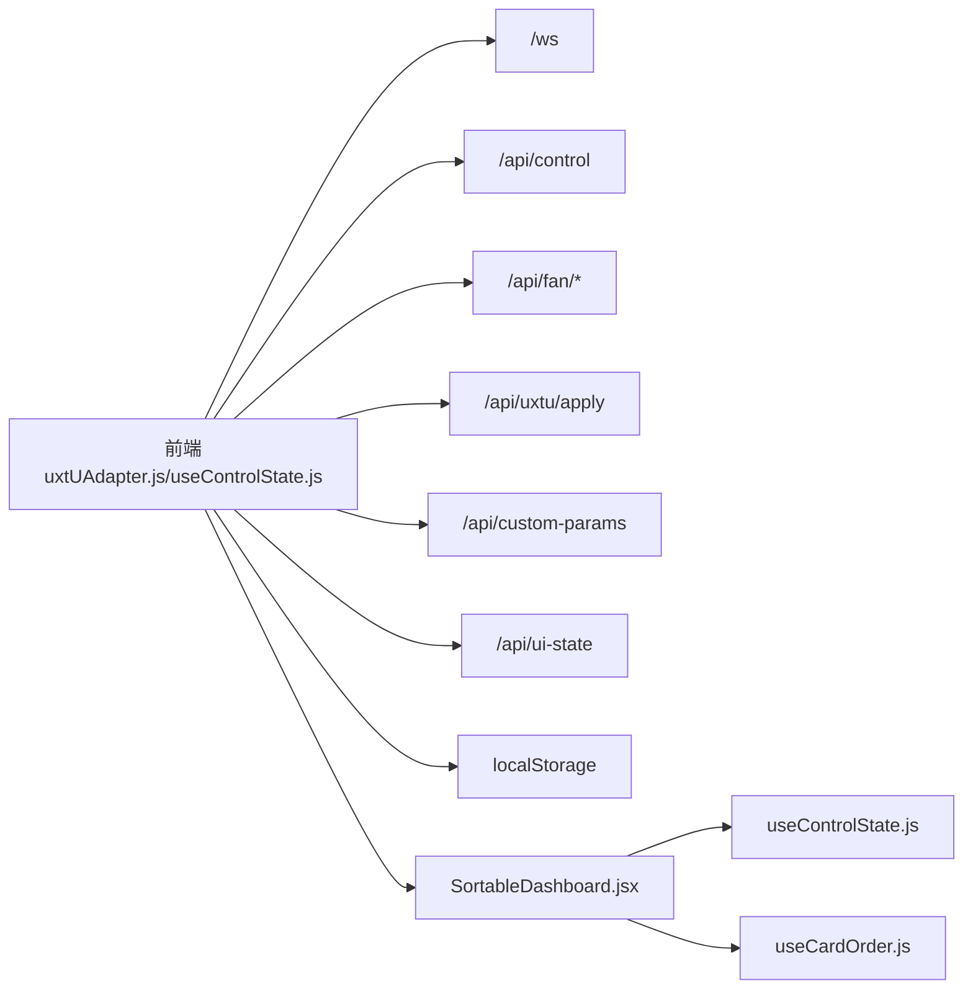

# 实时数据同步

<cite>
**本文引用的文件**
- [TelemetryBackgroundService.cs](file://server/api/TelemetryBackgroundService.cs)
- [Program.cs](file://server/api/Program.cs)
- [uxtUAdapter.js](file://src/services/uxtUAdapter.js)
- [useControlState.js](file://src/hooks/useControlState.js)
- [useCardOrder.js](file://src/hooks/useCardOrder.js)
- [SortableDashboard.jsx](file://src/components/SortableDashboard.jsx)
- [dev-architecture.md](file://docs/dev-architecture.md)
</cite>

## 目录
1. [简介](#简介)
2. [项目结构](#项目结构)
3. [核心组件](#核心组件)
4. [架构总览](#架构总览)
5. [详细组件分析](#详细组件分析)
6. [依赖关系分析](#依赖关系分析)
7. [性能考量](#性能考量)
8. [故障排查指南](#故障排查指南)
9. [结论](#结论)
10. [附录](#附录)

## 简介
本技术文档围绕“实时数据同步”主题，系统梳理从硬件采集、C# 后端推送、WebSocket 消息处理、前端状态合并与渲染，到持久化与一致性保障的完整链路。重点覆盖以下方面：
- WebSocket 消息处理流程：消息接收、解析与状态更新
- 状态合并策略：全量推送下的字段覆盖与增量更新思路
- 缓存与持久化：内存状态、localStorage 与 JSON 文件持久化
- 性能优化：批量更新、防抖与渲染优化
- 一致性保障：事务边界、回滚策略与最终一致性
- 实时监控与调试：后端调试面板与前端回退机制

## 项目结构
前端采用 React Hooks 管理状态，C# 后端提供 WebSocket 与 REST API，负责硬件抽象与控制。

**图表来源**
- [Program.cs:56-86](file://server/api/Program.cs#L56-L86)
- [TelemetryBackgroundService.cs:54-142](file://server/api/TelemetryBackgroundService.cs#L54-L142)
- [uxtUAdapter.js:58-71](file://src/services/uxtUAdapter.js#L58-L71)
- [useControlState.js:242-257](file://src/hooks/useControlState.js#L242-L257)
- [SortableDashboard.jsx:70-95](file://src/components/SortableDashboard.jsx#L70-L95)

**章节来源**
- [dev-architecture.md:10-80](file://docs/dev-architecture.md#L10-L80)

## 核心组件
- C# 后端 API 与 WebSocket
  - 提供 /ws 接入点，接受客户端连接并维护客户端集合
  - 后台服务周期性读取 HAL 状态，构建全量遥测 JSON 并广播给所有已连接客户端
- 前端 WebSocket 适配器
  - 创建 WebSocket 连接，解析服务端推送的 JSON，回调上抛给业务层
  - 断线自动重连，指数退避策略
- 前端状态钩子 useControlState
  - 统一管理 telemetry、uxtuParams、settings、历史曲线等状态
  - 处理 WebSocket 数据到达后的字段覆盖合并
  - 在后端不可用时启用 mock 回退，模拟风扇与负载曲线
- UI 状态钩子 useCardOrder
  - 管理卡片顺序与隐藏状态，支持 localStorage 与服务端持久化
- 仪表盘组件
  - 基于 telemetry/history 渲染仪表与曲线

**章节来源**
- [Program.cs:56-86](file://server/api/Program.cs#L56-L86)
- [TelemetryBackgroundService.cs:54-142](file://server/api/TelemetryBackgroundService.cs#L54-L142)
- [uxtUAdapter.js:58-71](file://src/services/uxtUAdapter.js#L58-L71)
- [useControlState.js:242-336](file://src/hooks/useControlState.js#L242-L336)
- [useCardOrder.js:46-91](file://src/hooks/useCardOrder.js#L46-L91)
- [SortableDashboard.jsx:70-95](file://src/components/SortableDashboard.jsx#L70-L95)

## 架构总览
系统采用“后端采集 + WebSocket 推送 + 前端渲染”的实时架构。后端每 250ms 采集一次硬件状态，构造全量 JSON 推送；前端收到后进行字段覆盖合并，随后驱动 UI 渲染。

**图表来源**
- [TelemetryBackgroundService.cs:64-102](file://server/api/TelemetryBackgroundService.cs#L64-L102)
- [Program.cs:56-86](file://server/api/Program.cs#L56-L86)
- [uxtUAdapter.js:58-71](file://src/services/uxtUAdapter.js#L58-L71)
- [useControlState.js:247-252](file://src/hooks/useControlState.js#L247-L252)

**章节来源**
- [dev-architecture.md:56-80](file://docs/dev-architecture.md#L56-L80)

## 详细组件分析

### WebSocket 消息处理流程
- 连接建立
  - 前端通过 WebSocket 直连后端 ws://127.0.0.1:3100/ws
  - 后端在 /ws 路由中接受请求，加入客户端集合
- 消息接收与解析
  - 前端 onmessage 解析文本帧为对象，回调上抛
  - 后端忽略非文本帧与关闭帧，维持连接生命周期
- 状态更新
  - 前端将新数据与现有状态进行字段覆盖合并，触发渲染
  - 若连接断开，前端自动重连并等待下一次推送

**图表来源**
- [uxtUAdapter.js:58-71](file://src/services/uxtUAdapter.js#L58-L71)
- [Program.cs:66-85](file://server/api/Program.cs#L66-L85)
- [useControlState.js:247-252](file://src/hooks/useControlState.js#L247-L252)

**章节来源**
- [Program.cs:56-86](file://server/api/Program.cs#L56-L86)
- [uxtUAdapter.js:58-71](file://src/services/uxtUAdapter.js#L58-L71)
- [useControlState.js:242-257](file://src/hooks/useControlState.js#L242-L257)

### 状态合并策略
- 合并方式
  - 前端收到后端推送的全量遥测后，执行浅合并：保留 prev 中的完整字段，覆盖 data 中的实时字段
- 字段覆盖范围
  - 仅覆盖来自后端的实时字段（如温度、风扇、占用率等），保留前端计算的历史曲线与本地设置
- 增量更新与全量替换
  - 后端推送为全量 JSON，前端不做增量 diff；若需增量，可在后端侧实现字段级差异生成（当前未实现）
- 冲突解决
  - 以服务端推送为准；若前端在断线期间修改了本地参数，恢复连接后以服务端最新为准（参数持久化由服务端与 localStorage 双重保障）

**图表来源**
- [useControlState.js:247-252](file://src/hooks/useControlState.js#L247-L252)

**章节来源**
- [useControlState.js:242-257](file://src/hooks/useControlState.js#L242-L257)

### 数据缓存机制
- 内存缓存
  - 前端 useControlState 维护 telemetry、uxtuParams、settings、history 等内存状态
  - history 以固定长度队列维护最近 N 帧数据，避免无限增长
- 本地存储（localStorage）
  - 主题、设置、每模式参数记忆、风扇目标、UI 排序与隐藏状态均持久化到 localStorage
  - 启动时优先从 localStorage 恢复，再回退到默认值
- 服务端 JSON 持久化
  - 自定义参数与 UI 状态通过 /api/custom-params 与 /api/ui-state 以 JSON 文件形式持久化
  - 采用临时文件写入 + 原子移动的方式降低损坏风险
- 缓存失效策略
  - localStorage 与 JSON 文件为显式写入，不存在自动失效；模式切换与恢复预设会主动覆盖对应键值
  - WebSocket 断线时启用 mock 回退，确保 UI 不中断

**章节来源**
- [useControlState.js:33-56](file://src/hooks/useControlState.js#L33-L56)
- [useCardOrder.js:46-91](file://src/hooks/useCardOrder.js#L46-L91)
- [Program.cs:538-568](file://server/api/Program.cs#L538-L568)

### 性能优化技术
- 批量更新
  - 后端每 250ms 一次性推送全量遥测，减少连接与解析次数
- 防抖处理
  - 风扇目标转速与自定义参数保存均采用防抖（600ms 与 1000ms），降低后端压力与硬件抖动
  - UI 排序同步采用“退出编辑时”一次性提交，避免频繁网络请求
- 渲染优化
  - history 以固定长度队列维护，避免 OOM
  - 组件基于状态片段渲染，仅在相关字段变化时更新
  - 仪表盘卡片支持拖拽排序与隐藏，减少无关区域渲染

**章节来源**
- [TelemetryBackgroundService.cs:62-62](file://server/api/TelemetryBackgroundService.cs#L62-L62)
- [useControlState.js:112-126](file://src/hooks/useControlState.js#L112-L126)
- [useControlState.js:144-169](file://src/hooks/useControlState.js#L144-L169)
- [useCardOrder.js:78-91](file://src/hooks/useCardOrder.js#L78-L91)
- [SortableDashboard.jsx:70-95](file://src/components/SortableDashboard.jsx#L70-L95)

### 状态一致性保证机制
- 事务边界
  - 参数下发与硬件控制通过 REST API 执行，单次请求即为一个操作单元
- 回滚策略
  - 当前未实现自动回滚；建议在关键控制（如 SMU 功耗/温度墙）前后记录快照，失败时恢复
- 最终一致性
  - 以服务端推送为准，前端断线期间的本地修改在恢复连接后被服务端覆盖
  - UI 排序与参数持久化采用“先写本地、再异步同步服务端”的策略，保证 UI 体验与数据安全

**章节来源**
- [Program.cs:144-202](file://server/api/Program.cs#L144-L202)
- [useControlState.js:242-336](file://src/hooks/useControlState.js#L242-L336)

### 实时监控与调试工具
- 后端调试面板
  - 提供 WebSocket 遥测可视化、风扇控制、SMU 设置、GPU 控制等调试能力
  - 可观察连接状态、字段实时值与硬件控制反馈
- 前端回退机制
  - WebSocket 断线时自动启用 mock 数据，维持 UI 可用性与交互流畅

**章节来源**
- [Program.cs:687-691](file://server/api/Program.cs#L687-L691)
- [uxtUAdapter.js:67-69](file://src/services/uxtUAdapter.js#L67-L69)
- [useControlState.js:259-336](file://src/hooks/useControlState.js#L259-L336)

## 依赖关系分析
- 前端依赖后端提供的 API 与 WebSocket：
  - /ws：全量遥测推送
  - /api/control：系统开关与散热模式等控制
  - /api/fan/set-target：手动风扇控制
  - /api/uxtu/apply：参数下发
  - /api/custom-params、/api/ui-state：持久化读写
- 前端状态依赖 localStorage 与服务端 JSON：
  - 每模式参数记忆、UI 排序与隐藏状态
- 组件依赖状态钩子：
  - SortableDashboard 依赖 telemetry 与 history
  - useCardOrder 依赖 localStorage 与服务端

**图表来源**
- [Program.cs:56-86](file://server/api/Program.cs#L56-L86)
- [Program.cs:144-202](file://server/api/Program.cs#L144-L202)
- [Program.cs:345-394](file://server/api/Program.cs#L345-L394)
- [Program.cs:463-494](file://server/api/Program.cs#L463-L494)
- [Program.cs:538-568](file://server/api/Program.cs#L538-L568)
- [uxtUAdapter.js:58-71](file://src/services/uxtUAdapter.js#L58-L71)
- [useControlState.js:242-336](file://src/hooks/useControlState.js#L242-L336)
- [useCardOrder.js:46-91](file://src/hooks/useCardOrder.js#L46-L91)
- [SortableDashboard.jsx:70-95](file://src/components/SortableDashboard.jsx#L70-L95)

**章节来源**
- [dev-architecture.md:66-87](file://docs/dev-architecture.md#L66-L87)

## 性能考量
- 推送频率与带宽
  - 250ms 全量推送兼顾实时性与带宽；若硬件数据变化稀疏，可考虑后端按需/阈值上报
- 前端渲染
  - 仅在相关字段变化时更新，history 队列限制长度，避免内存膨胀
- 网络与控制
  - 控制类请求采用防抖，减少对 HAL 的频繁写入与系统抖动
- 存储可靠性
  - 服务端 JSON 写入采用原子替换，降低损坏概率

## 故障排查指南
- WebSocket 无法连接
  - 检查后端是否监听 3100 端口，确认防火墙放行
  - 查看前端日志与重连间隔（3 秒）
- 遥测不更新
  - 确认后端后台服务是否运行，硬件驱动是否加载
  - 使用后端调试面板观察 /ws 连接状态与字段变化
- 控制无效
  - 检查 /api/control 与 /api/fan/* 返回值，确认管理员权限与驱动加载
- 参数未生效
  - 检查 /api/custom-params 是否成功写入，确认当前模式是否为 custom
- UI 排序丢失
  - 检查 /api/ui-state 是否成功写入，确认 localStorage 权限

**章节来源**
- [Program.cs:56-86](file://server/api/Program.cs#L56-L86)
- [Program.cs:144-202](file://server/api/Program.cs#L144-L202)
- [Program.cs:345-394](file://server/api/Program.cs#L345-L394)
- [Program.cs:538-568](file://server/api/Program.cs#L538-L568)
- [uxtUAdapter.js:58-71](file://src/services/uxtUAdapter.js#L58-L71)
- [useControlState.js:259-336](file://src/hooks/useControlState.js#L259-L336)

## 结论
本系统通过“后端全量推送 + 前端字段覆盖合并”的简单可靠方案，实现了低延迟的实时数据同步。配合 localStorage 与服务端 JSON 的双重持久化、防抖与渲染优化，既保证了用户体验，又降低了系统复杂度。未来可考虑引入增量差异与更细粒度的事务控制，进一步提升一致性与可维护性。

## 附录
- 关键实现位置
  - WebSocket 接入与广播：[Program.cs:56-86](file://server/api/Program.cs#L56-L86)，[TelemetryBackgroundService.cs:54-142](file://server/api/TelemetryBackgroundService.cs#L54-L142)
  - 前端适配器与回退：[uxtUAdapter.js:58-71](file://src/services/uxtUAdapter.js#L58-L71)，[useControlState.js:259-336](file://src/hooks/useControlState.js#L259-L336)
  - 状态与持久化：[useControlState.js:26-169](file://src/hooks/useControlState.js#L26-L169)，[useCardOrder.js:46-91](file://src/hooks/useCardOrder.js#L46-L91)
  - 架构与数据流：[dev-architecture.md:56-87](file://docs/dev-architecture.md#L56-L87)