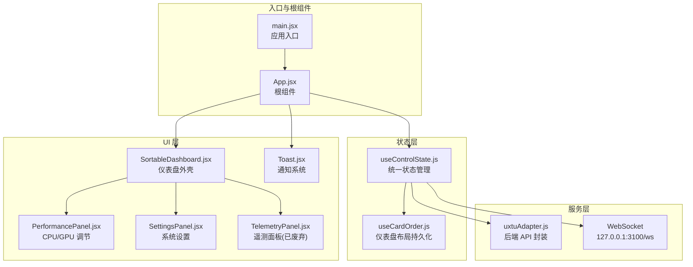
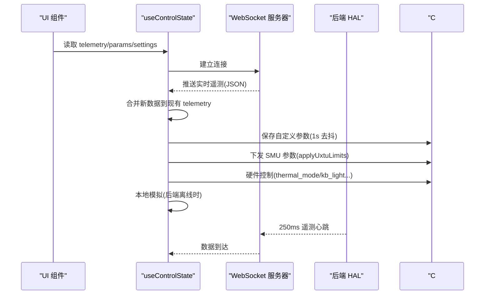
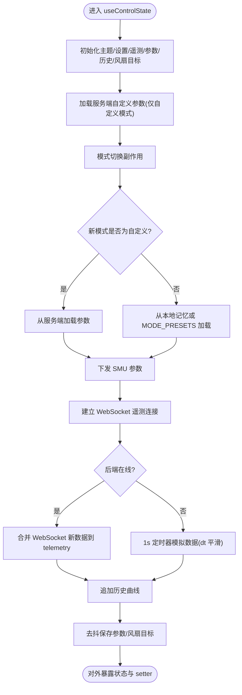
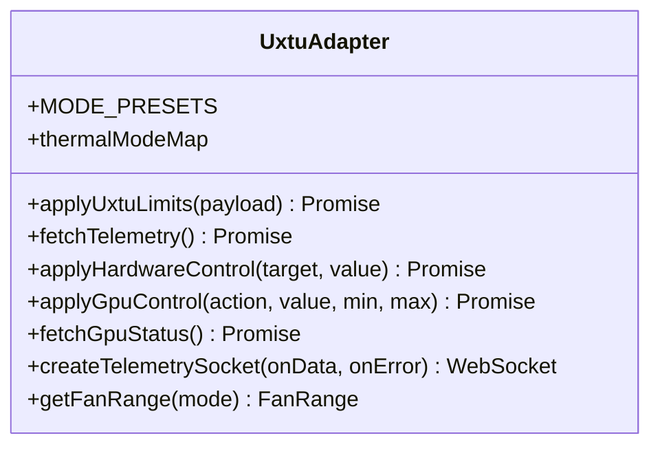
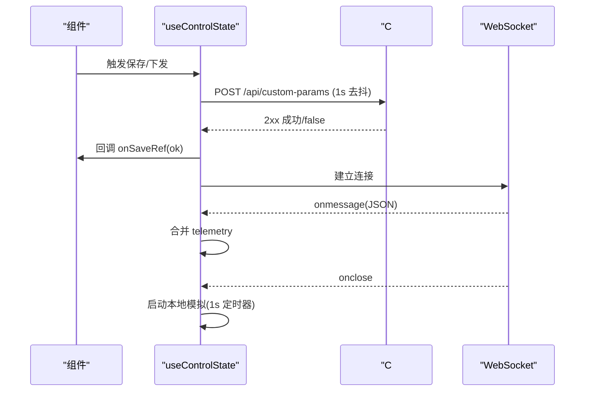
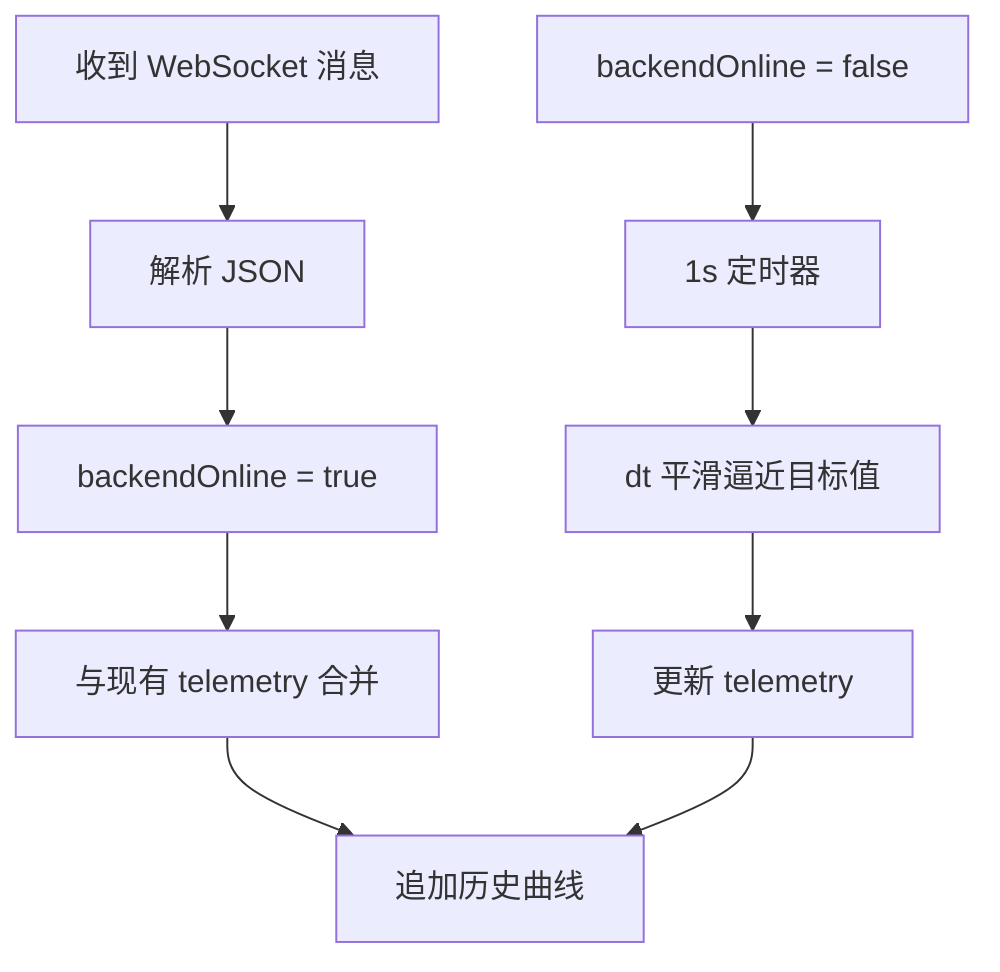
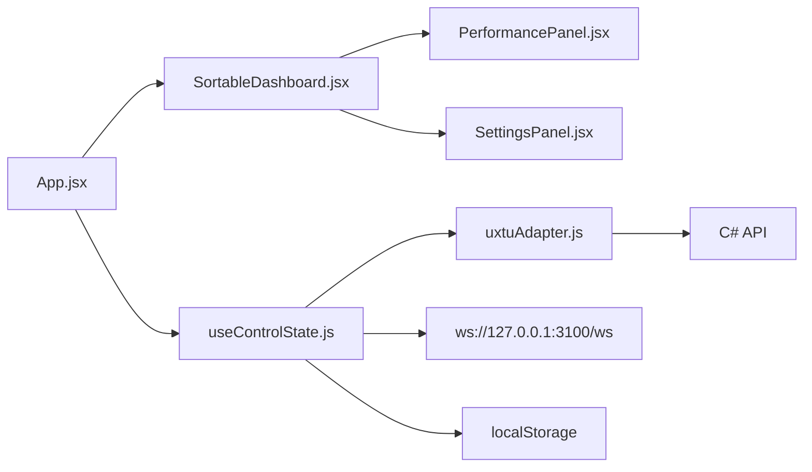

# 状态管理

<cite>
**本文引用的文件**
- [useControlState.js](file://src/hooks/useControlState.js)
- [uxtuAdapter.js](file://src/services/uxtuAdapter.js)
- [App.jsx](file://src/App.jsx)
- [main.jsx](file://src/main.jsx)
- [SortableDashboard.jsx](file://src/components/SortableDashboard.jsx)
- [PerformancePanel.jsx](file://src/components/panels/PerformancePanel.jsx)
- [SettingsPanel.jsx](file://src/components/panels/SettingsPanel.jsx)
- [TelemetryPanel.jsx](file://src/components/panels/TelemetryPanel.jsx)
- [useCardOrder.js](file://src/hooks/useCardOrder.js)
- [Toast.jsx](file://src/components/ui/Toast.jsx)
- [custom-params.json](file://server/api/config/custom-params.json)
- [Program.cs](file://server/api/Program.cs)
- [TelemetryBackgroundService.cs](file://server/api/TelemetryBackgroundService.cs)
</cite>

## 目录
1. [简介](#简介)
2. [项目结构](#项目结构)
3. [核心组件](#核心组件)
4. [架构总览](#架构总览)
5. [详细组件分析](#详细组件分析)
6. [依赖关系分析](#依赖关系分析)
7. [性能考量](#性能考量)
8. [故障排查指南](#故障排查指南)
9. [结论](#结论)
10. [附录](#附录)

## 简介
本文件系统性梳理 DOUZHANZHE-Control 前端状态管理，重点围绕自定义 Hook useControlState 的设计与实现，详解 UXTU 参数管理机制（验证、状态转换、持久化），以及与后端 API 的通信状态管理（请求状态、错误处理、重试）。同时分析实时数据的状态更新策略（WebSocket 消息处理、状态合并、性能优化），并提供状态调试与开发辅助工具的使用指南。

## 项目结构
前端采用 React + Hooks 架构，状态集中在 useControlState 中统一管理，服务层通过 uxtuAdapter 封装后端 API，UI 层由多个面板组件组成，仪表盘支持可拖拽排序并通过 useCardOrder 持久化布局。

**图表来源**
- [main.jsx:1-14](file://src/main.jsx#L1-L14)
- [App.jsx:1-134](file://src/App.jsx#L1-L134)
- [useControlState.js:1-355](file://src/hooks/useControlState.js#L1-L355)
- [useCardOrder.js:1-128](file://src/hooks/useCardOrder.js#L1-L128)
- [uxtuAdapter.js:1-130](file://src/services/uxtuAdapter.js#L1-L130)
- [SortableDashboard.jsx:1-247](file://src/components/SortableDashboard.jsx#L1-L247)
- [PerformancePanel.jsx:1-213](file://src/components/panels/PerformancePanel.jsx#L1-L213)
- [SettingsPanel.jsx:1-124](file://src/components/panels/SettingsPanel.jsx#L1-L124)
- [TelemetryPanel.jsx:1-121](file://src/components/panels/TelemetryPanel.jsx#L1-L121)
- [Toast.jsx:1-50](file://src/components/ui/Toast.jsx#L1-L50)

**章节来源**
- [main.jsx:1-14](file://src/main.jsx#L1-L14)
- [App.jsx:1-134](file://src/App.jsx#L1-L134)
- [useControlState.js:1-355](file://src/hooks/useControlState.js#L1-L355)
- [useCardOrder.js:1-128](file://src/hooks/useCardOrder.js#L1-L128)
- [uxtuAdapter.js:1-130](file://src/services/uxtuAdapter.js#L1-L130)
- [SortableDashboard.jsx:1-247](file://src/components/SortableDashboard.jsx#L1-L247)
- [PerformancePanel.jsx:1-213](file://src/components/panels/PerformancePanel.jsx#L1-L213)
- [SettingsPanel.jsx:1-124](file://src/components/panels/SettingsPanel.jsx#L1-L124)
- [TelemetryPanel.jsx:1-121](file://src/components/panels/TelemetryPanel.jsx#L1-L121)
- [Toast.jsx:1-50](file://src/components/ui/Toast.jsx#L1-L50)

## 核心组件
- useControlState：统一状态中心，负责主题、遥测、UXTU 参数、设置、风扇目标转速、历史曲线、后端在线状态等。
- uxtuAdapter：封装后端 API，包括 WebSocket 遥测、SMU/硬件控制、GPU 控制、模式预设等。
- useCardOrder：仪表盘卡片排序与隐藏状态的持久化。
- App/面板组件：消费 useControlState 提供的状态，触发副作用（下发参数、控制硬件、保存设置）。

**章节来源**
- [useControlState.js:26-355](file://src/hooks/useControlState.js#L26-L355)
- [uxtuAdapter.js:1-130](file://src/services/uxtuAdapter.js#L1-L130)
- [useCardOrder.js:1-128](file://src/hooks/useCardOrder.js#L1-L128)
- [App.jsx:1-134](file://src/App.jsx#L1-L134)

## 架构总览
前端通过 WebSocket 与后端 HAL 通信，实时接收遥测数据；当后端不可用时，useControlState 使用本地模拟逻辑生成近似真实的数据流，保证 UI 流畅体验。参数层面，useControlState 在“自定义模式”下与服务端进行参数同步，在“非自定义模式”下使用 MODE_PRESETS 或本地记忆参数。

**图表来源**
- [useControlState.js:242-336](file://src/hooks/useControlState.js#L242-L336)
- [uxtuAdapter.js:58-71](file://src/services/uxtuAdapter.js#L58-L71)
- [Program.cs:128-198](file://server/api/Program.cs#L128-L198)
- [TelemetryBackgroundService.cs:54-142](file://server/api/TelemetryBackgroundService.cs#L54-L142)

## 详细组件分析

### useControlState 设计与实现
- 全局状态管理
  - 主题 theme、设置 settings、遥测 telemetry、UXTU 参数 uxtuParams、风扇目标转速 fanLargeRpmTarget/fanSmallRpmTarget、历史曲线 history、后端在线状态 backendOnline。
  - 通过 localStorage 持久化主题与设置；自定义参数在“自定义模式”下持久化至服务端，其他模式下持久化到本地键空间。
- 本地状态同步
  - 通过 loadFromLS/saveToLS 封装 localStorage 读写，统一错误兜底。
  - 模式切换时，先将当前参数保存到旧模式键，再从新模式键或 MODE_PRESETS 加载，避免覆盖用户已保存的自定义参数。
- 副作用处理
  - 遥测历史 history：每次 telemetry 更新时追加，维持固定长度，用于绘制负载曲线。
  - 风扇目标转速变更：600ms 去抖后调用后端接口保存并下发。
  - 自定义参数保存：1s 去抖，仅在“自定义模式”且服务端参数加载完成后执行，成功/失败通过回调通知。
  - SMU 参数下发：模式切换或手动下发时调用 applyUxtuLimits，失败时记录日志。
  - 后端不可用回退：WebSocket 断开时启用本地模拟定时器，按 dt 平滑逼近目标值，模拟 CPU/GPU 负载、温度、风扇等。
- UXTU 参数管理
  - 默认参数 defaultParams + MODE_PRESETS 合并，支持每模式独立记忆。
  - 服务端自定义参数加载：仅在“自定义模式”下应用服务端保存的参数，否则使用预设。
  - 参数归一化：如 gpuMemFreqMhz 旧值需映射到索引范围。
  - 电压偏移：无论模式如何，均持久化到 localStorage 以保证跨模式一致性。
- 与后端 API 通信
  - 遥测：WebSocket ws://127.0.0.1:3100/ws，心跳 250ms；断线自动重连。
  - 参数：POST /api/custom-params 同步自定义参数；GET /api/custom-params 加载服务端参数。
  - 硬件控制：/api/control 下发 thermal_mode、kb_light 等；/api/fan/set-target 设置风扇目标转速。
  - SMU：/api/uxtu/apply 下发参数；/api/smu/set 调整 SMU 参数。
  - GPU：/api/gpu/set 控制频率/显存；/api/gpu/status 查询状态。
- 实时数据更新策略
  - WebSocket 消息到达时，将新字段与旧 telemetry 合并，保留完整字段集。
  - 后端离线时，基于 dt 的平滑算法模拟 CPU/GPU 使用率、温度、风扇转速等，确保 UI 响应。
  - 历史曲线：每帧追加，最多保留固定数量，避免内存膨胀。

**图表来源**
- [useControlState.js:26-355](file://src/hooks/useControlState.js#L26-L355)

**章节来源**
- [useControlState.js:26-355](file://src/hooks/useControlState.js#L26-L355)

### uxtuAdapter 参数管理机制
- 模式映射与预设
  - thermalModeMap：将前端模式映射到 HAL 热管理模式。
  - MODE_PRESETS：包含 silent/office/gaming/beast/custom 的完整参数集合，覆盖 CPU/GPU 功耗、温度墙、风扇目标等。
  - getFanRange：根据模式返回风扇转速上下限。
- 参数下发与查询
  - applyUxtuLimits：POST /api/uxtu/apply 下发参数到 SMU。
  - applyHardwareControl：POST /api/control 控制硬件（如 thermal_mode、kb_light）。
  - applyGpuControl/fetchGpuStatus：控制 GPU 频率/显存与查询状态。
  - applySmuSet/fetchSmuInfo：调整 SMU 参数与读取信息。
- WebSocket 遥测
  - createTelemetrySocket：直连 ws://127.0.0.1:3100/ws，断线 3s 重连。

**图表来源**
- [uxtuAdapter.js:1-130](file://src/services/uxtuAdapter.js#L1-L130)

**章节来源**
- [uxtuAdapter.js:1-130](file://src/services/uxtuAdapter.js#L1-L130)

### 与后端 API 的通信状态管理
- 请求状态跟踪
  - useControlState 内部通过 backendOnline 标识后端可用性；WebSocket onopen/onclose 更新该状态。
  - UI 层根据 backendOnline 切换真实遥测与本地模拟。
- 错误处理
  - fetch 请求统一捕获异常，失败回调 onSaveRef/current(false)，成功回调 onSaveRef/current(true)。
  - WebSocket 断线自动重连，避免 UI 长时间无响应。
- 重试机制
  - WebSocket 断线后 3s 重连；参数保存与风扇目标设置采用去抖，减少频繁请求。
  - SMU 参数下发失败时记录日志，不阻塞 UI。

**图表来源**
- [useControlState.js:144-169](file://src/hooks/useControlState.js#L144-L169)
- [useControlState.js:242-257](file://src/hooks/useControlState.js#L242-L257)
- [useControlState.js:260-336](file://src/hooks/useControlState.js#L260-L336)

**章节来源**
- [useControlState.js:144-169](file://src/hooks/useControlState.js#L144-L169)
- [useControlState.js:242-257](file://src/hooks/useControlState.js#L242-L257)
- [useControlState.js:260-336](file://src/hooks/useControlState.js#L260-L336)

### 实时数据的状态更新策略
- WebSocket 消息处理
  - onData 解析 JSON，setBackendOnline(true)，与旧 telemetry 合并，保留完整字段集。
  - onError 将 backendOnline 置为 false，触发本地模拟。
- 状态合并与性能优化
  - 合并策略：保留原有字段，仅覆盖来自 WS 的实时字段，避免 UI 抖动。
  - 历史曲线：固定长度队列，slice(-MAX_HISTORY) 截断，降低内存占用。
  - dt 平滑：根据两次 tick 时间差动态调整平滑强度，保证在不同帧率下的稳定性。
- 本地模拟
  - 基于目标转速、冷却系数、模式偏差、PPT/温度墙等计算下一时刻状态，使用随机扰动模拟真实波动。

**图表来源**
- [useControlState.js:242-257](file://src/hooks/useControlState.js#L242-L257)
- [useControlState.js:260-336](file://src/hooks/useControlState.js#L260-L336)

**章节来源**
- [useControlState.js:242-257](file://src/hooks/useControlState.js#L242-L257)
- [useControlState.js:260-336](file://src/hooks/useControlState.js#L260-L336)

### 状态调试工具与开发辅助
- Toast 通知
  - ToastProvider 提供全局通知上下文，支持 success/error/info 三类消息，自动定时消失。
  - App.jsx 将保存结果通过 toast 展示，便于确认操作反馈。
- 开发辅助
  - 本地模拟：后端离线时仍可观察 UI 行为，便于开发与测试。
  - 模式切换：自动下发参数到 SMU，失败时提示错误。
  - UI 排序：useCardOrder 支持拖拽排序、隐藏卡片、重置排序，并与服务端同步。

**章节来源**
- [Toast.jsx:1-50](file://src/components/ui/Toast.jsx#L1-L50)
- [App.jsx:23-134](file://src/App.jsx#L23-L134)
- [useCardOrder.js:1-128](file://src/hooks/useCardOrder.js#L1-L128)

## 依赖关系分析
- 组件耦合
  - App.jsx 依赖 useControlState、Toast、uxtuAdapter，作为状态与 UI 的桥接层。
  - SortableDashboard.jsx 依赖 useCardOrder、uxtuAdapter、PerformancePanel/SettingsPanel，负责布局与参数面板。
  - PerformancePanel.jsx/SettingsPanel.jsx 依赖 uxtuAdapter，直接发起后端请求。
- 外部依赖
  - WebSocket 服务器：ws://127.0.0.1:3100/ws，心跳 250ms。
  - C# API：/api/custom-params、/api/control、/api/uxtu/apply、/api/fan/set-target 等。
  - localStorage：主题、设置、仪表盘布局、每模式参数记忆、风扇目标等。

**图表来源**
- [App.jsx:1-134](file://src/App.jsx#L1-L134)
- [useControlState.js:1-355](file://src/hooks/useControlState.js#L1-L355)
- [uxtuAdapter.js:1-130](file://src/services/uxtuAdapter.js#L1-L130)

**章节来源**
- [App.jsx:1-134](file://src/App.jsx#L1-L134)
- [useControlState.js:1-355](file://src/hooks/useControlState.js#L1-L355)
- [uxtuAdapter.js:1-130](file://src/services/uxtuAdapter.js#L1-L130)

## 性能考量
- 去抖策略
  - 自定义参数保存与风扇目标设置分别采用 1s 与 600ms 去抖，显著降低请求频率。
- 历史曲线截断
  - 固定长度队列，避免无限增长导致内存压力。
- dt 平滑
  - 根据帧间隔动态调整平滑强度，兼顾响应速度与稳定性。
- WebSocket 心跳
  - 250ms 遥测心跳，配合断线重连，保证低延迟与高可用。

[本节为通用性能讨论，无需列出具体文件来源]

## 故障排查指南
- 后端不可用
  - 现象：遥测停止更新，界面显示本地模拟数据。
  - 排查：确认 ws://127.0.0.1:3100/ws 是否可达；检查后端 TelemetryBackgroundService 是否运行。
- 参数保存失败
  - 现象：保存自定义参数回调返回 false。
  - 排查：检查 /api/custom-params 接口状态；确认浏览器跨域配置；查看 onSaveRef 回调日志。
- SMU 下发失败
  - 现象：模式切换或手动下发后无效果。
  - 排查：查看 applyUxtuLimits 返回值；确认 HAL 权限与驱动版本；检查日志输出。
- 硬件控制无效
  - 现象：切换 thermal_mode/kb_light 等无效。
  - 排查：确认 /api/control 接口返回；检查 HAL 映射值；确认设备支持对应功能。
- UI 排序异常
  - 现象：拖拽排序后重启丢失。
  - 排查：确认 useCardOrder 是否成功加载服务端 UI 状态；检查 /api/ui-state GET/POST。

**章节来源**
- [useControlState.js:144-169](file://src/hooks/useControlState.js#L144-L169)
- [useControlState.js:242-257](file://src/hooks/useControlState.js#L242-L257)
- [Program.cs:128-198](file://server/api/Program.cs#L128-L198)
- [TelemetryBackgroundService.cs:54-142](file://server/api/TelemetryBackgroundService.cs#L54-L142)

## 结论
useControlState 将主题、设置、遥测、参数、布局等状态集中管理，结合 uxtuAdapter 对后端 API 的统一封装，实现了稳定可靠的前端状态体系。通过去抖、历史曲线截断、dt 平滑与 WebSocket 心跳等策略，兼顾了性能与用户体验。建议在后续迭代中进一步增强错误上报与可观测性，以便更高效地定位问题。

[本节为总结性内容，无需列出具体文件来源]

## 附录
- 服务端配置
  - 自定义参数默认值位于 server/api/config/custom-params.json，用于首次加载与回退。
- 后端实现要点
  - Program.cs 暴露 /api/telemetry 与 WebSocket 路由；TelemetryBackgroundService 每 250ms 推送一次遥测。
- UI 状态持久化
  - useCardOrder 通过 /api/ui-state 与 localStorage 双通道持久化仪表盘布局。

**章节来源**
- [custom-params.json:1-22](file://server/api/config/custom-params.json#L1-L22)
- [Program.cs:1-107](file://server/api/Program.cs#L1-L107)
- [Program.cs:128-198](file://server/api/Program.cs#L128-L198)
- [TelemetryBackgroundService.cs:54-142](file://server/api/TelemetryBackgroundService.cs#L54-L142)
- [useCardOrder.js:1-128](file://src/hooks/useCardOrder.js#L1-L128)