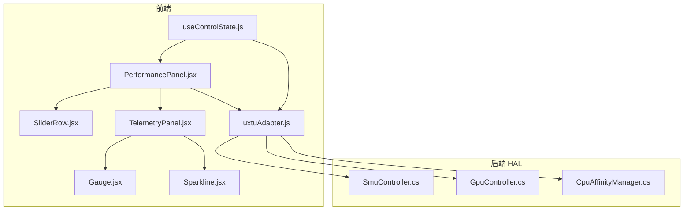
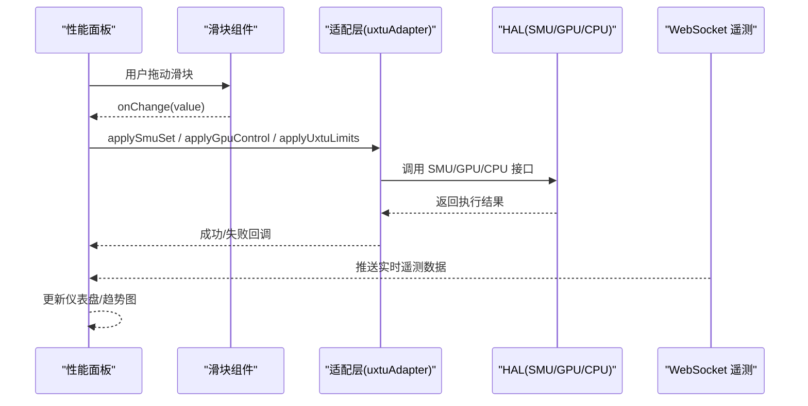
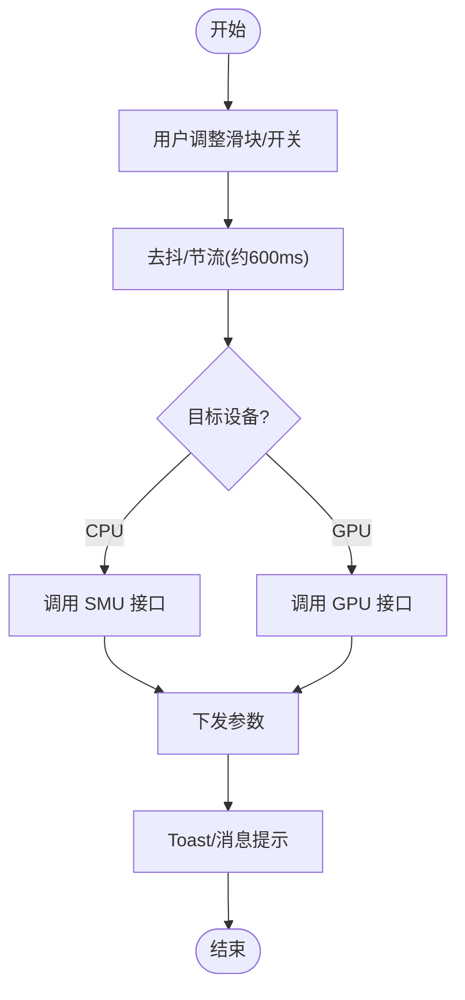
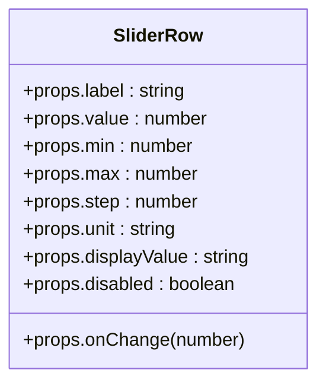
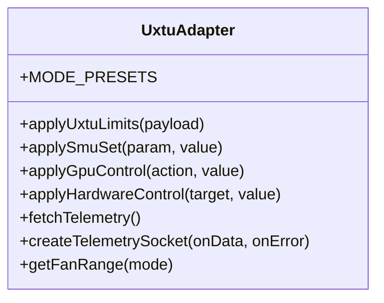
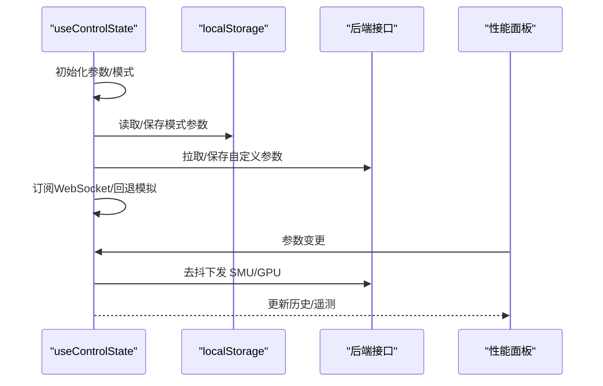
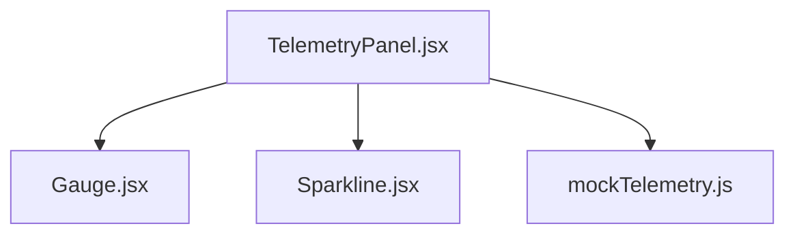
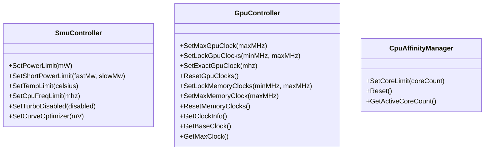
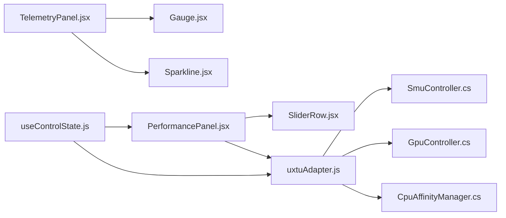

# 性能面板

<cite>
**本文引用的文件**
- [PerformancePanel.jsx](file://src/components/panels/PerformancePanel.jsx)
- [SliderRow.jsx](file://src/components/ui/SliderRow.jsx)
- [uxtuAdapter.js](file://src/services/uxtuAdapter.js)
- [useControlState.js](file://src/hooks/useControlState.js)
- [GpuController.cs](file://server/hal/GpuController.cs)
- [CpuAffinityManager.cs](file://server/hal/CpuAffinityManager.cs)
- [SmuController.cs](file://server/hal/SmuController.cs)
- [TelemetryPanel.jsx](file://src/components/panels/TelemetryPanel.jsx)
- [Gauge.jsx](file://src/components/ui/Gauge.jsx)
- [Sparkline.jsx](file://src/components/ui/Sparkline.jsx)
- [mockTelemetry.js](file://src/data/mockTelemetry.js)
- [Douzhanzhe.API.http](file://server/api/Douzhanzhe.API.http)
</cite>

## 目录
1. [简介](#简介)
2. [项目结构](#项目结构)
3. [核心组件](#核心组件)
4. [架构总览](#架构总览)
5. [详细组件分析](#详细组件分析)
6. [依赖关系分析](#依赖关系分析)
7. [性能与稳定性考量](#性能与稳定性考量)
8. [故障排查指南](#故障排查指南)
9. [结论](#结论)
10. [附录](#附录)

## 简介
本文件聚焦“性能面板”组件，系统性阐述其在前端的交互设计与参数控制机制，以及与后端 HAL 层（SMU、GPU、CPU 核心限制）的联动方式。内容涵盖：
- CPU/GPU 性能滑块的交互设计与参数下发流程
- 性能模式切换、功率限制配置与散热策略设置
- 滑块组件的定制实现（数值范围、步进、禁用态与实时反馈）
- 性能调优的算法逻辑（安全边界与温度-性能平衡）
- 性能监控数据的可视化与历史趋势分析
- 用户权限与安全防护的实现要点

## 项目结构
性能面板位于前端 React 组件树中，通过适配层与后端 HAL 通信，形成“UI 参数 -> 适配层 -> HAL -> 硬件”的闭环。

**图表来源**
- [PerformancePanel.jsx:13-213](file://src/components/panels/PerformancePanel.jsx#L13-L213)
- [SliderRow.jsx:1-23](file://src/components/ui/SliderRow.jsx#L1-L23)
- [uxtuAdapter.js:19-129](file://src/services/uxtuAdapter.js#L19-L129)
- [useControlState.js:26-355](file://src/hooks/useControlState.js#L26-L355)
- [TelemetryPanel.jsx:20-121](file://src/components/panels/TelemetryPanel.jsx#L20-L121)
- [Gauge.jsx:1-21](file://src/components/ui/Gauge.jsx#L1-L21)
- [Sparkline.jsx:1-40](file://src/components/ui/Sparkline.jsx#L1-L40)
- [SmuController.cs:12-142](file://server/hal/SmuController.cs#L12-L142)
- [GpuController.cs:10-116](file://server/hal/GpuController.cs#L10-L116)
- [CpuAffinityManager.cs:15-101](file://server/hal/CpuAffinityManager.cs#L15-L101)

**章节来源**
- [PerformancePanel.jsx:13-213](file://src/components/panels/PerformancePanel.jsx#L13-L213)
- [uxtuAdapter.js:19-129](file://src/services/uxtuAdapter.js#L19-L129)
- [useControlState.js:26-355](file://src/hooks/useControlState.js#L26-L355)

## 核心组件
- 性能面板（PerformancePanel）：提供 CPU/GPU 的滑块与开关控件，负责参数变更与下发。
- 滑块行（SliderRow）：通用滑块 UI，支持标签、单位、禁用态与显示值覆盖。
- 适配层（uxtuAdapter）：封装后端接口（SMU、GPU、硬件控制、遥测），提供模式预设与风扇区间。
- 控制状态钩子（useControlState）：集中管理参数持久化、模式切换、历史数据与 WebSocket 遥测。
- 遥测面板（TelemetryPanel）：展示 CPU/GPU 占用率、温度、频率与风扇曲线。
- UI 辅助（Gauge、Sparkline）：仪表盘与趋势图组件。

**章节来源**
- [PerformancePanel.jsx:13-213](file://src/components/panels/PerformancePanel.jsx#L13-L213)
- [SliderRow.jsx:1-23](file://src/components/ui/SliderRow.jsx#L1-L23)
- [uxtuAdapter.js:19-129](file://src/services/uxtuAdapter.js#L19-L129)
- [useControlState.js:26-355](file://src/hooks/useControlState.js#L26-L355)
- [TelemetryPanel.jsx:20-121](file://src/components/panels/TelemetryPanel.jsx#L20-L121)
- [Gauge.jsx:1-21](file://src/components/ui/Gauge.jsx#L1-L21)
- [Sparkline.jsx:1-40](file://src/components/ui/Sparkline.jsx#L1-L40)

## 架构总览
性能面板的控制流分为“参数变更 -> 去抖/节流 -> 适配层 -> HAL -> 硬件”，同时通过 WebSocket 实时接收遥测数据并驱动 UI。

**图表来源**
- [PerformancePanel.jsx:51-67](file://src/components/panels/PerformancePanel.jsx#L51-L67)
- [uxtuAdapter.js:19-129](file://src/services/uxtuAdapter.js#L19-L129)
- [useControlState.js:242-257](file://src/hooks/useControlState.js#L242-L257)

## 详细组件分析

### 性能面板（CPU/GPU 调节）
- CPU 调节项
  - 频率限制开关与最大频率滑块（范围与步进由面板定义）
  - 关闭睿频开关
  - 温度墙滑块
  - 核心数限制开关与核心数滑块
  - 电源计划按钮组（高效/平衡/最佳性能）
  - 电压偏移滑块
  - 长时/短时功耗滑块
- GPU 调节项
  - 核心频率滑块（可锁定/限制）
  - 显存频率滑块（枚举值映射）
  - 核心频率限制开关与最大频率滑块
  - 锁定核心频率开关
  - 重置 GPU 按钮

交互要点
- 参数变更采用去抖策略，避免高频请求冲击后端。
- SMU 参数通过“延迟队列”合并更新，提升稳定性。
- GPU 控制根据锁定/限制状态选择不同动作（锁定、限制、重置）。

**图表来源**
- [PerformancePanel.jsx:21-35](file://src/components/panels/PerformancePanel.jsx#L21-L35)
- [PerformancePanel.jsx:135-144](file://src/components/panels/PerformancePanel.jsx#L135-L144)
- [PerformancePanel.jsx:158-163](file://src/components/panels/PerformancePanel.jsx#L158-L163)
- [PerformancePanel.jsx:178-192](file://src/components/panels/PerformancePanel.jsx#L178-L192)

**章节来源**
- [PerformancePanel.jsx:13-213](file://src/components/panels/PerformancePanel.jsx#L13-L213)

### 滑块组件（SliderRow）定制实现
- 支持标签、数值、最小/最大值、步进、单位与禁用态
- 显示值可覆盖（如显存频率的枚举别名）
- 禁用态降低透明度并禁用交互
- 默认样式统一，便于主题一致性

**图表来源**
- [SliderRow.jsx:1-23](file://src/components/ui/SliderRow.jsx#L1-L23)

**章节来源**
- [SliderRow.jsx:1-23](file://src/components/ui/SliderRow.jsx#L1-L23)

### 适配层（uxtuAdapter）与模式预设
- 提供 SMU、GPU、硬件控制与遥测接口
- 定义模式预设（静音/办公/游戏/野兽/自定义），覆盖温度墙、功耗、频率与风扇目标
- 提供风扇区间映射，确保目标转速落在硬件允许范围内

**图表来源**
- [uxtuAdapter.js:19-129](file://src/services/uxtuAdapter.js#L19-L129)

**章节来源**
- [uxtuAdapter.js:19-129](file://src/services/uxtuAdapter.js#L19-L129)

### 控制状态钩子（useControlState）与参数持久化
- 维护遥测与历史数据，构建 CPU/GPU/风扇/温度趋势
- 模式切换时保存/加载参数，支持“自定义模式”与各模式独立记忆
- 通过 WebSocket 实时更新遥测；后端不可用时回退到模拟数据
- 对风扇目标转速与 SMU 参数进行去抖持久化

**图表来源**
- [useControlState.js:26-355](file://src/hooks/useControlState.js#L26-L355)

**章节来源**
- [useControlState.js:26-355](file://src/hooks/useControlState.js#L26-L355)

### 遥测面板（TelemetryPanel）与可视化
- 展示 CPU/GPU 占用率、温度、频率与显存使用
- 使用仪表盘与折线图呈现实时与历史趋势
- 风扇区域提供目标转速滑块，并结合风扇区间限制

**图表来源**
- [TelemetryPanel.jsx:20-121](file://src/components/panels/TelemetryPanel.jsx#L20-L121)
- [Gauge.jsx:1-21](file://src/components/ui/Gauge.jsx#L1-L21)
- [Sparkline.jsx:1-40](file://src/components/ui/Sparkline.jsx#L1-L40)
- [mockTelemetry.js:1-22](file://src/data/mockTelemetry.js#L1-L22)

**章节来源**
- [TelemetryPanel.jsx:20-121](file://src/components/panels/TelemetryPanel.jsx#L20-L121)
- [Gauge.jsx:1-21](file://src/components/ui/Gauge.jsx#L1-L21)
- [Sparkline.jsx:1-40](file://src/components/ui/Sparkline.jsx#L1-L40)
- [mockTelemetry.js:1-22](file://src/data/mockTelemetry.js#L1-L22)

### HAL 层对接（SMU/GPU/CPU）
- SMU 控制：通过外部工具调用设置功耗、温度、频率与曲线优化
- GPU 控制：封装 nvidia-smi 子进程，支持锁定/限制/重置核心与显存频率
- CPU 核心限制：通过进程亲和性掩码限制可用核心数，并监听新进程自动应用

**图表来源**
- [SmuController.cs:12-142](file://server/hal/SmuController.cs#L12-L142)
- [GpuController.cs:10-116](file://server/hal/GpuController.cs#L10-L116)
- [CpuAffinityManager.cs:15-101](file://server/hal/CpuAffinityManager.cs#L15-L101)

**章节来源**
- [SmuController.cs:12-142](file://server/hal/SmuController.cs#L12-L142)
- [GpuController.cs:10-116](file://server/hal/GpuController.cs#L10-L116)
- [CpuAffinityManager.cs:15-101](file://server/hal/CpuAffinityManager.cs#L15-L101)

## 依赖关系分析
- 性能面板依赖滑块组件与适配层；适配层进一步依赖 HAL 层实现具体硬件操作
- 控制状态钩子为面板与适配层提供统一的数据源与持久化策略
- 遥测面板依赖仪表盘与趋势图组件，数据来自 WebSocket 或模拟

**图表来源**
- [PerformancePanel.jsx:13-213](file://src/components/panels/PerformancePanel.jsx#L13-L213)
- [SliderRow.jsx:1-23](file://src/components/ui/SliderRow.jsx#L1-L23)
- [uxtuAdapter.js:19-129](file://src/services/uxtuAdapter.js#L19-L129)
- [useControlState.js:26-355](file://src/hooks/useControlState.js#L26-L355)
- [TelemetryPanel.jsx:20-121](file://src/components/panels/TelemetryPanel.jsx#L20-L121)
- [Gauge.jsx:1-21](file://src/components/ui/Gauge.jsx#L1-L21)
- [Sparkline.jsx:1-40](file://src/components/ui/Sparkline.jsx#L1-L40)
- [SmuController.cs:12-142](file://server/hal/SmuController.cs#L12-L142)
- [GpuController.cs:10-116](file://server/hal/GpuController.cs#L10-L116)
- [CpuAffinityManager.cs:15-101](file://server/hal/CpuAffinityManager.cs#L15-L101)

**章节来源**
- [PerformancePanel.jsx:13-213](file://src/components/panels/PerformancePanel.jsx#L13-L213)
- [uxtuAdapter.js:19-129](file://src/services/uxtuAdapter.js#L19-L129)
- [useControlState.js:26-355](file://src/hooks/useControlState.js#L26-L355)

## 性能与稳定性考量
- 去抖与节流
  - SMU/GPU 参数变更采用约 600ms 延迟队列，减少频繁调用带来的系统波动
  - 风扇目标转速与自定义参数保存采用约 600ms/1s 去抖，避免过度 IO
- 安全边界
  - 模式预设内置温度墙、功耗与频率上限，作为默认安全基线
  - 风扇目标转速在模式对应区间内取值，防止超出硬件允许范围
- 性能-温度平衡
  - WebSocket 遥测与模拟数据共同驱动温度目标，结合冷却能力动态调整负载期望
  - 通过功耗与温度参数影响目标使用率，维持稳定热平衡

**章节来源**
- [PerformancePanel.jsx:21-35](file://src/components/panels/PerformancePanel.jsx#L21-L35)
- [useControlState.js:112-126](file://src/hooks/useControlState.js#L112-L126)
- [useControlState.js:144-169](file://src/hooks/useControlState.js#L144-L169)
- [uxtuAdapter.js:109-119](file://src/services/uxtuAdapter.js#L109-L119)
- [uxtuAdapter.js:98-106](file://src/services/uxtuAdapter.js#L98-L106)
- [useControlState.js:298-314](file://src/hooks/useControlState.js#L298-L314)

## 故障排查指南
- 无法连接后端或 WebSocket
  - 现象：遥测面板无数据或闪烁
  - 处理：确认后端服务运行；查看 WebSocket 连接日志；必要时启用本地模拟数据
- SMU/GPU 设置失败
  - 现象：Toast 提示失败或无响应
  - 处理：检查外部工具路径与权限；确认 HAL 层接口返回状态；查看去抖队列是否被频繁打断
- 参数未生效
  - 现象：更改滑块后硬件未变化
  - 处理：确认去抖时间已过；检查模式切换是否触发了预设下发；验证电源计划与散热模式是否正确
- 风扇目标转速异常
  - 现象：目标与实际不一致或超出区间
  - 处理：确认模式对应的风扇区间；检查去抖保存是否成功；验证后端风扇接口

**章节来源**
- [useControlState.js:242-257](file://src/hooks/useControlState.js#L242-L257)
- [PerformancePanel.jsx:55-67](file://src/components/panels/PerformancePanel.jsx#L55-L67)
- [uxtuAdapter.js:19-27](file://src/services/uxtuAdapter.js#L19-L27)
- [uxtuAdapter.js:77-88](file://src/services/uxtuAdapter.js#L77-L88)

## 结论
性能面板通过“滑块组件 + 适配层 + HAL 层”的分层设计，实现了对 CPU/GPU 参数的精细化控制与实时反馈。配合模式预设、风扇区间与去抖策略，系统在保证性能的同时兼顾稳定性与安全性。遥测面板与历史趋势为用户提供了直观的可视化支撑，辅助做出更合理的调优决策。

## 附录
- 接口与端点参考
  - 后端基础地址示例：[Douzhanzhe.API.http:1-7](file://server/api/Douzhanzhe.API.http#L1-L7)
- 数据模型与范围
  - 模式预设字段：温度墙、功耗、频率与风扇目标
  - 风扇区间：静音/办公/游戏/野兽/自定义模式下的大/小风扇转速区间
  - 遥测数据：CPU/GPU 占用率、温度、频率、显存与风扇实际/最大转速

**章节来源**
- [Douzhanzhe.API.http:1-7](file://server/api/Douzhanzhe.API.http#L1-L7)
- [uxtuAdapter.js:109-119](file://src/services/uxtuAdapter.js#L109-L119)
- [uxtuAdapter.js:98-106](file://src/services/uxtuAdapter.js#L98-L106)
- [mockTelemetry.js:1-22](file://src/data/mockTelemetry.js#L1-L22)